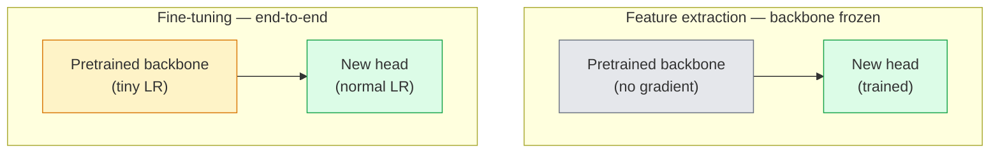

# Transfer Learning & Fine-Tuning

> 其他人花费了一百万个图形处理器小时来教网络边缘、纹理和对象部分是什么样子的。在训练自己的功能之前，您应该借用这些功能。

** 类型：** 构建
** 语言：** Python
** 先决条件：** 第4阶段第03课（CNN）、第4阶段第04课（图像分类）
** 时间：** ~75分钟

## Learning Objectives

- 区分特征提取与微调，并根据数据集大小、域距离和计算预算选择正确的特征
- 装载预先训练的主干，更换其分类器头部，并仅将头部训练到20行以下的工作基线
- 通过区分性学习率逐步解冻层，以便早期通用特征获得的更新比后期特定任务特征更少
- 诊断三种常见故障：未冻结块上LR过高的特征漂移、微小数据集上BN统计崩溃以及灾难性遗忘

## The Problem

在ImageNet上培训ResNet-50的成本约为2，000个运算处理器小时。很少有团队能够为其交付的每项任务提供这样的预算。几乎每个团队实际上都配备了经过预先训练的骨干力量，其新头部对几百或几千个特定任务图像进行了训练。

这不是捷径。任何经过ImageNet训练的CNN的第一个conv块都会学习边和类似Gabor的过滤器。接下来的几个模块学习纹理和简单的图案。中间的块学习对象部分。最后的块学习开始看起来像1，000个ImageNet类别的组合。该层次结构的前90%几乎不变地转移到医学成像、工业检测、卫星数据和所有其他视觉任务中--因为自然界的边缘和纹理词汇有限。最后10%是你实际训练的。

正确传输有三个错误等待着您：学习率过高而破坏预先训练的特征，冻结太多信息导致模型饥饿，以及让BatchNorm的运行统计数据漂移到网络其他部分从未从中吸取教训的微小数据集。这堂课是故意引导他们每个人的。

## The Concept

### Feature extraction vs fine-tuning

两种机制，根据您对预训练特征的信任程度以及您拥有多少数据来选择。



经验法则：

| 数据集大小 | 域距离 | 配方 |
|--------------|-----------------|--------|
| < 1k图片 | 接近ImageNet | 冻结脊柱，仅限火车头 |
| 1k-10k | 密切 | 冻结前2-3个阶段，微调其余阶段 |
| 10 k-100 k | 任何 | 利用区分性LR进行端到端微调 |
| 100k+ | 远 | 微调一切;如果领域足够远，请考虑从头开始训练 |

“接近ImageNet”大致意味着具有类对象内容的自然Ruby照片。医学CT扫描、架空卫星图像和显微镜都是很远的领域-这些功能仍然有帮助，但您需要让更多层适应。

### Why freezing works at all

据CNN了解，ImageNet的功能并不专门针对1，000个类别。它们专门研究自然图像的统计：特定方向的边缘、纹理、对比度图案、形状基元。这些统计数据在人类能命名的几乎每个视觉领域都是稳定的。这就是为什么在ImageNet上训练并在CIFAR-10上评估零射击的模型仅使用新的线性头部（无需对主干进行微调）就能达到80%以上的准确率。头部正在学习在这项任务中对哪些已经学习的特征进行加权。

### Discriminative learning rates

当你解冻时，早期层的训练速度应该比后期层慢。早期层编码您想要保留的通用特征;后期层编码您需要经常移动的特定任务结构。

```
Typical recipe:

  stage 0 (stem + first group): lr = base_lr / 100    (mostly fixed)
  stage 1:                       lr = base_lr / 10
  stage 2:                       lr = base_lr / 3
  stage 3 (last backbone group): lr = base_lr
  head:                          lr = base_lr  (or slightly higher)
```

在PyTorch中，这只是传递给优化器的参数组列表。一个模型，五个学习率，零额外代码。

### The BatchNorm problem

BN层保存在ImageNet上计算的“running_mean”和“running_var”缓冲区。如果您的任务具有不同的像素分布-不同的照明、不同的传感器、不同的色彩空间-那么这些缓冲区就错误了。按偏好顺序排列有三个选项：

1. ** 在训练模式下使用BN进行微调。**让BN更新其运行统计数据以及其他所有内容。当任务数据集是中等大小时的默认选择（>= 5k示例）。
2. ** 在评估模式下冻结BN。**保留ImageNet统计数据并仅训练权重。当您的数据集足够小以至于BN的移动平均线会有噪音时，这是正确的。
3. ** 将BN替换为GroupNorm。**完全解决移动平均问题。用于每个GPU的批量大小很小的检测和分割骨干。

犯错会悄悄降低5- 15%的准确性。

### Head design

分级机头为1-3个线性层，外加可选的脱落层。每个Torchvision主干都会运送一个您更换的默认头部：

```
backbone.fc = nn.Linear(backbone.fc.in_features, num_classes)          # ResNet
backbone.classifier[1] = nn.Linear(..., num_classes)                    # EfficientNet, MobileNet
backbone.heads.head = nn.Linear(..., num_classes)                       # torchvision ViT
```

对于小型数据集，单个线性层通常就足够了。当任务分布远离主干的训练分布时，添加隐藏层（Linear -> ReLU -> Dropout -> Linear）会有所帮助。

### Layer-wise LR decay

现代微调（BEiT、DINOv 2、ViT-B微调）中使用的辨别LR的更平滑版本。不要将层分组为阶段，而是为每个层赋予比其上面的层稍小的LR：

```
lr_layer_k = base_lr * decay^(L - k)
```

当衰变= 0.75且L = 12个Transformer块时，第一个块以“0. 75 ' 11 '头的LR进行训练。对于Transformer微调来说比对于CNN更重要，因为CNN的阶段分组LR通常就足够了。

### What to evaluate

迁移学习运行需要两个您在临时运行中无法跟踪的数字：

- ** 仅预训练的准确性 ** -脊柱冻结时头部的准确性。这是你的楼层。
- ** 微调准确性 ** -端到端训练后相同的模型。这是你的天花板。

如果微调低于仅预训练，那么您就存在学习率或BN错误。始终打印两者。

## Build It

### Step 1: Load a pretrained backbone and inspect it

```python
import torch
import torch.nn as nn
from torchvision.models import resnet18, ResNet18_Weights

backbone = resnet18(weights=ResNet18_Weights.IMAGENET1K_V1)
print(backbone)
print()
print("classifier head:", backbone.fc)
print("feature dim:", backbone.fc.in_features)
```

“ResNet 18”有四个阶段（“layer 1.层4 '）加上茎和'头部。每个Torchvision分类支柱都有类似的结构。

### Step 2: Feature extraction — freeze everything, replace the head

```python
def make_feature_extractor(num_classes=10):
    model = resnet18(weights=ResNet18_Weights.IMAGENET1K_V1)
    for p in model.parameters():
        p.requires_grad = False
    model.fc = nn.Linear(model.fc.in_features, num_classes)
    return model

model = make_feature_extractor(num_classes=10)
trainable = sum(p.numel() for p in model.parameters() if p.requires_grad)
frozen = sum(p.numel() for p in model.parameters() if not p.requires_grad)
print(f"trainable: {trainable:>10,}")
print(f"frozen:    {frozen:>10,}")
```

只有“Model.FC”可训练。主干是一个冻结特征提取器。

### Step 3: Discriminative fine-tuning

一个应用程序，可以构建具有特定阶段学习率的参数组。

```python
def discriminative_param_groups(model, base_lr=1e-3, decay=0.3):
    stages = [
        ["conv1", "bn1"],
        ["layer1"],
        ["layer2"],
        ["layer3"],
        ["layer4"],
        ["fc"],
    ]
    groups = []
    for i, names in enumerate(stages):
        lr = base_lr * (decay ** (len(stages) - 1 - i))
        params = [p for n, p in model.named_parameters()
                  if any(n.startswith(k) for k in names)]
        if params:
            groups.append({"params": params, "lr": lr, "name": "_".join(names)})
    return groups

model = resnet18(weights=ResNet18_Weights.IMAGENET1K_V1)
model.fc = nn.Linear(model.fc.in_features, 10)
for p in model.parameters():
    p.requires_grad = True

groups = discriminative_param_groups(model)
for g in groups:
    print(f"{g['name']:>10s}  lr={g['lr']:.2e}  params={sum(p.numel() for p in g['params']):>8,}")
```

“衰变=0.3”意味着每个阶段的训练速度是下一个阶段的30%。' FC '获取' base_lr '，' layer 4 '获取' 0.3 * base_lr '，获取'，获取'; 0.3 * base_lr '。听起来很极端;从经验上看，它是有效的。

### Step 4: BatchNorm handling

帮助冻结BN运行统计数据，而不冻结其重量。

```python
def freeze_bn_stats(model):
    for m in model.modules():
        if isinstance(m, (nn.BatchNorm1d, nn.BatchNorm2d, nn.BatchNorm3d)):
            m.eval()
            for p in m.parameters():
                p.requires_grad = False
    return model
```

在每个纪元开始时设置“modal.train（）”后调用它。' mode.train（）'将所有内容翻转到训练模式;这仅针对BN层逆转。

### Step 5: A minimal end-to-end fine-tuning loop

```python
from torch.optim import SGD
from torch.utils.data import DataLoader
from torch.optim.lr_scheduler import CosineAnnealingLR
import torch.nn.functional as F

def fine_tune(model, train_loader, val_loader, device, epochs=5, base_lr=1e-3, freeze_bn=False):
    model = model.to(device)
    groups = discriminative_param_groups(model, base_lr=base_lr)
    optimizer = SGD(groups, momentum=0.9, weight_decay=1e-4, nesterov=True)
    scheduler = CosineAnnealingLR(optimizer, T_max=epochs)

    for epoch in range(epochs):
        model.train()
        if freeze_bn:
            freeze_bn_stats(model)
        tr_loss, tr_correct, tr_total = 0.0, 0, 0
        for x, y in train_loader:
            x, y = x.to(device), y.to(device)
            logits = model(x)
            loss = F.cross_entropy(logits, y, label_smoothing=0.1)
            optimizer.zero_grad()
            loss.backward()
            optimizer.step()
            tr_loss += loss.item() * x.size(0)
            tr_total += x.size(0)
            tr_correct += (logits.argmax(-1) == y).sum().item()
        scheduler.step()

        model.eval()
        va_total, va_correct = 0, 0
        with torch.no_grad():
            for x, y in val_loader:
                x, y = x.to(device), y.to(device)
                pred = model(x).argmax(-1)
                va_total += x.size(0)
                va_correct += (pred == y).sum().item()
        print(f"epoch {epoch}  train {tr_loss/tr_total:.3f}/{tr_correct/tr_total:.3f}  "
              f"val {va_correct/va_total:.3f}")
    return model
```

CIFAR-10上上述配方的五个时代将“ResNet 18-IMAGENET 1K_V1”从~70%的零激发线性探头准确度提升到~93%的微调准确度。在不接触脊柱的情况下，仅头部就能达到86%左右的稳定状态。

### Step 6: Progressive unfreezing

从结束到开始每个纪元解冻一个阶段的时间表。缓解措施的特点是漂移，以牺牲一些额外的时代为代价。

```python
def progressive_unfreeze_schedule(model):
    stages = ["layer4", "layer3", "layer2", "layer1"]
    yielded = set()

    def start():
        for p in model.parameters():
            p.requires_grad = False
        for p in model.fc.parameters():
            p.requires_grad = True

    def unfreeze(epoch):
        if epoch < len(stages):
            name = stages[epoch]
            yielded.add(name)
            for n, p in model.named_parameters():
                if n.startswith(name):
                    p.requires_grad = True
            return name
        return None

    return start, unfreeze
```

在第一个纪元之前调用一次' start（）'。在每个纪元开始时调用“unfreeze（epoch）”。每当可训练参数集发生变化时，请重新构建优化器，否则冻结的参数仍然保存使其困惑的缓存时刻。

## Use It

对于大多数实际任务，“torchvision.models”+三行就足够了。当您遇到库默认设置无法解决的问题时，上面更重的机器就很重要。

```python
from torchvision.models import resnet50, ResNet50_Weights

model = resnet50(weights=ResNet50_Weights.IMAGENET1K_V2)
model.fc = nn.Linear(model.fc.in_features, num_classes)
optimizer = torch.optim.AdamW(model.parameters(), lr=1e-4, weight_decay=1e-4)
```

另外两个生产级默认设置：

- ' tim '通过一致的API运送了约800个预训练的视觉主干（' tim.Create_Model（“resnet 50”，pretrained=True，num_classes=10）'）。对于火炬视觉动物园以外的任何微调来说，这都是标准。
- 对于转换器，' transformers. AutoModel ForIMAClassification.from_pretrained（list，num_labels=N）'为您提供与文本模型相同的加载语义的ViT / BEiT / DeiT。

## Ship It

本课产生：

- ' outputes/prompt-fine-tune-planner.md '-一个提示，根据数据集大小、域距离和计算预算选择特征提取、渐进式和端到端微调。
- '输出/skill-freeze-inspector.md '-一种技能，在给定PyTorch模型的情况下，报告哪些参数可训练、哪些BatchNorm层处于eval模式，以及优化器是否实际上正在被提供可训练参数。

## Exercises

1. **（简单）** 将“ResNet 18”训练为线性探针（主干冻结）并作为对同一合成CIFAR数据集的完整微调。并排报告两个准确性。解释哪个间隙告诉您特征转移良好，哪个间隙告诉您特征转移不良。
2. **（中）** 故意引入bug：在主干阶段而不是头部设置`base_lr = 1 e-1`。显示训练损失爆炸，然后通过应用`discriminative_param_groups`辅助程序恢复。记录每个阶段开始发散时的LR。
3. **（Hard）** 获取医学成像数据集（例如CheXpert-small、PatchCamelyon或HAM 10000）并比较三种方案：（a）ImageNet预训练的冷冻主干+线性头部;（b）ImageNet预训练的端到端微调;（c）划痕训练。报告准确性并计算每个项目的成本。在多大的数据集规模下，划痕训练才具有竞争力？

## Key Terms

| Term | 别人怎么说 | 它实际上意味着什么 |
|------|----------------|----------------------|
| 特征提取 | “冻结并训练头部” | 主干参数冻结，只有新分类器头接收梯度 |
| 微调 | “端到端重新培训” | 所有参数均可训练，通常LR比零训练小得多 |
| 判别LR | “早期层的LR较小” | 早期LR是后期LR一小部分的优化器参数组 |
| 分层LR衰减 | “平滑的LR梯度” | 每层LR乘以衰减^（L-k）;常见于Transformer微调 |
| 灾难性遗忘 | “模型失去了ImageNet” | 在学习新任务信号之前，过高的LR会覆盖预训练的特征 |
| BN统计数据漂移 | “跑步刻薄是错误的” | BatchNorm running_mean/var在与当前任务不同的分布上计算，默默地损害了准确性 |
| 线性探头 | “冰冻脊柱+线性头部” | 预训练特征的评估-冻结表示之上的最佳线性分类器的准确性 |
| 灾难性崩溃 | “一切都预示着一个阶级” | 当LR足够高以在头部的梯度稳定之前破坏特征时，就会发生这种情况 |

## Further Reading

- [How深度神经网络中的特征可以转移吗？（Yosinski等人，2014）]（https：//arxiv.org/ab/1411.1792）-量化要素跨层可移植性的论文
- [通用语言模型微调（ULMFiT，Howard & Ruder，2018）]（https：//arxiv.org/ab/1801.06146）-原创的区分LR /渐进解冻食谱;想法直接转移到视觉
- [timm文档]（https：//huggingface.co/docs/timm）-现代视觉主干的参考以及它们训练时使用的精确微调默认值
- [线性探针评估的简单框架（Kornblith等人，2019）]（https：//arxiv.org/ab/1805.08974）-为什么线性探头准确性很重要以及如何正确报告它
