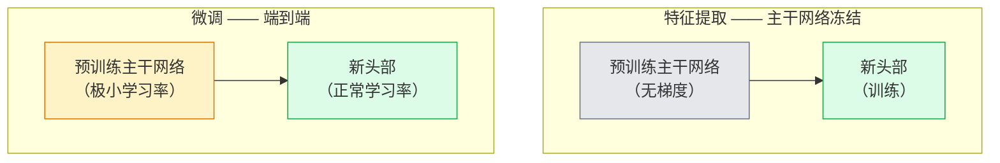

# 迁移学习（Transfer Learning）与微调（Fine-Tuning）

> 别人花费了百万 GPU 小时让网络学会边缘、纹理和物体部件的样子。在你训练自己的模型之前，应该先借用这些特征。

**类型：** 构建
**语言：** Python
**前置条件：** 阶段 4 课程 03（CNN）、阶段 4 课程 04（图像分类）
**时间：** 约 75 分钟

## 学习目标

- 区分特征提取（Feature Extraction）与微调（Fine-Tuning），并根据数据集大小、领域距离和计算预算选择正确的方法
- 加载预训练主干网络，替换其分类头，并在 20 行代码内仅训练头部得到可工作的基线
- 使用差异化学习率（Discriminative Learning Rates）逐步解冻层，使早期通用特征获得比后期任务特定特征更小的更新
- 诊断三种常见失败：解冻块上过高的学习率导致特征漂移（Feature Drift）、小数据集上批归一化统计量崩溃（BN Statistics Collapse）、灾难性遗忘（Catastrophic Forgetting）

## 问题

在 ImageNet 上训练一个 ResNet-50 大约需要 2000 GPU 小时。很少有团队能为每个交付的任务都投入这样的预算。实际上，几乎每个团队交付的都是一个预训练主干网络，搭配一个在新的数百或数千张任务特定图像上训练的新头部。

这不是偷懒的手法。任何在 ImageNet 上训练过的 CNN 的第一个卷积块学习的是边缘和类似 Gabor 的滤波器。接下来几个块学习纹理和简单图案。中间块学习物体部件。最后几个块学习开始像 1000 个 ImageNet 类别的组合。这个层级的前 90% 几乎可以不变地迁移到医学影像、工业检测、卫星数据和任何其他视觉任务——因为大自然的边缘和纹理词汇是有限的。最后 10% 才是你真正需要训练的部分。

正确进行迁移学习有三大陷阱：过高学习率破坏预训练特征、冻结过多导致模型信息缺乏、批归一化的运行统计量向小数据集漂移而网络其余部分从未学习过。本课程会刻意讲解每一个问题。

## 概念

### 特征提取 vs 微调

两种模式，取决于你对预训练特征的信任程度以及你拥有的数据量。



经验法则：

| 数据集大小 | 领域距离 | 方案 |
|--------------|-----------------|--------|
| < 1000 张图像 | 接近 ImageNet | 冻结主干网络，仅训练头部 |
| 1000-10000 张 | 接近 | 冻结前 2-3 阶段，微调其余部分 |
| 10000-100000 张 | 任意 | 使用差异化学习率端到端微调 |
| > 100000 张 | 远 | 微调所有层；若领域差异足够大，考虑从头训练 |

"接近 ImageNet"大致指包含物体类内容的自定义RGB照片。医学 CT 扫描、卫星俯拍图像和显微图像属于远领域——预训练特征仍有帮助，但你需要让更多层自适应。

### 为什么冻结能工作

CNN 在 ImageNet 上学习到的特征并非专用于那 1000 个类别。它们专用于自然图像的统计特征：特定方向的边缘、纹理、对比度模式、形状基元。这些统计特征在人类能命名的几乎所有视觉领域都是稳定的。这就是为什么一个在 ImageNet 上训练、在 CIFAR-10 上零样本评估（仅使用新的线性头部，不微调主干网络）的模型能达到 80% 以上准确率。头部只是在学习如何加权已有的特征以适应当前任务。

### 差异化学习率

当你确实要解冻时，早期层应该比后期层训练得更慢。早期层编码你想保留的通用特征；后期层编码需要大幅调整的任务特定结构。

```
典型配方：

  阶段 0（主干+第一组）：学习率 = 基础学习率 / 100    （基本固定）
  阶段 1：                      学习率 = 基础学习率 / 10
  阶段 2：                      学习率 = 基础学习率 / 3
  阶段 3（最后一个主干网络组）：学习率 = 基础学习率
  头部：                         学习率 = 基础学习率  （或稍高）
```

在 PyTorch 中，这只是一个传给优化器的参数组列表。一个模型，五个学习率，零额外代码。

### 批归一化问题

批归一化（BatchNorm, BN）层持有在 ImageNet 上计算得到的 `running_mean` 和 `running_var` 缓冲区。如果你的任务有不同的像素分布——不同的光照、不同的传感器、不同的色彩空间——这些缓冲区就是错误的。按优先级排序的三种选择：

1. **在训练模式下微调 BN。** 让 BN 的随统计量一起更新。当任务数据集中等大小（≥ 5000 个样本）时默认选择。
2. **在评估模式下冻结 BN。** 保留 ImageNet 统计量，仅训练权重。当数据集足够小，BN 的移动平均会变得有噪声时使用。
3. **用 GroupNorm 替换 BN。** 完全消除移动平均问题。用于每 GPU 批大小很小的检测和分割主干网络。

错误处理会悄无声息地损失 5-15% 的准确率。

### 头部设计

分类头部是 1-3 个线性层加上可选的 dropout。每个 torchvision 主干网络自带一个默认头部，你可以替换：

```
backbone.fc = nn.Linear(backbone.fc.in_features, num_classes)          # ResNet
backbone.classifier[1] = nn.Linear(..., num_classes)                    # EfficientNet, MobileNet
backbone.heads.head = nn.Linear(..., num_classes)                       # torchvision ViT
```

对于小数据集，通常一个线性层就够了。当任务分布与主干网络训练分布相差较远时，添加一个隐藏层（Linear -> ReLU -> Dropout -> Linear）会有帮助。

### 逐层学习率衰减

现代微调（BEiT、DINOv2、ViT-B 微调）中使用的差异化学习率的平滑版本。不是按阶段分组，而是让每一层的学习率都比上一层略小：

```
lr_layer_k = base_lr * decay^(L - k)
```

取 decay = 0.75，L = 12 个 transformer 块，第一个块的学习率是头部的 `0.75^11 ≈ 0.04` 倍。这对 transformer 微调比 CNN 更关键，CNN 中按阶段分组的学习率通常就足够了。

### 评估什么

迁移学习运行需要两个你在从头训练时不会跟踪的数据：

- **仅预训练准确率** —— 主干网络冻结时头部的准确率。这是你的下界。
- **微调后准确率** —— 经过端到端训练后同一模型的准确率。这是你的上界。

如果微调后准确率低于仅预训练准确率，说明存在学习率或 BN 问题。总是打印两者。

## 动手构建

### 第 1 步：加载预训练主干网络并检查它

```python
import torch
import torch.nn as nn
from torchvision.models import resnet18, ResNet18_Weights

backbone = resnet18(weights=ResNet18_Weights.IMAGENET1K_V1)
print(backbone)
print()
print("分类器头部:", backbone.fc)
print("特征维度:", backbone.fc.in_features)
```

`ResNet18` 有四个阶段（`layer1..layer4`）加上一个主干网络和一个 `fc` 头部。每个 torchvision 分类主干网络都有类似的结构。

### 第 2 步：特征提取 —— 冻结所有层，替换头部

```python
def make_feature_extractor(num_classes=10):
    model = resnet18(weights=ResNet18_Weights.IMAGENET1K_V1)
    for p in model.parameters():
        p.requires_grad = False
    model.fc = nn.Linear(model.fc.in_features, num_classes)
    return model

model = make_feature_extractor(num_classes=10)
trainable = sum(p.numel() for p in model.parameters() if p.requires_grad)
frozen = sum(p.numel() for p in model.parameters() if not p.requires_grad)
print(f"可训练参数: {trainable:>10,}")
print(f"冻结参数:    {frozen:>10,}")
```

只有 `model.fc` 是可训练的。主干网络是一个冻结的特征提取器。

### 第 3 步：差异化微调

一个构建具有阶段特定学习率的参数组的工具函数。

```python
def discriminative_param_groups(model, base_lr=1e-3, decay=0.3):
    stages = [
        ["conv1", "bn1"],
        ["layer1"],
        ["layer2"],
        ["layer3"],
        ["layer4"],
        ["fc"],
    ]
    groups = []
    for i, names in enumerate(stages):
        lr = base_lr * (decay ** (len(stages) - 1 - i))
        params = [p for n, p in model.named_parameters()
                  if any(n.startswith(k) for k in names)]
        if params:
            groups.append({"params": params, "lr": lr, "name": "_".join(names)})
    return groups

model = resnet18(weights=ResNet18_Weights.IMAGENET1K_V1)
model.fc = nn.Linear(model.fc.in_features, 10)
for p in model.parameters():
    p.requires_grad = True

groups = discriminative_param_groups(model)
for g in groups:
    print(f"{g['name']:>10s}  学习率={g['lr']:.2e}  参数数量={sum(p.numel() for p in g['params']):>8,}")
```

`decay=0.3` 意味着每个阶段的学习率是下一个阶段的 30%。`fc` 获得 `base_lr`，`layer4` 获得 `0.3 * base_lr`，`conv1` 获得 `0.3^5 * base_lr ≈ 0.00243 * base_lr`。听起来极端，但经验上有效。

### 第 4 步：批归一化处理

冻结 BN 运行统计量而不冻结其权重的辅助函数。

```python
def freeze_bn_stats(model):
    for m in model.modules():
        if isinstance(m, (nn.BatchNorm1d, nn.BatchNorm2d, nn.BatchNorm3d)):
            m.eval()
            for p in m.parameters():
                p.requires_grad = False
    return model
```

在每个 epoch 开始设置 `model.train()` 后调用它。`model.train()` 将所有层切换为训练模式；此函数仅对 BN 层反转。

### 第 5 步：一个最小的端到端微调循环

```python
from torch.optim import SGD
from torch.utils.data import DataLoader
from torch.optim.lr_scheduler import CosineAnnealingLR
import torch.nn.functional as F

def fine_tune(model, train_loader, val_loader, device, epochs=5, base_lr=1e-3, freeze_bn=False):
    model = model.to(device)
    groups = discriminative_param_groups(model, base_lr=base_lr)
    optimizer = SGD(groups, momentum=0.9, weight_decay=1e-4, nesterov=True)
    scheduler = CosineAnnealingLR(optimizer, T_max=epochs)

    for epoch in range(epochs):
        model.train()
        if freeze_bn:
            freeze_bn_stats(model)
        tr_loss, tr_correct, tr_total = 0.0, 0, 0
        for x, y in train_loader:
            x, y = x.to(device), y.to(device)
            logits = model(x)
            loss = F.cross_entropy(logits, y, label_smoothing=0.1)
            optimizer.zero_grad()
            loss.backward()
            optimizer.step()
            tr_loss += loss.item() * x.size(0)
            tr_total += x.size(0)
            tr_correct += (logits.argmax(-1) == y).sum().item()
        scheduler.step()

        model.eval()
        va_total, va_correct = 0, 0
        with torch.no_grad():
            for x, y in val_loader:
                x, y = x.to(device), y.to(device)
                pred = model(x).argmax(-1)
                va_total += x.size(0)
                va_correct += (pred == y).sum().item()
        print(f"epoch {epoch}  训练 {tr_loss/tr_total:.3f}/{tr_correct/tr_total:.3f}  "
              f"验证 {va_correct/va_total:.3f}")
    return model
```

在 CIFAR-10 上使用上述配方进行 5 个 epoch，将 `ResNet18-IMAGENET1K_V1` 从约 70% 零样本线性探针准确率提升到约 93% 微调准确率。仅训练头部（不触及主干网络）会在约 86% 处停滞。

### 第 6 步：逐步解冻

一个从后向前每 epoch 解冻一个阶段的调度。以额外几个 epoch 为代价缓解特征漂移。

```python
def progressive_unfreeze_schedule(model):
    stages = ["layer4", "layer3", "layer2", "layer1"]
    yielded = set()

    def start():
        for p in model.parameters():
            p.requires_grad = False
        for p in model.fc.parameters():
            p.requires_grad = True

    def unfreeze(epoch):
        if epoch < len(stages):
            name = stages[epoch]
            yielded.add(name)
            for n, p in model.named_parameters():
                if n.startswith(name):
                    p.requires_grad = True
            return name
        return None

    return start, unfreeze
```

在第一个 epoch 之前调用 `start()` 一次。在每个 epoch 开始时调用 `unfreeze(epoch)`。每当可训练参数集合改变时，必须重建优化器，否则冻结的参数仍然持有会让优化器混淆的缓存动量。

## 使用它

对于大多数实际任务，`torchvision.models` 加三行代码就足够了。当遇到库默认无法解决的问题时，才需要上述更复杂的机制。

```python
from torchvision.models import resnet50, ResNet50_Weights

model = resnet50(weights=ResNet50_Weights.IMAGENET1K_V2)
model.fc = nn.Linear(model.fc.in_features, num_classes)
optimizer = torch.optim.AdamW(model.parameters(), lr=1e-4, weight_decay=1e-4)
```

另外两个生产级默认选项：

- `timm` 提供了约 800 个预训练视觉主干网络，具有一致的 API（`timm.create_model("resnet50", pretrained=True, num_classes=10)`）。对于 torchvision 动物园之外的任何微调任务，它是标准选择。
- 对于 transformer 模型，`transformers.AutoModelForImageClassification.from_pretrained(name, num_labels=N)` 为你提供 ViT / BEiT / DeiT，具有与文本模型相同的加载语义。

## 交付

本课程产出：

- `outputs/prompt-fine-tune-planner.md` —— 根据数据集大小、领域距离和计算预算，选择特征提取、逐步微调和端到端微调方案的提示词。
- `outputs/skill-freeze-inspector.md` —— 一个技能，给定 PyTorch 模型，报告哪些参数是可训练的，哪些 BatchNorm 层处于评估模式，以及优化器是否实际接收了可训练参数。

## 练习

1. **(简单)** 在相同的合成 CIFAR 数据集上，分别训练一个 `ResNet18` 作为线性探针（主干网络冻结）和完全微调。并排报告两个准确率。解释哪个差距表明特征迁移良好，哪个表明特征迁移不佳。
2. **(中等)** 故意引入一个 bug：将主干网络阶段的 `base_lr` 设置为 `1e-1`（而不是头部）。展示训练损失爆炸，然后通过使用 `discriminative_param_groups` 辅助函数恢复。记录每个阶段开始发散时的学习率。
3. **(困难)** 选择一个医学影像数据集（例如 CheXpert-small、PatchCamelyon 或 HAM10000），比较三种模式：(a) ImageNet 预训练冻结主干网络 + 线性头部；(b) ImageNet 预训练端到端微调；(c) 从头训练。报告每种模式的准确率和计算成本。在什么数据集大小下，从头训练变得有竞争力？

## 关键术语

| 术语 | 人们常说的 | 实际含义 |
|------|------------|----------|
| 特征提取（Feature extraction） | "冻结，训练头部