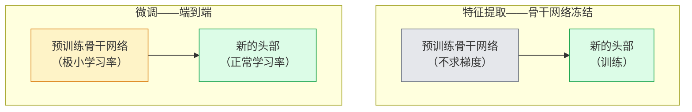

# 迁移学习与微调（Transfer Learning & Fine-Tuning）

> 译注：本文译自同目录 [`en.md`](./en.md)。术语遵循仓根 [TRANSLATION_GUIDE.md](../../../../TRANSLATION_GUIDE.md)。

> 别人花了上百万 GPU 小时教网络认识边缘、纹理和物体部件。在你自己开始训练之前，应该先把这些特征借过来用。

**Type:** Build
**Languages:** Python
**Prerequisites:** Phase 4 Lesson 03 (CNNs), Phase 4 Lesson 04 (Image Classification)
**Time:** ~75 minutes

## 学习目标（Learning Objectives）

- 区分特征提取（feature extraction）与微调（fine-tuning），并能根据数据集大小、领域距离和算力预算选对方案
- 加载预训练 backbone、替换其分类头，并在 20 行以内只训练头部，就能拿到一个可用的 baseline
- 用判别式学习率（discriminative learning rates）逐步解冻各层，让早期的通用特征获得比后期任务相关特征更小的更新
- 诊断三种常见故障：在解冻块上 LR 过高导致的特征漂移、小数据集上的 BN 统计量崩塌，以及灾难性遗忘（catastrophic forgetting）

## 问题（Problem）

在 ImageNet 上训练一个 ResNet-50 大约要花 2,000 GPU 小时。很少有团队对每一个上线任务都能掏得起这种预算。几乎所有团队真正上线的，都是一个预训练 backbone 加一个新的头部，再用几百到几千张任务相关的图像训练这个头部。

这并不是走捷径。任何在 ImageNet 上训练过的 CNN，第一个卷积块学到的是边缘和类 Gabor 滤波器。接下来的几个块学到的是纹理和简单的纹理基元。中间的块学到的是物体部件。最后的块学到的是开始接近 1,000 个 ImageNet 类别的组合。这套层级结构的前 90% 几乎可以原封不动地迁移到医学影像、工业检测、卫星数据，以及其他任何视觉任务——因为大自然里的边缘和纹理词汇是有限的。剩下 10% 才是你真正要训练的部分。

把迁移做对，路上有三个 bug 等着你：用过高的学习率毁掉预训练特征、冻得太多让模型饿着、以及让 BatchNorm 的 running 统计量漂向一个网络其他部分从未见过的小数据集。这一课会有意走一遍这三条坑。

## 概念（Concept）

### 特征提取 vs 微调（Feature extraction vs fine-tuning）

两种范式，按你对预训练特征的信任程度和你手头数据量来选。



经验法则：

| 数据集大小 | 领域距离 | 配方 |
|--------------|-----------------|--------|
| < 1k 张图 | 接近 ImageNet | 冻结 backbone，只训练头部 |
| 1k–10k | 接近 | 冻结前 2–3 个 stage，微调其余部分 |
| 10k–100k | 任意 | 用判别式 LR 端到端微调 |
| 100k+ | 远 | 全部微调；如果领域足够远，可以考虑从头训练 |

「接近 ImageNet」大致指的是带物体内容的自然 RGB 照片。医学 CT 扫描、卫星俯拍图、显微镜图像属于远领域——特征仍然有用，但你需要让更多层去适应。

### 为什么冻结居然能 work

CNN 在 ImageNet 上学到的特征，并不是专门给那 1,000 个类别用的。它们是为自然图像的统计特性而专门化的：特定方向的边缘、纹理、对比度模式、形状基元。这些统计特性在人类能想到的几乎所有视觉领域里都是稳定的。这就是为什么一个 ImageNet 训练好的模型，只换上一个新的线性头（backbone 完全不微调），在 CIFAR-10 上做 zero-shot 评估也能拿到 80%+ 的准确率。这个头部学的，是该给已经学到的哪些特征加权，以适配当前任务。

### 判别式学习率（Discriminative learning rates）

一旦你开始解冻，早期层的训练速度应该比后期层慢。早期层编码的是通用特征，你想保留；后期层编码的是任务相关结构，需要大幅调整。

```
Typical recipe:

  stage 0 (stem + first group): lr = base_lr / 100    (mostly fixed)
  stage 1:                       lr = base_lr / 10
  stage 2:                       lr = base_lr / 3
  stage 3 (last backbone group): lr = base_lr
  head:                          lr = base_lr  (or slightly higher)
```

在 PyTorch 里，这就是给 optimizer 传一个参数组的列表而已。一个模型，五种学习率，零额外代码。

### BatchNorm 问题

BN 层会持有 `running_mean` 和 `running_var` buffer，这些量是在 ImageNet 上算出来的。如果你的任务有不同的像素分布——不同的光照、不同的传感器、不同的色彩空间——这些 buffer 就是错的。按推荐顺序有三种方案：

1. **以 train 模式微调 BN。** 让 BN 跟着其他参数一起更新它的 running 统计量。当任务数据集中等规模（>= 5k 样本）时是默认选择。
2. **以 eval 模式冻结 BN。** 保留 ImageNet 的统计量，只训练权重。当你的数据集小到 BN 的滑动平均会很 noisy 时正确。
3. **用 GroupNorm 替换 BN。** 完全去掉滑动平均的问题。检测和分割中常用，因为这些任务里每张 GPU 上的 batch size 很小。

这一步搞错了，会悄悄让准确率掉 5–15%。

### 头部设计

分类头是 1–3 层 linear 加一个可选的 dropout。每个 torchvision backbone 都自带一个默认头，你来替换它：

```
backbone.fc = nn.Linear(backbone.fc.in_features, num_classes)          # ResNet
backbone.classifier[1] = nn.Linear(..., num_classes)                    # EfficientNet, MobileNet
backbone.heads.head = nn.Linear(..., num_classes)                       # torchvision ViT
```

对于小数据集，单层 linear 通常就够了。当任务分布离 backbone 的训练分布更远时，加一层隐藏层（Linear -> ReLU -> Dropout -> Linear）会有帮助。

### 逐层 LR 衰减（Layer-wise LR decay）

判别式 LR 的一个更平滑的版本，在现代微调（BEiT、DINOv2、ViT-B 微调）中很常见。不再把层划分成 stage，而是给每一层一个比上一层略小的 LR：

```
lr_layer_k = base_lr * decay^(L - k)
```

设 decay = 0.75、L = 12 个 transformer block，那么第一个 block 的训练速率是头部 LR 的 `0.75^11 ≈ 0.04x`。这种做法对 transformer 微调比对 CNN 更重要，CNN 一般用 stage 分组的 LR 就够了。

### 评估什么

迁移学习的训练里，要多盯两个数字，从头训练时不会跟踪它们：

- **预训练-only 准确率（Pretrained-only accuracy）**——backbone 冻结时头部的准确率。这是你的下限。
- **微调后准确率（Fine-tuned accuracy）**——同一个模型经过端到端训练后的准确率。这是你的上限。

如果微调后比预训练-only 还低，那你就是有学习率或 BN 的 bug。永远把这两个值都打印出来。

## 动手实现（Build It）

### Step 1: 加载预训练 backbone 并审视它

```python
import torch
import torch.nn as nn
from torchvision.models import resnet18, ResNet18_Weights

backbone = resnet18(weights=ResNet18_Weights.IMAGENET1K_V1)
print(backbone)
print()
print("classifier head:", backbone.fc)
print("feature dim:", backbone.fc.in_features)
```

`ResNet18` 有四个 stage（`layer1..layer4`），加上一个 stem 和一个 `fc` 头。每个 torchvision 分类 backbone 都有类似的结构。

### Step 2: 特征提取——全部冻结，替换头部

```python
def make_feature_extractor(num_classes=10):
    model = resnet18(weights=ResNet18_Weights.IMAGENET1K_V1)
    for p in model.parameters():
        p.requires_grad = False
    model.fc = nn.Linear(model.fc.in_features, num_classes)
    return model

model = make_feature_extractor(num_classes=10)
trainable = sum(p.numel() for p in model.parameters() if p.requires_grad)
frozen = sum(p.numel() for p in model.parameters() if not p.requires_grad)
print(f"trainable: {trainable:>10,}")
print(f"frozen:    {frozen:>10,}")
```

只有 `model.fc` 是可训练的。backbone 是一个被冻住的特征提取器。

### Step 3: 判别式微调

一个工具函数，按 stage 构造带不同学习率的参数组。

```python
def discriminative_param_groups(model, base_lr=1e-3, decay=0.3):
    stages = [
        ["conv1", "bn1"],
        ["layer1"],
        ["layer2"],
        ["layer3"],
        ["layer4"],
        ["fc"],
    ]
    groups = []
    for i, names in enumerate(stages):
        lr = base_lr * (decay ** (len(stages) - 1 - i))
        params = [p for n, p in model.named_parameters()
                  if any(n.startswith(k) for k in names)]
        if params:
            groups.append({"params": params, "lr": lr, "name": "_".join(names)})
    return groups

model = resnet18(weights=ResNet18_Weights.IMAGENET1K_V1)
model.fc = nn.Linear(model.fc.in_features, 10)
for p in model.parameters():
    p.requires_grad = True

groups = discriminative_param_groups(model)
for g in groups:
    print(f"{g['name']:>10s}  lr={g['lr']:.2e}  params={sum(p.numel() for p in g['params']):>8,}")
```

`decay=0.3` 意味着每个 stage 训练的速率是下一个 stage 的 30%。`fc` 拿到 `base_lr`，`layer4` 拿到 `0.3 * base_lr`，`conv1` 拿到 `0.3^5 * base_lr ≈ 0.00243 * base_lr`。听上去很极端；经验上是 work 的。

### Step 4: BatchNorm 处理

一个 helper：冻结 BN 的 running 统计量，但不冻结它的权重。

```python
def freeze_bn_stats(model):
    for m in model.modules():
        if isinstance(m, (nn.BatchNorm1d, nn.BatchNorm2d, nn.BatchNorm3d)):
            m.eval()
            for p in m.parameters():
                p.requires_grad = False
    return model
```

在每个 epoch 开头调用 `model.train()` 之后再调它。`model.train()` 会把所有东西切到训练模式；这个 helper 只把 BN 层那部分翻回去。

### Step 5: 一个最简的端到端微调循环

```python
from torch.optim import SGD
from torch.utils.data import DataLoader
from torch.optim.lr_scheduler import CosineAnnealingLR
import torch.nn.functional as F

def fine_tune(model, train_loader, val_loader, device, epochs=5, base_lr=1e-3, freeze_bn=False):
    model = model.to(device)
    groups = discriminative_param_groups(model, base_lr=base_lr)
    optimizer = SGD(groups, momentum=0.9, weight_decay=1e-4, nesterov=True)
    scheduler = CosineAnnealingLR(optimizer, T_max=epochs)

    for epoch in range(epochs):
        model.train()
        if freeze_bn:
            freeze_bn_stats(model)
        tr_loss, tr_correct, tr_total = 0.0, 0, 0
        for x, y in train_loader:
            x, y = x.to(device), y.to(device)
            logits = model(x)
            loss = F.cross_entropy(logits, y, label_smoothing=0.1)
            optimizer.zero_grad()
            loss.backward()
            optimizer.step()
            tr_loss += loss.item() * x.size(0)
            tr_total += x.size(0)
            tr_correct += (logits.argmax(-1) == y).sum().item()
        scheduler.step()

        model.eval()
        va_total, va_correct = 0, 0
        with torch.no_grad():
            for x, y in val_loader:
                x, y = x.to(device), y.to(device)
                pred = model(x).argmax(-1)
                va_total += x.size(0)
                va_correct += (pred == y).sum().item()
        print(f"epoch {epoch}  train {tr_loss/tr_total:.3f}/{tr_correct/tr_total:.3f}  "
              f"val {va_correct/va_total:.3f}")
    return model
```

按上面的配方在 CIFAR-10 上跑五个 epoch，可以把 `ResNet18-IMAGENET1K_V1` 从 zero-shot 线性探测（linear-probe）的约 70% 准确率推到微调后的约 93%。如果完全不动 backbone，光训练头部，会在 86% 左右停滞。

### Step 6: 渐进解冻（Progressive unfreezing）

一个调度策略：每个 epoch 从后往前解冻一个 stage。以多花几个 epoch 为代价，缓解特征漂移。

```python
def progressive_unfreeze_schedule(model):
    stages = ["layer4", "layer3", "layer2", "layer1"]
    yielded = set()

    def start():
        for p in model.parameters():
            p.requires_grad = False
        for p in model.fc.parameters():
            p.requires_grad = True

    def unfreeze(epoch):
        if epoch < len(stages):
            name = stages[epoch]
            yielded.add(name)
            for n, p in model.named_parameters():
                if n.startswith(name):
                    p.requires_grad = True
            return name
        return None

    return start, unfreeze
```

第一个 epoch 之前调一次 `start()`，每个 epoch 开始时调 `unfreeze(epoch)`。每当可训练参数集合变化时都要重建 optimizer，否则被冻结的参数仍然带着缓存的 moment，会把 optimizer 搞糊涂。

## 用起来（Use It）

对大多数真实任务，`torchvision.models` 加三行代码就够了。前面那些更重的机制，是在你撞到库的默认值修不掉的问题时才用得上。

```python
from torchvision.models import resnet50, ResNet50_Weights

model = resnet50(weights=ResNet50_Weights.IMAGENET1K_V2)
model.fc = nn.Linear(model.fc.in_features, num_classes)
optimizer = torch.optim.AdamW(model.parameters(), lr=1e-4, weight_decay=1e-4)
```

另外两个生产级的默认选项：

- `timm` 提供了约 800 个预训练视觉 backbone，API 一致（`timm.create_model("resnet50", pretrained=True, num_classes=10)`）。要做 torchvision 模型库之外的微调，它就是事实标准。
- 对于 transformer，`transformers.AutoModelForImageClassification.from_pretrained(name, num_labels=N)` 提供 ViT / BEiT / DeiT，加载语义和文本模型一致。

## 上线部署（Ship It）

这一课会产出：

- `outputs/prompt-fine-tune-planner.md` —— 一个 prompt，根据数据集大小、领域距离和算力预算，从特征提取、渐进解冻和端到端微调里挑一个。
- `outputs/skill-freeze-inspector.md` —— 一个 skill：给定一个 PyTorch 模型，报告哪些参数可训练、哪些 BatchNorm 层处于 eval 模式，以及 optimizer 是否真的拿到了那些可训练参数。

## 练习（Exercises）

1. **（Easy）** 在同一个合成 CIFAR 数据集上，把 `ResNet18` 既作为 linear probe（backbone 冻结）训练一遍，也做一次完整微调。把两个准确率并排报告。解释哪个 gap 告诉你特征迁移得好，哪个告诉你特征迁移得不好。
2. **（Medium）** 故意制造一个 bug：把 backbone 那段的 `base_lr = 1e-1`，而不是头部。展示训练 loss 爆炸，再用 `discriminative_param_groups` helper 把它恢复回来。记录每个 stage 在哪个 LR 上开始发散。
3. **（Hard）** 找一个医学影像数据集（比如 CheXpert-small、PatchCamelyon 或 HAM10000），对比三种范式：(a) ImageNet 预训练、冻结 backbone + 线性头；(b) ImageNet 预训练、端到端微调；(c) 从头训练。分别报告准确率和算力开销。在多大的数据集规模时，从头训练才会变得有竞争力？

## 关键术语（Key Terms）

| 术语 | 大家平时怎么说 | 实际含义 |
|------|----------------|----------------------|
| Feature extraction（特征提取） | 「冻住，只训练头」 | backbone 参数冻结，只有新的分类头会拿到 gradient |
| Fine-tuning（微调） | 「端到端再训一遍」 | 所有参数都可训练，通常 LR 比从头训练小得多 |
| Discriminative LR（判别式 LR） | 「早期层用更小的 LR」 | optimizer 的参数组里，早期 stage 的 LR 是后期 stage 的一个分数 |
| Layer-wise LR decay（逐层 LR 衰减） | 「平滑的 LR 梯度」 | 每层 LR 乘 decay^(L - k)；transformer 微调中常见 |
| Catastrophic forgetting（灾难性遗忘） | 「模型把 ImageNet 弄丢了」 | LR 太高，在新任务信号被学到之前，就把预训练特征覆盖掉了 |
| BN statistics drift（BN 统计量漂移） | 「running mean 是错的」 | BatchNorm 的 running_mean/var 是在和当前任务不同的分布上算的，悄悄拖准确率下水 |
| Linear probe（线性探测） | 「冻结 backbone + 线性头」 | 评估预训练特征的方式——在冻结的表示之上，拟合最佳线性分类器的准确率 |
| Catastrophic collapse（灾难性崩塌） | 「全都预测同一个类」 | LR 高到在头部产生稳定梯度之前就毁掉了特征，会发生这种现象 |

## 延伸阅读（Further Reading）

- [How transferable are features in deep neural networks? (Yosinski et al., 2014)](https://arxiv.org/abs/1411.1792) —— 量化跨层特征可迁移性的开山之作
- [Universal Language Model Fine-tuning (ULMFiT, Howard & Ruder, 2018)](https://arxiv.org/abs/1801.06146) —— 判别式 LR / 渐进解冻配方的原始论文；这些思想可以直接迁到视觉
- [timm documentation](https://huggingface.co/docs/timm) —— 现代视觉 backbone 的参考，以及它们训练时所用的精确微调默认配置
- [A Simple Framework for Linear-Probe Evaluation (Kornblith et al., 2019)](https://arxiv.org/abs/1805.08974) —— 为什么 linear-probe 准确率重要，以及怎么报告它才正确
