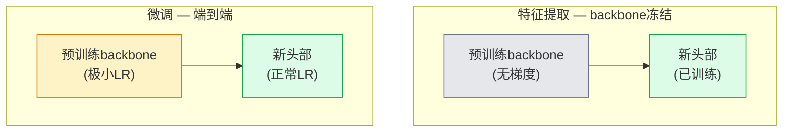

# 迁移学习与微调

> 别人花了百万GPU小时教会了网络边缘、纹理和物体部分看起来是什么样。你应该在训练自己的网络之前借用这些特征。

**类型：** 构建
**语言：** Python
**前置条件：** 阶段4 第03课（CNN），阶段4 第04课（图像分类）
**时间：** ~75分钟

## 学习目标

- 区分特征提取和微调，并根据数据集大小、领域距离和计算预算选择正确的方法
- 加载预训练backbone，替换其分类器头，在20行代码内仅训练头部得到一个可工作的基线
- 使用判别性学习率逐步解冻层，使早期通用特征获得比后期任务特定特征更小的更新
- 诊断三种常见故障：解冻块上学习率过高导致特征漂移、小数据集上BN统计量崩溃、以及灾难性遗忘

## 问题

在ImageNet上训练ResNet-50需要约2,000 GPU小时。很少有团队为每个交付的任务都有那个预算。几乎所有团队实际交付的是预训练backbone加上在一个几百或几千张任务特定图像上训练的新头部。

这不是一个捷径。任何ImageNet训练过的CNN的第一个conv块学习边缘和Gabor-like滤波器。接下来的几个块学习纹理和简单图案。中间块学习物体部分。最后块学习开始看起来像1,000个ImageNet类别的组合。这个层次结构的前90%几乎不变地迁移到医学成像、工业检测、卫星数据和每个其他视觉任务——因为自然界的边缘和纹理词汇是有限的。后10%才是你实际训练的。

正确进行迁移学习有三个bug在等着你：过高的学习率破坏预训练特征、冻结太多使模型信息匮乏、以及让BatchNorm的运行统计量向一个网络的其余部分从未学习过的小数据集漂移。本课故意逐一讲解每个问题。

## 概念

### 特征提取 vs 微调

两种模式，根据你信任预训练特征的程度和你拥有多少数据来选择。


```mermaid
flowchart TB
    subgraph FE["特征提取 — backbone冻结"]
        FE1["预训练backbone<br/>(无梯度)"] --> FE2["新头部<br/>(已训练)"]
    end
    subgraph FT["微调 — 端到端"]
        FT1["预训练backbone<br/>(极小LR)"] --> FT2["新头部<br/>(正常LR)"]
    end

    style FE1 fill:#e5e7eb,stroke:#6b7280
    style FE2 fill:#dcfce7,stroke:#16a34a
    style FT1 fill:#fef3c7,stroke:#d97706
    style FT2 fill:#dcfce7,stroke:#16a34a
```

经验法则：

| 数据集大小 | 领域距离 | 方案 |
|--------------|-----------------|--------|
| < 1k 张图像 | 接近ImageNet | 冻结backbone，仅训练头部 |
| 1k-10k | 接近 | 冻结前2-3个阶段，微调其余部分 |
| 10k-100k | 任意 | 使用判别性LR端到端微调 |
| 100k+ | 远 | 微调所有内容；如果领域足够远，考虑从头训练 |

"接近ImageNet"大致意味着具有类物体内容的自然RGB照片。医学CT扫描、俯拍卫星图像和显微图像是远的领域——特征仍然有帮助，但你需要让更多层进行适应。

### 为什么冻结有效

CNN学习到的ImageNet特征并非专门针对那1,000个类别。它们专门针对自然图像的统计特性：特定方向的边缘、纹理、对比度模式、形状基元。这些统计特性在人类能命名的几乎所有视觉领域中都是稳定的。这就是为什么在ImageNet上训练并在CIFAR-10上仅用新的线性头（不微调backbone）进行zero-shot评估的模型能达到80%以上的准确率。头部正在学习为这个任务应该加权哪些已经学到的特征。

### 判别性学习率

当你确实解冻时，早期层的训练速度应该比晚期层慢。早期层编码你想要保留的通用特征；晚期层编码你需要大幅度移动的任务特定结构。

```
典型配方：

  stage 0 (stem + 第一组): lr = base_lr / 100    （基本固定）
  stage 1:                       lr = base_lr / 10
  stage 2:                       lr = base_lr / 3
  stage 3 (最后backbone组):   lr = base_lr
  head:                          lr = base_lr  （或略高）
```

在PyTorch中，这只是传递给优化器的参数组列表。一个模型，五个学习率，零额外代码。

### BatchNorm问题

BN层持有在ImageNet上计算的`running_mean`和`running_var`缓冲区。如果您的任务有不同的像素分布——不同的光照、不同的传感器、不同的色彩空间——这些缓冲区是错误的。按偏好顺序的三个选项：

1. **将BN保持在train模式进行微调。** 让BN随其他所有内容一起更新其运行统计量。当任务数据集为中等规模（>= 5k样本）时的默认选择。
2. **将BN冻结在eval模式。** 保留ImageNet统计量，仅训练权重。当您的数据集足够小以至于BN的移动平均会有噪声时是正确的。
3. **用GroupNorm替换BN。** 完全消除移动平均问题。用于每GPU batch size很小的检测和分割backbone。

弄错这一点会静默地使准确率下降5-15%。

### 头部设计

分类器头是1-3个线性层加上一个可选的dropout。每个torchvision backbone都附带一个你替换的默认头部：

```
backbone.fc = nn.Linear(backbone.fc.in_features, num_classes)          # ResNet
backbone.classifier[1] = nn.Linear(..., num_classes)                    # EfficientNet, MobileNet
backbone.heads.head = nn.Linear(..., num_classes)                       # torchvision ViT
```

对于小数据集，一个线性层通常就足够了。当任务分布与backbone的训练分布差距较大时，添加一个隐藏层（Linear -> ReLU -> Dropout -> Linear）会有帮助。

### 逐层LR衰减

现代微调（BEiT、DINOv2、ViT-B fine-tunes）中使用的判别性LR的平滑版本。不是将层分组到阶段，而是给每一层一个略高于其上一层的LR：

```
lr_layer_k = base_lr * decay^(L - k)
```

使用decay = 0.75和L = 12个transformer块时，第一个块以头部LR的`0.75^11 ≈ 0.04x`进行训练。对transformer微调比CNN更重要，对CNN来说阶段分组的LR通常就足够了。

### 需要评估什么

迁移学习运行需要两个你在从头训练时不会追踪的数字：

- **仅预训练准确率** — backbone冻结时头部的准确率。这是你的下限。
- **微调后准确率** — 端到端训练后相同模型的准确率。这是你的上限。

如果微调后低于仅预训练，你就有一个学习率或BN的bug。始终打印两者。

## 构建

### 第1步：加载预训练backbone并检查它

```python
import torch
import torch.nn as nn
from torchvision.models import resnet18, ResNet18_Weights

backbone = resnet18(weights=ResNet18_Weights.IMAGENET1K_V1)
print(backbone)
print()
print("classifier head:", backbone.fc)
print("feature dim:", backbone.fc.in_features)
```

`ResNet18`有四个阶段（`layer1..layer4`）加上一个stem和一个`fc`头部。每个torchvision分类backbone都有类似结构。

### 第2步：特征提取 — 冻结所有内容，替换头部

```python
def make_feature_extractor(num_classes=10):
    model = resnet18(weights=ResNet18_Weights.IMAGENET1K_V1)
    for p in model.parameters():
        p.requires_grad = False
    model.fc = nn.Linear(model.fc.in_features, num_classes)
    return model

model = make_feature_extractor(num_classes=10)
trainable = sum(p.numel() for p in model.parameters() if p.requires_grad)
frozen = sum(p.numel() for p in model.parameters() if not p.requires_grad)
print(f"trainable: {trainable:>10,}")
print(f"frozen:    {frozen:>10,}")
```

只有`model.fc`是可训练的。backbone是一个冻结的特征提取器。

### 第3步：判别性微调

一个构建具有阶段特定学习率的参数组的工具。

```python
def discriminative_param_groups(model, base_lr=1e-3, decay=0.3):
    stages = [
        ["conv1", "bn1"],
        ["layer1"],
        ["layer2"],
        ["layer3"],
        ["layer4"],
        ["fc"],
    ]
    groups = []
    for i, names in enumerate(stages):
        lr = base_lr * (decay ** (len(stages) - 1 - i))
        params = [p for n, p in model.named_parameters()
                  if any(n.startswith(k) for k in names)]
        if params:
            groups.append({"params": params, "lr": lr, "name": "_".join(names)})
    return groups

model = resnet18(weights=ResNet18_Weights.IMAGENET1K_V1)
model.fc = nn.Linear(model.fc.in_features, 10)
for p in model.parameters():
    p.requires_grad = True

groups = discriminative_param_groups(model)
for g in groups:
    print(f"{g['name']:>10s}  lr={g['lr']:.2e}  params={sum(p.numel() for p in g['params']):>8,}")
```

`decay=0.3`意味着每个阶段以下一个阶段30%的速率进行训练。`fc`得到`base_lr`，`layer4`得到`0.3 * base_lr`，`conv1`得到`0.3^5 * base_lr ≈ 0.00243 * base_lr`。听起来极端；经验上它有效。

### 第4步：BatchNorm处理

冻结BN运行统计量而不冻结其权重的辅助函数。

```python
def freeze_bn_stats(model):
    for m in model.modules():
        if isinstance(m, (nn.BatchNorm1d, nn.BatchNorm2d, nn.BatchNorm3d)):
            m.eval()
            for p in m.parameters():
                p.requires_grad = False
    return model
```

在每个epoch开始时设置`model.train()`之后调用它。`model.train()`将所有内容翻转到训练模式；这仅对BN层逆转回来。

### 第5步：最小的端到端微调循环

```python
from torch.optim import SGD
from torch.utils.data import DataLoader
from torch.optim.lr_scheduler import CosineAnnealingLR
import torch.nn.functional as F

def fine_tune(model, train_loader, val_loader, device, epochs=5, base_lr=1e-3, freeze_bn=False):
    model = model.to(device)
    groups = discriminative_param_groups(model, base_lr=base_lr)
    optimizer = SGD(groups, momentum=0.9, weight_decay=1e-4, nesterov=True)
    scheduler = CosineAnnealingLR(optimizer, T_max=epochs)

    for epoch in range(epochs):
        model.train()
        if freeze_bn:
            freeze_bn_stats(model)
        tr_loss, tr_correct, tr_total = 0.0, 0, 0
        for x, y in train_loader:
            x, y = x.to(device), y.to(device)
            logits = model(x)
            loss = F.cross_entropy(logits, y, label_smoothing=0.1)
            optimizer.zero_grad()
            loss.backward()
            optimizer.step()
            tr_loss += loss.item() * x.size(0)
            tr_total += x.size(0)
            tr_correct += (logits.argmax(-1) == y).sum().item()
        scheduler.step()

        model.eval()
        va_total, va_correct = 0, 0
        with torch.no_grad():
            for x, y in val_loader:
                x, y = x.to(device), y.to(device)
                pred = model(x).argmax(-1)
                va_total += x.size(0)
                va_correct += (pred == y).sum().item()
        print(f"epoch {epoch}  train {tr_loss/tr_total:.3f}/{tr_correct/tr_total:.3f}  "
              f"val {va_correct/va_total:.3f}")
    return model
```

在CIFAR-10上使用上述配方的五个epoch将`ResNet18-IMAGENET1K_V1`从约70%的zero-shot linear-probe准确率提升到约93%的微调准确率。仅头部而不触及backbone会在约86%处达到平台期。

### 第6步：逐步解冻

一个从后向前每个epoch解冻一个阶段的调度。以一些额外的epoch为代价减轻特征漂移。

```python
def progressive_unfreeze_schedule(model):
    stages = ["layer4", "layer3", "layer2", "layer1"]
    yielded = set()

    def start():
        for p in model.parameters():
            p.requires_grad = False
        for p in model.fc.parameters():
            p.requires_grad = True

    def unfreeze(epoch):
        if epoch < len(stages):
            name = stages[epoch]
            yielded.add(name)
            for n, p in model.named_parameters():
                if n.startswith(name):
                    p.requires_grad = True
            return name
        return None

    return start, unfreeze
```

在第一个epoch之前调用一次`start()`。在每个epoch开始时调用`unfreeze(epoch)`。每当可训练参数集发生变化时重建优化器，否则冻结的参数仍然持有会让优化器混淆的缓存moment。

## 使用

对于大多数实际任务，`torchvision.models` + 三行就足够了。当你在库默认设置无法修复的问题时，上面的更重机制才重要。

```python
from torchvision.models import resnet50, ResNet50_Weights

model = resnet50(weights=ResNet50_Weights.IMAGENET1K_V2)
model.fc = nn.Linear(model.fc.in_features, num_classes)
optimizer = torch.optim.AdamW(model.parameters(), lr=1e-4, weight_decay=1e-4)
```

另外两个生产级默认值：

- `timm` 提供约800个预训练视觉backbone，具有一致的API（`timm.create_model("resnet50", pretrained=True, num_classes=10)`）。对于torchvision动物园之外的任何微调，它是标准选择。
- 对于transformers，`transformers.AutoModelForImageClassification.from_pretrained(name, num_labels=N)` 给你ViT / BEiT / DeiT，具有与文本模型相同的加载语义。

## 交付物

本课产出：

- `outputs/prompt-fine-tune-planner.md` — 一个prompt，根据数据集大小、领域距离和计算预算选择特征提取vs逐步vs端到端微调。
- `outputs/skill-freeze-inspector.md` — 一个技能，给定PyTorch模型，报告哪些参数可训练，哪些BatchNorm层处于eval模式，以及优化器是否实际接收到可训练参数。

## 练习

1. **(简单)** 在相同的合成CIFAR数据集上，分别作为linear probe（backbone冻结）和完整微调训练`ResNet18`。并排报告两种准确率。解释哪个差距告诉你特征迁移良好，哪个告诉你它们不好。
2. **(中等)** 故意引入一个bug：在backbone阶段而不是头部设置`base_lr = 1e-1`。展示训练损失爆炸，然后通过应用`discriminative_param_groups`辅助函数恢复。记录每个阶段开始发散时的LR。
3. **(困难)** 取一个医学成像数据集（例如CheXpert-small、PatchCamelyon或HAM10000）并比较三种方案：(a) ImageNet预训练冻结backbone + 线性头；(b) ImageNet预训练端到端微调；(c) 从头训练。报告每种情况的准确率和计算成本。在什么数据集大小下从头训练变得有竞争力？

## 关键术语

| 术语 | 人们的说法 | 实际含义 |
|------|----------------|----------------------|
| Feature extraction | "冻结并训练头部" | Backbone参数冻结，仅新的分类器头接收梯度 |
| Fine-tuning | "重新端到端训练" | 所有参数可训练，通常使用比从头训练小得多的LR |
| Discriminative LR | "早期层更小的LR" | 优化器参数组，其中早期阶段的LR是后期阶段LR的一个分数 |
| Layer-wise LR decay | "平滑LR梯度" | 逐层LR乘以decay^(L - k)；在transformer微调中常见 |
| Catastrophic forgetting | "模型丢失了ImageNet" | 在新任务信号被学习之前，过高的LR覆盖了预训练特征 |
| BN statistics drift | "Running mean是错误的" | BatchNorm的running_mean/var在与当前任务不同的分布上计算，静默地损害准确率 |
| Linear probe | "冻结backbone + 线性头" | 预训练特征的评估——冻结表示上最佳线性分类器的准确率 |
| Catastrophic collapse | "所有内容预测一个类别" | 当微调的学习率足够高以至于在头部梯度可以稳定之前就破坏了特征时发生 |

## 延伸阅读

- [How transferable are features in deep neural networks? (Yosinski et al., 2014)](https://arxiv.org/abs/1411.1792) — 量化了跨层特征迁移性的论文
- [Universal Language Model Fine-tuning (ULMFiT, Howard & Ruder, 2018)](https://arxiv.org/abs/1801.06146) — 原始的判别性LR / 逐步解冻配方；这些想法直接迁移到视觉领域
- [timm documentation](https://huggingface.co/docs/timm) — 现代视觉backbone的参考，以及它们训练时使用的精确微调默认值
- [A Simple Framework for Linear-Probe Evaluation (Kornblith et al., 2019)](https://arxiv.org/abs/1805.08974) — 为什么linear-probe准确率重要以及如何正确报告它
