# Object Detection — YOLO from Scratch

> Detection は classification に regression を足し、それを feature map の全位置で実行し、最後に non-maximum suppression で整理する task です。

**種別:** 構築
**言語:** Python
**前提条件:** Phase 4 Lesson 03 (CNNs), Phase 4 Lesson 04 (Image Classification), Phase 4 Lesson 05 (Transfer Learning)
**所要時間:** 約75分

## Learning Objectives

- detection を dense prediction problem に変換する grid-and-anchor design を説明し、output tensor の各値が何を意味するか述べる
- boxes 間の Intersection-over-Union を計算し、non-maximum suppression を scratch から実装する
- pretrained backbone の上に minimal YOLO-style head を作り、classification、objectness、box-regression losses を含める
- detection metric row（precision@0.5、recall、mAP@0.5、mAP@0.5:0.95）を読み、次に動かす knob を選ぶ

## 問題

Classification は「この image は dog」と言います。Detection は「pixels (112, 40, 280, 210) に dog があり、(400, 180, 560, 310) に cat があり、frame 内にはそれ以外ない」と言います。image ごとに 1 label を出すのではなく、可変個の labelled boxes を予測するという構造変化が、自律 systems、surveillance products、document layout parsers、factory vision lines を支えています。

Detection では vision の engineering trade-off が一度に現れます。boxes は正確である必要があり（regression head）、各 box の class は正しい必要があり（classification head）、何も検出しない場所を model が理解する必要があり（objectness score）、real object 1 つにつき prediction は 1 つであるべきです（non-maximum suppression）。どれかを外すと、pipeline は objects を見逃す、hallucinated boxes を出す、同じ object を少しずつ違う位置に何度も予測する、のいずれかになります。

YOLO（You Only Look Once, Redmon et al. 2016）は、conv net の single forward pass でこれを real time にした設計です。同じ構造上の判断は、YOLOv8、YOLOv9、YOLO-NAS、RT-DETR など modern detectors の backbone にも残っています。core を学ぶと、variant は同じ部品の組み換えとして読めます。

## The Concept

### Detection as dense prediction

classifier は image ごとに C 個の numbers を出します。YOLO-style detector は image ごとに `(S x S x (5 + C))` numbers を出します。S は spatial grid size です。

```mermaid
flowchart LR
    IMG["Input 416x416 RGB"] --> BB["Backbone<br/>(ResNet, DarkNet, ...)"]
    BB --> FM["Feature map<br/>(C_feat, 13, 13)"]
    FM --> HEAD["Detection head<br/>(1x1 convs)"]
    HEAD --> OUT["Output tensor<br/>(13, 13, B * (5 + C))"]
    OUT --> DEC["Decode<br/>(grid + sigmoid + exp)"]
    DEC --> NMS["Non-max suppression"]
    NMS --> RESULT["Final boxes"]

    style IMG fill:#dbeafe,stroke:#2563eb
    style HEAD fill:#fef3c7,stroke:#d97706
    style NMS fill:#fecaca,stroke:#dc2626
    style RESULT fill:#dcfce7,stroke:#16a34a
```



`S * S` の各 grid cell は `B` 個の boxes を予測します。各 box は 4 つの geometry values（`tx, ty, tw, th`）、1 つの objectness score、C 個の class probabilities を持ちます。cell あたり合計は `B * (5 + C)` です。VOC で `S=13, B=2, C=20` なら cell あたり 50 numbers になります。

### Why grids and anchors

plain regression で各 object の `(x, y, w, h)` を absolute coordinate として直接予測するのは難しいです。image を平行移動したからといって、すべての predictions が同じ量だけ動くべきではありません。object は spatially anchored です。grid は、ground-truth box をその centre が入る grid cell に割り当て、その cell だけが object を担当することでこれを解決します。

anchors は別の問題を解決します。3x3 conv が 16-pixel receptive field の feature cell から 500-pixel-wide box を直接 regress するのは難しいです。そこで cell ごとに `B` 個の prior box shapes（anchors）を定義し、各 anchor からの小さな deltas を予測します。model はゼロから regress するのではなく、適切な anchor を選び、それを少し動かすことを学びます。

```
Anchor box priors (example for 416x416 input):

  small:   (30,  60)
  medium:  (75,  170)
  large:   (200, 380)

At each grid cell, every anchor emits (tx, ty, tw, th, obj, c_1, ..., c_C).
```

modern detectors は resolution ごとに異なる anchor sets を持つ FPN を使うことが多いです。small anchors は shallow high-resolution maps、large anchors は deep low-resolution maps に置きます。発想は同じで、scales が増えただけです。

### Decoding predictions

raw `tx, ty, tw, th` は box coordinates ではありません。plot する前に変換する regression targets です。

```
centre x  = (sigmoid(tx) + cell_x) * stride
centre y  = (sigmoid(ty) + cell_y) * stride
width     = anchor_w * exp(tw)
height    = anchor_h * exp(th)
```

`sigmoid` は centre offsets を cell 内に保ちます。`exp` は width/height を anchor から自由に scale させつつ符号反転を防ぎます。`stride` は grid coordinates を pixels に戻します。この decode step は v2 以降の YOLO variants で共通です。

### IoU

Detection で boxes 間の similarity を測る universal metric です。

```
IoU(A, B) = area(A intersect B) / area(A union B)
```

IoU = 1 は同一、IoU = 0 は overlap なしです。prediction と ground-truth box の IoU は true positive かどうかを決め、通常 IoU >= 0.5 が使われます。predictions 同士の IoU は NMS が重複排除に使います。

### Non-maximum suppression

adjacent anchors で trained された conv network は、同じ object に重なる boxes を複数予測しがちです。NMS は highest-confidence prediction を残し、IoU が threshold を超える他の predictions を削除します。

```
NMS(boxes, scores, iou_threshold):
    sort boxes by score descending
    keep = []
    while boxes not empty:
        pick the top-scoring box, add to keep
        remove every box with IoU > iou_threshold to the picked box
    return keep
```

typical threshold は object detection で 0.45 です。recent detectors は standard NMS を `soft-NMS`、`DIoU-NMS`、または learned suppression（RT-DETR）で置き換えることがありますが、目的は同じです。

### The loss

YOLO loss は重み付きの 3 種類の loss を足したものです。

```
L = lambda_coord * L_box(pred, target, where obj=1)
  + lambda_obj   * L_obj(pred, 1,     where obj=1)
  + lambda_noobj * L_obj(pred, 0,     where obj=0)
  + lambda_cls   * L_cls(pred, target, where obj=1)
```

object を含む cells だけが box-regression と classification losses に寄与します。object を含まない cells は objectness loss だけに寄与し、model に黙ることを教えます。empty cells は非常に多いため、`lambda_noobj` は通常小さく（~0.5）します。

modern variants は MSE box loss を CIoU / DIoU に変え、class imbalance には focal loss を使い、objectness を quality focal loss で balance します。それでも 3-component structure は変わりません。

### Detection metrics

Accuracy は detection にはそのまま使えません。必要なのは次の 4 つです。

- **Precision@IoU=0.5** — positive と数えた predictions のうち実際に正しい割合。
- **Recall@IoU=0.5** — real objects のうち見つけられた割合。
- **AP@0.5** — IoU threshold 0.5 での precision-recall curve area。class ごとの値。
- **mAP@0.5:0.95** — IoU thresholds 0.5, 0.55, ..., 0.95 にわたる AP の平均。COCO metric で、最も厳しく情報量が多い。

4 つすべてを報告してください。mAP@0.5 は高いが mAP@0.5:0.95 が低い detector は、rough localization はできても tight ではありません。box-regression loss を改善します。precision が高く recall が低い detector は保守的すぎます。confidence threshold を下げるか objectness weight を上げます。

## 実装

### Step 1: IoU

lesson 全体の workhorse です。`(x1, y1, x2, y2)` format の boxes arrays で動きます。

```python
import numpy as np

def box_iou(boxes_a, boxes_b):
    ax1, ay1, ax2, ay2 = boxes_a[:, 0], boxes_a[:, 1], boxes_a[:, 2], boxes_a[:, 3]
    bx1, by1, bx2, by2 = boxes_b[:, 0], boxes_b[:, 1], boxes_b[:, 2], boxes_b[:, 3]

    inter_x1 = np.maximum(ax1[:, None], bx1[None, :])
    inter_y1 = np.maximum(ay1[:, None], by1[None, :])
    inter_x2 = np.minimum(ax2[:, None], bx2[None, :])
    inter_y2 = np.minimum(ay2[:, None], by2[None, :])

    inter_w = np.clip(inter_x2 - inter_x1, 0, None)
    inter_h = np.clip(inter_y2 - inter_y1, 0, None)
    inter = inter_w * inter_h

    area_a = (ax2 - ax1) * (ay2 - ay1)
    area_b = (bx2 - bx1) * (by2 - by1)
    union = area_a[:, None] + area_b[None, :] - inter
    return inter / np.clip(union, 1e-8, None)
```

pairwise IoUs の `(N_a, N_b)` matrix を返します。single ground-truth box と比較するときは片方の array を shape `(1, 4)` にします。

### Step 2: Non-max suppression

```python
def nms(boxes, scores, iou_threshold=0.45):
    order = np.argsort(-scores)
    keep = []
    while len(order) > 0:
        i = order[0]
        keep.append(i)
        if len(order) == 1:
            break
        rest = order[1:]
        ious = box_iou(boxes[[i]], boxes[rest])[0]
        order = rest[ious <= iou_threshold]
    return np.array(keep, dtype=np.int64)
```

sort による `O(N log N)` で deterministic です。同じ inputs なら `torchvision.ops.nms` と同じ挙動になります。

### Step 3: Box encoding and decoding

pixel coordinates と network が regress する `(tx, ty, tw, th)` targets の間で変換します。

```python
def encode(box_xyxy, cell_x, cell_y, stride, anchor_wh):
    x1, y1, x2, y2 = box_xyxy
    cx = 0.5 * (x1 + x2)
    cy = 0.5 * (y1 + y2)
    w = x2 - x1
    h = y2 - y1
    tx = cx / stride - cell_x
    ty = cy / stride - cell_y
    tw = np.log(w / anchor_wh[0] + 1e-8)
    th = np.log(h / anchor_wh[1] + 1e-8)
    return np.array([tx, ty, tw, th])


def decode(tx_ty_tw_th, cell_x, cell_y, stride, anchor_wh):
    tx, ty, tw, th = tx_ty_tw_th
    cx = (sigmoid(tx) + cell_x) * stride
    cy = (sigmoid(ty) + cell_y) * stride
    w = anchor_wh[0] * np.exp(tw)
    h = anchor_wh[1] * np.exp(th)
    return np.array([cx - w / 2, cy - h / 2, cx + w / 2, cy + h / 2])


def sigmoid(x):
    return 1.0 / (1.0 + np.exp(-x))
```

box を encode して decode すると、元の box にかなり近い値が戻るはずです。

### Step 4: A minimal YOLO head

feature map に 1x1 conv をかけ、`(B, S, S, num_anchors, 5 + C)` に reshape します。

```python
import torch
import torch.nn as nn

class YOLOHead(nn.Module):
    def __init__(self, in_c, num_anchors, num_classes):
        super().__init__()
        self.num_anchors = num_anchors
        self.num_classes = num_classes
        self.conv = nn.Conv2d(in_c, num_anchors * (5 + num_classes), kernel_size=1)

    def forward(self, x):
        n, _, h, w = x.shape
        y = self.conv(x)
        y = y.view(n, self.num_anchors, 5 + self.num_classes, h, w)
        y = y.permute(0, 3, 4, 1, 2).contiguous()
        return y
```

Output shape は `(N, H, W, num_anchors, 5 + C)` です。最後の次元は `[tx, ty, tw, th, obj, cls_0, ..., cls_{C-1}]` を持ちます。

### Step 5: Ground-truth assignment

各 ground-truth box について、どの `(cell, anchor)` が担当するかを決めます。

```python
def assign_targets(boxes_xyxy, classes, anchors, stride, grid_size, num_classes):
    num_anchors = len(anchors)
    target = np.zeros((grid_size, grid_size, num_anchors, 5 + num_classes), dtype=np.float32)
    has_obj = np.zeros((grid_size, grid_size, num_anchors), dtype=bool)

    for box, cls in zip(boxes_xyxy, classes):
        x1, y1, x2, y2 = box
        cx, cy = 0.5 * (x1 + x2), 0.5 * (y1 + y2)
        gx, gy = int(cx / stride), int(cy / stride)
        bw, bh = x2 - x1, y2 - y1
        ious = np.array([
            (min(bw, aw) * min(bh, ah)) / (bw * bh + aw * ah - min(bw, aw) * min(bh, ah))
            for aw, ah in anchors
        ])
        best = int(np.argmax(ious))
        aw, ah = anchors[best]

        target[gy, gx, best, 0] = cx / stride - gx
        target[gy, gx, best, 1] = cy / stride - gy
        target[gy, gx, best, 2] = np.log(bw / aw + 1e-8)
        target[gy, gx, best, 3] = np.log(bh / ah + 1e-8)
        target[gy, gx, best, 4] = 1.0
        target[gy, gx, best, 5 + cls] = 1.0
        has_obj[gy, gx, best] = True
    return target, has_obj
```

anchor selection は ground truth との best shape IoU です。YOLOv2/v3 の assignment に近い cheap proxy で、v5 以降の dynamic matching も同じ発想を refined したものです。

### Step 6: The three losses

```python
def yolo_loss(pred, target, has_obj, lambda_coord=5.0, lambda_obj=1.0, lambda_noobj=0.5, lambda_cls=1.0):
    has_obj_t = torch.from_numpy(has_obj).bool()
    target_t = torch.from_numpy(target).float()

    # box-regression loss: only on cells with objects
    box_pred = pred[..., :4][has_obj_t]
    box_true = target_t[..., :4][has_obj_t]
    loss_box = torch.nn.functional.mse_loss(box_pred, box_true, reduction="sum")

    # objectness loss
    obj_pred = pred[..., 4]
    obj_true = target_t[..., 4]
    loss_obj_pos = torch.nn.functional.binary_cross_entropy_with_logits(
        obj_pred[has_obj_t], obj_true[has_obj_t], reduction="sum")
    loss_obj_neg = torch.nn.functional.binary_cross_entropy_with_logits(
        obj_pred[~has_obj_t], obj_true[~has_obj_t], reduction="sum")

    # classification loss on cells with objects
    cls_pred = pred[..., 5:][has_obj_t]
    cls_true = target_t[..., 5:][has_obj_t]
    loss_cls = torch.nn.functional.binary_cross_entropy_with_logits(
        cls_pred, cls_true, reduction="sum")

    total = (lambda_coord * loss_box
             + lambda_obj * loss_obj_pos
             + lambda_noobj * loss_obj_neg
             + lambda_cls * loss_cls)
    return total, {"box": loss_box.item(), "obj_pos": loss_obj_pos.item(),
                   "obj_neg": loss_obj_neg.item(), "cls": loss_cls.item()}
```

`lambda_coord=5, lambda_noobj=0.5` は original YOLOv1 paper に近い比率で、reasonable default として今でも有効です。

### Step 7: Inference pipeline

raw head output を decode し、sigmoid/exp を適用し、objectness で threshold し、NMS をかけます。

```python
def postprocess(pred_tensor, anchors, stride, img_size, conf_threshold=0.25, iou_threshold=0.45):
    pred = pred_tensor.detach().cpu().numpy()
    grid_h, grid_w = pred.shape[1], pred.shape[2]
    num_anchors = len(anchors)

    boxes, scores, classes = [], [], []
    for gy in range(grid_h):
        for gx in range(grid_w):
            for a in range(num_anchors):
                tx, ty, tw, th, obj, *cls = pred[0, gy, gx, a]
                score = sigmoid(obj) * sigmoid(np.array(cls)).max()
                if score < conf_threshold:
                    continue
                cls_idx = int(np.argmax(cls))
                cx = (sigmoid(tx) + gx) * stride
                cy = (sigmoid(ty) + gy) * stride
                w = anchors[a][0] * np.exp(tw)
                h = anchors[a][1] * np.exp(th)
                boxes.append([cx - w / 2, cy - h / 2, cx + w / 2, cy + h / 2])
                scores.append(float(score))
                classes.append(cls_idx)

    if not boxes:
        return np.zeros((0, 4)), np.zeros((0,)), np.zeros((0,), dtype=int)
    boxes = np.array(boxes)
    scores = np.array(scores)
    classes = np.array(classes)
    keep = nms(boxes, scores, iou_threshold)
    return boxes[keep], scores[keep], classes[keep]
```

これが complete eval path です。head -> decode -> threshold -> NMS。

## Use It

`torchvision.models.detection` は同じ conceptual structure を持つ production detectors を提供します。pretrained model は 3 行で読み込めます。

```python
import torch
from torchvision.models.detection import fasterrcnn_resnet50_fpn_v2

model = fasterrcnn_resnet50_fpn_v2(weights="DEFAULT")
model.eval()
with torch.no_grad():
    predictions = model([torch.randn(3, 400, 600)])
print(predictions[0].keys())
print(f"boxes:  {predictions[0]['boxes'].shape}")
print(f"scores: {predictions[0]['scores'].shape}")
print(f"labels: {predictions[0]['labels'].shape}")
```

real-time inference pipeline では `ultralytics`（YOLOv8/v9）が標準です。`from ultralytics import YOLO; model = YOLO('yolov8n.pt'); model(img)` とすれば、decode と NMS は model 内で処理され、上で作ったものと同じ `boxes / scores / labels` triple が返ります。

## Ship It

この lesson で作るもの:

- `outputs/prompt-detection-metric-reader.md` — `precision, recall, AP, mAP@0.5:0.95` row を 1 行の診断と最も有用な次の実験に変換する prompt。
- `outputs/skill-anchor-designer.md` — ground-truth boxes の dataset に対して `(w, h)` k-means を実行し、FPN level ごとの anchor sets と coverage statistics を返す skill。

## Exercises

1. **(Easy)** `box_iou` を実装し、1,000 個の random box pairs で `torchvision.ops.box_iou` と比較してください。max absolute difference が `1e-6` 未満であることを確認します。
2. **(Medium)** `yolo_loss` を MSE ではなく `CIoU` box loss を使う版に移植してください。100-image synthetic dataset で、同じ epochs 数なら CIoU が MSE より良い final mAP@0.5:0.95 に収束することを示します。
3. **(Hard)** multi-scale inference を実装します。同じ image を 3 つの resolutions で model に通し、box predictions を union して最後に 1 回 NMS を実行します。held-out set で single-scale inference に対する mAP lift を測ってください。

## Key Terms

| Term | What people say | What it actually means |
|------|----------------|----------------------|
| Anchor | "Box prior" | 各 grid cell に置く pre-defined box shape。network は absolute coordinates ではなく deltas を予測する |
| IoU | "Overlap" | 2 つの boxes の intersection-over-union。detection の universal similarity measure |
| NMS | "Deduplicate" | highest-score predictions を残し、threshold 以上に重なるものを削除する greedy algorithm |
| Objectness | "Is there something here" | object がその cell に中心を持つかを予測する per-anchor, per-cell scalar |
| Grid stride | "Downsample factor" | grid cell あたりの pixels。416-px input と 13-grid head なら stride 32 |
| mAP | "Mean average precision" | precision-recall curve の area を classes と IoU thresholds にわたって平均したもの |
| AP@0.5 | "PASCAL VOC AP" | IoU threshold 0.5 の average precision。metric の寛容な版 |
| mAP@0.5:0.95 | "COCO AP" | IoU thresholds 0.5..0.95 step 0.05 の平均。厳しい版で current community standard |

## 参考文献

- [YOLOv1: You Only Look Once (Redmon et al., 2016)](https://arxiv.org/abs/1506.02640) — founding paper。以後の YOLO はこの構造の refinement です
- [YOLOv3 (Redmon & Farhadi, 2018)](https://arxiv.org/abs/1804.02767) — multi-scale FPN-style heads を導入した paper。diagram が特に明快です
- [Ultralytics YOLOv8 docs](https://docs.ultralytics.com) — current production reference。dataset formats、augmentations、training recipes を扱います
- [The Illustrated Guide to Object Detection (Jonathan Hui)](https://jonathan-hui.medium.com/object-detection-series-24d03a12f904) — detector zoo の plain-English tour。DETR、RetinaNet、FCOS、YOLO の関係を理解するのに有用です
