# Nesne Algılama — Sıfırdan YOLO

> Tespit, sınıflandırma artı regresyondur, özellik haritasındaki her konumda çalıştırılır ve ardından maksimum olmayan bastırmayla temizlenir.

**Tür:** Yapım
**Diller:** Python
**Önkoşullar:** Aşama 4 Ders 03 (CNN'ler), Aşama 4 Ders 04 (Görüntü Sınıflandırma), Aşama 4 Ders 05 (Transfer Öğrenimi)
**Süre:** ~75 dakika

## Öğrenme Hedefleri

- Tespiti yoğun bir tahmin problemine dönüştüren ızgara ve bağlantı tasarımını açıklayın ve çıkış tensöründeki her sayının ne anlama geldiğini belirtin
- Kutular arasındaki Kesişme-Birleşimi hesaplayın ve maksimum olmayan bastırmayı sıfırdan uygulayın
- Sınıflandırma, nesnellik ve kutu regresyon kayıpları da dahil olmak üzere, önceden eğitilmiş bir omurganın üzerine minimal YOLO tarzı bir kafa oluşturun
- Bir algılama metriği satırını okuyun (hassaslık@0,5, geri çağırma, mAP@0,5, mAP@0,5:0,95) ve bir sonraki adımda hangi düğmenin çevrileceğini seçin

## Sorun

Sınıflandırmada "bu resim bir köpektir" yazıyor. Algılama, "(112, 40, 280, 210) piksellerinde bir köpek var, (400, 180, 560, 310) piksellerinde bir kedi var ve çerçevede başka hiçbir şey yok" diyor. Bu tek yapısal değişiklik (görüntü başına bir etiket yerine değişken sayıda etiketli kutunun tahmin edilmesi) her otonom sistemin, her gözetim ürününün, her belge düzeni ayrıştırıcısının ve her fabrika görüş hattının bağlı olduğu şeydir.

Tespit aynı zamanda görme konusundaki her türlü mühendislik değişiminin aynı anda ortaya çıktığı yerdir. Doğru olan kutular istiyorsunuz (regresyon başlığı), her kutu için doğru sınıfı istiyorsunuz (sınıflandırma başlığı), algılanacak hiçbir şey olmadığında modelin bilmesini istiyorsunuz (nesnellik puanı) ve gerçek nesne başına tam olarak bir tahmin istiyorsunuz (maksimum olmayan bastırma). Bunlardan herhangi birini kaçırırsanız, boru hattı ya nesneleri kaçırır, halüsinasyonlu kutuları bildirir ya da aynı nesneyi biraz farklı konumlarda on beş kez tahmin eder.

YOLO (Yalnızca Bir Kez Bakarsınız, Redmon ve diğerleri 2016), tüm bunları bir konv ağının tek bir ileri geçişi ile gerçekleştirerek gerçek zamanlı olarak çalıştıran tasarımdır ve aynı yapısal kararlar hâlâ modern dedektörlerin (YOLOv8, YOLOv9, YOLO-NAS, RT-DETR) omurgasını oluşturmaktadır. Çekirdeği öğrenin ve her değişken aynı parçaların yeniden düzenlenmesine dönüşsün.

## Konsept

### Yoğun tahmin olarak tespit

Bir sınıflandırıcı görüntü başına C sayısını verir. YOLO tarzı bir dedektör, görüntü başına `(S x S x (5 + C))` sayılarının çıktısını verir; burada S, uzamsal ızgara boyutudur.

```mermaid
flowchart LR
    IMG["Input 416x416 RGB"] --> BB["Backbone<br/>(ResNet, DarkNet, ...)"]
    BB --> FM["Feature map<br/>(C_feat, 13, 13)"]
    FM --> HEAD["Detection head<br/>(1x1 convs)"]
    HEAD --> OUT["Output tensor<br/>(13, 13, B * (5 + C))"]
    OUT --> DEC["Decode<br/>(grid + sigmoid + exp)"]
    DEC --> NMS["Non-max suppression"]
    NMS --> RESULT["Final boxes"]

    style IMG fill:#dbeafe,stroke:#2563eb
    style HEAD fill:#fef3c7,stroke:#d97706
    style NMS fill:#fecaca,stroke:#dc2626
    style RESULT fill:#dcfce7,stroke:#16a34a
```



`S * S` ızgara hücrelerinin her biri, `B` kutularını tahmin eder. Her kutu için:

- 4 sayı geometriyi tanımlar: `tx, ty, tw, th`.
- 1 rakamı nesnellik puanıdır: "Bu hücrenin ortasında bir nesne var mı?"
- C sayıları sınıf olasılıklarıdır.

Hücre başına toplam: `B * (5 + C)`. `S=13, B=2, C=20` içeren VOC için bu, hücre başına 50 sayıdır.

### Neden ızgaralar ve bağlantı noktaları

Düz regresyon, her nesne için `(x, y, w, h)`'yi mutlak bir koordinat olarak tahmin eder. Bu bir dönüşüm ağı için zordur çünkü görüntünün çevrilmesi tüm tahminleri aynı miktarda çevirmemelidir; her nesne uzamsal olarak sabitlenmiştir. Izgara buna, her bir temel hakikat kutusunu, merkezinin bulunduğu ızgara hücresine atayarak yanıt verir; o nesneden yalnızca o hücre sorumludur.

Çapalar ikinci bir sorunu ele alıyor. 3x3'lük bir dönüşüm, 16 piksellik alıcı alan özellik hücresinden 500 piksel genişliğindeki bir kutuyu kolayca gerileyemez. Bunun yerine, hücre başına `B` önceki kutu şekillerini (çapaları) önceden tanımlarız ve her bir çapadan küçük deltaları tahmin ederiz. Model, sıfırdan geri gitmek yerine doğru dayanağı seçmeyi ve onu dürtmeyi öğrenir.

```
Anchor box priors (example for 416x416 input):

  small:   (30,  60)
  medium:  (75,  170)
  large:   (200, 380)

At each grid cell, every anchor emits (tx, ty, tw, th, obj, c_1, ..., c_C).
```

Modern dedektörler sıklıkla FPN'yi çözünürlük başına farklı çapa setleriyle kullanır; sığ yüksek çözünürlüklü haritalarda küçük çapalar, derin düşük çözünürlüklü haritalarda büyük çapalar. Aynı fikir, daha fazla ölçek.

### Tahminlerin kodunu çözme

Ham `tx, ty, tw, th` kutu koordinatları değildir; bunlar çizimden önce dönüştürülecek regresyon hedefleridir:

```
centre x  = (sigmoid(tx) + cell_x) * stride
centre y  = (sigmoid(ty) + cell_y) * stride
width     = anchor_w * exp(tw)
height    = anchor_h * exp(th)
```

`sigmoid` hücrenin içindeki merkez uzaklıklarını korur. `exp`, işaret çevirmeye gerek kalmadan genişlik ölçeğinin çapadan serbestçe çıkmasına olanak tanır. `stride` ızgara koordinatlarını tekrar piksellere ölçeklendirir. Bu kod çözme adımı v2'den bu yana her YOLO sürümünde aynıdır.

### IoU

Tespitin iki kutu arasındaki evrensel benzerlik ölçüsü:

```
IoU(A, B) = area(A intersect B) / area(A union B)
```

IoU = 1 aynı anlamına gelir; IoU = 0 çakışma olmadığı anlamına gelir. Tahmin ile temel doğruluk kutusu arasındaki IoU, bir tahminin gerçek pozitif olarak sayılıp sayılmayacağına karar veren şeydir (tipik olarak IoU >= 0,5). İki tahmin arasındaki IoU, NMS'nin tekilleştirme için kullandığı şeydir.

### Maksimum olmayan bastırma

Bitişik bağlantı noktaları üzerinde eğitilmiş bir dönüşüm ağı genellikle aynı nesne için örtüşen kutuları tahmin edecektir. NMS, en yüksek güvenirliğe sahip tahmini korur ve IoU'nun bir eşiğin üzerinde olduğu diğer tahminleri siler.

```
NMS(boxes, scores, iou_threshold):
    sort boxes by score descending
    keep = []
    while boxes not empty:
        pick the top-scoring box, add to keep
        remove every box with IoU > iou_threshold to the picked box
    return keep
```

Tipik eşik: Nesne tespiti için 0,45. Yeni dedektörler standart NMS'yi `soft-NMS`, `DIoU-NMS` ile değiştirir veya bastırmayı doğrudan öğrenir (RT-DETR), ancak yapısal amaç aynıdır.

### Kayıp

YOLO kaybı, ağırlıklarla eklenen üç kayıptır:

```
L = lambda_coord * L_box(pred, target, where obj=1)
  + lambda_obj   * L_obj(pred, 1,     where obj=1)
  + lambda_noobj * L_obj(pred, 0,     where obj=0)
  + lambda_cls   * L_cls(pred, target, where obj=1)
```

Yalnızca nesne içeren hücreler kutu regresyonuna ve sınıflandırma kayıplarına katkıda bulunur. Nesneleri olmayan hücreler yalnızca nesnellik kaybına katkıda bulunur (modele sessiz kalmayı öğretir). `lambda_noobj` genellikle küçüktür (~0,5) çünkü hücrelerin büyük çoğunluğu boştur ve aksi takdirde toplam kayıpta baskın olacaktır.

Modern varyantlar, MSE kutu kaybını CIoU / DIoU (doğrudan IoU'yu optimize eden) ile değiştirir, sınıf dengesizliği için odak kaybını kullanır ve nesnelliği kaliteli odak kaybıyla dengeler. Üç bileşenli yapı değişmedi.

### Algılama metrikleri

Doğruluk tespite aktarılmaz. Aşağıdakileri sağlayan dört sayı:

- **Precision@IoU=0,5** — pozitif olarak sayılan tahminlerden kaçının gerçekte doğru olduğu.
- **Recall@IoU=0,5** — gerçek nesnelerden kaç tane bulduk.
- **AP@0,5** — IoU eşiği 0,5'te hassas geri çağırma eğrisi alanı; sınıf başına bir numara.
- **mAP@0,5:0,95** — 0,5, 0,55, ..., 0,95 IoU eşiklerinin üzerindeki ortalama AP. COCO metriği; en katı ve en bilgilendirici.

Dördünü de rapor edin. mAP@0.5'te güçlü ancak mAP@0.5:0.95'te zayıf olan bir detektör, kabaca ancak sıkı olmayan bir şekilde lokalizasyon yapmaktadır; daha iyi kutu regresyon kaybıyla düzeltin. Yüksek hassasiyete ve düşük geri çağırmaya sahip bir dedektör çok tutucudur; güven eşiğini düşürün veya nesnellik ağırlığını artırın.

## İnşa Et

### Adım 1: IoU

Bütün dersin beygiri. `(x1, y1, x2, y2)` biçimindeki iki kutu dizisi üzerinde çalışır.

```python
import numpy as np

def box_iou(boxes_a, boxes_b):
    ax1, ay1, ax2, ay2 = boxes_a[:, 0], boxes_a[:, 1], boxes_a[:, 2], boxes_a[:, 3]
    bx1, by1, bx2, by2 = boxes_b[:, 0], boxes_b[:, 1], boxes_b[:, 2], boxes_b[:, 3]

    inter_x1 = np.maximum(ax1[:, None], bx1[None, :])
    inter_y1 = np.maximum(ay1[:, None], by1[None, :])
    inter_x2 = np.minimum(ax2[:, None], bx2[None, :])
    inter_y2 = np.minimum(ay2[:, None], by2[None, :])

    inter_w = np.clip(inter_x2 - inter_x1, 0, None)
    inter_h = np.clip(inter_y2 - inter_y1, 0, None)
    inter = inter_w * inter_h

    area_a = (ax2 - ax1) * (ay2 - ay1)
    area_b = (bx2 - bx1) * (by2 - by1)
    union = area_a[:, None] + area_b[None, :] - inter
    return inter / np.clip(union, 1e-8, None)
```

Çift IoU'ların `(N_a, N_b)` matrisini döndürür. Dizilerden birini `(1, 4)` şeklinde yaparak tek bir temel doğruluk kutusuna karşı kullanın.

### Adım 2: Maksimum olmayan bastırma

```python
def nms(boxes, scores, iou_threshold=0.45):
    order = np.argsort(-scores)
    keep = []
    while len(order) > 0:
        i = order[0]
        keep.append(i)
        if len(order) == 1:
            break
        rest = order[1:]
        ious = box_iou(boxes[[i]], boxes[rest])[0]
        order = rest[ious <= iou_threshold]
    return np.array(keep, dtype=np.int64)
```

Deterministik, sıralamadan `O(N log N)` ve `torchvision.ops.nms`'nin aynı girişlerdeki davranışıyla eşleşir.

### Adım 3: Kutu kodlama ve kod çözme

Piksel koordinatları ile ağın gerçekte gerilediği `(tx, ty, tw, th)` hedefleri arasında dönüştürme.

```python
def encode(box_xyxy, cell_x, cell_y, stride, anchor_wh):
    x1, y1, x2, y2 = box_xyxy
    cx = 0.5 * (x1 + x2)
    cy = 0.5 * (y1 + y2)
    w = x2 - x1
    h = y2 - y1
    tx = cx / stride - cell_x
    ty = cy / stride - cell_y
    tw = np.log(w / anchor_wh[0] + 1e-8)
    th = np.log(h / anchor_wh[1] + 1e-8)
    return np.array([tx, ty, tw, th])


def decode(tx_ty_tw_th, cell_x, cell_y, stride, anchor_wh):
    tx, ty, tw, th = tx_ty_tw_th
    cx = (sigmoid(tx) + cell_x) * stride
    cy = (sigmoid(ty) + cell_y) * stride
    w = anchor_wh[0] * np.exp(tw)
    h = anchor_wh[1] * np.exp(th)
    return np.array([cx - w / 2, cy - h / 2, cx + w / 2, cy + h / 2])


def sigmoid(x):
    return 1.0 / (1.0 + np.exp(-x))
```

Test edin: bir kutuyu kodlayın ve ardından kodunu çözün — orijinaline çok yakın bir şeyi geri almalısınız (`tx`, sigmoid sonrası aralıkta olmadığında sigmoid tersinin tam olarak ters çevrilemeyeceği noktaya kadar).

### Adım 4: Minimal bir YOLO kafası

Bir özellik haritasında `(B, S, S, num_anchors, 5 + C)` olarak yeniden şekillendirilen bir 1x1 dönüşüm.

```python
import torch
import torch.nn as nn

class YOLOHead(nn.Module):
    def __init__(self, in_c, num_anchors, num_classes):
        super().__init__()
        self.num_anchors = num_anchors
        self.num_classes = num_classes
        self.conv = nn.Conv2d(in_c, num_anchors * (5 + num_classes), kernel_size=1)

    def forward(self, x):
        n, _, h, w = x.shape
        y = self.conv(x)
        y = y.view(n, self.num_anchors, 5 + self.num_classes, h, w)
        y = y.permute(0, 3, 4, 1, 2).contiguous()
        return y
```

Çıkış şekli: `(N, H, W, num_anchors, 5 + C)`. Son boyut `[tx, ty, tw, th, obj, cls_0, ..., cls_{C-1}]`'yi tutar.

### Adım 5: Temel doğruluk ataması

Her temel doğruluk kutusu için hangi `(cell, anchor)`'nin sorumlu olduğuna karar verin.

```python
def assign_targets(boxes_xyxy, classes, anchors, stride, grid_size, num_classes):
    num_anchors = len(anchors)
    target = np.zeros((grid_size, grid_size, num_anchors, 5 + num_classes), dtype=np.float32)
    has_obj = np.zeros((grid_size, grid_size, num_anchors), dtype=bool)

    for box, cls in zip(boxes_xyxy, classes):
        x1, y1, x2, y2 = box
        cx, cy = 0.5 * (x1 + x2), 0.5 * (y1 + y2)
        gx, gy = int(cx / stride), int(cy / stride)
        bw, bh = x2 - x1, y2 - y1

        ious = np.array([
            (min(bw, aw) * min(bh, ah)) / (bw * bh + aw * ah - min(bw, aw) * min(bh, ah))
            for aw, ah in anchors
        ])
        best = int(np.argmax(ious))
        aw, ah = anchors[best]

        target[gy, gx, best, 0] = cx / stride - gx
        target[gy, gx, best, 1] = cy / stride - gy
        target[gy, gx, best, 2] = np.log(bw / aw + 1e-8)
        target[gy, gx, best, 3] = np.log(bh / ah + 1e-8)
        target[gy, gx, best, 4] = 1.0
        target[gy, gx, best, 5 + cls] = 1.0
        has_obj[gy, gx, best] = True
    return target, has_obj
```

Bağlantı seçimi "temel gerçeğe sahip en iyi IoU şeklidir" - YOLOv2/v3 atamasıyla eşleşen ucuz bir proxy. v5 ve sonraki sürümleri, aynı fikri geliştiren daha karmaşık stratejiler (göreve göre hizalanmış eşleştirme, dinamik k) kullanır.

### Adım 6: Üç kayıp

```python
def yolo_loss(pred, target, has_obj, lambda_coord=5.0, lambda_obj=1.0, lambda_noobj=0.5, lambda_cls=1.0):
    has_obj_t = torch.from_numpy(has_obj).bool()
    target_t = torch.from_numpy(target).float()

    # box-regression loss: only on cells with objects
    box_pred = pred[..., :4][has_obj_t]
    box_true = target_t[..., :4][has_obj_t]
    loss_box = torch.nn.functional.mse_loss(box_pred, box_true, reduction="sum")

    # objectness loss
    obj_pred = pred[..., 4]
    obj_true = target_t[..., 4]
    loss_obj_pos = torch.nn.functional.binary_cross_entropy_with_logits(
        obj_pred[has_obj_t], obj_true[has_obj_t], reduction="sum")
    loss_obj_neg = torch.nn.functional.binary_cross_entropy_with_logits(
        obj_pred[~has_obj_t], obj_true[~has_obj_t], reduction="sum")

    # classification loss on cells with objects
    cls_pred = pred[..., 5:][has_obj_t]
    cls_true = target_t[..., 5:][has_obj_t]
    loss_cls = torch.nn.functional.binary_cross_entropy_with_logits(
        cls_pred, cls_true, reduction="sum")

    total = (lambda_coord * loss_box
             + lambda_obj * loss_obj_pos
             + lambda_noobj * loss_obj_neg
             + lambda_cls * loss_cls)
    return total, {"box": loss_box.item(), "obj_pos": loss_obj_pos.item(),
                   "obj_neg": loss_obj_neg.item(), "cls": loss_cls.item()}
```

Her YOLO öğreticisinin sabit kodladığı veya taradığı beş hiper parametre. Oranlar önemlidir: `lambda_coord=5, lambda_noobj=0.5`, orijinal YOLOv1 kağıdını yansıtır ve yine de makul bir varsayılan olarak çalışır.

### Adım 7: Inference boru hattı

Ham kafa çıktısının kodunu çözün, sigmoid/exp'yi, nesnellik eşiğini ve NMS'yi uygulayın.

```python
def postprocess(pred_tensor, anchors, stride, img_size, conf_threshold=0.25, iou_threshold=0.45):
    pred = pred_tensor.detach().cpu().numpy()
    grid_h, grid_w = pred.shape[1], pred.shape[2]
    num_anchors = len(anchors)

    boxes, scores, classes = [], [], []
    for gy in range(grid_h):
        for gx in range(grid_w):
            for a in range(num_anchors):
                tx, ty, tw, th, obj, *cls = pred[0, gy, gx, a]
                score = sigmoid(obj) * sigmoid(np.array(cls)).max()
                if score < conf_threshold:
                    continue
                cls_idx = int(np.argmax(cls))
                cx = (sigmoid(tx) + gx) * stride
                cy = (sigmoid(ty) + gy) * stride
                w = anchors[a][0] * np.exp(tw)
                h = anchors[a][1] * np.exp(th)
                boxes.append([cx - w / 2, cy - h / 2, cx + w / 2, cy + h / 2])
                scores.append(float(score))
                classes.append(cls_idx)

    if not boxes:
        return np.zeros((0, 4)), np.zeros((0,)), np.zeros((0,), dtype=int)
    boxes = np.array(boxes)
    scores = np.array(scores)
    classes = np.array(classes)
    keep = nms(boxes, scores, iou_threshold)
    return boxes[keep], scores[keep], classes[keep]
```

Tam değerlendirme yolu budur: kafa -> kod çözme -> eşik -> NMS.

## Kullan onu

`torchvision.models.detection`, üretim dedektörlerini aynı kavramsal yapıya sahip olarak sunar. Önceden eğitilmiş bir modelin yüklenmesi üç satır alır.

```python
import torch
from torchvision.models.detection import fasterrcnn_resnet50_fpn_v2

model = fasterrcnn_resnet50_fpn_v2(weights="DEFAULT")
model.eval()
with torch.no_grad():
    predictions = model([torch.randn(3, 400, 600)])
print(predictions[0].keys())
print(f"boxes:  {predictions[0]['boxes'].shape}")
print(f"scores: {predictions[0]['scores'].shape}")
print(f"labels: {predictions[0]['labels'].shape}")
```

Gerçek zamanlı inference işlem hatları için `ultralytics` (YOLOv8/v9) standarttır: `from ultralytics import YOLO; model = YOLO('yolov8n.pt'); model(img)`. Model, kod çözmeyi ve NMS'yi dahili olarak yönetir ve yukarıda oluşturduğunuz `boxes / scores / labels` üçlüsünün aynısını döndürür.

## Gönderin

Bu ders şunları üretir:

- `outputs/prompt-detection-metric-reader.md` — `precision, recall, AP, mAP@0.5:0.95` satırını tek satırlık tanıya ve en kullanışlı sonraki deneye dönüştüren bir prompt.
- `outputs/skill-anchor-designer.md` — dataset temel doğruluk kutuları verildiğinde, `(w, h)` üzerinde k-araçlarını çalıştıran ve FPN düzeyi başına bağlantı kümelerini artı doğru sayıda bağlantı noktasını seçmeniz için gereken kapsama istatistiklerini döndüren bir beceri.

## Egzersizler

1. **(Kolay)** `box_iou`'yi uygulayın ve 1.000 rastgele kutu çiftinde `torchvision.ops.box_iou`'ye karşı çalıştırın. Maksimum mutlak farkın `1e-6`'nin altında olduğunu doğrulayın.
2. **(Orta)** `yolo_loss`'yi MSE yerine `CIoU` kutu kaybını kullanan bir sürüme bağlayın. 100 görüntülü sentetik bir dataset üzerinde, CIoU'nun aynı sayıda dönemde MSE'den daha iyi bir son mAP@0,5:0,95'e yakınsadığını gösterin.
3. **(Zor)** Çok ölçekli inference uygulayın: aynı görüntüyü modele üç çözünürlükte besleyin, kutu tahminlerini birleştirin ve sonunda tek bir NMS çalıştırın. Uzatılmış bir sette tek ölçekli inference ile mAP yükselişini ölçün.

## Anahtar Terimler

| Dönem | İnsanlar ne diyor | Aslında ne anlama geliyor |
|------|----------------|----------------------|
| Çapa | "Önceki kutu" | Ağın mutlak koordinatlar yerine deltaları tahmin ettiği, her ızgara hücresinde önceden tanımlanmış bir kutu şekli |
| IoU | "Örtüşme" | İki kutunun birleşimi üzerinden kesişimi; tespitte evrensel benzerlik ölçüsü |
| NMS | "Tekilleştirme" | En yüksek puan tahminlerini koruyan ve belirli bir eşiğin üzerinde çakışan tahminleri ortadan kaldıran açgözlü algoritma |
| Nesnellik | "Burada bir şey var mı" | Bağlantı başına, hücre başına skaler, bir nesnenin o hücrede ortalanıp ortalanmadığını tahmin eder |
| Izgara adımı | "Alt örnekleme faktörü" | Izgara hücresi başına piksel; 13 ızgaralı kafaya sahip 416 piksellik bir giriş 32 |
| harita | "Ortalama hassasiyet" | Hassasiyet geri çağırma eğrisi altındaki alanın ortalaması, sınıflar ve (COCO için) IoU eşikleri üzerinden ortalama |
| AP@0.5 | "PASCAL VOC AP" | IoU eşiği 0,5 ile ortalama hassasiyet; metriğin esnek versiyonu |
| mAP@0.5:0.95 | "COCOAP" | IoU eşiklerinin üzerindeki ortalama 0,5..0,95 adım 0,05; katı sürüm ve mevcut topluluk standardı |

## Daha Fazla Okuma

- [YOLOv1: Yalnızca Bir Kez Bakarsınız (Redmon ve diğerleri, 2016)](https://arxiv.org/abs/1506.02640) — kurucu makale; o zamandan bu yana her YOLO bu yapının geliştirilmiş halidir
- [YOLOv3 (Redmon & Farhadi, 2018)](https://arxiv.org/abs/1804.02767) — çok ölçekli FPN tarzı kafaları tanıtan makale; hala en net diyagram
- [Ultralytics YOLOv8 docs](https://docs.ultralytics.com) — mevcut üretim referansı; dataset formatlarını, büyütmeleri ve eğitim tariflerini kapsar
- [Nesne Tespiti için Resimli Kılavuz (Jonathan Hui)](https://jonathan-hui.medium.com/object-detection-series-24d03a12f904) — tam dedektörlü hayvanat bahçesinin en iyi sade İngilizce turu; DETR, RetinaNet, FCOS ve YOLO'nun nasıl ilişkili olduğunu anlamak paha biçilemez
