# 06 · 目标检测——从零实现 YOLO

> 检测就是分类加回归，在特征图的每个位置上都跑一遍，再用非极大值抑制清理结果。

**类型：** 实战构建
**语言：** Python
**前置：** 第 4 阶段第 03 课（CNN）、第 4 阶段第 04 课（图像分类）、第 4 阶段第 05 课（迁移学习）
**时长：** 约 75 分钟

## 学习目标

- 解释把检测变成稠密预测问题的「网格-锚框（grid-and-anchor）」设计，并说清输出张量里每一个数字的含义
- 计算两个框之间的「交并比（Intersection-over-Union，IoU）」，并从零实现「非极大值抑制（non-maximum suppression，NMS）」
- 在预训练「骨干网络（backbone）」之上搭建一个最小化的 YOLO 风格检测头，包含分类、目标性（objectness）与框回归三类损失
- 读懂一行检测指标（precision@0.5、recall、mAP@0.5、mAP@0.5:0.95），并据此判断下一步该调哪个旋钮

## 问题所在

分类告诉你「这张图是一只狗」。检测告诉你「在像素 (112, 40, 280, 210) 处有一只狗，在 (400, 180, 560, 310) 处有一只猫，画面里再没有别的东西」。这一个结构性变化——预测数量可变的带标签框，而不是每张图只给一个标签——正是每一个自动驾驶系统、每一款安防产品、每一个文档版面解析器、每一条工厂视觉产线所依赖的能力。

检测也是视觉里所有工程权衡集中爆发的地方。你希望框是准确的（回归头），你希望每个框对应正确的类别（分类头），你希望模型知道什么时候根本没有可检测的目标（目标性分数），你还希望每个真实目标恰好得到一个预测（非极大值抑制）。任何一项没做好，流水线就会漏掉目标、报告凭空捏造的框，或者对同一个目标在略有偏移的位置上预测十五次。

YOLO（You Only Look Once，Redmon 等人 2016）正是让这一切以实时速度运行的设计，它用卷积网络的单次前向传播完成全部工作；而同样的结构性决策至今仍是现代检测器（YOLOv8、YOLOv9、YOLO-NAS、RT-DETR）的骨架。学会核心，每一个变体都不过是同一批零件的重新排列。

## 核心概念

### 把检测当作稠密预测

分类器对每张图输出 C 个数字。YOLO 风格的检测器对每张图输出 `(S x S x (5 + C))` 个数字，其中 S 是空间网格的尺寸。

```mermaid
flowchart LR
    IMG["Input 416x416 RGB"] --> BB["Backbone<br/>(ResNet, DarkNet, ...)"]
    BB --> FM["Feature map<br/>(C_feat, 13, 13)"]
    FM --> HEAD["Detection head<br/>(1x1 convs)"]
    HEAD --> OUT["Output tensor<br/>(13, 13, B * (5 + C))"]
    OUT --> DEC["Decode<br/>(grid + sigmoid + exp)"]
    DEC --> NMS["Non-max suppression"]
    NMS --> RESULT["Final boxes"]

    style IMG fill:#dbeafe,stroke:#2563eb
    style HEAD fill:#fef3c7,stroke:#d97706
    style NMS fill:#fecaca,stroke:#dc2626
    style RESULT fill:#dcfce7,stroke:#16a34a
```



每个 `S * S` 网格单元预测 `B` 个框。对每个框：

- 4 个数字描述几何形状：`tx, ty, tw, th`。
- 1 个数字是目标性分数：「这个单元里是否有一个以它为中心的目标？」
- C 个数字是类别概率。

每个单元合计：`B * (5 + C)`。以 VOC 数据集 `S=13, B=2, C=20` 为例，每个单元就是 50 个数字。

### 为什么要用网格和锚框

朴素的回归会把每个目标的 `(x, y, w, h)` 当作绝对坐标来预测。这对卷积网络很困难，因为平移图像时不应让所有预测都平移同样的量——每个目标在空间上是各自锚定的。网格回答了这个问题：把每个真值框分配给其中心所落入的网格单元，只有那个单元负责那个目标。

锚框（anchor）解决第二个问题。一个 3x3 卷积很难从感受野只有 16 像素的特征单元里回归出一个宽达 500 像素的框。于是我们为每个单元预先定义 `B` 个先验框形状（锚框），并预测相对每个锚框的小幅偏移量。模型学会的是挑选合适的锚框并轻微调整它，而不是从零开始回归。

```
Anchor box priors (example for 416x416 input):

  small:   (30,  60)
  medium:  (75,  170)
  large:   (200, 380)

At each grid cell, every anchor emits (tx, ty, tw, th, obj, c_1, ..., c_C).
```

现代检测器常使用「特征金字塔网络（FPN）」，在不同分辨率上配置不同的锚框集合——浅层高分辨率特征图上用小锚框，深层低分辨率特征图上用大锚框。思路相同，只是尺度更多。

### 解码预测

原始的 `tx, ty, tw, th` 并不是框坐标，而是回归目标，在画框之前需要先变换：

```
centre x  = (sigmoid(tx) + cell_x) * stride
centre y  = (sigmoid(ty) + cell_y) * stride
width     = anchor_w * exp(tw)
height    = anchor_h * exp(th)
```

`sigmoid` 把中心偏移量约束在单元格内部。`exp` 让宽度相对锚框自由缩放且不会变号。`stride`（步长）把网格坐标缩放回像素。这一步解码在 YOLO v2 之后的每个版本里都是一样的。

### IoU

检测中两个框之间通用的相似度度量：

```
IoU(A, B) = area(A intersect B) / area(A union B)
```

IoU = 1 表示完全相同；IoU = 0 表示毫无重叠。预测框与真值框之间的 IoU 决定一个预测是否算作「真正例（true positive）」（通常以 IoU >= 0.5 为界）。两个预测框之间的 IoU 则是 NMS 用来去重的依据。

### 非极大值抑制

在相邻锚框上训练出来的卷积网络，常常会为同一个目标预测出多个重叠的框。NMS 保留置信度最高的预测，并删除所有与之 IoU 超过阈值的其他预测。

```
NMS(boxes, scores, iou_threshold):
    sort boxes by score descending
    keep = []
    while boxes not empty:
        pick the top-scoring box, add to keep
        remove every box with IoU > iou_threshold to the picked box
    return keep
```

典型阈值：目标检测取 0.45。近期的检测器用 `soft-NMS`、`DIoU-NMS` 替代标准 NMS，或直接学习抑制过程（RT-DETR），但结构性目的是一致的。

### 损失函数

YOLO 损失是三类损失按权重相加：

```
L = lambda_coord * L_box(pred, target, where obj=1)
  + lambda_obj   * L_obj(pred, 1,     where obj=1)
  + lambda_noobj * L_obj(pred, 0,     where obj=0)
  + lambda_cls   * L_cls(pred, target, where obj=1)
```

只有包含目标的单元才对框回归损失和分类损失有贡献。不含目标的单元只对目标性损失有贡献（教模型保持沉默）。`lambda_noobj` 通常很小（约 0.5），因为绝大多数单元都是空的，否则它们会主导总损失。

现代变体把 MSE 框损失换成 CIoU / DIoU（直接优化 IoU），用「焦点损失（focal loss）」应对类别不平衡，并用「质量焦点损失（quality focal loss）」来平衡目标性。但三组件的结构没有变。

### 检测指标

准确率（accuracy）无法迁移到检测上。能迁移的有四个数字：

- **Precision@IoU=0.5**——在被判为正例的预测中，有多少是真正正确的。
- **Recall@IoU=0.5**——在真实目标中，我们找到了多少。
- **AP@0.5**——IoU 阈值取 0.5 时精确率-召回率曲线下的面积；每个类别一个数字。
- **mAP@0.5:0.95**——AP 在 IoU 阈值 0.5、0.55、……、0.95 上的平均。这是 COCO 指标；最严格也最有信息量。

四个都要报告。一个在 mAP@0.5 上很强、却在 mAP@0.5:0.95 上很弱的检测器，说明定位大致正确但不够精确；用更好的框回归损失来修复。一个精确率高、召回率低的检测器太保守了；降低置信度阈值或提高目标性权重。

## 动手构建

### 第 1 步：IoU

整节课的主力工具。作用于两组 `(x1, y1, x2, y2)` 格式的框数组。

```python
import numpy as np

def box_iou(boxes_a, boxes_b):
    ax1, ay1, ax2, ay2 = boxes_a[:, 0], boxes_a[:, 1], boxes_a[:, 2], boxes_a[:, 3]
    bx1, by1, bx2, by2 = boxes_b[:, 0], boxes_b[:, 1], boxes_b[:, 2], boxes_b[:, 3]

    inter_x1 = np.maximum(ax1[:, None], bx1[None, :])
    inter_y1 = np.maximum(ay1[:, None], by1[None, :])
    inter_x2 = np.minimum(ax2[:, None], bx2[None, :])
    inter_y2 = np.minimum(ay2[:, None], by2[None, :])

    inter_w = np.clip(inter_x2 - inter_x1, 0, None)
    inter_h = np.clip(inter_y2 - inter_y1, 0, None)
    inter = inter_w * inter_h

    area_a = (ax2 - ax1) * (ay2 - ay1)
    area_b = (bx2 - bx1) * (by2 - by1)
    union = area_a[:, None] + area_b[None, :] - inter
    return inter / np.clip(union, 1e-8, None)
```

返回一个 `(N_a, N_b)` 的两两 IoU 矩阵。若要对单个真值框计算，把其中一个数组做成 `(1, 4)` 的形状即可。

### 第 2 步：非极大值抑制

```python
def nms(boxes, scores, iou_threshold=0.45):
    order = np.argsort(-scores)
    keep = []
    while len(order) > 0:
        i = order[0]
        keep.append(i)
        if len(order) == 1:
            break
        rest = order[1:]
        ious = box_iou(boxes[[i]], boxes[rest])[0]
        order = rest[ious <= iou_threshold]
    return np.array(keep, dtype=np.int64)
```

确定性输出，复杂度来自排序的 `O(N log N)`，在相同输入下与 `torchvision.ops.nms` 的行为一致。

### 第 3 步：框的编码与解码

在像素坐标与网络实际回归的 `(tx, ty, tw, th)` 目标之间相互转换。

```python
def encode(box_xyxy, cell_x, cell_y, stride, anchor_wh):
    x1, y1, x2, y2 = box_xyxy
    cx = 0.5 * (x1 + x2)
    cy = 0.5 * (y1 + y2)
    w = x2 - x1
    h = y2 - y1
    tx = cx / stride - cell_x
    ty = cy / stride - cell_y
    tw = np.log(w / anchor_wh[0] + 1e-8)
    th = np.log(h / anchor_wh[1] + 1e-8)
    return np.array([tx, ty, tw, th])


def decode(tx_ty_tw_th, cell_x, cell_y, stride, anchor_wh):
    tx, ty, tw, th = tx_ty_tw_th
    cx = (sigmoid(tx) + cell_x) * stride
    cy = (sigmoid(ty) + cell_y) * stride
    w = anchor_wh[0] * np.exp(tw)
    h = anchor_wh[1] * np.exp(th)
    return np.array([cx - w / 2, cy - h / 2, cx + w / 2, cy + h / 2])


def sigmoid(x):
    return 1.0 / (1.0 + np.exp(-x))
```

测试：先 encode 一个框，再 decode——你应当得到与原框非常接近的结果（当 `tx` 不在 sigmoid 输出范围内时，sigmoid 的反函数不能完美可逆，会有少量偏差）。

### 第 4 步：一个最小化的 YOLO 检测头

在特征图上做一次 1x1 卷积，再 reshape 成 `(B, S, S, num_anchors, 5 + C)`。

```python
import torch
import torch.nn as nn

class YOLOHead(nn.Module):
    def __init__(self, in_c, num_anchors, num_classes):
        super().__init__()
        self.num_anchors = num_anchors
        self.num_classes = num_classes
        self.conv = nn.Conv2d(in_c, num_anchors * (5 + num_classes), kernel_size=1)

    def forward(self, x):
        n, _, h, w = x.shape
        y = self.conv(x)
        y = y.view(n, self.num_anchors, 5 + self.num_classes, h, w)
        y = y.permute(0, 3, 4, 1, 2).contiguous()
        return y
```

输出形状：`(N, H, W, num_anchors, 5 + C)`。最后一维存放 `[tx, ty, tw, th, obj, cls_0, ..., cls_{C-1}]`。

### 第 5 步：真值分配

对每个真值框，决定由哪个 `(cell, anchor)` 负责。

```python
def assign_targets(boxes_xyxy, classes, anchors, stride, grid_size, num_classes):
    num_anchors = len(anchors)
    target = np.zeros((grid_size, grid_size, num_anchors, 5 + num_classes), dtype=np.float32)
    has_obj = np.zeros((grid_size, grid_size, num_anchors), dtype=bool)

    for box, cls in zip(boxes_xyxy, classes):
        x1, y1, x2, y2 = box
        cx, cy = 0.5 * (x1 + x2), 0.5 * (y1 + y2)
        gx, gy = int(cx / stride), int(cy / stride)
        bw, bh = x2 - x1, y2 - y1

        ious = np.array([
            (min(bw, aw) * min(bh, ah)) / (bw * bh + aw * ah - min(bw, aw) * min(bh, ah))
            for aw, ah in anchors
        ])
        best = int(np.argmax(ious))
        aw, ah = anchors[best]

        target[gy, gx, best, 0] = cx / stride - gx
        target[gy, gx, best, 1] = cy / stride - gy
        target[gy, gx, best, 2] = np.log(bw / aw + 1e-8)
        target[gy, gx, best, 3] = np.log(bh / ah + 1e-8)
        target[gy, gx, best, 4] = 1.0
        target[gy, gx, best, 5 + cls] = 1.0
        has_obj[gy, gx, best] = True
    return target, has_obj
```

锚框选择采用「与真值框的形状 IoU 最大」——这是一个廉价的代理策略，与 YOLOv2/v3 的分配方式一致。v5 及之后使用更复杂的策略（任务对齐匹配、动态 k），但都是对同一思路的细化。

### 第 6 步：三类损失

```python
def yolo_loss(pred, target, has_obj, lambda_coord=5.0, lambda_obj=1.0, lambda_noobj=0.5, lambda_cls=1.0):
    has_obj_t = torch.from_numpy(has_obj).bool()
    target_t = torch.from_numpy(target).float()

    # 框回归损失：只在含目标的单元上计算
    box_pred = pred[..., :4][has_obj_t]
    box_true = target_t[..., :4][has_obj_t]
    loss_box = torch.nn.functional.mse_loss(box_pred, box_true, reduction="sum")

    # 目标性损失
    obj_pred = pred[..., 4]
    obj_true = target_t[..., 4]
    loss_obj_pos = torch.nn.functional.binary_cross_entropy_with_logits(
        obj_pred[has_obj_t], obj_true[has_obj_t], reduction="sum")
    loss_obj_neg = torch.nn.functional.binary_cross_entropy_with_logits(
        obj_pred[~has_obj_t], obj_true[~has_obj_t], reduction="sum")

    # 含目标单元上的分类损失
    cls_pred = pred[..., 5:][has_obj_t]
    cls_true = target_t[..., 5:][has_obj_t]
    loss_cls = torch.nn.functional.binary_cross_entropy_with_logits(
        cls_pred, cls_true, reduction="sum")

    total = (lambda_coord * loss_box
             + lambda_obj * loss_obj_pos
             + lambda_noobj * loss_obj_neg
             + lambda_cls * loss_cls)
    return total, {"box": loss_box.item(), "obj_pos": loss_obj_pos.item(),
                   "obj_neg": loss_obj_neg.item(), "cls": loss_cls.item()}
```

五个超参数，每篇 YOLO 教程要么把它们写死，要么对其做扫描。比例很关键：`lambda_coord=5, lambda_noobj=0.5` 与原始 YOLOv1 论文一致，至今仍是一个合理的默认值。

### 第 7 步：推理流水线

解码检测头的原始输出，施加 sigmoid/exp，按目标性做阈值过滤，再做 NMS。

```python
def postprocess(pred_tensor, anchors, stride, img_size, conf_threshold=0.25, iou_threshold=0.45):
    pred = pred_tensor.detach().cpu().numpy()
    grid_h, grid_w = pred.shape[1], pred.shape[2]
    num_anchors = len(anchors)

    boxes, scores, classes = [], [], []
    for gy in range(grid_h):
        for gx in range(grid_w):
            for a in range(num_anchors):
                tx, ty, tw, th, obj, *cls = pred[0, gy, gx, a]
                score = sigmoid(obj) * sigmoid(np.array(cls)).max()
                if score < conf_threshold:
                    continue
                cls_idx = int(np.argmax(cls))
                cx = (sigmoid(tx) + gx) * stride
                cy = (sigmoid(ty) + gy) * stride
                w = anchors[a][0] * np.exp(tw)
                h = anchors[a][1] * np.exp(th)
                boxes.append([cx - w / 2, cy - h / 2, cx + w / 2, cy + h / 2])
                scores.append(float(score))
                classes.append(cls_idx)

    if not boxes:
        return np.zeros((0, 4)), np.zeros((0,)), np.zeros((0,), dtype=int)
    boxes = np.array(boxes)
    scores = np.array(scores)
    classes = np.array(classes)
    keep = nms(boxes, scores, iou_threshold)
    return boxes[keep], scores[keep], classes[keep]
```

这就是完整的评估路径：检测头 -> 解码 -> 阈值过滤 -> NMS。

## 上手使用

`torchvision.models.detection` 提供了与上述概念结构相同的生产级检测器。加载一个预训练模型只要三行代码。

```python
import torch
from torchvision.models.detection import fasterrcnn_resnet50_fpn_v2

model = fasterrcnn_resnet50_fpn_v2(weights="DEFAULT")
model.eval()
with torch.no_grad():
    predictions = model([torch.randn(3, 400, 600)])
print(predictions[0].keys())
print(f"boxes:  {predictions[0]['boxes'].shape}")
print(f"scores: {predictions[0]['scores'].shape}")
print(f"labels: {predictions[0]['labels'].shape}")
```

对于实时推理流水线，`ultralytics`（YOLOv8/v9）是标准选择：`from ultralytics import YOLO; model = YOLO('yolov8n.pt'); model(img)`。该模型在内部完成解码和 NMS，返回的正是你在上面构建的同样的 `boxes / scores / labels` 三元组。

## 交付产出

本节课产出：

- `outputs/prompt-detection-metric-reader.md`——一个提示词，把一行 `precision, recall, AP, mAP@0.5:0.95` 转化为一句话诊断，并给出最有用的那一个下一步实验。
- `outputs/skill-anchor-designer.md`——一个技能：给定一组真值框数据集，对 `(w, h)` 跑 k-means，返回每个 FPN 层级的锚框集合，外加你挑选合适锚框数量所需的覆盖率统计。

## 练习

1. **（简单）** 实现 `box_iou`，在 1,000 对随机框上与 `torchvision.ops.box_iou` 对比。验证最大绝对差小于 `1e-6`。
2. **（中等）** 把 `yolo_loss` 改写成用 `CIoU` 框损失替代 MSE 的版本。在一个 100 张图的合成数据集上证明：在相同 epoch 数下，CIoU 收敛到比 MSE 更优的最终 mAP@0.5:0.95。
3. **（困难）** 实现多尺度推理：把同一张图以三种分辨率送入模型，合并各自的框预测，最后只跑一次 NMS。在留出集上测量相对单尺度推理的 mAP 提升。

## 关键术语

| 术语 | 人们口头怎么说 | 实际含义 |
|------|----------------|----------------------|
| Anchor（锚框） | 「框先验」 | 每个网格单元上预先定义的框形状，网络从中预测偏移量，而不是绝对坐标 |
| IoU（交并比） | 「重叠度」 | 两个框的交并比；检测中通用的相似度度量 |
| NMS（非极大值抑制） | 「去重」 | 一种贪心算法，保留分数最高的预测，并删除与之重叠超过阈值的预测 |
| Objectness（目标性） | 「这里有没有东西」 | 每个锚框、每个单元上的标量，预测是否有目标以该单元为中心 |
| Grid stride（网格步长） | 「下采样倍数」 | 每个网格单元对应的像素数；416 像素输入配 13 网格检测头时步长为 32 |
| mAP（平均精度均值） | 「mean average precision」 | 精确率-召回率曲线下面积的平均值，对各类别（COCO 还对各 IoU 阈值）取平均 |
| AP@0.5（PASCAL VOC AP） | 「PASCAL VOC AP」 | IoU 阈值取 0.5 的平均精度；该指标较宽松的版本 |
| mAP@0.5:0.95（COCO AP） | 「COCO AP」 | 在 IoU 阈值 0.5..0.95、步长 0.05 上取平均；严格版本，也是当前社区标准 |

## 延伸阅读

- [YOLOv1: You Only Look Once (Redmon et al., 2016)](https://arxiv.org/abs/1506.02640)——奠基论文；此后每个 YOLO 都是对这一结构的改良
- [YOLOv3 (Redmon & Farhadi, 2018)](https://arxiv.org/abs/1804.02767)——引入多尺度 FPN 风格检测头的论文；至今图示最清晰
- [Ultralytics YOLOv8 docs](https://docs.ultralytics.com)——当前的生产级参考；涵盖数据集格式、数据增强、训练配方
- [The Illustrated Guide to Object Detection (Jonathan Hui)](https://jonathan-hui.medium.com/object-detection-series-24d03a12f904)——对整个检测器家族最通俗的导览；对理解 DETR、RetinaNet、FCOS 与 YOLO 之间的关系极有价值
