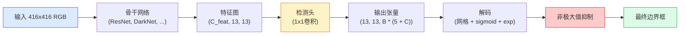

# 目标检测——从零实现YOLO

> 检测是分类加回归，在特征图的每个位置执行，然后通过非极大值抑制（Non-Maximum Suppression）进行清理。

**类型：** 构建
**语言：** Python
**前置知识：** 第四阶段第03课（卷积神经网络CNN）、第四阶段第04课（图像分类）、第四阶段第05课（迁移学习）
**时间：** 约75分钟

## 学习目标

- 解释将检测转化为密集预测（Dense Prediction）问题的网格与锚点（Grid-and-Anchor）设计，并说明输出张量中每个数字的含义
- 计算边界框之间的交并比（Intersection-over-Union，IoU），并从头实现非极大值抑制（Non-Maximum Suppression，NMS）
- 在预训练骨干网络（Backbone）上构建最小化的YOLO风格检测头，包含分类损失（Classification Loss）、目标存在性损失（Objectness Loss）和边界框回归损失（Box-Regression Loss）
- 阅读检测指标行（precision@0.5、recall、mAP@0.5、mAP@0.5:0.95），并判断下一步应调整哪个参数

## 问题

分类说“这张图是一只狗”。检测说“在像素(112, 40, 280, 210)处有一只狗，在(400, 180, 560, 310)处有一只猫，画面中没有其他物体”。这一结构性变化——预测可变数量的带标签边界框，而不是每张图一个标签——是所有自主系统、安防产品、文档布局解析器和工厂视觉流水线依赖的基础。

检测也是视觉领域所有工程权衡同时显现的地方。你需要精确的边界框（回归头），每个框的正确类别（分类头），模型知道何时没有物体可检测（目标存在性分数），以及每个真实物体恰好一个预测（非极大值抑制）。缺少任何一项，流水线都会漏检物体、报告幻觉框，或以稍有不同的位置同一物体预测十五次。

YOLO（You Only Look Once，Redmon等人，2016）是首次通过单个卷积神经网络前向传播实现所有这些步骤并达到实时运行的设计，同样的结构性决策至今仍是现代检测器（YOLOv8、YOLOv9、YOLO-NAS、RT-DETR）的骨干。掌握了核心原理，每个变体就都成了相同部件的重新排列。

## 概念

### 检测作为密集预测

一个分类器每张图输出C个数字。一个YOLO风格的检测器每张图输出`(S x S x (5 + C))`个数字，其中S是空间网格大小。



每个`S * S`网格单元预测`B`个框。对于每个框：

- 4个数字描述几何信息：`tx, ty, tw, th`。
- 1个数字是目标存在性分数：该单元中心是否存在物体？
- C个数字是类别概率。

每单元总计：`B * (5 + C)`。对于VOC数据集，`S=13, B=2, C=20`，每单元共50个数字。

### 为什么使用网格和锚点

纯粹的回归会为每个物体预测绝对值`(x, y, w, h)`。这对卷积网络来说很困难，因为平移图像不应该将所有预测平移相同的量——每个物体在空间上是有锚点的。网格通过将每个真实边界框分配给其中心所在的网格单元来解决这个问题：只有该单元对该物体负责。

锚点解决了第二个问题。一个3x3卷积很难从16像素感受野的特征单元中回归出500像素宽的框。相反，我们预先为每个单元定义`B`个先验框形状（锚点），并预测每个锚点的小增量。模型学习选择正确的锚点并进行微调，而不是从零开始回归。

```
锚点框先验（以416x416输入为例）：

  小尺寸:   (30,  60)
  中尺寸:  (75,  170)
  大尺寸:  (200, 380)

在每个网格单元，每个锚点输出(tx, ty, tw, th, obj, c_1, ..., c_C)。
```

现代检测器通常使用特征金字塔网络（FPN），并在不同分辨率上使用不同的锚点集——浅层高分辨率特征图用小锚点，深层低分辨率特征图用大锚点。思想相同，只是增加了尺度。

### 解码预测

原始的`tx, ty, tw, th`不是边界框坐标，而是在绘制之前需要转换的回归目标：

```
中心点 x  = (sigmoid(tx) + 单元_x) * 步长
中心点 y  = (sigmoid(ty) + 单元_y) * 步长
宽度      = 锚点_w * exp(tw)
高度      = 锚点_h * exp(th)
```

`sigmoid`将中心点偏移限制在单元内部。`exp`允许宽度从锚点自由缩放，不会出现符号翻转。`步长`将网格坐标缩放回像素。自从YOLOv2以来，这个解码步骤在所有YOLO版本中都是相同的。

### IoU

检测中两个边界框之间的通用相似度度量：

```
IoU(A, B) = A与B交集面积 / A与B并集面积
```

IoU = 1表示完全相同；IoU = 0表示无重叠。预测框与真实框之间的IoU决定了预测是否算作真阳性（通常IoU >= 0.5）。两个预测框之间的IoU是NMS用于去重的依据。

### 非极大值抑制

在相邻锚点上训练的卷积网络通常会为同一物体预测重叠的框。NMS保留置信度最高的预测，并删除任何与它IoU超过阈值的其他预测。

```
NMS(边界框, 分数, iou_阈值):
    按分数降序排序框
    保留列表 = []
    当框非空时:
        选择分数最高的框，添加到保留列表
        删除所有与选中框的IoU > iou_阈值的框
    返回保留列表
```

典型阈值：目标检测中为0.45。最近的检测器用`soft-NMS`、`DIoU-NMS`替代标准NMS，或直接学习抑制（如RT-DETR），但结构性用途相同。

### 损失函数

YOLO损失是三个损失的加权和：

```
L = lambda_coord * L_box(预测, 目标, 在obj=1的位置)
  + lambda_obj   * L_obj(预测, 1,     在obj=1的位置)
  + lambda_noobj * L_obj(预测, 0,     在obj=0的位置)
  + lambda_cls   * L_cls(预测, 目标, 在obj=1的位置)
```

只有包含物体的单元对边界框回归损失和分类损失有贡献。不含物体的单元只对目标存在性损失有贡献（教导模型保持沉默）。`lambda_noobj`通常较小（约0.5），因为绝大多数单元是空的，否则它们会主导总损失。

现代变体将MSE框损失替换为CIoU / DIoU（直接优化IoU），使用焦点损失（Focal Loss）处理类别不平衡，并通过质量焦点损失（Quality Focal Loss）平衡目标存在性。三部分结构保持不变。

### 检测指标

准确率不适用于检测。以下四个指标适用：

- **Precision@IoU=0.5** —— 在被计为正例的预测中，有多少是正确的。
- **Recall@IoU=0.5** —— 在真实物体中，我们找出了多少。
- **AP@0.5** —— 在IoU阈值为0.5时的精确率-召回率曲线下面积；每个类别一个数字。
- **mAP@0.5:0.95** —— 在IoU阈值0.5、0.55、...、0.95上的平均AP。COCO指标；最严格且信息量最大。

报告全部四个指标。如果一个检测器在mAP@0.5上很强，但在mAP@0.5:0.95上较弱，说明定位粗略但不精确；通过更好的边界框回归损失来修复。如果检测器精确率高但召回率低，则过于保守；降低置信度阈值或增加目标存在性权重。

## 构建实现

### 第1步：IoU

本节课的核心工具。处理两个以`(x1, y1, x2, y2)`格式的框数组。

```python
import numpy as np

def box_iou(boxes_a, boxes_b):
    ax1, ay1, ax2, ay2 = boxes_a[:, 0], boxes_a[:, 1], boxes_a[:, 2], boxes_a[:, 3]
    bx1, by1, bx2, by2 = boxes_b[:, 0], boxes_b[:, 1], boxes_b[:, 2], boxes_b[:, 3]

    inter_x1 = np.maximum(ax1[:, None], bx1[None, :])
    inter_y1 = np.maximum(ay1[:, None], by1[None, :])
    inter_x2 = np.minimum(ax2[:, None], bx2[None, :])
    inter_y2 = np.minimum(ay2[:, None], by2[None, :])

    inter_w = np.clip(inter_x2 - inter_x1, 0, None)
    inter_h = np.clip(inter_y2 - inter_y1, 0, None)
    inter = inter_w * inter_h

    area_a = (ax2 - ax1) * (ay2 - ay1)
    area_b = (bx2 - bx1) * (by2 - by1)
    union = area_a[:, None] + area_b[None, :] - inter
    return inter / np.clip(union, 1e-8, None)
```

返回一个`(N_a, N_b)`的成对IoU矩阵。通过对一个数组设置形状为`(1, 4)`，可以将其用于单个真实框。

### 第2步：非极大值抑制

```python
def nms(boxes, scores, iou_threshold=0.45):
    order = np.argsort(-scores)
    keep = []
    while len(order) > 0:
        i = order[0]
        keep.append(i)
        if len(order) == 1:
            break
        rest = order[1:]
        ious = box_iou(boxes[[i]], boxes[rest])[0]
        order = rest[ious <= iou_threshold]
    return np.array(keep, dtype=np.int64)
```

确定性算法，排序产生`O(N log N)`复杂度，且在相同输入上与`torchvision.ops.nms`行为一致。

### 第3步：边界框编码与解码

在像素坐标和网络实际回归的`(tx, ty, tw, th)`目标之间转换。

```python
def encode(box_xyxy, cell_x, cell_y, stride, anchor_wh):
    x1, y1, x2, y2 = box_xyxy
    cx = 0.5 * (x1 + x2)
    cy = 0.5 * (y1 + y2)
    w = x2 - x1
    h = y2 - y1
    tx = cx / stride - cell_x
    ty = cy / stride - cell_y
    tw = np.log(w / anchor_wh[0] + 1e-8)
    th = np.log(h / anchor_wh[1] + 1e-8)
    return np.array([tx, ty, tw, th])


def decode(tx_ty_tw_th, cell_x, cell_y, stride, anchor_wh):
    tx, ty, tw, th = tx_ty_tw_th
    cx = (sigmoid(tx) + cell_x) * stride
    cy = (sigmoid(ty) + cell_y) * stride
    w = anchor_wh[0] * np.exp(tw)
    h = anchor_wh[1] * np.exp(th)
    return np.array([cx - w / 2, cy - h / 2, cx + w / 2, cy + h / 2])


def sigmoid(x):
    return 1.0 / (1.0 + np.exp(-x))
```

测试：编码一个框后再解码——你应得到非常接近原始值的结果（如果`tx`不在sigmoid后的范围内，sigmoid逆变换可能不是完全可逆的）。

### 第4步：最小化的YOLO检测头

在特征图上使用一个1x1卷积，重塑为`(B, S, S, num_anchors, 5 + C)`。

```python
import torch
import torch.nn as nn

class YOLOHead(nn.Module):
    def __init__(self, in_c, num_anchors, num_classes):
        super().__init__()
        self.num_anchors = num_anchors
        self.num_classes = num_classes
        self.conv = nn.Conv2d(in_c, num_anchors * (5 + num_classes), kernel_size=1)

    def forward(self, x):
        n, _, h, w = x.shape
        y = self.conv(x)
        y = y.view(n, self.num_anchors, 5 + self.num_classes, h, w)
        y = y.permute(0, 3, 4, 1, 2).contiguous()
        return y
```

输出形状：`(N, H, W, num_anchors, 5 + C)`。最后一个维度包含`[tx, ty, tw, th, obj, cls_0, ..., cls_{C-1}]`。

### 第5步：真实框分配

对于每个真实边界框，决定哪个`(单元, 锚点)`负责。

```python
def assign_targets(boxes_xyxy, classes, anchors, stride, grid_size, num_classes):
    num_anchors = len(anchors)
    target = np.zeros((grid_size, grid_size, num_anchors, 5 + num_classes), dtype=np.float32)
    has_obj = np.zeros((grid_size, grid_size, num_anchors), dtype=bool)

    for box, cls in zip(boxes_xyxy, classes):
        x1, y1, x2, y2 = box
        cx, cy = 0.5 * (x1 + x2), 0.5 * (y1 + y2)
        gx, gy = int(cx / stride), int(cy / stride)
        bw, bh = x2 - x1, y2 - y1

        ious = np.array([
            (min(bw, aw) * min(bh, ah)) / (bw * bh + aw * ah - min(bw, aw) * min(bh, ah))
            for aw, ah in anchors
        ])
        best = int(np.argmax(ious))
        aw, ah = anchors[best]

        target[gy, gx, best, 0] = cx / stride - gx
        target[gy, gx, best, 1] = cy / stride - gy
        target[gy, gx, best, 2] = np.log(bw / aw + 1e-8)
        target[gy, gx, best, 3] = np.log(bh / ah + 1e-8)
        target[gy, gx, best, 4] = 1.0
        target[gy, gx, best, 5 + cls] = 1.0
        has_obj[gy, gx, best] = True
    return target, has_obj
```

锚点选择为“与真实框的最佳形状IoU”——一种廉价的近似，与YOLOv2/v3的分配一致。v5及以后版本使用了更复杂的策略（任务对齐匹配、动态k），这些策略优化了相同的思路。

### 第6步：三个损失函数

```python
def yolo_loss(pred, target, has_obj, lambda_coord=5.0, lambda_obj=1.0, lambda_noobj=0.5, lambda_cls=1.0):
    has_obj_t = torch.from_numpy(has_obj).bool()
    target_t = torch.from_numpy(target).float()

    # 边界框回归损失：仅在包含物体的单元上计算
    box_pred = pred[..., :4][has_obj_t]
    box_true = target_t[..., :4][has_obj_t]
    loss_box = torch.nn.functional.mse_loss(box_pred, box_true, reduction="sum")

    # 目标存在性损失
    obj_pred = pred[..., 4]
    obj_true = target_t[..., 4]
    loss_obj_pos = torch.nn.functional.binary_cross_entropy_with_logits(
        obj_pred[has_obj_t], obj_true[has_obj_t], reduction="sum")
    loss_obj_neg = torch.nn.functional.binary_cross_entropy_with_logits(
        obj_pred[~has_obj_t], obj_true[~