# 目标检测 —— 从零实现 YOLO

> 译注：本文译自同目录 [`en.md`](./en.md)。术语遵循仓根 [TRANSLATION_GUIDE.md](../../../../TRANSLATION_GUIDE.md)。

> 检测就是「分类 + 回归」，在 feature map 的每个位置都跑一遍，然后用 non-maximum suppression（非极大值抑制）清理掉重复结果。

**Type:** Build
**Languages:** Python
**Prerequisites:** Phase 4 Lesson 03 (CNNs), Phase 4 Lesson 04 (Image Classification), Phase 4 Lesson 05 (Transfer Learning)
**Time:** ~75 minutes

## 学习目标（Learning Objectives）

- 解释 grid-and-anchor 设计如何把检测转化为一个 dense prediction（密集预测）问题，并能说出输出张量里每一个数字的含义
- 计算两个 box 之间的 Intersection-over-Union（IoU），并从零实现 non-maximum suppression
- 在预训练 backbone 之上构建一个最小的 YOLO 风格 head，包含分类、objectness（对象存在性）、box 回归三种损失
- 看懂一行检测指标（precision@0.5, recall, mAP@0.5, mAP@0.5:0.95），并据此判断下一步该调哪个旋钮

## 问题（The Problem）

分类告诉你「这张图是一只狗」。检测则告诉你「在像素 (112, 40, 280, 210) 有一只狗，在 (400, 180, 560, 310) 有一只猫，画面里再没别的东西」。这一个结构性变化——预测一组数量可变的、带标签的 box，而不是给整张图配一个标签——撑起了所有自动驾驶系统、所有监控产品、所有文档版面解析、所有工厂视觉流水线。

检测也是视觉里所有工程权衡集中爆发的地方。你想要 box 准（回归 head），想要每个 box 类别对（分类 head），想要模型在画面里啥都没有的时候保持沉默（objectness 分数），还想要每个真实目标只对应一个预测（non-maximum suppression）。少了任何一个，pipeline 要么漏检，要么报出 hallucination（幻觉）出来的 box，要么把同一个目标在略有偏移的位置预测十五遍。

YOLO（You Only Look Once，Redmon et al. 2016）的设计让上述全部能在一次卷积网络前向传播里实时跑完，而同样的结构性决策至今仍是现代检测器（YOLOv8、YOLOv9、YOLO-NAS、RT-DETR）的骨架。把核心吃透，每个变体就只是同一组零件的不同排列组合。

## 概念（The Concept）

### 把检测看作 dense prediction（Detection as dense prediction）

分类器每张图输出 C 个数。YOLO 风格的检测器每张图输出 `(S x S x (5 + C))` 个数，其中 S 是空间网格大小。

```mermaid
flowchart LR
    IMG["输入 416x416 RGB"] --> BB["骨干网络<br/>（ResNet、DarkNet……）"]
    BB --> FM["特征图<br/>（C_feat, 13, 13）"]
    FM --> HEAD["检测头<br/>（1x1 卷积）"]
    HEAD --> OUT["输出张量<br/>（13, 13, B * （5 + C））"]
    OUT --> DEC["解码<br/>（grid + sigmoid + exp）"]
    DEC --> NMS["非极大值抑制"]
    NMS --> RESULT["最终检测框"]

    style IMG fill:#dbeafe,stroke:#2563eb
    style HEAD fill:#fef3c7,stroke:#d97706
    style NMS fill:#fecaca,stroke:#dc2626
    style RESULT fill:#dcfce7,stroke:#16a34a
```



`S * S` 个网格单元中，每个单元预测 `B` 个 box。每个 box 包含：

- 4 个数描述几何形状：`tx, ty, tw, th`。
- 1 个数是 objectness 分数：「这个 cell 里是否有一个目标的中心？」
- C 个数是各类别的概率。

每个 cell 总共 `B * (5 + C)` 个数。对 VOC 而言（`S=13, B=2, C=20`），就是每个 cell 50 个数。

### 为什么要 grid 和 anchor（Why grids and anchors）

朴素回归会把每个目标的 `(x, y, w, h)` 当作绝对坐标去预测。这对卷积网络来说很别扭：图像整体平移不应该让所有预测同步平移——每个目标都是空间锚定的。grid 给出的答案是：把每个 ground-truth box 分配给其中心落入的那个网格单元，仅由该单元负责预测这个目标。

anchor 解决的是另一个问题。一个 3x3 卷积很难从一个感受野只有 16 像素的 feature cell 里回归出一个 500 像素宽的 box。我们的做法是：在每个 cell 上预定义 `B` 个先验 box 形状（anchor），然后预测相对每个 anchor 的小幅偏移。模型学的是挑出合适的 anchor 并做小幅修正，而不是从零回归。

```
Anchor box priors (example for 416x416 input):

  small:   (30,  60)
  medium:  (75,  170)
  large:   (200, 380)

At each grid cell, every anchor emits (tx, ty, tw, th, obj, c_1, ..., c_C).
```

现代检测器常用 FPN，在不同分辨率上配不同的 anchor 集合——浅层高分辨率 map 上用小 anchor，深层低分辨率 map 上用大 anchor。思路一样，只是多了几个尺度。

### 解码预测（Decoding predictions）

原始的 `tx, ty, tw, th` 并不是 box 坐标，它们是回归目标，绘图前必须做变换：

```
centre x  = (sigmoid(tx) + cell_x) * stride
centre y  = (sigmoid(ty) + cell_y) * stride
width     = anchor_w * exp(tw)
height    = anchor_h * exp(th)
```

`sigmoid` 把中心偏移限制在 cell 内部。`exp` 让宽度可以从 anchor 自由缩放且不会出现负值。`stride` 把网格坐标缩放回像素。这套解码自 YOLOv2 起每一代 YOLO 都一样。

### IoU

检测里两个 box 之间的通用相似度度量：

```
IoU(A, B) = area(A intersect B) / area(A union B)
```

IoU = 1 表示完全相同，IoU = 0 表示毫无重叠。预测和 ground-truth 之间的 IoU 决定了一个预测是否算 true positive（通常 IoU >= 0.5）。两个预测之间的 IoU 则被 NMS 用来去重。

### Non-maximum suppression（非极大值抑制）

在相邻 anchor 上训练出来的卷积网络经常会对同一个目标预测多个重叠 box。NMS 保留置信度最高的那个，并删除其余所有 IoU 超过阈值的预测。

```
NMS(boxes, scores, iou_threshold):
    sort boxes by score descending
    keep = []
    while boxes not empty:
        pick the top-scoring box, add to keep
        remove every box with IoU > iou_threshold to the picked box
    return keep
```

目标检测里的典型阈值是 0.45。最近的检测器把标准 NMS 换成了 `soft-NMS`、`DIoU-NMS`，或者干脆直接学习抑制（RT-DETR），但结构性目的一样。

### 损失（The loss）

YOLO 损失是三个加权相加的损失：

```
L = lambda_coord * L_box(pred, target, where obj=1)
  + lambda_obj   * L_obj(pred, 1,     where obj=1)
  + lambda_noobj * L_obj(pred, 0,     where obj=0)
  + lambda_cls   * L_cls(pred, target, where obj=1)
```

只有包含目标的 cell 才会贡献 box 回归损失和分类损失。不含目标的 cell 只贡献 objectness 损失（教模型保持沉默）。`lambda_noobj` 通常很小（约 0.5），因为绝大多数 cell 都是空的，否则会主导总损失。

现代变体把 MSE box 损失换成 CIoU / DIoU（直接优化 IoU），用 focal loss 处理类别不平衡，用 quality focal loss 平衡 objectness。三段式结构本身没变。

### 检测指标（Detection metrics）

Accuracy 没法迁移到检测。下面四个数才行：

- **Precision@IoU=0.5** —— 在被判为正类的预测里，有多少是真正确的。
- **Recall@IoU=0.5** —— 在所有真实目标里，我们找到了多少。
- **AP@0.5** —— IoU 阈值 0.5 下 precision-recall 曲线的面积；每个类别一个数。
- **mAP@0.5:0.95** —— 在 IoU 阈值 0.5、0.55、…、0.95 上对 AP 取平均。COCO 指标，最严格也最有信息量。

四个都要报。一个 mAP@0.5 强但 mAP@0.5:0.95 弱的检测器，说明它定位「大致对但不够紧」；用更好的 box 回归损失修。一个 precision 高但 recall 低的检测器太保守了；调低置信度阈值或加大 objectness 权重。

## 动手实现（Build It）

### 第 1 步：IoU（Step 1: IoU）

整节课的主力函数。处理两组 `(x1, y1, x2, y2)` 格式的 box 数组。

```python
import numpy as np

def box_iou(boxes_a, boxes_b):
    ax1, ay1, ax2, ay2 = boxes_a[:, 0], boxes_a[:, 1], boxes_a[:, 2], boxes_a[:, 3]
    bx1, by1, bx2, by2 = boxes_b[:, 0], boxes_b[:, 1], boxes_b[:, 2], boxes_b[:, 3]

    inter_x1 = np.maximum(ax1[:, None], bx1[None, :])
    inter_y1 = np.maximum(ay1[:, None], by1[None, :])
    inter_x2 = np.minimum(ax2[:, None], bx2[None, :])
    inter_y2 = np.minimum(ay2[:, None], by2[None, :])

    inter_w = np.clip(inter_x2 - inter_x1, 0, None)
    inter_h = np.clip(inter_y2 - inter_y1, 0, None)
    inter = inter_w * inter_h

    area_a = (ax2 - ax1) * (ay2 - ay1)
    area_b = (bx2 - bx1) * (by2 - by1)
    union = area_a[:, None] + area_b[None, :] - inter
    return inter / np.clip(union, 1e-8, None)
```

返回一个 `(N_a, N_b)` 的两两 IoU 矩阵。要和单个 ground-truth box 比，把其中一个数组形状设为 `(1, 4)` 即可。

### 第 2 步：Non-max suppression（Step 2: Non-max suppression）

```python
def nms(boxes, scores, iou_threshold=0.45):
    order = np.argsort(-scores)
    keep = []
    while len(order) > 0:
        i = order[0]
        keep.append(i)
        if len(order) == 1:
            break
        rest = order[1:]
        ious = box_iou(boxes[[i]], boxes[rest])[0]
        order = rest[ious <= iou_threshold]
    return np.array(keep, dtype=np.int64)
```

确定性的，因为排序复杂度是 `O(N log N)`，在相同输入下行为与 `torchvision.ops.nms` 一致。

### 第 3 步：Box 编码与解码（Step 3: Box encoding and decoding）

在像素坐标和网络实际回归的 `(tx, ty, tw, th)` 目标之间互转。

```python
def encode(box_xyxy, cell_x, cell_y, stride, anchor_wh):
    x1, y1, x2, y2 = box_xyxy
    cx = 0.5 * (x1 + x2)
    cy = 0.5 * (y1 + y2)
    w = x2 - x1
    h = y2 - y1
    tx = cx / stride - cell_x
    ty = cy / stride - cell_y
    tw = np.log(w / anchor_wh[0] + 1e-8)
    th = np.log(h / anchor_wh[1] + 1e-8)
    return np.array([tx, ty, tw, th])


def decode(tx_ty_tw_th, cell_x, cell_y, stride, anchor_wh):
    tx, ty, tw, th = tx_ty_tw_th
    cx = (sigmoid(tx) + cell_x) * stride
    cy = (sigmoid(ty) + cell_y) * stride
    w = anchor_wh[0] * np.exp(tw)
    h = anchor_wh[1] * np.exp(th)
    return np.array([cx - w / 2, cy - h / 2, cx + w / 2, cy + h / 2])


def sigmoid(x):
    return 1.0 / (1.0 + np.exp(-x))
```

测试方法：先 encode 一个 box，再 decode——你应该拿回非常接近原始 box 的结果（由于 `tx` 不在 sigmoid 后值域时其反函数无法完美还原，会有一些误差）。

### 第 4 步：一个最小的 YOLO head（Step 4: A minimal YOLO head）

在 feature map 上做一个 1x1 卷积，再 reshape 成 `(B, S, S, num_anchors, 5 + C)`。

```python
import torch
import torch.nn as nn

class YOLOHead(nn.Module):
    def __init__(self, in_c, num_anchors, num_classes):
        super().__init__()
        self.num_anchors = num_anchors
        self.num_classes = num_classes
        self.conv = nn.Conv2d(in_c, num_anchors * (5 + num_classes), kernel_size=1)

    def forward(self, x):
        n, _, h, w = x.shape
        y = self.conv(x)
        y = y.view(n, self.num_anchors, 5 + self.num_classes, h, w)
        y = y.permute(0, 3, 4, 1, 2).contiguous()
        return y
```

输出形状：`(N, H, W, num_anchors, 5 + C)`。最后一维存的是 `[tx, ty, tw, th, obj, cls_0, ..., cls_{C-1}]`。

### 第 5 步：Ground-truth 分配（Step 5: Ground-truth assignment）

对每个 ground-truth box，决定哪个 `(cell, anchor)` 来负责。

```python
def assign_targets(boxes_xyxy, classes, anchors, stride, grid_size, num_classes):
    num_anchors = len(anchors)
    target = np.zeros((grid_size, grid_size, num_anchors, 5 + num_classes), dtype=np.float32)
    has_obj = np.zeros((grid_size, grid_size, num_anchors), dtype=bool)

    for box, cls in zip(boxes_xyxy, classes):
        x1, y1, x2, y2 = box
        cx, cy = 0.5 * (x1 + x2), 0.5 * (y1 + y2)
        gx, gy = int(cx / stride), int(cy / stride)
        bw, bh = x2 - x1, y2 - y1

        ious = np.array([
            (min(bw, aw) * min(bh, ah)) / (bw * bh + aw * ah - min(bw, aw) * min(bh, ah))
            for aw, ah in anchors
        ])
        best = int(np.argmax(ious))
        aw, ah = anchors[best]

        target[gy, gx, best, 0] = cx / stride - gx
        target[gy, gx, best, 1] = cy / stride - gy
        target[gy, gx, best, 2] = np.log(bw / aw + 1e-8)
        target[gy, gx, best, 3] = np.log(bh / ah + 1e-8)
        target[gy, gx, best, 4] = 1.0
        target[gy, gx, best, 5 + cls] = 1.0
        has_obj[gy, gx, best] = True
    return target, has_obj
```

anchor 选择规则是「与 ground truth 形状 IoU 最大」——一个匹配 YOLOv2/v3 分配方式的廉价代理。v5 之后采用了更复杂的策略（task-aligned matching、动态 k），但核心思路还是它的细化版。

### 第 6 步：三段式损失（Step 6: The three losses）

```python
def yolo_loss(pred, target, has_obj, lambda_coord=5.0, lambda_obj=1.0, lambda_noobj=0.5, lambda_cls=1.0):
    has_obj_t = torch.from_numpy(has_obj).bool()
    target_t = torch.from_numpy(target).float()

    # box-regression loss: only on cells with objects
    box_pred = pred[..., :4][has_obj_t]
    box_true = target_t[..., :4][has_obj_t]
    loss_box = torch.nn.functional.mse_loss(box_pred, box_true, reduction="sum")

    # objectness loss
    obj_pred = pred[..., 4]
    obj_true = target_t[..., 4]
    loss_obj_pos = torch.nn.functional.binary_cross_entropy_with_logits(
        obj_pred[has_obj_t], obj_true[has_obj_t], reduction="sum")
    loss_obj_neg = torch.nn.functional.binary_cross_entropy_with_logits(
        obj_pred[~has_obj_t], obj_true[~has_obj_t], reduction="sum")

    # classification loss on cells with objects
    cls_pred = pred[..., 5:][has_obj_t]
    cls_true = target_t[..., 5:][has_obj_t]
    loss_cls = torch.nn.functional.binary_cross_entropy_with_logits(
        cls_pred, cls_true, reduction="sum")

    total = (lambda_coord * loss_box
             + lambda_obj * loss_obj_pos
             + lambda_noobj * loss_obj_neg
             + lambda_cls * loss_cls)
    return total, {"box": loss_box.item(), "obj_pos": loss_obj_pos.item(),
                   "obj_neg": loss_obj_neg.item(), "cls": loss_cls.item()}
```

每个 YOLO 教程都会硬编码或调参的五个超参数。比例很关键：`lambda_coord=5, lambda_noobj=0.5` 沿用了原始 YOLOv1 论文的设定，作为合理默认值至今仍然好用。

### 第 7 步：推理流水线（Step 7: Inference pipeline）

解码 head 的原始输出，套 sigmoid/exp，按 objectness 阈值筛掉，再做 NMS。

```python
def postprocess(pred_tensor, anchors, stride, img_size, conf_threshold=0.25, iou_threshold=0.45):
    pred = pred_tensor.detach().cpu().numpy()
    grid_h, grid_w = pred.shape[1], pred.shape[2]
    num_anchors = len(anchors)

    boxes, scores, classes = [], [], []
    for gy in range(grid_h):
        for gx in range(grid_w):
            for a in range(num_anchors):
                tx, ty, tw, th, obj, *cls = pred[0, gy, gx, a]
                score = sigmoid(obj) * sigmoid(np.array(cls)).max()
                if score < conf_threshold:
                    continue
                cls_idx = int(np.argmax(cls))
                cx = (sigmoid(tx) + gx) * stride
                cy = (sigmoid(ty) + gy) * stride
                w = anchors[a][0] * np.exp(tw)
                h = anchors[a][1] * np.exp(th)
                boxes.append([cx - w / 2, cy - h / 2, cx + w / 2, cy + h / 2])
                scores.append(float(score))
                classes.append(cls_idx)

    if not boxes:
        return np.zeros((0, 4)), np.zeros((0,)), np.zeros((0,), dtype=int)
    boxes = np.array(boxes)
    scores = np.array(scores)
    classes = np.array(classes)
    keep = nms(boxes, scores, iou_threshold)
    return boxes[keep], scores[keep], classes[keep]
```

完整的评估路径就这些：head -> decode -> 阈值筛选 -> NMS。

## 用起来（Use It）

`torchvision.models.detection` 里有现成的生产级检测器，结构与上面同源。加载一个预训练模型只要三行。

```python
import torch
from torchvision.models.detection import fasterrcnn_resnet50_fpn_v2

model = fasterrcnn_resnet50_fpn_v2(weights="DEFAULT")
model.eval()
with torch.no_grad():
    predictions = model([torch.randn(3, 400, 600)])
print(predictions[0].keys())
print(f"boxes:  {predictions[0]['boxes'].shape}")
print(f"scores: {predictions[0]['scores'].shape}")
print(f"labels: {predictions[0]['labels'].shape}")
```

实时推理流水线方面，`ultralytics`（YOLOv8/v9）是事实标准：`from ultralytics import YOLO; model = YOLO('yolov8n.pt'); model(img)`。这个模型内部已经处理了解码和 NMS，返回的也是你上面构建的同款 `boxes / scores / labels` 三元组。

## 上线部署（Ship It）

本课产出：

- `outputs/prompt-detection-metric-reader.md` —— 一段 prompt，把 `precision, recall, AP, mAP@0.5:0.95` 这一行指标转成一句诊断结论 + 最该做的下一个实验。
- `outputs/skill-anchor-designer.md` —— 一个 skill：给定一份 ground-truth box 数据集，对 `(w, h)` 跑 k-means，返回每个 FPN 层级的 anchor 集合，外加你挑选 anchor 数量所需的覆盖率统计。

## 练习（Exercises）

1. **（简单）** 实现 `box_iou`，然后在 1,000 对随机 box 上与 `torchvision.ops.box_iou` 对比，验证最大绝对误差小于 `1e-6`。
2. **（中等）** 把 `yolo_loss` 改造成用 `CIoU` box 损失替代 MSE 的版本。在 100 张图的合成数据集上证明：相同 epoch 数下，CIoU 收敛到的最终 mAP@0.5:0.95 优于 MSE。
3. **（困难）** 实现 multi-scale 推理：用三个分辨率把同一张图喂给模型，把 box 预测合并起来，最后只跑一次 NMS。在留出集上测量相对单尺度推理的 mAP 提升。

## 关键术语（Key Terms）

| 术语 | 大家的口头说法 | 它实际指的是 |
|------|----------------|----------------------|
| Anchor | 「box 先验」 | 每个网格 cell 上预定义的 box 形状，网络在它的基础上预测偏移量，而不是预测绝对坐标 |
| IoU | 「重叠度」 | 两个 box 的 intersection-over-union；检测里的通用相似度度量 |
| NMS | 「去重」 | 贪心算法：保留分数最高的预测，删除与之 IoU 超过阈值的其他预测 |
| Objectness | 「这里有没有东西」 | 每个 anchor、每个 cell 上的标量，预测该 cell 是否有目标的中心 |
| Grid stride | 「下采样倍数」 | 每个网格 cell 对应的像素数；输入 416 像素、grid 是 13 的 head，stride 是 32 |
| mAP | 「mean average precision」 | precision-recall 曲线下面积的平均值，跨类别（COCO 还跨 IoU 阈值）平均 |
| AP@0.5 | 「PASCAL VOC AP」 | IoU 阈值 0.5 下的 average precision；指标里偏宽松的版本 |
| mAP@0.5:0.95 | 「COCO AP」 | 在 IoU 阈值 0.5..0.95、步长 0.05 上取平均；严格版本，是当前社区标准 |

## 延伸阅读（Further Reading）

- [YOLOv1: You Only Look Once (Redmon et al., 2016)](https://arxiv.org/abs/1506.02640) —— 奠基论文；之后所有 YOLO 都是对这个结构的细化
- [YOLOv3 (Redmon & Farhadi, 2018)](https://arxiv.org/abs/1804.02767) —— 引入多尺度 FPN 风格 head 的论文；至今仍是最清晰的图示
- [Ultralytics YOLOv8 docs](https://docs.ultralytics.com) —— 当前的生产级参考；覆盖数据集格式、数据增强、训练 recipe（配方）
- [The Illustrated Guide to Object Detection (Jonathan Hui)](https://jonathan-hui.medium.com/object-detection-series-24d03a12f904) —— 对整个检测器家族最佳的白话导览；对理解 DETR、RetinaNet、FCOS、YOLO 之间的关系无价
