```mermaid
flowchart LR
    IMG["Input 416x416 RGB"] --> BB["Backbone<br/>(ResNet, DarkNet, ...)"]
    BB --> FM["Feature map<br/>(C_feat, 13, 13)"]
    FM --> HEAD["Detection head<br/>(1x1 convs)"]
    HEAD --> OUT["Output tensor<br/>(13, 13, B * (5 + C))"]
    OUT --> DEC["Decode<br/>(grid + sigmoid + exp)"]
    DEC --> NMS["Non-max suppression"]
    NMS --> RESULT["Final boxes"]

    style IMG fill:#dbeafe,stroke:#2563eb
    style HEAD fill:#fef3c7,stroke:#d97706
    style NMS fill:#fecaca,stroke:#dc2626
    style RESULT fill:#dcfce7,stroke:#16a34a
```

# Object Detection — YOLO from Scratch

> 检测是分类加回归，在特征地图中的每个位置运行，然后通过非最大抑制进行清理。

** 类型：** 构建
** 语言：** Python
** 前提：** 阶段4第3课（CNN），阶段4第4课（图像分类），阶段4第5课（迁移学习）
** 时间：** ~75分钟

## Learning Objectives

- 解释将检测转化为密集预测问题的网格和锚点设计，并说明输出张量中的每个数字的含义
- 计算方框之间的交集并从头开始实施非最大抑制
- 在预先训练的脊柱上建造一个最小的YOLO风格的头部，包括分类、对象性和箱形回归损失
- 读取检测指标行（precision@0.5，recall，mAP@0.5，mAP@0.5：0.95）并选择接下来要转动的旋钮

## The Problem

分类称“这个图像是一只狗。“检测说“像素（112、40、280、210）处有一只狗，像素（400、180、560、310）处有一只猫，帧中没有其他东西。“这一结构性变化--预测可变数量的标签框，而不是每张图像一个标签--是每个自治系统、每个监控产品、每个文档布局解析器和每个工厂视线所依赖的。

检测也是视觉中的每一项工程权衡同时出现的地方。您想要准确的框（回归头），您想要每个框的正确类（分类头），您希望模型知道何时没有任何东西可检测（对象性分数），并且您想要每个真实对象恰好一个预测（非最大抑制）。错过其中任何一个，管道要么错过对象，报告幻觉框，要么在稍微不同的位置预测同一对象十五次。

YOLO（You Only Look Once，Redmon等人，2016）是一种设计，通过一次前向传递conv网络，使所有这些都实时运行，并且相同的结构决策仍然是现代探测器（YOLOv 8、YOLOv 9、YOLO-NAS、RT-DETR）的支柱。了解核心，每个变体都会成为相同部分的重新排列。

## The Concept

### Detection as dense prediction

分类器输出每个图像的C数。YOLO风格的检测器输出每张图像的“（S x S x（5 + C））”数字，其中S是空间网格大小。



每个“S * S”网格单元预测“B”框。对于每个盒子：

- 4个数字描述几何形状：' x，ty，TW，th '。
- 1数字是对象性得分：“这个单元格中是否有对象？"
- C数是类概率。

每个单元格总数：“B *（5 + C）”。对于“S=13，B=2，C=20”的VOC，即每个单元格50个数字。

### Why grids and anchors

Plain regression would predict `(x, y, w, h)` for every object as an absolute coordinate. That is hard for a conv network because translating the image should not translate all predictions by the same amount — each object is spatially anchored. The grid answers this by assigning each ground-truth box to the grid cell its centre falls in; only that cell is responsible for that object.

Anchors address a second problem. A 3x3 conv cannot easily regress a 500-pixel-wide box out of a 16-pixel receptive field feature cell. Instead, we pre-define `B` prior box shapes (anchors) per cell and predict small deltas from each anchor. The model learns to pick the right anchor and nudge it rather than regress from nothing.

```
Anchor box priors (example for 416x416 input):

  small:   (30,  60)
  medium:  (75,  170)
  large:   (200, 380)

At each grid cell, every anchor emits (tx, ty, tw, th, obj, c_1, ..., c_C).
```

现代探测器通常使用具有不同分辨率锚集的FPN-浅层高分辨率地图上的小锚，深层低分辨率地图上的大锚。同样的想法，更多的规模。

### Decoding predictions

原始的“tx，ty，tw，th”不是框坐标;它们是在绘图之前要转换的回归目标：

```
centre x  = (sigmoid(tx) + cell_x) * stride
centre y  = (sigmoid(ty) + cell_y) * stride
width     = anchor_w * exp(tw)
height    = anchor_h * exp(th)
```

“sigmoid”将中心偏差保留在单元内。“BEP”让宽度从锚自由缩放，而无需翻转标志。“stride”将网格坐标缩放回像素。自v2以来的每个YOLO版本中，该解码步骤都是相同的。

### IoU

两个盒子之间检测的通用相似性指标：

```
IoU(A, B) = area(A intersect B) / area(A union B)
```

IoU = 1意味着相同; IoU = 0意味着没有重叠。预测和地面真值框之间的IoU决定预测是否算作真阳性（通常IoU >= 0.5）。两个预测之间的IoU是NMC用于重复数据消除的内容。

### Non-maximum suppression

在相邻锚上训练的conv网络通常会预测同一对象的重叠框。NMC保留最高置信度的预测，并删除IoU高于阈值的任何其他预测。

```
NMS(boxes, scores, iou_threshold):
    sort boxes by score descending
    keep = []
    while boxes not empty:
        pick the top-scoring box, add to keep
        remove every box with IoU > iou_threshold to the picked box
    return keep
```

典型阈值：物体检测0.45。最近的检测器用“soft-NMC”、“DIoU-NMC”取代标准NMC，或直接学习抑制（RT-DETR），但结构目的是相同的。

### The loss

YOLO损失是三个损失加上权重：

```
L = lambda_coord * L_box(pred, target, where obj=1)
  + lambda_obj   * L_obj(pred, 1,     where obj=1)
  + lambda_noobj * L_obj(pred, 0,     where obj=0)
  + lambda_cls   * L_cls(pred, target, where obj=1)
```

只有包含对象的单元格才会导致箱回归和分类损失。没有对象的细胞只会导致对象性损失（教导模型保持沉默）。“ambda_noobj”通常很小（~0.5），因为绝大多数单元格都是空的，否则将主导总损失。

现代变体将MSE框损失替换为CIoU / DIoU（直接优化IoU），使用焦点损失来实现类别不平衡，并平衡客观性与质量焦点损失。三个组成部分的结构不变。

### Detection metrics

准确性不会转移到检测。四个数字可以：

- ** 精度@IoU=0.5** -在被视为积极的预测中，有多少是实际正确的。
- ** 回想一下@IoU=0.5** -对于真实物体，我们找到了多少个。
- **AP@0.5** -IoU阈值0.5处的精确率召回曲线区域;每个类别一个数字。
- **mAP@0.5：0.95** -IoU阈值0.5、0.55、.、上AP的平均值0.95. COCO指标;最严格、信息量最大。

报告所有四个。在mAP@0.5上强但在mAP@0.5：0.95上弱的检测器正在粗略地定位但不紧密;使用更好的箱回归损失进行修复。高精度、低召回率的检测器过于保守;降低置信阈值或增加对象性权重。

## Build It

### Step 1: IoU

整节课的主力。适用于“（x1，y1，x2，y2）”格式的两个盒子数组。

```python
import numpy as np

def box_iou(boxes_a, boxes_b):
    ax1, ay1, ax2, ay2 = boxes_a[:, 0], boxes_a[:, 1], boxes_a[:, 2], boxes_a[:, 3]
    bx1, by1, bx2, by2 = boxes_b[:, 0], boxes_b[:, 1], boxes_b[:, 2], boxes_b[:, 3]

    inter_x1 = np.maximum(ax1[:, None], bx1[None, :])
    inter_y1 = np.maximum(ay1[:, None], by1[None, :])
    inter_x2 = np.minimum(ax2[:, None], bx2[None, :])
    inter_y2 = np.minimum(ay2[:, None], by2[None, :])

    inter_w = np.clip(inter_x2 - inter_x1, 0, None)
    inter_h = np.clip(inter_y2 - inter_y1, 0, None)
    inter = inter_w * inter_h

    area_a = (ax2 - ax1) * (ay2 - ay1)
    area_b = (bx2 - bx1) * (by2 - by1)
    union = area_a[:, None] + area_b[None, :] - inter
    return inter / np.clip(union, 1e-8, None)
```

返回成对IoU的“（N_a，N_b）”矩阵。通过将其中一个数组设置为“（1，4）”的形状，将其用于单个地面真值框。

### Step 2: Non-max suppression

```python
def nms(boxes, scores, iou_threshold=0.45):
    order = np.argsort(-scores)
    keep = []
    while len(order) > 0:
        i = order[0]
        keep.append(i)
        if len(order) == 1:
            break
        rest = order[1:]
        ious = box_iou(boxes[[i]], boxes[rest])[0]
        order = rest[ious <= iou_threshold]
    return np.array(keep, dtype=np.int64)
```

确定性，排序的O（N log N），并匹配相同输入上的torchvision.ops.nms的行为。

### Step 3: Box encoding and decoding

在像素坐标和网络实际回归的“（tt，ty，TW，th）”目标之间进行转换。

```python
def encode(box_xyxy, cell_x, cell_y, stride, anchor_wh):
    x1, y1, x2, y2 = box_xyxy
    cx = 0.5 * (x1 + x2)
    cy = 0.5 * (y1 + y2)
    w = x2 - x1
    h = y2 - y1
    tx = cx / stride - cell_x
    ty = cy / stride - cell_y
    tw = np.log(w / anchor_wh[0] + 1e-8)
    th = np.log(h / anchor_wh[1] + 1e-8)
    return np.array([tx, ty, tw, th])


def decode(tx_ty_tw_th, cell_x, cell_y, stride, anchor_wh):
    tx, ty, tw, th = tx_ty_tw_th
    cx = (sigmoid(tx) + cell_x) * stride
    cy = (sigmoid(ty) + cell_y) * stride
    w = anchor_wh[0] * np.exp(tw)
    h = anchor_wh[1] * np.exp(th)
    return np.array([cx - w / 2, cy - h / 2, cx + w / 2, cy + h / 2])


def sigmoid(x):
    return 1.0 / (1.0 + np.exp(-x))
```

测试：编码一个盒子，然后解码-您应该恢复非常接近原始的东西（直到当“xxx”不在后Sigmoid范围内时，Sigmoid逆不能完全可逆）。

### Step 4: A minimal YOLO head

要素地图上的一个1x 1 conv，重塑为“（B，S，S，num_anchors，5 + C）”。

```python
import torch
import torch.nn as nn

class YOLOHead(nn.Module):
    def __init__(self, in_c, num_anchors, num_classes):
        super().__init__()
        self.num_anchors = num_anchors
        self.num_classes = num_classes
        self.conv = nn.Conv2d(in_c, num_anchors * (5 + num_classes), kernel_size=1)

    def forward(self, x):
        n, _, h, w = x.shape
        y = self.conv(x)
        y = y.view(n, self.num_anchors, 5 + self.num_classes, h, w)
        y = y.permute(0, 3, 4, 1, 2).contiguous()
        return y
```

输出形状：`（N，H，W，num_anchors，5 + C）`。最后一个维度保存`[tx，ty，tw，th，obj，cls_0，.，cls_{C-1}]`。

### Step 5: Ground-truth assignment

对于每个地面真相框，决定哪个“（细胞、锚）”负责。

```python
def assign_targets(boxes_xyxy, classes, anchors, stride, grid_size, num_classes):
    num_anchors = len(anchors)
    target = np.zeros((grid_size, grid_size, num_anchors, 5 + num_classes), dtype=np.float32)
    has_obj = np.zeros((grid_size, grid_size, num_anchors), dtype=bool)

    for box, cls in zip(boxes_xyxy, classes):
        x1, y1, x2, y2 = box
        cx, cy = 0.5 * (x1 + x2), 0.5 * (y1 + y2)
        gx, gy = int(cx / stride), int(cy / stride)
        bw, bh = x2 - x1, y2 - y1

        ious = np.array([
            (min(bw, aw) * min(bh, ah)) / (bw * bh + aw * ah - min(bw, aw) * min(bh, ah))
            for aw, ah in anchors
        ])
        best = int(np.argmax(ious))
        aw, ah = anchors[best]

        target[gy, gx, best, 0] = cx / stride - gx
        target[gy, gx, best, 1] = cy / stride - gy
        target[gy, gx, best, 2] = np.log(bw / aw + 1e-8)
        target[gy, gx, best, 3] = np.log(bh / ah + 1e-8)
        target[gy, gx, best, 4] = 1.0
        target[gy, gx, best, 5 + cls] = 1.0
        has_obj[gy, gx, best] = True
    return target, has_obj
```

锚选择是“具有基本真相的最佳形状IoU”--一个与YOLOv 2/v3分配相匹配的廉价代理。v5和更高版本使用更复杂的策略（任务对齐匹配、动态k）来完善相同的想法。

### Step 6: The three losses

```python
def yolo_loss(pred, target, has_obj, lambda_coord=5.0, lambda_obj=1.0, lambda_noobj=0.5, lambda_cls=1.0):
    has_obj_t = torch.from_numpy(has_obj).bool()
    target_t = torch.from_numpy(target).float()

    # box-regression loss: only on cells with objects
    box_pred = pred[..., :4][has_obj_t]
    box_true = target_t[..., :4][has_obj_t]
    loss_box = torch.nn.functional.mse_loss(box_pred, box_true, reduction="sum")

    # objectness loss
    obj_pred = pred[..., 4]
    obj_true = target_t[..., 4]
    loss_obj_pos = torch.nn.functional.binary_cross_entropy_with_logits(
        obj_pred[has_obj_t], obj_true[has_obj_t], reduction="sum")
    loss_obj_neg = torch.nn.functional.binary_cross_entropy_with_logits(
        obj_pred[~has_obj_t], obj_true[~has_obj_t], reduction="sum")

    # classification loss on cells with objects
    cls_pred = pred[..., 5:][has_obj_t]
    cls_true = target_t[..., 5:][has_obj_t]
    loss_cls = torch.nn.functional.binary_cross_entropy_with_logits(
        cls_pred, cls_true, reduction="sum")

    total = (lambda_coord * loss_box
             + lambda_obj * loss_obj_pos
             + lambda_noobj * loss_obj_neg
             + lambda_cls * loss_cls)
    return total, {"box": loss_box.item(), "obj_pos": loss_obj_pos.item(),
                   "obj_neg": loss_obj_neg.item(), "cls": loss_cls.item()}
```

每个YOLO教程都会硬编码或扫描五个超参数。比率很重要：“lambda_coord=5，lambda_noobj=0.5”反映了原始的YOLOv 1论文，并且仍然可以作为合理的默认值。

### Step 7: Inference pipeline

解码原始头部输出、应用Sigmoid/BEP、对象阈值和NMC。

```python
def postprocess(pred_tensor, anchors, stride, img_size, conf_threshold=0.25, iou_threshold=0.45):
    pred = pred_tensor.detach().cpu().numpy()
    grid_h, grid_w = pred.shape[1], pred.shape[2]
    num_anchors = len(anchors)

    boxes, scores, classes = [], [], []
    for gy in range(grid_h):
        for gx in range(grid_w):
            for a in range(num_anchors):
                tx, ty, tw, th, obj, *cls = pred[0, gy, gx, a]
                score = sigmoid(obj) * sigmoid(np.array(cls)).max()
                if score < conf_threshold:
                    continue
                cls_idx = int(np.argmax(cls))
                cx = (sigmoid(tx) + gx) * stride
                cy = (sigmoid(ty) + gy) * stride
                w = anchors[a][0] * np.exp(tw)
                h = anchors[a][1] * np.exp(th)
                boxes.append([cx - w / 2, cy - h / 2, cx + w / 2, cy + h / 2])
                scores.append(float(score))
                classes.append(cls_idx)

    if not boxes:
        return np.zeros((0, 4)), np.zeros((0,)), np.zeros((0,), dtype=int)
    boxes = np.array(boxes)
    scores = np.array(scores)
    classes = np.array(classes)
    keep = nms(boxes, scores, iou_threshold)
    return boxes[keep], scores[keep], classes[keep]
```

这就是完整的eval路径：head -> decode -> threshold -> NMS。

## Use It

“Torchvision.models.Detection”推出具有相同概念结构的生产探测器。加载预训练模型需要三行。

```python
import torch
from torchvision.models.detection import fasterrcnn_resnet50_fpn_v2

model = fasterrcnn_resnet50_fpn_v2(weights="DEFAULT")
model.eval()
with torch.no_grad():
    predictions = model([torch.randn(3, 400, 600)])
print(predictions[0].keys())
print(f"boxes:  {predictions[0]['boxes'].shape}")
print(f"scores: {predictions[0]['scores'].shape}")
print(f"labels: {predictions[0]['labels'].shape}")
```

对于实时推理管道，“ultralytics”（YOLOv 8/v9）是标准：“从ultralytics导入YOLO;型号= YOLO（' yolov8n.pt '）;型号（IMG）'。该模型在内部处理解码和NMC，并返回与上面构建的相同的“盒子/分数/标签”三重。

## Ship It

本课产生：

- '输出/prompt-detection-metric-reader.md '-一个提示，将'精确度、召回、AP、mAP@0.5：0.95 '行转变为一行诊断和最有用的下一个实验。
- '输出/skill-anchor-designer.md '-一种技能，在给定地面真值框的数据集时，在“（w，h）”上运行k均值，并返回每个FPN级别的锚点集以及选择正确数量的锚点所需的覆盖统计数据。

## Exercises

1. **（简单）** 实现“box_iou”并在1，000个随机框对上运行“torchvision.ops.box_iou”。验证最大绝对差是否低于“1 e-6”。
2. **（中）** 将“yolo_loss”移植到使用“CIoU”box loss而不是SSE的版本。在100张图像合成数据集上显示，在相同数量的时期内，CIoU收敛到比SSE更好的最终mAP@0.5：0.95。
3. **（硬）** 实现多尺度推断：通过模型以三种分辨率输入相同的图像，合并方框预测，并在最后运行单个NMC。测量mAP提升与在固定集上进行单尺度推断。

## Key Terms

| Term | 别人怎么说 | 它实际上意味着什么 |
|------|----------------|----------------------|
| 锚 | “方框优先” | 每个网格单元处的预定义的箱形，网络根据该箱形预测增量而不是绝对坐标 |
| IOU | “重叠” | 两个盒子的相交并;检测中的通用相似性度量 |
| NMS | “重复数据删除” | 贪婪算法，保留最高评分预测并删除高于阈值的重叠预测 |
| 对象性 | “这里有东西吗” | 每个锚点、每个像元的标度预测对象是否以该像元为中心 |
| 网格步距 | “下采样因子” | 每个网格单元的像素数;具有13个网格头的416 px输入具有32步距 |
| 地图 | “平均平均精度” | 准确率-召回曲线下面积的平均值，类别和（对于COCO）IoU阈值的平均值 |
| AP@0.5 | “帕斯卡VOC AP” | IoU阈值0.5的平均精度;指标的宽松版本 |
| mAP@0.5：0.95 | “COCO AP” | IoU阈值平均值0.5.. 0.95步骤0.05;严格版本和当前社区标准 |

## Further Reading

- [YOLOv 1：你只看一次（Redmon等人，2016）]（https：//arxiv.org/ab/1506.02640）-创始论文;此后的每一篇YOLO都是对这一结构的改进
- [YOLOv 3（Redmon & Farhadi，2018）]（https：//arxiv.org/abs/1804.02767）-介绍多尺度FPN风格头像的论文;仍然是最清晰的图表
- [Ultralytics YOLOv 8 docs]（https：docs.ultralytics.com）-当前的生产参考;涵盖数据集格式、增强、训练食谱
- [The对象检测图解指南（Jonathan Hui）]（https：//jonathan-hui.medium.com/object-detection-series-24d03a12f904）-最好的纯英语完整检测器动物园之旅;了解DETR，RetinaNet，FCOS和YOLO如何相关的无价
