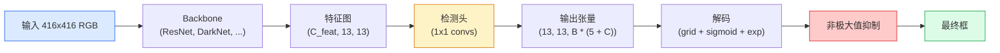

# 目标检测 — 从零实现YOLO

> 检测是分类加上回归，在特征图的每个位置运行，然后用非极大值抑制进行清理。

**类型：** 构建
**语言：** Python
**前置条件：** 阶段4 第03课（CNN），阶段4 第04课（图像分类），阶段4 第05课（迁移学习）
**时间：** ~75分钟

## 学习目标

- 解释将检测转化为密集预测问题的网格和锚点设计，并说明输出张量中每个数字的含义
- 计算框之间的IoU（交并比）并从零实现非极大值抑制
- 在预训练backbone之上构建最小YOLO风格头部，包括分类、objectness和框回归损失
- 读取检测指标行（precision@0.5、recall、mAP@0.5、mAP@0.5:0.95）并选择接下来应该调整哪个旋钮

## 问题

分类说"这张图像是狗"。检测说"像素位置(112, 40, 280, 210)处有一只狗，(400, 180, 560, 310)处有一只猫，画面中没有其他东西。"这一结构变化——预测可变数量的带标签框而不是每张图像一个标签——是每个自主系统、每个监控产品、每个文档布局解析器和每个工厂视觉流水线所依赖的。

检测也是视觉中每个工程权衡同时出现的地方。你希望框准确（回归头），希望每个框有正确的类别（分类头），希望模型知道何时没有东西可检测（objectness分数），并且希望每个真实物体恰好有一个预测（非极大值抑制）。错过任何一个，你的pipeline就会漏掉物体、报告幻觉框、或者以略微不同的位置预测同一个物体十五次。

YOLO（You Only Look Once，Redmon等人 2016）是通过使用conv网络的单次前向传播实现这一切实时运行的设计，相同的结构决策仍然是现代检测器（YOLOv8、YOLOv9、YOLO-NAS、RT-DETR）的backbone。学习核心，每个变体就变成了相同部分的重新排列。

## 概念

### 检测作为密集预测

分类器每张图像输出C个数字。YOLO风格的检测器每张图像输出`(S x S x (5 + C))`个数字，其中S是空间网格大小。


```mermaid
flowchart LR
    IMG["输入 416x416 RGB"] --> BB["Backbone<br/>(ResNet, DarkNet, ...)"]
    BB --> FM["特征图<br/>(C_feat, 13, 13)"]
    FM --> HEAD["检测头<br/>(1x1 convs)"]
    HEAD --> OUT["输出张量<br/>(13, 13, B * (5 + C))"]
    OUT --> DEC["解码<br/>(grid + sigmoid + exp)"]
    DEC --> NMS["非极大值抑制"]
    NMS --> RESULT["最终框"]

    style IMG fill:#dbeafe,stroke:#2563eb
    style HEAD fill:#fef3c7,stroke:#d97706
    style NMS fill:#fecaca,stroke:#dc2626
    style RESULT fill:#dcfce7,stroke:#16a34a
```

每个`S * S`网格单元预测`B`个框。对于每个框：

- 4个数字描述几何：`tx, ty, tw, th`。
- 1个数字是objectness分数："这个单元中心有物体吗？"
- C个数字是类别概率。

每单元总计：`B * (5 + C)`。对于VOC，`S=13, B=2, C=20`，每单元有50个数字。

### 为什么用网格和锚点

直接回归会为每个物体预测`(x, y, w, h)`作为绝对坐标。这对conv网络来说很难，因为平移图像不应该将所有预测平移相同的量——每个物体在空间上是有锚点的。网格通过将每个ground-truth框分配给它中心所在的网格单元来回答这个问题；只有那个单元对该物体负责。

锚点解决了第二个问题。一个3x3 conv很难从一个16像素感受野的特征单元回归出一个500像素宽的框。相反，我们为每个单元预定义`B`个先验框形状（锚点），并预测相对于每个锚点的小增量。模型学习选择正确的锚点并微调它，而不是从零开始回归。

```
锚点框先验（以416x416输入为例）：

  小:    (30,  60)
  中:    (75,  170)
  大:    (200, 380)

在每个网格单元，每个锚点输出(tx, ty, tw, th, obj, c_1, ..., c_C)。
```

现代检测器通常使用FPN，每个分辨率有不同锚点集——浅层高分辨率图上用小锚点，深层低分辨率图上用大锚点。相同想法，更多尺度。

### 解码预测

原始的`tx, ty, tw, th`不是框坐标；它们是在绘制前需要变换的回归目标：

```
centre x  = (sigmoid(tx) + cell_x) * stride
centre y  = (sigmoid(ty) + cell_y) * stride
width     = anchor_w * exp(tw)
height    = anchor_h * exp(th)
```

`sigmoid`使中心偏移保持在单元内。`exp`让宽度可以从锚点自由缩放，不会出现符号翻转。`stride`将网格坐标缩放回像素。这个解码步骤自v2以来在每个YOLO版本中都是相同的。

### IoU

检测中两个框之间的通用相似性度量：

```
IoU(A, B) = area(A 交 B) / area(A 并 B)
```

IoU = 1 表示相同；IoU = 0 表示无重叠。预测与ground-truth框之间的IoU决定了预测是否算作true positive（通常IoU >= 0.5）。两个预测之间的IoU是NMS用于去重的依据。

### 非极大值抑制

在相邻锚点上训练的conv网络通常会对同一物体预测重叠的框。NMS保留置信度最高的预测，并删除任何IoU超过阈值的其他预测。

```
NMS(boxes, scores, iou_threshold):
    按分数降序排列框
    keep = []
    while 框不为空:
        选取最高分的框，加入keep
        移除所有与所选框的IoU > iou_threshold的框
    return keep
```

典型阈值：目标检测为0.45。现代检测器用`soft-NMS`、`DIoU-NMS`或直接学习抑制（RT-DETR）替换标准NMS，但结构目的相同。

### 损失

YOLO损失是三个损失按权重相加：

```
L = lambda_coord * L_box(pred, target, where obj=1)
  + lambda_obj   * L_obj(pred, 1,     where obj=1)
  + lambda_noobj * L_obj(pred, 0,     where obj=0)
  + lambda_cls   * L_cls(pred, target, where obj=1)
```

只有包含物体的单元贡献框回归和分类损失。没有物体的单元只贡献objectness损失（教会模型保持沉默）。`lambda_noobj`通常很小（~0.5），因为绝大多数单元是空的，否则会主导总损失。

现代变体将MSE框损失替换为CIoU / DIoU（直接优化IoU），使用focal loss处理类别不平衡，并用quality focal loss平衡objectness。三组件结构不变。

### 检测指标

准确率不能迁移到检测。以下四个数字可以：

- **Precision@IoU=0.5** — 被计为正样本的预测中，有多少实际正确。
- **Recall@IoU=0.5** — 真实物体中，我们找到了多少。
- **AP@0.5** — IoU阈值0.5时的precision-recall曲线面积；每个类别一个数字。
- **mAP@0.5:0.95** — 在IoU阈值0.5、0.55、...、0.95上的AP平均值。COCO指标；最严格且信息量最大。

报告所有四个。一个在mAP@0.5上强但在mAP@0.5:0.95上弱的检测器定位粗略但不精确；用更好的框回归损失修复。高precision低recall的检测器过于保守；降低置信度阈值或增加objectness权重。

## 构建

### 第1步：IoU

本课的核心工具。在`(x1, y1, x2, y2)`格式的两个框数组上工作。

```python
import numpy as np

def box_iou(boxes_a, boxes_b):
    ax1, ay1, ax2, ay2 = boxes_a[:, 0], boxes_a[:, 1], boxes_a[:, 2], boxes_a[:, 3]
    bx1, by1, bx2, by2 = boxes_b[:, 0], boxes_b[:, 1], boxes_b[:, 2], boxes_b[:, 3]

    inter_x1 = np.maximum(ax1[:, None], bx1[None, :])
    inter_y1 = np.maximum(ay1[:, None], by1[None, :])
    inter_x2 = np.minimum(ax2[:, None], bx2[None, :])
    inter_y2 = np.minimum(ay2[:, None], by2[None, :])

    inter_w = np.clip(inter_x2 - inter_x1, 0, None)
    inter_h = np.clip(inter_y2 - inter_y1, 0, None)
    inter = inter_w * inter_h

    area_a = (ax2 - ax1) * (ay2 - ay1)
    area_b = (bx2 - bx1) * (by2 - by1)
    union = area_a[:, None] + area_b[None, :] - inter
    return inter / np.clip(union, 1e-8, None)
```

返回一个`(N_a, N_b)`的成对IoU矩阵。通过将其中一个数组设为`(1, 4)`形状，将其用于单个ground-truth框。

### 第2步：非极大值抑制

```python
def nms(boxes, scores, iou_threshold=0.45):
    order = np.argsort(-scores)
    keep = []
    while len(order) > 0:
        i = order[0]
        keep.append(i)
        if len(order) == 1:
            break
        rest = order[1:]
        ious = box_iou(boxes[[i]], boxes[rest])[0]
        order = rest[ious <= iou_threshold]
    return np.array(keep, dtype=np.int64)
```

确定性的，排序的`O(N log N)`复杂度，并且在相同输入上与`torchvision.ops.nms`的行为匹配。

### 第3步：框编码和解码

在像素坐标和网络实际回归的`(tx, ty, tw, th)`目标之间转换。

```python
def encode(box_xyxy, cell_x, cell_y, stride, anchor_wh):
    x1, y1, x2, y2 = box_xyxy
    cx = 0.5 * (x1 + x2)
    cy = 0.5 * (y1 + y2)
    w = x2 - x1
    h = y2 - y1
    tx = cx / stride - cell_x
    ty = cy / stride - cell_y
    tw = np.log(w / anchor_wh[0] + 1e-8)
    th = np.log(h / anchor_wh[1] + 1e-8)
    return np.array([tx, ty, tw, th])


def decode(tx_ty_tw_th, cell_x, cell_y, stride, anchor_wh):
    tx, ty, tw, th = tx_ty_tw_th
    cx = (sigmoid(tx) + cell_x) * stride
    cy = (sigmoid(ty) + cell_y) * stride
    w = anchor_wh[0] * np.exp(tw)
    h = anchor_wh[1] * np.exp(th)
    return np.array([cx - w / 2, cy - h / 2, cx + w / 2, cy + h / 2])


def sigmoid(x):
    return 1.0 / (1.0 + np.exp(-x))
```

测试：先编码一个框再解码——你应该得到非常接近原始的结果（当`tx`不在sigmoid后范围内时，sigmoid逆变换可能不完全可逆）。

### 第4步：最小的YOLO头部

特征图上的一个1x1 conv，reshape为`(B, S, S, num_anchors, 5 + C)`。

```python
import torch
import torch.nn as nn

class YOLOHead(nn.Module):
    def __init__(self, in_c, num_anchors, num_classes):
        super().__init__()
        self.num_anchors = num_anchors
        self.num_classes = num_classes
        self.conv = nn.Conv2d(in_c, num_anchors * (5 + num_classes), kernel_size=1)

    def forward(self, x):
        n, _, h, w = x.shape
        y = self.conv(x)
        y = y.view(n, self.num_anchors, 5 + self.num_classes, h, w)
        y = y.permute(0, 3, 4, 1, 2).contiguous()
        return y
```

输出形状：`(N, H, W, num_anchors, 5 + C)`。最后一维包含`[tx, ty, tw, th, obj, cls_0, ..., cls_{C-1}]`。

### 第5步：Ground-truth分配

对于每个ground-truth框，决定哪个`(cell, anchor)`负责。

```python
def assign_targets(boxes_xyxy, classes, anchors, stride, grid_size, num_classes):
    num_anchors = len(anchors)
    target = np.zeros((grid_size, grid_size, num_anchors, 5 + num_classes), dtype=np.float32)
    has_obj = np.zeros((grid_size, grid_size, num_anchors), dtype=bool)

    for box, cls in zip(boxes_xyxy, classes):
        x1, y1, x2, y2 = box
        cx, cy = 0.5 * (x1 + x2), 0.5 * (y1 + y2)
        gx, gy = int(cx / stride), int(cy / stride)
        bw, bh = x2 - x1, y2 - y1

        ious = np.array([
            (min(bw, aw) * min(bh, ah)) / (bw * bh + aw * ah - min(bw, aw) * min(bh, ah))
            for aw, ah in anchors
        ])
        best = int(np.argmax(ious))
        aw, ah = anchors[best]

        target[gy, gx, best, 0] = cx / stride - gx
        target[gy, gx, best, 1] = cy / stride - gy
        target[gy, gx, best, 2] = np.log(bw / aw + 1e-8)
        target[gy, gx, best, 3] = np.log(bh / ah + 1e-8)
        target[gy, gx, best, 4] = 1.0
        target[gy, gx, best, 5 + cls] = 1.0
        has_obj[gy, gx, best] = True
    return target, has_obj
```

锚点选择是"与ground-truth的最佳形状IoU"——一个与YOLOv2/v3分配匹配的廉价代理。v5及以后使用更复杂的策略（task-aligned matching、dynamic k）来改进相同的想法。

### 第6步：三个损失

```python
def yolo_loss(pred, target, has_obj, lambda_coord=5.0, lambda_obj=1.0, lambda_noobj=0.5, lambda_cls=1.0):
    has_obj_t = torch.from_numpy(has_obj).bool()
    target_t = torch.from_numpy(target).float()

    # box-regression loss: only on cells with objects
    box_pred = pred[..., :4][has_obj_t]
    box_true = target_t[..., :4][has_obj_t]
    loss_box = torch.nn.functional.mse_loss(box_pred, box_true, reduction="sum")

    # objectness loss
    obj_pred = pred[..., 4]
    obj_true = target_t[..., 4]
    loss_obj_pos = torch.nn.functional.binary_cross_entropy_with_logits(
        obj_pred[has_obj_t], obj_true[has_obj_t], reduction="sum")
    loss_obj_neg = torch.nn.functional.binary_cross_entropy_with_logits(
        obj_pred[~has_obj_t], obj_true[~has_obj_t], reduction="sum")

    # classification loss on cells with objects
    cls_pred = pred[..., 5:][has_obj_t]
    cls_true = target_t[..., 5:][has_obj_t]
    loss_cls = torch.nn.functional.binary_cross_entropy_with_logits(
        cls_pred, cls_true, reduction="sum")

    total = (lambda_coord * loss_box
             + lambda_obj * loss_obj_pos
             + lambda_noobj * loss_obj_neg
             + lambda_cls * loss_cls)
    return total, {"box": loss_box.item(), "obj_pos": loss_obj_pos.item(),
                   "obj_neg": loss_obj_neg.item(), "cls": loss_cls.item()}
```

每个YOLO教程要么硬编码要么扫描的五个超参数。比例很重要：`lambda_coord=5, lambda_noobj=0.5` 反映了原始的YOLOv1论文，并且仍然作为一个合理的默认值。

### 第7步：推理pipeline

解码原始头部输出，应用sigmoid/exp，在objectness上设置阈值，然后NMS。

```python
def postprocess(pred_tensor, anchors, stride, img_size, conf_threshold=0.25, iou_threshold=0.45):
    pred = pred_tensor.detach().cpu().numpy()
    grid_h, grid_w = pred.shape[1], pred.shape[2]
    num_anchors = len(anchors)

    boxes, scores, classes = [], [], []
    for gy in range(grid_h):
        for gx in range(grid_w):
            for a in range(num_anchors):
                tx, ty, tw, th, obj, *cls = pred[0, gy, gx, a]
                score = sigmoid(obj) * sigmoid(np.array(cls)).max()
                if score < conf_threshold:
                    continue
                cls_idx = int(np.argmax(cls))
                cx = (sigmoid(tx) + gx) * stride
                cy = (sigmoid(ty) + gy) * stride
                w = anchors[a][0] * np.exp(tw)
                h = anchors[a][1] * np.exp(th)
                boxes.append([cx - w / 2, cy - h / 2, cx + w / 2, cy + h / 2])
                scores.append(float(score))
                classes.append(cls_idx)

    if not boxes:
        return np.zeros((0, 4)), np.zeros((0,)), np.zeros((0,), dtype=int)
    boxes = np.array(boxes)
    scores = np.array(scores)
    classes = np.array(classes)
    keep = nms(boxes, scores, iou_threshold)
    return boxes[keep], scores[keep], classes[keep]
```

这就是完整的评估路径：head -> decode -> threshold -> NMS。

## 使用

`torchvision.models.detection` 提供了具有相同概念结构的生产级检测器。加载预训练模型只需三行。

```python
import torch
from torchvision.models.detection import fasterrcnn_resnet50_fpn_v2

model = fasterrcnn_resnet50_fpn_v2(weights="DEFAULT")
model.eval()
with torch.no_grad():
    predictions = model([torch.randn(3, 400, 600)])
print(predictions[0].keys())
print(f"boxes:  {predictions[0]['boxes'].shape}")
print(f"scores: {predictions[0]['scores'].shape}")
print(f"labels: {predictions[0]['labels'].shape}")
```

对于实时推理pipeline，`ultralytics`（YOLOv8/v9）是标准选择：`from ultralytics import YOLO; model = YOLO('yolov8n.pt'); model(img)`。模型内部处理解码和NMS，并返回与你上面构建的相同的`boxes / scores / labels`三元组。

## 交付物

本课产出：

- `outputs/prompt-detection-metric-reader.md` — 一个prompt，将`precision, recall, AP, mAP@0.5:0.95`行转化为一行诊断和最有用的下一个实验。
- `outputs/skill-anchor-designer.md` — 一个技能，给定ground-truth框数据集，对`(w, h)`运行k-means并返回每个FPN级别的锚点集，以及选择正确锚点数量所需的覆盖统计量。

## 练习

1. **(简单)** 实现`box_iou`并在1,000个随机框对上对照`torchvision.ops.box_iou`运行。验证最大绝对差低于`1e-6`。
2. **(中等)** 将`yolo_loss`移植到使用`CIoU`框损失而不是MSE的版本。在100张图像的合成数据集上展示CIoU在相同epoch数内收敛到比MSE更好的最终mAP@0.5:0.95。
3. **(困难)** 实现多尺度推理：将同一图像以三个分辨率输入模型，合并框预测，最后运行单个NMS。在保留集上测量相对于单尺度推理的mAP提升。

## 关键术语

| 术语 | 人们的说法 | 实际含义 |
|------|----------------|----------------------|
| Anchor | "框先验" | 每个网格单元处预定义的框形状，网络从中预测增量而不是绝对坐标 |
| IoU | "重叠率" | 两个框的交并比；检测中的通用相似性度量 |
| NMS | "去重" | 保留最高分数预测并移除超过阈值重叠的贪婪算法 |
| Objectness | "这里有东西吗" | 每个锚点、每个单元的标量，预测该单元中心是否有物体 |
| Grid stride | "下采样因子" | 每网格单元的像素数；416像素输入配合13网格头部有stride 32 |
| mAP | "平均精度均值" | precision-recall曲线下面积的平均值，在类别和（对COCO）IoU阈值上平均 |
| AP@0.5 | "PASCAL VOC AP" | IoU阈值0.5时的平均精度；指标的宽松版本 |
| mAP@0.5:0.95 | "COCO AP" | 在IoU阈值0.5..0.95步长0.05上的平均值；严格版本和当前社区标准 |

## 延伸阅读

- [YOLOv1: You Only Look Once (Redmon et al., 2016)](https://arxiv.org/abs/1506.02640) — 创始论文；之后的每个YOLO都是这个结构的改进
- [YOLOv3 (Redmon & Farhadi, 2018)](https://arxiv.org/abs/1804.02767) — 引入多尺度FPN风格头部的论文；仍然是最清晰的图解
- [Ultralytics YOLOv8 docs](https://docs.ultralytics.com) — 当前的生产参考；涵盖数据集格式、数据增强、训练配方
- [The Illustrated Guide to Object Detection (Jonathan Hui)](https://jonathan-hui.medium.com/object-detection-series-24d03a12f904) — 对完整检测器动物园最好的平实英语介绍；对于理解DETR、RetinaNet、FCOS和YOLO之间的关系非常宝贵
