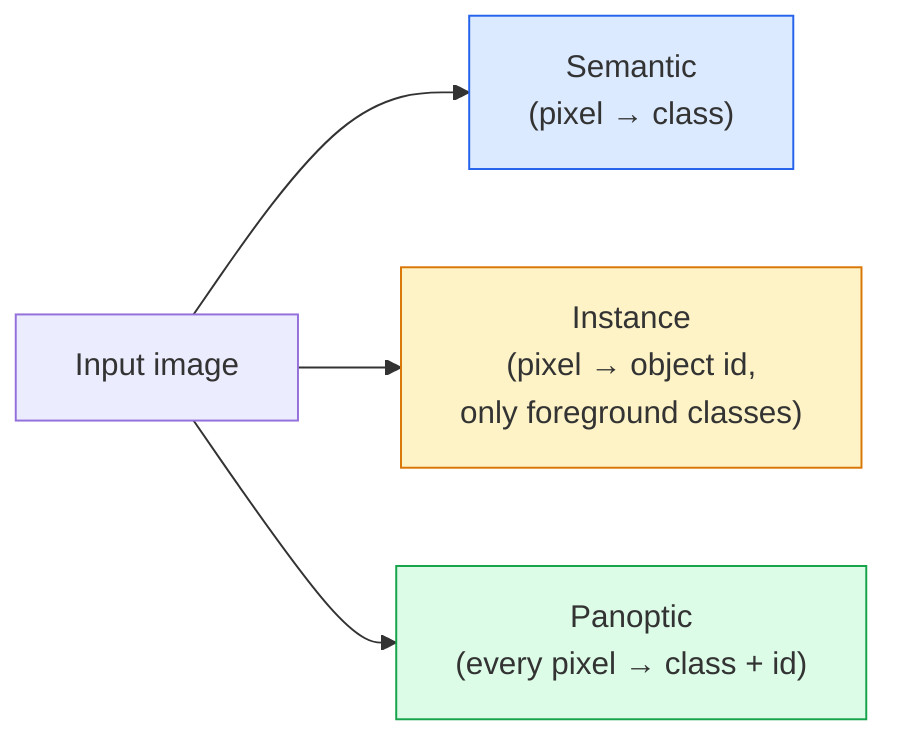
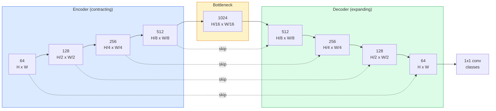

# Semantic Segmentation — U-Net

> Segmentation は pixel ごとの classification です。U-Net は downsampling encoder と upsampling decoder を組み合わせ、その間を skip connections でつなぐことで機能します。

**種別:** 構築
**言語:** Python
**前提条件:** Phase 4 Lesson 03 (CNNs), Phase 4 Lesson 04 (Image Classification)
**所要時間:** 約75分

## Learning Objectives

- semantic、instance、panoptic segmentation を区別し、problem に合う task を選ぶ
- encoder blocks、bottleneck、transposed convolutions 付き decoder、skip connections を持つ U-Net を PyTorch で scratch から作る
- pixel-wise cross-entropy、Dice loss、medical/industrial segmentation の current default である combined loss を実装する
- class ごとの IoU と Dice metrics を読み、bad score が small-object recall、boundary accuracy、class imbalance のどれに由来するか診断する

## 問題

Classification は image ごとに 1 label を出します。Detection は image ごとにいくつかの boxes を出します。Segmentation は pixel ごとに 1 label を出します。input size が `H x W` なら output は semantic では `H x W`、instance では `H x W x N_instances` です。これは image ごとに 1 prediction ではなく、数百万 predictions です。

segmentation は dense-prediction vision products の多くを支えています。medical imaging（tumour masks）、autonomous driving（road、lane、obstacle）、satellite（building footprints、crop boundaries）、document parsing（layout zones）、robotics（graspable regions）などです。これらの task は object の周りに box を置くだけでは解けず、正確な silhouette が必要です。

architectural problem は簡単に言えます。network は global context（これはどんな scene か）と local pixel detail（どの pixel が road でどの pixel が pavement か）を同時に見る必要があります。standard CNN は context を得るために spatially compress しますが、その過程で detail を失います。U-Net はその両方を得る設計です。

## The Concept

### Semantic vs instance vs panoptic



- **Semantic** は「この pixel は road、あの pixel は car」と言います。隣り合う 2 台の cars は 1 つの blob に collapse します。
- **Instance** は「この pixel は car #3、あの pixel は car #5」と言います。background stuff（sky、road、grass など）は無視します。
- **Panoptic** は両方を統合し、すべての pixel に class label を、各 instance に unique id を与えます。stuff と things の両方を segment します。

この lesson は semantic を扱います。次の lesson（Mask R-CNN）は instance を扱います。

### The U-Net shape



encoder は spatial resolution を 4 回半分にし、channels を倍にします。decoder は逆に spatial resolution を 4 回倍にし、channels を半分にします。skip connections は各 resolution で matching encoder features と decoder features を concatenate します。最後の 1x1 conv は full resolution で `64 -> num_classes` に写像します。

skip connections が必要なのは、decoder が pixel-level predictions を出す時点で小さな feature maps しか見ていないからです。skip がないと、encoder で圧縮された edge information を復元できず、boundary がぼやけます。

### Transposed vs bilinear upsample

Decoder は spatial dimensions を拡大する必要があります。代表的な選択肢は 2 つです。

- **Transposed convolution** (`nn.ConvTranspose2d`) — learnable upsample。historical U-Net default。stride と kernel size がきれいに割れないと checkerboard artifacts が出ることがあります。
- **Bilinear upsample + 3x3 conv** — smooth upsample の後に conv。artifacts が少なく parameters も少ないため、今の default です。

どちらも実務で見ます。first U-Net では bilinear が安全です。

### Cross-entropy on a pixel grid

C classes の semantic segmentation では、model output は `(N, C, H, W)`、target は integer class IDs を持つ `(N, H, W)` です。Cross-entropy は classification と同じで、各 spatial position に適用されるだけです。

```
Loss = mean over (n, h, w) of -log( softmax(logits[n, :, h, w])[target[n, h, w]] )
```

PyTorch の `F.cross_entropy` はこの shape を native に処理します。reshape は不要です。

### Dice loss and why you need it

Cross-entropy はすべての pixels を等しく扱います。1 class が frame を支配する場合、これは不適切です。medical imaging で 99% background、1% tumour なら、network は background を常に予測するだけで 99% accuracy を得ますが、実用上は無価値です。

Dice loss は predicted mask と true mask の overlap を直接最適化します。

```
Dice(p, y) = 2 * sum(p * y) / (sum(p) + sum(y) + epsilon)
Dice_loss = 1 - Dice
```

`p` は class の sigmoid/softmax probability map、`y` は binary ground-truth mask です。ratio-based なので class imbalance の影響を受けにくくなります。

実務では **combined loss** を使います。

```
L = L_cross_entropy + lambda * L_dice       (lambda ~ 1)
```

Cross-entropy は early training で安定した gradients を与え、Dice は後半で mask shape の一致に集中します。この組み合わせは medical-imaging default で、class-imbalanced dataset では非常に強い baseline です。

### Evaluation metrics

- **Pixel accuracy** — 正しく予測された pixels の割合。cheap ですが、classification の accuracy と同様に imbalanced data では壊れます。
- **IoU per class** — class ごとの mask intersection over union。平均が mIoU です。
- **Dice (F1 on pixels)** — IoU に近い metric。`Dice = 2 * IoU / (1 + IoU)`。medical imaging は Dice、driving community は IoU を好みますが、monotonic に関係します。
- **Boundary F1** — predicted boundaries が ground-truth boundaries にどれだけ近いかを測ります。semiconductor inspection のような high-precision tasks で重要です。

mIoU だけでなく class ごとの IoU を報告してください。mean は、9 classes が 85% で 1 class が 15% という失敗を隠します。

### Input resolution trade-off

U-Net の encoder は resolution を 4 回半分にするため、input は 16 で割り切れる必要があります。memory cost は `H * W * C_max` に比例し、1024x1024 で bottleneck channels が 1024 なら forward pass だけで GB 単位の VRAM を使います。

標準的な回避策は 2 つです。

1. input を tile し、overlap 付きの 256x256 tiles として処理して stitch する。
2. bottleneck を dilated convolutions に置き換え、spatial resolution を高く保ちながら receptive field を広げる（DeepLab family）。

first model では 256x256 input と 64-channel-base U-Net が 8 GB VRAM で扱いやすい設定です。

## 実装

### Step 1: Encoder block

3x3 conv を 2 回、batch norm と ReLU 付きで使います。最初の conv は channel count を変え、2 つ目は維持します。

```python
import torch
import torch.nn as nn
import torch.nn.functional as F

class DoubleConv(nn.Module):
    def __init__(self, in_c, out_c):
        super().__init__()
        self.net = nn.Sequential(
            nn.Conv2d(in_c, out_c, kernel_size=3, padding=1, bias=False),
            nn.BatchNorm2d(out_c),
            nn.ReLU(inplace=True),
            nn.Conv2d(out_c, out_c, kernel_size=3, padding=1, bias=False),
            nn.BatchNorm2d(out_c),
            nn.ReLU(inplace=True),
        )

    def forward(self, x):
        return self.net(x)
```

この block は全体で再利用します。`bias=False` は BN の beta が bias を担うためです。

### Step 2: Down and up blocks

```python
class Down(nn.Module):
    def __init__(self, in_c, out_c):
        super().__init__()
        self.net = nn.Sequential(
            nn.MaxPool2d(2),
            DoubleConv(in_c, out_c),
        )

    def forward(self, x):
        return self.net(x)


class Up(nn.Module):
    def __init__(self, in_c, out_c):
        super().__init__()
        self.up = nn.Upsample(scale_factor=2, mode="bilinear", align_corners=False)
        self.conv = DoubleConv(in_c, out_c)

    def forward(self, x, skip):
        x = self.up(x)
        if x.shape[-2:] != skip.shape[-2:]:
            x = F.interpolate(x, size=skip.shape[-2:], mode="bilinear", align_corners=False)
        x = torch.cat([skip, x], dim=1)
        return self.conv(x)
```

`shape[-2:]` の spatial-only check は、input dimensions が 16 で割り切れない場合にも concat 前に安全に揃えます。full shape を比較すると channel-count differences でも interpolate してしまうため、そこは loud error にするべきです。

### Step 3: The U-Net

```python
class UNet(nn.Module):
    def __init__(self, in_channels=3, num_classes=2, base=64):
        super().__init__()
        self.inc = DoubleConv(in_channels, base)
        self.d1 = Down(base, base * 2)
        self.d2 = Down(base * 2, base * 4)
        self.d3 = Down(base * 4, base * 8)
        self.d4 = Down(base * 8, base * 16)
        self.u1 = Up(base * 16 + base * 8, base * 8)
        self.u2 = Up(base * 8 + base * 4, base * 4)
        self.u3 = Up(base * 4 + base * 2, base * 2)
        self.u4 = Up(base * 2 + base, base)
        self.outc = nn.Conv2d(base, num_classes, kernel_size=1)

    def forward(self, x):
        x1 = self.inc(x)
        x2 = self.d1(x1)
        x3 = self.d2(x2)
        x4 = self.d3(x3)
        x5 = self.d4(x4)
        x = self.u1(x5, x4)
        x = self.u2(x, x3)
        x = self.u3(x, x2)
        x = self.u4(x, x1)
        return self.outc(x)

net = UNet(in_channels=3, num_classes=2, base=32)
x = torch.randn(1, 3, 256, 256)
print(f"output: {net(x).shape}")
print(f"params: {sum(p.numel() for p in net.parameters()):,}")
```

output shape は `(1, 2, 256, 256)` で、input と同じ spatial size、`num_classes` channels です。`base=32` では約 7.7M parameters です。

### Step 4: Losses

```python
def dice_loss(logits, targets, num_classes, eps=1e-6):
    probs = F.softmax(logits, dim=1)
    targets_one_hot = F.one_hot(targets, num_classes).permute(0, 3, 1, 2).float()
    dims = (0, 2, 3)
    intersection = (probs * targets_one_hot).sum(dim=dims)
    denom = probs.sum(dim=dims) + targets_one_hot.sum(dim=dims)
    dice = (2 * intersection + eps) / (denom + eps)
    return 1 - dice.mean()


def combined_loss(logits, targets, num_classes, lam=1.0):
    ce = F.cross_entropy(logits, targets)
    dc = dice_loss(logits, targets, num_classes)
    return ce + lam * dc, {"ce": ce.item(), "dice": dc.item()}
```

Dice は class ごとに計算して平均します（macro Dice）。`eps` は batch に存在しない class で division by zero を防ぎます。

### Step 5: IoU metric

```python
@torch.no_grad()
def iou_per_class(logits, targets, num_classes):
    preds = logits.argmax(dim=1)
    ious = torch.zeros(num_classes)
    for c in range(num_classes):
        pred_c = (preds == c)
        true_c = (targets == c)
        inter = (pred_c & true_c).sum().float()
        union = (pred_c | true_c).sum().float()
        ious[c] = (inter / union) if union > 0 else torch.tensor(float("nan"))
    return ious
```

length C の vector を返します。`nan` は batch に存在しない class を示します。mIoU を計算するときはそれらを平均に入れないでください。

### Step 6: Synthetic dataset for end-to-end verification

network が pixel colour ではなく shape を学ぶよう、coloured backgrounds 上に shapes を生成します。

```python
import numpy as np
from torch.utils.data import Dataset, DataLoader

def synthetic_segmentation(num_samples=200, size=64, seed=0):
    rng = np.random.default_rng(seed)
    images = np.zeros((num_samples, size, size, 3), dtype=np.float32)
    masks = np.zeros((num_samples, size, size), dtype=np.int64)
    for i in range(num_samples):
        bg = rng.uniform(0, 1, (3,))
        images[i] = bg
        masks[i] = 0
        num_shapes = rng.integers(1, 4)
        for _ in range(num_shapes):
            cls = int(rng.integers(1, 3))
            color = rng.uniform(0, 1, (3,))
            cx, cy = rng.integers(10, size - 10, size=2)
            r = int(rng.integers(4, 12))
            yy, xx = np.meshgrid(np.arange(size), np.arange(size), indexing="ij")
            if cls == 1:
                mask = (xx - cx) ** 2 + (yy - cy) ** 2 < r ** 2
            else:
                mask = (np.abs(xx - cx) < r) & (np.abs(yy - cy) < r)
            images[i][mask] = color
            masks[i][mask] = cls
        images[i] += rng.normal(0, 0.02, images[i].shape)
        images[i] = np.clip(images[i], 0, 1)
    return images, masks


class SegDataset(Dataset):
    def __init__(self, images, masks):
        self.images = images
        self.masks = masks

    def __len__(self):
        return len(self.images)

    def __getitem__(self, i):
        img = torch.from_numpy(self.images[i]).permute(2, 0, 1).float()
        mask = torch.from_numpy(self.masks[i]).long()
        return img, mask
```

3 classes です。background (0)、circles (1)、squares (2)。network は shape を区別する必要があります。

### Step 7: Training loop

```python
def train_one_epoch(model, loader, optimizer, device, num_classes):
    model.train()
    loss_sum, total = 0.0, 0
    iou_sum = torch.zeros(num_classes)
    for x, y in loader:
        x, y = x.to(device), y.to(device)
        logits = model(x)
        loss, _ = combined_loss(logits, y, num_classes)
        optimizer.zero_grad()
        loss.backward()
        optimizer.step()
        loss_sum += loss.item() * x.size(0)
        total += x.size(0)
        iou_sum += iou_per_class(logits, y, num_classes).nan_to_num(0)
    return loss_sum / total, iou_sum / len(loader)
```

synthetic dataset で 10-30 epochs 回すと shape classes の mIoU が 0.9 を超えて上がるのを確認できます。`nan_to_num(0)` は batch に存在しない classes を zero として扱います。正確な per-class IoU では presence mask を使い、evaluation 時に batches across で `torch.nanmean` してください。

## Use It

production では `segmentation_models_pytorch`（"smp"）が、standard segmentation architecture と torchvision/timm backbone をまとめて扱えます。

```python
import segmentation_models_pytorch as smp

model = smp.Unet(
    encoder_name="resnet34",
    encoder_weights="imagenet",
    in_channels=3,
    classes=3,
)
```

実務で重要な選択肢は次の通りです。

- **DeepLabV3+** は max-pool-based downsampling を dilated convs に置き換え、bottleneck resolution を保ちます。satellite や driving data の boundaries で有効です。
- **SegFormer** は conv encoder を hierarchical transformer に置き換えます。多くの benchmark で current SOTA です。
- **Mask2Former** / **OneFormer** は semantic、instance、panoptic segmentation を 1 つの architecture に統合します。

いずれも `smp` または `transformers` で同じ data loader から drop-in replacement として使えます。

## Ship It

この lesson で作るもの:

- `outputs/prompt-segmentation-task-picker.md` — semantic、instance、panoptic segmentation を選び、task に合う architecture を指定する prompt。
- `outputs/skill-segmentation-mask-inspector.md` — class distribution、predicted-mask statistics、under-predicted または boundary-blurred の classes を報告する skill。

## Exercises

1. **(Easy)** binary segmentation task（foreground vs background）用の `bce_dice_loss` を実装してください。foreground が 5% の synthetic two-class dataset で、combined loss が BCE alone より速く収束することを確認します。
2. **(Medium)** `nn.Upsample + conv` up-block を `nn.ConvTranspose2d` up-block に置き換えてください。両方を synthetic dataset で train し、mIoU を比較します。transposed-conv version のどこに checkerboard artifacts が出るか観察してください。
3. **(Hard)** real segmentation dataset（Oxford-IIIT Pets、Cityscapes mini split、medical subset など）で U-Net を train し、`smp.Unet` reference の 2 IoU points 以内に近づけてください。per-class IoU を報告し、loss に Dice を追加して最も benefit を受ける classes を特定します。

## Key Terms

| Term | What people say | What it actually means |
|------|----------------|----------------------|
| Semantic segmentation | "Label every pixel" | C classes への per-pixel classification。同じ class の instances は merge される |
| Instance segmentation | "Label every object" | 同じ class の distinct instances を分離する。foreground-only |
| Panoptic segmentation | "Semantic + instance" | すべての pixel に class を付け、thing instance には unique id も付ける |
| Skip connection | "U-Net bridge" | matching-resolution decoder features へ encoder features を concatenate し、高周波 detail を保つ |
| Transposed conv | "Deconvolution" | learnable upsampling。checkerboard artifacts を生むことがある |
| Dice loss | "Overlap loss" | 1 - 2|A ∩ B| / (|A| + |B|)。mask overlap を直接最適化し、class imbalance に強い |
| mIoU | "Mean intersection over union" | classes across の平均 IoU。segmentation の community-standard metric |
| Boundary F1 | "Boundary accuracy" | boundary pixels のみで計算する F1 score。precision-critical tasks で重要 |

## 参考文献

- [U-Net: Convolutional Networks for Biomedical Image Segmentation (Ronneberger et al., 2015)](https://arxiv.org/abs/1505.04597) — original paper。多くの図が参照する figure は page 2 にあります
- [Fully Convolutional Networks (Long et al., 2015)](https://arxiv.org/abs/1411.4038) — segmentation を end-to-end conv problem にした paper
- [segmentation_models_pytorch](https://github.com/qubvel/segmentation_models.pytorch) — production segmentation の reference。standard architecture と standard loss を広く揃えています
- [Lessons learned from training SOTA segmentation (kaggle.com competitions)](https://www.kaggle.com/code/iafoss/carvana-unet-pytorch) — TTA、pseudo-labeling、class weights が real data でなぜ重要かの walkthrough
