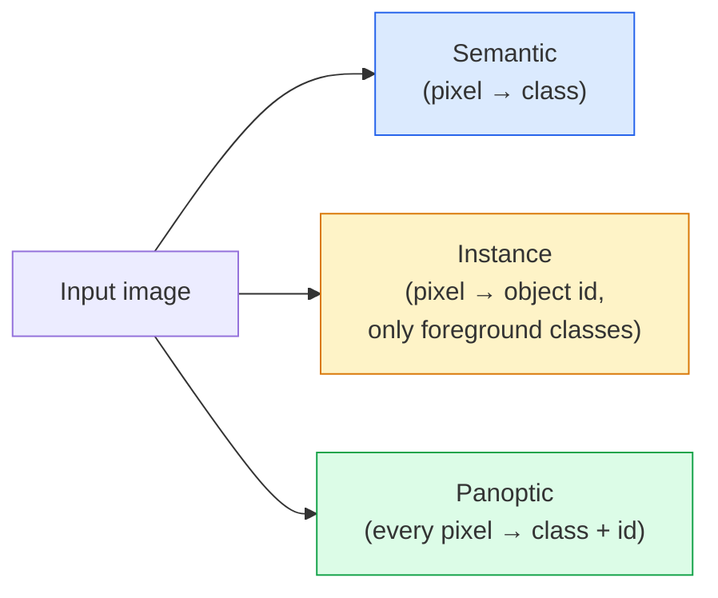
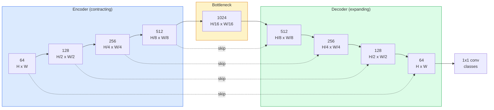

# Anlamsal Segmentasyon — U-Net

> Segmentasyon her pikselde sınıflandırmadır. U-Net, bir alt örnekleme kodlayıcısını bir üst örnekleme kod çözücüsüyle eşleştirerek ve aralarındaki kablo atlama bağlantılarını eşleştirerek çalışmasını sağlar.

**Tür:** Yapım
**Diller:** Python
**Önkoşullar:** Aşama 4 Ders 03 (CNN'ler), Aşama 4 Ders 04 (Görüntü Sınıflandırması)
**Süre:** ~75 dakika

## Öğrenme Hedefleri

- Semantik, örnek ve panoptik segmentasyonu ayırt edin ve belirli bir sorun için doğru görevi seçin
- PyTorch'ta kodlayıcı blokları, darboğaz, aktarılmış evrişimli kod çözücü ve atlama bağlantıları ile sıfırdan bir U-Net oluşturun
- Tıbbi ve endüstriyel segmentasyon için mevcut varsayılan olan piksel bazında çapraz entropi, Zar kaybı ve birleşik kaybı uygulayın
- Sınıf başına IoU ve Dice metriklerini okuyun ve kötü puanın küçük nesne hatırlamadan mı, sınır doğruluğundan mı yoksa sınıf dengesizliğinden mi kaynaklandığını teşhis edin

## Sorun

Sınıflandırma, görüntü başına bir etiket üretir. Algılama, görüntü başına bir avuç kutunun çıktısını alır. Segmentasyon piksel başına bir etiket üretir. `H x W` boyutunda bir giriş için çıkış, `H x W` (anlamsal) veya `H x W x N_instances` (örnek) şeklinde bir tensördür. Bu, görsel başına milyonlarca tahmin demektir, bir değil.

Segmentasyon yapısı, neredeyse tüm yoğun tahminli görüntü ürünlerine güç vermesinin nedenidir: tıbbi görüntüleme (tümör maskeleri), otonom sürüş (yol, şerit, engel), uydu (bina ayak izleri, ürün sınırları), belge ayrıştırma (düzenleme bölgeleri), robotik (kavranabilir bölgeler). Bu görevlerin hiçbiri nesnenin etrafına bir kutu koyarak çözülemez; tam siluete ihtiyaçları var.

Mimari problemin belirtilmesi basit ve çözülmesi basit değil: bir görüntünün genel bağlamını (bu nasıl bir sahne) ve yerel piksel ayrıntısını (tam olarak hangi pikselin yol ve kaldırım olduğunu) aynı anda görmek için ağa ihtiyacınız var. Standart bir CNN, bağlamı kazanmak için uzamsal olarak sıkıştırır, bu da ayrıntıları ortadan kaldırır. U-Net her ikisine de sahip olan tasarımdı.

## Konsept

### Semantik ve örnek vs panoptik



- **Semantik** diyor ki "bu piksel yol, şu piksel araba." Yan yana iki araba tek bir damla halinde çöküyor.
- **Örnek** "bu piksel 3 numaralı araba, bu piksel 5 numaralı araba" diyor. Arka plandaki şeyleri göz ardı eder ("şey" = gökyüzü, yol, çimen).
- **Panoptik** her ikisini de birleştirir: her piksel bir sınıf etiketi alır, her örnek benzersiz bir kimliğe sahiptir, öğeler ve her ikisi de bölümlere ayrılmıştır.

Bu ders anlambilimi kapsamaktadır. Bir sonraki ders (Maske R-CNN) örneği kapsamaktadır.

### U-Net şekli



Kodlayıcı, uzaysal çözünürlüğü dört kat yarıya indirir ve kanalları iki katına çıkarır. Kod çözücü tersine çevirir: mekansal çözünürlüğü dört kat iki katına çıkarır ve kanalları yarıya indirir. Atlama bağlantıları, her çözünürlükte eşleşen kodlayıcı özelliklerini kod çözücü özellikleriyle birleştirir. Son 1x1 dönüşüm `64 -> num_classes`'yi tam çözünürlükte eşler.

Bağlantıları atlamak neden gereklidir: kod çözücü, piksel düzeyinde tahminler çıkarmaya çalıştığında yalnızca küçük özellik haritalarını görmüştür. Atlamalar olmadan kenarları doğru bir şekilde konumlandıramaz çünkü bu bilgi kodlayıcıda sıkıştırılmıştır. Bağlantıları atla, aşağıya doğru hesaplanan kodlayıcının yüksek çözünürlüklü haritasını verir.

### Transpoze vs çift doğrusal üst örnekleme

Kod çözücünün uzaysal boyutları genişletmesi gerekir. İki seçenek:

- **Transpoze evrişim** (`nn.ConvTranspose2d`) — öğrenilebilir üst örnek. Geçmiş U-Net varsayılanı. Adım ve çekirdek boyutu eşit olarak bölünmezse dama tahtası artifact'ler üretebilir.
- **İki doğrusal üst örnek + 3x3 dönüşüm** — düzgün üst örnek ve ardından bir dönüşüm. Daha az artifact, daha az parametre, artık modern varsayılan.

Her ikisi de vahşi doğada görünür. İlk U-Net için çift doğrusal daha güvenlidir.

### Piksel ızgarasında çapraz entropi

C sınıflarıyla anlamsal bölümleme için model çıktısı `(N, C, H, W)`'dir. Hedef, tamsayı sınıf kimliklerine sahip `(N, H, W)`'dir. Çapraz entropi, sınıflandırma durumuyla aynıdır ve yalnızca her uzamsal konumda uygulanır:

```
Loss = mean over (n, h, w) of -log( softmax(logits[n, :, h, w])[target[n, h, w]] )
```

PyTorch'taki `F.cross_entropy` bu şekli yerel olarak işler. Yeniden şekillendirmeye gerek yok.

### Zar kaybı ve buna neden ihtiyacınız var?

Çapraz entropi her piksele eşit davranır. Çerçeveye tek bir sınıf hakim olduğunda bu yanlıştır (tıbbi görüntüleme: %99 geçmiş, %1 tümör). Ağ, her yerde arka planı tahmin ederek %99 doğruluk elde edebilir ve yine de işe yaramaz hale gelebilir.

Zar kaybı, tahmin edilen ve gerçek maske arasındaki örtüşmeyi doğrudan optimize ederek bu sorunu çözer:

```
Dice(p, y) = 2 * sum(p * y) / (sum(p) + sum(y) + epsilon)
Dice_loss = 1 - Dice
```

burada `p` bir sınıf için sigmoid/softmax olasılık haritasıdır ve `y` ikili temel gerçek maskesidir. Kayıp yalnızca örtüşme mükemmel olduğunda sıfırdır. Oran temelli olduğundan sınıf dengesizliği konu dışıdır.

Pratikte **birleşik kayıp** kullanın:

```
L = L_cross_entropy + lambda * L_dice       (lambda ~ 1)
```

Çapraz entropi, eğitimin başlarında kararlı gradient'ler sağlar; Dice, antrenmanın sonunu maske şekliyle gerçekten eşleştirmeye odaklıyor. Bu kombinasyon tıbbi görüntülemede varsayılandır ve sınıf dengesizliği olan herhangi bir dataset'de yenilmesi zordur.

### Değerlendirme metrikleri

- **Piksel doğruluğu** — doğru tahmin edilen piksellerin yüzdesi. Ucuz. Sınıflandırmadaki doğrulukla aynı nedenden dolayı dengesiz veriler nedeniyle bozulur.
- **sınıf başına IoU** — her sınıfın maskesi için birleşim üzerinden kesişim; sınıflar arası ortalama = mIoU.
- **Zar (piksellerde F1)** — IoU'ya benzer; `Dice = 2 * IoU / (1 + IoU)`. Tıbbi görüntüleme Dice'ı tercih ediyor, sürücü topluluğu IoU'yu tercih ediyor; monoton bir şekilde ilişkilidirler.
- **Sınır F1** — tahmin edilen sınırların gerçek sınırlara ne kadar yakın olduğunu ölçer ve küçük değişiklikleri bile cezalandırır. Yarı iletken denetimi gibi yüksek hassasiyetli görevler için önemlidir.

Yalnızca MIoU'yu değil, sınıf başına IoU'yu raporlayın. Ortalama IoU, diğer dokuzu %85'teyken bir sınıfı %15'te gizler.

### Giriş çözünürlüğü değişimi

U-Net'in kodlayıcısı çözünürlüğü dört kat yarıya indirir, dolayısıyla girişin 16'ya bölünebilmesi gerekir. Tıbbi görüntüler genellikle 512x512 veya 1024x1024 boyutundadır. Otonom sürüşlü mahsuller 2048x1024'tür. U-Net'in bellek maliyeti `H * W * C_max` ile ölçeklenir ve 1024 darboğaz kanalıyla 1024x1024'te ileri geçiş zaten gigabaytlarca VRAM kullanır.

İki standart geçici çözüm:
1. Girişi döşeyin — 256x256 döşemeyi üst üste bindirerek ve dikerek işleyin.
2. Darboğazı, uzaysal çözünürlüğü daha yüksek tutan ancak alıcı alanı genişleten genişlemiş kıvrımlarla değiştirin (DeepLab ailesi).

İlk model için, 64 kanallı U-Net'e sahip 256x256 giriş, 8 GB VRAM üzerinde rahatça eğitilir.

## İnşa Et

### Adım 1: Kodlayıcı bloğu

Toplu norm ve ReLU ile iki adet 3x3 dönüşüm. İlk dönüşüm kanal sayısını değiştirir; ikincisi onu koruyor.

```python
import torch
import torch.nn as nn
import torch.nn.functional as F

class DoubleConv(nn.Module):
    def __init__(self, in_c, out_c):
        super().__init__()
        self.net = nn.Sequential(
            nn.Conv2d(in_c, out_c, kernel_size=3, padding=1, bias=False),
            nn.BatchNorm2d(out_c),
            nn.ReLU(inplace=True),
            nn.Conv2d(out_c, out_c, kernel_size=3, padding=1, bias=False),
            nn.BatchNorm2d(out_c),
            nn.ReLU(inplace=True),
        )

    def forward(self, x):
        return self.net(x)
```

Bu blok baştan sona yeniden kullanılır. `bias=False` çünkü BN'nin betası önyargıyı ele alıyor.

### Adım 2: Aşağı ve yukarı bloklar

```python
class Down(nn.Module):
    def __init__(self, in_c, out_c):
        super().__init__()
        self.net = nn.Sequential(
            nn.MaxPool2d(2),
            DoubleConv(in_c, out_c),
        )

    def forward(self, x):
        return self.net(x)


class Up(nn.Module):
    def __init__(self, in_c, out_c):
        super().__init__()
        self.up = nn.Upsample(scale_factor=2, mode="bilinear", align_corners=False)
        self.conv = DoubleConv(in_c, out_c)

    def forward(self, x, skip):
        x = self.up(x)
        if x.shape[-2:] != skip.shape[-2:]:
            x = F.interpolate(x, size=skip.shape[-2:], mode="bilinear", align_corners=False)
        x = torch.cat([skip, x], dim=1)
        return self.conv(x)
```

Yalnızca uzamsal şekil kontrolü (`shape[-2:]`), boyutları 16'ya bölünemeyen girdileri işler; güvenli bir `F.interpolate`, tensörü concat'tan önce hizalar. Tam şeklin karşılaştırılması aynı zamanda kanal sayısı farklılıklarını da tetikleyecektir; bu, sessiz bir enterpolasyon değil, büyük bir hata olmalıdır.

### Adım 3: U-Net

```python
class UNet(nn.Module):
    def __init__(self, in_channels=3, num_classes=2, base=64):
        super().__init__()
        self.inc = DoubleConv(in_channels, base)
        self.d1 = Down(base, base * 2)
        self.d2 = Down(base * 2, base * 4)
        self.d3 = Down(base * 4, base * 8)
        self.d4 = Down(base * 8, base * 16)
        self.u1 = Up(base * 16 + base * 8, base * 8)
        self.u2 = Up(base * 8 + base * 4, base * 4)
        self.u3 = Up(base * 4 + base * 2, base * 2)
        self.u4 = Up(base * 2 + base, base)
        self.outc = nn.Conv2d(base, num_classes, kernel_size=1)

    def forward(self, x):
        x1 = self.inc(x)
        x2 = self.d1(x1)
        x3 = self.d2(x2)
        x4 = self.d3(x3)
        x5 = self.d4(x4)
        x = self.u1(x5, x4)
        x = self.u2(x, x3)
        x = self.u3(x, x2)
        x = self.u4(x, x1)
        return self.outc(x)

net = UNet(in_channels=3, num_classes=2, base=32)
x = torch.randn(1, 3, 256, 256)
print(f"output: {net(x).shape}")
print(f"params: {sum(p.numel() for p in net.parameters()):,}")
```

Çıkış şekli `(1, 2, 256, 256)` — girişle aynı uzamsal boyut, `num_classes` kanalları. `base=32`'de yaklaşık 7,7 milyon parametre.

### Adım 4: Kayıplar

```python
def dice_loss(logits, targets, num_classes, eps=1e-6):
    probs = F.softmax(logits, dim=1)
    targets_one_hot = F.one_hot(targets, num_classes).permute(0, 3, 1, 2).float()
    dims = (0, 2, 3)
    intersection = (probs * targets_one_hot).sum(dim=dims)
    denom = probs.sum(dim=dims) + targets_one_hot.sum(dim=dims)
    dice = (2 * intersection + eps) / (denom + eps)
    return 1 - dice.mean()


def combined_loss(logits, targets, num_classes, lam=1.0):
    ce = F.cross_entropy(logits, targets)
    dc = dice_loss(logits, targets, num_classes)
    return ce + lam * dc, {"ce": ce.item(), "dice": dc.item()}
```

Zar, sınıf başına hesaplanır ve ardından ortalaması alınır (makro Zar). `eps`, grupta bulunmayan sınıfların sıfıra bölünmesini önler.

### Adım 5: IoU metriği

```python
@torch.no_grad()
def iou_per_class(logits, targets, num_classes):
    preds = logits.argmax(dim=1)
    ious = torch.zeros(num_classes)
    for c in range(num_classes):
        pred_c = (preds == c)
        true_c = (targets == c)
        inter = (pred_c & true_c).sum().float()
        union = (pred_c | true_c).sum().float()
        ious[c] = (inter / union) if union > 0 else torch.tensor(float("nan"))
    return ious
```

C uzunluğunda bir vektör döndürür. `nan`, grupta bulunmayan sınıfları işaretler; mIoU hesaplanırken bunların ortalamasını almayın.

### Adım 6: Uçtan uca doğrulama için sentetik dataset

Ağın piksel rengini değil şekli öğrenmesi için renkli arka planlar üzerinde şekiller oluşturun.

```python
import numpy as np
from torch.utils.data import Dataset, DataLoader

def synthetic_segmentation(num_samples=200, size=64, seed=0):
    rng = np.random.default_rng(seed)
    images = np.zeros((num_samples, size, size, 3), dtype=np.float32)
    masks = np.zeros((num_samples, size, size), dtype=np.int64)
    for i in range(num_samples):
        bg = rng.uniform(0, 1, (3,))
        images[i] = bg
        masks[i] = 0
        num_shapes = rng.integers(1, 4)
        for _ in range(num_shapes):
            cls = int(rng.integers(1, 3))
            color = rng.uniform(0, 1, (3,))
            cx, cy = rng.integers(10, size - 10, size=2)
            r = int(rng.integers(4, 12))
            yy, xx = np.meshgrid(np.arange(size), np.arange(size), indexing="ij")
            if cls == 1:
                mask = (xx - cx) ** 2 + (yy - cy) ** 2 < r ** 2
            else:
                mask = (np.abs(xx - cx) < r) & (np.abs(yy - cy) < r)
            images[i][mask] = color
            masks[i][mask] = cls
        images[i] += rng.normal(0, 0.02, images[i].shape)
        images[i] = np.clip(images[i], 0, 1)
    return images, masks


class SegDataset(Dataset):
    def __init__(self, images, masks):
        self.images = images
        self.masks = masks

    def __len__(self):
        return len(self.images)

    def __getitem__(self, i):
        img = torch.from_numpy(self.images[i]).permute(2, 0, 1).float()
        mask = torch.from_numpy(self.masks[i]).long()
        return img, mask
```

Üç sınıf: arka plan (0), daireler (1), kareler (2). Ağ şekli ayırt etmeyi öğrenmelidir.

### Adım 7: Eğitim döngüsü

```python
def train_one_epoch(model, loader, optimizer, device, num_classes):
    model.train()
    loss_sum, total = 0.0, 0
    iou_sum = torch.zeros(num_classes)
    for x, y in loader:
        x, y = x.to(device), y.to(device)
        logits = model(x)
        loss, _ = combined_loss(logits, y, num_classes)
        optimizer.zero_grad()
        loss.backward()
        optimizer.step()
        loss_sum += loss.item() * x.size(0)
        total += x.size(0)
        iou_sum += iou_per_class(logits, y, num_classes).nan_to_num(0)
    return loss_sum / total, iou_sum / len(loader)
```

Bunu sentetik dataset üzerinde 10-30 dönem boyunca çalıştırın ve şekil sınıfları için mIoU'nun 0,9'u geçmesini izleyin. `nan_to_num(0)`'nin bir grupta bulunmayan sınıfları sıfır olarak ele aldığını unutmayın; Sınıf başına doğru IoU için, varlığa göre maskeleyin ve burada ortalama almak yerine değerlendirme zamanında `torch.nanmean`'yi gruplar arasında kullanın.

## Kullan onu

Üretim için, `segmentation_models_pytorch` ("smp") her standart segmentasyon mimarisini herhangi bir torchvision veya timm omurgasıyla sarar. Üç satır:

```python
import segmentation_models_pytorch as smp

model = smp.Unet(
    encoder_name="resnet34",
    encoder_weights="imagenet",
    in_channels=3,
    classes=3,
)
```

Ayrıca gerçek iş için bilmeye değer:
- **DeepLabV3+** maksimum havuz tabanlı alt örneklemeyi genişletilmiş dönüşümlerle değiştirir, böylece darboğaz çözünürlüğü korur; uydu ve sürüş verilerinde daha hızlı sınırlar.
- **SegFormer** dönüşüm kodlayıcısını hiyerarşik bir transformer ile değiştirir; birçok benchmark'de mevcut SOTA.
- **Mask2Former** / **OneFormer** semantik, örnek ve panoptik segmentasyonu tek bir mimaride birleştirir.

Üçü de aynı veri yükleyiciye sahip `smp` veya `transformers`'deki anında değiştirmelerdir.

## Gönderin

Bu ders şunları üretir:

- `outputs/prompt-segmentation-task-picker.md` — semantik, örnek ve panoptik segmentasyon arasında seçim yapan ve belirli bir görev için mimariyi adlandıran bir prompt.
- `outputs/skill-segmentation-mask-inspector.md` — sınıf dağılımını, öngörülen maske istatistiklerini ve gereğinden az tahmin edilen veya sınırları bulanık olan sınıfları raporlayan bir beceri.

## Egzersizler

1. **(Kolay)** İkili segmentasyon görevi için (ön plan ve arka plan) `bce_dice_loss`'yi uygulayın. Sentetik iki sınıflı bir dataset üzerinde, ön plan piksellerin %5'i olduğunda birleşik kaybın tek başına BCE'den daha hızlı yakınsadığını doğrulayın.
2. **(Orta)** `nn.Upsample + conv` üst bloğunu `nn.ConvTranspose2d` üst bloğuyla değiştirin. Her ikisini de sentetik dataset üzerinde eğitin ve mIoU'yu karşılaştırın. Transpoze edilmiş dönüşüm versiyonunda dama tahtası artifact'lerin nerede göründüğünü gözlemleyin.
3. **(Zor)** Gerçek bir dataset segmentasyonu (Oxford-IIIT Evcil Hayvanlar, Şehir Manzaraları mini bölümü veya tıbbi bir alt küme) alın ve U-Net'i `smp.Unet` referansının 2 IoU noktası dahilinde eğitin. Sınıf bazında IoU'yu raporlayın ve zarara Zar eklemekten en çok hangi sınıfların yararlanacağını belirleyin.

## Anahtar Terimler

| Dönem | İnsanlar ne diyor | Aslında ne anlama geliyor |
|------|----------------|----------------------|
| Anlamsal segmentasyon | "Her pikseli etiketleyin" | C sınıflarına göre piksel başına sınıflandırma; aynı sınıfın örnekleri birleştirme |
| Örnek segmentasyonu | "Her nesneyi etiketleyin" | Aynı sınıfın farklı örneklerini ayırır; yalnızca ön plan |
| Panoptik segmentasyon | "Anlamsal + örnek" | Her pikselin bir sınıfı vardır; her şey örneği aynı zamanda benzersiz bir kimlik alır |
| Bağlantıyı atla | "U-Net köprüsü" | Kodlayıcı özelliklerinin eşleşen çözünürlüklü kod çözücü özellikleriyle birleştirilmesi; yüksek frekanslı ayrıntıları korur |
| Aktarılan dönüşüm | "Dekonvolüsyon" | Öğrenilebilir üst örnekleme; dama tahtası artifact'ler üretebilir |
| Zar kaybı | "Çakışma kaybı" | 1 - 2|A ∩ B| / (|A| + |B|); maske örtüşmesini doğrudan optimize eder ve sınıf dengesizliğine karşı dayanıklıdır |
| MIoU | "Birleşim üzerindeki ortalama kesişim" | Sınıflar arası ortalama IoU; segmentasyon için topluluk standardı metriği |
| Sınır F1 | "Sınır doğruluğu" | F1 puanı yalnızca sınır pikselleri üzerinden hesaplanır; hassas kritik görevlere yönelik konular |

## Daha Fazla Okuma

- [U-Net: Biyomedikal Görüntü Segmentasyonu için Evrişimli Ağlar (Ronneberger ve diğerleri, 2015)](https://arxiv.org/abs/1505.04597) — orijinal makale; herkesin kopyaladığı şekil 2. sayfadadır
- [Fully Convolutional Networks (Long ve diğerleri, 2015)](https://arxiv.org/abs/1411.4038) — segmentasyonu uçtan uca dönüşüm problemi haline getiren ilk makale
- [segmentation_models_pytorch](https://github.com/qubvel/segmentation_models.pytorch) — üretim segmentasyonu için referans; her standart mimari artı her standart kayıp
- [SOTA segmentasyonunun (kaggle.com yarışmaları) eğitiminden öğrenilen dersler](https://www.kaggle.com/code/iafoss/carvana-unet-pytorch) — TTA, sözde etiketleme ve sınıf ağırlıklarının gerçek veriler üzerinde neden önemli olduğuna dair bir açıklama
