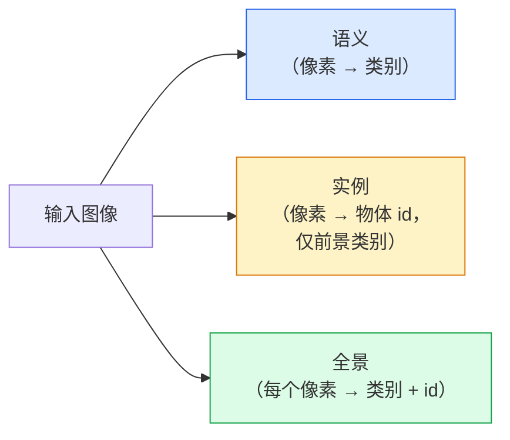
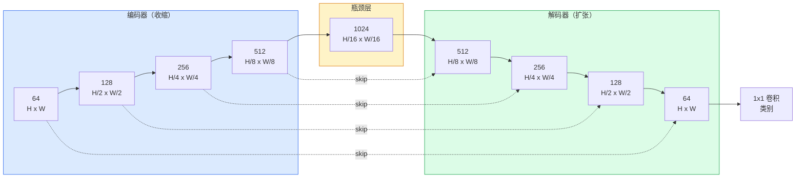

# 语义分割 — U-Net

> 译注：本文译自同目录 [`en.md`](./en.md)。术语遵循仓根 [TRANSLATION_GUIDE.md](../../../../TRANSLATION_GUIDE.md)。

> 分割就是逐像素的分类。U-Net 之所以能跑通，是因为它把一个下采样 encoder 与一个上采样 decoder 配在一起，并在两者之间架起 skip connection。

**Type:** Build
**Languages:** Python
**Prerequisites:** Phase 4 Lesson 03 (CNNs), Phase 4 Lesson 04 (Image Classification)
**Time:** ~75 minutes

## 学习目标（Learning Objectives）

- 区分 semantic、instance、panoptic 三种分割，并为给定问题挑出合适的任务
- 在 PyTorch 里从零搭一个 U-Net：encoder block、bottleneck、带 transposed convolution 的 decoder，加 skip connection
- 实现逐像素 cross-entropy、Dice loss，以及目前医学和工业分割里默认使用的组合损失
- 读懂每类的 IoU 与 Dice 指标，并能诊断坏分数到底来自小目标 recall 不足、边界精度差，还是类别不平衡

## 问题（The Problem）

Classification 一张图给一个标签。Detection 一张图给若干个 box。Segmentation 一张图里每个像素都给一个标签。对于尺寸为 `H x W` 的输入，输出是形状 `H x W`（semantic）或 `H x W x N_instances`（instance）的张量。这是每张图上百万级的预测，而不是一个。

分割的这种结构正是它撑起几乎所有稠密预测视觉产品的原因：医学影像（肿瘤掩码）、自动驾驶（道路、车道、障碍物）、卫星图像（建筑物轮廓、农田边界）、文档解析（版面分区）、机器人（可抓取区域）。这些任务没一个能靠在物体外面套个 box 解决；它们要的是精确的轮廓。

架构上的问题描述起来简单，做起来不简单：你需要网络同时看到图像的全局上下文（这是个什么场景）和局部像素细节（究竟哪个像素是路、哪个是人行道）。标准 CNN 通过空间压缩获得上下文，但这会丢掉细节。U-Net 这套设计两边都要到了。

## 概念（The Concept）

### 语义、实例、全景的区别（Semantic vs instance vs panoptic）



- **Semantic** 说的是"这个像素是路，那个像素是车"。挨在一起的两辆车会塌成一个连通块。
- **Instance** 说的是"这个像素是 3 号车，那个像素是 5 号车"。忽略背景类（"stuff"，比如天空、道路、草地）。
- **Panoptic** 把两者统一起来：每个像素都有一个类别标签，每个 instance 都有唯一 id，stuff 和 things 都被分割。

本课讲 semantic。下一课（Mask R-CNN）讲 instance。

### U-Net 的形状（The U-Net shape）



Encoder 把空间分辨率折半四次、通道数翻倍。Decoder 反过来：空间分辨率翻倍四次、通道数减半。Skip connection 在每个分辨率上把对应的 encoder 特征和 decoder 特征拼接起来。最后的 1x1 conv 在全分辨率下把 `64 -> num_classes`。

为什么必须有 skip connection：当 decoder 准备输出像素级预测时，它一路下来只见过很小的特征图。没有 skip 它根本无法精确定位边缘——那部分信息已经在 encoder 里被压缩掉了。Skip connection 把 encoder 一路下行时算出来的高分辨率特征图直接递给 decoder。

### Transposed 还是 bilinear 上采样（Transposed vs bilinear upsample）

Decoder 必须把空间维度撑大。两种选择：

- **Transposed convolution**（`nn.ConvTranspose2d`）— 可学习的上采样。U-Net 历史上的默认选择。如果 stride 和 kernel size 不能整除，会出现棋盘格 artifact。
- **Bilinear upsample + 3x3 conv** — 平滑上采样后接一个 conv。Artifact 更少、参数更少，是现在的现代默认。

两种实现都还在野外见得到。第一次写 U-Net，bilinear 更稳。

### 像素网格上的 cross-entropy（Cross-entropy on a pixel grid）

C 类的 semantic segmentation，模型输出是 `(N, C, H, W)`，目标是 `(N, H, W)`，每个位置是整数类 ID。Cross-entropy 和 classification 一模一样，只是在每个空间位置上都做一遍：

```
Loss = mean over (n, h, w) of -log( softmax(logits[n, :, h, w])[target[n, h, w]] )
```

PyTorch 里 `F.cross_entropy` 原生支持这个 shape。不用 reshape。

### Dice loss 以及为什么需要它（Dice loss and why you need it）

Cross-entropy 把每个像素一视同仁。当某一类在画面里占绝对优势时这就错了（医学影像里 99% 是背景，1% 是肿瘤）。网络可以全图猜背景，拿到 99% 的 accuracy，然后毫无用处。

Dice loss 直接优化预测掩码与真实掩码之间的重叠：

```
Dice(p, y) = 2 * sum(p * y) / (sum(p) + sum(y) + epsilon)
Dice_loss = 1 - Dice
```

其中 `p` 是某一类的 sigmoid/softmax 概率图，`y` 是该类的二值真值掩码。只有完全重叠时损失才为零。因为它是比例形式，类别不平衡和它没关系。

实际工程里用**组合损失（combined loss）**：

```
L = L_cross_entropy + lambda * L_dice       (lambda ~ 1)
```

Cross-entropy 在训练早期给出稳定的 gradient；Dice 把训练后期的注意力集中到真正贴合掩码形状上。这个组合是医学影像的默认方案，在任何类别不平衡的数据集上都很难被打败。

### 评估指标（Evaluation metrics）

- **Pixel accuracy** — 预测正确的像素百分比。便宜。和 classification 里的 accuracy 一样，遇到不平衡数据就废了。
- **IoU per class** — 每个类掩码的 intersection over union；跨类平均就是 mIoU。
- **Dice（像素上的 F1）** — 跟 IoU 类似；`Dice = 2 * IoU / (1 + IoU)`。医学影像偏爱 Dice，自动驾驶圈偏爱 IoU；两者单调相关。
- **Boundary F1** — 衡量预测边界与真值边界的贴合程度，连小偏移都会被惩罚。半导体检测这种高精度任务里很重要。

要报告每类的 IoU，不要只报 mIoU。某一类只有 15%，另外九类有 85%，平均完看不出来。

### 输入分辨率的取舍（Input resolution trade-off）

U-Net 的 encoder 把分辨率折半四次，所以输入必须能被 16 整除。医学图像常见 512x512 或 1024x1024。自动驾驶 crop 是 2048x1024。U-Net 的显存开销随 `H * W * C_max` 增长，1024x1024 输入加 1024 个 bottleneck 通道，光前向传播就要吃掉好几个 GB 的 VRAM。

两种标准变通：
1. 切片（tile）输入 — 用 256x256 的小块带重叠地处理，再拼回去。
2. 把 bottleneck 换成 dilated convolution，在保持空间分辨率较高的同时扩大感受野（DeepLab 系列的做法）。

第一个模型用 256x256 输入加 base=64 通道的 U-Net，在 8 GB VRAM 上训练得很轻松。

## 动手实现（Build It）

### 步骤 1：Encoder block（Step 1: Encoder block）

两个 3x3 conv 加 batch norm 加 ReLU。第一个 conv 改通道数，第二个保持不变。

```python
import torch
import torch.nn as nn
import torch.nn.functional as F

class DoubleConv(nn.Module):
    def __init__(self, in_c, out_c):
        super().__init__()
        self.net = nn.Sequential(
            nn.Conv2d(in_c, out_c, kernel_size=3, padding=1, bias=False),
            nn.BatchNorm2d(out_c),
            nn.ReLU(inplace=True),
            nn.Conv2d(out_c, out_c, kernel_size=3, padding=1, bias=False),
            nn.BatchNorm2d(out_c),
            nn.ReLU(inplace=True),
        )

    def forward(self, x):
        return self.net(x)
```

这个 block 后面会反复用。`bias=False` 是因为 BN 的 beta 已经接管了偏置。

### 步骤 2：Down 与 up block（Step 2: Down and up blocks）

```python
class Down(nn.Module):
    def __init__(self, in_c, out_c):
        super().__init__()
        self.net = nn.Sequential(
            nn.MaxPool2d(2),
            DoubleConv(in_c, out_c),
        )

    def forward(self, x):
        return self.net(x)


class Up(nn.Module):
    def __init__(self, in_c, out_c):
        super().__init__()
        self.up = nn.Upsample(scale_factor=2, mode="bilinear", align_corners=False)
        self.conv = DoubleConv(in_c, out_c)

    def forward(self, x, skip):
        x = self.up(x)
        if x.shape[-2:] != skip.shape[-2:]:
            x = F.interpolate(x, size=skip.shape[-2:], mode="bilinear", align_corners=False)
        x = torch.cat([skip, x], dim=1)
        return self.conv(x)
```

只比对空间维度（`shape[-2:]`）是为了处理输入维度不能被 16 整除的情况；一个稳妥的 `F.interpolate` 在 concat 前把张量对齐。如果比对完整 shape，通道数不一致也会触发 interpolate——而通道数对不上应该是显式的报错，不该被默默插值掩盖。

### 步骤 3：U-Net（Step 3: The U-Net）

```python
class UNet(nn.Module):
    def __init__(self, in_channels=3, num_classes=2, base=64):
        super().__init__()
        self.inc = DoubleConv(in_channels, base)
        self.d1 = Down(base, base * 2)
        self.d2 = Down(base * 2, base * 4)
        self.d3 = Down(base * 4, base * 8)
        self.d4 = Down(base * 8, base * 16)
        self.u1 = Up(base * 16 + base * 8, base * 8)
        self.u2 = Up(base * 8 + base * 4, base * 4)
        self.u3 = Up(base * 4 + base * 2, base * 2)
        self.u4 = Up(base * 2 + base, base)
        self.outc = nn.Conv2d(base, num_classes, kernel_size=1)

    def forward(self, x):
        x1 = self.inc(x)
        x2 = self.d1(x1)
        x3 = self.d2(x2)
        x4 = self.d3(x3)
        x5 = self.d4(x4)
        x = self.u1(x5, x4)
        x = self.u2(x, x3)
        x = self.u3(x, x2)
        x = self.u4(x, x1)
        return self.outc(x)

net = UNet(in_channels=3, num_classes=2, base=32)
x = torch.randn(1, 3, 256, 256)
print(f"output: {net(x).shape}")
print(f"params: {sum(p.numel() for p in net.parameters()):,}")
```

输出 shape `(1, 2, 256, 256)` —— 空间尺寸和输入相同，通道数为 `num_classes`。`base=32` 时大约 7.7M 参数。

### 步骤 4：损失函数（Step 4: Losses）

```python
def dice_loss(logits, targets, num_classes, eps=1e-6):
    probs = F.softmax(logits, dim=1)
    targets_one_hot = F.one_hot(targets, num_classes).permute(0, 3, 1, 2).float()
    dims = (0, 2, 3)
    intersection = (probs * targets_one_hot).sum(dim=dims)
    denom = probs.sum(dim=dims) + targets_one_hot.sum(dim=dims)
    dice = (2 * intersection + eps) / (denom + eps)
    return 1 - dice.mean()


def combined_loss(logits, targets, num_classes, lam=1.0):
    ce = F.cross_entropy(logits, targets)
    dc = dice_loss(logits, targets, num_classes)
    return ce + lam * dc, {"ce": ce.item(), "dice": dc.item()}
```

Dice 按类计算后再平均（macro Dice）。`eps` 避免某些类在 batch 中缺席时出现除零。

### 步骤 5：IoU 指标（Step 5: IoU metric）

```python
@torch.no_grad()
def iou_per_class(logits, targets, num_classes):
    preds = logits.argmax(dim=1)
    ious = torch.zeros(num_classes)
    for c in range(num_classes):
        pred_c = (preds == c)
        true_c = (targets == c)
        inter = (pred_c & true_c).sum().float()
        union = (pred_c | true_c).sum().float()
        ious[c] = (inter / union) if union > 0 else torch.tensor(float("nan"))
    return ious
```

返回长度为 C 的向量。`nan` 标记该类在 batch 中缺席——计算 mIoU 时不要把它们算进去。

### 步骤 6：用合成数据集做端到端验证（Step 6: Synthetic dataset for end-to-end verification）

在彩色背景上生成形状，让网络必须学形状，而不是像素颜色。

```python
import numpy as np
from torch.utils.data import Dataset, DataLoader

def synthetic_segmentation(num_samples=200, size=64, seed=0):
    rng = np.random.default_rng(seed)
    images = np.zeros((num_samples, size, size, 3), dtype=np.float32)
    masks = np.zeros((num_samples, size, size), dtype=np.int64)
    for i in range(num_samples):
        bg = rng.uniform(0, 1, (3,))
        images[i] = bg
        masks[i] = 0
        num_shapes = rng.integers(1, 4)
        for _ in range(num_shapes):
            cls = int(rng.integers(1, 3))
            color = rng.uniform(0, 1, (3,))
            cx, cy = rng.integers(10, size - 10, size=2)
            r = int(rng.integers(4, 12))
            yy, xx = np.meshgrid(np.arange(size), np.arange(size), indexing="ij")
            if cls == 1:
                mask = (xx - cx) ** 2 + (yy - cy) ** 2 < r ** 2
            else:
                mask = (np.abs(xx - cx) < r) & (np.abs(yy - cy) < r)
            images[i][mask] = color
            masks[i][mask] = cls
        images[i] += rng.normal(0, 0.02, images[i].shape)
        images[i] = np.clip(images[i], 0, 1)
    return images, masks


class SegDataset(Dataset):
    def __init__(self, images, masks):
        self.images = images
        self.masks = masks

    def __len__(self):
        return len(self.images)

    def __getitem__(self, i):
        img = torch.from_numpy(self.images[i]).permute(2, 0, 1).float()
        mask = torch.from_numpy(self.masks[i]).long()
        return img, mask
```

三个类：背景（0）、圆（1）、方块（2）。网络必须学会区分形状。

### 步骤 7：训练循环（Step 7: Training loop）

```python
def train_one_epoch(model, loader, optimizer, device, num_classes):
    model.train()
    loss_sum, total = 0.0, 0
    iou_sum = torch.zeros(num_classes)
    for x, y in loader:
        x, y = x.to(device), y.to(device)
        logits = model(x)
        loss, _ = combined_loss(logits, y, num_classes)
        optimizer.zero_grad()
        loss.backward()
        optimizer.step()
        loss_sum += loss.item() * x.size(0)
        total += x.size(0)
        iou_sum += iou_per_class(logits, y, num_classes).nan_to_num(0)
    return loss_sum / total, iou_sum / len(loader)
```

在合成数据集上跑 10–30 个 epoch，观察形状类的 mIoU 爬过 0.9。注意 `nan_to_num(0)` 把缺席类当作 0 处理；想要准确的 per-class IoU，应该在评估时按类别在场与否做掩码，并跨 batch 用 `torch.nanmean`，而不是在这里平均。

## 用起来（Use It）

生产环境里，`segmentation_models_pytorch`（"smp"）把每种标准分割架构和 torchvision 或 timm backbone 组合在一起封装好了。三行：

```python
import segmentation_models_pytorch as smp

model = smp.Unet(
    encoder_name="resnet34",
    encoder_weights="imagenet",
    in_channels=3,
    classes=3,
)
```

工程上还值得知道：
- **DeepLabV3+** 把基于 max-pool 的下采样换成 dilated conv，bottleneck 保持分辨率；卫星和驾驶数据上边界更快收敛。
- **SegFormer** 把 conv encoder 换成层次化 transformer；很多 benchmark 上的当前 SOTA。
- **Mask2Former** / **OneFormer** 用一个统一架构同时做 semantic、instance、panoptic 分割。

这三个在 `smp` 或 `transformers` 里都可以即插即用，data loader 不变。

## 上线部署（Ship It）

本课产出：

- `outputs/prompt-segmentation-task-picker.md` —— 一个 prompt，对给定任务在 semantic、instance、panoptic 之间挑选，并指明对应架构。
- `outputs/skill-segmentation-mask-inspector.md` —— 一个 skill，报告类别分布、预测掩码的统计指标，以及哪些类被欠预测或边界模糊。

## 练习（Exercises）

1. **(Easy)** 为二类分割任务（前景 vs 背景）实现 `bce_dice_loss`。在合成的二类数据集上验证：当前景占像素 5% 时，组合损失比单用 BCE 收敛更快。
2. **(Medium)** 把 `nn.Upsample + conv` 的 up-block 换成 `nn.ConvTranspose2d` up-block。在合成数据集上各训一次，比较 mIoU。观察 transposed-conv 版本的棋盘格 artifact 出现在什么位置。
3. **(Hard)** 拿一个真实分割数据集（Oxford-IIIT Pets、Cityscapes 的 mini split，或某个医学子集），把 U-Net 训到与 `smp.Unet` 参考实现的 IoU 差距在 2 个点以内。报告每类 IoU，并指出哪些类从给损失里加 Dice 中获益最大。

## 关键术语（Key Terms）

| Term | What people say | What it actually means |
|------|----------------|----------------------|
| Semantic segmentation | "Label every pixel" | 把每个像素分到 C 个类里；同一类的不同实例会合并 |
| Instance segmentation | "Label every object" | 区分同一类下的不同实例；只看前景 |
| Panoptic segmentation | "Semantic + instance" | 每个像素都拿到类别；每个 thing 实例还拿到唯一 id |
| Skip connection | "U-Net bridge" | 把 encoder 特征拼接到对应分辨率的 decoder 特征上；保留高频细节 |
| Transposed conv | "Deconvolution" | 可学习的上采样；可能产生棋盘格 artifact |
| Dice loss | "Overlap loss" | 1 - 2|A ∩ B| / (|A| + |B|)；直接优化掩码重叠，对类别不平衡稳健 |
| mIoU | "Mean intersection over union" | 跨类的平均 IoU；分割社区的标准指标 |
| Boundary F1 | "Boundary accuracy" | 只在边界像素上计算的 F1；对精度敏感的任务很关键 |

## 延伸阅读（Further Reading）

- [U-Net: Convolutional Networks for Biomedical Image Segmentation (Ronneberger et al., 2015)](https://arxiv.org/abs/1505.04597) —— 原始论文；大家都在抄的那张图在第 2 页
- [Fully Convolutional Networks (Long et al., 2015)](https://arxiv.org/abs/1411.4038) —— 第一篇把分割做成端到端 conv 问题的论文
- [segmentation_models_pytorch](https://github.com/qubvel/segmentation_models.pytorch) —— 生产级分割的参考实现；所有标准架构加所有标准损失
- [Lessons learned from training SOTA segmentation (kaggle.com competitions)](https://www.kaggle.com/code/iafoss/carvana-unet-pytorch) —— 在真实数据上为什么 TTA、伪标签、类别权重重要的实战
