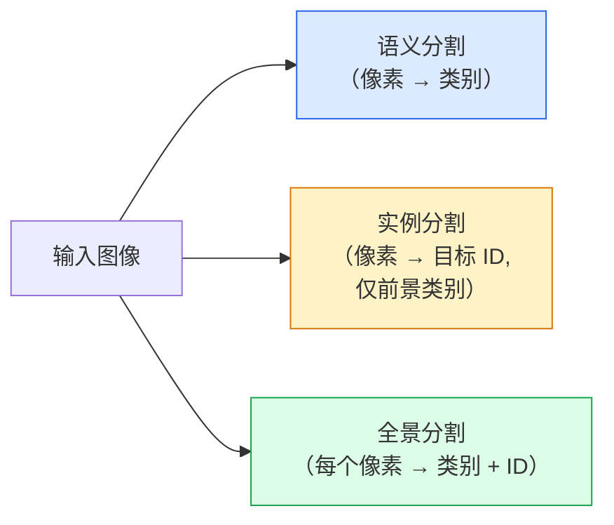
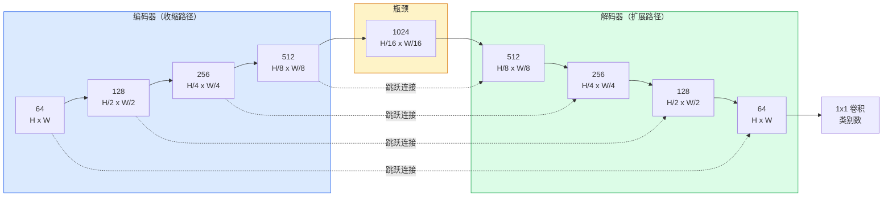

# 语义分割 — U-Net

> 分割是对每个像素进行分类。U-Net 通过将下采样编码器与上采样解码器配对，并在它们之间添加跳跃连接来实现这一点。

**类型：** 构建
**语言：** Python
**先修知识：** 第四阶段第三课（卷积神经网络）, 第四阶段第四课（图像分类）
**时间：** 约75分钟

## 学习目标

- 区分语义分割、实例分割和全景分割，并为给定问题选择正确的任务
- 使用编码器块、瓶颈、带转置卷积的解码器和跳跃连接，从零开始在 PyTorch 中构建 U-Net
- 实现逐像素交叉熵、Dice 损失以及当前医学和工业分割领域默认的组合损失
- 读取每个类别的 IoU 和 Dice 指标，并诊断低分数是由小目标召回率、边界精度还是类别不平衡导致的

## 问题

分类每张图像输出一个标签。检测每张图像输出若干个边界框。分割每个像素输出一个标签。对于大小为 `H x W` 的输入，输出是一个形状为 `H x W`（语义）或 `H x W x N_实例数`（实例）的张量。这意味着每张图像有数百万个预测，而不是一个。

分割的结构决定了它为何能够驱动几乎所有密集预测的视觉产品：医学影像（肿瘤掩码）、自动驾驶（道路、车道、障碍物）、卫星图像（建筑足迹、作物边界）、文档解析（布局区域）、机器人技术（可抓取区域）。这些任务都无法通过简单地在目标周围放置一个边界框来解决；它们需要精确的轮廓。

架构问题说起来简单，解决起来并不简单：你需要网络同时看到图像的全局上下文（这是什么场景）和局部像素细节（哪个像素是道路，哪个是人行道）。标准 CNN 通过空间压缩来获取上下文，但这会丢失细节。U-Net 是同时获得这两者的设计。

## 概念

### 语义分割 vs 实例分割 vs 全景分割



- **语义分割（Semantic）** 说"这个像素是道路，那个像素是汽车。"两辆相邻的汽车会合并成一个整体。
- **实例分割（Instance）** 说"这个像素是汽车 #3，那个像素是汽车 #5。"忽略背景要素（"stuff" = 天空、道路、草地）。
- **全景分割（Panoptic）** 统一两者：每个像素获得一个类别标签，每个实例获得一个唯一 ID，背景要素和目标事物都被分割。

本课程涵盖语义分割。下一课（Mask R-CNN）涵盖实例分割。

### U-Net 形状



编码器将空间分辨率减半四次，同时将通道数加倍。解码器则相反：将空间分辨率加倍四次，同时将通道数减半。跳跃连接在每个分辨率上将匹配的编码器特征与解码器特征拼接起来。最后的 1x1 卷积将 `64` 映射为 `num_classes`，并保持全分辨率。

为什么跳跃连接是必要的：解码器在尝试输出像素级预测时，仅看到过小尺寸的特征图。如果没有跳跃连接，它无法准确定位边缘，因为那些信息已在编码器中被压缩丢失了。跳跃连接将编码器在下采样过程中计算出的高分辨率特征图传递给解码器。

### 转置卷积 vs 双线性上采样

解码器需要扩展空间维度。有两种选择：

- **转置卷积（Transposed convolution）**（`nn.ConvTranspose2d`）—— 可学习的上采样。历史 U-Net 默认选项。如果步长和卷积核大小不能整除，可能会产生棋盘伪影。
- **双线性上采样 + 3x3 卷积** —— 平滑上采样后接一个卷积。伪影更少，参数量更少，现在是现代默认选项。

两者在实践中都有应用。对于第一个 U-Net，双线性上采样更安全。

### 像素网格上的交叉熵

对于具有 C 个类别的语义分割，模型输出为 `(N, C, H, W)`。目标为 `(N, H, W)`，包含整数类别 ID。交叉熵与分类情况相同，只是应用于每个空间位置：

```
损失 = 对 (n, h, w) 取平均的 -log( softmax(logits[n, :, h, w])[target[n, h, w]] )
```

PyTorch 中的 `F.cross_entropy` 原生支持这种形状。无需重塑。

### Dice 损失及其必要性

交叉熵平等对待每个像素。当一个类别主导图像时（医学影像：99% 背景，1% 肿瘤），这种做法是错误的。网络可以通过在任何地方预测背景获得 99% 的准确率，但仍然毫无用处。

Dice 损失通过直接优化预测掩码与真实掩码之间的重叠来解决这一问题：

```
Dice(p, y) = 2 * sum(p * y) / (sum(p) + sum(y) + epsilon)
Dice_loss = 1 - Dice
```

其中 `p` 是某个类别的 sigmoid/softmax 概率图，`y` 是该类别的二值真实掩码。只有当重叠完美时损失为零。由于它是基于比值的，类别不平衡无关紧要。

在实践中，使用**组合损失**：

```
L = L_cross_entropy + lambda * L_dice       (lambda ~ 1)
```

交叉熵在训练早期提供稳定的梯度；Dice 则在训练后期专注于实际匹配掩码形状。这种组合是医学影像的默认选择，在任何类别不平衡的数据集上都难以被击败。

### 评估指标

- **像素准确率（Pixel accuracy）** —— 预测正确的像素百分比。计算简单。在数据不平衡时同样失效，原因与分类中的准确率相同。
- **每类 IoU（IoU per class）** —— 每个类别掩码的交叉比（交集/并集）；所有类别的平均值 = mIoU。
- **Dice（像素上的 F1）** —— 与 IoU 类似；`Dice = 2 * IoU / (1 + IoU)`。医学影像偏爱 Dice，自动驾驶社区偏爱 IoU；两者单调相关。
- **边界 F1（Boundary F1）** —— 衡量预测边界与真实边界的接近程度，即使微小的偏移也会受到惩罚。对于半导体检测等高精度任务至关重要。

报告每个类别的 IoU，而不仅仅是 mIoU。平均 IoU 隐藏了当其他九个类别为 85% 时某个类别仅为 15% 的情况。

### 输入分辨率权衡

U-Net 的编码器将分辨率减半四次，因此输入必须能被 16 整除。医学图像通常为 512x512 或 1024x1024。自动驾驶裁剪图像为 2048x1024。U-Net 的内存成本与 `H * W * C_max` 成正比，在 1024x1024 且瓶颈通道数为 1024 的情况下，前向传播已经使用数 GB 的显存。

两种标准解决方法：
1. 分块处理输入 —— 使用重叠的 256x256 块进行拼接。
2. 用膨胀卷积替换瓶颈，以保持更高的空间分辨率但扩大感受野（DeepLab 系列）。

对于第一个模型，采用 256x256 输入和 64 通道基数的 U-Net 可以在 8 GB 显存上轻松训练。

## 构建

### 第1步：编码器块

两个 3x3 卷积，带有批归一化和 ReLU。第一个卷积改变通道数；第二个保持不变。

```python
import torch
import torch.nn as nn
import torch.nn.functional as F

class DoubleConv(nn.Module):
    def __init__(self, in_c, out_c):
        super().__init__()
        self.net = nn.Sequential(
            nn.Conv2d(in_c, out_c, kernel_size=3, padding=1, bias=False),
            nn.BatchNorm2d(out_c),
            nn.ReLU(inplace=True),
            nn.Conv2d(out_c, out_c, kernel_size=3, padding=1, bias=False),
            nn.BatchNorm2d(out_c),
            nn.ReLU(inplace=True),
        )

    def forward(self, x):
        return self.net(x)
```

这个块在整个网络中重复使用。`bias=False` 是因为 BN 的 beta 已经处理了偏置。

### 第2步：下采样和上采样块

```python
class Down(nn.Module):
    def __init__(self, in_c, out_c):
        super().__init__()
        self.net = nn.Sequential(
            nn.MaxPool2d(2),
            DoubleConv(in_c, out_c),
        )

    def forward(self, x):
        return self.net(x)


class Up(nn.Module):
    def __init__(self, in_c, out_c):
        super().__init__()
        self.up = nn.Upsample(scale_factor=2, mode="bilinear", align_corners=False)
        self.conv = DoubleConv(in_c, out_c)

    def forward(self, x, skip):
        x = self.up(x)
        if x.shape[-2:] != skip.shape[-2:]:
            x = F.interpolate(x, size=skip.shape[-2:], mode="bilinear", align_corners=False)
        x = torch.cat([skip, x], dim=1)
        return self.conv(x)
```

仅检查空间形状（`shape[-2:]`）可以处理输入尺寸不能被 16 整除的情况；使用安全的 `F.interpolate` 在拼接前对齐张量。如果比较完整形状，还会触发通道数差异的检查，这应该是一个显式错误，而不是静默的插值。

### 第3步：U-Net

```python
class UNet(nn.Module):
    def __init__(self, in_channels=3, num_classes=2, base=64):
        super().__init__()
        self.inc = DoubleConv(in_channels, base)
        self.d1 = Down(base, base * 2)
        self.d2 = Down(base * 2, base * 4)
        self.d3 = Down(base * 4, base * 8)
        self.d4 = Down(base * 8, base * 16)
        self.u1 = Up(base * 16 + base * 8, base * 8)
        self.u2 = Up(base * 8 + base * 4, base * 4)
        self.u3 = Up(base * 4 + base * 2, base * 2)
        self.u4 = Up(base * 2 + base, base)
        self.outc = nn.Conv2d(base, num_classes, kernel_size=1)

    def forward(self, x):
        x1 = self.inc(x)
        x2 = self.d1(x1)
        x3 = self.d2(x2)
        x4 = self.d3(x3)
        x5 = self.d4(x4)
        x = self.u1(x5, x4)
        x = self.u2(x, x3)
        x = self.u3(x, x2)
        x = self.u4(x, x1)
        return self.outc(x)

net = UNet(in_channels=3, num_classes=2, base=32)
x = torch.randn(1, 3, 256, 256)
print(f"输出: {net(x).shape}")
print(f"参数量: {sum(p.numel() for p in net.parameters()):,}")
```

输出形状 `(1, 2, 256, 256)` —— 与输入空间尺寸相同，`num_classes` 个通道。在 `base=32` 时，大约 770 万个参数。

### 第4步：损失函数

```python
def dice_loss(logits, targets, num_classes, eps=1e-6):
    probs = F.softmax(logits, dim=1)
    targets_one_hot = F.one_hot(targets, num_classes).permute(0, 3, 1, 2).float()
    dims = (0, 2, 3)
    intersection = (probs * targets_one_hot).sum(dim=dims)
    denom = probs.sum(dim=dims) + targets_one_hot.sum(dim=dims)
    dice = (2 * intersection + eps) / (denom + eps)
    return 1 - dice.mean()


def combined_loss(logits, targets, num_classes, lam=1.0):
    ce = F.cross_entropy(logits, targets)
    dc = dice_loss(logits, targets, num_classes)
    return ce + lam * dc, {"ce": ce.item(), "dice": dc.item()}
```

Dice 按类别计算，然后取平均（宏平均 Dice）。`eps` 防止批量中缺失某些类别时出现除零。

### 第5步：IoU 指标

```python
@torch.no_grad()
def iou_per_class(logits, targets, num_classes):
    preds = logits.argmax(dim=1)
    ious = torch.zeros(num_classes)
    for c in range(num_classes):
        pred_c = (preds == c)
        true_c = (targets == c)
        inter = (pred_c & true_c).sum().float()
        union = (pred_c | true_c).sum().float()
        ious[c] = (inter / union) if union > 0 else torch.tensor(float("nan"))
    return ious
```

返回长度为 C 的向量。`nan` 表示在该批量中缺失的类别——计算 mIoU 时不应将这些类别纳入平均。

### 第6步：用于端到端验证的合成数据集

在彩色背景上生成形状，使网络必须学习形状，而不是像素颜色。

```python
import numpy as np
from torch.utils.data import Dataset, DataLoader

def synthetic_segmentation(num_samples=200, size=64, seed=0):
    rng = np.random.default_rng(seed)
    images = np.zeros((num_samples, size, size, 3), dtype=np.float32)
    masks = np.zeros((num_samples, size, size), dtype=np.int64)
    for i in range(num_samples):
        bg = rng.uniform(0, 1, (3,))
        images[i] = bg
        masks[i] = 0
        num_shapes = rng.integers(1, 4)
        for _ in range(num_shapes):
            cls = int(rng.integers(1, 3))
            color = rng.uniform(0, 1, (3,))
            cx, cy = rng.integers(10, size - 10, size=2)
            r = int(rng.integers(4, 12))
            yy, xx = np.meshgrid(np.arange(size), np.arange(size), indexing="ij")
            if cls == 1:
                mask = (xx - cx) ** 2 + (yy - cy) ** 2 < r ** 2
            else:
                mask = (np.abs(xx - cx) < r) & (np.abs(yy - cy) < r)
            images[i][mask] = color
            masks[i][mask] = cls
        images[i] += rng.normal(0, 0.02, images[i].shape)
        images[i] = np.clip(images[i], 0, 1)
    return images, masks


class SegDataset(Dataset):
    def __init__(self, images, masks):
        self.images = images
        self.masks = masks

    def __len__(self):
        return len(self.images)

    def __getitem__(self, i):
        img = torch.from_numpy(self.images[i]).permute(2, 0, 1).float()
        mask = torch.from_numpy(self.masks[i]).long()
        return img,