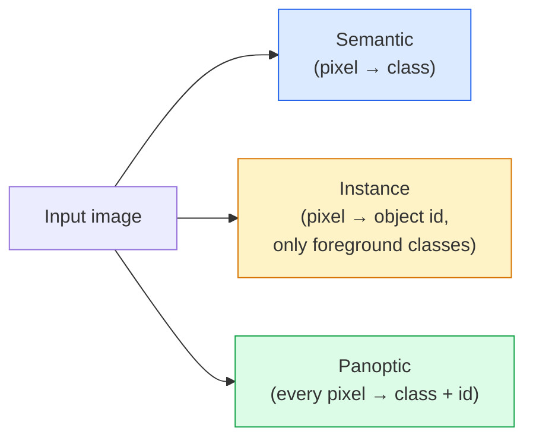
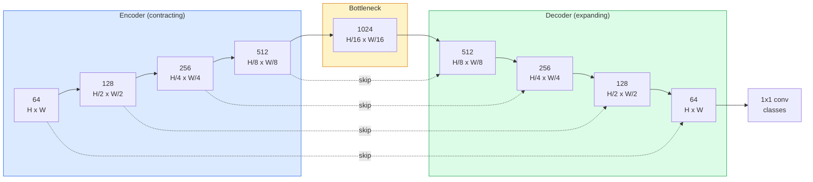

# Semantic Segmentation — U-Net

> 分割是对每个像素的分类。U-Net通过将下采样编码器与上采样解码器配对并在它们之间布线跳过连接来使其工作。

** 类型：** 构建
** 语言：** Python
** 先决条件：** 第4阶段第03课（CNN）、第4阶段第04课（图像分类）
** 时间：** ~75分钟

## Learning Objectives

- 区分语义、实例和全景分割，并为给定问题选择正确的任务
- 在PyTorch中从头开始构建U-Net，包含编码器块、瓶颈、具有转置卷积的解码器和跳过连接
- 实现按像素方式的交叉熵、骰子损失和医疗和工业细分当前默认的组合损失
- 阅读每个类别的IoU和Dice指标，并诊断坏分数是否来自小对象召回、边界准确性或类别不平衡

## The Problem

分类为每个图像输出一个标签。检测每张图像输出几个方框。分割每个像素输出一个标签。对于大小为“H x W”的输入，输出是形状“H x W”（语义）或“H x W x N_instance”（实例）的张量。每张图像有数百万个预测，而不是一个。

分割的结构是它支持几乎所有密度预测视觉产品的原因：医学成像（肿瘤面罩）、自动驾驶（道路、车道、障碍物）、卫星（建筑物足迹、作物边界）、文档解析（布局区域）、机器人（可抓取区域）。这些任务都无法通过在物体周围放置一个盒子来解决;他们需要确切的轮廓。

建筑问题很容易陈述，但解决起来并不容易：您需要网络同时查看图像的全局上下文（这是什么样的场景）和局部像素细节（到底哪个像素是道路还是人行道）。标准的CNN进行空间压缩以获得上下文，这会抛弃细节。U-Net是兼具两者的设计。

## The Concept

### Semantic vs instance vs panoptic



- **Semantic** 说“这个像素是道路，那个像素是汽车。“两辆并排的汽车崩溃成一团。
- ** 实例 ** 说“这个像素是汽车#3，那个像素是汽车#5。“忽略背景东西（“东西”=天空、道路、草地）。
- **Panoptic** 统一了两者：每个像素都有一个类标签，每个实例都有一个唯一的id，东西和东西都被分割。

本课涵盖语义。下一课（MaskR-CNN）将介绍实例。

### The U-Net shape



编码器将空间分辨率减半四倍，通道加倍。解码器反转：空间分辨率加倍四倍，通道减半。跳过连接将匹配的编码器特征与每个分辨率的解码器特征连接在一起。最终的1x 1 conv以全分辨率映射`64 -> num_classes`。

为什么需要跳过连接：当解码器尝试输出像素级预测时，它只看到了很小的特征地图。如果没有跳过，它就无法准确地定位边缘，因为该信息在编码器中被压缩了。跳过连接将编码器在下降过程中计算的高分辨率特征地图交给它。

### Transposed vs bilinear upsample

解码器必须扩展空间维度。两种选择：

- ** 转置卷积 **（' nn.ConvTransspose2d '）-可学习的上采样。历史U-Net默认。如果跨度和内核大小不均匀，则可以生成棋盘文物。
- ** 双线性上采样+3x 3 conv** -平滑上采样，然后进行conv。更少的文物、更少的参数，现在是现代默认设置。

两者都出现在野外。对于第一个U-Net来说，双线性更安全。

### Cross-entropy on a pixel grid

对于具有C类的语义分割，模型输出是“（N，C，H，W）”。目标是“（N，H，W）”，其类别ID为integer。交叉信息与分类情况相同，只是应用于每个空间位置：

```
Loss = mean over (n, h, w) of -log( softmax(logits[n, :, h, w])[target[n, h, w]] )
```

PyTorch中的“F.cross_entropy”本地处理此形状。不需要重塑。

### Dice loss and why you need it

交叉熵平等地对待每个像素。当一个类别在框架中占据主导地位时（医学成像：99%背景，1%肿瘤），这是错误的。该网络通过预测各地的背景可以获得99%的准确率，但仍然毫无用处。

Dice loss通过直接优化预测和真实掩码之间的重叠来解决这个问题：

```
Dice(p, y) = 2 * sum(p * y) / (sum(p) + sum(y) + epsilon)
Dice_loss = 1 - Dice
```

其中“p”是类的sigmoid/softmax概率图，“y”是二进制地面真相掩蔽。只有当重叠完美时，损失才为零。因为它是基于比率的，所以阶级失衡并不重要。

在实践中，使用 ** 组合损失 **：

```
L = L_cross_entropy + lambda * L_dice       (lambda ~ 1)
```

交叉信息在训练早期提供稳定的梯度; Dice将训练的尾部集中在实际匹配面具形状上。这种组合是医学成像的默认设置，在任何类别不平衡的数据集上都很难被击败。

### Evaluation metrics

- ** 像素准确性 ** -正确预测的像素百分比。便宜.出于与分类准确性相同的原因，因不平衡的数据而崩溃。
- ** 每个类别的IoU ** -每个类别的面具的联合的交集;跨类别的平均值= mIoU。
- ** 骰子（像素上的F1）** -类似于IoU;“骰子= 2 * IoU /（1 + IoU）”。医学成像更喜欢Dice，驾驶社区更喜欢IoU;它们是单调相关的。
- ** 边界F1** -测量预测边界与地面实况边界的接近程度，即使是很小的变化也会受到惩罚。对于半导体检测等高精度任务非常重要。

按班级报告IoU，而不仅仅是mIoU。平均IoU将一个类别隐藏在15%，而其他九个类别隐藏在85%。

### Input resolution trade-off

U-Net的编码器将分辨率减半四倍，因此输入必须可被16整除。医学图像通常是512 x512或1024 x1024。自动驾驶作物为2048 x1024。U-Net的内存成本随“H * W * C_max”而变化，并且在1024 x1024处瓶颈通道下，前向传递已经使用了GB的VRAM。

两个标准的解决方案：
1. 拼贴输入-通过重叠和缝合处理256 x256拼贴。
2. 用扩张卷积取代瓶颈，保持更高的空间分辨率，但扩大感受野（DeepLab系列）。

对于第一个型号，带有64个通道U-Net的256 x256输入可以在8 GB VRAM上轻松运行。

## Build It

### Step 1: Encoder block

两个3x 3 convs，使用batch norm和ReLU。第一个conv改变通道计数;第二个保持它。

```python
import torch
import torch.nn as nn
import torch.nn.functional as F

class DoubleConv(nn.Module):
    def __init__(self, in_c, out_c):
        super().__init__()
        self.net = nn.Sequential(
            nn.Conv2d(in_c, out_c, kernel_size=3, padding=1, bias=False),
            nn.BatchNorm2d(out_c),
            nn.ReLU(inplace=True),
            nn.Conv2d(out_c, out_c, kernel_size=3, padding=1, bias=False),
            nn.BatchNorm2d(out_c),
            nn.ReLU(inplace=True),
        )

    def forward(self, x):
        return self.net(x)
```

此块始终重复使用。“偏见=假”，因为BN的测试版处理了偏见。

### Step 2: Down and up blocks

```python
class Down(nn.Module):
    def __init__(self, in_c, out_c):
        super().__init__()
        self.net = nn.Sequential(
            nn.MaxPool2d(2),
            DoubleConv(in_c, out_c),
        )

    def forward(self, x):
        return self.net(x)


class Up(nn.Module):
    def __init__(self, in_c, out_c):
        super().__init__()
        self.up = nn.Upsample(scale_factor=2, mode="bilinear", align_corners=False)
        self.conv = DoubleConv(in_c, out_c)

    def forward(self, x, skip):
        x = self.up(x)
        if x.shape[-2:] != skip.shape[-2:]:
            x = F.interpolate(x, size=skip.shape[-2:], mode="bilinear", align_corners=False)
        x = torch.cat([skip, x], dim=1)
        return self.conv(x)
```

仅空间形状检查（“shape[-2：]'）处理维度不可被16整除的输入;安全的“F.interpolate”在concat之前对齐张量。比较完整形状也会触发通道计数差异，这应该是一个响亮的错误，而不是无声的内插。

### Step 3: The U-Net

```python
class UNet(nn.Module):
    def __init__(self, in_channels=3, num_classes=2, base=64):
        super().__init__()
        self.inc = DoubleConv(in_channels, base)
        self.d1 = Down(base, base * 2)
        self.d2 = Down(base * 2, base * 4)
        self.d3 = Down(base * 4, base * 8)
        self.d4 = Down(base * 8, base * 16)
        self.u1 = Up(base * 16 + base * 8, base * 8)
        self.u2 = Up(base * 8 + base * 4, base * 4)
        self.u3 = Up(base * 4 + base * 2, base * 2)
        self.u4 = Up(base * 2 + base, base)
        self.outc = nn.Conv2d(base, num_classes, kernel_size=1)

    def forward(self, x):
        x1 = self.inc(x)
        x2 = self.d1(x1)
        x3 = self.d2(x2)
        x4 = self.d3(x3)
        x5 = self.d4(x4)
        x = self.u1(x5, x4)
        x = self.u2(x, x3)
        x = self.u3(x, x2)
        x = self.u4(x, x1)
        return self.outc(x)

net = UNet(in_channels=3, num_classes=2, base=32)
x = torch.randn(1, 3, 256, 256)
print(f"output: {net(x).shape}")
print(f"params: {sum(p.numel() for p in net.parameters()):,}")
```

输出形状“（1，2，256，256）”-与输入“num_classes”通道相同的空间大小。“base=32”时约有770万个参数。

### Step 4: Losses

```python
def dice_loss(logits, targets, num_classes, eps=1e-6):
    probs = F.softmax(logits, dim=1)
    targets_one_hot = F.one_hot(targets, num_classes).permute(0, 3, 1, 2).float()
    dims = (0, 2, 3)
    intersection = (probs * targets_one_hot).sum(dim=dims)
    denom = probs.sum(dim=dims) + targets_one_hot.sum(dim=dims)
    dice = (2 * intersection + eps) / (denom + eps)
    return 1 - dice.mean()


def combined_loss(logits, targets, num_classes, lam=1.0):
    ce = F.cross_entropy(logits, targets)
    dc = dice_loss(logits, targets, num_classes)
    return ce + lam * dc, {"ce": ce.item(), "dice": dc.item()}
```

按类别计算骰子，然后求平均值（宏骰子）。“eps”可以防止对未参加该批次的班级进行零除。

### Step 5: IoU metric

```python
@torch.no_grad()
def iou_per_class(logits, targets, num_classes):
    preds = logits.argmax(dim=1)
    ious = torch.zeros(num_classes)
    for c in range(num_classes):
        pred_c = (preds == c)
        true_c = (targets == c)
        inter = (pred_c & true_c).sum().float()
        union = (pred_c | true_c).sum().float()
        ious[c] = (inter / union) if union > 0 else torch.tensor(float("nan"))
    return ious
```

返回长度为C的载体。“nan”标记批中缺失的类-在计算mIoU时不会平均于这些类。

### Step 6: Synthetic dataset for end-to-end verification

在彩色背景上生成形状，以便网络必须学习形状，而不是像素颜色。

```python
import numpy as np
from torch.utils.data import Dataset, DataLoader

def synthetic_segmentation(num_samples=200, size=64, seed=0):
    rng = np.random.default_rng(seed)
    images = np.zeros((num_samples, size, size, 3), dtype=np.float32)
    masks = np.zeros((num_samples, size, size), dtype=np.int64)
    for i in range(num_samples):
        bg = rng.uniform(0, 1, (3,))
        images[i] = bg
        masks[i] = 0
        num_shapes = rng.integers(1, 4)
        for _ in range(num_shapes):
            cls = int(rng.integers(1, 3))
            color = rng.uniform(0, 1, (3,))
            cx, cy = rng.integers(10, size - 10, size=2)
            r = int(rng.integers(4, 12))
            yy, xx = np.meshgrid(np.arange(size), np.arange(size), indexing="ij")
            if cls == 1:
                mask = (xx - cx) ** 2 + (yy - cy) ** 2 < r ** 2
            else:
                mask = (np.abs(xx - cx) < r) & (np.abs(yy - cy) < r)
            images[i][mask] = color
            masks[i][mask] = cls
        images[i] += rng.normal(0, 0.02, images[i].shape)
        images[i] = np.clip(images[i], 0, 1)
    return images, masks


class SegDataset(Dataset):
    def __init__(self, images, masks):
        self.images = images
        self.masks = masks

    def __len__(self):
        return len(self.images)

    def __getitem__(self, i):
        img = torch.from_numpy(self.images[i]).permute(2, 0, 1).float()
        mask = torch.from_numpy(self.masks[i]).long()
        return img, mask
```

三个类别：背景（0）、圆形（1）、方形（2）。网络必须学会区分形状。

### Step 7: Training loop

```python
def train_one_epoch(model, loader, optimizer, device, num_classes):
    model.train()
    loss_sum, total = 0.0, 0
    iou_sum = torch.zeros(num_classes)
    for x, y in loader:
        x, y = x.to(device), y.to(device)
        logits = model(x)
        loss, _ = combined_loss(logits, y, num_classes)
        optimizer.zero_grad()
        loss.backward()
        optimizer.step()
        loss_sum += loss.item() * x.size(0)
        total += x.size(0)
        iou_sum += iou_per_class(logits, y, num_classes).nan_to_num(0)
    return loss_sum / total, iou_sum / len(loader)
```

在合成数据集上运行10-30个纪元，并观察形状类别的mIoU攀升超过0.9。请注意，“nan_to_num（0）”将批中缺失的类视为零;为了准确的每个类IoU，请通过存在进行掩蔽，并在评估时在批中使用“torch.nanmean”，而不是在这里求平均值。

## Use It

对于生产来说，“segmentation_models_pytorch”（“smp”）将每个标准分段架构与任何Torchvision或Timm主干网包装在一起。三行：

```python
import segmentation_models_pytorch as smp

model = smp.Unet(
    encoder_name="resnet34",
    encoder_weights="imagenet",
    in_channels=3,
    classes=3,
)
```

对于实际工作也值得了解：
- ** DeepLabV 3 +** 用扩张的卷积取代基于最大池的下采样，以便瓶颈保持分辨率;卫星和驾驶数据的更快边界。
- **SegFormer** 将conv编码器替换为分层Transformer;许多基准测试中的当前SOTA。
- ** Mask 2Former ** / **OneFormer** 将语义、实例和全景分割统一在单一架构中。

这三个都是具有相同数据加载器的“smp”或“transformers”中的直接替代品。

## Ship It

本课产生：

- ' outputes/www.example.com '-一个在语义、实例和全景分段之间进行选择的提示，并为给定任务命名架构。
- ' outputes/skill-segmentation-mask-inspector.md '-一种报告类分布、预测掩蔽统计信息以及预测不足或边界模糊的类的技能。

## Exercises

1. **（简单）** 为二进制分割任务（前台vs后台）实现“bce_dice_loss”。在合成两类数据集上验证当前景为像素的5%时，组合损失的收敛速度是否比单独BCE更快。
2. **（中）** 将' nn.Upsample + conv ' up-块替换为' nn.ConvTransspose2d ' up-块。在合成数据集上训练并比较mIoU。观察棋盘文物在转置-conv版本中出现的位置。
3. **（硬）** 获取真实的分割数据集（Oxford-IIIT Pets、Cityscapes mini split或医疗子集）并将U-Net训练到“smp.Unet”参考的2个IoU点内。报告每个类别的IoU并确定哪些类别从将Dice添加到损失中受益最多。

## Key Terms

| Term | 别人怎么说 | 它实际上意味着什么 |
|------|----------------|----------------------|
| 语义分割 | “标记每个像素” | 按像素分类为C类;同一类的实例合并 |
| 实例分割 | “标记每个对象” | 分离同一类的不同实例;仅前台 |
| 全景分割 | “语义+实例” | 每个像素都有一个类;每个事物实例也有一个唯一的id |
| 跳过连接 | “U-Net桥” | 将编码器特征连接到匹配分辨率的解码器特征中;保留高频细节 |
| 调换转换 | “去卷积” | 可学习的上采样;可以产生棋盘文物 |
| 骰子损失 | “重叠损失” | 1 - 2 | A B | / ( | 一 | + | B | ）;直接优化面具重叠，并且对阶级失衡具有鲁棒性 |
| Miou | “平均交叉点超过工会” | 跨类别的平均IoU;社区标准细分指标 |
| 边界F1 | “边界准确性” | F1评分仅在边界像素上计算;对于精度关键任务很重要 |

## Further Reading

- [U-Net：用于生物医学图像分割的卷积网络（Ronneberger等人，2015）]（https：//arxiv.org/ab/1505.04597）-论文原件;每个人复制的数字在第2页
- [全卷积网络（Long等人，2015）]（https：//arxiv.org/ab/1411.4038）-首次将分段作为端到端conv问题的论文
- [segmentation_models_pytorch]（https：//github.com/quubvel/segmentation_models.pytorch）-产品细分的参考;每个标准架构加上每个标准损失
- [从训练SOTA分段（kaggle.com竞赛）中吸取的教训]（https：//www.kaggle.com/code/iafoss/carvana-unet-pytorch）-演练为什么TTA、伪标签和类权重对真实数据很重要
