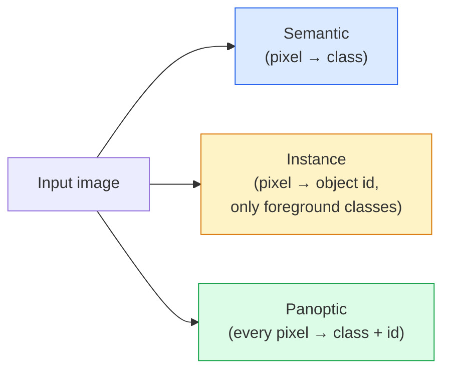
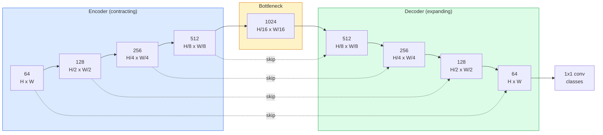

# 07 · 语义分割 — U-Net

> 分割就是对每一个像素做分类。U-Net 通过把一个下采样编码器和一个上采样解码器配对、并在两者之间连上跳跃连接，让这件事得以成立。

**类型：** 实战构建
**语言：** Python
**前置：** 阶段 4 第 03 课（卷积神经网络）、阶段 4 第 04 课（图像分类）
**时长：** 约 75 分钟

## 学习目标

- 区分语义分割、实例分割与全景分割，并为给定问题挑选正确的任务类型
- 在 PyTorch 中从零构建一个 U-Net，包含编码器块、瓶颈层、带转置卷积的解码器以及跳跃连接
- 实现逐像素交叉熵、Dice 损失，以及作为当前医疗与工业分割默认选择的组合损失
- 解读各类别的 IoU 与 Dice 指标，并诊断糟糕的分数究竟来自小目标召回、边界精度还是类别不平衡

## 问题所在

分类对每张图像输出一个标签。检测对每张图像输出少数几个框。分割则对每个像素输出一个标签。对于尺寸为 `H x W` 的输入，其输出是一个形状为 `H x W`（语义分割）或 `H x W x N_instances`（实例分割）的张量。这意味着每张图像有数百万个预测，而不是一个。

分割之所以能驱动几乎每一个稠密预测（dense-prediction）类视觉产品，正是因为它的这种结构特性：医学影像（肿瘤掩膜）、自动驾驶（道路、车道、障碍物）、卫星遥感（建筑轮廓、农田边界）、文档解析（版面区域）、机器人（可抓取区域）。这些任务没有一个能靠在目标外面套一个框来解决；它们需要精确的轮廓。

这个架构上的难题陈述起来简单，但解决起来并不简单：你需要网络同时看到图像的全局上下文（这是什么类型的场景）和局部像素细节（究竟哪一个像素是道路、哪一个是人行道）。标准 CNN 通过在空间上压缩来获取上下文，这会丢弃掉细节。U-Net 就是那个把两者都拿到手的设计。

## 核心概念

### 语义分割 vs 实例分割 vs 全景分割



- **语义分割（Semantic）** 说的是「这个像素是道路，那个像素是汽车」。两辆紧挨着的车会塌缩成同一个色块。
- **实例分割（Instance）** 说的是「这个像素是 3 号车，那个像素是 5 号车」。它会忽略背景类物质（「stuff」= 天空、道路、草地）。
- **全景分割（Panoptic）** 将两者统一起来：每个像素都获得一个类别标签，每个实例都获得一个唯一 id，背景类物质（stuff）和可数物体（things）都被分割。

本课讲解语义分割。下一课（Mask R-CNN）讲解实例分割。

### U-Net 的形状



编码器将空间分辨率减半四次，同时把通道数翻倍。解码器则反向操作：将空间分辨率翻倍四次，把通道数减半。跳跃连接（skip connection）在每一个分辨率层级上，把匹配的编码器特征与解码器特征拼接（concatenate）起来。最后的 1x1 卷积在全分辨率下把 `64 -> num_classes`。

为什么跳跃连接是必要的：当解码器尝试输出像素级预测时，它一路上只看到了小尺寸的特征图。没有跳跃连接，它无法精确定位边缘，因为这些信息已经在编码器中被压缩掉了。跳跃连接把编码器在下采样途中算出的高分辨率特征图直接递给它。

### 转置卷积上采样 vs 双线性上采样

解码器必须扩展空间维度。有两种选择：

- **转置卷积（Transposed convolution，`nn.ConvTranspose2d`）**——可学习的上采样。历史上 U-Net 的默认选择。如果步长和卷积核尺寸不能整除，会产生棋盘格伪影（checkerboard artifact）。
- **双线性上采样 + 3x3 卷积（Bilinear upsample + 3x3 conv）**——先做平滑上采样，再接一个卷积。伪影更少、参数更少，是如今的现代默认选择。

两者在实际工程中都能见到。对于第一个 U-Net，双线性上采样更稳妥。

### 像素网格上的交叉熵

对于具有 C 个类别的语义分割，模型输出为 `(N, C, H, W)`。目标（target）为 `(N, H, W)`，其值为整数类别 ID。交叉熵与分类场景完全相同，只是在每一个空间位置上施加：

```
Loss = mean over (n, h, w) of -log( softmax(logits[n, :, h, w])[target[n, h, w]] )
```

PyTorch 中的 `F.cross_entropy` 原生支持这种形状，无需 reshape。

### Dice 损失，以及你为什么需要它

交叉熵平等对待每一个像素。当某一个类别在画面中占主导时（医学影像：99% 背景、1% 肿瘤），这就错了。网络可以靠在所有位置都预测为背景而拿到 99% 的准确率，却毫无用处。

Dice 损失通过直接优化预测掩膜与真实掩膜之间的重叠（overlap）来解决这个问题：

```
Dice(p, y) = 2 * sum(p * y) / (sum(p) + sum(y) + epsilon)
Dice_loss = 1 - Dice
```

其中 `p` 是某个类别的 sigmoid/softmax 概率图，`y` 是二值的真值掩膜。只有当重叠完美时损失才为零。因为它基于比率，所以类别不平衡无关紧要。

实践中，请使用 **组合损失（combined loss）**：

```
L = L_cross_entropy + lambda * L_dice       (lambda ~ 1)
```

交叉熵在训练早期提供稳定的梯度；Dice 则让训练的后段专注于真正匹配掩膜形状。这个组合是医学影像的默认方案，并且在任何类别不平衡的数据集上都很难被超越。

### 评估指标

- **像素准确率（Pixel accuracy）**——预测正确的像素百分比。便宜。在不平衡数据上失效，原因和分类任务里准确率失效一样。
- **各类别 IoU（IoU per class）**——每个类别掩膜的交并比（intersection over union）；跨类别求平均即为 mIoU。
- **Dice（像素上的 F1）**——与 IoU 类似；`Dice = 2 * IoU / (1 + IoU)`。医学影像偏好 Dice，自动驾驶社区偏好 IoU；两者单调相关。
- **边界 F1（Boundary F1）**——衡量预测边界与真值边界的接近程度，即便是很小的偏移也会被惩罚。对于半导体检测这类高精度任务很重要。

请报告各类别的 IoU，而不仅仅是 mIoU。平均 IoU 会掩盖掉这样的情况：其余九个类别都在 85%，而某一个类别只有 15%。

### 输入分辨率的权衡

U-Net 的编码器将分辨率减半四次，所以输入尺寸必须能被 16 整除。医学图像通常是 512x512 或 1024x1024。自动驾驶的裁剪图是 2048x1024。U-Net 的显存开销随 `H * W * C_max` 增长，在 1024x1024 且瓶颈通道为 1024 的情况下，单次前向传播就已经会用掉数 GB 的显存（VRAM）。

两种标准变通方案：
1. 对输入分块（tile）——以带重叠的 256x256 瓦片逐块处理，再拼接（stitch）起来。
2. 用空洞卷积（dilated convolution）替换瓶颈层，从而在保持较高空间分辨率的同时扩大感受野（DeepLab 系列的做法）。

对于第一个模型，256x256 的输入配上基础通道为 64 的 U-Net，在 8 GB 显存上就能轻松训练。

## 动手构建

### 第 1 步：编码器块

两个带批归一化（batch norm）和 ReLU 的 3x3 卷积。第一个卷积改变通道数；第二个保持通道数不变。

```python
import torch
import torch.nn as nn
import torch.nn.functional as F

class DoubleConv(nn.Module):
    def __init__(self, in_c, out_c):
        super().__init__()
        self.net = nn.Sequential(
            nn.Conv2d(in_c, out_c, kernel_size=3, padding=1, bias=False),
            nn.BatchNorm2d(out_c),
            nn.ReLU(inplace=True),
            nn.Conv2d(out_c, out_c, kernel_size=3, padding=1, bias=False),
            nn.BatchNorm2d(out_c),
            nn.ReLU(inplace=True),
        )

    def forward(self, x):
        return self.net(x)
```

这个块会在整个网络中被反复复用。这里用 `bias=False`，因为 BN 的 beta 已经承担了偏置的作用。

### 第 2 步：下采样块与上采样块

```python
class Down(nn.Module):
    def __init__(self, in_c, out_c):
        super().__init__()
        self.net = nn.Sequential(
            nn.MaxPool2d(2),
            DoubleConv(in_c, out_c),
        )

    def forward(self, x):
        return self.net(x)


class Up(nn.Module):
    def __init__(self, in_c, out_c):
        super().__init__()
        self.up = nn.Upsample(scale_factor=2, mode="bilinear", align_corners=False)
        self.conv = DoubleConv(in_c, out_c)

    def forward(self, x, skip):
        x = self.up(x)
        if x.shape[-2:] != skip.shape[-2:]:
            x = F.interpolate(x, size=skip.shape[-2:], mode="bilinear", align_corners=False)
        x = torch.cat([skip, x], dim=1)
        return self.conv(x)
```

这个仅针对空间维度的形状检查（`shape[-2:]`）能处理那些尺寸不能被 16 整除的输入；一个安全的 `F.interpolate` 会在拼接前先对齐张量。如果比较完整形状，通道数不同时也会触发它——而通道数不一致本该是一个响亮的报错，而不是悄悄做插值。

### 第 3 步：U-Net 本体

```python
class UNet(nn.Module):
    def __init__(self, in_channels=3, num_classes=2, base=64):
        super().__init__()
        self.inc = DoubleConv(in_channels, base)
        self.d1 = Down(base, base * 2)
        self.d2 = Down(base * 2, base * 4)
        self.d3 = Down(base * 4, base * 8)
        self.d4 = Down(base * 8, base * 16)
        self.u1 = Up(base * 16 + base * 8, base * 8)
        self.u2 = Up(base * 8 + base * 4, base * 4)
        self.u3 = Up(base * 4 + base * 2, base * 2)
        self.u4 = Up(base * 2 + base, base)
        self.outc = nn.Conv2d(base, num_classes, kernel_size=1)

    def forward(self, x):
        x1 = self.inc(x)
        x2 = self.d1(x1)
        x3 = self.d2(x2)
        x4 = self.d3(x3)
        x5 = self.d4(x4)
        x = self.u1(x5, x4)
        x = self.u2(x, x3)
        x = self.u3(x, x2)
        x = self.u4(x, x1)
        return self.outc(x)

net = UNet(in_channels=3, num_classes=2, base=32)
x = torch.randn(1, 3, 256, 256)
print(f"output: {net(x).shape}")
print(f"params: {sum(p.numel() for p in net.parameters()):,}")
```

输出形状为 `(1, 2, 256, 256)`——空间尺寸与输入相同，通道数为 `num_classes`。在 `base=32` 时约有 770 万个参数。

### 第 4 步：损失函数

```python
def dice_loss(logits, targets, num_classes, eps=1e-6):
    probs = F.softmax(logits, dim=1)
    targets_one_hot = F.one_hot(targets, num_classes).permute(0, 3, 1, 2).float()
    dims = (0, 2, 3)
    intersection = (probs * targets_one_hot).sum(dim=dims)
    denom = probs.sum(dim=dims) + targets_one_hot.sum(dim=dims)
    dice = (2 * intersection + eps) / (denom + eps)
    return 1 - dice.mean()


def combined_loss(logits, targets, num_classes, lam=1.0):
    ce = F.cross_entropy(logits, targets)
    dc = dice_loss(logits, targets, num_classes)
    return ce + lam * dc, {"ce": ce.item(), "dice": dc.item()}
```

Dice 先逐类别计算再取平均（宏平均 Dice，macro Dice）。`eps` 防止在某个批次中缺席的类别上发生除以零。

### 第 5 步：IoU 指标

```python
@torch.no_grad()
def iou_per_class(logits, targets, num_classes):
    preds = logits.argmax(dim=1)
    ious = torch.zeros(num_classes)
    for c in range(num_classes):
        pred_c = (preds == c)
        true_c = (targets == c)
        inter = (pred_c & true_c).sum().float()
        union = (pred_c | true_c).sum().float()
        ious[c] = (inter / union) if union > 0 else torch.tensor(float("nan"))
    return ious
```

返回一个长度为 C 的向量。`nan` 标记了在该批次中缺席的类别——在计算 mIoU 时不要把这些算进平均。

### 第 6 步：用于端到端验证的合成数据集

在彩色背景上生成形状，迫使网络去学习形状，而不是像素颜色。

```python
import numpy as np
from torch.utils.data import Dataset, DataLoader

def synthetic_segmentation(num_samples=200, size=64, seed=0):
    rng = np.random.default_rng(seed)
    images = np.zeros((num_samples, size, size, 3), dtype=np.float32)
    masks = np.zeros((num_samples, size, size), dtype=np.int64)
    for i in range(num_samples):
        bg = rng.uniform(0, 1, (3,))
        images[i] = bg
        masks[i] = 0
        num_shapes = rng.integers(1, 4)
        for _ in range(num_shapes):
            cls = int(rng.integers(1, 3))
            color = rng.uniform(0, 1, (3,))
            cx, cy = rng.integers(10, size - 10, size=2)
            r = int(rng.integers(4, 12))
            yy, xx = np.meshgrid(np.arange(size), np.arange(size), indexing="ij")
            if cls == 1:
                mask = (xx - cx) ** 2 + (yy - cy) ** 2 < r ** 2
            else:
                mask = (np.abs(xx - cx) < r) & (np.abs(yy - cy) < r)
            images[i][mask] = color
            masks[i][mask] = cls
        images[i] += rng.normal(0, 0.02, images[i].shape)
        images[i] = np.clip(images[i], 0, 1)
    return images, masks


class SegDataset(Dataset):
    def __init__(self, images, masks):
        self.images = images
        self.masks = masks

    def __len__(self):
        return len(self.images)

    def __getitem__(self, i):
        img = torch.from_numpy(self.images[i]).permute(2, 0, 1).float()
        mask = torch.from_numpy(self.masks[i]).long()
        return img, mask
```

三个类别：背景（0）、圆形（1）、方形（2）。网络必须学会区分形状。

### 第 7 步：训练循环

```python
def train_one_epoch(model, loader, optimizer, device, num_classes):
    model.train()
    loss_sum, total = 0.0, 0
    iou_sum = torch.zeros(num_classes)
    for x, y in loader:
        x, y = x.to(device), y.to(device)
        logits = model(x)
        loss, _ = combined_loss(logits, y, num_classes)
        optimizer.zero_grad()
        loss.backward()
        optimizer.step()
        loss_sum += loss.item() * x.size(0)
        total += x.size(0)
        iou_sum += iou_per_class(logits, y, num_classes).nan_to_num(0)
    return loss_sum / total, iou_sum / len(loader)
```

在这个合成数据集上跑 10-30 个 epoch，观察形状类别的 mIoU 越过 0.9。注意：这里的 `nan_to_num(0)` 把某个批次中缺席的类别当作 0 处理；若要得到准确的各类别 IoU，应当按类别是否出现来做掩码，并在评估时跨批次使用 `torch.nanmean`，而不是在这里直接求平均。

## 实际应用

在生产环境中，`segmentation_models_pytorch`（简称「smp」）把每一种标准分割架构都封装好了，并可搭配任意 torchvision 或 timm 主干网络（backbone）。三行代码：

```python
import segmentation_models_pytorch as smp

model = smp.Unet(
    encoder_name="resnet34",
    encoder_weights="imagenet",
    in_channels=3,
    classes=3,
)
```

在实际工作中，还值得了解：
- **DeepLabV3+** 用空洞卷积替换基于最大池化的下采样，从而让瓶颈层保持分辨率；在卫星和驾驶数据上能更快得到边界。
- **SegFormer** 把卷积编码器换成了分层 Transformer；在许多基准上是当前的 SOTA。
- **Mask2Former** / **OneFormer** 用单一架构统一了语义、实例和全景分割。

这三者在 `smp` 或 `transformers` 中都是即插即用的替换项，使用相同的数据加载器。

## 交付产出

本课产出：

- `outputs/prompt-segmentation-task-picker.md`——一个提示词，它在语义、实例和全景分割之间做选择，并为给定任务点名相应的架构。
- `outputs/skill-segmentation-mask-inspector.md`——一个技能，它报告类别分布、预测掩膜的统计量，以及那些被欠预测（under-predicted）或边界模糊的类别。

## 练习

1. **（简单）** 为二分类分割任务（前景 vs 背景）实现 `bce_dice_loss`。在一个合成的两类数据集上验证：当前景仅占像素的 5% 时，组合损失比单独的 BCE 收敛得更快。
2. **（中等）** 把 `nn.Upsample + conv` 上采样块替换成 `nn.ConvTranspose2d` 上采样块。在合成数据集上分别训练两者并比较 mIoU。观察转置卷积版本中棋盘格伪影出现的位置。
3. **（困难）** 取一个真实的分割数据集（Oxford-IIIT Pets、Cityscapes 的迷你切分，或某个医学子集），训练 U-Net 使其 IoU 落在 `smp.Unet` 参考值的 2 个 IoU 点以内。报告各类别 IoU，并指出哪些类别从在损失中加入 Dice 中获益最大。

## 关键术语

| 术语 | 人们常说的话 | 它实际的含义 |
|------|----------------|----------------------|
| 语义分割（Semantic segmentation） | 「给每个像素打标签」 | 把每个像素分类到 C 个类别中；同一类别的各个实例会合并 |
| 实例分割（Instance segmentation） | 「给每个物体打标签」 | 区分同一类别的不同实例；仅针对前景 |
| 全景分割（Panoptic segmentation） | 「语义 + 实例」 | 每个像素都获得一个类别；每个物体实例还会获得一个唯一 id |
| 跳跃连接（Skip connection） | 「U-Net 桥接」 | 把编码器特征拼接到匹配分辨率的解码器特征中；保留高频细节 |
| 转置卷积（Transposed conv） | 「反卷积（Deconvolution）」 | 可学习的上采样；可能产生棋盘格伪影 |
| Dice 损失（Dice loss） | 「重叠损失」 | 1 - 2\|A ∩ B\| / (\|A\| + \|B\|)；直接优化掩膜重叠，对类别不平衡稳健 |
| mIoU | 「平均交并比（Mean intersection over union）」 | 跨类别的平均 IoU；分割任务的社区标准指标 |
| 边界 F1（Boundary F1） | 「边界精度」 | 仅在边界像素上计算的 F1 分数；对精度关键的任务很重要 |

## 延伸阅读

- [U-Net: Convolutional Networks for Biomedical Image Segmentation (Ronneberger et al., 2015)](https://arxiv.org/abs/1505.04597) —— 原始论文；人人都在抄的那张图在第 2 页
- [Fully Convolutional Networks (Long et al., 2015)](https://arxiv.org/abs/1411.4038) —— 第一篇把分割变成端到端卷积问题的论文
- [segmentation_models_pytorch](https://github.com/qubvel/segmentation_models.pytorch) —— 生产分割的参考实现；每一种标准架构外加每一种标准损失
- [Lessons learned from training SOTA segmentation (kaggle.com competitions)](https://www.kaggle.com/code/iafoss/carvana-unet-pytorch) —— 详解为什么 TTA、伪标注（pseudo-labeling）和类别权重在真实数据上至关重要
