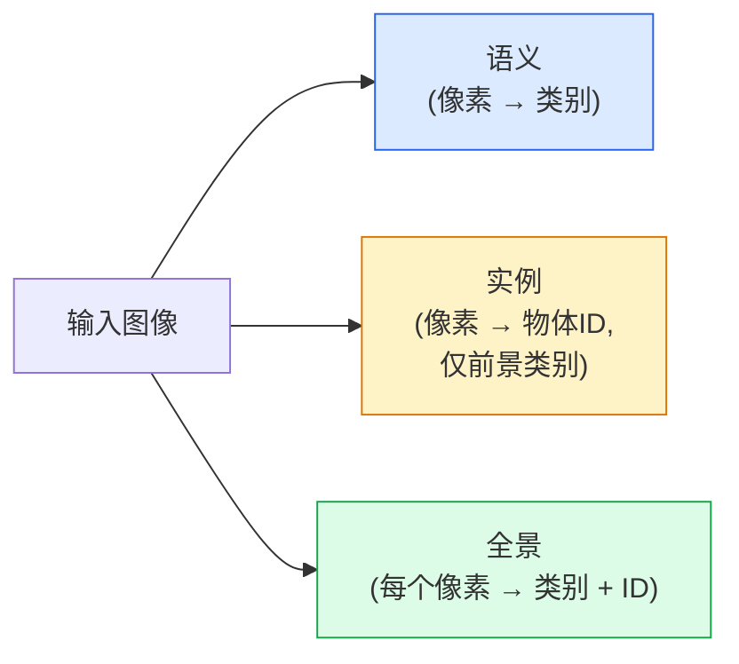
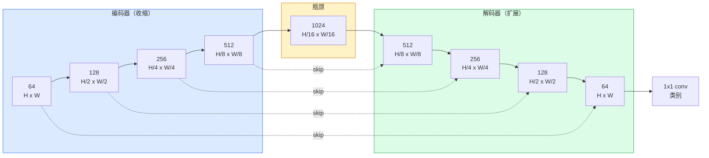

# 语义分割 — U-Net

> 分割是每个像素上的分类。U-Net通过将下采样编码器与上采样解码器配对，并在它们之间连接跳跃连接来实现这一点。

**类型：** 构建
**语言：** Python
**前置条件：** 阶段4 第03课（CNN），阶段4 第04课（图像分类）
**时间：** ~75分钟

## 学习目标

- 区分语义、实例和全景分割，并为给定问题选择正确的任务
- 在PyTorch中从零构建U-Net，包括编码器块、瓶颈、带转置卷积的解码器和跳跃连接
- 实现逐像素交叉熵、Dice loss以及当前医学和工业分割默认的组合损失
- 读取每个类别的IoU和Dice指标，并诊断糟糕分数是否来自小物体召回、边界精度或类别不平衡

## 问题

分类每张图像输出一个标签。检测每张图像输出少数几个框。分割每个像素输出一个标签。对于大小为`H x W`的输入，输出是一个形状为`H x W`（语义）或`H x W x N_instances`（实例）的张量。这是每张图像数百万个预测，而不是一个。

分割的结构是其为几乎所有密集预测视觉产品提供动力的原因：医学成像（肿瘤掩码）、自动驾驶（道路、车道、障碍物）、卫星（建筑物足迹、作物边界）、文档解析（布局区域）、机器人（可抓取区域）。这些任务都不能通过将物体放在框内来解决；它们需要精确的轮廓。

架构问题说起来简单但解决起来不容易：你需要网络同时看到图像的全局上下文（这是什么类型的场景）和局部像素细节（哪个像素是路vs人行道）。标准CNN在空间上压缩以获得上下文，这丢弃了细节。U-Net是同时获得两者的设计。

## 概念

### 语义 vs 实例 vs 全景


```mermaid
flowchart LR
    IN["输入图像"] --> SEM["语义<br/>(像素 → 类别)"]
    IN --> INS["实例<br/>(像素 → 物体ID,<br/>仅前景类别)"]
    IN --> PAN["全景<br/>(每个像素 → 类别 + ID)"]

    style SEM fill:#dbeafe,stroke:#2563eb
    style INS fill:#fef3c7,stroke:#d97706
    style PAN fill:#dcfce7,stroke:#16a34a
```

- **语义** 说"这个像素是道路，那个像素是汽车。"相邻的两辆车合并成一个斑块。
- **实例** 说"这个像素是汽车#3，那个像素是汽车#5。"忽略背景物体（"stuff" = 天空、道路、草地）。
- **全景** 统一了两者：每个像素获得一个类别标签，每个实例获得一个唯一ID，stuff和things都被分割。

本课覆盖语义分割。下一课（Mask R-CNN）覆盖实例分割。

### U-Net形状


```mermaid
flowchart LR
    subgraph ENC["编码器（收缩）"]
        E1["64<br/>H x W"] --> E2["128<br/>H/2 x W/2"]
        E2 --> E3["256<br/>H/4 x W/4"]
        E3 --> E4["512<br/>H/8 x W/8"]
    end
    subgraph BOT["瓶颈"]
        B1["1024<br/>H/16 x W/16"]
    end
    subgraph DEC["解码器（扩展）"]
        D4["512<br/>H/8 x W/8"] --> D3["256<br/>H/4 x W/4"]
        D3 --> D2["128<br/>H/2 x W/2"]
        D2 --> D1["64<br/>H x W"]
    end
    E4 --> B1 --> D4
    E1 -. skip .-> D1
    E2 -. skip .-> D2
    E3 -. skip .-> D3
    E4 -. skip .-> D4
    D1 --> OUT["1x1 conv<br/>类别"]

    style ENC fill:#dbeafe,stroke:#2563eb
    style BOT fill:#fef3c7,stroke:#d97706
    style DEC fill:#dcfce7,stroke:#16a34a
```

编码器将空间分辨率减半四次并使通道数翻倍。解码器反向操作：将空间分辨率翻倍四次并使通道数减半。跳跃连接在每个分辨率上将匹配的编码器特征与解码器特征拼接。最后的1x1 conv在全分辨率下将`64 -> num_classes`。

为什么跳跃连接是必要的：解码器在尝试输出像素级预测时只看到过小的特征图。没有跳跃，它无法精确定位边缘，因为该信息在编码器中被压缩掉了。跳跃连接将编码器在下降过程中计算的高分辨率特征图交给它。

### 转置 vs 双线性上采样

解码器必须扩展空间维度。两个选项：

- **转置卷积**（`nn.ConvTranspose2d`）— 可学习的上采样。历史上的U-Net默认。如果stride和kernel size不能整除，可能产生棋盘伪影。
- **双线性上采样 + 3x3 conv** — 平滑上采样后跟一个conv。更少伪影，更少参数，现在是现代默认。

两者都在实际中使用。对于第一个U-Net，双线性更安全。

### 像素网格上的交叉熵

对于C个类别的语义分割，模型输出是`(N, C, H, W)`。目标是`(N, H, W)`，包含整数类别ID。交叉熵与分类情况相同，只是在每个空间位置应用：

```
Loss = 对 (n, h, w) 求平均的 -log( softmax(logits[n, :, h, w])[target[n, h, w]] )
```

PyTorch中的`F.cross_entropy`原生处理此形状。不需要reshape。

### Dice loss以及为什么需要它

交叉熵平等对待每个像素。当一个类别主导画面时（医学成像：99%背景，1%肿瘤），这是错误的。网络可以通过到处预测背景获得99%的准确率，但这仍然无用。

Dice loss通过直接优化预测掩码和真实掩码之间的重叠来解决这个问题：

```
Dice(p, y) = 2 * sum(p * y) / (sum(p) + sum(y) + epsilon)
Dice_loss = 1 - Dice
```

其中`p`是某个类别的sigmoid/softmax概率图，`y`是二元ground-truth掩码。只有当重叠完美时损失才为零。因为它是基于比率的，类别不平衡无关紧要。

在实践中，使用**组合损失**：

```
L = L_cross_entropy + lambda * L_dice       (lambda ~ 1)
```

Cross-entropy在训练早期提供稳定的梯度；Dice在训练后期专注于实际匹配掩码形状。这种组合是医学成像的默认选择，在任何类别不平衡的数据集上都很难被击败。

### 评估指标

- **Pixel accuracy** — 正确预测的像素百分比。便宜。在数据不平衡时因与分类相同的理由而失效。
- **IoU per class** — 每个类别掩码的交并比；跨类别平均 = mIoU。
- **Dice（像素上的F1）** — 类似于IoU；`Dice = 2 * IoU / (1 + IoU)`。医学影像偏好Dice，驾驶社区偏好IoU；它们单调相关。
- **Boundary F1** — 衡量预测边界与ground-truth边界的接近程度，即使小幅偏移也会惩罚。对于半导体检测等高精度任务很重要。

报告每个类别的IoU，而不仅仅是mIoU。平均IoU会隐藏一个15%的类别，而其他九个是85%。

### 输入分辨率权衡

U-Net的编码器将分辨率减半四次，所以输入必须能被16整除。医学图像通常是512x512或1024x1024。自动驾驶裁剪是2048x1024。U-Net的内存成本与`H * W * C_max`成比例，在1024x1024且瓶颈通道数为1024的情况下，前向传播已经使用数GB的VRAM。

两个标准变通方法：
1. 切片输入 — 处理256x256的tiles并重叠拼接。
2. 用保持空间分辨率更高但拓宽感受野的空洞卷积（dilated convolutions）替换瓶颈（DeepLab系列）。

对于第一个模型，基础通道数为64的256x256输入U-Net在8 GB VRAM上可以舒适地训练。

## 构建

### 第1步：编码器块

两个3x3 conv，带batch norm和ReLU。第一个conv改变通道数；第二个保持它。

```python
import torch
import torch.nn as nn
import torch.nn.functional as F

class DoubleConv(nn.Module):
    def __init__(self, in_c, out_c):
        super().__init__()
        self.net = nn.Sequential(
            nn.Conv2d(in_c, out_c, kernel_size=3, padding=1, bias=False),
            nn.BatchNorm2d(out_c),
            nn.ReLU(inplace=True),
            nn.Conv2d(out_c, out_c, kernel_size=3, padding=1, bias=False),
            nn.BatchNorm2d(out_c),
            nn.ReLU(inplace=True),
        )

    def forward(self, x):
        return self.net(x)
```

这个块在整个过程中被复用。`bias=False`因为BN的beta处理了bias。

### 第2步：Down和Up块

```python
class Down(nn.Module):
    def __init__(self, in_c, out_c):
        super().__init__()
        self.net = nn.Sequential(
            nn.MaxPool2d(2),
            DoubleConv(in_c, out_c),
        )

    def forward(self, x):
        return self.net(x)


class Up(nn.Module):
    def __init__(self, in_c, out_c):
        super().__init__()
        self.up = nn.Upsample(scale_factor=2, mode="bilinear", align_corners=False)
        self.conv = DoubleConv(in_c, out_c)

    def forward(self, x, skip):
        x = self.up(x)
        if x.shape[-2:] != skip.shape[-2:]:
            x = F.interpolate(x, size=skip.shape[-2:], mode="bilinear", align_corners=False)
        x = torch.cat([skip, x], dim=1)
        return self.conv(x)
```

仅空间形状检查（`shape[-2:]`）处理维度不能被16整除的输入；安全的`F.interpolate`在拼接前对齐张量。比较完整形状也会触发通道数差异，这应该是一个响亮的错误，而不是静默的插值。

### 第3步：U-Net

```python
class UNet(nn.Module):
    def __init__(self, in_channels=3, num_classes=2, base=64):
        super().__init__()
        self.inc = DoubleConv(in_channels, base)
        self.d1 = Down(base, base * 2)
        self.d2 = Down(base * 2, base * 4)
        self.d3 = Down(base * 4, base * 8)
        self.d4 = Down(base * 8, base * 16)
        self.u1 = Up(base * 16 + base * 8, base * 8)
        self.u2 = Up(base * 8 + base * 4, base * 4)
        self.u3 = Up(base * 4 + base * 2, base * 2)
        self.u4 = Up(base * 2 + base, base)
        self.outc = nn.Conv2d(base, num_classes, kernel_size=1)

    def forward(self, x):
        x1 = self.inc(x)
        x2 = self.d1(x1)
        x3 = self.d2(x2)
        x4 = self.d3(x3)
        x5 = self.d4(x4)
        x = self.u1(x5, x4)
        x = self.u2(x, x3)
        x = self.u3(x, x2)
        x = self.u4(x, x1)
        return self.outc(x)

net = UNet(in_channels=3, num_classes=2, base=32)
x = torch.randn(1, 3, 256, 256)
print(f"output: {net(x).shape}")
print(f"params: {sum(p.numel() for p in net.parameters()):,}")
```

输出形状`(1, 2, 256, 256)` — 与输入相同的空间大小，`num_classes`个通道。`base=32`时约770万个参数。

### 第4步：损失函数

```python
def dice_loss(logits, targets, num_classes, eps=1e-6):
    probs = F.softmax(logits, dim=1)
    targets_one_hot = F.one_hot(targets, num_classes).permute(0, 3, 1, 2).float()
    dims = (0, 2, 3)
    intersection = (probs * targets_one_hot).sum(dim=dims)
    denom = probs.sum(dim=dims) + targets_one_hot.sum(dim=dims)
    dice = (2 * intersection + eps) / (denom + eps)
    return 1 - dice.mean()


def combined_loss(logits, targets, num_classes, lam=1.0):
    ce = F.cross_entropy(logits, targets)
    dc = dice_loss(logits, targets, num_classes)
    return ce + lam * dc, {"ce": ce.item(), "dice": dc.item()}
```

Dice按类别计算然后平均（macro Dice）。`eps`防止在batch中不存在的类别上除以零。

### 第5步：IoU指标

```python
@torch.no_grad()
def iou_per_class(logits, targets, num_classes):
    preds = logits.argmax(dim=1)
    ious = torch.zeros(num_classes)
    for c in range(num_classes):
        pred_c = (preds == c)
        true_c = (targets == c)
        inter = (pred_c & true_c).sum().float()
        union = (pred_c | true_c).sum().float()
        ious[c] = (inter / union) if union > 0 else torch.tensor(float("nan"))
    return ious
```

返回长度为C的向量。`nan`标记batch中缺失的类别——在计算mIoU时不应对这些求平均。

### 第6步：用于端到端验证的合成数据集

在彩色背景上生成形状，使网络必须学习形状而非像素颜色。

```python
import numpy as np
from torch.utils.data import Dataset, DataLoader

def synthetic_segmentation(num_samples=200, size=64, seed=0):
    rng = np.random.default_rng(seed)
    images = np.zeros((num_samples, size, size, 3), dtype=np.float32)
    masks = np.zeros((num_samples, size, size), dtype=np.int64)
    for i in range(num_samples):
        bg = rng.uniform(0, 1, (3,))
        images[i] = bg
        masks[i] = 0
        num_shapes = rng.integers(1, 4)
        for _ in range(num_shapes):
            cls = int(rng.integers(1, 3))
            color = rng.uniform(0, 1, (3,))
            cx, cy = rng.integers(10, size - 10, size=2)
            r = int(rng.integers(4, 12))
            yy, xx = np.meshgrid(np.arange(size), np.arange(size), indexing="ij")
            if cls == 1:
                mask = (xx - cx) ** 2 + (yy - cy) ** 2 < r ** 2
            else:
                mask = (np.abs(xx - cx) < r) & (np.abs(yy - cy) < r)
            images[i][mask] = color
            masks[i][mask] = cls
        images[i] += rng.normal(0, 0.02, images[i].shape)
        images[i] = np.clip(images[i], 0, 1)
    return images, masks


class SegDataset(Dataset):
    def __init__(self, images, masks):
        self.images = images
        self.masks = masks

    def __len__(self):
        return len(self.images)

    def __getitem__(self, i):
        img = torch.from_numpy(self.images[i]).permute(2, 0, 1).float()
        mask = torch.from_numpy(self.masks[i]).long()
        return img, mask
```

三个类别：背景（0）、圆形（1）、方形（2）。网络必须学习区分形状。

### 第7步：训练循环

```python
def train_one_epoch(model, loader, optimizer, device, num_classes):
    model.train()
    loss_sum, total = 0.0, 0
    iou_sum = torch.zeros(num_classes)
    for x, y in loader:
        x, y = x.to(device), y.to(device)
        logits = model(x)
        loss, _ = combined_loss(logits, y, num_classes)
        optimizer.zero_grad()
        loss.backward()
        optimizer.step()
        loss_sum += loss.item() * x.size(0)
        total += x.size(0)
        iou_sum += iou_per_class(logits, y, num_classes).nan_to_num(0)
    return loss_sum / total, iou_sum / len(loader)
```

在合成数据集上运行10-30个epoch，观察mIoU超过0.9。注意`nan_to_num(0)`将batch中不存在的类别视为零；为了准确的每类IoU，在评估时通过存在性掩码并使用跨batch的`torch.nanmean`，而不是在这里平均。

## 使用

对于生产环境，`segmentation_models_pytorch`（"smp"）用任何torchvision或timm backbone包装每个标准分割架构。三行代码：

```python
import segmentation_models_pytorch as smp

model = smp.Unet(
    encoder_name="resnet34",
    encoder_weights="imagenet",
    in_channels=3,
    classes=3,
)
```

在实际工作中也值得了解：
- **DeepLabV3+** 用空洞卷积替换基于max-pool的下采样，使瓶颈保持分辨率；在卫星和驾驶数据上边界更快。
- **SegFormer** 将conv编码器替换为层次化transformer；目前在许多基准上是最先进水平。
- **Mask2Former** / **OneFormer** 在单个架构中统一了语义、实例和全景分割。

所有三个在`smp`或`transformers`中都是即插即用的替代品，使用相同的dataloader。

## 交付物

本课产出：

- `outputs/prompt-segmentation-task-picker.md` — 一个prompt，在语义、实例和全景分割之间选择，并为给定任务命名架构。
- `outputs/skill-segmentation-mask-inspector.md` — 一个技能，报告类别分布、预测掩码统计以及预测不足或边界模糊的类别。

## 练习

1. **(简单)** 为二值分割任务（前景vs背景）实现`bce_dice_loss`。在合成二类数据集上验证，当前景仅占5%像素时，组合损失比单独BCE收敛更快。
2. **(中等)** 用`nn.ConvTranspose2d` up-block替换`nn.Upsample + conv` up-block。在合成数据集上训练两者并比较mIoU。观察转置卷积版本中棋盘伪影出现的位置。
3. **(困难)** 取一个真实分割数据集（Oxford-IIIT Pets、Cityscapes mini split或医学子集）并训练U-Net到与`smp.Unet`参考相差2个IoU点以内。报告每类IoU并确定哪些类别从向损失中添加Dice中获益最多。

## 关键术语

| 术语 | 人们的说法 | 实际含义 |
|------|----------------|----------------------|
| Semantic segmentation | "标记每个像素" | 逐像素分类到C个类别；同一类别的实例合并 |
| Instance segmentation | "标记每个物体" | 分离同一类别的不同实例；仅前景 |
| Panoptic segmentation | "语义 + 实例" | 每个像素获得一个类别；每个thing实例也获得一个唯一ID |
| Skip connection | "U-Net桥梁" | 将编码器特征拼接到匹配分辨率的解码器特征；保留高频细节 |
| Transposed conv | "反卷积" | 可学习的上采样；可能产生棋盘伪影 |
| Dice loss | "重叠损失" | 1 - 2|A ∩ B| / (|A| + |B|)；直接优化掩码重叠，对类别不平衡鲁棒 |
| mIoU | "平均交并比" | 跨类别的平均IoU；分割的社区标准指标 |
| Boundary F1 | "边界精度" | 仅在边界像素上计算的F1分数；对精度关键任务重要 |

## 延伸阅读

- [U-Net: Convolutional Networks for Biomedical Image Segmentation (Ronneberger et al., 2015)](https://arxiv.org/abs/1505.04597) — 原始论文；每个人复制的图在第2页
- [Fully Convolutional Networks (Long et al., 2015)](https://arxiv.org/abs/1411.4038) — 首次将分割变为端到端conv问题的论文
- [segmentation_models_pytorch](https://github.com/qubvel/segmentation_models.pytorch) — 生产级分割的参考；每个标准架构加上每个标准损失
- [Lessons learned from training SOTA segmentation (kaggle.com competitions)](https://www.kaggle.com/code/iafoss/carvana-unet-pytorch) — 讲解为什么TTA、伪标签和类别权重在真实数据上重要的教程
