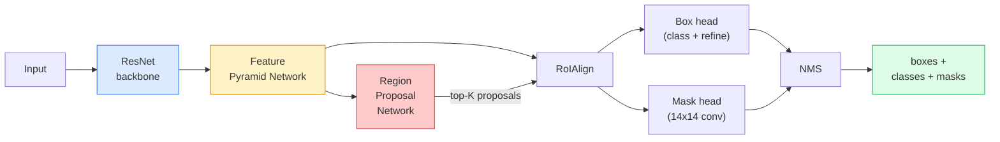

# Instance Segmentation — Mask R-CNN

> Faster R-CNN detector に小さな mask branch を足すと instance segmentation になります。難所は RoIAlign で、見た目よりずっと慎重に扱う必要があります。

**種別:** 構築 + 学習
**言語:** Python
**前提条件:** Phase 4 Lesson 06 (YOLO), Phase 4 Lesson 07 (U-Net)
**所要時間:** 約75分

## Learning Objectives

- Mask R-CNN architecture を end-to-end に追う: backbone、FPN、RPN、RoIAlign、box head、mask head
- RoIAlign を scratch から実装し、RoIPool が使われなくなった理由を説明する
- torchvision の `maskrcnn_resnet50_fpn_v2` pretrained model を production-quality instance masks に使い、その output format を正しく読む
- box head と mask head を置き換え、backbone を凍結して small custom dataset で Mask R-CNN を fine-tune する

## 問題

Semantic segmentation は class ごとに 1 mask を出します。Instance segmentation は、2 つの objects が同じ class でも object ごとに 1 mask を出します。individual objects の count、frames 間 tracking、個体ごとの measurement（壁の bricks、microscope image の cells など）には instance segmentation が必要です。

Mask R-CNN（He et al., 2017）は、instance segmentation を detection-plus-a-mask として再構成しました。design が非常に clean だったため、その後 5 年ほどの instance segmentation papers の多くが Mask R-CNN variant になり、torchvision implementation は今でも small to medium datasets の production default です。

hard engineering problem は sampling です。pixel boundaries に揃っていない proposal box から、fixed-size feature region をどう crop するか。ここを間違えると mAP が全体で数 tenths 落ちます。RoIAlign がその答えです。

## The Concept

### The architecture



理解すべき部品は 5 つです。

1. **Backbone** — ImageNet で trained した ResNet-50 または ResNet-101。stride 4, 8, 16, 32 の feature maps hierarchy を作ります。
2. **FPN (Feature Pyramid Network)** — top-down + lateral connections により、すべての level に semantic-rich な C-channel features を与えます。detection は object size に合う FPN level を query します。
3. **RPN (Region Proposal Network)** — 各 anchor position で「ここに object があるか」と「box をどう refine するか」を予測する小さな conv head。image ごとに約 1000 proposals を作ります。
4. **RoIAlign** — 任意の box と任意の FPN level から fixed-size（例: 7x7）の feature patch を sample します。bilinear sampling で quantisation はありません。
5. **Heads** — box を refine して class を選ぶ two-layer box head と、proposal ごとに `28x28` binary mask を出す small conv head。

### Why RoIAlign, not RoIPool

original Fast R-CNN は RoIPool を使っていました。RoIPool は proposal box を grid に分け、各 cell の最大 feature を取り、coordinates をすべて整数に丸めます。この丸めにより input pixel coordinates と feature map が最大 1 feature-map pixel ずれます。224x224 image では小さく見えても、stride 32 feature map では致命的です。

```
RoIPool:
  box (34.7, 51.3, 98.2, 142.9)
  round -> (34, 51, 98, 142)
  split grid -> round each cell boundary
  misalignment accumulates at every step

RoIAlign:
  box (34.7, 51.3, 98.2, 142.9)
  sample at exact float coordinates using bilinear interpolation
  no rounding anywhere
```

RoIAlign は COCO の mask AP を 3-4 points 押し上げました。localisation を重視する detector は、YOLOv7 seg、RT-DETR、Mask2Former を含め、今では同じ考え方を使っています。

### The RPN in one paragraph

feature map の各位置に、サイズと形の異なる K anchor boxes を置きます。各 anchor について objectness score と、anchor をよりよい box に変える regression offset を予測します。score 上位およそ 1,000 boxes を残し、IoU 0.7 で NMS を適用し、生き残った proposals を heads に渡します。RPN は Lesson 6 の YOLO loss と同じ構造の mini-loss で trained されます。ただし class は object / no object の 2 つです。

### The mask head

各 proposal（RoIAlign 後）に対して、mask head は small FCN です。4 つの 3x3 convs、2x deconv、最後の 1x1 conv により `28x28` resolution で `num_classes` output channels を生成します。predicted class に対応する channel だけを残し、他は無視します。これにより mask prediction と classification が decouple されます。

28x28 mask は proposal の original pixel size に upsample され、final binary mask になります。

### Losses

Mask R-CNN は 5 つの losses を足します。

```
L = L_rpn_cls + L_rpn_box + L_box_cls + L_box_reg + L_mask
```

- `L_rpn_cls`, `L_rpn_box` — RPN proposals の objectness と box regression。
- `L_box_cls` — head classifier 上の (C+1) classes（background を含む）に対する cross-entropy。
- `L_box_reg` — head box refinement の smooth L1。
- `L_mask` — 28x28 mask output に対する per-pixel binary cross-entropy。

各 loss には default weight があり、torchvision implementation では constructor arguments として exposed されています。

### Output format

`torchvision.models.detection.maskrcnn_resnet50_fpn_v2` は image ごとに dict の list を返します。

```
{
    "boxes":  (N, 4) in (x1, y1, x2, y2) pixel coordinates,
    "labels": (N,) class IDs, 0 = background so indices are 1-based,
    "scores": (N,) confidence scores,
    "masks":  (N, 1, H, W) float masks in [0, 1] — threshold at 0.5 for binary,
}
```

mask はすでに full image resolution です。28x28 head output は内部で upsample 済みです。

## 実装

### Step 1: RoIAlign from scratch

この component は prose より code のほうが理解しやすいです。

```python
import torch
import torch.nn.functional as F

def roi_align_single(feature, box, output_size=7, spatial_scale=1 / 16.0):
    """
    feature: (C, H, W) single-image feature map
    box: (x1, y1, x2, y2) in original image pixel coordinates
    output_size: side of the output grid (7 for box head, 14 for mask head)
    spatial_scale: reciprocal of the feature map stride
    """
    C, H, W = feature.shape
    x1, y1, x2, y2 = [c * spatial_scale - 0.5 for c in box]
    bin_w = (x2 - x1) / output_size
    bin_h = (y2 - y1) / output_size

    grid_y = torch.linspace(y1 + bin_h / 2, y2 - bin_h / 2, output_size)
    grid_x = torch.linspace(x1 + bin_w / 2, x2 - bin_w / 2, output_size)
    yy, xx = torch.meshgrid(grid_y, grid_x, indexing="ij")

    gx = 2 * (xx + 0.5) / W - 1
    gy = 2 * (yy + 0.5) / H - 1
    grid = torch.stack([gx, gy], dim=-1).unsqueeze(0)
    sampled = F.grid_sample(feature.unsqueeze(0), grid, mode="bilinear",
                            align_corners=False)
    return sampled.squeeze(0)
```

すべての値は bilinearly-sampled position にあります。rounding も quantisation もなく、gradients も落ちません。

### Step 2: Compare to torchvision's RoIAlign

```python
from torchvision.ops import roi_align

feature = torch.randn(1, 16, 50, 50)
boxes = torch.tensor([[0, 10, 20, 100, 90]], dtype=torch.float32)  # (batch_idx, x1, y1, x2, y2)

ours = roi_align_single(feature[0], boxes[0, 1:].tolist(), output_size=7, spatial_scale=1/4)
theirs = roi_align(feature, boxes, output_size=(7, 7), spatial_scale=1/4, sampling_ratio=1, aligned=True)[0]

print(f"shape ours:   {tuple(ours.shape)}")
print(f"shape theirs: {tuple(theirs.shape)}")
print(f"max|diff|:    {(ours - theirs).abs().max().item():.3e}")
```

`sampling_ratio=1` と `aligned=True` では、2 つは `1e-5` 以内で一致します。

### Step 3: Load a pretrained Mask R-CNN

```python
import torch
from torchvision.models.detection import maskrcnn_resnet50_fpn_v2, MaskRCNN_ResNet50_FPN_V2_Weights

model = maskrcnn_resnet50_fpn_v2(weights=MaskRCNN_ResNet50_FPN_V2_Weights.DEFAULT)
model.eval()
print(f"params: {sum(p.numel() for p in model.parameters()):,}")
print(f"classes (including background): {len(model.roi_heads.box_predictor.cls_score.out_features * [0])}")
```

46M parameters、91 classes（COCO）です。最初の class（id 0）は background なので、model が実際に検出するものは id 1 から始まります。

### Step 4: Run inference

```python
with torch.no_grad():
    x = torch.randn(3, 400, 600)
    predictions = model([x])
p = predictions[0]
print(f"boxes:  {tuple(p['boxes'].shape)}")
print(f"labels: {tuple(p['labels'].shape)}")
print(f"scores: {tuple(p['scores'].shape)}")
print(f"masks:  {tuple(p['masks'].shape)}")
```

mask tensor は `(N, 1, H, W)` です。binary mask per object を得るには 0.5 で threshold します。

```python
binary_masks = (p['masks'] > 0.5).squeeze(1)  # (N, H, W) boolean
```

### Step 5: Swap the heads for a custom class count

common fine-tuning recipe は、backbone、FPN、RPN を再利用し、2 つの classifier heads を置き換えることです。

```python
from torchvision.models.detection.faster_rcnn import FastRCNNPredictor
from torchvision.models.detection.mask_rcnn import MaskRCNNPredictor

def build_custom_maskrcnn(num_classes):
    model = maskrcnn_resnet50_fpn_v2(weights=MaskRCNN_ResNet50_FPN_V2_Weights.DEFAULT)
    in_features = model.roi_heads.box_predictor.cls_score.in_features
    model.roi_heads.box_predictor = FastRCNNPredictor(in_features, num_classes)
    in_features_mask = model.roi_heads.mask_predictor.conv5_mask.in_channels
    hidden_layer = 256
    model.roi_heads.mask_predictor = MaskRCNNPredictor(in_features_mask, hidden_layer, num_classes)
    return model

custom = build_custom_maskrcnn(num_classes=5)
print(f"custom cls_score.out_features: {custom.roi_heads.box_predictor.cls_score.out_features}")
```

`num_classes` は background class を含めます。4 object classes の dataset なら `num_classes=5` です。

### Step 6: Freeze what does not need training

small datasets では backbone と FPN を凍結します。RPN objectness + regression と 2 つの heads だけを学習します。

```python
def freeze_backbone_and_fpn(model):
    # torchvision Mask R-CNN packs the FPN inside `model.backbone` (as
    # `model.backbone.fpn`), so iterating `model.backbone.parameters()` covers
    # both the ResNet feature layers and the FPN lateral/output convs.
    for p in model.backbone.parameters():
        p.requires_grad = False
    return model

custom = freeze_backbone_and_fpn(custom)
trainable = sum(p.numel() for p in custom.parameters() if p.requires_grad)
print(f"trainable after freeze: {trainable:,}")
```

500-image datasets では、これが convergence と overfitting の差になることがあります。

## Use It

torchvision の Mask R-CNN training loop は 40 行程度で、tasks 間で大きく変わりません。datasets を差し替えれば同じ構造で進められます。

```python
def train_step(model, images, targets, optimizer):
    model.train()
    loss_dict = model(images, targets)
    losses = sum(loss for loss in loss_dict.values())
    optimizer.zero_grad()
    losses.backward()
    optimizer.step()
    return {k: v.item() for k, v in loss_dict.items()}
```

`targets` list は image ごとの dict で、`boxes`、`labels`、`masks`（`(num_instances, H, W)` binary tensors）を含む必要があります。model は training 中は 4 losses の dict を返し、eval 中は predictions の list を返します。これは `model.training` によって切り替わります。

`pycocotools` evaluator は boxes と masks の両方について mAP@IoU=0.5:0.95 を出します。box head と mask head のどちらが bottleneck かを知るには両方が必要です。

## Ship It

この lesson で作るもの:

- `outputs/prompt-instance-vs-semantic-router.md` — 3 つの質問をして instance、semantic、panoptic のどれかと最初に使う model を選ぶ prompt。
- `outputs/skill-mask-rcnn-head-swapper.md` — 新しい `num_classes` を受け取り、torchvision detection model の heads を swap する 10 行の code を生成する skill。

## Exercises

1. **(Easy)** 100 random boxes で自分の RoIAlign を `torchvision.ops.roi_align` と比較し、max absolute difference を報告してください。さらに RoIPool（pre-2017 behaviour）も実行し、border 近くの boxes で feature-map pixels 1-2 個程度ずれることを示してください。
2. **(Medium)** 50-image custom dataset（balloons、fish、pothole、logos など任意の 2 classes）で `maskrcnn_resnet50_fpn_v2` を fine-tune してください。backbone を凍結し、20 epochs train し、mask AP@0.5 を報告します。
3. **(Hard)** Mask R-CNN の mask head を 28x28 ではなく 56x56 を予測するものに置き換えてください。変更前後で mAP@IoU=0.75 を測り、得られた gain（または gain がないこと）が boundary-precision / memory trade-off の期待と一致する理由を説明します。

## Key Terms

| Term | What people say | What it actually means |
|------|----------------|----------------------|
| Mask R-CNN | "Detection plus masks" | Faster R-CNN + proposal ごと class ごとに 28x28 mask を予測する small FCN head |
| FPN | "Feature pyramid" | top-down + lateral connections により各 stride level に semantic-rich な C-channel features を与える |
| RPN | "Region proposer" | image ごとに約 1000 object/no-object proposals を作る small conv head |
| RoIAlign | "No-rounding crop" | 任意の float-coordinate box から fixed-size feature grid を bilinear sampling する |
| RoIPool | "Pre-2017 crop" | RoIAlign と同じ目的だが box coordinates を丸める。obsolete |
| Mask AP | "Instance mAP" | box IoU ではなく mask IoU で計算する average precision。COCO instance segmentation metric |
| Binary mask head | "Per-class mask" | proposal ごとに class ごとの binary mask を予測し、predicted class の channel だけを使う |
| Background class | "Class 0" | catch-all "no object" class。real classes の indices は 1 から始まる |

## 参考文献

- [Mask R-CNN (He et al., 2017)](https://arxiv.org/abs/1703.06870) — paper。RoIAlign に関する section 3 が重要です
- [FPN: Feature Pyramid Networks (Lin et al., 2017)](https://arxiv.org/abs/1612.03144) — FPN paper。modern detector のほぼすべてが使います
- [torchvision Mask R-CNN tutorial](https://pytorch.org/tutorials/intermediate/torchvision_tutorial.html) — fine-tuning loop の reference
- [Detectron2 model zoo](https://github.com/facebookresearch/detectron2/blob/main/MODEL_ZOO.md) — detection と segmentation variants の trained weights を含む production implementations
