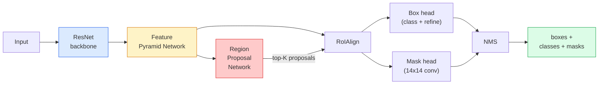

# Örnek Segmentasyonu — R-CNN maskesi

> Faster R-CNN dedektörüne küçük bir maske dalı ekleyin ve örnek segmentasyonuna sahip olun. İşin zor kısmı RoIAlign'dır ve göründüğünden daha zordur.

**Tür:** İnşa Et + Öğren
**Diller:** Python
**Önkoşullar:** Aşama 4 Ders 06 (YOLO), Aşama 4 Ders 07 (U-Net)
**Süre:** ~75 dakika

## Öğrenme Hedefleri

- Mask R-CNN mimarisini uçtan uca izleyin: omurga, FPN, RPN, RoIAlign, kutu başı, maske başı
- RoIAlign'ı sıfırdan uygulayın ve RoIPool'un neden artık kullanılmadığını açıklayın
- Üretim kalitesinde örnek maskeler için torchvision `maskrcnn_resnet50_fpn_v2` önceden eğitilmiş modeli kullanın ve çıktı formatını doğru şekilde okuyun
- Kutuyu ve maske kafalarını değiştirerek ve omurgayı donmuş halde tutarak küçük, özel bir dataset üzerinde Mask R-CNN'ye ince ayar yapın

## Sorun

Anlamsal bölümleme size sınıf başına bir maske verir. Örnek segmentasyonu, iki nesne bir sınıfı paylaşsa bile size nesne başına bir maske verir. Bireyleri saymak, çerçeveler arasında izleme yapmak ve nesneleri ölçmek (duvardaki her tuğlanın sınırlayıcı kutusu, mikroskop görüntüsündeki her hücre) örneğin bölümlendirilmesini gerektirir.

Mask R-CNN (He ve diğerleri, 2017), örnek bölümlendirmeyi algılama artı bir maske olarak yeniden çerçevelendirerek bu sorunu çözdü. Tasarım o kadar temizdi ki, sonraki beş yıl boyunca hemen hemen her örnek segmentasyon kağıdı bir Mask R-CNN çeşidi oldu ve torchvision uygulaması hala küçük ve orta ölçekli dataset'ler için üretim varsayılanıydı.

Zorlu mühendislik problemi örneklemedir: köşeleri piksel sınırlarıyla hizalanmayan bir teklif kutusundan sabit boyutlu bir özellik bölgesini nasıl kırparsınız? Bunu yanlış yapmak her yerde bir mAP puanının onda birine mal olur. Cevap RoIAlign'dır.

## Konsept

### Mimari



Anlaşılması gereken beş parça:

1. **Omurga** — ImageNet'te eğitilmiş ResNet-50 veya ResNet-101. 4, 8, 16, 32. adımlarda özellik haritalarının hiyerarşisini üretir.
2. **FPN (Özellik Piramidi Ağı)** — anlamsal açıdan zengin özelliklerin her C düzeyi kanalına veren yukarıdan aşağıya + yanal bağlantılar. Algılama, nesne boyutuyla eşleşen FPN düzeyini sorgular.
3. **RPN (Bölge Teklif Ağı)** — her bağlantı konumunda "burada bir nesne var mı?" tahminini yapan küçük bir dönüşüm kafası. ve "kutuyu nasıl hassaslaştırabilirim?". Görüntü başına ~1000 teklif üretir.
4. **RoIAlign** — herhangi bir FPN düzeyindeki herhangi bir kutudan sabit boyutlu (e.g.7x7) özellik yamasını örnekler. Çift doğrusal örnekleme, nicemleme yok.
5. **Başlar** — kutuyu geliştiren ve bir sınıf seçen iki katmanlı kutu kafasına ek olarak her teklif için bir `28x28` ikili maske çıkaran küçük bir dönüşüm kafası.

### Neden RoIPool değil, RoIAlign

Orijinal Fast R-CNN kullanılan RoIPool, bir teklif kutusunu bir ızgaraya böler, her hücrede maksimum özelliği alır ve tüm koordinatları tam sayılara yuvarlar. Bu yuvarlama, özellik haritasını giriş piksel koordinatlarından tam özellik haritası pikseline kadar yanlış hizalar; 224x224 görüntüde küçük, özellik haritası 32. adım olduğunda felakettir.

```
RoIPool:
  box (34.7, 51.3, 98.2, 142.9)
  round -> (34, 51, 98, 142)
  split grid -> round each cell boundary
  misalignment accumulates at every step

RoIAlign:
  box (34.7, 51.3, 98.2, 142.9)
  sample at exact float coordinates using bilinear interpolation
  no rounding anywhere
```

RoIAlign, COCO'da maske AP'sini ücretsiz olarak 3-4 puan yükseltir. Yerelleştirmeye önem veren her dedektör artık bunu kullanıyor - YOLOv7 seg, RT-DETR, Mask2Former.

### Tek paragrafta RPN

Özellik haritasının her konumuna farklı boyut ve şekillerde K bağlantı kutusu yerleştirin. Her bir çapa için bir nesnellik puanı ve çapayı daha uygun bir kutuya dönüştürmek için bir regresyon uzaklığı tahmin edin. Skora göre ilk ~1.000 kutuyu tutun, IoU 0,7'de NMS uygulayın ve hayatta kalanları kafalara verin. RPN kendi mini kaybıyla eğitilir - Ders 6'daki YOLO kaybıyla aynı yapıdadır, yalnızca iki sınıfla (nesne / nesne yok).

### Maske başlığı

Her teklif için (RoIAlign'dan sonra) maske kafası küçük bir FCN'dir: dört adet 3x3 dönüşüm, bir 2x dekonv, `28x28` çözünürlüğünde `num_classes` çıkış kanalları üreten son bir 1x1 dönüşüm. Yalnızca tahmin edilen sınıfa karşılık gelen kanal tutulur; diğerleri görmezden gelinir. Bu, maske tahminini sınıflandırmadan ayırır.

Nihai ikili maskeyi oluşturmak için 28x28 maskeyi teklifin orijinal piksel boyutuna yükseltin.

### Kayıplar

Mask R-CNN'nin toplam dört kaybı var:

```
L = L_rpn_cls + L_rpn_box + L_box_cls + L_box_reg + L_mask
```

- `L_rpn_cls`, `L_rpn_box` — RPN önerileri için nesnelik + kutu regresyonu.
- `L_box_cls` — kafanın sınıflandırıcısındaki (C+1) sınıflar (arka plan dahil) üzerinde çapraz entropi.
- `L_box_reg` — kafa kutusu iyileştirmesinde pürüzsüz L1.
- `L_mask` — 28x28 maske çıkışında piksel başına ikili çapraz entropi.

Her kaybın kendi varsayılan ağırlığı vardır; torchvision uygulaması bunları yapıcı argümanlar olarak ortaya çıkarır.

### Çıkış formatı

`torchvision.models.detection.maskrcnn_resnet50_fpn_v2`, resim başına bir tane olmak üzere bir sözlük listesi döndürür:

```
{
    "boxes":  (N, 4) in (x1, y1, x2, y2) pixel coordinates,
    "labels": (N,) class IDs, 0 = background so indices are 1-based,
    "scores": (N,) confidence scores,
    "masks":  (N, 1, H, W) float masks in [0, 1] — threshold at 0.5 for binary,
}
```

Maske zaten tam görüntü çözünürlüğünde. 28x28 kafa çıkışı dahili olarak üst örneklenmiştir.

## İnşa Et

### 1. Adım: Sıfırdan RoI Hizalama

Bu, Mask R-CNN'in düzyazıdan ziyade kod olarak anlaşılması daha kolay olan tek bileşenidir.

```python
import torch
import torch.nn.functional as F

def roi_align_single(feature, box, output_size=7, spatial_scale=1 / 16.0):
    """
    feature: (C, H, W) single-image feature map
    box: (x1, y1, x2, y2) in original image pixel coordinates
    output_size: side of the output grid (7 for box head, 14 for mask head)
    spatial_scale: reciprocal of the feature map stride
    """
    C, H, W = feature.shape
    x1, y1, x2, y2 = [c * spatial_scale - 0.5 for c in box]
    bin_w = (x2 - x1) / output_size
    bin_h = (y2 - y1) / output_size

    grid_y = torch.linspace(y1 + bin_h / 2, y2 - bin_h / 2, output_size)
    grid_x = torch.linspace(x1 + bin_w / 2, x2 - bin_w / 2, output_size)
    yy, xx = torch.meshgrid(grid_y, grid_x, indexing="ij")

    gx = 2 * (xx + 0.5) / W - 1
    gy = 2 * (yy + 0.5) / H - 1
    grid = torch.stack([gx, gy], dim=-1).unsqueeze(0)
    sampled = F.grid_sample(feature.unsqueeze(0), grid, mode="bilinear",
                            align_corners=False)
    return sampled.squeeze(0)
```

Her sayı çift doğrusal olarak örneklenmiş bir konumdadır. Yuvarlama yok, niceleme yok, bırakılan gradient yok.

### 2. Adım: Torchvision'un RoIAlign'ıyla karşılaştırın

```python
from torchvision.ops import roi_align

feature = torch.randn(1, 16, 50, 50)
boxes = torch.tensor([[0, 10, 20, 100, 90]], dtype=torch.float32)  # (batch_idx, x1, y1, x2, y2)

ours = roi_align_single(feature[0], boxes[0, 1:].tolist(), output_size=7, spatial_scale=1/4)
theirs = roi_align(feature, boxes, output_size=(7, 7), spatial_scale=1/4, sampling_ratio=1, aligned=True)[0]

print(f"shape ours:   {tuple(ours.shape)}")
print(f"shape theirs: {tuple(theirs.shape)}")
print(f"max|diff|:    {(ours - theirs).abs().max().item():.3e}")
```

`sampling_ratio=1` ve `aligned=True` ile bu ikisi `1e-5` ile eşleşir.

### Adım 3: Önceden eğitilmiş bir Maske R-CNN yükleyin

```python
import torch
from torchvision.models.detection import maskrcnn_resnet50_fpn_v2, MaskRCNN_ResNet50_FPN_V2_Weights

model = maskrcnn_resnet50_fpn_v2(weights=MaskRCNN_ResNet50_FPN_V2_Weights.DEFAULT)
model.eval()
print(f"params: {sum(p.numel() for p in model.parameters()):,}")
print(f"classes (including background): {len(model.roi_heads.box_predictor.cls_score.out_features * [0])}")
```

46M parametre, 91 sınıf (COCO). Birinci sınıf (id 0) arka plandır; modelin gerçekte algıladığı her şey kimlik 1'de başlar.

### Adım 4: inference'yi çalıştırın

```python
with torch.no_grad():
    x = torch.randn(3, 400, 600)
    predictions = model([x])
p = predictions[0]
print(f"boxes:  {tuple(p['boxes'].shape)}")
print(f"labels: {tuple(p['labels'].shape)}")
print(f"scores: {tuple(p['scores'].shape)}")
print(f"masks:  {tuple(p['masks'].shape)}")
```

Maske tensörü `(N, 1, H, W)` şeklindedir. Nesne başına ikili maske elde etmek için eşik 0,5'tir:

```python
binary_masks = (p['masks'] > 0.5).squeeze(1)  # (N, H, W) boolean
```

### Adım 5: Özel sınıf sayısı için kafaları değiştirin

Ortak fine-tuning tarifi: omurgayı, FPN'yi ve RPN'yi yeniden kullanın; iki sınıflandırıcı başlığını değiştirin.

```python
from torchvision.models.detection.faster_rcnn import FastRCNNPredictor
from torchvision.models.detection.mask_rcnn import MaskRCNNPredictor

def build_custom_maskrcnn(num_classes):
    model = maskrcnn_resnet50_fpn_v2(weights=MaskRCNN_ResNet50_FPN_V2_Weights.DEFAULT)
    in_features = model.roi_heads.box_predictor.cls_score.in_features
    model.roi_heads.box_predictor = FastRCNNPredictor(in_features, num_classes)
    in_features_mask = model.roi_heads.mask_predictor.conv5_mask.in_channels
    hidden_layer = 256
    model.roi_heads.mask_predictor = MaskRCNNPredictor(in_features_mask, hidden_layer, num_classes)
    return model

custom = build_custom_maskrcnn(num_classes=5)
print(f"custom cls_score.out_features: {custom.roi_heads.box_predictor.cls_score.out_features}")
```

`num_classes` arka plan sınıfını içermelidir; dolayısıyla 4 nesne sınıfına sahip bir dataset, `num_classes=5`'yi kullanır.

### Adım 6: Eğitim gerektirmeyenleri dondurun

Küçük dataset'lerde omurgayı ve FPN'yi dondurun. Yalnızca RPN nesnelliği + regresyon ve iki kafa öğrenir.

```python
def freeze_backbone_and_fpn(model):
    # torchvision Mask R-CNN packs the FPN inside `model.backbone` (as
    # `model.backbone.fpn`), so iterating `model.backbone.parameters()` covers
    # both the ResNet feature layers and the FPN lateral/output convs.
    for p in model.backbone.parameters():
        p.requires_grad = False
    return model

custom = freeze_backbone_and_fpn(custom)
trainable = sum(p.numel() for p in custom.parameters() if p.requires_grad)
print(f"trainable after freeze: {trainable:,}")
```

500 görüntülü dataset'lerde yakınsama ve aşırı uyum arasındaki fark budur.

## Kullan onu

Torchvision'daki Mask R-CNN'nin tam eğitim döngüsü 40 satırdır ve görevler arasında anlamlı bir değişim göstermez; dataset'leri değiştirin ve devam edin.

```python
def train_step(model, images, targets, optimizer):
    model.train()
    loss_dict = model(images, targets)
    losses = sum(loss for loss in loss_dict.values())
    optimizer.zero_grad()
    losses.backward()
    optimizer.step()
    return {k: v.item() for k, v in loss_dict.items()}
```

`targets` listesi, `boxes`, `labels` ve `masks` (`(num_instances, H, W)` ikili tensörleri olarak) içeren görüntü başına diktelere sahip olmalıdır. Model, `model.training`'ye göre anahtarlanmış, eğitim sırasındaki dört kaybın diktesini ve değerlendirme sırasındaki tahminlerin bir listesini döndürür.

`pycocotools` değerlendiricisi hem kutular hem de maskeler için mAP@IoU=0,5:0,95 üretir; Darboğazın kutu başlığı mı yoksa maske başlığı mı olduğunu bilmek için her iki sayıya da ihtiyacınız var.

## Gönderin

Bu ders şunları üretir:

- `outputs/prompt-instance-vs-semantic-router.md` — üç soru soran ve örnek, anlamsal ve panoptik artı başlangıç için tam modeli seçen bir prompt.
- `outputs/skill-mask-rcnn-head-swapper.md` — yeni `num_classes` verildiğinde, herhangi bir torchvision algılama modelinde kafaları değiştirmek için 10 satırlık kod üreten bir beceri.

## Egzersizler

1. **(Kolay)** RoIAlign'ınızı 100 rastgele kutuda `torchvision.ops.roi_align`'ye göre doğrulayın. Maksimum mutlak farkı bildirin. Ayrıca RoIPool'u (2017 öncesi davranış) çalıştırın ve sınırın yakınındaki kutularda ~1-2 özellik haritası pikseli kadar farklılaştığını gösterin.
2. **(Orta)** 50 görüntülü özel dataset (herhangi iki sınıf: balonlar, balık, çukurlar, logolar) üzerinde `maskrcnn_resnet50_fpn_v2`'ye ince ayar yapın. Omurgayı dondurun, 20 dönem boyunca antrenman yapın, maske AP@0.5'i bildirin.
3. **(Sert)** Mask R-CNN'in maske başlığını 28x28 yerine 56x56 öngören bir maske başlığıyla değiştirin. mAP@IoU=0,75'i önce ve sonra ölçün. Kazancın (veya kazanç eksikliğinin) neden beklenen sınır hassasiyeti/bellek değiş tokuşuyla eşleştiğini açıklayın.

## Anahtar Terimler

| Dönem | İnsanlar ne diyor | Aslında ne anlama geliyor |
|------|----------------|----------------------|
| Maske R-CNN | "Algılama artı maskeler" | Daha hızlı R-CNN + sınıf ve teklif başına 28x28 maske öngören küçük bir FCN kafası |
| FPN | "Özellik piramidi" | Her adımda anlam açısından zengin özelliklere sahip C seviyesi kanalları sağlayan yukarıdan aşağıya + yanal bağlantılar |
| RPN | "Bölge önericisi" | Görüntü başına ~1000 nesne/nesne içermeyen teklif üreten küçük bir dönüşüm kafası |
| RoI Hizala | "Yuvarlak olmayan mahsul" | Herhangi bir değişken koordinat kutusundan sabit boyutlu bir özellik ızgarasını çift doğrusal olarak örnekler |
| RoIPol | "2017 öncesi mahsul" | RoIAlign ile aynı amaca sahiptir ancak kutu koordinatlarını yuvarlar; eski |
| Maske AP | "Örnek mAP" | Kutu IoU yerine maske IoU ile hesaplanan ortalama hassasiyet; COCO örneği segmentasyonu metriği |
| İkili maske başlığı | "Sınıf başına maske" | Her teklif için sınıf başına bir ikili maskeyi tahmin eder; yalnızca tahmin edilen sınıfın kanalı tutulur |
| Arka plan sınıfı | "Sınıf 0" | Her şeyi kapsayan "nesne yok" sınıfı; gerçek sınıflara ilişkin endeksler 1'den başlar |

## Daha Fazla Okuma

- [Mask R-CNN (He ve diğerleri, 2017)](https://arxiv.org/abs/1703.06870) — makale; RoIAlign ile ilgili 3. bölüm kritik okumadır
- [FPN: Özel Piramit Ağları (Lin ve diğerleri, 2017)](https://arxiv.org/abs/1612.03144) — FPN makalesi; her modern dedektör bunu kullanır
- [torchvision Maskesi R-CNN eğitimi](https://pytorch.org/tutorials/intermediate/torchvision_tutorial.html) — fine-tuning döngüsü için referans
- [Detectron2 model zoo](https://github.com/facebookresearch/detectron2/blob/main/MODEL_ZOO.md) — neredeyse her algılama ve segmentasyon çeşidi için eğitilmiş ağırlıklara sahip üretim uygulamaları
