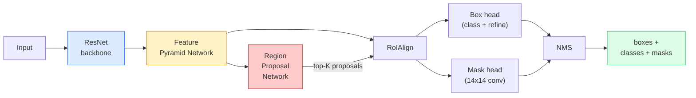

# Instance Segmentation — Mask R-CNN

> 将一个微小的掩码分支添加到Faster R-CNN检测器中，你就有了实例分割。最难的部分是RoIAlign，它比看起来更难。

** 类型：** 构建+学习
** 语言：** Python
** 先决条件：** 第4阶段第06课（YOLO）、第4阶段第07课（U-Net）
** 时间：** ~75分钟

## Learning Objectives

- 端到端跟踪MaskR-CNN架构：主干、FPN、RPN、RoIAlignn、箱头、面罩头
- 从头开始实施RoIligin并解释为什么不再使用RoIPool
- 使用Torchvision ' maskrcnn_resnet50_fpn_v2 '预训练模型进行生产质量实例屏蔽并正确读取其输出格式
- 通过更换盒子和面罩头部并保持主干冻结，在小型自定义数据集上微调Mass R-CNN

## The Problem

语义分割为每个类提供一个面具。实例分割为每个对象提供一个面具，即使两个对象共享一个类。计数个体、跨帧跟踪和测量事物（墙上每个砖块的边界框、显微镜图像中的每个细胞）都需要实例分割。

面具R-CNN（他等人，2017）通过将实例分割重新构建为检测加屏蔽来解决这个问题。该设计非常简洁，以至于在接下来的五年里，几乎所有实例分割论文都是MaskR-CNN变体，并且torchvision实现仍然是中小数据集的默认生产。

棘手的工程问题是采样：如何从角与像素边界不对齐的提案框中裁剪固定大小的特征区域？在任何地方犯错误都会花费十分之一的mAP点。Roialgin就是答案。

## The Concept

### The architecture



需要理解的五点：

1. **Backbone** -在ImageNet上训练的ResNet-50或ResNet-101。以4、8、16、32步生成特征地图层次结构。
2. **FPN（特征金字塔网络）** -自上而下+横向连接，为每个C级通道提供语义丰富的特征。检测查询与对象大小匹配的FPN级别。
3. **RPN（区域提案网络）** -一个小型会议头，在每个锚点位置预测“这里有物体吗？”和“如何完善盒子？".每张图像可生成约1000个提案。
4. **RoIAlign** -从任何FPN级别上的任何框中采样固定大小（例如7 x7）的特征补丁。双线性采样，无量化。
5. **Heads** -两层箱头，用于细化箱并选择类，加上一个小conv头，用于为每个提案输出“28 x28”二进制屏蔽。

### Why RoIAlign, not RoIPool

最初的Fast R-CNN使用RoIPool，它将提案框拆分为网格，采用每个单元格中的最大特征，并将所有坐标四舍五入为整。这种四舍五入会使特征地图与输入像素坐标错开最多一个完整的特征地图像素-在224 x224图像上很小，当特征地图的跨度为32时，这是灾难性的。

```
RoIPool:
  box (34.7, 51.3, 98.2, 142.9)
  round -> (34, 51, 98, 142)
  split grid -> round each cell boundary
  misalignment accumulates at every step

RoIAlign:
  box (34.7, 51.3, 98.2, 142.9)
  sample at exact float coordinates using bilinear interpolation
  no rounding anywhere
```

RoAlignn在COCO上免费提升口罩AP 3-4分。每个关心本地化的检测器现在都使用它-YOLOv 7 seg、RT-DETR、Mask 2Former都是如此。

### The RPN in one paragraph

在特征地图的每个位置放置K个不同大小和形状的锚框。预测每个锚点的客观性分数和回归补偿，以将锚点变成更合适的方框。按分数保留前1，000个框，应用IoU 0.7的NSO，并将幸存者交给头部。RPN用自己的迷你损失来训练-与第6课中的YOLO损失相同的结构，只是有两个类别（对象/无对象）。

### The mask head

对于每个提案（在RoIlignn之后），面罩头是一个微小的FSG：四个3x 3 conv、一个2x decov、最后一个1x 1 conv，以“28 x28”分辨率产生“num_classes”输出通道。仅保留与预测类别对应的通道;其他通道将被忽略。这将口罩预测与分类分开。

将28 x28面膜上采样到提案的原始像素大小，以生成最终的二进制面膜。

### Losses

MaskR-CNN加起来有四个损失：

```
L = L_rpn_cls + L_rpn_box + L_box_cls + L_box_reg + L_mask
```

- ' L_rdn_cls '，' L_rdn_box '-RPN提案的对象+框回归。
- ' L_box_cls '-头部分类器上的（C+1）类（包括背景）上的交叉熵。
- ' L_box_eg '-头部框细化上的光滑L1。
- ' L_面膜'-28 x28面膜输出上的每像素二进制交叉熵。

每个损失都有自己的默认权重; Torchvision实现将它们公开为构造函数参数。

### Output format

' torchvision.models.Detection.maskrcnn_resnet50_fpn_v2 '返回一个句子列表，每个图像一个：

```
{
    "boxes":  (N, 4) in (x1, y1, x2, y2) pixel coordinates,
    "labels": (N,) class IDs, 0 = background so indices are 1-based,
    "scores": (N,) confidence scores,
    "masks":  (N, 1, H, W) float masks in [0, 1] — threshold at 0.5 for binary,
}
```

该面罩已经是全图像分辨率了。28 x28头输出已在内部进行上采样。

## Build It

### Step 1: RoIAlign from scratch

这是MaskR-CNN的一个组件，作为代码比作为散文更容易理解。

```python
import torch
import torch.nn.functional as F

def roi_align_single(feature, box, output_size=7, spatial_scale=1 / 16.0):
    """
    feature: (C, H, W) single-image feature map
    box: (x1, y1, x2, y2) in original image pixel coordinates
    output_size: side of the output grid (7 for box head, 14 for mask head)
    spatial_scale: reciprocal of the feature map stride
    """
    C, H, W = feature.shape
    x1, y1, x2, y2 = [c * spatial_scale - 0.5 for c in box]
    bin_w = (x2 - x1) / output_size
    bin_h = (y2 - y1) / output_size

    grid_y = torch.linspace(y1 + bin_h / 2, y2 - bin_h / 2, output_size)
    grid_x = torch.linspace(x1 + bin_w / 2, x2 - bin_w / 2, output_size)
    yy, xx = torch.meshgrid(grid_y, grid_x, indexing="ij")

    gx = 2 * (xx + 0.5) / W - 1
    gy = 2 * (yy + 0.5) / H - 1
    grid = torch.stack([gx, gy], dim=-1).unsqueeze(0)
    sampled = F.grid_sample(feature.unsqueeze(0), grid, mode="bilinear",
                            align_corners=False)
    return sampled.squeeze(0)
```

每个数字都处于双线性采样位置。没有舍入、没有量化、没有下降的梯度。

### Step 2: Compare to torchvision's RoIAlign

```python
from torchvision.ops import roi_align

feature = torch.randn(1, 16, 50, 50)
boxes = torch.tensor([[0, 10, 20, 100, 90]], dtype=torch.float32)  # (batch_idx, x1, y1, x2, y2)

ours = roi_align_single(feature[0], boxes[0, 1:].tolist(), output_size=7, spatial_scale=1/4)
theirs = roi_align(feature, boxes, output_size=(7, 7), spatial_scale=1/4, sampling_ratio=1, aligned=True)[0]

print(f"shape ours:   {tuple(ours.shape)}")
print(f"shape theirs: {tuple(theirs.shape)}")
print(f"max|diff|:    {(ours - theirs).abs().max().item():.3e}")
```

使用“sampling_ratio=1”和“aligned=True”，两者匹配在“1 e-5”内。

### Step 3: Load a pretrained Mask R-CNN

```python
import torch
from torchvision.models.detection import maskrcnn_resnet50_fpn_v2, MaskRCNN_ResNet50_FPN_V2_Weights

model = maskrcnn_resnet50_fpn_v2(weights=MaskRCNN_ResNet50_FPN_V2_Weights.DEFAULT)
model.eval()
print(f"params: {sum(p.numel() for p in model.parameters()):,}")
print(f"classes (including background): {len(model.roi_heads.box_predictor.cls_score.out_features * [0])}")
```

46M 参数，91个类（COCO）。第一个类（id 0）是background;模型实际检测到的所有内容都从id 1开始。

### Step 4: Run inference

```python
with torch.no_grad():
    x = torch.randn(3, 400, 600)
    predictions = model([x])
p = predictions[0]
print(f"boxes:  {tuple(p['boxes'].shape)}")
print(f"labels: {tuple(p['labels'].shape)}")
print(f"scores: {tuple(p['scores'].shape)}")
print(f"masks:  {tuple(p['masks'].shape)}")
```

面具张量的形状为“（N，1，H，W）”。阈值为0.5以获取每个对象的二进制屏蔽：

```python
binary_masks = (p['masks'] > 0.5).squeeze(1)  # (N, H, W) boolean
```

### Step 5: Swap the heads for a custom class count

常见的微调食谱：重复使用主干、FPN和RPN;更换两个分类器头。

```python
from torchvision.models.detection.faster_rcnn import FastRCNNPredictor
from torchvision.models.detection.mask_rcnn import MaskRCNNPredictor

def build_custom_maskrcnn(num_classes):
    model = maskrcnn_resnet50_fpn_v2(weights=MaskRCNN_ResNet50_FPN_V2_Weights.DEFAULT)
    in_features = model.roi_heads.box_predictor.cls_score.in_features
    model.roi_heads.box_predictor = FastRCNNPredictor(in_features, num_classes)
    in_features_mask = model.roi_heads.mask_predictor.conv5_mask.in_channels
    hidden_layer = 256
    model.roi_heads.mask_predictor = MaskRCNNPredictor(in_features_mask, hidden_layer, num_classes)
    return model

custom = build_custom_maskrcnn(num_classes=5)
print(f"custom cls_score.out_features: {custom.roi_heads.box_predictor.cls_score.out_features}")
```

“num_classes”必须包括背景类，因此具有4个对象类的数据集使用“num_classes=5”。

### Step 6: Freeze what does not need training

在小型数据集上，冻结主干和FPN。只有RPN对象性+回归和两个头学习。

```python
def freeze_backbone_and_fpn(model):
    # torchvision Mask R-CNN packs the FPN inside `model.backbone` (as
    # `model.backbone.fpn`), so iterating `model.backbone.parameters()` covers
    # both the ResNet feature layers and the FPN lateral/output convs.
    for p in model.backbone.parameters():
        p.requires_grad = False
    return model

custom = freeze_backbone_and_fpn(custom)
trainable = sum(p.numel() for p in custom.parameters() if p.requires_grad)
print(f"trainable after freeze: {trainable:,}")
```

在500张图像数据集上，这就是收敛和过拟合之间的区别。

## Use It

Torchvision中MaskR-CNN的完整训练循环为40行，并且在任务之间不会发生有意义的变化-交换数据集并开始。

```python
def train_step(model, images, targets, optimizer):
    model.train()
    loss_dict = model(images, targets)
    losses = sum(loss for loss in loss_dict.values())
    optimizer.zero_grad()
    losses.backward()
    optimizer.step()
    return {k: v.item() for k, v in loss_dict.items()}
```

“目标”列表必须具有带有“框”、“标签”和“面具”的每个图像的直接内容（作为“（num_instance，H，W）'二进制张量）。该模型返回训练期间四次损失的预测，以及评估期间以“model.training”为关键的预测列表。

' pycocotools '评估器为盒子和口罩生成mAP@IoU=0.5：0.95;您需要这两个数字才能知道盒子头或口罩头是瓶颈。

## Ship It

本课产生：

- '输出/prompt-instance-vs-semantic-router.md '-一个提示，提出三个问题，并选择实例与语义与全景以及确切的模型开始。
- “oututs/skill-mask-rcnn-head-swapper.md”--一种技能，可以生成10行代码，用于在任何torchvision检测模型上交换头部，前提是新的“num_classes”。

## Exercises

1. **（简单）** 在100个随机框上对照' torchvision.ops.roi_ign '验证您的RoIallgin。报告最大绝对差异。还要运行RoICool（2017年之前的行为），并在边界附近的方框上显示它偏离约1-2个要素地图像素。
2. **（中等）** 在50张图像的自定义数据集上微调' maskrcnn_resnet50_fpn_v2 '（任意两个类别：气球、鱼、坑洼、徽标）。冻结脊柱，训练20个纪元，报告口罩AP@0.5。
3. **（硬）** 将Mass R-CNN的面罩头替换为预测为56 x56而不是28 x28的面罩头。前后测量mAP@IoU=0.75。解释为什么收益（或缺乏收益）与预期的边界精度/内存权衡相匹配。

## Key Terms

| Term | 别人怎么说 | 它实际上意味着什么 |
|------|----------------|----------------------|
| Mask R-CNN | “检测加口罩” | 更快的R-CNN +一个小型的FSG头，可以预测每个课程的每个提案28 x28面具 |
| FPN | “特征金字塔” | 自上而下+横向连接，为每个步幅级别提供语义丰富的功能通道 |
| RPN | “地区提案者” | 一个小型conv头，每张图像生成约1000个对象/无对象提案 |
| 罗亚利尼 | “非圆形作物” | 双线性从任意浮点坐标框中采样固定大小的要素格网 |
| 罗伊普尔 | “2017年前作物” | 与RoIAlign用途相同，但四舍五入框坐标;已废弃 |
| 面具美联社 | “实例mAP” | 使用屏蔽IoU而不是盒子IoU计算平均精度; COCO实例分割指标 |
| 二元面具头 | “按级口罩” | 为每个提案预测每个类一个二进制屏蔽;仅保留预测类的频道 |
| 背景类 | “0级” | 包罗万象的“无对象”类;真实类的索引从1开始 |

## Further Reading

- [Mask R-CNN（他等人，2017）]（https：//arxiv.org/ab/1703.06870）-论文;关于RoIallignn的第3节是评论性读物
- [FPN：特征金字塔网络（林等人，2017）]（https：//arxiv.org/ab/1612.03144）-FPN论文;每个现代探测器都使用它
- [torchvision MaskR-CNN教程]（https：//pytorch.org/tutorials/intermediate/torchvision_tutorial.html）-微调循环的参考
- [Detectron 2模型zoo]（https：//github.com/facebookresearch/Detectron2/blob/main/MODEL_ZOO.MD）-几乎所有检测和分割变体都具有经过训练的权重的生产实现
