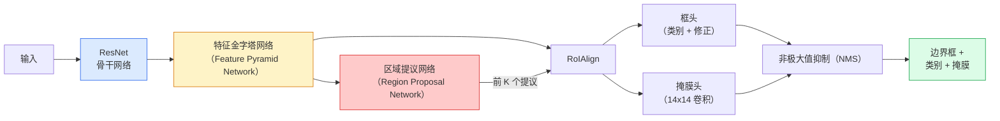

# 实例分割——Mask R-CNN

> 在 Faster R-CNN 检测器上添加一个微小的掩膜分支，就能实现实例分割。难点在于 RoIAlign，它比看起来要复杂得多。

**类型：** 构建 + 学习  
**语言：** Python  
**前置条件：** 阶段4 第6课（YOLO），阶段4 第7课（U-Net）  
**时间：** 约75分钟

## 学习目标

- 完整追溯 Mask R-CNN 架构：骨干网络（Backbone）、FPN、RPN、RoIAlign、框头（Box Head）、掩膜头（Mask Head）
- 从零实现 RoIAlign，并解释为什么不再使用 RoIPool
- 使用 torchvision 的 `maskrcnn_resnet50_fpn_v2` 预训练模型获得生产级实例掩膜，并正确读取其输出格式
- 通过替换框头和掩膜头并冻结骨干网络，在小规模自定义数据集上微调 Mask R-CNN

## 问题

语义分割（Semantic Segmentation）为每个类别生成一个掩膜。实例分割（Instance Segmentation）为每个对象生成一个掩膜，即使两个对象属于同一类别。计数独立个体、跨帧跟踪以及测量物体（比如墙上的每块砖、显微镜图像中的每个细胞）都需要实例分割。

Mask R-CNN（He 等人，2017）通过将实例分割重新定义为“检测+掩膜”解决了这个问题。这一设计非常简洁，以至于在接下来的五年里，几乎每一篇实例分割论文都是 Mask R-CNN 的变体，而 torchvision 的实现至今仍是中小规模数据集的生产级默认选择。

其中棘手的工程问题在于采样：如何从一个边界框（其角点不与像素边界对齐）中裁剪出固定尺寸的特征区域？如果处理不当，会导致平均精度（mAP）在所有 IoU 阈值上损失十分之几个点。RoIAlign 就是答案。

## 概念

### 架构



需要理解五个部分：

1. **骨干网络（Backbone）** —— 在 ImageNet 上训练的 ResNet-50 或 ResNet-101。生成步长分别为 4、8、16、32 的层级化特征图。
2. **FPN（特征金字塔网络）** —— 自上而下的通路加上侧向连接，使每一层都具有相同通道数 C 的语义丰富特征。检测时会根据物体大小选择相应 FPN 层级。
3. **RPN（区域提议网络）** —— 一个小的卷积头，在每个锚点位置预测“这里是否有物体？”以及“如何修正边界框？”。每张图像生成约 1000 个提议。
4. **RoIAlign** —— 从任意 FPN 层级的任意边界框中采样一个固定尺寸（例如 7x7）的特征块。采用双线性采样，不进行量化。
5. **头（Heads）** —— 一个两层的框头，用于修正边界框并选择类别；再加上一个小型卷积头，为每个提议输出一个 `28x28` 的二值掩膜。

### 为什么用 RoIAlign 而不是 RoIPool

原始的 Fast R-CNN 使用了 RoIPool，它将提议框分割成一个网格，取每个单元格内的最大特征值，并将所有坐标四舍五入为整数。这种舍入会导致特征图与输入像素坐标之间的偏差高达一个完整的特征图像素——在 224x224 图像上影响较小，但当特征图步长为 32 时是灾难性的。

```
RoIPool:
  框 (34.7, 51.3, 98.2, 142.9)
  四舍五入 -> (34, 51, 98, 142)
  分割网格 -> 对每个单元格边界四舍五入
  错位在每一步累积

RoIAlign:
  框 (34.7, 51.3, 98.2, 142.9)
  使用双线性插值在精确浮点坐标处采样
  任何地方都不进行四舍五入
```

RoIAlign 在 COCO 上无偿将掩膜 AP 提升了 3-4 个点。任何关注定位精度的检测器现在都使用它——包括 YOLOv7-seg、RT-DETR、Mask2Former 等。

### RPN 概述

在特征图的每个位置上，放置 K 个不同尺寸和形状的锚点框。为每个锚点预测一个物体性得分，以及一个回归偏移量，将锚点框修正为更合适的边界框。按得分保留前约 1000 个框，在 IoU 0.7 下应用 NMS，然后将幸存者交给头部。RPN 使用自身的迷你损失进行训练——其结构与第 6 课中的 YOLO 损失相同，只是只有两个类别（物体 / 无物体）。

### 掩膜头

对于每个提议（RoIAlign 之后），掩膜头是一个小型全卷积网络（FCN）：四个 3x3 卷积层，一个 2x 反卷积层，最后一个 1x1 卷积层产生 `num_classes` 个输出通道，分辨率为 `28x28`。只保留与预测类别相对应的通道，其余通道被忽略。这使掩膜预测与分类解耦。

将 28x28 的掩膜上采样到提议的原始像素尺寸，得到最终的二进制掩膜。

### 损失

Mask R-CNN 共有四个损失相加：

```
L = L_rpn_cls + L_rpn_box + L_box_cls + L_box_reg + L_mask
```

- `L_rpn_cls`, `L_rpn_box` —— RPN 提议的物体性得分和边界框回归。
- `L_box_cls` —— 头部分类器在（C+1）个类别（包括背景）上的交叉熵。
- `L_box_reg` —— 头部边界框修正的平滑 L1 损失。
- `L_mask` —— 28x28 掩膜输出的逐像素二值交叉熵。

每个损失都有自己的默认权重；torchvision 的实现将这些权重作为构造函数参数暴露出来。

### 输出格式

`torchvision.models.detection.maskrcnn_resnet50_fpn_v2` 返回一个字典列表，每张图像一个字典：

```
{
    "boxes":  (N, 4) 以像素坐标 (x1, y1, x2, y2) 表示，
    "labels": (N,) 类别 ID，0 = 背景，因此索引从 1 开始，
    "scores": (N,) 置信度分数，
    "masks":  (N, 1, H, W) 浮点型掩膜，值在 [0, 1] 之间——阈值为 0.5 可获得二值掩膜，
}
```

掩膜已经是全图像分辨率。28x28 的头部输出已在内部进行了上采样。

## 构建

### 步骤 1：从零实现 RoIAlign

这是 Mask R-CNN 中唯一一个通过代码比通过文字更容易理解的部分。

```python
import torch
import torch.nn.functional as F

def roi_align_single(feature, box, output_size=7, spatial_scale=1 / 16.0):
    """
    feature: (C, H, W) 单图像特征图
    box: (x1, y1, x2, y2) 原始图像像素坐标
    output_size: 输出网格边长（框头用7，掩膜头用14）
    spatial_scale: 特征图步长的倒数
    """
    C, H, W = feature.shape
    x1, y1, x2, y2 = [c * spatial_scale - 0.5 for c in box]
    bin_w = (x2 - x1) / output_size
    bin_h = (y2 - y1) / output_size

    grid_y = torch.linspace(y1 + bin_h / 2, y2 - bin_h / 2, output_size)
    grid_x = torch.linspace(x1 + bin_w / 2, x2 - bin_w / 2, output_size)
    yy, xx = torch.meshgrid(grid_y, grid_x, indexing="ij")

    gx = 2 * (xx + 0.5) / W - 1
    gy = 2 * (yy + 0.5) / H - 1
    grid = torch.stack([gx, gy], dim=-1).unsqueeze(0)
    sampled = F.grid_sample(feature.unsqueeze(0), grid, mode="bilinear",
                            align_corners=False)
    return sampled.squeeze(0)
```

每个数值都在双线性采样后的位置。没有四舍五入，没有量化，没有梯度中断。

### 步骤 2：与 torchvision 的 RoIAlign 对比

```python
from torchvision.ops import roi_align

feature = torch.randn(1, 16, 50, 50)
boxes = torch.tensor([[0, 10, 20, 100, 90]], dtype=torch.float32)  # (batch_idx, x1, y1, x2, y2)

ours = roi_align_single(feature[0], boxes[0, 1:].tolist(), output_size=7, spatial_scale=1/4)
theirs = roi_align(feature, boxes, output_size=(7, 7), spatial_scale=1/4, sampling_ratio=1, aligned=True)[0]

print(f"ours shape:   {tuple(ours.shape)}")
print(f"theirs shape: {tuple(theirs.shape)}")
print(f"max|diff|:    {(ours - theirs).abs().max().item():.3e}")
```

当 `sampling_ratio=1` 且 `aligned=True` 时，两者误差在 `1e-5` 以内。

### 步骤 3：加载预训练的 Mask R-CNN

```python
import torch
from torchvision.models.detection import maskrcnn_resnet50_fpn_v2, MaskRCNN_ResNet50_FPN_V2_Weights

model = maskrcnn_resnet50_fpn_v2(weights=MaskRCNN_ResNet50_FPN_V2_Weights.DEFAULT)
model.eval()
print(f"参数数量: {sum(p.numel() for p in model.parameters()):,}")
print(f"类别数（含背景）: {len(model.roi_heads.box_predictor.cls_score.out_features * [0])}")
```

4600 万参数，91 个类别（COCO）。第一个类别（ID 0）是背景；模型实际检测到的所有物体类别从 ID 1 开始。

### 步骤 4：运行推理

```python
with torch.no_grad():
    x = torch.randn(3, 400, 600)
    predictions = model([x])
p = predictions[0]
print(f"boxes:  {tuple(p['boxes'].shape)}")
print(f"labels: {tuple(p['labels'].shape)}")
print(f"scores: {tuple(p['scores'].shape)}")
print(f"masks:  {tuple(p['masks'].shape)}")
```

掩膜张量的形状为 `(N, 1, H, W)`。在 0.5 处阈值化得到每个物体的二值掩膜：

```python
binary_masks = (p['masks'] > 0.5).squeeze(1)  # (N, H, W) 布尔型
```

### 步骤 5：为自定义类别数更换头部

常见的微调策略：复用骨干网络、FPN 和 RPN；更换两个分类器头部。

```python
from torchvision.models.detection.faster_rcnn import FastRCNNPredictor
from torchvision.models.detection.mask_rcnn import MaskRCNNPredictor

def build_custom_maskrcnn(num_classes):
    model = maskrcnn_resnet50_fpn_v2(weights=MaskRCNN_ResNet50_FPN_V2_Weights.DEFAULT)
    in_features = model.roi_heads.box_predictor.cls_score.in_features
    model.roi_heads.box_predictor = FastRCNNPredictor(in_features, num_classes)
    in_features_mask = model.roi_heads.mask_predictor.conv5_mask.in_channels
    hidden_layer = 256
    model.roi_heads.mask_predictor = MaskRCNNPredictor(in_features_mask, hidden_layer, num_classes)
    return model

custom = build_custom_maskrcnn(num_classes=5)
print(f"custom cls_score.out_features: {custom.roi_heads.box_predictor.cls_score.out_features}")
```

`num_classes` 必须包含背景类，因此一个包含 4 个物体类别的数据集应使用 `num_classes=5`。

### 步骤 6：冻结不需要训练的部分

在小型数据集上，冻结骨干网络和 FPN。只有 RPN 的物体性得分和回归以及两个头部进行学习。

```python
def freeze_backbone_and_fpn(model):
    # torchvision Mask R-CNN 将 FPN 打包在 `model.backbone` 内（作为
    # `model.backbone.fpn`），因此遍历 `model.backbone.parameters()` 会覆盖
    # ResNet 特征层和 FPN 的侧向/输出卷积。
    for p in model.backbone.parameters():
        p.requires_grad = False
    return model

custom = freeze_backbone_and_fpn(custom)
trainable = sum(p.numel() for p in custom.parameters() if p.requires_grad)
print(f"冻结后可训练参数: {trainable:,}")
```

在 500 张图像的数据集上，这决定了是收敛还是过拟合。

## 使用

torchvision 中 Mask R-CNN 的完整训练循环大约 40 行，在不同任务之间基本不变——只需更换数据集即可开始。

```python
def train_step(model, images, targets, optimizer):
    model.train()
    loss_dict = model(images, targets)
    losses = sum(loss for loss in loss_dict.values())
    optimizer.zero_grad()
    losses.backward()
    optimizer.step()
    return {k: v.item() for k, v in loss_dict.items()}
```

`targets` 列表必须包含每张图像的字典，包含 `boxes`、`labels` 和 `masks`（以 `(num_instances, H, W)` 二值张量形式）。模型在训练时返回一个包含四个损失的字典，在评估时返回预测列表，具体行为由 `model.training` 决定。

`pycocotools` 评估器可以同时为边界框和掩膜计算 mAP@IoU=0.5:0.95；你需要这两个数值来判断框头或掩膜头哪个是瓶颈。

## 部署

本课程产出：

- `outputs/prompt-instance-vs-semantic-router.md` —— 一个提示，询问三个问题并选择实例分割 vs 语义分割 vs 全景分割，以及一开始应使用的具体模型。
- `outputs/skill-mask-rcnn-head-swapper.md` —— 一项技能，给定新的 `num_classes`，可生成 10 行代码用于更换任意 torchvision 检测模型的头部。

## 练习

1. **(简单)** 在 100 个随机边界框上验证你的 RoIAlign 与 `torchvision.ops.roi_align` 的一致性。报告最大绝对差异。同时运行 RoIPool（2017 年前的行为），展示其在靠近边界的框上大约偏差 1-2 个特征图像素。
2. **(中等)** 在一个包含 50 张图像的自定义数据集（任意两个类别：气球、鱼、坑洞、标志）上微调 `maskrcnn_resnet50_fpn_v2`。冻结骨干网络，训练 20 个 epoch，报告掩膜 AP@0.5。
3. **(困难)** 将 Mask R-CNN 的掩膜头替换为输出 56x56 而非 28x28 的版本。测量替换前后的 mAP@IoU=0.75。解释增益（或没有增益）为何符合预期的边界精度/内存权衡。

## 关键术语

| 术语 | 人们常说的意思 | 实际含义 |
|------|----------------|----------------------|
| Mask R-CNN | "检测加掩膜" | Faster R-CNN + 一个小型全卷积网络头部，为每个提议的每个类别预测一个 28x28 掩膜 |
| FPN | "特征金字塔" | 自上而下通路 + 侧向连接，使每个步长层级都具有相同通道数 C 的语义丰富特征 |
| RPN | "区域提议器" | 一个小的卷积头，每张图像生成约 1000 个有/