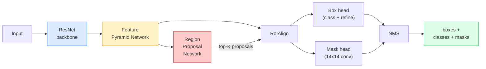

# 08 · 实例分割 — Mask R-CNN

> 在 Faster R-CNN 检测器上加一个微小的掩码分支，你就得到了实例分割。难点在 RoIAlign，而它比看上去要难。

**类型：** 构建 + 学习
**语言：** Python
**前置：** 第 4 阶段第 06 课（YOLO）、第 4 阶段第 07 课（U-Net）
**时长：** 约 75 分钟

## 学习目标

- 端到端梳理 Mask R-CNN 架构：骨干网络（backbone）、FPN、RPN、RoIAlign、检测框头（box head）、掩码头（mask head）
- 从零实现 RoIAlign，并解释为什么 RoIPool 已被淘汰
- 使用 torchvision 的 `maskrcnn_resnet50_fpn_v2` 预训练模型获取生产级实例掩码，并正确解读其输出格式
- 通过替换检测框头与掩码头、冻结骨干网络的方式，在小型自定义数据集上微调 Mask R-CNN

## 问题所在

「语义分割（semantic segmentation）」为每个类别给出一张掩码。「实例分割（instance segmentation）」为每个物体给出一张掩码，即使两个物体属于同一类别也是如此。统计个体数量、跨帧追踪、以及测量物体（墙上每块砖的边界框、显微图像中的每个细胞），都需要实例分割。

Mask R-CNN（He et al., 2017）把实例分割重新表述为「检测加一张掩码」，从而解决了这个问题。这一设计如此简洁，以至于在此后五年里，几乎每篇实例分割论文都是 Mask R-CNN 的变体，而 torchvision 的实现至今仍是中小型数据集的生产默认选择。

真正困难的工程问题是采样：当一个候选框的角点不与像素边界对齐时，你如何从中裁剪出一块固定尺寸的特征区域？这一步出错，处处都会损失零点几个 mAP。RoIAlign 就是答案。

## 核心概念

### 架构



需要理解的五个部件：

1. **骨干网络（Backbone）** —— 在 ImageNet 上训练的 ResNet-50 或 ResNet-101。产出一组步长（stride）分别为 4、8、16、32 的层级特征图。
2. **FPN（特征金字塔网络，Feature Pyramid Network）** —— 自顶向下加横向连接，让每一层都拥有 C 个通道、语义丰富的特征。检测时会查询与物体尺寸相匹配的那一层 FPN。
3. **RPN（区域候选网络，Region Proposal Network）** —— 一个小型卷积头，在每个锚点（anchor）位置预测「这里有没有物体？」以及「该如何微调这个框？」。每张图产出约 1000 个候选框。
4. **RoIAlign** —— 从任意 FPN 层上的任意框中采样出固定尺寸（例如 7x7）的特征块。双线性采样，无量化。
5. **检测头（Heads）** —— 一个两层的检测框头，负责微调框并选出类别；外加一个小型卷积头，为每个候选框输出一张 `28x28` 的二值掩码。

### 为什么用 RoIAlign，而非 RoIPool

最初的 Fast R-CNN 使用 RoIPool：把候选框切成网格，取每个网格单元内的最大特征值，并把所有坐标四舍五入为整数。这种取整会让特征图相对输入像素坐标错位最多达一整个特征图像素——在 224x224 的图像上影响很小，但当特征图步长为 32 时则是灾难性的。

```
RoIPool:
  box (34.7, 51.3, 98.2, 142.9)
  round -> (34, 51, 98, 142)
  split grid -> round each cell boundary
  misalignment accumulates at every step

RoIAlign:
  box (34.7, 51.3, 98.2, 142.9)
  sample at exact float coordinates using bilinear interpolation
  no rounding anywhere
```

RoIAlign 在 COCO 上能白白提升 3-4 个点的掩码 AP。如今每个在意定位精度的检测器都在用它——YOLOv7 seg、RT-DETR、Mask2Former 概莫能外。

### 一段话讲清 RPN

在特征图的每个位置，放置 K 个不同尺寸与形状的锚框（anchor box）。为每个锚框预测一个物体性（objectness）分数，以及一个回归偏移量，用以把锚框调整成更贴合的框。按分数保留排名前约 1000 的框，在 IoU 0.7 处做 NMS，再把幸存者交给各检测头。RPN 用自己的小损失函数训练——结构与第 6 课的 YOLO 损失相同，只是只有两个类别（有物体 / 无物体）。

### 掩码头

对每个候选框（经 RoIAlign 之后），掩码头是一个微型 FCN：四个 3x3 卷积、一个 2 倍反卷积（deconv），最后一个 1x1 卷积在 `28x28` 分辨率上产出 `num_classes` 个输出通道。只保留与预测类别对应的那个通道，其余忽略。这样就把掩码预测与分类解耦了。

将 28x28 的掩码上采样到候选框的原始像素尺寸，即得到最终的二值掩码。

### 损失函数

Mask R-CNN 把四项损失加在一起：

```
L = L_rpn_cls + L_rpn_box + L_box_cls + L_box_reg + L_mask
```

- `L_rpn_cls`、`L_rpn_box` —— RPN 候选框的物体性损失 + 框回归损失。
- `L_box_cls` —— 检测头分类器在 (C+1) 个类别（含背景）上的交叉熵损失。
- `L_box_reg` —— 检测头框微调的 smooth L1 损失。
- `L_mask` —— 28x28 掩码输出上的逐像素二值交叉熵损失。

每项损失都有自己的默认权重；torchvision 的实现把它们作为构造函数参数对外暴露。

### 输出格式

`torchvision.models.detection.maskrcnn_resnet50_fpn_v2` 返回一个字典列表，每张图对应一个字典：

```
{
    "boxes":  (N, 4) in (x1, y1, x2, y2) pixel coordinates,
    "labels": (N,) class IDs, 0 = background so indices are 1-based,
    "scores": (N,) confidence scores,
    "masks":  (N, 1, H, W) float masks in [0, 1] — threshold at 0.5 for binary,
}
```

掩码已经是完整图像分辨率。28x28 的检测头输出已在内部完成上采样。

## 动手构建

### 第 1 步：从零实现 RoIAlign

这是 Mask R-CNN 中唯一一个用代码比用文字更容易理解的部件。

```python
import torch
import torch.nn.functional as F

def roi_align_single(feature, box, output_size=7, spatial_scale=1 / 16.0):
    """
    feature: (C, H, W) 单张图像的特征图
    box: (x1, y1, x2, y2)，使用原始图像的像素坐标
    output_size: 输出网格的边长（检测框头取 7，掩码头取 14）
    spatial_scale: 特征图步长的倒数
    """
    C, H, W = feature.shape
    x1, y1, x2, y2 = [c * spatial_scale - 0.5 for c in box]
    bin_w = (x2 - x1) / output_size
    bin_h = (y2 - y1) / output_size

    grid_y = torch.linspace(y1 + bin_h / 2, y2 - bin_h / 2, output_size)
    grid_x = torch.linspace(x1 + bin_w / 2, x2 - bin_w / 2, output_size)
    yy, xx = torch.meshgrid(grid_y, grid_x, indexing="ij")

    gx = 2 * (xx + 0.5) / W - 1
    gy = 2 * (yy + 0.5) / H - 1
    grid = torch.stack([gx, gy], dim=-1).unsqueeze(0)
    sampled = F.grid_sample(feature.unsqueeze(0), grid, mode="bilinear",
                            align_corners=False)
    return sampled.squeeze(0)
```

每个数值都取自一个双线性采样的位置。没有取整，没有量化，没有丢失的梯度。

### 第 2 步：与 torchvision 的 RoIAlign 对比

```python
from torchvision.ops import roi_align

feature = torch.randn(1, 16, 50, 50)
boxes = torch.tensor([[0, 10, 20, 100, 90]], dtype=torch.float32)  # (batch_idx, x1, y1, x2, y2)

ours = roi_align_single(feature[0], boxes[0, 1:].tolist(), output_size=7, spatial_scale=1/4)
theirs = roi_align(feature, boxes, output_size=(7, 7), spatial_scale=1/4, sampling_ratio=1, aligned=True)[0]

print(f"shape ours:   {tuple(ours.shape)}")
print(f"shape theirs: {tuple(theirs.shape)}")
print(f"max|diff|:    {(ours - theirs).abs().max().item():.3e}")
```

设置 `sampling_ratio=1` 且 `aligned=True` 时，两者的差异在 `1e-5` 以内。

### 第 3 步：加载预训练的 Mask R-CNN

```python
import torch
from torchvision.models.detection import maskrcnn_resnet50_fpn_v2, MaskRCNN_ResNet50_FPN_V2_Weights

model = maskrcnn_resnet50_fpn_v2(weights=MaskRCNN_ResNet50_FPN_V2_Weights.DEFAULT)
model.eval()
print(f"params: {sum(p.numel() for p in model.parameters()):,}")
print(f"classes (including background): {len(model.roi_heads.box_predictor.cls_score.out_features * [0])}")
```

4600 万参数，91 个类别（COCO）。第一个类别（id 0）是背景；模型真正检测的目标从 id 1 开始。

### 第 4 步：运行推理

```python
with torch.no_grad():
    x = torch.randn(3, 400, 600)
    predictions = model([x])
p = predictions[0]
print(f"boxes:  {tuple(p['boxes'].shape)}")
print(f"labels: {tuple(p['labels'].shape)}")
print(f"scores: {tuple(p['scores'].shape)}")
print(f"masks:  {tuple(p['masks'].shape)}")
```

掩码张量的形状是 `(N, 1, H, W)`。以 0.5 为阈值即可为每个物体得到一张二值掩码：

```python
binary_masks = (p['masks'] > 0.5).squeeze(1)  # (N, H, W) 布尔型
```

### 第 5 步：为自定义类别数替换检测头

常见的微调套路：复用骨干网络、FPN 和 RPN；替换两个分类检测头。

```python
from torchvision.models.detection.faster_rcnn import FastRCNNPredictor
from torchvision.models.detection.mask_rcnn import MaskRCNNPredictor

def build_custom_maskrcnn(num_classes):
    model = maskrcnn_resnet50_fpn_v2(weights=MaskRCNN_ResNet50_FPN_V2_Weights.DEFAULT)
    in_features = model.roi_heads.box_predictor.cls_score.in_features
    model.roi_heads.box_predictor = FastRCNNPredictor(in_features, num_classes)
    in_features_mask = model.roi_heads.mask_predictor.conv5_mask.in_channels
    hidden_layer = 256
    model.roi_heads.mask_predictor = MaskRCNNPredictor(in_features_mask, hidden_layer, num_classes)
    return model

custom = build_custom_maskrcnn(num_classes=5)
print(f"custom cls_score.out_features: {custom.roi_heads.box_predictor.cls_score.out_features}")
```

`num_classes` 必须包含背景类，因此一个有 4 个物体类别的数据集要用 `num_classes=5`。

### 第 6 步：冻结无需训练的部分

在小型数据集上，冻结骨干网络和 FPN。只让 RPN 的物体性 + 回归，以及两个检测头进行学习。

```python
def freeze_backbone_and_fpn(model):
    # torchvision 的 Mask R-CNN 把 FPN 打包在 `model.backbone` 里（即
    # `model.backbone.fpn`），所以遍历 `model.backbone.parameters()` 会同时
    # 覆盖 ResNet 特征层和 FPN 的横向/输出卷积。
    for p in model.backbone.parameters():
        p.requires_grad = False
    return model

custom = freeze_backbone_and_fpn(custom)
trainable = sum(p.numel() for p in custom.parameters() if p.requires_grad)
print(f"trainable after freeze: {trainable:,}")
```

在 500 张图像的数据集上，这一步是收敛与过拟合之间的分水岭。

## 实践运用

torchvision 中 Mask R-CNN 的完整训练循环只有 40 行，且在不同任务间没有实质性变化——换数据集即可上手。

```python
def train_step(model, images, targets, optimizer):
    model.train()
    loss_dict = model(images, targets)
    losses = sum(loss for loss in loss_dict.values())
    optimizer.zero_grad()
    losses.backward()
    optimizer.step()
    return {k: v.item() for k, v in loss_dict.items()}
```

`targets` 列表必须为每张图提供一个字典，包含 `boxes`、`labels` 和 `masks`（形如 `(num_instances, H, W)` 的二值张量）。训练时模型返回一个含四项损失的字典，评估时返回一个预测列表，二者以 `model.training` 为分支依据。

`pycocotools` 评估器会同时为检测框和掩码产出 mAP@IoU=0.5:0.95；你需要这两个数字才能判断瓶颈究竟在检测框头还是掩码头。

## 交付落地

本课产出：

- `outputs/prompt-instance-vs-semantic-router.md` —— 一个提示词，它会问三个问题，从而在实例分割、语义分割、全景分割（panoptic）之间做出选择，并给出建议起步的具体模型。
- `outputs/skill-mask-rcnn-head-swapper.md` —— 一个 skill，给定新的 `num_classes`，它就能为任意 torchvision 检测模型生成那 10 行替换检测头的代码。

## 练习

1. **（简单）** 在 100 个随机框上，将你的 RoIAlign 与 `torchvision.ops.roi_align` 进行对比，报告最大绝对差异。同时跑一遍 RoIPool（2017 年前的行为），并展示它在靠近边界的框上会偏离约 1-2 个特征图像素。
2. **（中等）** 在一个 50 张图像的自定义数据集上微调 `maskrcnn_resnet50_fpn_v2`（任选两个类别：气球、鱼、坑洼、logo）。冻结骨干网络，训练 20 个 epoch，报告 mask AP@0.5。
3. **（困难）** 把 Mask R-CNN 的掩码头替换为在 56x56（而非 28x28）分辨率上预测的版本。测量替换前后的 mAP@IoU=0.75。解释为什么增益（或没有增益）符合预期中的「边界精度 / 内存」权衡。

## 关键术语

| 术语 | 人们怎么说 | 它实际指什么 |
|------|----------------|----------------------|
| Mask R-CNN | 「检测加掩码」 | Faster R-CNN + 一个小型 FCN 头，为每个候选框、每个类别预测一张 28x28 的掩码 |
| FPN | 「特征金字塔」 | 自顶向下加横向连接，让每个步长层级都拥有 C 个通道、语义丰富的特征 |
| RPN | 「区域候选器」 | 一个小型卷积头，每张图产出约 1000 个「有物体/无物体」候选框 |
| RoIAlign | 「不取整裁剪」 | 从任意浮点坐标的框中双线性采样出固定尺寸的特征网格 |
| RoIPool | 「2017 年前的裁剪」 | 用途与 RoIAlign 相同，但会对框坐标取整；已过时 |
| Mask AP | 「实例 mAP」 | 用掩码 IoU（而非框 IoU）计算的平均精度；COCO 实例分割指标 |
| Binary mask head（二值掩码头） | 「按类别掩码」 | 为每个候选框、每个类别预测一张二值掩码；只保留预测类别对应的那个通道 |
| Background class（背景类） | 「类别 0」 | 兜底的「无物体」类别；真实类别的索引从 1 开始 |

## 延伸阅读

- [Mask R-CNN (He et al., 2017)](https://arxiv.org/abs/1703.06870) —— 原论文；第 3 节关于 RoIAlign 的部分是必读的关键
- [FPN: Feature Pyramid Networks (Lin et al., 2017)](https://arxiv.org/abs/1612.03144) —— FPN 论文；每个现代检测器都在用它
- [torchvision Mask R-CNN tutorial](https://pytorch.org/tutorials/intermediate/torchvision_tutorial.html) —— 微调循环的参考实现
- [Detectron2 model zoo](https://github.com/facebookresearch/detectron2/blob/main/MODEL_ZOO.md) —— 几乎涵盖每种检测与分割变体的生产级实现，附带训练好的权重
