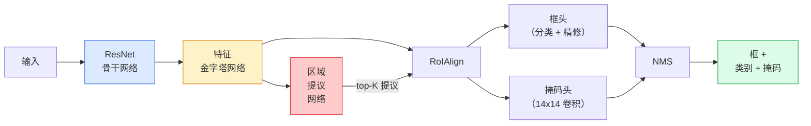

# 实例分割 —— Mask R-CNN

> 译注：本文译自同目录 [`en.md`](./en.md)。术语遵循仓根 [TRANSLATION_GUIDE.md](../../../../TRANSLATION_GUIDE.md)。

> 给一个 Faster R-CNN 检测器加上一个迷你 mask 分支，你就有了实例分割。难点在 RoIAlign，比看上去要难。

**Type:** Build + Learn
**Languages:** Python
**Prerequisites:** Phase 4 Lesson 06 (YOLO), Phase 4 Lesson 07 (U-Net)
**Time:** ~75 minutes

## 学习目标（Learning Objectives）

- 端到端理清 Mask R-CNN 的架构：backbone、FPN、RPN、RoIAlign、box head、mask head
- 从零实现 RoIAlign，并讲清楚为什么 RoIPool 已经被淘汰
- 使用 torchvision 的 `maskrcnn_resnet50_fpn_v2` 预训练模型生成生产级实例 mask，并正确读取它的输出格式
- 在小型自定义数据集上微调 Mask R-CNN：替换 box head 和 mask head，同时冻结 backbone

## 问题（The Problem）

语义分割（semantic segmentation）给你的是每个类别一张 mask；实例分割（instance segmentation）给你的是每个物体一张 mask，哪怕两个物体属于同一类别。统计个体数量、跨帧追踪、做测量（一面墙上每块砖的 bounding box，显微图像中每个细胞），全都需要实例分割。

Mask R-CNN（He et al., 2017）的解法，是把实例分割重新定义为「检测 + 一张 mask」。这个设计太干净了，以至于在之后的五年里几乎所有实例分割论文都是 Mask R-CNN 的变体；torchvision 的实现至今仍是中小数据集上的生产默认。

真正的工程难题在采样：当一个 proposal box 的角点不落在像素边界上时，你怎么从特征图里裁出一块固定大小的特征区域？这一步搞错，到处都会损失零点几个 mAP。RoIAlign 就是答案。

## 概念（The Concept）

### 架构（The architecture）



要理解的五块拼图：

1. **Backbone** —— 在 ImageNet 上预训练的 ResNet-50 或 ResNet-101，输出 stride 为 4、8、16、32 的多层特征图。
2. **FPN（Feature Pyramid Network，特征金字塔网络）** —— 自顶向下加横向连接，让每一层都拥有 C 个通道的语义丰富特征。检测时，按物体大小去查询对应的 FPN 层。
3. **RPN（Region Proposal Network，区域提议网络）** —— 一个小的卷积 head，在每个 anchor 位置预测「这里是否有物体？」和「应该怎么调整框？」。每张图大约产出 1000 个 proposal。
4. **RoIAlign** —— 从任一 FPN 层的任一 box 中采样出固定大小（如 7×7）的特征 patch。双线性采样，零量化。
5. **Heads** —— 两层的 box head 用于精修框并选类别，加一个小卷积 head 输出每个 proposal 的 `28×28` 二值 mask。

### 为什么用 RoIAlign 而不是 RoIPool（Why RoIAlign, not RoIPool）

最早的 Fast R-CNN 用 RoIPool：把 proposal box 切成网格，每个网格里取最大特征，所有坐标都四舍五入到整数。这个取整最多会让特征图与输入像素错开整整一个特征图像素 —— 在 224×224 的图上不算什么，但当特征图 stride 为 32 时就是灾难。

```
RoIPool:
  box (34.7, 51.3, 98.2, 142.9)
  round -> (34, 51, 98, 142)
  split grid -> round each cell boundary
  misalignment accumulates at every step

RoIAlign:
  box (34.7, 51.3, 98.2, 142.9)
  sample at exact float coordinates using bilinear interpolation
  no rounding anywhere
```

RoIAlign 在 COCO 上无成本地把 mask AP 提升 3–4 个点。如今每一个在意定位精度的检测器都用它 —— YOLOv7 seg、RT-DETR、Mask2Former 都一样。

### 一段话讲清 RPN（The RPN in one paragraph）

在特征图的每个位置上，放置 K 个不同尺寸和形状的 anchor box。为每个 anchor 预测一个 objectness 分数，外加一个回归偏移量，把 anchor 调成更贴合物体的框。按分数取前约 1,000 个框，在 IoU 0.7 上做 NMS，然后把幸存者交给 heads。RPN 用自己的小 loss 训练 —— 结构和第 6 课的 YOLO loss 一样，只不过只有两类（有物体 / 无物体）。

### Mask head（The mask head）

每个 proposal 经过 RoIAlign 之后，mask head 是一个小型 FCN：四个 3×3 卷积、一个 2 倍反卷积、最后一个 1×1 卷积，在 `28×28` 分辨率上输出 `num_classes` 个通道。只保留对应「预测类别」的那个通道，其余忽略。这样就把 mask 预测和分类解耦了。

把 28×28 的 mask 上采样到 proposal 在原图上的像素尺寸，得到最终的二值 mask。

### 损失（Losses）

Mask R-CNN 把四个 loss 加在一起：

```
L = L_rpn_cls + L_rpn_box + L_box_cls + L_box_reg + L_mask
```

- `L_rpn_cls`、`L_rpn_box` —— RPN proposal 的 objectness + 框回归。
- `L_box_cls` —— head 分类器在 (C+1) 个类别（含背景）上的交叉熵。
- `L_box_reg` —— head 框精修上的 smooth L1。
- `L_mask` —— 28×28 mask 输出上的逐像素二元交叉熵。

每个 loss 都有自己的默认权重；torchvision 的实现把它们暴露为构造函数参数。

### 输出格式（Output format）

`torchvision.models.detection.maskrcnn_resnet50_fpn_v2` 返回一个 dict 列表，每张图一项：

```
{
    "boxes":  (N, 4) in (x1, y1, x2, y2) pixel coordinates,
    "labels": (N,) class IDs, 0 = background so indices are 1-based,
    "scores": (N,) confidence scores,
    "masks":  (N, 1, H, W) float masks in [0, 1] — threshold at 0.5 for binary,
}
```

mask 已经是整图分辨率了。28×28 的 head 输出在内部已被上采样。

## 动手实现（Build It）

### Step 1：从零实现 RoIAlign

这是 Mask R-CNN 里少有的、看代码比看文字还容易理解的组件。

```python
import torch
import torch.nn.functional as F

def roi_align_single(feature, box, output_size=7, spatial_scale=1 / 16.0):
    """
    feature: (C, H, W) single-image feature map
    box: (x1, y1, x2, y2) in original image pixel coordinates
    output_size: side of the output grid (7 for box head, 14 for mask head)
    spatial_scale: reciprocal of the feature map stride
    """
    C, H, W = feature.shape
    x1, y1, x2, y2 = [c * spatial_scale - 0.5 for c in box]
    bin_w = (x2 - x1) / output_size
    bin_h = (y2 - y1) / output_size

    grid_y = torch.linspace(y1 + bin_h / 2, y2 - bin_h / 2, output_size)
    grid_x = torch.linspace(x1 + bin_w / 2, x2 - bin_w / 2, output_size)
    yy, xx = torch.meshgrid(grid_y, grid_x, indexing="ij")

    gx = 2 * (xx + 0.5) / W - 1
    gy = 2 * (yy + 0.5) / H - 1
    grid = torch.stack([gx, gy], dim=-1).unsqueeze(0)
    sampled = F.grid_sample(feature.unsqueeze(0), grid, mode="bilinear",
                            align_corners=False)
    return sampled.squeeze(0)
```

每个数都来自双线性采样的位置。无取整、无量化、无丢失梯度。

### Step 2：与 torchvision 的 RoIAlign 对比

```python
from torchvision.ops import roi_align

feature = torch.randn(1, 16, 50, 50)
boxes = torch.tensor([[0, 10, 20, 100, 90]], dtype=torch.float32)  # (batch_idx, x1, y1, x2, y2)

ours = roi_align_single(feature[0], boxes[0, 1:].tolist(), output_size=7, spatial_scale=1/4)
theirs = roi_align(feature, boxes, output_size=(7, 7), spatial_scale=1/4, sampling_ratio=1, aligned=True)[0]

print(f"shape ours:   {tuple(ours.shape)}")
print(f"shape theirs: {tuple(theirs.shape)}")
print(f"max|diff|:    {(ours - theirs).abs().max().item():.3e}")
```

设 `sampling_ratio=1`、`aligned=True` 时，两者的差异在 `1e-5` 以内。

### Step 3：加载预训练 Mask R-CNN

```python
import torch
from torchvision.models.detection import maskrcnn_resnet50_fpn_v2, MaskRCNN_ResNet50_FPN_V2_Weights

model = maskrcnn_resnet50_fpn_v2(weights=MaskRCNN_ResNet50_FPN_V2_Weights.DEFAULT)
model.eval()
print(f"params: {sum(p.numel() for p in model.parameters()):,}")
print(f"classes (including background): {len(model.roi_heads.box_predictor.cls_score.out_features * [0])}")
```

4600 万参数，91 类（COCO）。第一类（id 0）是背景；模型真正会去检测的类别从 id 1 开始。

### Step 4：跑推理

```python
with torch.no_grad():
    x = torch.randn(3, 400, 600)
    predictions = model([x])
p = predictions[0]
print(f"boxes:  {tuple(p['boxes'].shape)}")
print(f"labels: {tuple(p['labels'].shape)}")
print(f"scores: {tuple(p['scores'].shape)}")
print(f"masks:  {tuple(p['masks'].shape)}")
```

mask 张量的 shape 是 `(N, 1, H, W)`。在 0.5 处取阈值，得到每个物体的二值 mask：

```python
binary_masks = (p['masks'] > 0.5).squeeze(1)  # (N, H, W) boolean
```

### Step 5：替换 head 适配自定义类别数

常见的微调配方：复用 backbone、FPN 和 RPN，替换两个分类 head。

```python
from torchvision.models.detection.faster_rcnn import FastRCNNPredictor
from torchvision.models.detection.mask_rcnn import MaskRCNNPredictor

def build_custom_maskrcnn(num_classes):
    model = maskrcnn_resnet50_fpn_v2(weights=MaskRCNN_ResNet50_FPN_V2_Weights.DEFAULT)
    in_features = model.roi_heads.box_predictor.cls_score.in_features
    model.roi_heads.box_predictor = FastRCNNPredictor(in_features, num_classes)
    in_features_mask = model.roi_heads.mask_predictor.conv5_mask.in_channels
    hidden_layer = 256
    model.roi_heads.mask_predictor = MaskRCNNPredictor(in_features_mask, hidden_layer, num_classes)
    return model

custom = build_custom_maskrcnn(num_classes=5)
print(f"custom cls_score.out_features: {custom.roi_heads.box_predictor.cls_score.out_features}")
```

`num_classes` 必须把背景类一起算上，因此一个有 4 类物体的数据集应该用 `num_classes=5`。

### Step 6：冻结不需要训练的部分

在小数据集上，冻结 backbone 和 FPN，只让 RPN 的 objectness + 回归和两个 head 学习。

```python
def freeze_backbone_and_fpn(model):
    # torchvision Mask R-CNN packs the FPN inside `model.backbone` (as
    # `model.backbone.fpn`), so iterating `model.backbone.parameters()` covers
    # both the ResNet feature layers and the FPN lateral/output convs.
    for p in model.backbone.parameters():
        p.requires_grad = False
    return model

custom = freeze_backbone_and_fpn(custom)
trainable = sum(p.numel() for p in custom.parameters() if p.requires_grad)
print(f"trainable after freeze: {trainable:,}")
```

在 500 张图的数据集上，这一步决定了你是收敛还是过拟合。

## 用起来（Use It）

torchvision 里 Mask R-CNN 的完整训练循环只有 40 行，并且在不同任务之间几乎不需要改 —— 换个数据集就能跑。

```python
def train_step(model, images, targets, optimizer):
    model.train()
    loss_dict = model(images, targets)
    losses = sum(loss for loss in loss_dict.values())
    optimizer.zero_grad()
    losses.backward()
    optimizer.step()
    return {k: v.item() for k, v in loss_dict.items()}
```

`targets` 列表中每张图对应一个 dict，要包含 `boxes`、`labels` 和 `masks`（形状为 `(num_instances, H, W)` 的二值张量）。模型在训练时返回四个 loss 的 dict，在 eval 时返回预测列表，根据 `model.training` 自动切换。

`pycocotools` 的评估器会同时给出 box 和 mask 的 mAP@IoU=0.5:0.95；你两个数都得看，才知道瓶颈在 box head 还是 mask head。

## 上线部署（Ship It）

本课产出：

- `outputs/prompt-instance-vs-semantic-router.md` —— 一个 prompt，问三个问题然后在实例 / 语义 / 全景分割之间做选择，并给出该从哪个具体模型起步。
- `outputs/skill-mask-rcnn-head-swapper.md` —— 一个 skill，给定新的 `num_classes`，自动生成在任何 torchvision 检测模型上替换 head 的 10 行代码。

## 练习（Exercises）

1. **（简单）** 用 100 个随机框对照 `torchvision.ops.roi_align` 验证你的 RoIAlign 实现，报告最大绝对差。再跑一遍 RoIPool（2017 之前的做法），展示在贴近边界的框上它会偏差大约 1–2 个特征图像素。
2. **（中等）** 在一个 50 张图的自定义数据集上微调 `maskrcnn_resnet50_fpn_v2`（任选两类：气球、鱼、坑洞、logo）。冻结 backbone，训练 20 个 epoch，报告 mask AP@0.5。
3. **（困难）** 把 Mask R-CNN 的 mask head 换成在 56×56 而不是 28×28 上预测的版本。比较替换前后的 mAP@IoU=0.75。解释为什么提升（或没提升）符合「边界精度 / 内存」的预期权衡。

## 关键术语（Key Terms）

| 术语 | 大家通常怎么说 | 它实际是什么 |
|------|----------------|----------------------|
| Mask R-CNN | 「检测加 mask」 | Faster R-CNN + 一个小型 FCN head，每个 proposal、每个类别预测一张 28×28 mask |
| FPN | 「特征金字塔」 | 自顶向下 + 横向连接，让每个 stride 层都拥有 C 个通道的语义丰富特征 |
| RPN | 「区域提议器」 | 一个小卷积 head，每张图产出约 1000 个「有/无物体」的 proposal |
| RoIAlign | 「不取整的裁剪」 | 在任意浮点坐标的框上双线性采样固定大小的特征网格 |
| RoIPool | 「2017 之前的裁剪」 | 与 RoIAlign 用途相同，但会对框坐标取整；已淘汰 |
| Mask AP | 「实例 mAP」 | 用 mask IoU 而非 box IoU 算的 average precision；COCO 实例分割的指标 |
| Binary mask head | 「按类别 mask」 | 每个 proposal 对每个类别预测一张二值 mask；只保留预测类别那一通道 |
| Background class | 「第 0 类」 | 兜底的「无物体」类别；真实类别索引从 1 开始 |

## 延伸阅读（Further Reading）

- [Mask R-CNN (He et al., 2017)](https://arxiv.org/abs/1703.06870) —— 原论文；第 3 节关于 RoIAlign 的部分必读
- [FPN: Feature Pyramid Networks (Lin et al., 2017)](https://arxiv.org/abs/1612.03144) —— FPN 论文；现代检测器无一不用
- [torchvision Mask R-CNN tutorial](https://pytorch.org/tutorials/intermediate/torchvision_tutorial.html) —— 微调循环的参考实现
- [Detectron2 model zoo](https://github.com/facebookresearch/detectron2/blob/main/MODEL_ZOO.md) —— 几乎覆盖所有检测和分割变体的生产实现，附训练好的权重
