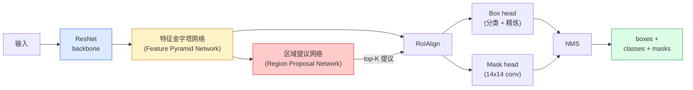

# 实例分割 — Mask R-CNN

> 向Faster R-CNN检测器添加一个小型掩码分支，你就得到了实例分割。难点在于RoIAlign，它比看起来更难。

**类型：** 构建+学习
**语言：** Python
**前置条件：** 阶段4 第06课（YOLO），阶段4 第07课（U-Net）
**时间：** ~75分钟

## 学习目标

- 端到端追踪Mask R-CNN架构：backbone、FPN、RPN、RoIAlign、box head、mask head
- 从零实现RoIAlign并解释为什么RoIPool不再使用
- 使用torchvision `maskrcnn_resnet50_fpn_v2`预训练模型获取生产级实例掩码，并正确读取其输出格式
- 通过替换box和mask heads并保持backbone冻结，在小型自定义数据集上微调Mask R-CNN

## 问题

语义分割为每个类别提供一个掩码。实例分割为每个物体提供一个掩码，即使两个物体共享一个类别。计数个体、跨帧跟踪以及测量事物（墙中每块砖的边界框、显微镜图像中每个细胞）都需要实例分割。

Mask R-CNN（He等人，2017）通过将实例分割重构为检测加掩码来解决这个问题。这个设计如此干净，以至于在接下来的五年中，几乎每篇实例分割论文都是Mask R-CNN的变体，而torchvision实现仍然是中小型数据集的生产级默认选择。

困难的工程问题是采样：你如何从一个角点不与像素边界对齐的提议框中裁剪出固定大小的特征区域？搞错这一点会在每个地方损失十分之几的mAP点。RoIAlign就是答案。

## 概念

### 架构


```mermaid
flowchart LR
    IMG["输入"] --> BB["ResNet<br/>backbone"]
    BB --> FPN["特征金字塔网络<br/>(Feature Pyramid Network)"]
    FPN --> RPN["区域提议网络<br/>(Region Proposal Network)"]
    FPN --> RA["RoIAlign"]
    RPN -->|"top-K 提议"| RA
    RA --> BH["Box head<br/>(分类 + 精炼)"]
    RA --> MH["Mask head<br/>(14x14 conv)"]
    BH --> NMS["NMS"]
    MH --> NMS
    NMS --> OUT["boxes +<br/>classes + masks"]

    style BB fill:#dbeafe,stroke:#2563eb
    style FPN fill:#fef3c7,stroke:#d97706
    style RPN fill:#fecaca,stroke:#dc2626
    style OUT fill:#dcfce7,stroke:#16a34a
```

需要理解的五个部分：

1. **Backbone** — 在ImageNet上训练的ResNet-50或ResNet-101。生成stride为4、8、16、32的特征图层次结构。
2. **FPN（特征金字塔网络）** — 自顶向下 + 横向连接，使每个级别都具有C通道的语义丰富特征。检测会查询与物体大小匹配的FPN级别。
3. **RPN（区域提议网络）** — 一个小型conv头，在每个锚点位置预测"这里有物体吗？"和"如何精炼框？"。每张图像生成约1000个提议。
4. **RoIAlign** — 从任何FPN级别上的任何框采样固定大小（例如7x7）的特征块。双线性采样，无量化。
5. **Heads** — 精炼框并选择类别的两层box head，加上为每个提议输出`28x28`二值掩码的小型conv head。

### 为什么用RoIAlign，而不是RoIPool

原始Fast R-CNN使用RoIPool，它将提议框分割成网格，取每个单元中的最大特征，并将所有坐标四舍五入为整数。这种四舍五入会使特征图与输入像素坐标偏离最多一个完整的特征图像素——在224x224图像上很小，但当特征图stride为32时则是灾难性的。

```
RoIPool:
  box (34.7, 51.3, 98.2, 142.9)
  四舍五入 -> (34, 51, 98, 142)
  分割网格 -> 四舍五入每个单元边界
  错位在每一步累积

RoIAlign:
  box (34.7, 51.3, 98.2, 142.9)
  使用双线性插值在精确浮点坐标处采样
  任何地方都不做四舍五入
```

RoIAlign在COCO上免费将mask AP提升了3-4个点。每个关心定位的检测器现在都使用它——YOLOv7 seg、RT-DETR、Mask2Former等。

### RPN概述

在特征图的每个位置，放置K个不同尺寸和形状的锚点框。预测每个锚点的objectness分数和一个回归偏移量，将锚点转变为更拟合的框。按分数保留前约1,000个框，在IoU 0.7处应用NMS，并将幸存者传递给heads。RPN使用自己的小损失进行训练——与第6课的YOLO损失结构相同，只是只有两个类别（物体/无物体）。

### Mask head

对于每个提议（在RoIAlign之后），mask head是一个小型FCN：四个3x3 conv、一个2x反卷积、一个最终的1x1 conv，在`28x28`分辨率下产生`num_classes`个输出通道。只保留与预测类别对应的通道；其他被忽略。这使掩码预测与分类解耦。

将28x28掩码上采样到提议的原始像素大小以产生最终的二值掩码。

### 损失

Mask R-CNN有四个损失相加：

```
L = L_rpn_cls + L_rpn_box + L_box_cls + L_box_reg + L_mask
```

- `L_rpn_cls`, `L_rpn_box` — RPN提议的objectness + box regression。
- `L_box_cls` — head分类器上(C+1)个类别（包括背景）的交叉熵。
- `L_box_reg` — head框精炼上的smooth L1。
- `L_mask` — 28x28掩码输出上的逐像素二值交叉熵。

每个损失都有自己的默认权重；torchvision实现将它们作为构造函数参数暴露。

### 输出格式

`torchvision.models.detection.maskrcnn_resnet50_fpn_v2` 返回一个字典列表，每张图像一个：

```
{
    "boxes":  (N, 4) 像素坐标 (x1, y1, x2, y2),
    "labels": (N,) 类别ID，0 = 背景，所以索引从1开始，
    "scores": (N,) 置信度分数，
    "masks":  (N, 1, H, W) [0, 1]范围内的浮点掩码 — 阈值0.5得到二值掩码，
}
```

掩码已经是完整图像分辨率。28x28的head输出已在内部上采样。

## 构建

### 第1步：从零实现RoIAlign

这是Mask R-CNN中一个作为代码比作为散文更容易理解的组件。

```python
import torch
import torch.nn.functional as F

def roi_align_single(feature, box, output_size=7, spatial_scale=1 / 16.0):
    """
    feature: (C, H, W) 单图像特征图
    box: (x1, y1, x2, y2) 原始图像像素坐标
    output_size: 输出网格的边长（box head用7，mask head用14）
    spatial_scale: 特征图stride的倒数
    """
    C, H, W = feature.shape
    x1, y1, x2, y2 = [c * spatial_scale - 0.5 for c in box]
    bin_w = (x2 - x1) / output_size
    bin_h = (y2 - y1) / output_size

    grid_y = torch.linspace(y1 + bin_h / 2, y2 - bin_h / 2, output_size)
    grid_x = torch.linspace(x1 + bin_w / 2, x2 - bin_w / 2, output_size)
    yy, xx = torch.meshgrid(grid_y, grid_x, indexing="ij")

    gx = 2 * (xx + 0.5) / W - 1
    gy = 2 * (yy + 0.5) / H - 1
    grid = torch.stack([gx, gy], dim=-1).unsqueeze(0)
    sampled = F.grid_sample(feature.unsqueeze(0), grid, mode="bilinear",
                            align_corners=False)
    return sampled.squeeze(0)
```

每个数字都在双线性采样位置。没有四舍五入，没有量化，没有梯度丢失。

### 第2步：与torchvision的RoIAlign比较

```python
from torchvision.ops import roi_align

feature = torch.randn(1, 16, 50, 50)
boxes = torch.tensor([[0, 10, 20, 100, 90]], dtype=torch.float32)  # (batch_idx, x1, y1, x2, y2)

ours = roi_align_single(feature[0], boxes[0, 1:].tolist(), output_size=7, spatial_scale=1/4)
theirs = roi_align(feature, boxes, output_size=(7, 7), spatial_scale=1/4, sampling_ratio=1, aligned=True)[0]

print(f"shape ours:   {tuple(ours.shape)}")
print(f"shape theirs: {tuple(theirs.shape)}")
print(f"max|diff|:    {(ours - theirs).abs().max().item():.3e}")
```

使用`sampling_ratio=1`和`aligned=True`，两者在`1e-5`以内匹配。

### 第3步：加载预训练Mask R-CNN

```python
import torch
from torchvision.models.detection import maskrcnn_resnet50_fpn_v2, MaskRCNN_ResNet50_FPN_V2_Weights

model = maskrcnn_resnet50_fpn_v2(weights=MaskRCNN_ResNet50_FPN_V2_Weights.DEFAULT)
model.eval()
print(f"params: {sum(p.numel() for p in model.parameters()):,}")
print(f"classes (including background): {len(model.roi_heads.box_predictor.cls_score.out_features * [0])}")
```

4600万参数，91个类别（COCO）。第一个类别（id 0）是背景；模型实际检测的所有内容从id 1开始。

### 第4步：运行推理

```python
with torch.no_grad():
    x = torch.randn(3, 400, 600)
    predictions = model([x])
p = predictions[0]
print(f"boxes:  {tuple(p['boxes'].shape)}")
print(f"labels: {tuple(p['labels'].shape)}")
print(f"scores: {tuple(p['scores'].shape)}")
print(f"masks:  {tuple(p['masks'].shape)}")
```

掩码张量形状为`(N, 1, H, W)`。使用0.5的阈值得到每个物体的二值掩码：

```python
binary_masks = (p['masks'] > 0.5).squeeze(1)  # (N, H, W) bool
```

### 第5步：为自定义类别数替换heads

常见的微调配方：复用backbone、FPN和RPN；替换两个分类器head。

```python
from torchvision.models.detection.faster_rcnn import FastRCNNPredictor
from torchvision.models.detection.mask_rcnn import MaskRCNNPredictor

def build_custom_maskrcnn(num_classes):
    model = maskrcnn_resnet50_fpn_v2(weights=MaskRCNN_ResNet50_FPN_V2_Weights.DEFAULT)
    in_features = model.roi_heads.box_predictor.cls_score.in_features
    model.roi_heads.box_predictor = FastRCNNPredictor(in_features, num_classes)
    in_features_mask = model.roi_heads.mask_predictor.conv5_mask.in_channels
    hidden_layer = 256
    model.roi_heads.mask_predictor = MaskRCNNPredictor(in_features_mask, hidden_layer, num_classes)
    return model

custom = build_custom_maskrcnn(num_classes=5)
print(f"custom cls_score.out_features: {custom.roi_heads.box_predictor.cls_score.out_features}")
```

`num_classes`必须包括背景类，因此一个具有4个物体类的数据集使用`num_classes=5`。

### 第6步：冻结不需要训练的部分

在小数据集上，冻结backbone和FPN。只有RPN objectness + regression和两个heads学习。

```python
def freeze_backbone_and_fpn(model):
    # torchvision Mask R-CNN将FPN打包在`model.backbone`内部（作为
    # `model.backbone.fpn`），因此迭代`model.backbone.parameters()`覆盖了
    # ResNet特征层和FPN横向/输出convs。
    for p in model.backbone.parameters():
        p.requires_grad = False
    return model

custom = freeze_backbone_and_fpn(custom)
trainable = sum(p.numel() for p in custom.parameters() if p.requires_grad)
print(f"trainable after freeze: {trainable:,}")
```

在500张图像的数据集上，这是收敛和过拟合之间的区别。

## 使用

torchvision中Mask R-CNN的完整训练循环是40行，在不同任务之间不会发生有意义的变化——交换数据集即可。

```python
def train_step(model, images, targets, optimizer):
    model.train()
    loss_dict = model(images, targets)
    losses = sum(loss for loss in loss_dict.values())
    optimizer.zero_grad()
    losses.backward()
    optimizer.step()
    return {k: v.item() for k, v in loss_dict.items()}
```

`targets`列表必须具有每张图像的字典，包含`boxes`、`labels`和`masks`（作为`(num_instances, H, W)`二值张量）。模型在训练期间返回一个包含四个损失的字典，在评估期间返回一个预测列表，由`model.training`键控。

`pycocotools`评估器产生框和掩码的mAP@IoU=0.5:0.95；你需要这两个数字来知道box head还是mask head是瓶颈。

## 交付物

本课产出：

- `outputs/prompt-instance-vs-semantic-router.md` — 一个prompt，提出三个问题并选择实例vs语义vs全景分割以及确切的起始模型。
- `outputs/skill-mask-rcnn-head-swapper.md` — 一个技能，为任意torchvision检测模型生成10行替换heads的代码。

## 练习

1. **(简单)** 在100个随机框上对照`torchvision.ops.roi_align`验证你的RoIAlign。报告最大绝对差。同时运行RoIPool（2017年前的行为）并展示它在靠近边界的框上偏离约1-2个特征图像素。
2. **(中等)** 在50张图像的自定义数据集（任意两个类别：气球、鱼、坑洼、标志）上微调`maskrcnn_resnet50_fpn_v2`。冻结backbone，训练20个epoch，报告mask AP@0.5。
3. **(困难)** 将Mask R-CNN的mask head替换为在56x56而不是28x28预测的版本。测量mAP@IoU=0.75前后的变化。解释为什么增益（或缺乏增益）符合预期的边界精度/内存权衡。

## 关键术语

| 术语 | 人们的说法 | 实际含义 |
|------|----------------|----------------------|
| Mask R-CNN | "检测加掩码" | Faster R-CNN + 一个小型FCN head，为每个提议每个类别预测28x28掩码 |
| FPN | "特征金字塔" | 自顶向下 + 横向连接，使每个stride级别都有C通道的语义丰富特征 |
| RPN | "区域提议器" | 一个小型conv head，每张图像产生约1000个有物体/无物体提议 |
| RoIAlign | "无四舍五入的裁剪" | 从任意浮点坐标框双线性采样固定大小特征网格 |
| RoIPool | "2017年前的裁剪" | 与RoIAlign目的相同，但四舍五入框坐标；已过时 |
| Mask AP | "实例mAP" | 使用掩码IoU而不是框IoU计算的平均精度；COCO实例分割指标 |
| Binary mask head | "每类掩码" | 为每个提议的每个类别预测一个二值掩码；只保留预测类别的通道 |
| Background class | "类别0" | 包罗万象的"无物体"类别；真实类别的索引从1开始 |

## 延伸阅读

- [Mask R-CNN (He et al., 2017)](https://arxiv.org/abs/1703.06870) — 论文；第3节关于RoIAlign是必读内容
- [FPN: Feature Pyramid Networks (Lin et al., 2017)](https://arxiv.org/abs/1612.03144) — FPN论文；每个现代检测器都使用它
- [torchvision Mask R-CNN tutorial](https://pytorch.org/tutorials/intermediate/torchvision_tutorial.html) — 微调循环的参考
- [Detectron2 model zoo](https://github.com/facebookresearch/detectron2/blob/main/MODEL_ZOO.md) — 几乎每个检测和分割变体的生产级实现及训练权重
