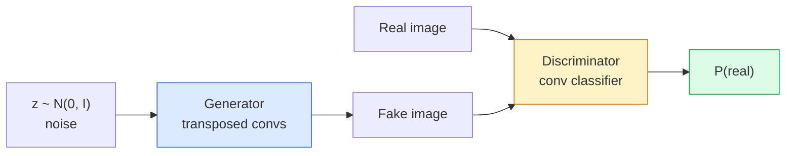
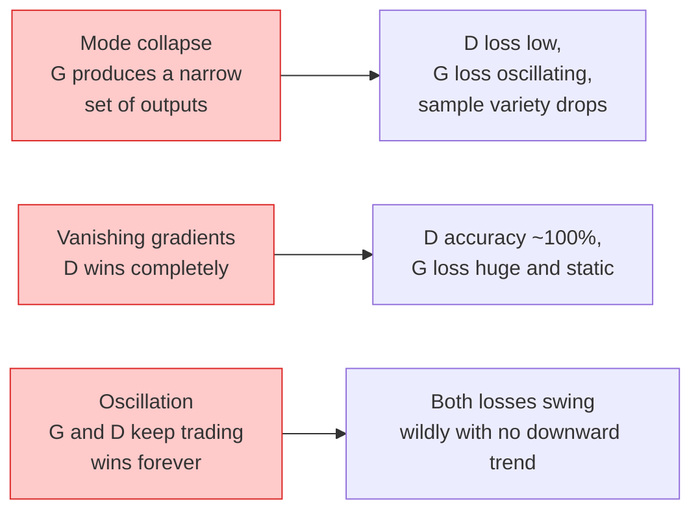

# 画像生成 — GANs

> GAN は固定されたゲームを行う 2 つの neural networks です。一方が描き、もう一方が批評します。両者は一緒に上達し、やがて描いたものが批評者をだませるようになります。

**種別:** 構築
**言語:** Python
**前提条件:** Phase 4 Lesson 03 (CNNs), Phase 3 Lesson 06 (Optimizers), Phase 3 Lesson 07 (Regularization)
**所要時間:** 約75分

## 学習目標

- generator と discriminator の minimax game を説明し、その equilibrium がなぜ p_model = p_data に対応するかを説明する
- PyTorch で DCGAN を実装し、60 行未満で一貫した 32x32 synthetic images を生成できるようにする
- non-saturating loss、spectral norm、TTUR (two-timescale update rule) という 3 つの標準テクニックで GAN training を安定化する
- healthy convergence と mode collapse、oscillation、discriminator-wins-completely を区別する training curves を読む

## 問題

Classification は images を labels に写像するよう network に教えます。Generation はこの問題を反転します。同じ distribution から来たように見える新しい images を sample します。差分を取れる「正しい」出力はありません。真似したい distribution があるだけです。

標準的な loss functions（MSE、cross-entropy）は、「この sample は real distribution から来たか」を測れません。per-pixel error を最小化すると、リアルな samples ではなく、ぼやけた平均が生まれます。ブレークスルーは loss を学習することでした。real と fake を見分けることを仕事にする 2 つ目の network を学習し、その判断で generator を押します。

GANs (Goodfellow et al., 2014) はこの枠組みを定義しました。2018 年には StyleGAN が写真と見分けがつかない 1024x1024 の顔を生成していました。品質と controllability では diffusion models が現在の主役ですが、diffusion を実用的にするほぼすべての工夫、つまり normalisation choices、latent spaces、feature losses は、まず GANs 上で理解されました。

## コンセプト

### 2 つの networks



**generator** G は noise vector `z` を受け取り、image を出力します。**discriminator** D は image を受け取り、その image が real である確率を表す single scalar を出力します。

### ゲーム

G は D に間違ってほしい。D は正しくありたい。形式的には次の通りです。

```
min_G max_D  E_x[log D(x)] + E_z[log(1 - D(G(z)))]
```

右から左に読みます。D は real images（`log D(real)`）と fake images（`log (1 - D(fake))`）での正答率を最大化します。G は fake に対する D の正答率を最小化します。つまり `D(G(z))` を高くしたいのです。

Goodfellow は、この minimax には `p_G = p_data`、D が everywhere 0.5 を出力し、generated distribution と real distribution の Jensen-Shannon divergence がゼロになる global equilibrium があることを証明しました。難しいのはそこに到達することです。

### Non-saturating loss

上の形式は数値的に不安定です。学習初期には、すべての fake に対して `D(G(z))` がほぼゼロなので、`log(1 - D(G(z)))` は G に関する勾配が消えます。修正は G の loss を反転することです。

```
L_D = -E_x[log D(x)] - E_z[log(1 - D(G(z)))]
L_G = -E_z[log D(G(z))]                          # non-saturating
```

これで `D(G(z))` がほぼゼロのとき、G の loss は大きくなり、勾配は情報を持ちます。現代の GAN はすべてこの variant で学習します。

### DCGAN architecture rules

Radford、Metz、Chintala (2015) は、何年もの失敗実験から GAN training を安定させる 5 つのルールを抽出しました。

1. pooling を strided convs に置き換える（両方の nets）。
2. generator と discriminator の両方で batch norm を使う。ただし G の出力と D の入力は除く。
3. 深い architectures では fully connected layers を削除する。
4. G は出力以外の全 layers で ReLU を使う（出力は [-1, 1] の tanh）。
5. D は全 layers で LeakyReLU（negative_slope=0.2）を使う。

現代の conv-based GAN（StyleGAN、BigGAN、GigaGAN）も、いまだにこれらのルールから始め、部品を 1 つずつ置き換えています。

### 失敗モードとシグネチャ



- **Mode collapse**: G が D をだませる 1 つの image を見つけ、それだけを生成します。修正: minibatch discrimination、spectral norm、label-conditioning を追加する。
- **Discriminator wins**: D が強くなりすぎるのが速く、G の勾配が消えます。修正: D を小さくする、D の learning rate を下げる、real labels に label smoothing を適用する。
- **Oscillation**: 2 つの nets が equilibrium に近づかず、勝ち負けを交換し続けます。修正: TTUR（D が G より 2-4 倍速く学習）、または Wasserstein loss に切り替える。

### 評価

GANs には ground truth がありません。では、うまく動いているかをどう知るのでしょうか。

- **Sample inspection** — 各 epoch の終わりに 64 samples を見る。これは必須。
- **FID (Fréchet Inception Distance)** — real set と generated set の Inception-v3 feature distributions 間の距離。低いほど良い。community standard。
- **Inception Score** — 古く、壊れやすい。FID を優先する。
- **Precision/Recall for generative models** — quality（precision）と coverage（recall）を別々に測る。FID 単独より情報量が多い。

小さな synthetic-data run では sample inspection で十分です。

## 実装

### Step 1: Generator

64-dim noise を受け取り、32x32 image を生成する小さな DCGAN generator です。

```python
import torch
import torch.nn as nn

class Generator(nn.Module):
    def __init__(self, z_dim=64, img_channels=3, feat=64):
        super().__init__()
        self.net = nn.Sequential(
            nn.ConvTranspose2d(z_dim, feat * 4, kernel_size=4, stride=1, padding=0, bias=False),
            nn.BatchNorm2d(feat * 4),
            nn.ReLU(inplace=True),
            nn.ConvTranspose2d(feat * 4, feat * 2, kernel_size=4, stride=2, padding=1, bias=False),
            nn.BatchNorm2d(feat * 2),
            nn.ReLU(inplace=True),
            nn.ConvTranspose2d(feat * 2, feat, kernel_size=4, stride=2, padding=1, bias=False),
            nn.BatchNorm2d(feat),
            nn.ReLU(inplace=True),
            nn.ConvTranspose2d(feat, img_channels, kernel_size=4, stride=2, padding=1, bias=False),
            nn.Tanh(),
        )

    def forward(self, z):
        return self.net(z.view(z.size(0), -1, 1, 1))
```

4 つの transposed convs があり、それぞれ `kernel_size=4, stride=2, padding=1` なので spatial size をきれいに 2 倍にします。出力 activation は tanh により [-1, 1] です。

### Step 2: Discriminator

generator の鏡像です。LeakyReLU と strided convs を使い、最後は scalar logit で終わります。

```python
class Discriminator(nn.Module):
    def __init__(self, img_channels=3, feat=64):
        super().__init__()
        self.net = nn.Sequential(
            nn.Conv2d(img_channels, feat, kernel_size=4, stride=2, padding=1),
            nn.LeakyReLU(0.2, inplace=True),
            nn.Conv2d(feat, feat * 2, kernel_size=4, stride=2, padding=1, bias=False),
            nn.BatchNorm2d(feat * 2),
            nn.LeakyReLU(0.2, inplace=True),
            nn.Conv2d(feat * 2, feat * 4, kernel_size=4, stride=2, padding=1, bias=False),
            nn.BatchNorm2d(feat * 4),
            nn.LeakyReLU(0.2, inplace=True),
            nn.Conv2d(feat * 4, 1, kernel_size=4, stride=1, padding=0),
        )

    def forward(self, x):
        return self.net(x).view(-1)
```

最後の conv は `4x4` feature map を `1x1` に縮小します。出力は image ごとに single scalar です。sigmoid は loss computation の中だけで適用します。

### Step 3: Training step

各 batch で D を 1 回更新し、次に G を 1 回更新します。

```python
import torch.nn.functional as F

def train_step(G, D, real, z, opt_g, opt_d, device):
    real = real.to(device)
    bs = real.size(0)

    # D step
    opt_d.zero_grad()
    d_real = D(real)
    d_fake = D(G(z).detach())
    loss_d = (F.binary_cross_entropy_with_logits(d_real, torch.ones_like(d_real))
              + F.binary_cross_entropy_with_logits(d_fake, torch.zeros_like(d_fake)))
    loss_d.backward()
    opt_d.step()

    # G step
    opt_g.zero_grad()
    d_fake = D(G(z))
    loss_g = F.binary_cross_entropy_with_logits(d_fake, torch.ones_like(d_fake))
    loss_g.backward()
    opt_g.step()

    return loss_d.item(), loss_g.item()
```

D step の `G(z).detach()` は重要です。この更新では G に勾配を流したくありません。これを忘れるのが典型的な beginner bug です。

### Step 4: synthetic shapes での完全な training loop

```python
from torch.utils.data import DataLoader, TensorDataset
import numpy as np

def synthetic_images(num=2000, size=32, seed=0):
    rng = np.random.default_rng(seed)
    imgs = np.zeros((num, 3, size, size), dtype=np.float32) - 1.0
    for i in range(num):
        r = rng.uniform(6, 12)
        cx, cy = rng.uniform(r, size - r, size=2)
        yy, xx = np.meshgrid(np.arange(size), np.arange(size), indexing="ij")
        mask = (xx - cx) ** 2 + (yy - cy) ** 2 < r ** 2
        color = rng.uniform(-0.5, 1.0, size=3)
        for c in range(3):
            imgs[i, c][mask] = color[c]
    return torch.from_numpy(imgs)

device = "cuda" if torch.cuda.is_available() else "cpu"
data = synthetic_images()
loader = DataLoader(TensorDataset(data), batch_size=64, shuffle=True)

G = Generator(z_dim=64, img_channels=3, feat=32).to(device)
D = Discriminator(img_channels=3, feat=32).to(device)
opt_g = torch.optim.Adam(G.parameters(), lr=2e-4, betas=(0.5, 0.999))
opt_d = torch.optim.Adam(D.parameters(), lr=2e-4, betas=(0.5, 0.999))

for epoch in range(10):
    for (batch,) in loader:
        z = torch.randn(batch.size(0), 64, device=device)
        ld, lg = train_step(G, D, batch, z, opt_g, opt_d, device)
    print(f"epoch {epoch}  D {ld:.3f}  G {lg:.3f}")
```

`Adam(lr=2e-4, betas=(0.5, 0.999))` は DCGAN のデフォルトです。低い beta1 により、momentum term が adversarial game を過度に安定化しないようにします。

### Step 5: Sampling

```python
@torch.no_grad()
def sample(G, n=16, z_dim=64, device="cpu"):
    G.eval()
    z = torch.randn(n, z_dim, device=device)
    imgs = G(z)
    imgs = (imgs + 1) / 2
    return imgs.clamp(0, 1)
```

sampling の前には必ず eval mode に切り替えます。DCGAN では、batch norm が batch の stats ではなく running stats を使うため重要です。

### Step 6: Spectral normalisation

discriminator 内の BN の drop-in replacement で、network が 1-Lipschitz であることを保証します。ほとんどの「D wins too hard」失敗を直します。

```python
from torch.nn.utils import spectral_norm

def build_sn_discriminator(img_channels=3, feat=64):
    return nn.Sequential(
        spectral_norm(nn.Conv2d(img_channels, feat, 4, 2, 1)),
        nn.LeakyReLU(0.2, inplace=True),
        spectral_norm(nn.Conv2d(feat, feat * 2, 4, 2, 1)),
        nn.LeakyReLU(0.2, inplace=True),
        spectral_norm(nn.Conv2d(feat * 2, feat * 4, 4, 2, 1)),
        nn.LeakyReLU(0.2, inplace=True),
        spectral_norm(nn.Conv2d(feat * 4, 1, 4, 1, 0)),
    )
```

`Discriminator` を `build_sn_discriminator()` に置き換えると、多くの場合 TTUR trick は不要です。Spectral norm は適用できる最も簡単な単一の robustness upgrade です。

## 使う

本格的な generation では pretrained weights を使うか diffusion に切り替えます。標準的な libraries は 2 つあります。

- `torch_fidelity` は custom eval code なしで generator の FID / IS を計算します。
- `pytorch-gan-zoo`（legacy）と `StudioGAN` は DCGAN、WGAN-GP、SN-GAN、StyleGAN、BigGAN の検証済み実装を提供します。

2026 年でも、GANs は real-time image generation（latency <10 ms）、style transfer、精密制御を伴う image-to-image translation（Pix2Pix、CycleGAN）で最良の選択肢です。Photorealism と text conditioning では diffusion が勝ちます。

## 成果物

この lesson は次を生成します。

- `outputs/prompt-gan-training-triage.md` — training curve description を読み、失敗モード（mode collapse、D-wins、oscillation）と推奨する単一の修正を選ぶ prompt。
- `outputs/skill-dcgan-scaffold.md` — `z_dim`、target `image_size`、`num_channels` から、training loop と sample saver を含む DCGAN scaffold を書く skill。

## 演習

1. **(Easy)** 上の DCGAN を synthetic circle dataset で学習し、各 epoch の終わりに 16 samples の grid を保存してください。生成された circles は何 epoch 目で明確に円形になりますか？
2. **(Medium)** discriminator の batch norm を spectral norm に置き換えてください。両方の版を side by side で学習してください。どちらが速く収束しますか？3 seeds で variance が低いのはどちらですか？
3. **(Hard)** conditional DCGAN を実装してください。class label を G と D の両方に入力します（G では one-hot を noise に concat、D では class embedding channel を concat）。lesson 7 の synthetic "circles vs squares" dataset で学習し、specific labels で sampling して class conditioning が機能することを示してください。

## 重要用語

| Term | What people say | What it actually means |
|------|----------------|----------------------|
| Generator (G) | 「描く側の net」 | noise を images に写像し、discriminator をだますよう学習される |
| Discriminator (D) | 「批評者」 | real images と generated images を区別する binary classifier |
| Minimax | 「ゲーム」 | adversarial loss の G に関する min、D に関する max。equilibrium は p_G = p_data |
| Non-saturating loss | 「数値的にまともな版」 | 学習初期の vanishing gradients を避けるため、G の loss は log(1 - D(G(z))) ではなく -log(D(G(z))) |
| Mode collapse | 「Generator が 1 種類だけ作る」 | G が data distribution の小さな subset だけを生成する。SN、minibatch discrimination、大きな batch で修正する |
| TTUR | 「2 つの learning rates」 | D が G より速く、通常 2-4 倍で学習する。training を安定化する |
| Spectral norm | 「1-Lipschitz layer」 | 各 layer の Lipschitz constant を制限する weight-normalisation。D が任意に急峻になることを防ぐ |
| FID | 「Fréchet Inception Distance」 | real set と generated set の Inception-v3 feature distributions 間の距離。標準評価 metric |

## 参考文献

- [Generative Adversarial Networks (Goodfellow et al., 2014)](https://arxiv.org/abs/1406.2661) — すべての始まりとなった論文
- [DCGAN (Radford, Metz, Chintala, 2015)](https://arxiv.org/abs/1511.06434) — GANs を学習可能にした architecture rules
- [Spectral Normalization for GANs (Miyato et al., 2018)](https://arxiv.org/abs/1802.05957) — 最も有用な単一の stabilisation trick
- [StyleGAN3 (Karras et al., 2021)](https://arxiv.org/abs/2106.12423) — SOTA GAN。過去 10 年のあらゆる trick の greatest-hits album のように読める
