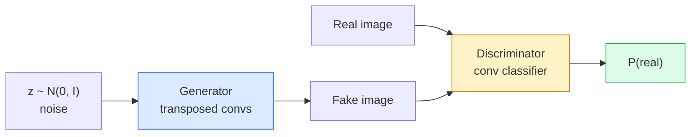
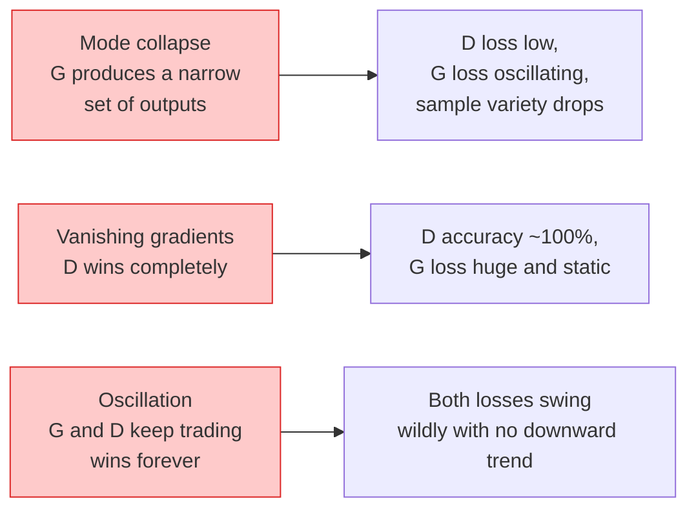

# Görüntü Oluşturma — GAN'lar

> Bir GAN, sabit bir oyundaki iki neural network'dir. Biri çizer, biri eleştirir. Çizimler eleştirmeni kandırıncaya kadar birlikte daha iyi hale gelirler.

**Tür:** Yapım
**Diller:** Python
**Önkoşullar:** Aşama 4 Ders 03 (CNN'ler), Aşama 3 Ders 06 (Optimize Ediciler), Aşama 3 Ders 07 (Düzenleme)
**Süre:** ~75 dakika

## Öğrenme Hedefleri

- Üreteç ve ayırıcı arasındaki minimax oyununu ve dengenin neden p_model = p_data'ya karşılık geldiğini açıklayın
- PyTorch'ta bir DCGAN uygulayın ve 60 satırın altında tutarlı 32x32 sentetik görüntüler oluşturmasını sağlayın
- GAN eğitimini üç standart yöntemle stabilize edin: doymamış kayıp, spektral norm, TTUR (iki zaman ölçeği güncelleme kuralı)
- Sağlıklı yakınsamayı mod çöküşünden, salınımdan ve ayrımcının kazandığından tamamen ayıran eğitim eğrilerini okuyun

## Sorun

Sınıflandırma, bir ağa görüntüleri etiketlerle eşleştirmeyi öğretir. Nesil sorunu tersine çevirir: Aynı dağıtımdan gelmiş gibi görünen yeni görselleri örnekleyin. Farklılaştırabileceğiniz "doğru" bir çıktı yoktur; yalnızca taklit etmek istediğiniz bir dağıtım var.

Standart loss function'ler (MSE, çapraz entropi) "bu örnek gerçek dağılımdan mı geldi?" sorusunu ölçemez. Piksel başına hatanın en aza indirilmesi, gerçekçi örnekler değil, bulanık ortalamalar üretir. Atılım, kaybı öğrenmekti: Görevi gerçeği sahteden ayırmak olan ikinci bir ağ eğitmek ve jeneratörü zorlamak için kendi muhakemesini kullanmaktı.

GAN'lar (Goodfellow ve diğerleri, 2014) framework'yi tanımladı. 2018 yılına gelindiğinde StyleGAN, fotoğraflardan ayırt edilemeyen 1024x1024 yüzler üretiyordu. O zamandan beri difüzyon modelleri kalite ve kontrol edilebilirlik açısından tahtı ele geçirdi, ancak difüzyonu pratik hale getiren her hile (normalizasyon seçimleri, gizli alanlar, özellik kayıpları) ilk olarak GAN'larda anlaşıldı.

## Konsept

### İki ağ



**jeneratör** G, `z` gürültü vektörünü alır ve bir görüntü üretir. **ayırt edici** D bir görüntü alır ve tek bir skaler çıktı verir: görüntünün gerçek olma olasılığı.

### Oyun

G, D'nin yanılmasını istiyor. D haklı olmak istiyor. Resmi olarak:

```
min_G max_D  E_x[log D(x)] + E_z[log(1 - D(G(z)))]
```

Sağdan sola okuyun: D, gerçek (`log D(real)`) ve sahte (`log (1 - D(fake))`) görüntülerde doğruluğu en üst düzeye çıkarır. G, D'nin sahte ürünlerdeki doğruluğunu en aza indiriyor; `D(G(z))`'nin yüksek olmasını istiyor.

Goodfellow, bu minimax'ın, `p_G = p_data`, D'nin her yerde 0,5 çıktı verdiği ve oluşturulan ve gerçek dağılımlar arasındaki Jensen-Shannon farkının sıfır olduğu küresel bir dengeye sahip olduğunu kanıtladı. Zor kısım oraya ulaşmaktır.

### Doymamış kayıp

Yukarıdaki form sayısal olarak kararsızdır. Eğitimin başlarında, `D(G(z))` her sahtekarlık için sıfıra yakın olduğundan `log(1 - D(G(z)))`'nin G'ye göre gradient'leri yok oluyor. Çözüm: G'yi çevir kaybı.

```
L_D = -E_x[log D(x)] - E_z[log(1 - D(G(z)))]
L_G = -E_z[log D(G(z))]                          # non-saturating
```

Şimdi `D(G(z))` sıfıra yakın olduğunda, G'nin kaybı büyüktür ve gradient bilgilendiricidir. Her modern GAN bu varyantla eğitim alır.

### DCGAN mimarisi kuralları

Radford, Metz, Chintala (2015), yıllarca süren başarısız deneyleri GAN eğitimini istikrarlı kılan beş kurala ayırdı:

1. Havuzlamayı adımlı dönüşümlerle (her iki ağ) değiştirin.
2. G çıkışı ve D girişi hariç, hem jeneratörde hem de ayırıcıda parti normunu kullanın.
3. Daha derin mimarilerdeki tamamen bağlı katmanları kaldırın.
4. G, çıktı dışındaki tüm katmanlarda ReLU'yu kullanır ([-1, 1]'deki çıktı için tanh).
5. D, tüm katmanlarda LeakyReLU (negative_slope=0,2) kullanır.

Her modern dönüşüm tabanlı GAN (StyleGAN, BigGAN, GigaGAN) hala bu kurallardan başlıyor ve parçaları birer birer değiştiriyor.

### Arıza modları ve imzaları



- **Mod çökmesi**: G, D'yi kandıran bir görüntü bulur ve yalnızca onu üretir. Düzeltme: Mini parti ayrımcılığı, spektral norm veya etiket koşullandırma ekleyin.
- **Ayıran kazanır**: D çok hızlı bir şekilde çok güçlü hale gelir, G'nin gradient'leri kaybolur. Düzeltme: Daha küçük D, daha düşük D öğrenme oranı veya gerçek etiketlere etiket yumuşatma uygulayın.
- **Salınım**: İki net ticaret, dengeye hiç yaklaşmadan kazanır. Düzeltme: TTUR (D, G'den 2-4 kat daha hızlı öğrenir) veya Wasserstein kaybına geçiş.

### Değerlendirme

GAN'ların kesin bir gerçeği yoktur, peki çalıştıklarını nasıl anlarsınız?

- **Örnek inceleme** — her dönemin sonunda 64 örneğe bakın. Pazarlık edilemez.
- **FID (Fréchet Başlangıç Mesafesi)** — gerçek ve oluşturulan kümelerin Inception-v3 özellik dağılımları arasındaki mesafe. Daha düşük olması daha iyidir. Topluluk standardı.
- **Başlangıç Puanı** — daha eski, daha kırılgan; FID'yi tercih edin.
- **Üretimsel modeller için Hassasiyet/Geri Çağırma** — kaliteyi (hassasiyet) ve kapsamı (geri çağırma) ayrı ayrı ölçer. Tek başına FID'den daha bilgilendirici.

Küçük bir sentetik veri çalışması için numune incelemesi yeterlidir.

## İnşa Et

### Adım 1: Jeneratör

64 loş gürültüyü alan ve 32x32 görüntü üreten küçük bir DCGAN üreteci.

```python
import torch
import torch.nn as nn

class Generator(nn.Module):
    def __init__(self, z_dim=64, img_channels=3, feat=64):
        super().__init__()
        self.net = nn.Sequential(
            nn.ConvTranspose2d(z_dim, feat * 4, kernel_size=4, stride=1, padding=0, bias=False),
            nn.BatchNorm2d(feat * 4),
            nn.ReLU(inplace=True),
            nn.ConvTranspose2d(feat * 4, feat * 2, kernel_size=4, stride=2, padding=1, bias=False),
            nn.BatchNorm2d(feat * 2),
            nn.ReLU(inplace=True),
            nn.ConvTranspose2d(feat * 2, feat, kernel_size=4, stride=2, padding=1, bias=False),
            nn.BatchNorm2d(feat),
            nn.ReLU(inplace=True),
            nn.ConvTranspose2d(feat, img_channels, kernel_size=4, stride=2, padding=1, bias=False),
            nn.Tanh(),
        )

    def forward(self, z):
        return self.net(z.view(z.size(0), -1, 1, 1))
```

Her biri `kernel_size=4, stride=2, padding=1`'ye sahip dört aktarılmış dönüşüm, böylece uzamsal boyutu temiz bir şekilde iki katına çıkarırlar. Tanh aracılığıyla [-1, 1] çıkış aktivasyonları.

### Adım 2: Ayırıcı

Jeneratörün aynası. LeakyReLU, adımlı dönüşümler, skaler bir logit ile biter.

```python
class Discriminator(nn.Module):
    def __init__(self, img_channels=3, feat=64):
        super().__init__()
        self.net = nn.Sequential(
            nn.Conv2d(img_channels, feat, kernel_size=4, stride=2, padding=1),
            nn.LeakyReLU(0.2, inplace=True),
            nn.Conv2d(feat, feat * 2, kernel_size=4, stride=2, padding=1, bias=False),
            nn.BatchNorm2d(feat * 2),
            nn.LeakyReLU(0.2, inplace=True),
            nn.Conv2d(feat * 2, feat * 4, kernel_size=4, stride=2, padding=1, bias=False),
            nn.BatchNorm2d(feat * 4),
            nn.LeakyReLU(0.2, inplace=True),
            nn.Conv2d(feat * 4, 1, kernel_size=4, stride=1, padding=0),
        )

    def forward(self, x):
        return self.net(x).view(-1)
```

Son dönüşüm, `4x4` özellik haritasını `1x1`'ye indirger. Çıktı, görüntü başına tek bir skalerdir; sigmoid'i yalnızca kayıp hesaplaması sırasında uygulayın.

### Adım 3: Eğitim adımı

Alternatif: Her grupta D'yi bir kez, ardından G'yi bir kez güncelleyin.

```python
import torch.nn.functional as F

def train_step(G, D, real, z, opt_g, opt_d, device):
    real = real.to(device)
    bs = real.size(0)

    # D step
    opt_d.zero_grad()
    d_real = D(real)
    d_fake = D(G(z).detach())
    loss_d = (F.binary_cross_entropy_with_logits(d_real, torch.ones_like(d_real))
              + F.binary_cross_entropy_with_logits(d_fake, torch.zeros_like(d_fake)))
    loss_d.backward()
    opt_d.step()

    # G step
    opt_g.zero_grad()
    d_fake = D(G(z))
    loss_g = F.binary_cross_entropy_with_logits(d_fake, torch.ones_like(d_fake))
    loss_g.backward()
    opt_g.step()

    return loss_d.item(), loss_g.item()
```

D adımındaki `G(z).detach()` kritik öneme sahiptir: güncellemesi sırasında gradient'lerin G'ye akmasını istemiyoruz. Bunu unutmak başlangıç ​​seviyesindeki klasik hatadır.

### Adım 4: Sentetik şekiller üzerinde tam eğitim döngüsü

```python
from torch.utils.data import DataLoader, TensorDataset
import numpy as np

def synthetic_images(num=2000, size=32, seed=0):
    rng = np.random.default_rng(seed)
    imgs = np.zeros((num, 3, size, size), dtype=np.float32) - 1.0
    for i in range(num):
        r = rng.uniform(6, 12)
        cx, cy = rng.uniform(r, size - r, size=2)
        yy, xx = np.meshgrid(np.arange(size), np.arange(size), indexing="ij")
        mask = (xx - cx) ** 2 + (yy - cy) ** 2 < r ** 2
        color = rng.uniform(-0.5, 1.0, size=3)
        for c in range(3):
            imgs[i, c][mask] = color[c]
    return torch.from_numpy(imgs)

device = "cuda" if torch.cuda.is_available() else "cpu"
data = synthetic_images()
loader = DataLoader(TensorDataset(data), batch_size=64, shuffle=True)

G = Generator(z_dim=64, img_channels=3, feat=32).to(device)
D = Discriminator(img_channels=3, feat=32).to(device)
opt_g = torch.optim.Adam(G.parameters(), lr=2e-4, betas=(0.5, 0.999))
opt_d = torch.optim.Adam(D.parameters(), lr=2e-4, betas=(0.5, 0.999))

for epoch in range(10):
    for (batch,) in loader:
        z = torch.randn(batch.size(0), 64, device=device)
        ld, lg = train_step(G, D, batch, z, opt_g, opt_d, device)
    print(f"epoch {epoch}  D {ld:.3f}  G {lg:.3f}")
```

`Adam(lr=2e-4, betas=(0.5, 0.999))`, DCGAN varsayılanıdır — düşük beta1, momentum teriminin rakip oyunu çok fazla istikrara kavuşturmasını engeller.

### Adım 5: Örnekleme

```python
@torch.no_grad()
def sample(G, n=16, z_dim=64, device="cpu"):
    G.eval()
    z = torch.randn(n, z_dim, device=device)
    imgs = G(z)
    imgs = (imgs + 1) / 2
    return imgs.clamp(0, 1)
```

Örneklemeden önce daima değerlendirme moduna geçin. DCGAN için bu önemlidir çünkü grubun istatistikleri yerine toplu norm çalışma istatistikleri kullanılır.

### Adım 6: Spektral normalleştirme

Ağı garanti eden ayırıcıdaki BN'nin yerine geçecek bir alternatif 1-Lipschitz'dir. Çoğu "D çok zor kazanıyor" hatalarını düzeltir.

```python
from torch.nn.utils import spectral_norm

def build_sn_discriminator(img_channels=3, feat=64):
    return nn.Sequential(
        spectral_norm(nn.Conv2d(img_channels, feat, 4, 2, 1)),
        nn.LeakyReLU(0.2, inplace=True),
        spectral_norm(nn.Conv2d(feat, feat * 2, 4, 2, 1)),
        nn.LeakyReLU(0.2, inplace=True),
        spectral_norm(nn.Conv2d(feat * 2, feat * 4, 4, 2, 1)),
        nn.LeakyReLU(0.2, inplace=True),
        spectral_norm(nn.Conv2d(feat * 4, 1, 4, 1, 0)),
    )
```

`Discriminator`'yi `build_sn_discriminator()` ile değiştirin; çoğu zaman TTUR numarasına ihtiyacınız olmaz. Spektral norm, uygulayabileceğiniz en kolay tek sağlamlık yükseltmesidir.

## Kullan onu

Ciddi üretim için önceden eğitilmiş ağırlıklar kullanın veya difüzyona geçin. İki standart kütüphane:

- `torch_fidelity`, özel değerlendirme kodu yazmadan jeneratörünüzde FID / IS'yi hesaplar.
- `pytorch-gan-zoo` (eski) ve `StudioGAN`, DCGAN, WGAN-GP, SN-GAN, StyleGAN ve BigGAN'ın test edilmiş uygulamalarını sunar.

2026'da GAN'lar şu konularda hâlâ en iyi seçimdir: gerçek zamanlı görüntü oluşturma (gecikme <10 ms), stil aktarımı, hassas kontrolle görüntüden görüntüye çeviri (Pix2Pix, CycleGAN). Difüzyon, fotogerçekçilik ve metin koşullandırma konusunda kazanır.

## Gönderin

Bu ders şunları üretir:

- `outputs/prompt-gan-training-triage.md` — bir eğitim eğrisi açıklamasını okuyan ve arıza modunu (mod çöküşü, D-kazanımları, salınım) artı önerilen tek düzeltmeyi seçen bir prompt.
- `outputs/skill-dcgan-scaffold.md` — eğitim döngüsü ve örnek koruyucu dahil olmak üzere `z_dim`, hedef `image_size` ve `num_channels`'den bir DCGAN iskelesi yazan bir beceri.

## Egzersizler

1. **(Kolay)** Yukarıdaki DCGAN'ı dataset sentetik çemberinde eğitin ve her dönemin sonunda 16 örnekten oluşan bir ızgarayı kaydedin. Oluşturulan daireler hangi dönemde açıkça dairesel hale gelir?
2. **(Orta)** Ayırıcının parti normunu spektral normla değiştirin. Her iki versiyonu da yan yana eğitin. Hangisi daha hızlı birleşir? Üç tohum arasında hangisinin varyansı daha düşüktür?
3. **(Zor)** Koşullu bir DCGAN uygulayın: sınıf etiketini hem G hem de D'ye besleyin (bir-sıcaklığı G'deki gürültüyle birleştirin, D'de bir embedding sınıfı kanalını birleştirin). 7. dersteki sentetik "daireler ve kareler" dataset üzerinde çalışın ve sınıf koşullandırmasının belirli etiketlerle örneklenerek işe yaradığını gösterin.

## Anahtar Terimler

| Dönem | İnsanlar ne diyor | Aslında ne anlama geliyor |
|------|----------------|----------------------|
| Jeneratör (G) | "Çekilen şeyler ağı" | Gürültüyü görüntülere eşler; ayrımcıyı kandırmak için eğitildi |
| Ayırıcı (D) | "Eleştirmen" | İkili sınıflandırıcı; gerçek görüntüleri oluşturulan görüntülerden ayırt etmek için eğitildi |
| Minimaks | "Oyun" | düşmanca bir kaybın minimum G'si, maksimum D'si; denge şu şekildedir: p_G = p_data |
| Doymamış kayıp | "Sayısal açıdan mantıklı versiyon" | gradient'lerin eğitimin başlarında kaybolmasını önlemek için G'nin kaybı log(1 - D(G(z))) yerine -log(D(G(z))) şeklindedir |
| Mod daralt | "Jeneratör tek bir şey yapar" | G, veri dağılımının yalnızca küçük bir alt kümesini üretir; SN, mini parti ayrımcılığı veya daha büyük parti ile düzeltme |
| TTUR | "İki öğrenme oranı" | D, G'den genellikle 2-4 kat daha hızlı öğrenir; antrenmanı stabil hale getirir |
| Spektral norm | "1-Lipschitz katmanı" | Her katmanın Lipschitz sabitini sınırlayan bir ağırlık normalizasyonu; D'nin keyfi olarak dik olmasını engeller |
| FID | "Fréchet Başlangıç ​​Mesafesi" | Gerçek ve oluşturulan kümelerin Inception-v3 özellik dağılımları arasındaki mesafe; standart değerlendirme ölçütü |

## Daha Fazla Okuma

- [Generative Adversarial Networks (Goodfellow ve diğerleri, 2014)](https://arxiv.org/abs/1406.2661) — her şeyi başlatan makale
- [DCGAN (Radford, Metz, Chintala, 2015)](https://arxiv.org/abs/1511.06434) — GAN'ları eğitilebilir kılan mimari kuralları
- [GAN'lar için Spektral Normalleştirme (Miyato ve diğerleri, 2018)](https://arxiv.org/abs/1802.05957) — en kullanışlı tek stabilizasyon hilesi
- [StyleGAN3 (Karras ve diğerleri, 2021)](https://arxiv.org/abs/2106.12423) — SOTA GAN; son on yılın her numarasının en büyük hit albümü gibi okunuyor
