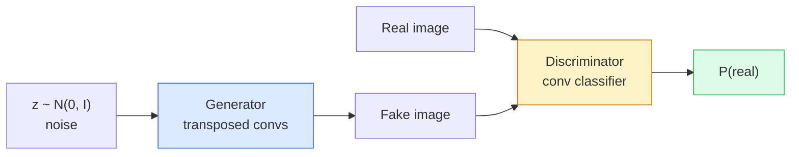
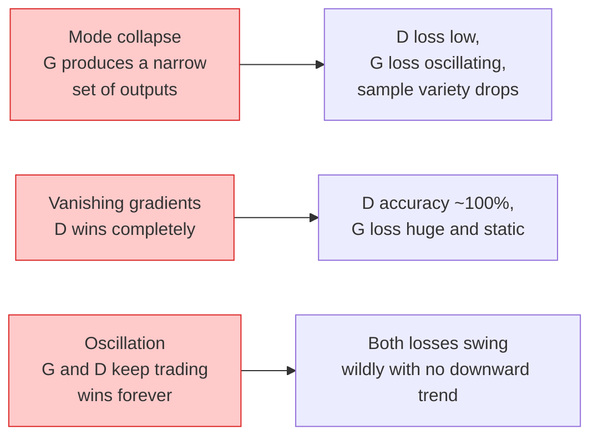

# Image Generation — GANs

> GAN是固定游戏中的两个神经网络。一人抽签，一人批评。他们在一起变得更好，直到图画愚弄了评论家。

** 类型：** 构建
** 语言：** Python
** Prediction：** Phase 4 Lesson 03（CNN），Phase 3 Lesson 06（Optimizers），Phase 3 Lesson 07（Regularization）
** 时间：** ~75分钟

## Learning Objectives

- 解释生成器和分配器之间的极大极小博弈以及为什么均衡对应于p_models = p_data
- 在PyTorch中实施DCGAN，使其生成60行以下的连贯32 x 32合成图像
- 使用三个标准技巧稳定GAN训练：非饱和损失，谱范数，TTUR（两个时间尺度更新规则）
- 阅读训练曲线，将健康收敛与模式崩溃、振荡和鉴别器获胜完全区分开来

## The Problem

分类教网络将图像映射到标签。世代颠倒了问题：采样看起来像来自同一发行版的新图像。没有您可以进行区分的“正确”输出;只有您想要模仿的分布。

标准损失函数（SSE，交叉熵）无法测量“这个样本是否来自真实分布”。“最小化每像素误差会产生模糊的平均值，而不是真实的样本。突破是了解损失：训练第二个网络，其工作是区分真假，并利用其判断来推动发生器。

GAN（Goodfellow等人，2014年）定义了该框架。到2018年，StyleGAN已制作出1024 x 1024张与照片无法区分的面孔。此后，扩散模型在质量和可控性方面占据了主导地位，但使扩散实用的每一个技巧--标准化选择、潜在空间、特征损失--都是首先在GAN上理解的。

## The Concept

### The two networks



** 生成器 ** G获取噪音“z”的载体并输出图像。** ð** D获取一张图像并输出单个纯量：图像为真实的概率。

### The game

G希望D错。D想要正确。正式上：

```
min_G max_D  E_x[log D(x)] + E_z[log(1 - D(G(z)))]
```

从右到左阅读：D正在最大限度地提高真实（“log D（real）”）和假（“log（1 - D（fake））”）图像的准确性。G正在最大限度地降低D对假货的准确性--它希望“D（G（z））”更高。

Goodfellow证明了这个极小极大具有全局均衡，其中“p_G = p_data”，D到处输出0.5，生成分布和真实分布之间的詹森-香农偏差为零。最困难的部分是到达那里。

### Non-saturating loss

上面的形式在数字上不稳定。在训练早期，对于每个伪品，“D（G（z））”都接近于零，因此“log（1 - D（G（z）”相对于G的梯度为零。解决办法：翻转G的损失。

```
L_D = -E_x[log D(x)] - E_z[log(1 - D(G(z)))]
L_G = -E_z[log D(G(z))]                          # non-saturating
```

现在，当“D（G（z））”接近零时，G的损失很大，并且其梯度是有用的。每个现代GAN都采用该变体进行训练。

### DCGAN architecture rules

Radford、Metz、Chintala（2015）将多年失败的实验提炼为五条规则，使GAN训练稳定：

1. 用跨坐式控制（两个网络）取代池化。
2. 除了G的输出和D的输入之外，在生成器和分配器中都使用批量规范。
3. 删除更深体系结构上的完全连接的层。
4. G在除输出之外的所有层上使用ReLU（tanh代表[-1，1]中的输出）。
5. D在所有层上使用LeakyReLU（negative_slope=0.2）。

每一个现代基于会议的GAN（StyleGAN、BigGAN、GigaGAN）仍然从这些规则开始，一次替换一个片段。

### Failure modes and their signatures



- ** 模式崩溃 **：G找到一个愚弄D的图像并只产生该图像。修复：添加小批量区分、光谱规范或标签条件处理。
- ** 鉴别器获胜 **：D变得太强太快，G的梯度消失。修复：较小的D、较低的D学习率，或对真实标签应用标签平滑。
- ** 振荡 **：两个网在从未接近均衡的情况下交易获胜。修复：TTur（D学习速度比G快2-4倍），或切换到Wasserstein损失。

### Evaluation

GAN没有基本真相，那么您怎么知道它们正在工作呢？

- ** 样本检查 ** -只需在每个纪元结束时查看64个样本即可。没得商量
- ** DID（Fréchet Incept Distance）** -真实集和生成集的Inception-v3特征分布之间的距离。低越好。社区标准。
- ** 初始评分 ** -较旧，较脆;首选FID。
- ** 生成式模型的精确度/召回 ** -分别衡量质量（精确度）和覆盖率（召回）。比单独的DID信息更多。

对于小型综合数据运行，样本检查就足够了。

## Build It

### Step 1: Generator

一个小型DCGAN发生器，可接收64度的噪音并产生32 x32图像。

```python
import torch
import torch.nn as nn

class Generator(nn.Module):
    def __init__(self, z_dim=64, img_channels=3, feat=64):
        super().__init__()
        self.net = nn.Sequential(
            nn.ConvTranspose2d(z_dim, feat * 4, kernel_size=4, stride=1, padding=0, bias=False),
            nn.BatchNorm2d(feat * 4),
            nn.ReLU(inplace=True),
            nn.ConvTranspose2d(feat * 4, feat * 2, kernel_size=4, stride=2, padding=1, bias=False),
            nn.BatchNorm2d(feat * 2),
            nn.ReLU(inplace=True),
            nn.ConvTranspose2d(feat * 2, feat, kernel_size=4, stride=2, padding=1, bias=False),
            nn.BatchNorm2d(feat),
            nn.ReLU(inplace=True),
            nn.ConvTranspose2d(feat, img_channels, kernel_size=4, stride=2, padding=1, bias=False),
            nn.Tanh(),
        )

    def forward(self, z):
        return self.net(z.view(z.size(0), -1, 1, 1))
```

四个转置的Conv，每个Conv具有“core_size=4，stride=2，padding=1”，因此它们将空间大小彻底翻倍。通过tanh以[-1，1]输出激活。

### Step 2: Discriminator

发电机的镜子。LeakyReLU，跨行cons，以纯量logit结束。

```python
class Discriminator(nn.Module):
    def __init__(self, img_channels=3, feat=64):
        super().__init__()
        self.net = nn.Sequential(
            nn.Conv2d(img_channels, feat, kernel_size=4, stride=2, padding=1),
            nn.LeakyReLU(0.2, inplace=True),
            nn.Conv2d(feat, feat * 2, kernel_size=4, stride=2, padding=1, bias=False),
            nn.BatchNorm2d(feat * 2),
            nn.LeakyReLU(0.2, inplace=True),
            nn.Conv2d(feat * 2, feat * 4, kernel_size=4, stride=2, padding=1, bias=False),
            nn.BatchNorm2d(feat * 4),
            nn.LeakyReLU(0.2, inplace=True),
            nn.Conv2d(feat * 4, 1, kernel_size=4, stride=1, padding=0),
        )

    def forward(self, x):
        return self.net(x).view(-1)
```

最后一个conv将“4x 4”特征地图简化为“1x 1”。输出是每个图像的单个纯量;仅在损失计算期间应用Sigmoid。

### Step 3: Training step

替代：每批更新一次D，然后更新一次G。

```python
import torch.nn.functional as F

def train_step(G, D, real, z, opt_g, opt_d, device):
    real = real.to(device)
    bs = real.size(0)

    # D step
    opt_d.zero_grad()
    d_real = D(real)
    d_fake = D(G(z).detach())
    loss_d = (F.binary_cross_entropy_with_logits(d_real, torch.ones_like(d_real))
              + F.binary_cross_entropy_with_logits(d_fake, torch.zeros_like(d_fake)))
    loss_d.backward()
    opt_d.step()

    # G step
    opt_g.zero_grad()
    d_fake = D(G(z))
    loss_g = F.binary_cross_entropy_with_logits(d_fake, torch.ones_like(d_fake))
    loss_g.backward()
    opt_g.step()

    return loss_d.item(), loss_g.item()
```

D步骤中的“G（z）. disconnect（）”至关重要：我们不希望梯度在G更新期间流入G。忘记这是经典的初学者错误。

### Step 4: Full training loop on synthetic shapes

```python
from torch.utils.data import DataLoader, TensorDataset
import numpy as np

def synthetic_images(num=2000, size=32, seed=0):
    rng = np.random.default_rng(seed)
    imgs = np.zeros((num, 3, size, size), dtype=np.float32) - 1.0
    for i in range(num):
        r = rng.uniform(6, 12)
        cx, cy = rng.uniform(r, size - r, size=2)
        yy, xx = np.meshgrid(np.arange(size), np.arange(size), indexing="ij")
        mask = (xx - cx) ** 2 + (yy - cy) ** 2 < r ** 2
        color = rng.uniform(-0.5, 1.0, size=3)
        for c in range(3):
            imgs[i, c][mask] = color[c]
    return torch.from_numpy(imgs)

device = "cuda" if torch.cuda.is_available() else "cpu"
data = synthetic_images()
loader = DataLoader(TensorDataset(data), batch_size=64, shuffle=True)

G = Generator(z_dim=64, img_channels=3, feat=32).to(device)
D = Discriminator(img_channels=3, feat=32).to(device)
opt_g = torch.optim.Adam(G.parameters(), lr=2e-4, betas=(0.5, 0.999))
opt_d = torch.optim.Adam(D.parameters(), lr=2e-4, betas=(0.5, 0.999))

for epoch in range(10):
    for (batch,) in loader:
        z = torch.randn(batch.size(0), 64, device=device)
        ld, lg = train_step(G, D, batch, z, opt_g, opt_d, device)
    print(f"epoch {epoch}  D {ld:.3f}  G {lg:.3f}")
```

“Adam（lr= 2 e-4，betas=（0.5，0.999））”是DCGAN默认值-低beta 1可以防止动量项过多地稳定对抗游戏。

### Step 5: Sampling

```python
@torch.no_grad()
def sample(G, n=16, z_dim=64, device="cpu"):
    G.eval()
    z = torch.randn(n, z_dim, device=device)
    imgs = G(z)
    imgs = (imgs + 1) / 2
    return imgs.clamp(0, 1)
```

在采样之前始终切换到评估模式。对于DCGAN来说，这很重要，因为使用批规范运行统计数据而不是批的统计数据。

### Step 6: Spectral normalisation

NPS中BN的直接替代品，确保网络为1-Lipschitz。修复了大多数“D赢得太难”的失败。

```python
from torch.nn.utils import spectral_norm

def build_sn_discriminator(img_channels=3, feat=64):
    return nn.Sequential(
        spectral_norm(nn.Conv2d(img_channels, feat, 4, 2, 1)),
        nn.LeakyReLU(0.2, inplace=True),
        spectral_norm(nn.Conv2d(feat, feat * 2, 4, 2, 1)),
        nn.LeakyReLU(0.2, inplace=True),
        spectral_norm(nn.Conv2d(feat * 2, feat * 4, 4, 2, 1)),
        nn.LeakyReLU(0.2, inplace=True),
        spectral_norm(nn.Conv2d(feat * 4, 1, 4, 1, 0)),
    )
```

将“Discriminator”替换为“Build_nn_RST（）”，您通常不需要TT鲁尔技巧。频谱规范是您可以应用的最简单的单一稳健性升级。

## Use It

对于严肃的生成，请使用预先训练的权重或切换到扩散。两个标准库：

- `torch_fidelity`在生成器上计算FID / IS，而无需编写自定义评估代码。
- `pytorch-gan-zoo`（传统）和`StudioGAN`对DCGAN、WGAN-GP、SN-GAN、StyleGAN和BigGAN的实现进行了测试。

2026年，GAN仍然是以下方面的最佳选择：实时图像生成（延迟<10 ms）、风格转移、具有精确控制的图像到图像转换（Pix2 Pix、CycleGAN）。扩散在真实感和文本条件反射方面获胜。

## Ship It

本课产生：

- '输出/prompt-gan-training-triage.md '-一个提示，读取训练曲线描述并选择失败模式（模式崩溃、D获胜、振荡）以及单个推荐修复。
- `outputs/skill-dcgan-scaffold.md` -从`z_dim`、目标`image_size`和`num_channels`编写DCGAN scaffold的技能，包括训练循环和样本保存程序。

## Exercises

1. **（简单）** 在合成圆数据集上训练上面的DCGAN，并在每个历元结束时保存由16个样本组成的网格。到了哪个时期，生成的圆会变得明显圆形？
2. **（中）** 将收件箱的批规范替换为谱规范。并排训练两个版本。哪一个收敛得更快？哪一个在三个种子中的方差较小？
3. **（Hard）** 实现条件DCGAN：将类标签输入G和D（在G中集中一个对噪音进行一热处理，在D中集中一个类嵌入通道）。在第7课中的合成“圆圈与正方形”数据集上进行训练，并表明班级条件反射通过使用特定标签进行抽样来发挥作用。

## Key Terms

| Term | 别人怎么说 | 它实际上意味着什么 |
|------|----------------|----------------------|
| 发电机（G） | “抽屉网” | 将噪音映射到图像;经过训练以欺骗收件箱 |
| 鉴别器（D） | “批评家” | 二进制分类器;经过训练以区分真实图像和生成图像 |
| Minimax | “游戏” | 对抗性损失的min/G，max/D;均衡是p_G = p_data |
| 非饱和损失 | “数字上理智的版本” | G的损失是-log（D（G（z）而不是log（1 - D（G（z），以避免在训练早期消失梯度 |
| 模式崩溃 | “发电机制造一件事” | G仅产生数据分布的一小部分;使用SN、迷你批次区分或更大批次进行修复 |
| TTur | “两种学习率” | D学习速度比G快，通常是2-4倍;稳定训练 |
| 谱范数 | “1-利普希茨层” | 限制每个层利普希茨常数的权重正规化;阻止D变得任意陡峭 |
| FID | “弗雷谢特初始距离” | 真实集和生成集的Inception-v3特征分布之间的距离;标准评估度量 |

## Further Reading

- [生成对抗网络（Goodfellow等人，2014）]（https：//arxiv.org/ab/1406.2661）-开启这一切的论文
- [DCGAN（Radford，Metz，Chintala，2015）]（https：//arxiv.org/ab/1511.06434）-使GAN可训练的架构规则
- [GAN的光谱标准化（Miyato等人，2018）]（https：//arxiv.org/ab/1802.05957）-最有用的稳定技巧
- [StyleGAN 3（Karras等人，2021）]（https：//arxiv.org/ab/2106.12423）-SOTA GAN;读起来就像是过去十年中各种技巧的最热门专辑
