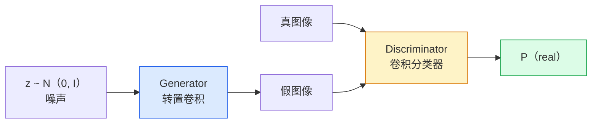
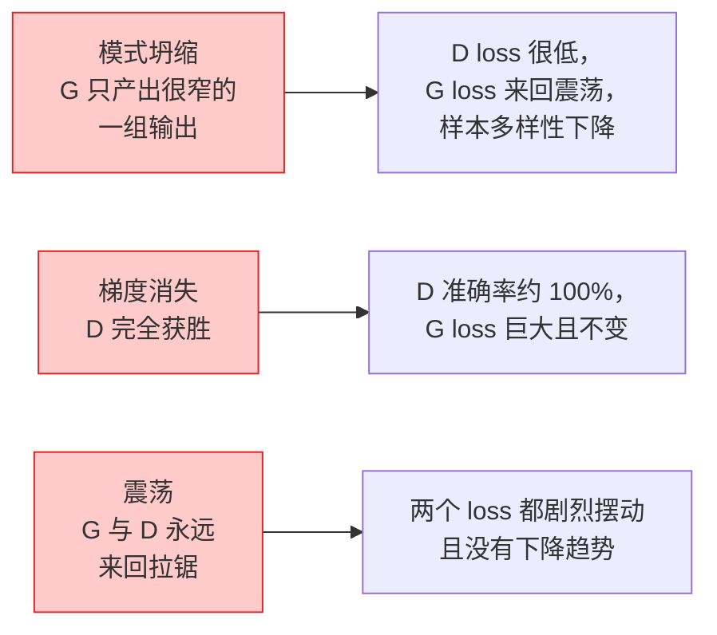

# 图像生成 —— GAN（Image Generation — GANs）

> 译注：本文译自同目录 [`en.md`](./en.md)。术语遵循仓根 [TRANSLATION_GUIDE.md](../../../../TRANSLATION_GUIDE.md)。

> 一个 GAN 就是两个神经网络在打一场固定规则的博弈：一个负责画，一个负责挑刺。它们一起进步，直到画出来的东西能骗过那位评论家。

**Type:** Build
**Languages:** Python
**Prerequisites:** Phase 4 Lesson 03 (CNNs), Phase 3 Lesson 06 (Optimizers), Phase 3 Lesson 07 (Regularization)
**Time:** ~75 minutes

## 学习目标（Learning Objectives）

- 解释生成器与判别器之间的极小极大（minimax）博弈，以及为什么其均衡点对应 p_model = p_data
- 用 PyTorch 在 60 行以内实现一个 DCGAN，让它生成连贯的 32x32 合成图像
- 用三个标准技巧稳定 GAN 训练：non-saturating loss、spectral norm、TTUR（two-timescale update rule，双时间尺度更新规则）
- 通过训练曲线区分健康收敛与 mode collapse、振荡、判别器完全胜出这几种状态

## 问题（The Problem）

分类任务教网络把图像映射到标签。生成任务把问题反过来：采样出看起来像是来自同一分布的新图像。这里没有「正确答案」可供逐项比对，有的只是一个你想要去模仿的分布。

标准的损失函数（MSE、cross-entropy）无法度量「这个样本是不是来自真实分布」。最小化逐像素误差只会得到模糊的平均值，而不是真实样本。突破点在于：把损失也学出来 —— 训练第二个网络专门负责辨别真假，再用它的判断去推动生成器。

GAN（Goodfellow et al., 2014）定义了这套框架。到 2018 年，StyleGAN 就能产出 1024x1024、与照片难以区分的人脸。后来 diffusion 模型在质量与可控性上夺走了王座，但每一个让 diffusion 真正可用的技巧 —— 归一化方式、latent 空间、特征损失 —— 最初都是在 GAN 上理解清楚的。

## 概念（The Concept）

### 两个网络（The two networks）



**生成器（generator）** G 接收一个噪声向量 `z`，输出一张图像。**判别器（discriminator）** D 接收一张图像，输出一个标量：图像为真的概率。

### 博弈（The game）

G 想让 D 出错，D 想答对。形式化地：

```
min_G max_D  E_x[log D(x)] + E_z[log(1 - D(G(z)))]
```

从右往左读：D 在最大化自己在真实样本上的准确率（`log D(real)`）和在伪造样本上的准确率（`log (1 - D(fake))`）。G 则在最小化 D 对伪造样本的准确率 —— 它希望 `D(G(z))` 越高越好。

Goodfellow 证明了这个 minimax 存在一个全局均衡点：`p_G = p_data`，D 在所有点上输出 0.5，生成分布与真实分布之间的 Jensen-Shannon 散度为零。难就难在怎么走到那一步。

### Non-saturating loss

上面这种形式在数值上不稳定。训练初期，对每一个伪造样本 `D(G(z))` 都接近零，于是 `log(1 - D(G(z)))` 关于 G 的梯度会消失。修法是：把 G 的损失翻一面。

```
L_D = -E_x[log D(x)] - E_z[log(1 - D(G(z)))]
L_G = -E_z[log D(G(z))]                          # non-saturating
```

这下当 `D(G(z))` 接近零时，G 的损失值很大，而且梯度信息也很丰富。所有现代 GAN 都用这个变种来训练。

### DCGAN 架构准则（DCGAN architecture rules）

Radford、Metz、Chintala（2015）把多年失败实验提炼成五条让 GAN 训练稳定的规则：

1. 用 strided conv 代替 pooling（两个网络都这样）。
2. 在生成器和判别器中都使用 batch norm，但 G 的输出层和 D 的输入层除外。
3. 在更深的架构里去掉全连接层。
4. G 除输出层外都用 ReLU（输出层用 tanh，把范围压到 [-1, 1]）。
5. D 所有层都用 LeakyReLU（negative_slope=0.2）。

每一个现代基于卷积的 GAN（StyleGAN、BigGAN、GigaGAN）依然以这些规则为起点，每次只替换其中一块。

### 失败模式及其特征（Failure modes and their signatures）



- **Mode collapse（模式坍塌）**：G 找到一张能骗过 D 的图像，然后只生成那一张。修法：加入 minibatch discrimination、spectral norm，或者类别条件化。
- **判别器完全胜出**：D 太快变得过强，G 的梯度消失。修法：缩小 D、降低 D 的学习率，或者在真实标签上做 label smoothing。
- **振荡（Oscillation）**：两网络互相交换胜负，永远逼近不到均衡。修法：TTUR（D 学得比 G 快 2~4 倍），或者切到 Wasserstein loss。

### 评估（Evaluation）

GAN 没有 ground truth，那你怎么知道它在好好工作？

- **样本检视（Sample inspection）** —— 每个 epoch 结束都看一眼 64 张样本。这一步必须做。
- **FID（Fréchet Inception Distance）** —— 真实集合与生成集合在 Inception-v3 特征分布上的距离。越低越好。社区通用标准。
- **Inception Score** —— 比较老、比较脆弱；优先用 FID。
- **生成模型的 Precision/Recall** —— 分别度量质量（precision）与覆盖度（recall）。比单看 FID 更有信息量。

对于一次小规模合成数据训练，样本检视已经够用。

## 动手实现（Build It）

### Step 1: 生成器（Generator）

一个小型 DCGAN 生成器，输入 64 维噪声，输出 32x32 图像。

```python
import torch
import torch.nn as nn

class Generator(nn.Module):
    def __init__(self, z_dim=64, img_channels=3, feat=64):
        super().__init__()
        self.net = nn.Sequential(
            nn.ConvTranspose2d(z_dim, feat * 4, kernel_size=4, stride=1, padding=0, bias=False),
            nn.BatchNorm2d(feat * 4),
            nn.ReLU(inplace=True),
            nn.ConvTranspose2d(feat * 4, feat * 2, kernel_size=4, stride=2, padding=1, bias=False),
            nn.BatchNorm2d(feat * 2),
            nn.ReLU(inplace=True),
            nn.ConvTranspose2d(feat * 2, feat, kernel_size=4, stride=2, padding=1, bias=False),
            nn.BatchNorm2d(feat),
            nn.ReLU(inplace=True),
            nn.ConvTranspose2d(feat, img_channels, kernel_size=4, stride=2, padding=1, bias=False),
            nn.Tanh(),
        )

    def forward(self, z):
        return self.net(z.view(z.size(0), -1, 1, 1))
```

四个 transposed conv，每个都用 `kernel_size=4, stride=2, padding=1`，这样它们都会干净地把空间尺寸翻倍。输出激活通过 tanh 落到 [-1, 1]。

### Step 2: 判别器（Discriminator）

生成器的镜像。LeakyReLU、strided conv，最终输出一个标量 logit。

```python
class Discriminator(nn.Module):
    def __init__(self, img_channels=3, feat=64):
        super().__init__()
        self.net = nn.Sequential(
            nn.Conv2d(img_channels, feat, kernel_size=4, stride=2, padding=1),
            nn.LeakyReLU(0.2, inplace=True),
            nn.Conv2d(feat, feat * 2, kernel_size=4, stride=2, padding=1, bias=False),
            nn.BatchNorm2d(feat * 2),
            nn.LeakyReLU(0.2, inplace=True),
            nn.Conv2d(feat * 2, feat * 4, kernel_size=4, stride=2, padding=1, bias=False),
            nn.BatchNorm2d(feat * 4),
            nn.LeakyReLU(0.2, inplace=True),
            nn.Conv2d(feat * 4, 1, kernel_size=4, stride=1, padding=0),
        )

    def forward(self, x):
        return self.net(x).view(-1)
```

最后一个 conv 把 `4x4` 的 feature map 收成 `1x1`。每张图像输出一个标量；sigmoid 只在计算损失时再加。

### Step 3: 训练步骤（Training step）

交替进行：每个 batch 先更新 D 一次，再更新 G 一次。

```python
import torch.nn.functional as F

def train_step(G, D, real, z, opt_g, opt_d, device):
    real = real.to(device)
    bs = real.size(0)

    # D step
    opt_d.zero_grad()
    d_real = D(real)
    d_fake = D(G(z).detach())
    loss_d = (F.binary_cross_entropy_with_logits(d_real, torch.ones_like(d_real))
              + F.binary_cross_entropy_with_logits(d_fake, torch.zeros_like(d_fake)))
    loss_d.backward()
    opt_d.step()

    # G step
    opt_g.zero_grad()
    d_fake = D(G(z))
    loss_g = F.binary_cross_entropy_with_logits(d_fake, torch.ones_like(d_fake))
    loss_g.backward()
    opt_g.step()

    return loss_d.item(), loss_g.item()
```

D 那一步里的 `G(z).detach()` 至关重要：我们不希望梯度在更新 D 的时候流回 G。忘了这一点是经典新手 bug。

### Step 4: 在合成形状上跑完整训练循环

```python
from torch.utils.data import DataLoader, TensorDataset
import numpy as np

def synthetic_images(num=2000, size=32, seed=0):
    rng = np.random.default_rng(seed)
    imgs = np.zeros((num, 3, size, size), dtype=np.float32) - 1.0
    for i in range(num):
        r = rng.uniform(6, 12)
        cx, cy = rng.uniform(r, size - r, size=2)
        yy, xx = np.meshgrid(np.arange(size), np.arange(size), indexing="ij")
        mask = (xx - cx) ** 2 + (yy - cy) ** 2 < r ** 2
        color = rng.uniform(-0.5, 1.0, size=3)
        for c in range(3):
            imgs[i, c][mask] = color[c]
    return torch.from_numpy(imgs)

device = "cuda" if torch.cuda.is_available() else "cpu"
data = synthetic_images()
loader = DataLoader(TensorDataset(data), batch_size=64, shuffle=True)

G = Generator(z_dim=64, img_channels=3, feat=32).to(device)
D = Discriminator(img_channels=3, feat=32).to(device)
opt_g = torch.optim.Adam(G.parameters(), lr=2e-4, betas=(0.5, 0.999))
opt_d = torch.optim.Adam(D.parameters(), lr=2e-4, betas=(0.5, 0.999))

for epoch in range(10):
    for (batch,) in loader:
        z = torch.randn(batch.size(0), 64, device=device)
        ld, lg = train_step(G, D, batch, z, opt_g, opt_d, device)
    print(f"epoch {epoch}  D {ld:.3f}  G {lg:.3f}")
```

`Adam(lr=2e-4, betas=(0.5, 0.999))` 是 DCGAN 默认配置 —— 较低的 beta1 让动量项不会把对抗博弈稳定得太厉害。

### Step 5: 采样（Sampling）

```python
@torch.no_grad()
def sample(G, n=16, z_dim=64, device="cpu"):
    G.eval()
    z = torch.randn(n, z_dim, device=device)
    imgs = G(z)
    imgs = (imgs + 1) / 2
    return imgs.clamp(0, 1)
```

采样前一定要切到 eval 模式。对 DCGAN 来说这点尤其重要，因为这时会用 batch norm 的运行时统计量而不是当前 batch 的统计量。

### Step 6: Spectral normalisation

判别器里 BN 的即插即用替代品，可以保证网络是 1-Lipschitz 的。能修掉绝大多数「D 赢得太狠」的失败。

```python
from torch.nn.utils import spectral_norm

def build_sn_discriminator(img_channels=3, feat=64):
    return nn.Sequential(
        spectral_norm(nn.Conv2d(img_channels, feat, 4, 2, 1)),
        nn.LeakyReLU(0.2, inplace=True),
        spectral_norm(nn.Conv2d(feat, feat * 2, 4, 2, 1)),
        nn.LeakyReLU(0.2, inplace=True),
        spectral_norm(nn.Conv2d(feat * 2, feat * 4, 4, 2, 1)),
        nn.LeakyReLU(0.2, inplace=True),
        spectral_norm(nn.Conv2d(feat * 4, 1, 4, 1, 0)),
    )
```

把 `Discriminator` 换成 `build_sn_discriminator()`，你常常就不再需要 TTUR 这一招。spectral norm 是你能上的最简单的鲁棒性升级。

## 用起来（Use It）

要做正经的生成，请使用预训练权重，或者切到 diffusion。两个标准库：

- `torch_fidelity` 帮你直接在生成器上算 FID / IS，省得自己写评估代码。
- `pytorch-gan-zoo`（已不再维护）和 `StudioGAN` 提供了经过验证的 DCGAN、WGAN-GP、SN-GAN、StyleGAN、BigGAN 实现。

到了 2026 年，GAN 在以下场景仍是最佳选择：实时图像生成（延迟 <10 ms）、风格迁移、可精细控制的图像到图像翻译（Pix2Pix、CycleGAN）。Diffusion 则在照片级真实度和文本条件化上胜出。

## 上线部署（Ship It）

本课产出：

- `outputs/prompt-gan-training-triage.md` —— 一个 prompt：读入训练曲线描述，挑出失败模式（mode collapse、D-wins、振荡），并给出唯一推荐修法。
- `outputs/skill-dcgan-scaffold.md` —— 一个 skill：根据 `z_dim`、目标 `image_size` 和 `num_channels` 写出一个 DCGAN 脚手架，含训练循环和采样保存。

## 练习（Exercises）

1. **（简单）** 在合成圆形数据集上训练上面这个 DCGAN，每个 epoch 结束保存一张 16 样本网格图。到第几个 epoch，生成出来的圆才明显是圆了？
2. **（中等）** 把判别器的 batch norm 换成 spectral norm。两个版本并排训练。哪个收敛更快？哪个在三个种子上方差更小？
3. **（困难）** 实现一个条件版 DCGAN：把类别标签同时喂给 G 和 D（在 G 中把 one-hot 拼接到噪声里，在 D 中把一个类别 embedding 通道拼进去）。在 lesson 7 的合成「圆 vs 方」数据集上训练，并通过指定标签采样来证明类别条件化生效。

## 关键术语（Key Terms）

| 术语 | 大家口中的说法 | 实际含义 |
|------|----------------|----------------------|
| Generator (G) | 「画东西的网络」 | 把噪声映射成图像；训练目标是骗过 discriminator |
| Discriminator (D) | 「评论家」 | 二分类器；训练目标是把真实图像和生成图像区分开 |
| Minimax | 「这场博弈」 | 在对抗损失上 min over G、max over D；均衡点是 p_G = p_data |
| Non-saturating loss | 「数值上更靠谱的版本」 | G 的损失是 -log(D(G(z)))，而不是 log(1 - D(G(z)))，避免训练初期梯度消失 |
| Mode collapse | 「生成器只画一样东西」 | G 只产出数据分布的一个小子集；用 SN、minibatch discrimination 或更大 batch 修复 |
| TTUR | 「两个学习率」 | D 学得比 G 快，通常是 2~4 倍；让训练更稳 |
| Spectral norm | 「1-Lipschitz 层」 | 一种权重归一化方法，限定每一层的 Lipschitz 常数；阻止 D 变得任意陡峭 |
| FID | 「Fréchet Inception Distance」 | 真实集合与生成集合在 Inception-v3 特征分布上的距离；标准评估指标 |

## 延伸阅读（Further Reading）

- [Generative Adversarial Networks (Goodfellow et al., 2014)](https://arxiv.org/abs/1406.2661) —— 一切的开端
- [DCGAN (Radford, Metz, Chintala, 2015)](https://arxiv.org/abs/1511.06434) —— 让 GAN 真正可训练的架构准则
- [Spectral Normalization for GANs (Miyato et al., 2018)](https://arxiv.org/abs/1802.05957) —— 单个最有用的稳定化技巧
- [StyleGAN3 (Karras et al., 2021)](https://arxiv.org/abs/2106.12423) —— SOTA GAN；读起来像是过去十年所有技巧的精选合辑
