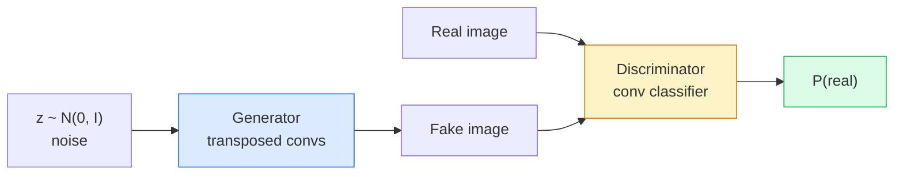
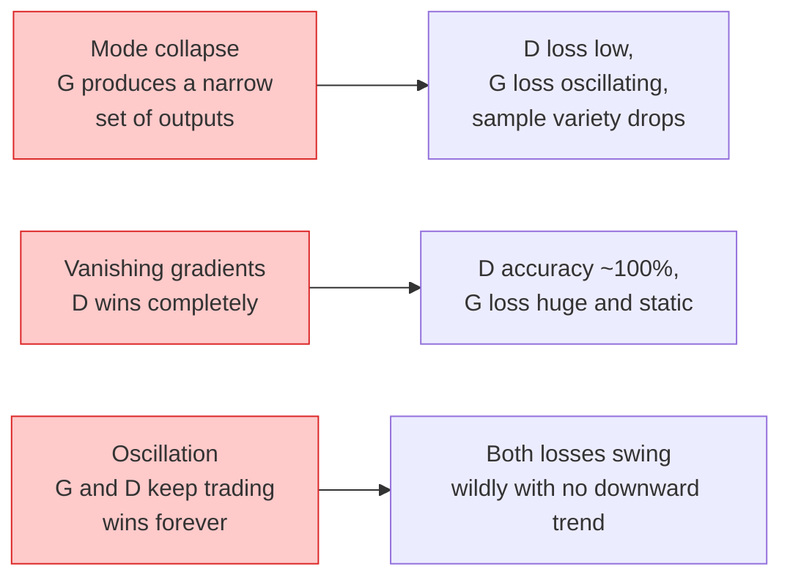

# 09 · 图像生成 —— GAN

> 一个 GAN 就是处于固定博弈中的两个神经网络。一个负责作画，一个负责挑刺。它们一起变强，直到画作骗过评审。

**类型：** 实战构建
**语言：** Python
**前置：** 第 4 阶段第 03 课（CNN）、第 3 阶段第 06 课（优化器）、第 3 阶段第 07 课（正则化）
**时长：** 约 75 分钟

## 学习目标

- 解释生成器与判别器之间的「极小极大博弈（minimax game）」，以及为何其均衡点对应 p_model = p_data
- 在 PyTorch 中实现一个 DCGAN，用不到 60 行代码让它生成连贯的 32x32 合成图像
- 用三个标准技巧稳定 GAN 训练：「非饱和损失（non-saturating loss）」、「谱归一化（spectral norm）」、「TTUR（two-timescale update rule，双时间尺度更新规则）」
- 学会读懂训练曲线，分辨健康收敛与「模式坍塌（mode collapse）」、振荡、判别器完胜这几种情况

## 问题所在

分类任务教会网络把图像映射到标签。生成任务则把问题反过来：采样出看起来像出自同一分布的新图像。这里没有可供逐项比对的「正确」输出，只有一个你想要模仿的分布。

标准损失函数（MSE、交叉熵）无法度量「这个样本是否来自真实分布」。最小化逐像素误差只会产生模糊的平均图像，而非逼真的样本。突破点在于学习这个损失：训练第二个网络，它的工作就是区分真假，并用它的判断来推动生成器。

GAN（Goodfellow 等人，2014）定义了这套框架。到 2018 年，StyleGAN 已能生成与照片无法区分的 1024x1024 人脸。此后扩散模型（diffusion models）在质量和可控性上夺得王座，但让扩散模型变得实用的每一个技巧——归一化选择、潜空间、特征损失——最早都是在 GAN 上被理解透彻的。

## 核心概念

### 两个网络



**生成器（generator）** G 接收一个噪声向量 `z` 并输出一张图像。**判别器（discriminator）** D 接收一张图像并输出单个标量：该图像为真的概率。

### 博弈

G 希望 D 判断错误。D 希望判断正确。形式化地：

```
min_G max_D  E_x[log D(x)] + E_z[log(1 - D(G(z)))]
```

从右往左读：D 在最大化对真实图像（`log D(real)`）和虚假图像（`log (1 - D(fake))`）的判断准确率。G 在最小化 D 对虚假图像的准确率——它希望 `D(G(z))` 很高。

Goodfellow 证明了这个极小极大博弈存在一个全局均衡，此时 `p_G = p_data`，D 在任何地方都输出 0.5，生成分布与真实分布之间的「Jensen-Shannon 散度（Jensen-Shannon divergence）」为零。难点在于如何抵达那里。

### 非饱和损失

上面的形式在数值上不稳定。训练初期，每个虚假样本的 `D(G(z))` 都接近零，因此 `log(1 - D(G(z)))` 对 G 的梯度趋于消失。解决办法：翻转 G 的损失。

```
L_D = -E_x[log D(x)] - E_z[log(1 - D(G(z)))]
L_G = -E_z[log D(G(z))]                          # non-saturating
```

现在当 `D(G(z))` 接近零时，G 的损失很大，其梯度也包含有效信息。每一个现代 GAN 都采用这个变体进行训练。

### DCGAN 架构准则

Radford、Metz、Chintala（2015）把多年失败实验提炼成五条让 GAN 训练稳定的准则：

1. 用带步幅的卷积替换池化（两个网络都如此）。
2. 在生成器和判别器中都使用批归一化（batch norm），但 G 的输出层和 D 的输入层除外。
3. 在更深的架构中去掉全连接层。
4. G 除输出层外的所有层都用 ReLU（输出层用 tanh，取值范围 [-1, 1]）。
5. D 的所有层都用 LeakyReLU（negative_slope=0.2）。

每一个现代基于卷积的 GAN（StyleGAN、BigGAN、GigaGAN）仍以这些准则为起点，再逐项替换其中的组件。

### 失败模式及其特征



- **模式坍塌（mode collapse）**：G 找到一张能骗过 D 的图像，便只生成这一张。解决办法：加入「小批量判别（minibatch discrimination）」、谱归一化或标签条件化。
- **判别器完胜**：D 变强得太快太多，G 的梯度消失。解决办法：缩小 D、降低 D 的学习率，或对真实标签施加「标签平滑（label smoothing）」。
- **振荡**：两个网络不断互有胜负，却始终逼近不了均衡。解决办法：TTUR（D 的学习速度比 G 快 2-4 倍），或改用「Wasserstein 损失（Wasserstein loss）」。

### 评估

GAN 没有真值，那你怎么知道它在正常工作？

- **样本检查**——就在每个 epoch 结束时看 64 张样本。这一步不可省。
- **FID（Fréchet Inception Distance，弗雷歇 Inception 距离）**——真实集与生成集在 Inception-v3 特征分布之间的距离。越低越好。社区标准。
- **Inception Score（Inception 分数）**——更早期、更脆弱；优先用 FID。
- **生成模型的精确率/召回率（Precision/Recall）**——分别度量质量（精确率）与覆盖度（召回率）。比单独用 FID 更有信息量。

对于小规模合成数据的运行来说，样本检查就足够了。

## 动手构建

### 第 1 步：生成器

一个小型 DCGAN 生成器，接收 64 维噪声并产出一张 32x32 图像。

```python
import torch
import torch.nn as nn

class Generator(nn.Module):
    def __init__(self, z_dim=64, img_channels=3, feat=64):
        super().__init__()
        self.net = nn.Sequential(
            nn.ConvTranspose2d(z_dim, feat * 4, kernel_size=4, stride=1, padding=0, bias=False),
            nn.BatchNorm2d(feat * 4),
            nn.ReLU(inplace=True),
            nn.ConvTranspose2d(feat * 4, feat * 2, kernel_size=4, stride=2, padding=1, bias=False),
            nn.BatchNorm2d(feat * 2),
            nn.ReLU(inplace=True),
            nn.ConvTranspose2d(feat * 2, feat, kernel_size=4, stride=2, padding=1, bias=False),
            nn.BatchNorm2d(feat),
            nn.ReLU(inplace=True),
            nn.ConvTranspose2d(feat, img_channels, kernel_size=4, stride=2, padding=1, bias=False),
            nn.Tanh(),
        )

    def forward(self, z):
        return self.net(z.view(z.size(0), -1, 1, 1))
```

四个转置卷积，每个都用 `kernel_size=4, stride=2, padding=1`，从而干净利落地将空间尺寸翻倍。输出激活通过 tanh 落在 [-1, 1] 区间。

### 第 2 步：判别器

生成器的镜像。LeakyReLU、带步幅的卷积，以一个标量 logit 结尾。

```python
class Discriminator(nn.Module):
    def __init__(self, img_channels=3, feat=64):
        super().__init__()
        self.net = nn.Sequential(
            nn.Conv2d(img_channels, feat, kernel_size=4, stride=2, padding=1),
            nn.LeakyReLU(0.2, inplace=True),
            nn.Conv2d(feat, feat * 2, kernel_size=4, stride=2, padding=1, bias=False),
            nn.BatchNorm2d(feat * 2),
            nn.LeakyReLU(0.2, inplace=True),
            nn.Conv2d(feat * 2, feat * 4, kernel_size=4, stride=2, padding=1, bias=False),
            nn.BatchNorm2d(feat * 4),
            nn.LeakyReLU(0.2, inplace=True),
            nn.Conv2d(feat * 4, 1, kernel_size=4, stride=1, padding=0),
        )

    def forward(self, x):
        return self.net(x).view(-1)
```

最后一个卷积把 `4x4` 特征图缩减到 `1x1`。每张图像输出单个标量；只在计算损失时才施加 sigmoid。

### 第 3 步：训练步骤

交替进行：每个批次先更新一次 D，再更新一次 G。

```python
import torch.nn.functional as F

def train_step(G, D, real, z, opt_g, opt_d, device):
    real = real.to(device)
    bs = real.size(0)

    # D 的更新步
    opt_d.zero_grad()
    d_real = D(real)
    d_fake = D(G(z).detach())
    loss_d = (F.binary_cross_entropy_with_logits(d_real, torch.ones_like(d_real))
              + F.binary_cross_entropy_with_logits(d_fake, torch.zeros_like(d_fake)))
    loss_d.backward()
    opt_d.step()

    # G 的更新步
    opt_g.zero_grad()
    d_fake = D(G(z))
    loss_g = F.binary_cross_entropy_with_logits(d_fake, torch.ones_like(d_fake))
    loss_g.backward()
    opt_g.step()

    return loss_d.item(), loss_g.item()
```

D 更新步中的 `G(z).detach()` 至关重要：我们不希望在更新 D 时梯度回流进 G。忘掉这一点是新手的经典错误。

### 第 4 步：在合成形状上的完整训练循环

```python
from torch.utils.data import DataLoader, TensorDataset
import numpy as np

def synthetic_images(num=2000, size=32, seed=0):
    rng = np.random.default_rng(seed)
    imgs = np.zeros((num, 3, size, size), dtype=np.float32) - 1.0
    for i in range(num):
        r = rng.uniform(6, 12)
        cx, cy = rng.uniform(r, size - r, size=2)
        yy, xx = np.meshgrid(np.arange(size), np.arange(size), indexing="ij")
        mask = (xx - cx) ** 2 + (yy - cy) ** 2 < r ** 2
        color = rng.uniform(-0.5, 1.0, size=3)
        for c in range(3):
            imgs[i, c][mask] = color[c]
    return torch.from_numpy(imgs)

device = "cuda" if torch.cuda.is_available() else "cpu"
data = synthetic_images()
loader = DataLoader(TensorDataset(data), batch_size=64, shuffle=True)

G = Generator(z_dim=64, img_channels=3, feat=32).to(device)
D = Discriminator(img_channels=3, feat=32).to(device)
opt_g = torch.optim.Adam(G.parameters(), lr=2e-4, betas=(0.5, 0.999))
opt_d = torch.optim.Adam(D.parameters(), lr=2e-4, betas=(0.5, 0.999))

for epoch in range(10):
    for (batch,) in loader:
        z = torch.randn(batch.size(0), 64, device=device)
        ld, lg = train_step(G, D, batch, z, opt_g, opt_d, device)
    print(f"epoch {epoch}  D {ld:.3f}  G {lg:.3f}")
```

`Adam(lr=2e-4, betas=(0.5, 0.999))` 是 DCGAN 的默认配置——较低的 beta1 可以避免动量项把这场对抗博弈稳定得过头。

### 第 5 步：采样

```python
@torch.no_grad()
def sample(G, n=16, z_dim=64, device="cpu"):
    G.eval()
    z = torch.randn(n, z_dim, device=device)
    imgs = G(z)
    imgs = (imgs + 1) / 2
    return imgs.clamp(0, 1)
```

采样前一定要切换到 eval 模式。对 DCGAN 而言这很重要，因为此时批归一化会使用其运行统计量，而非当前批次的统计量。

### 第 6 步：谱归一化

它可以直接替换判别器中的 BN，保证网络是 1-Lipschitz 的。修复绝大多数「D 太强」的失败情形。

```python
from torch.nn.utils import spectral_norm

def build_sn_discriminator(img_channels=3, feat=64):
    return nn.Sequential(
        spectral_norm(nn.Conv2d(img_channels, feat, 4, 2, 1)),
        nn.LeakyReLU(0.2, inplace=True),
        spectral_norm(nn.Conv2d(feat, feat * 2, 4, 2, 1)),
        nn.LeakyReLU(0.2, inplace=True),
        spectral_norm(nn.Conv2d(feat * 2, feat * 4, 4, 2, 1)),
        nn.LeakyReLU(0.2, inplace=True),
        spectral_norm(nn.Conv2d(feat * 4, 1, 4, 1, 0)),
    )
```

把 `Discriminator` 换成 `build_sn_discriminator()`，你往往就不再需要 TTUR 技巧了。谱归一化是你能应用的最简单的单项鲁棒性升级。

## 实际运用

要做正经的生成，请使用预训练权重或改用扩散模型。两个标准库：

- `torch_fidelity` 可以为你的生成器计算 FID / IS，无需自己写评估代码。
- `pytorch-gan-zoo`（已停止维护）和 `StudioGAN` 提供了 DCGAN、WGAN-GP、SN-GAN、StyleGAN 和 BigGAN 的经测试实现。

在 2026 年，GAN 在以下场景仍是最佳选择：实时图像生成（延迟 <10 ms）、风格迁移、需要精确控制的图到图转换（Pix2Pix、CycleGAN）。扩散模型则在照片级真实感和文本条件化上胜出。

## 交付物

本课产出：

- `outputs/prompt-gan-training-triage.md`——一个提示词，读取一段训练曲线描述，挑出对应的失败模式（模式坍塌、D 完胜、振荡），并给出单条推荐修复方案。
- `outputs/skill-dcgan-scaffold.md`——一个技能，根据 `z_dim`、目标 `image_size` 和 `num_channels` 写出一份 DCGAN 脚手架，包含训练循环和样本保存器。

## 练习

1. **（简单）** 在合成圆形数据集上训练上面的 DCGAN，并在每个 epoch 结束时保存一张包含 16 个样本的网格图。到第几个 epoch，生成的圆形才明显变圆？
2. **（中等）** 把判别器的批归一化替换为谱归一化。把两个版本并排训练。哪一个收敛更快？哪一个在三个随机种子上的方差更低？
3. **（困难）** 实现一个条件 DCGAN：把类别标签喂给 G 和 D（在 G 中把 one-hot 拼接到噪声上，在 D 中拼接一个类别嵌入通道）。在第 7 课的合成「圆形 vs 方形」数据集上训练，并通过指定标签采样来证明类别条件化生效。

## 关键术语

| 术语 | 人们怎么说 | 它实际指什么 |
|------|----------------|----------------------|
| 生成器（Generator, G） | “画东西的网络” | 把噪声映射为图像；训练目标是骗过判别器 |
| 判别器（Discriminator, D） | “评审” | 二分类器；训练目标是区分真实图像与生成图像 |
| 极小极大（Minimax） | “博弈” | 对一个对抗损失，G 取极小、D 取极大；均衡点为 p_G = p_data |
| 非饱和损失（Non-saturating loss） | “数值上靠谱的版本” | G 的损失是 -log(D(G(z)))，而非 log(1 - D(G(z)))，以避免训练早期梯度消失 |
| 模式坍塌（Mode collapse） | “生成器只会做一种东西” | G 只产出数据分布的一小部分；用谱归一化、小批量判别或更大批量来修复 |
| TTUR | “两个学习率” | D 比 G 学得快，通常快 2-4 倍；稳定训练 |
| 谱归一化（Spectral norm） | “1-Lipschitz 层” | 一种权重归一化，约束每层的 Lipschitz 常数；阻止 D 变得任意陡峭 |
| FID | “Fréchet Inception 距离” | 真实集与生成集在 Inception-v3 特征分布间的距离；标准评估指标 |

## 延伸阅读

- [Generative Adversarial Networks (Goodfellow et al., 2014)](https://arxiv.org/abs/1406.2661)——开创这一切的论文
- [DCGAN (Radford, Metz, Chintala, 2015)](https://arxiv.org/abs/1511.06434)——让 GAN 可训练的架构准则
- [Spectral Normalization for GANs (Miyato et al., 2018)](https://arxiv.org/abs/1802.05957)——最有用的单项稳定技巧
- [StyleGAN3 (Karras et al., 2021)](https://arxiv.org/abs/2106.12423)——SOTA GAN；读起来像是过去十年所有技巧的精选合辑
