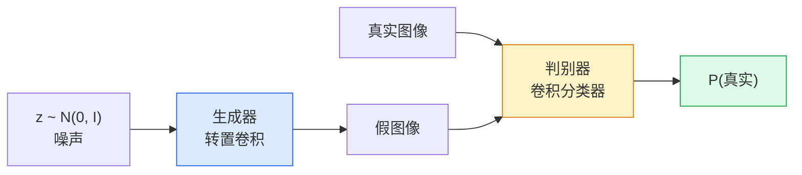
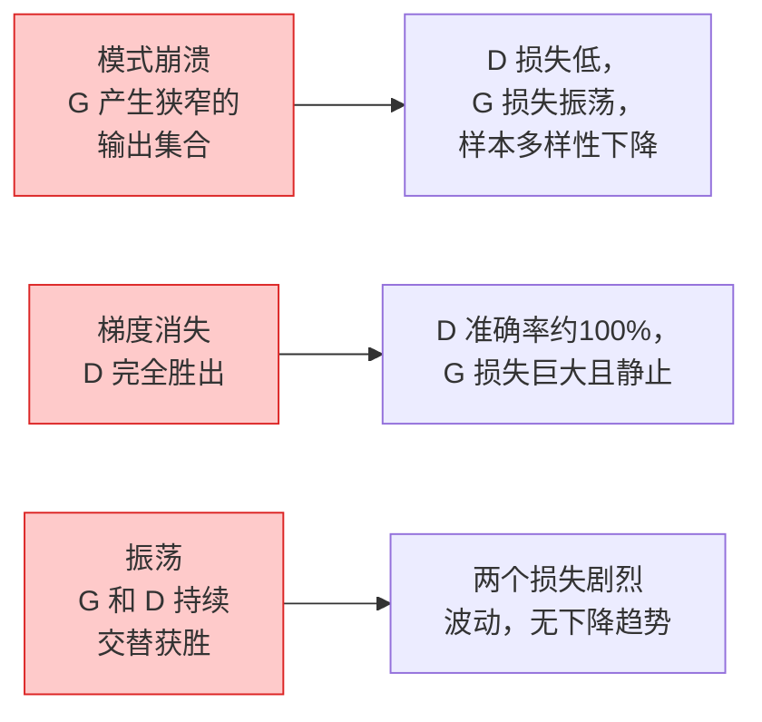

# 图像生成——生成对抗网络（GANs）

> GAN是两个神经网络在进行一场固定游戏。一个负责绘制，一个负责评判。它们共同进步，直到绘制的图像能骗过评判者。

**类型：** 构建
**语言：** Python
**前置知识：** 第四阶段第03课（卷积神经网络CNN）、第三阶段第06课（优化器）、第三阶段第07课（正则化）
**时长：** 约75分钟

## 学习目标

- 解释生成器和判别器之间的极小极大博弈，以及为什么平衡点对应 `p_model = p_data`
- 使用PyTorch实现一个深度卷积生成对抗网络（DCGAN），并在60行代码内生成连贯的32x32合成图像
- 使用三种标准技巧稳定GAN训练：非饱和损失、谱归一化、双时间尺度更新规则（TTUR）
- 阅读训练曲线，区分健康收敛与模式崩溃、振荡、判别器完全胜出等情况

## 问题

分类任务教会网络将图像映射到标签。生成则反其道而行之：采样出看起来来自同一分布的新图像。没有可以对比的"正确"输出；只有你想要模仿的分布。

标准损失函数（均方误差MSE、交叉熵）无法衡量"这个样本是否来自真实分布"。最小化逐像素误差会产生模糊的平均值，而不是逼真的样本。突破在于学习损失：训练第二个网络，其任务是从假图像中辨别真图像，并利用它的判断来推动生成器。

生成对抗网络（GANs, Goodfellow等人，2014）定义了该框架。到2018年，StyleGAN已经能够生成1024x1024且与照片无法区分的人脸。扩散模型随后在质量和可控性上占据了王座，但使扩散变得实用的每一个技巧——归一化选择、潜在空间、特征损失——都是首先在GAN上被理解。

## 概念

### 两个网络



**生成器** G 接收一个噪声向量 `z` 并输出一张图像。**判别器** D 接收一张图像并输出一个标量：该图像为真实的概率。

### 博弈

G 希望 D 犯错。D 希望正确。形式上：

```
min_G max_D  E_x[log D(x)] + E_z[log(1 - D(G(z)))]
```

从右向左解读：D 在最大化对真实图像（`log D(real)`）和假图像（`log (1 - D(fake))`）的分类准确率。G 则在最小化 D 对假图像的准确率——它希望 `D(G(z))` 的值很高。

Goodfellow 证明了这个极小极大博弈存在一个全局平衡点：此时 `p_G = p_data`，D 在任何地方输出 0.5，生成分布与真实分布之间的 Jensen-Shannon 散度为零。难点在于如何达到这个平衡点。

### 非饱和损失

上面的形式在数值上不稳定。训练早期，`D(G(z))` 对于每个假图像都接近零，因此 `log(1 - D(G(z)))` 关于 G 的梯度会消失。解决办法：翻转 G 的损失。

```
L_D = -E_x[log D(x)] - E_z[log(1 - D(G(z)))]
L_G = -E_z[log D(G(z))]                          # 非饱和
```

现在当 `D(G(z))` 接近零时，G 的损失很大，其梯度也具有信息量。所有现代 GAN 都使用这种变体进行训练。

### DCGAN 架构规则

Radford, Metz, Chintala（2015）将多年的失败实验浓缩为五条规则，使 GAN 训练更加稳定：

1. 用步长卷积替换池化层（两个网络都适用）。
2. 在生成器和判别器中都使用批归一化，但生成器输出和判别器输入除外。
3. 在更深层的架构中移除全连接层。
4. G 在所有层使用 ReLU（输出层用 tanh，输出范围在[-1, 1]）。
5. D 在所有层使用 LeakyReLU（negative_slope=0.2）。

每一个基于卷积的现代 GAN（StyleGAN, BigGAN, GigaGAN）仍然从这些规则出发，然后逐一替换部件。

### 失败模式及其特征



- **模式崩溃**：G 找到一张能骗过 D 的图像，然后只生成这一张。解决方法：使用小批量判别、谱归一化或标签条件。
- **判别器胜出**：D 变得太强太快，G 的梯度消失。解决方法：减小 D 的规模、降低 D 的学习率，或在真实标签上应用标签平滑。
- **振荡**：两个网络交替获胜，从未接近平衡点。解决方法：使用双时间尺度更新规则（TTUR，D 比 G 快 2-4 倍），或切换到 Wasserstein 损失。

### 评估

GAN 没有真实标签，那么如何知道它们是否工作正常？

- **样本检查**——在每个 epoch 结束时查看 64 个样本。这是不可妥协的。
- **FID（弗雷歇起始距离）**——真实集和生成集的 Inception-v3 特征分布之间的距离。越低越好。社区标准。
- **IS（起始分数）**——较老，更脆弱；优先使用 FID。
- **生成模型的精确率/召回率**——分别衡量质量（精确率）和覆盖度（召回率）。比单独的 FID 更有信息量。

对于小型合成数据运行，样本检查就足够了。

## 动手构建

### 第一步：生成器

一个小型 DCGAN 生成器，接收 64 维噪声并生成 32x32 图像。

```python
import torch
import torch.nn as nn

class Generator(nn.Module):
    def __init__(self, z_dim=64, img_channels=3, feat=64):
        super().__init__()
        self.net = nn.Sequential(
            nn.ConvTranspose2d(z_dim, feat * 4, kernel_size=4, stride=1, padding=0, bias=False),
            nn.BatchNorm2d(feat * 4),
            nn.ReLU(inplace=True),
            nn.ConvTranspose2d(feat * 4, feat * 2, kernel_size=4, stride=2, padding=1, bias=False),
            nn.BatchNorm2d(feat * 2),
            nn.ReLU(inplace=True),
            nn.ConvTranspose2d(feat * 2, feat, kernel_size=4, stride=2, padding=1, bias=False),
            nn.BatchNorm2d(feat),
            nn.ReLU(inplace=True),
            nn.ConvTranspose2d(feat, img_channels, kernel_size=4, stride=2, padding=1, bias=False),
            nn.Tanh(),
        )

    def forward(self, z):
        return self.net(z.view(z.size(0), -1, 1, 1))
```

四个转置卷积，每个都带有 `kernel_size=4, stride=2, padding=1`，从而干净地将空间尺寸翻倍。输出激活函数通过 tanh 映射到[-1, 1]。

### 第二步：判别器

生成器的镜像。使用 LeakyReLU、步长卷积，最终输出一个标量 logit。

```python
class Discriminator(nn.Module):
    def __init__(self, img_channels=3, feat=64):
        super().__init__()
        self.net = nn.Sequential(
            nn.Conv2d(img_channels, feat, kernel_size=4, stride=2, padding=1),
            nn.LeakyReLU(0.2, inplace=True),
            nn.Conv2d(feat, feat * 2, kernel_size=4, stride=2, padding=1, bias=False),
            nn.BatchNorm2d(feat * 2),
            nn.LeakyReLU(0.2, inplace=True),
            nn.Conv2d(feat * 2, feat * 4, kernel_size=4, stride=2, padding=1, bias=False),
            nn.BatchNorm2d(feat * 4),
            nn.LeakyReLU(0.2, inplace=True),
            nn.Conv2d(feat * 4, 1, kernel_size=4, stride=1, padding=0),
        )

    def forward(self, x):
        return self.net(x).view(-1)
```

最后一个卷积将 `4x4` 的特征图缩小为 `1x1`。输出是每张图像的一个标量；在损失计算时才应用 sigmoid。

### 第三步：训练步骤

交替进行：每个 batch 先更新一次 D，然后更新一次 G。

```python
import torch.nn.functional as F

def train_step(G, D, real, z, opt_g, opt_d, device):
    real = real.to(device)
    bs = real.size(0)

    # D 步骤
    opt_d.zero_grad()
    d_real = D(real)
    d_fake = D(G(z).detach())
    loss_d = (F.binary_cross_entropy_with_logits(d_real, torch.ones_like(d_real))
              + F.binary_cross_entropy_with_logits(d_fake, torch.zeros_like(d_fake)))
    loss_d.backward()
    opt_d.step()

    # G 步骤
    opt_g.zero_grad()
    d_fake = D(G(z))
    loss_g = F.binary_cross_entropy_with_logits(d_fake, torch.ones_like(d_fake))
    loss_g.backward()
    opt_g.step()

    return loss_d.item(), loss_g.item()
```

在 D 步骤中使用 `G(z).detach()` 至关重要：我们不希望在更新 G 时让梯度流入 G。忘记这一点是经典的新手错误。

### 第四步：在合成形状上的完整训练循环

```python
from torch.utils.data import DataLoader, TensorDataset
import numpy as np

def synthetic_images(num=2000, size=32, seed=0):
    rng = np.random.default_rng(seed)
    imgs = np.zeros((num, 3, size, size), dtype=np.float32) - 1.0
    for i in range(num):
        r = rng.uniform(6, 12)
        cx, cy = rng.uniform(r, size - r, size=2)
        yy, xx = np.meshgrid(np.arange(size), np.arange(size), indexing="ij")
        mask = (xx - cx) ** 2 + (yy - cy) ** 2 < r ** 2
        color = rng.uniform(-0.5, 1.0, size=3)
        for c in range(3):
            imgs[i, c][mask] = color[c]
    return torch.from_numpy(imgs)

device = "cuda" if torch.cuda.is_available() else "cpu"
data = synthetic_images()
loader = DataLoader(TensorDataset(data), batch_size=64, shuffle=True)

G = Generator(z_dim=64, img_channels=3, feat=32).to(device)
D = Discriminator(img_channels=3, feat=32).to(device)
opt_g = torch.optim.Adam(G.parameters(), lr=2e-4, betas=(0.5, 0.999))
opt_d = torch.optim.Adam(D.parameters(), lr=2e-4, betas=(0.5, 0.999))

for epoch in range(10):
    for (batch,) in loader:
        z = torch.randn(batch.size(0), 64, device=device)
        ld, lg = train_step(G, D, batch, z, opt_g, opt_d, device)
    print(f"epoch {epoch}  D {ld:.3f}  G {lg:.3f}")
```

`Adam(lr=2e-4, betas=(0.5, 0.999))` 是 DCGAN 的默认设置——较低的 beta1 可以防止动量项过于稳定对抗博弈。

### 第五步：采样

```python
@torch.no_grad()
def sample(G, n=16, z_dim=64, device="cpu"):
    G.eval()
    z = torch.randn(n, z_dim, device=device)
    imgs = G(z)
    imgs = (imgs + 1) / 2
    return imgs.clamp(0, 1)
```

在采样前始终切换到 eval 模式。对于 DCGAN，这一点很重要，因为会使用批归一化的运行统计量而不是当前 batch 的统计量。

### 第六步：谱归一化

判别器中批归一化的即插即用替代方案，保证网络是 1-Lipschitz 的。可以解决大多数"D 过于强势"的失败。

```python
from torch.nn.utils import spectral_norm

def build_sn_discriminator(img_channels=3, feat=64):
    return nn.Sequential(
        spectral_norm(nn.Conv2d(img_channels, feat, 4, 2, 1)),
        nn.LeakyReLU(0.2, inplace=True),
        spectral_norm(nn.Conv2d(feat, feat * 2, 4, 2, 1)),
        nn.LeakyReLU(0.2, inplace=True),
        spectral_norm(nn.Conv2d(feat * 2, feat * 4, 4, 2, 1)),
        nn.LeakyReLU(0.2, inplace=True),
        spectral_norm(nn.Conv2d(feat * 4, 1, 4, 1, 0)),
    )
```

用 `build_sn_discriminator()` 替换 `Discriminator`，你通常就不再需要 TTUR 技巧。谱归一化是你能应用的最简单的单一鲁棒性升级。

## 投入使用

对于严肃的生成任务，请使用预训练权重或切换到扩散模型。两个标准库：

- `torch_fidelity` 可以在不编写自定义评估代码的情况下计算你生成器的 FID / IS。
- `pytorch-gan-zoo`（旧版）和 `StudioGAN` 提供了经过测试的 DCGAN、WGAN-GP、SN-GAN、StyleGAN 和 BigGAN 实现。

在2026年，GAN 仍然是以下任务的最佳选择：实时图像生成（延迟低于10毫秒）、风格迁移、具有精确控制的图像到图像转换（Pix2Pix, CycleGAN）。扩散模型在照片真实感和文本条件生成方面胜出。

## 交付物

本课产生：

- `outputs/prompt-gan-training-triage.md` — 一个提示（prompt），读取训练曲线描述并选择失败模式（模式崩溃、D 胜出、振荡）以及推荐的单个修复方法。
- `outputs/skill-dcgan-scaffold.md` — 一个技能（skill），根据 `z_dim`、目标 `image_size` 和 `num_channels` 编写 DCGAN 脚手架，包括训练循环和样本保存器。

## 练习

1. **（简单）** 在合成圆形数据集上训练上述 DCGAN，并在每个 epoch 结束时保存一个包含16个样本的网格。到第几个 epoch 时，生成的圆形变得明显呈圆形？
2. **（中等）** 将判别器的批归一化替换为谱归一化。并排训练两个版本。哪个收敛更快？哪个跨三个种子的方差更低？
3. **（困难）** 实现条件 DCGAN：将类别标签输入 G 和 D（在 G 中将 one-hot 向量与噪声拼接，在 D 中添加一个类别嵌入通道）。在第7课的合成"圆形 vs 方形"数据集上训练，并通过使用特定标签采样证明类别条件化有效。

## 关键术语

| 术语 | 人们常说的 | 实际含义 |
|------|-----------|---------|
| 生成器 (G) | "画东西的网络" | 将噪声映射到图像；训练目标是欺骗判别器 |
| 判别器 (D) | "评判者" | 二分类器；训练目标是区分真实图像和生成图像 |
| 极小极大 | "博弈" | 对对抗损失在 G 上最小化、在 D 上最大化；平衡点为 p_G = p_data |
| 非饱和损失 | "数值上更合理的版本" | G 的损失为 -log(D(G(z))) 而非 log(1 - D(G(z)))，以避免训练早期梯度消失 |
| 模式崩溃 | "生成器只生成一种东西" | G 只产生数据分布的一个小子集；通过 SN、小批量判别或更大 batch 修复 |
| 双时间尺度更新规则 (TTUR) | "两个学习率" | D 比 G 学习更快，通常快 2-4 倍；稳定训练 |
| 谱归一化 | "1-Lipschitz 层" | 一种权重归一化，约束每层的 Lipschitz 常数；防止