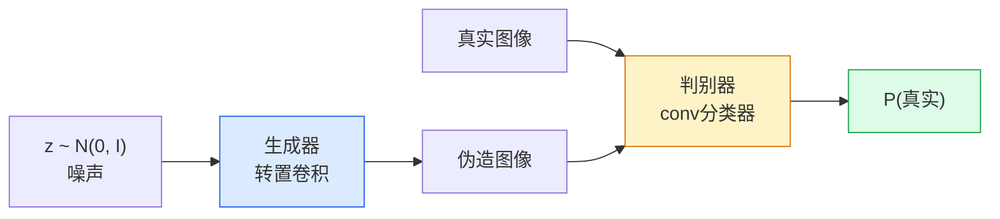
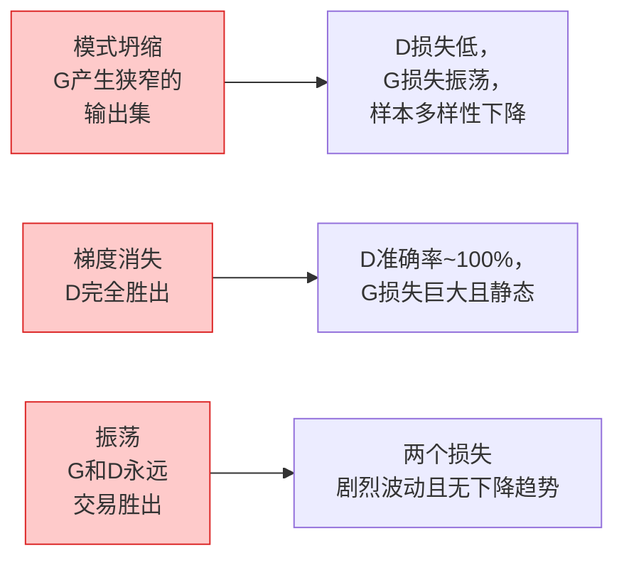

# 图像生成 — GAN

> GAN是两个神经网络在一个固定博弈中。一个绘制，一个评论。它们一起变得更好，直到绘制作品能骗过评论家。

**类型：** 构建
**语言：** Python
**前置条件：** 阶段4 第03课（CNN），阶段3 第06课（优化器），阶段3 第07课（正则化）
**时间：** ~75分钟

## 学习目标

- 解释生成器和判别器之间的极小极大博弈，以及为什么均衡对应于p_model = p_data
- 在PyTorch中实现DCGAN，并在60行代码内生成连贯的32x32合成图像
- 使用三个标准技巧稳定GAN训练：非饱和损失、spectral norm、TTUR（双时间尺度更新规则）
- 读取区分健康收敛与模式坍缩、振荡和判别器完全胜出的训练曲线

## 问题

分类教会网络将图像映射到标签。生成则反转了问题：采样看起来来自同一分布的新图像。没有可以比较差异的"正确"输出；只有你想要模仿的分布。

标准损失函数（MSE、交叉熵）无法衡量"这个样本是否来自真实分布。"最小化逐像素误差会产生模糊的平均值，而不是逼真的样本。突破在于学习损失：训练第二个网络，其工作是区分真假，并用它的判断来推动生成器。

GAN（Goodfellow等人，2014）定义了那个框架。到2018年，StyleGAN已经能生成与照片无法区分的1024x1024人脸。扩散模型此后在质量和可控性上占据了王座，但使扩散变得实用的每一个技巧——归一化选择、潜在空间、特征损失——都是首先在GAN上被理解的。

## 概念

### 两个网络


```mermaid
flowchart LR
    Z["z ~ N(0, I)<br/>噪声"] --> G["生成器<br/>转置卷积"]
    G --> FAKE["伪造图像"]
    REAL["真实图像"] --> D["判别器<br/>conv分类器"]
    FAKE --> D
    D --> OUT["P(真实)"]

    style G fill:#dbeafe,stroke:#2563eb
    style D fill:#fef3c7,stroke:#d97706
    style OUT fill:#dcfce7,stroke:#16a34a
```

**生成器** G接收噪声向量`z`并输出一张图像。**判别器** D接收一张图像并输出一个标量：该图像是真实的概率。

### 博弈

G希望D出错。D希望正确。形式化地：

```
min_G max_D  E_x[log D(x)] + E_z[log(1 - D(G(z)))]
```

从右往左读：D在最大化对真实（`log D(real)`）和伪造（`log (1 - D(fake))`）图像的准确率。G在最小化D对伪造图像的准确率——它希望`D(G(z))`很高。

Goodfellow证明了这个极小极大有一个全局均衡，其中`p_G = p_data`，D处处输出0.5，生成分布与真实分布之间的Jensen-Shannon散度为0。困难在于如何到达那里。

### 非饱和损失

上面的形式在数值上不稳定。在训练早期，`D(G(z))`对每个伪造图像都接近零，因此`log(1 - D(G(z)))`对G的梯度消失。修复方法：翻转G的损失。

```
L_D = -E_x[log D(x)] - E_z[log(1 - D(G(z)))]
L_G = -E_z[log D(G(z))]                          # 非饱和
```

现在当`D(G(z))`接近零时，G的损失很大，其梯度信息丰富。每个现代GAN都使用这种变体进行训练。

### DCGAN架构规则

Radford、Metz、Chintala（2015）将多年的失败实验蒸馏为五条使GAN训练稳定的规则：

1. 用strided convs替换pooling（两个网络都使用）。
2. 在生成器和判别器中都使用batch norm，除了G的输出和D的输入。
3. 在更深的架构上去除全连接层。
4. G在所有层使用ReLU，除了输出层（输出用tanh，范围[-1, 1]）。
5. D在所有层使用LeakyReLU（negative_slope=0.2）。

每个现代基于conv的GAN（StyleGAN、BigGAN、GigaGAN）仍然从这些规则开始，并逐步替换部分内容。

### 失败模式及其特征


```mermaid
flowchart LR
    M1["模式坍缩<br/>G产生狭窄的<br/>输出集"] --> S1["D损失低，<br/>G损失振荡，<br/>样本多样性下降"]
    M2["梯度消失<br/>D完全胜出"] --> S2["D准确率~100%，<br/>G损失巨大且静态"]
    M3["振荡<br/>G和D永远<br/>交易胜出"] --> S3["两个损失<br/>剧烈波动且无下降趋势"]

    style M1 fill:#fecaca,stroke:#dc2626
    style M2 fill:#fecaca,stroke:#dc2626
    style M3 fill:#fecaca,stroke:#dc2626
```

- **模式坍缩**：G找到一个能骗过D的图像，只产生这一个。修复：添加minibatch discrimination、spectral norm或标签条件。
- **判别器胜出**：D变得太快太强，G的梯度消失。修复：更小的D、更低的D学习率，或在真实标签上应用label smoothing。
- **振荡**：两个网络交易胜出却从未接近均衡。修复：TTUR（D的学习速度比G快2-4倍），或切换到Wasserstein损失。

### 评估

GAN没有ground-truth，所以你如何知道它们在正常工作？

- **样本检查** — 在每个epoch结束时直接查看64个样本。不可妥协。
- **FID（Fréchet Inception Distance）** — 真实集和生成集的Inception-v3特征分布之间的距离。越低越好。社区标准。
- **Inception Score** — 更旧、更脆弱；优先使用FID。
- **生成模型的Precision/Recall** — 分别衡量质量（precision）和覆盖率（recall）。比单独的FID信息量更大。

对于小型合成数据运行，样本检查就足够了。

## 构建

### 第1步：生成器

一个小型DCGAN生成器，接收64维噪声并生成32x32图像。

```python
import torch
import torch.nn as nn

class Generator(nn.Module):
    def __init__(self, z_dim=64, img_channels=3, feat=64):
        super().__init__()
        self.net = nn.Sequential(
            nn.ConvTranspose2d(z_dim, feat * 4, kernel_size=4, stride=1, padding=0, bias=False),
            nn.BatchNorm2d(feat * 4),
            nn.ReLU(inplace=True),
            nn.ConvTranspose2d(feat * 4, feat * 2, kernel_size=4, stride=2, padding=1, bias=False),
            nn.BatchNorm2d(feat * 2),
            nn.ReLU(inplace=True),
            nn.ConvTranspose2d(feat * 2, feat, kernel_size=4, stride=2, padding=1, bias=False),
            nn.BatchNorm2d(feat),
            nn.ReLU(inplace=True),
            nn.ConvTranspose2d(feat, img_channels, kernel_size=4, stride=2, padding=1, bias=False),
            nn.Tanh(),
        )

    def forward(self, z):
        return self.net(z.view(z.size(0), -1, 1, 1))
```

四个转置conv，每个都使用`kernel_size=4, stride=2, padding=1`，以便干净地将空间大小翻倍。通过tanh使输出激活在[-1, 1]范围内。

### 第2步：判别器

生成器的镜像。LeakyReLU、strided convs，以标量logit结束。

```python
class Discriminator(nn.Module):
    def __init__(self, img_channels=3, feat=64):
        super().__init__()
        self.net = nn.Sequential(
            nn.Conv2d(img_channels, feat, kernel_size=4, stride=2, padding=1),
            nn.LeakyReLU(0.2, inplace=True),
            nn.Conv2d(feat, feat * 2, kernel_size=4, stride=2, padding=1, bias=False),
            nn.BatchNorm2d(feat * 2),
            nn.LeakyReLU(0.2, inplace=True),
            nn.Conv2d(feat * 2, feat * 4, kernel_size=4, stride=2, padding=1, bias=False),
            nn.BatchNorm2d(feat * 4),
            nn.LeakyReLU(0.2, inplace=True),
            nn.Conv2d(feat * 4, 1, kernel_size=4, stride=1, padding=0),
        )

    def forward(self, x):
        return self.net(x).view(-1)
```

最后一个conv将`4x4`特征图缩减为`1x1`。输出是每个图像的一个标量；仅在损失计算期间应用sigmoid。

### 第3步：训练步骤

交替：每个batch先更新D一次，然后G一次。

```python
import torch.nn.functional as F

def train_step(G, D, real, z, opt_g, opt_d, device):
    real = real.to(device)
    bs = real.size(0)

    # D step
    opt_d.zero_grad()
    d_real = D(real)
    d_fake = D(G(z).detach())
    loss_d = (F.binary_cross_entropy_with_logits(d_real, torch.ones_like(d_real))
              + F.binary_cross_entropy_with_logits(d_fake, torch.zeros_like(d_fake)))
    loss_d.backward()
    opt_d.step()

    # G step
    opt_g.zero_grad()
    d_fake = D(G(z))
    loss_g = F.binary_cross_entropy_with_logits(d_fake, torch.ones_like(d_fake))
    loss_g.backward()
    opt_g.step()

    return loss_d.item(), loss_g.item()
```

在D步骤中的`G(z).detach()`至关重要：我们不希望在更新D期间梯度流入G。忘记这一点是经典的初学者bug。

### 第4步：在合成形状上的完整训练循环

```python
from torch.utils.data import DataLoader, TensorDataset
import numpy as np

def synthetic_images(num=2000, size=32, seed=0):
    rng = np.random.default_rng(seed)
    imgs = np.zeros((num, 3, size, size), dtype=np.float32) - 1.0
    for i in range(num):
        r = rng.uniform(6, 12)
        cx, cy = rng.uniform(r, size - r, size=2)
        yy, xx = np.meshgrid(np.arange(size), np.arange(size), indexing="ij")
        mask = (xx - cx) ** 2 + (yy - cy) ** 2 < r ** 2
        color = rng.uniform(-0.5, 1.0, size=3)
        for c in range(3):
            imgs[i, c][mask] = color[c]
    return torch.from_numpy(imgs)

device = "cuda" if torch.cuda.is_available() else "cpu"
data = synthetic_images()
loader = DataLoader(TensorDataset(data), batch_size=64, shuffle=True)

G = Generator(z_dim=64, img_channels=3, feat=32).to(device)
D = Discriminator(img_channels=3, feat=32).to(device)
opt_g = torch.optim.Adam(G.parameters(), lr=2e-4, betas=(0.5, 0.999))
opt_d = torch.optim.Adam(D.parameters(), lr=2e-4, betas=(0.5, 0.999))

for epoch in range(10):
    for (batch,) in loader:
        z = torch.randn(batch.size(0), 64, device=device)
        ld, lg = train_step(G, D, batch, z, opt_g, opt_d, device)
    print(f"epoch {epoch}  D {ld:.3f}  G {lg:.3f}")
```

`Adam(lr=2e-4, betas=(0.5, 0.999))`是DCGAN的默认设置——低beta1防止动量项过度稳定对抗博弈。

### 第5步：采样

```python
@torch.no_grad()
def sample(G, n=16, z_dim=64, device="cpu"):
    G.eval()
    z = torch.randn(n, z_dim, device=device)
    imgs = G(z)
    imgs = (imgs + 1) / 2
    return imgs.clamp(0, 1)
```

在采样前始终切换到eval模式。对于DCGAN，这一点很重要，因为使用batch norm运行统计量而不是batch的统计量。

### 第6步：Spectral normalization

判别器中BN的即插即用替代品，保证网络是1-Lipschitz的。修复了大多数"D胜出得太厉害"的失败。

```python
from torch.nn.utils import spectral_norm

def build_sn_discriminator(img_channels=3, feat=64):
    return nn.Sequential(
        spectral_norm(nn.Conv2d(img_channels, feat, 4, 2, 1)),
        nn.LeakyReLU(0.2, inplace=True),
        spectral_norm(nn.Conv2d(feat, feat * 2, 4, 2, 1)),
        nn.LeakyReLU(0.2, inplace=True),
        spectral_norm(nn.Conv2d(feat * 2, feat * 4, 4, 2, 1)),
        nn.LeakyReLU(0.2, inplace=True),
        spectral_norm(nn.Conv2d(feat * 4, 1, 4, 1, 0)),
    )
```

将`Discriminator`替换为`build_sn_discriminator()`，你通常就不需要TTUR技巧了。Spectral norm是你可以应用的最简单的单一鲁棒性升级。

## 使用

对于严肃的生成任务，使用预训练权重或切换到扩散模型。两个标准库：

- `torch_fidelity` 在不编写自定义评估代码的情况下计算生成器的FID / IS。
- `pytorch-gan-zoo`（旧版）和 `StudioGAN` 提供了经过测试的DCGAN、WGAN-GP、SN-GAN、StyleGAN和BigGAN实现。

在2026年，GAN仍然是以下任务的最佳选择：实时图像生成（延迟<10毫秒）、风格迁移、具有精确控制的图像到图像转换（Pix2Pix、CycleGAN）。扩散模型在照片级真实感和文本条件控制方面胜出。

## 交付物

本课产出：

- `outputs/prompt-gan-training-triage.md` — 一个prompt，读取训练曲线描述并选择失败模式（模式坍缩、D胜出、振荡）加上单个推荐的修复。
- `outputs/skill-dcgan-scaffold.md` — 一个技能，从`z_dim`、目标`image_size`和`num_channels`编写DCGAN脚手架，包括训练循环和样本保存器。

## 练习

1. **(简单)** 在合成圆形数据集上训练上述DCGAN，并在每个epoch结束时保存16个样本的网格。到哪个epoch时生成的圆形变得明显是圆形的？
2. **(中等)** 用spectral norm替换判别器的batch norm。并排训练两个版本。哪个收敛更快？哪个在三个种子上的方差更低？
3. **(困难)** 实现条件DCGAN：将类别标签馈送到G和D中（在G中将one-hot拼接到噪声，在D中拼接类别嵌入通道）。在第7课的合成"圆形vs方形"数据集上训练，并通过以特定标签采样来证明类别条件生效。

## 关键术语

| 术语 | 人们的说法 | 实际含义 |
|------|----------------|----------------------|
| Generator (G) | "画东西的网络" | 将噪声映射到图像；训练以欺骗判别器 |
| Discriminator (D) | "评论家" | 二分类器；训练以区分真实和生成的图像 |
| Minimax | "博弈" | 对抗损失的min_G max_D；均衡是p_G = p_data |
| Non-saturating loss | "数值上合理的版本" | G的损失是-log(D(G(z)))而不是log(1 - D(G(z)))，以避免训练早期梯度消失 |
| Mode collapse | "生成器只生成一种东西" | G只生成数据分布的一小部分；用SN、minibatch discrimination或更大batch修复 |
| TTUR | "两个学习率" | D比G学得快，通常快2-4倍；稳定训练 |
| Spectral norm | "1-Lipschitz层" | 一种权重归一化，限制每层的Lipschitz常数；防止D变得任意陡峭 |
| FID | "Fréchet Inception Distance" | 真实集和生成集的Inception-v3特征分布之间的距离；标准评估指标 |

## 延伸阅读

- [Generative Adversarial Networks (Goodfellow et al., 2014)](https://arxiv.org/abs/1406.2661) — 开创一切的论文
- [DCGAN (Radford, Metz, Chintala, 2015)](https://arxiv.org/abs/1511.06434) — 使GAN可训练的架构规则
- [Spectral Normalization for GANs (Miyato et al., 2018)](https://arxiv.org/abs/1802.05957) — 最有用的单一稳定技巧
- [StyleGAN3 (Karras et al., 2021)](https://arxiv.org/abs/2106.12423) — SOTA GAN；读起来像过去十年每个技巧的精选合集
