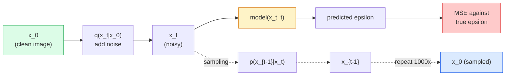

# 画像生成 — Diffusion Models

> diffusion model は denoise を学習します。noisy image から少しだけ noise を取り除くよう学習し、それを逆向きに 1000 回繰り返すと image generator になります。

**種別:** 構築
**言語:** Python
**前提条件:** Phase 4 Lesson 07 (U-Net), Phase 1 Lesson 06 (Probability), Phase 3 Lesson 06 (Optimizers)
**所要時間:** 約75分

## 学習目標

- forward noising process `x_0 -> x_1 -> ... -> x_T` を導出し、なぜ closed-form `q(x_t | x_0)` が任意の t で成り立つかを説明する
- 各 step で追加された noise を回帰する DDPM-style training objective と、pure noise から image まで戻る sampler を実装する
- 任意の timestep に対して noise を予測する、CPU でも学習できる小さな time-conditioned U-Net を構築する
- DDPM sampling と DDIM sampling の違い、そしてそれぞれが適する場面を説明する（Lesson 23 で flow matching と rectified flow を詳しく扱う）

## 問題

GANs は one-shot で生成します。noise を入れ、image を出し、forward pass は 1 回です。高速ですが、学習は難しい。Diffusion models は反復的に生成します。pure noise から始め、小さな steps で denoise し、image が現れます。遅いですが、学習は簡単です。ここ 5 年は後者の性質が支配的でした。小さな team でも diffusion model を学習し、妥当な samples を得られます。GAN training は、多くの失敗 run を経て身につく職人技です。

training stability に加えて、diffusion の反復構造は現代の image generation のほぼすべてを可能にします。text conditioning、inpainting、image editing、super-resolution、controllable style です。sampling loop の各 step は、新しい制約を注入できる場所です。この hook があるからこそ、Stable Diffusion、Imagen、DALL-E 3、Midjourney、そして実際に使う制御可能な image model はすべて diffusion-based です。

この lesson では最小の DDPM を作ります。forward noising、backward denoising、training loop です。次の lesson（Stable Diffusion）では、VAE、text encoder、classifier-free guidance を持つ production system に接続します。

## コンセプト

### Forward process

image `x_0` を取り、少量の Gaussian noise を足して `x_1` にします。さらに少し足して `x_2` にします。これを T steps 続け、`x_T` が pure Gaussian noise とほぼ区別できなくなるまで進めます。

```
q(x_t | x_{t-1}) = N(x_t; sqrt(1 - beta_t) * x_{t-1},  beta_t * I)
```

`beta_t` は小さな variance schedule で、典型的には T=1000 steps で 0.0001 から 0.02 まで linear に増えます。各 step は signal を少し縮め、新しい noise を注入します。

### Closed-form jump

1 step ずつ noise を足すのは Markov chain ですが、数学的には畳み込めます。`x_0` から `x_t` を 1 step で直接 sample できます。

```
Define alpha_t = 1 - beta_t
Define alpha_bar_t = prod_{s=1..t} alpha_s

Then:
  q(x_t | x_0) = N(x_t; sqrt(alpha_bar_t) * x_0,  (1 - alpha_bar_t) * I)

Equivalently:
  x_t = sqrt(alpha_bar_t) * x_0 + sqrt(1 - alpha_bar_t) * epsilon
  where epsilon ~ N(0, I)
```

この 1 本の式が diffusion を実用的にしている理由です。training では random `t` を選び、`x_0` から `x_t` を直接 sample し、1 step で学習できます。full Markov chain の simulation は不要です。

### Reverse process

forward process は固定です。neural network が学習するのは reverse process `p(x_{t-1} | x_t)` です。diffusion models は `x_{t-1}` を直接予測しません。step t で追加された noise `epsilon` を予測し、そこから数学的に `x_{t-1}` を導きます。



### Training loss

各 training step で行うことは次の通りです。

1. real image `x_0` を sample する。
2. timestep `t` を [1, T] から一様に sample する。
3. noise `epsilon ~ N(0, I)` を sample する。
4. `x_t = sqrt(alpha_bar_t) * x_0 + sqrt(1 - alpha_bar_t) * epsilon` を計算する。
5. network で `epsilon_theta(x_t, t)` を予測する。
6. `|| epsilon - epsilon_theta(x_t, t) ||^2` を最小化する。

これだけです。neural network は任意の timestep の noise を予測することを学びます。loss は MSE です。adversarial game も collapse も oscillation もありません。

### Sampler (DDPM)

生成では `x_T ~ N(0, I)` から始め、1 step ずつ逆向きに進みます。

```
for t = T, T-1, ..., 1:
    eps = model(x_t, t)
    x_{t-1} = (1 / sqrt(alpha_t)) * (x_t - (beta_t / sqrt(1 - alpha_bar_t)) * eps) + sqrt(beta_t) * z
    where z ~ N(0, I) if t > 1, else 0
return x_0
```

一般には reverse conditional は closed form で分かりませんが、この Gaussian forward process に限っては分かります。見た目が複雑な係数は Bayes' rule から得られます。

### なぜ 1000 steps なのか

forward noise schedule は、各 step が十分に小さな noise を足し、reverse step がほぼ Gaussian になるよう選ばれます。steps が少なすぎると reverse step は Gaussian から遠くなり、network がうまく model 化できません。多すぎると sampling が高価になり、得られる改善は小さくなります。linear schedule の T=1000 が DDPM のデフォルトです。

### DDIM: 20x faster sampling

Training は同じです。Sampling だけが変わります。DDIM (Song et al., 2020) は、retraining なしで timesteps を skip できる deterministic reverse process を定義します。50 steps の DDIM sampling で、1000-step DDPM に近い品質が得られます。production system はすべて DDIM またはさらに高速な variant（DPM-Solver、Euler ancestral）を使います。

### Time conditioning

network `epsilon_theta(x_t, t)` は、自分がどの timestep を denoise しているか知る必要があります。現代の diffusion models は sinusoidal time embeddings（transformer の positional encoding と同じ考え）を使い、各 U-Net level の feature maps に加えます。

```
t_embedding = sinusoidal(t)
feature_map += MLP(t_embedding)
```

time conditioning がないと、network は image 自体から noise level を推測する必要があります。動きはしますが、sample efficiency は大きく下がります。

## 実装

### Step 1: Noise schedule

```python
import torch

def linear_beta_schedule(T=1000, beta_start=1e-4, beta_end=2e-2):
    return torch.linspace(beta_start, beta_end, T)


def precompute_schedule(betas):
    alphas = 1.0 - betas
    alphas_cumprod = torch.cumprod(alphas, dim=0)
    return {
        "betas": betas,
        "alphas": alphas,
        "alphas_cumprod": alphas_cumprod,
        "sqrt_alphas_cumprod": torch.sqrt(alphas_cumprod),
        "sqrt_one_minus_alphas_cumprod": torch.sqrt(1.0 - alphas_cumprod),
        "sqrt_recip_alphas": torch.sqrt(1.0 / alphas),
    }

schedule = precompute_schedule(linear_beta_schedule(T=1000))
```

一度だけ precompute し、training と sampling では index で gather します。

### Step 2: Forward diffusion (q_sample)

```python
def q_sample(x0, t, noise, schedule):
    sqrt_a = schedule["sqrt_alphas_cumprod"][t].view(-1, 1, 1, 1)
    sqrt_one_minus_a = schedule["sqrt_one_minus_alphas_cumprod"][t].view(-1, 1, 1, 1)
    return sqrt_a * x0 + sqrt_one_minus_a * noise
```

1 行の closed form です。`t` は batch 内の各 image に 1 つずつ対応する timesteps の batch です。

### Step 3: 小さな time-conditioned U-Net

```python
import torch.nn as nn
import torch.nn.functional as F
import math

def timestep_embedding(t, dim=64):
    half = dim // 2
    freqs = torch.exp(-math.log(10000) * torch.arange(half, device=t.device) / half)
    args = t[:, None].float() * freqs[None]
    emb = torch.cat([args.sin(), args.cos()], dim=-1)
    return emb


class TinyUNet(nn.Module):
    def __init__(self, img_channels=3, base=32, t_dim=64):
        super().__init__()
        self.t_mlp = nn.Sequential(
            nn.Linear(t_dim, base * 4),
            nn.SiLU(),
            nn.Linear(base * 4, base * 4),
        )
        self.t_dim = t_dim
        self.enc1 = nn.Conv2d(img_channels, base, 3, padding=1)
        self.enc2 = nn.Conv2d(base, base * 2, 4, stride=2, padding=1)
        self.mid = nn.Conv2d(base * 2, base * 2, 3, padding=1)
        self.dec1 = nn.ConvTranspose2d(base * 2, base, 4, stride=2, padding=1)
        self.dec2 = nn.Conv2d(base * 2, img_channels, 3, padding=1)
        self.time_proj = nn.Linear(base * 4, base * 2)

    def forward(self, x, t):
        t_emb = timestep_embedding(t, self.t_dim)
        t_emb = self.t_mlp(t_emb)
        t_proj = self.time_proj(t_emb)[:, :, None, None]

        h1 = F.silu(self.enc1(x))
        h2 = F.silu(self.enc2(h1)) + t_proj
        h3 = F.silu(self.mid(h2))
        d1 = F.silu(self.dec1(h3))
        d2 = torch.cat([d1, h1], dim=1)
        return self.dec2(d2)
```

bottleneck で time conditioning を注入する 2-level U-Net です。real images では depth と width を増やします。

### Step 4: Training loop

```python
def train_step(model, x0, schedule, optimizer, device, T=1000):
    model.train()
    x0 = x0.to(device)
    bs = x0.size(0)
    t = torch.randint(0, T, (bs,), device=device)
    noise = torch.randn_like(x0)
    x_t = q_sample(x0, t, noise, schedule)
    pred = model(x_t, t)
    loss = F.mse_loss(pred, noise)
    optimizer.zero_grad()
    loss.backward()
    optimizer.step()
    return loss.item()
```

training loop 全体がこれです。GAN game も specialised loss もなく、MSE call が 1 つだけです。

### Step 5: Sampler (DDPM)

```python
@torch.no_grad()
def sample(model, schedule, shape, T=1000, device="cpu"):
    model.eval()
    x = torch.randn(shape, device=device)
    betas = schedule["betas"].to(device)
    sqrt_one_minus_a = schedule["sqrt_one_minus_alphas_cumprod"].to(device)
    sqrt_recip_alphas = schedule["sqrt_recip_alphas"].to(device)

    for t in reversed(range(T)):
        t_batch = torch.full((shape[0],), t, dtype=torch.long, device=device)
        eps = model(x, t_batch)
        coef = betas[t] / sqrt_one_minus_a[t]
        mean = sqrt_recip_alphas[t] * (x - coef * eps)
        if t > 0:
            x = mean + torch.sqrt(betas[t]) * torch.randn_like(x)
        else:
            x = mean
    return x
```

1 batch の samples を作るのに 1000 回の forward pass が必要です。実コードでは DDIM 50-step sampler に差し替えます。

### Step 6: DDIM sampler (deterministic, ~20x faster)

```python
@torch.no_grad()
def sample_ddim(model, schedule, shape, steps=50, T=1000, device="cpu", eta=0.0):
    model.eval()
    x = torch.randn(shape, device=device)
    alphas_cumprod = schedule["alphas_cumprod"].to(device)

    ts = torch.linspace(T - 1, 0, steps + 1).long()
    for i in range(steps):
        t = ts[i]
        t_prev = ts[i + 1]
        t_batch = torch.full((shape[0],), t, dtype=torch.long, device=device)
        eps = model(x, t_batch)
        a_t = alphas_cumprod[t]
        a_prev = alphas_cumprod[t_prev] if t_prev >= 0 else torch.tensor(1.0, device=device)
        x0_pred = (x - torch.sqrt(1 - a_t) * eps) / torch.sqrt(a_t)
        sigma = eta * torch.sqrt((1 - a_prev) / (1 - a_t) * (1 - a_t / a_prev))
        dir_xt = torch.sqrt(1 - a_prev - sigma ** 2) * eps
        noise = sigma * torch.randn_like(x) if eta > 0 else 0
        x = torch.sqrt(a_prev) * x0_pred + dir_xt + noise
    return x
```

`eta=0` は完全に deterministic です。同じ noise input は常に同じ output を生成します。`eta=1` は DDPM を回復します。

## 使う

production work では `diffusers` を使います。

```python
from diffusers import DDPMScheduler, UNet2DModel

unet = UNet2DModel(sample_size=32, in_channels=3, out_channels=3, layers_per_block=2)
scheduler = DDPMScheduler(num_train_timesteps=1000)
```

この library は ready-made schedulers（DDPM、DDIM、DPM-Solver、Euler、Heun）、configurable U-Nets、text-to-image と image-to-image の pipelines、LoRA fine-tuning helpers を提供します。

research では、`k-diffusion`（Katherine Crowson）が最も忠実な reference implementations と優れた sampling variants を持っています。

## 成果物

この lesson は次を生成します。

- `outputs/prompt-diffusion-sampler-picker.md` — quality target、latency budget、conditioning type に基づいて DDPM / DDIM / DPM-Solver / Euler を選ぶ prompt。
- `outputs/skill-noise-schedule-designer.md` — T と target corruption level から linear、cosine、sigmoid beta schedule を作り、signal-to-noise ratio の時間変化の diagnostic plots も出す skill。

## 演習

1. **(Easy)** forward process を可視化してください。1 枚の image を取り、`t in [0, 100, 250, 500, 750, 1000]` の `x_t` を plot します。`x_1000` が pure Gaussian noise に見えることを確認してください。
2. **(Medium)** synthetic-circles dataset で TinyUNet を 20 epochs 学習し、16 circles を sample してください。同じ noise seed から DDPM（1000 steps）と DDIM（50 steps）sampling を比較します。同じような images が生成されますか？
3. **(Hard)** cosine noise schedule（Nichol & Dhariwal, 2021）を実装してください: `alpha_bar_t = cos^2((t/T + s) / (1 + s) * pi / 2)`。同じ model を linear と cosine schedules で学習し、低い step counts では cosine のほうが良い samples を出すことを示してください。

## 重要用語

| Term | What people say | What it actually means |
|------|----------------|----------------------|
| Forward process | 「時間とともに noise を足す」 | image を T steps で Gaussian noise に corrupt する固定 Markov chain |
| Reverse process | 「step by step に denoise」 | noise から image へ戻る学習済み distribution |
| Epsilon prediction | 「noise を予測する」 | training target: `epsilon_theta(x_t, t)` が step t で追加された noise を予測する |
| Beta schedule | 「noise 量」 | 各 step で入る noise 量を定義する T 個の小さな variances |
| alpha_bar_t | 「累積保持率」 | time t までの (1 - beta_s) の積。t が大きいほど残る signal は少ない |
| DDPM sampler | 「Ancestral, stochastic」 | 各 x_{t-1} を conditional Gaussian から sample する。1000 steps |
| DDIM sampler | 「Deterministic, fast」 | sampling を deterministic ODE として書き換える。20-100 steps で同程度の品質 |
| Time conditioning | 「model に t を教える」 | U-Net に注入する t の sinusoidal embedding。noise level を知らせる |

## 参考文献

- [Denoising Diffusion Probabilistic Models (Ho et al., 2020)](https://arxiv.org/abs/2006.11239) — diffusion を実用化し、FID で GANs を上回った論文
- [Improved DDPM (Nichol & Dhariwal, 2021)](https://arxiv.org/abs/2102.09672) — cosine schedule と v-parameterisation
- [DDIM (Song, Meng, Ermon, 2020)](https://arxiv.org/abs/2010.02502) — real-time inference を可能にした deterministic sampler
- [Elucidating the Design Space of Diffusion (Karras et al., 2022)](https://arxiv.org/abs/2206.00364) — diffusion のあらゆる設計選択を統一的に見る現在の最良 reference
