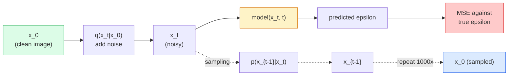

# Görüntü Oluşturma — Yayılma Modelleri

> Bir difüzyon modeli gürültüyü gidermeyi öğrenir. Gürültülü bir görüntüdeki küçük bir gürültü parçasını gidermek için onu eğitin, bunu geriye doğru bin kez tekrarlayın ve bir görüntü oluşturucunuz var.

**Tür:** Yapım
**Diller:** Python
**Önkoşullar:** Aşama 4 Ders 07 (U-Net), Aşama 1 Ders 06 (Olasılık), Aşama 3 Ders 06 (Optimize Ediciler)
**Süre:** ~75 dakika

## Öğrenme Hedefleri

- `x_0 -> x_1 -> ... -> x_T` ileri gürültülendirme sürecini türetin ve kapalı formdaki `q(x_t | x_0)`'nin neden herhangi bir t için geçerli olduğunu açıklayın.
- Her adımda eklenen gürültüyü gerileyen DDPM tarzı bir eğitim hedefi ve saf gürültüden görüntüye geri dönen bir örnekleyici uygulayın
- Herhangi bir zaman adımındaki gürültüyü tahmin eden, zamana bağlı bir U-Net (CPU üzerinde eğitim alacak kadar küçük) oluşturun
- DDPM ve DDIM örneklemesi arasındaki farkı ve her birinin ne zaman uygun olduğunu açıklayın (Ders 23 akış eşleştirmeyi ve derinlemesine düzeltilmiş akışı kapsar)

## Sorun

GAN'lar tek seferlik üretir: gürültü girişi, görüntü çıkışı, bir ileri geçiş. Hızlıdırlar ve eğitilmeleri zordur. Yayılma modelleri yinelemeli olarak üretilir: saf gürültüden başlayın, küçük adımlarla gürültüyü giderin, görüntü ortaya çıkar. Yavaştırlar ve eğitilmeleri kolaydır. Son beş yılda ikinci özellik hakim oldu: herhangi bir küçük ekip bir yayılma modelini eğitebilir ve makul örnekler alabilir; GAN eğitimi, yıllar süren başarısız koşular sonucunda öğrendiğiniz bir zanaattır.

Eğitim istikrarının ötesinde, difüzyonun yinelemeli yapısı, modern görüntü oluşturmanın yaptığı her şeyin kilidini açan şeydir: metin koşullandırma, iç boyama, görüntü düzenleme, süper çözünürlük, kontrol edilebilir stil. Örnekleme döngüsünün her adımı yeni bir kısıtlamanın enjekte edileceği yerdir. Bu kanca, Stable Diffusion, Imagen, DALL-E 3, Midjourney ve kullanacağınız her kontrol edilebilir görüntü modelinin hepsinin difüzyon tabanlı olmasının nedenidir.

Bu ders minimum DDPM'yi oluşturur: ileri gürültü, geri gürültü giderme, eğitim döngüsü. Bir sonraki derste (Kararlı Dağıtım), bunu bir VAE, bir metin kodlayıcı ve sınıflandırıcısız kılavuzluk içeren bir üretim sistemine bağlar.

## Konsept

### İleriye dönük süreç

Bir resim çekin `x_0`. `x_1`'yi elde etmek için küçük miktarda Gauss gürültüsü ekleyin. `x_2`'yi elde etmek için küçük bir miktar daha ekleyin. `x_T` saf Gauss gürültüsünden neredeyse ayırt edilemez hale gelinceye kadar T adımlarına devam edin.

```
q(x_t | x_{t-1}) = N(x_t; sqrt(1 - beta_t) * x_{t-1},  beta_t * I)
```

`beta_t`, T=1000 adım üzerinden tipik olarak 0,0001'den 0,02'ye kadar doğrusal olan küçük bir varyans çizelgesidir. Her adım sinyali biraz küçültür ve yeni gürültü enjekte eder.

### Kapalı formda atlama

Gürültüyü adım adım eklemek bir Markov zinciridir, ancak matematik katlanır: `x_t`'yi doğrudan `x_0`'den tek adımda örnekleyebilirsiniz.

```
Define alpha_t = 1 - beta_t
Define alpha_bar_t = prod_{s=1..t} alpha_s

Then:
  q(x_t | x_0) = N(x_t; sqrt(alpha_bar_t) * x_0,  (1 - alpha_bar_t) * I)

Equivalently:
  x_t = sqrt(alpha_bar_t) * x_0 + sqrt(1 - alpha_bar_t) * epsilon
  where epsilon ~ N(0, I)
```

Bu tek denklem, difüzyonun pratik olmasının tek sebebidir. Eğitim sırasında rastgele bir `t` seçersiniz, `x_t`'yi doğrudan `x_0`'den örneklendirirsiniz ve tek adımda eğitim alırsınız; tam Markov zincirinin simülasyonuna gerek yoktur.

### Ters süreç

İleriye dönük süreç sabittir. neural network'nin öğrendiği `p(x_{t-1} | x_t)` işleminin tersidir. Difüzyon modelleri `x_{t-1}`'yi doğrudan tahmin etmez; t adımında eklenen `epsilon` gürültüyü tahmin ediyorlar ve matematik bundan `x_{t-1}` türetiyor.



### Eğitim kaybı

Her eğitim adımı için:

1. Gerçek bir görüntüyü örnekleyin `x_0`.
2. `t` zaman adımını [1, T]'den eşit şekilde örnekleyin.
3. Örnek gürültü `epsilon ~ N(0, I)`.
4. `x_t = sqrt(alpha_bar_t) * x_0 + sqrt(1 - alpha_bar_t) * epsilon`'yi hesaplayın.
5. Ağ ile `epsilon_theta(x_t, t)`'yi tahmin edin.
6. `|| epsilon - epsilon_theta(x_t, t) ||^2`'yi simge durumuna küçültün.

İşte bu. neural network herhangi bir zaman adımında gürültüyü tahmin etmeyi öğrenir. Kayıp MSE'dir. Rekabetçi bir oyun yok, çöküş yok, salınım yok.

### Örnekleyici (DDPM)

Oluşturmak için: `x_T ~ N(0, I)`'den başlayın ve her seferinde bir adım geriye doğru yürüyün.

```
for t = T, T-1, ..., 1:
    eps = model(x_t, t)
    x_{t-1} = (1 / sqrt(alpha_t)) * (x_t - (beta_t / sqrt(1 - alpha_bar_t)) * eps) + sqrt(beta_t) * z
    where z ~ N(0, I) if t > 1, else 0
return x_0
```

Önemli olan şu ki, ters koşul genel olarak kapalı biçimde bilinmese de, bu özel Gauss ileri süreci için öyledir. Çirkin görünen katsayılar Bayes kuralının size verdiği şeylerdir.

### Neden 1000 adım

İleri gürültü programı, her adımın, geri adımın neredeyse Gaussian olmasına yetecek kadar gürültü ekleyeceği şekilde seçilir. Adımların çok az olması ve ters adımın Gaussian'dan uzak olması durumunda ağ bunu iyi modelleyemez. Çok fazla adım ve örnekleme, kazancın azalmasıyla birlikte pahalı hale gelir. Doğrusal bir programla T=1000, DDPM varsayılanıdır.

### DDIM: 20 kat daha hızlı örnekleme

Eğitim aynı. Örnekleme değişiklikleri. DDIM (Song ve diğerleri, 2020), yeniden eğitim gerektirmeden zaman adımlarını atlayan deterministik bir ters süreç tanımlar. DDIM ile 50 adımda örnekleme, 1000 adıma yakın DDPM kalitesi sağlar. Her üretim sistemi DDIM'yi veya daha hızlı bir çeşidini (DPM-Solver, Euler'in atası) kullanır.

### Zaman koşullandırma

`epsilon_theta(x_t, t)` ağının hangi zaman adımında gürültüyü giderdiğini bilmesi gerekiyor. Modern difüzyon modelleri, her U-Net düzeyinde özellik haritalarına eklenen sinüzoidal zaman embedding'ler (transformer'lerdeki konumsal kodlamayla aynı fikir) aracılığıyla `t`'yi enjekte eder.

```
t_embedding = sinusoidal(t)
feature_map += MLP(t_embedding)
```

Zaman koşullandırma olmadan ağın gürültü seviyesini görüntünün kendisinden tahmin etmesi gerekir; bu işe yarar ancak örnek açısından çok daha az verimlidir.

## İnşa Et

### Adım 1: Gürültü programı

```python
import torch

def linear_beta_schedule(T=1000, beta_start=1e-4, beta_end=2e-2):
    return torch.linspace(beta_start, beta_end, T)


def precompute_schedule(betas):
    alphas = 1.0 - betas
    alphas_cumprod = torch.cumprod(alphas, dim=0)
    return {
        "betas": betas,
        "alphas": alphas,
        "alphas_cumprod": alphas_cumprod,
        "sqrt_alphas_cumprod": torch.sqrt(alphas_cumprod),
        "sqrt_one_minus_alphas_cumprod": torch.sqrt(1.0 - alphas_cumprod),
        "sqrt_recip_alphas": torch.sqrt(1.0 / alphas),
    }

schedule = precompute_schedule(linear_beta_schedule(T=1000))
```

Bir kez önceden hesaplayın, eğitim ve örnekleme sırasında dizine göre toplayın.

### Adım 2: İleri yayılma (q_sample)

```python
def q_sample(x0, t, noise, schedule):
    sqrt_a = schedule["sqrt_alphas_cumprod"][t].view(-1, 1, 1, 1)
    sqrt_one_minus_a = schedule["sqrt_one_minus_alphas_cumprod"][t].view(-1, 1, 1, 1)
    return sqrt_a * x0 + sqrt_one_minus_a * noise
```

Tek satırlık kapalı form. `t`, gruptaki görüntü başına bir tane olacak şekilde bir zaman adımları grubudur.

### Adım 3: Zamana bağlı küçük bir U-Net

```python
import torch.nn as nn
import torch.nn.functional as F
import math

def timestep_embedding(t, dim=64):
    half = dim // 2
    freqs = torch.exp(-math.log(10000) * torch.arange(half, device=t.device) / half)
    args = t[:, None].float() * freqs[None]
    emb = torch.cat([args.sin(), args.cos()], dim=-1)
    return emb


class TinyUNet(nn.Module):
    def __init__(self, img_channels=3, base=32, t_dim=64):
        super().__init__()
        self.t_mlp = nn.Sequential(
            nn.Linear(t_dim, base * 4),
            nn.SiLU(),
            nn.Linear(base * 4, base * 4),
        )
        self.t_dim = t_dim
        self.enc1 = nn.Conv2d(img_channels, base, 3, padding=1)
        self.enc2 = nn.Conv2d(base, base * 2, 4, stride=2, padding=1)
        self.mid = nn.Conv2d(base * 2, base * 2, 3, padding=1)
        self.dec1 = nn.ConvTranspose2d(base * 2, base, 4, stride=2, padding=1)
        self.dec2 = nn.Conv2d(base * 2, img_channels, 3, padding=1)
        self.time_proj = nn.Linear(base * 4, base * 2)

    def forward(self, x, t):
        t_emb = timestep_embedding(t, self.t_dim)
        t_emb = self.t_mlp(t_emb)
        t_proj = self.time_proj(t_emb)[:, :, None, None]

        h1 = F.silu(self.enc1(x))
        h2 = F.silu(self.enc2(h1)) + t_proj
        h3 = F.silu(self.mid(h2))
        d1 = F.silu(self.dec1(h3))
        d2 = torch.cat([d1, h1], dim=1)
        return self.dec2(d2)
```

Darboğaza enjekte edilen zaman koşullandırmalı iki seviyeli U-Net. Gerçek görüntüler için derinliği ve genişliği ölçeklendirin.

### Adım 4: Eğitim döngüsü

```python
def train_step(model, x0, schedule, optimizer, device, T=1000):
    model.train()
    x0 = x0.to(device)
    bs = x0.size(0)
    t = torch.randint(0, T, (bs,), device=device)
    noise = torch.randn_like(x0)
    x_t = q_sample(x0, t, noise, schedule)
    pred = model(x_t, t)
    loss = F.mse_loss(pred, noise)
    optimizer.zero_grad()
    loss.backward()
    optimizer.step()
    return loss.item()
```

Tüm eğitim döngüsü budur. GAN oyunu yok, özel kayıp yok, tek MSE çağrısı.

### Adım 5: Örnekleyici (DDPM)

```python
@torch.no_grad()
def sample(model, schedule, shape, T=1000, device="cpu"):
    model.eval()
    x = torch.randn(shape, device=device)
    betas = schedule["betas"].to(device)
    sqrt_one_minus_a = schedule["sqrt_one_minus_alphas_cumprod"].to(device)
    sqrt_recip_alphas = schedule["sqrt_recip_alphas"].to(device)

    for t in reversed(range(T)):
        t_batch = torch.full((shape[0],), t, dtype=torch.long, device=device)
        eps = model(x, t_batch)
        coef = betas[t] / sqrt_one_minus_a[t]
        mean = sqrt_recip_alphas[t] * (x - coef * eps)
        if t > 0:
            x = mean + torch.sqrt(betas[t]) * torch.randn_like(x)
        else:
            x = mean
    return x
```

Bir parti numune üretmek için 1000 ileri geçiş. Gerçek kodda bunu DDIM 50 adımlı örnekleyiciyle değiştirirsiniz.

### Adım 6: DDIM örnekleyici (deterministik, ~20 kat daha hızlı)

```python
@torch.no_grad()
def sample_ddim(model, schedule, shape, steps=50, T=1000, device="cpu", eta=0.0):
    model.eval()
    x = torch.randn(shape, device=device)
    alphas_cumprod = schedule["alphas_cumprod"].to(device)

    ts = torch.linspace(T - 1, 0, steps + 1).long()
    for i in range(steps):
        t = ts[i]
        t_prev = ts[i + 1]
        t_batch = torch.full((shape[0],), t, dtype=torch.long, device=device)
        eps = model(x, t_batch)
        a_t = alphas_cumprod[t]
        a_prev = alphas_cumprod[t_prev] if t_prev >= 0 else torch.tensor(1.0, device=device)
        x0_pred = (x - torch.sqrt(1 - a_t) * eps) / torch.sqrt(a_t)
        sigma = eta * torch.sqrt((1 - a_prev) / (1 - a_t) * (1 - a_t / a_prev))
        dir_xt = torch.sqrt(1 - a_prev - sigma ** 2) * eps
        noise = sigma * torch.randn_like(x) if eta > 0 else 0
        x = torch.sqrt(a_prev) * x0_pred + dir_xt + noise
    return x
```

`eta=0` tamamen deterministiktir (aynı gürültü girişi her zaman aynı çıkışı üretir). `eta=1`, DDPM'yi kurtarır.

## Kullan onu

Üretim çalışmaları için `diffusers`'yi kullanın:

```python
from diffusers import DDPMScheduler, UNet2DModel

unet = UNet2DModel(sample_size=32, in_channels=3, out_channels=3, layers_per_block=2)
scheduler = DDPMScheduler(num_train_timesteps=1000)
```

Kitaplık, hazır zamanlayıcılar (DDPM, DDIM, DPM-Solver, Euler, Heun), yapılandırılabilir U-Net'ler, metinden görüntüye ve görüntüden görüntüye işlem hatları ve LoRA fine-tuning yardımcılarını sunar.

Araştırma için `k-diffusion` (Katherine Crowson) en sadık referans uygulamalarına ve en iyi örnekleme varyantlarına sahiptir.

## Gönderin

Bu ders şunları üretir:

- `outputs/prompt-diffusion-sampler-picker.md` — kalite hedefine, gecikme bütçesine ve koşullandırma türüne göre DDPM / DDIM / DPM-Solver / Euler'i seçen bir prompt.
- `outputs/skill-noise-schedule-designer.md` — T ve hedef bozulma düzeyi göz önüne alındığında doğrusal, kosinüs veya sigmoid beta programı ve ayrıca zaman içinde sinyal-gürültü oranının tanısal grafiklerini üreten bir beceri.

## Egzersizler

1. **(Kolay)** İleri süreci görselleştirin: bir görüntü alın ve `x_t`'yi `t in [0, 100, 250, 500, 750, 1000]`'de çizin. `x_1000`'nin saf Gauss gürültüsüne benzediğini doğrulayın.
2. **(Orta)** TinyUNet'i 20 dönem boyunca dataset sentetik çemberleri üzerinde eğitin ve 16 çemberi örnekleyin. DDPM (1000 adım) ve DDIM (50 adım) örneklemeyi karşılaştırın; aynı gürültü kaynağından benzer görüntüler üretiyorlar mı?
3. **(Zor)** Bir kosinüs gürültü çizelgesi uygulayın (Nichol ve Dhariwal, 2021): `alpha_bar_t = cos^2((t/T + s) / (1 + s) * pi / 2)`. Aynı modeli doğrusal ve kosinüs çizelgeleriyle eğitin ve kosinüsün düşük adım sayılarında daha iyi örnekler verdiğini gösterin.

## Anahtar Terimler

| Dönem | İnsanlar ne diyor | Aslında ne anlama geliyor |
|------|----------------|----------------------|
| İleri süreç | "Zamanla gürültü ekleyin" | T adımlarında görüntüyü Gauss gürültüsüne dönüştüren Markov zinciri düzeltildi |
| Ters işlem | "Gürültüyü adım adım giderin" | Gürültüden görüntüye giden öğrenilmiş dağıtım |
| Epsilon tahmini | "Gürültüyü tahmin edin" | Eğitim hedefi: `epsilon_theta(x_t, t)`, t | adımında eklenen gürültüyü tahmin eder.
| Beta programı | "Gürültü miktarları" | Adım başına ne kadar gürültünün gireceğini tanımlayan T küçük varyans dizisi |
| alpha_bar_t | "Kümülatif koruma faktörü" | (1 - beta_s)'nin t zamanına kadar çarpımı; daha büyük t daha az sinyal kaldığı anlamına gelir |
| DDPM örnekleyici | "Atalara ait, stokastik" | Her x_{t-1}'i kendi koşullu Gaussian'ından örnekler; 1000 adım |
| DDIM örnekleyici | "Deterministik, hızlı" | Örneklemeyi deterministik bir ODE olarak yeniden yazar; Benzer kalitede 20-100 adım |
| Zaman koşullandırma | "Modele hangisinin olduğunu söyle" | U-Net'e sinüsoidal embedding enjekte edildi, böylece gürültü seviyesini biliyor |

## Daha Fazla Okuma

- [Gürültü Giderici Difüzyon Olasılık Modelleri (Ho ve diğerleri, 2020)](https://arxiv.org/abs/2006.11239) — difüzyonu pratik hale getiren ve FID'de GAN'ları yenen makale
- [Geliştirilmiş DDPM (Nichol ve Dhariwal, 2021)](https://arxiv.org/abs/2102.09672) — kosinüs programı ve v parametrelendirmesi
- [DDIM (Song, Meng, Ermon, 2020)](https://arxiv.org/abs/2010.02502) — gerçek zamanlı inference'yi mümkün kılan deterministik örnekleyici
- [Difüzyonun Tasarım Uzayını Aydınlatmak (Karras ve diğerleri, 2022)](https://arxiv.org/abs/2206.00364) — her yayılma tasarımı seçiminin birleşik bir görünümü; mevcut en iyi referans
