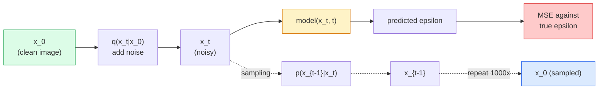

# Image Generation — Diffusion Models

> 扩散模型学会去噪。训练它从嘈杂的图像中去除一点点噪音，向后重复一千次，你就有了一个图像生成器。

** 类型：** 构建
** 语言：** Python
** 先决条件：** 阶段4第4课07（U-Net）、阶段1课06（概率）、阶段3课06（优化器）
** 时间：** ~75分钟

## Learning Objectives

- 推导前向降噪过程' x_0 -> x_1 ->. -> x_T '并解释为什么封闭形式' q（x_t| x_0）'适用于任何t
- 实现DDPM风格的训练目标，回归每一步添加的噪音，并实现从纯噪音回到图像的采样器
- 构建一个有时间限制的U-Net（小到可以在中央处理器上训练），可以预测任何时间步的噪音
- 解释DDPM和DDIM采样之间的差异，以及何时适合使用这两种采样（第23课深入介绍流量匹配和整流）

## The Problem

GAN生成一次：噪音输入、图像输出、一次向前传递。他们速度很快，训练起来也很困难。扩散模型迭代生成：从纯噪音开始，分步去噪，图像出现。他们速度缓慢，而且易于训练。在过去的五年里，后一种属性占据主导地位：任何小团队都可以训练扩散模型并获得合理的样本; GAN训练是您在多年失败的运行中学到的一门手艺。

除了训练稳定性之外，扩散的迭代结构还解锁了现代图像生成的一切功能：文本条件处理、修补、图像编辑、超分辨率、可控风格。采样循环的每一步都是注入新约束的地方。这个挂钩就是为什么Stable Multiple、Imagen、DALL-E 3、Midjourney以及您将使用的每个可控图像模型都是基于扩散的。

本课构建了最小的DDPM：前向降噪、后向降噪、训练循环。下一课（稳定扩散）将其连接到具有VAE、文本编码器和无分类器指导的生产系统中。

## The Concept

### The forward process

拍摄一张图像“x_0”。添加少量高斯噪音以获得“x_1”。再添加少量即可获得“x_2”。继续进行T步，直到“x_T”与纯高斯噪音几乎无法区分。

```
q(x_t | x_{t-1}) = N(x_t; sqrt(1 - beta_t) * x_{t-1},  beta_t * I)
```

“Beta_t”是一个小方差时间表，通常在T=1000步内从0.0001到0.02呈线性。每一步都会稍微缩小信号并注入新的噪音。

### The closed-form jump

一步一步地添加噪音是一个马尔科夫链，但数学上可以折叠：您可以一步直接从“x_0”中采样“x_t”。

```
Define alpha_t = 1 - beta_t
Define alpha_bar_t = prod_{s=1..t} alpha_s

Then:
  q(x_t | x_0) = N(x_t; sqrt(alpha_bar_t) * x_0,  (1 - alpha_bar_t) * I)

Equivalently:
  x_t = sqrt(alpha_bar_t) * x_0 + sqrt(1 - alpha_bar_t) * epsilon
  where epsilon ~ N(0, I)
```

这个单一的方程就是扩散可行的全部原因。在训练过程中，您选择一个随机的“t”，直接从“x_0”中采样“x_t”，然后一步训练-无需模拟完整的马尔科夫链。

### The reverse process

前进过程是固定的。反向过程' p（x_{t-1}| x_t）'是神经网络学习的内容。扩散模型不会直接预测“x_{t-1}”;它们预测在步骤t添加的噪音“”，数学由此推导出“x_{t-1}”。



### The training loss

对于每个培训步骤：

1. 采样真实图像“x_0”。
2. 从[1，T]均匀采样时步'。
3. 样本噪音“ð ~ N（0，I）”。
4. 计算' x_t = SQRT（Alpha_bar_t）* x_0 + SQRT（1 - Alpha_bar_t）*'。
5. 使用网络预测“_theta（x_t，t）”。
6. 最小化`||n-n_θ（x_t，t）||#2 '。

就是这样。神经网络学会在任何时间步预测噪音。损失是SSE。没有对抗游戏，没有崩溃，没有振荡。

### The sampler (DDPM)

生成：从“x_T ~ N（0，I）”开始，一步一步向后走。

```
for t = T, T-1, ..., 1:
    eps = model(x_t, t)
    x_{t-1} = (1 / sqrt(alpha_t)) * (x_t - (beta_t / sqrt(1 - alpha_bar_t)) * eps) + sqrt(beta_t) * z
    where z ~ N(0, I) if t > 1, else 0
return x_0
```

关键是，尽管反向条件通常以封闭形式未知，但对于这个特定的高斯正向过程来说，它是已知的。看起来丑陋的系数是Bayes规则为您提供的。

### Why 1000 steps

选择前向噪声时间表，使得每个步骤添加刚好足够的噪声，使得反向步骤接近高斯。步骤太少，反向步骤远离高斯，网络无法很好地建模。太多的步骤和采样变得昂贵，增益下降。对于线性计划，T=1000是DDPM的默认值。

### DDIM: 20x faster sampling

训练也是一样的。抽样变化。DDIM（Song等人，2020）定义了一个确定性的反向过程，该过程跳过时间步，无需重新训练。使用DDIM分50步进行采样，可提供接近1000步的DDPM质量。每个生产系统都使用DDIM或更快的变体（DPM-Solver，欧拉祖先）。

### Time conditioning

网络'_theta（x_t，t）'需要知道它正在去噪的时间步。现代扩散模型通过曲线时间嵌入（与转换器中的位置编码相同的想法）注入“t”，并添加到每个U-Net级别的特征地图中。

```
t_embedding = sinusoidal(t)
feature_map += MLP(t_embedding)
```

如果没有时间条件，网络必须从图像本身猜测噪音水平，这很有效，但样本效率要低得多。

## Build It

### Step 1: Noise schedule

```python
import torch

def linear_beta_schedule(T=1000, beta_start=1e-4, beta_end=2e-2):
    return torch.linspace(beta_start, beta_end, T)


def precompute_schedule(betas):
    alphas = 1.0 - betas
    alphas_cumprod = torch.cumprod(alphas, dim=0)
    return {
        "betas": betas,
        "alphas": alphas,
        "alphas_cumprod": alphas_cumprod,
        "sqrt_alphas_cumprod": torch.sqrt(alphas_cumprod),
        "sqrt_one_minus_alphas_cumprod": torch.sqrt(1.0 - alphas_cumprod),
        "sqrt_recip_alphas": torch.sqrt(1.0 / alphas),
    }

schedule = precompute_schedule(linear_beta_schedule(T=1000))
```

预计算一次，在训练和采样期间按索引收集。

### Step 2: Forward diffusion (q_sample)

```python
def q_sample(x0, t, noise, schedule):
    sqrt_a = schedule["sqrt_alphas_cumprod"][t].view(-1, 1, 1, 1)
    sqrt_one_minus_a = schedule["sqrt_one_minus_alphas_cumprod"][t].view(-1, 1, 1, 1)
    return sqrt_a * x0 + sqrt_one_minus_a * noise
```

一行封闭形式。' t '是一批时间步，批次中的每个图像一个时间步。

### Step 3: A tiny time-conditioned U-Net

```python
import torch.nn as nn
import torch.nn.functional as F
import math

def timestep_embedding(t, dim=64):
    half = dim // 2
    freqs = torch.exp(-math.log(10000) * torch.arange(half, device=t.device) / half)
    args = t[:, None].float() * freqs[None]
    emb = torch.cat([args.sin(), args.cos()], dim=-1)
    return emb


class TinyUNet(nn.Module):
    def __init__(self, img_channels=3, base=32, t_dim=64):
        super().__init__()
        self.t_mlp = nn.Sequential(
            nn.Linear(t_dim, base * 4),
            nn.SiLU(),
            nn.Linear(base * 4, base * 4),
        )
        self.t_dim = t_dim
        self.enc1 = nn.Conv2d(img_channels, base, 3, padding=1)
        self.enc2 = nn.Conv2d(base, base * 2, 4, stride=2, padding=1)
        self.mid = nn.Conv2d(base * 2, base * 2, 3, padding=1)
        self.dec1 = nn.ConvTranspose2d(base * 2, base, 4, stride=2, padding=1)
        self.dec2 = nn.Conv2d(base * 2, img_channels, 3, padding=1)
        self.time_proj = nn.Linear(base * 4, base * 2)

    def forward(self, x, t):
        t_emb = timestep_embedding(t, self.t_dim)
        t_emb = self.t_mlp(t_emb)
        t_proj = self.time_proj(t_emb)[:, :, None, None]

        h1 = F.silu(self.enc1(x))
        h2 = F.silu(self.enc2(h1)) + t_proj
        h3 = F.silu(self.mid(h2))
        d1 = F.silu(self.dec1(h3))
        d2 = torch.cat([d1, h1], dim=1)
        return self.dec2(d2)
```

两级U-Net，在瓶颈处注入了时间调节。扩大真实图像的深度和宽度。

### Step 4: Training loop

```python
def train_step(model, x0, schedule, optimizer, device, T=1000):
    model.train()
    x0 = x0.to(device)
    bs = x0.size(0)
    t = torch.randint(0, T, (bs,), device=device)
    noise = torch.randn_like(x0)
    x_t = q_sample(x0, t, noise, schedule)
    pred = model(x_t, t)
    loss = F.mse_loss(pred, noise)
    optimizer.zero_grad()
    loss.backward()
    optimizer.step()
    return loss.item()
```

这就是整个训练循环。没有GAN游戏，没有专门的损失，一次SSE电话。

### Step 5: Sampler (DDPM)

```python
@torch.no_grad()
def sample(model, schedule, shape, T=1000, device="cpu"):
    model.eval()
    x = torch.randn(shape, device=device)
    betas = schedule["betas"].to(device)
    sqrt_one_minus_a = schedule["sqrt_one_minus_alphas_cumprod"].to(device)
    sqrt_recip_alphas = schedule["sqrt_recip_alphas"].to(device)

    for t in reversed(range(T)):
        t_batch = torch.full((shape[0],), t, dtype=torch.long, device=device)
        eps = model(x, t_batch)
        coef = betas[t] / sqrt_one_minus_a[t]
        mean = sqrt_recip_alphas[t] * (x - coef * eps)
        if t > 0:
            x = mean + torch.sqrt(betas[t]) * torch.randn_like(x)
        else:
            x = mean
    return x
```

1000 向前传递以生产一批样品。在实际代码中，您可以将其替换为DDIM 50步采样器。

### Step 6: DDIM sampler (deterministic, ~20x faster)

```python
@torch.no_grad()
def sample_ddim(model, schedule, shape, steps=50, T=1000, device="cpu", eta=0.0):
    model.eval()
    x = torch.randn(shape, device=device)
    alphas_cumprod = schedule["alphas_cumprod"].to(device)

    ts = torch.linspace(T - 1, 0, steps + 1).long()
    for i in range(steps):
        t = ts[i]
        t_prev = ts[i + 1]
        t_batch = torch.full((shape[0],), t, dtype=torch.long, device=device)
        eps = model(x, t_batch)
        a_t = alphas_cumprod[t]
        a_prev = alphas_cumprod[t_prev] if t_prev >= 0 else torch.tensor(1.0, device=device)
        x0_pred = (x - torch.sqrt(1 - a_t) * eps) / torch.sqrt(a_t)
        sigma = eta * torch.sqrt((1 - a_prev) / (1 - a_t) * (1 - a_t / a_prev))
        dir_xt = torch.sqrt(1 - a_prev - sigma ** 2) * eps
        noise = sigma * torch.randn_like(x) if eta > 0 else 0
        x = torch.sqrt(a_prev) * x0_pred + dir_xt + noise
    return x
```

' eta=0 '是完全确定的（相同的噪音输入总是产生相同的输出）。“eta=1”恢复DDPM。

## Use It

对于生产工作，请使用“扩散器”：

```python
from diffusers import DDPMScheduler, UNet2DModel

unet = UNet2DModel(sample_size=32, in_channels=3, out_channels=3, layers_per_block=2)
scheduler = DDPMScheduler(num_train_timesteps=1000)
```

该图书馆提供现成的调度器（DDPM、DDIM、DPM-Solver、欧拉、Heun）、可配置的U-Net、文本到图像和图像到图像的管道以及LoRA微调助手。

对于研究来说，“k-diffusion”（凯瑟琳·克劳森饰）拥有最忠实的参考实现和最好的采样变体。

## Ship It

本课产生：

- '输出/prompt-diffusion-sampler-picker.md '-根据质量目标、延迟预算和条件类型选择DDPM / DDIM / DPM-Solver /欧拉的提示。
- '输出/skill-noise-schedule-designer.md '-一种技能，可以在给定T和目标破坏水平的情况下产生线性、cos或sigmoid Beta时间表，以及随着时间的推移的信号与噪音比的诊断图。

## Exercises

1. **（简单）** 可视化前进过程：拍摄一张图像并在[0，100，250，500，750，1000]'中绘制' t '处'。验证“x_1000”看起来像纯高斯噪音。
2. **（中）** 在合成圆圈数据集上训练TinyUNet 20个纪元并采样16个圆圈。比较DDPM（1000步）和DDIM（50步）采样-它们是否从相同的噪音种子产生相似的图像？
3. **（硬）** 实现余弦噪声时间表（Nichol & Dhariwal，2021）：`alpha_bar_t = cos^2（（t/T + s）/（1 + s）* pi / 2）`。使用线性和余弦时间表训练相同的模型，并显示余弦在低步数下提供更好的样本。

## Key Terms

| Term | 别人怎么说 | 它实际上意味着什么 |
|------|----------------|----------------------|
| 正向过程 | “随着时间的推移添加噪音” | 固定的马尔科夫链，在T步内将图像损坏为高斯噪音 |
| 逆过程 | “逐步消除噪音” | 从噪音回到图像的习得分布 |
| 地震预报 | “预测噪音” | 训练目标：'_theta（x_t，t）'预测步骤t添加的噪音 |
| 贝塔时间表 | “噪音量” | T个小方差序列，定义每步进入的噪音量 |
| Alpha_bar_t | “累积留存系数” | （1 - beta_s）到时间t的乘积;较大的t意味着较少的剩余信号 |
| DDPM采样器 | “祖先的，随机的” | 从其条件高斯采样每个x_{t-1}; 1000步 |
| DDIM采样器 | “确定性，快速” | 将采样重写为确定性ODE; 20-100个质量相似的步骤 |
| 时间条件反射 | “告诉模型哪个t” | 将t注入到U-Net中，以便它知道噪音水平 |

## Further Reading

- [去噪扩散概率模型（Ho等人，2020）]（https：//arxiv.org/ab/2006.11239）-使扩散变得实用并在DID上击败GAN的论文
- [改进的DDPM（Nichol & Dhariwal，2021）]（https：//arxiv.org/ab/2102.09672）-cos调度和v参数化
- [DDIM（Song，Meng，Ermon，2020）]（https：//arxiv.org/ab/2010.02502）-使实时推理成为可能的确定性采样器
- [阐明扩散的设计空间（卡拉斯等人，2022）]（https：//arxiv.org/ab/2206.00364）-每个扩散设计选择的统一视图;当前最佳参考
