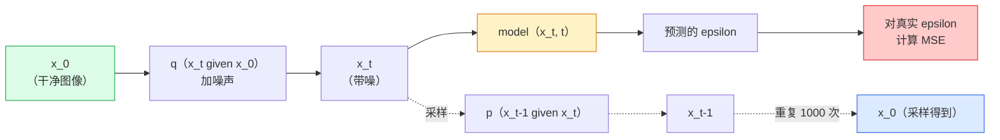

# 图像生成 —— 扩散模型（Image Generation — Diffusion Models）

> 译注：本文译自同目录 [`en.md`](./en.md)。术语遵循仓根 [TRANSLATION_GUIDE.md](../../../../TRANSLATION_GUIDE.md)。

> diffusion 模型学的是去噪。训练它从一张带噪图里去掉一点点噪声，然后把这个过程倒着重复一千次，你就得到了一个图像生成器。

**Type:** Build
**Languages:** Python
**Prerequisites:** Phase 4 Lesson 07 (U-Net), Phase 1 Lesson 06 (Probability), Phase 3 Lesson 06 (Optimizers)
**Time:** ~75 minutes

## 学习目标（Learning Objectives）

- 推导前向加噪过程 `x_0 -> x_1 -> ... -> x_T`，并解释为什么对任意 t 都有闭式解 `q(x_t | x_0)`
- 实现 DDPM 风格的训练目标：回归每一步加入的噪声；并实现一个从纯噪声反向走回图像的 sampler（采样器）
- 搭建一个时间条件化（time-conditioned）的 U-Net（小到能在 CPU 上训练），用它对任意时间步预测噪声
- 解释 DDPM 与 DDIM 采样的区别，以及各自适合什么场景（Lesson 23 会深入讲 flow matching 与 rectified flow）

## 问题（The Problem）

GAN 是一锤子买卖：噪声进、图像出，一次前向传播搞定。它快，但训练难。diffusion 模型则是迭代式生成：从纯噪声出发，一步步去噪，图像逐渐显现。它慢，但训练简单。过去五年里，后者这个性质压倒了一切：任何一个小团队都能训练一个 diffusion 模型并得到像样的样本；而 GAN 训练是一门要靠多年失败实验积累的手艺。

除了训练稳定性，diffusion 的迭代结构才是现代图像生成一切花活的关键来源：文本条件、inpainting（图像补全）、图像编辑、超分辨率、可控风格。采样循环的每一步都是一个能注入新约束的钩子。正是这一点，让 Stable Diffusion、Imagen、DALL-E 3、Midjourney，以及你将用到的每一个可控图像模型，全都基于 diffusion。

本节课构建最小可用的 DDPM：前向加噪、反向去噪、训练循环。下一节课（Stable Diffusion）会把它接进一个生产级系统，配上 VAE、文本编码器，以及 classifier-free guidance（无分类器引导）。

## 概念（The Concept）

### 前向过程（The forward process）

拿一张图 `x_0`。加一点点高斯噪声得到 `x_1`。再加一点点得到 `x_2`。一直加 T 步，直到 `x_T` 几乎和纯高斯噪声没法区分。

```
q(x_t | x_{t-1}) = N(x_t; sqrt(1 - beta_t) * x_{t-1},  beta_t * I)
```

`beta_t` 是一个很小的方差调度，通常在 T=1000 步上从 0.0001 线性增到 0.02。每一步都把信号略微缩小并注入新鲜噪声。

### 闭式跳跃（The closed-form jump）

一步步加噪是一个 Markov 链，但数学上可以折叠：你可以一步直接从 `x_0` 采到 `x_t`。

```
Define alpha_t = 1 - beta_t
Define alpha_bar_t = prod_{s=1..t} alpha_s

Then:
  q(x_t | x_0) = N(x_t; sqrt(alpha_bar_t) * x_0,  (1 - alpha_bar_t) * I)

Equivalently:
  x_t = sqrt(alpha_bar_t) * x_0 + sqrt(1 - alpha_bar_t) * epsilon
  where epsilon ~ N(0, I)
```

就这一个等式，是 diffusion 之所以可行的全部理由。训练时你随机挑一个 `t`，直接从 `x_0` 采出 `x_t`，一步训练完事——根本不需要去模拟整条 Markov 链。

### 反向过程（The reverse process）

前向过程是固定的。反向过程 `p(x_{t-1} | x_t)` 才是神经网络要学的东西。diffusion 模型并不直接预测 `x_{t-1}`；它们预测在第 t 步加进去的噪声 `epsilon`，然后由数学公式从中导出 `x_{t-1}`。



### 训练损失（The training loss）

每个训练步：

1. 采一张真实图像 `x_0`。
2. 在 [1, T] 上均匀采一个时间步 `t`。
3. 采噪声 `epsilon ~ N(0, I)`。
4. 计算 `x_t = sqrt(alpha_bar_t) * x_0 + sqrt(1 - alpha_bar_t) * epsilon`。
5. 用网络预测 `epsilon_theta(x_t, t)`。
6. 最小化 `|| epsilon - epsilon_theta(x_t, t) ||^2`。

就这些。神经网络学的就是在任意时间步预测噪声。损失是 MSE。没有对抗博弈，没有崩溃，没有震荡。

### 采样器：DDPM（The sampler (DDPM)）

要生成图像：从 `x_T ~ N(0, I)` 出发，一步一步往回走。

```
for t = T, T-1, ..., 1:
    eps = model(x_t, t)
    x_{t-1} = (1 / sqrt(alpha_t)) * (x_t - (beta_t / sqrt(1 - alpha_bar_t)) * eps) + sqrt(beta_t) * z
    where z ~ N(0, I) if t > 1, else 0
return x_0
```

关键在于：虽然反向条件分布在一般情况下没有闭式解，但对于这个特定的高斯前向过程，它就是有的。那些看起来很丑的系数，正是 Bayes 法则给你算出来的。

### 为什么是 1000 步（Why 1000 steps）

前向噪声调度的设计原则是：每一步加入的噪声刚好够小，使得反向那一步近似为高斯。步数太少，反向那一步偏离高斯太远，网络建模不准；步数太多，采样代价飙升而收益递减。T=1000 配线性调度就是 DDPM 的默认配置。

### DDIM：采样快 20 倍（DDIM: 20x faster sampling）

训练不变。变的只是采样。DDIM（Song et al., 2020）定义了一个确定性的反向过程，能在不重新训练的情况下跳过若干时间步。用 DDIM 采 50 步，就能得到接近 1000 步 DDPM 的质量。每个生产系统用的都是 DDIM 或更快的变体（DPM-Solver、Euler ancestral）。

### 时间条件化（Time conditioning）

网络 `epsilon_theta(x_t, t)` 需要知道自己正在去噪的是哪一个时间步。现代 diffusion 模型通过 sinusoidal 时间 embedding（思路和 transformer 里的位置编码一致）注入 `t`，这些 embedding 在 U-Net 的每一层都被加到 feature map 上。

```
t_embedding = sinusoidal(t)
feature_map += MLP(t_embedding)
```

如果不做时间条件化，网络就得自己从图像里猜噪声水平，虽然能学，但样本效率低很多。

## 动手实现（Build It）

### Step 1：噪声调度（Noise schedule）

```python
import torch

def linear_beta_schedule(T=1000, beta_start=1e-4, beta_end=2e-2):
    return torch.linspace(beta_start, beta_end, T)


def precompute_schedule(betas):
    alphas = 1.0 - betas
    alphas_cumprod = torch.cumprod(alphas, dim=0)
    return {
        "betas": betas,
        "alphas": alphas,
        "alphas_cumprod": alphas_cumprod,
        "sqrt_alphas_cumprod": torch.sqrt(alphas_cumprod),
        "sqrt_one_minus_alphas_cumprod": torch.sqrt(1.0 - alphas_cumprod),
        "sqrt_recip_alphas": torch.sqrt(1.0 / alphas),
    }

schedule = precompute_schedule(linear_beta_schedule(T=1000))
```

预计算一次，训练和采样时按 index 取值即可。

### Step 2：前向扩散 q_sample（Forward diffusion (q_sample)）

```python
def q_sample(x0, t, noise, schedule):
    sqrt_a = schedule["sqrt_alphas_cumprod"][t].view(-1, 1, 1, 1)
    sqrt_one_minus_a = schedule["sqrt_one_minus_alphas_cumprod"][t].view(-1, 1, 1, 1)
    return sqrt_a * x0 + sqrt_one_minus_a * noise
```

一行的闭式公式。`t` 是一个 batch 的时间步，每张图一个。

### Step 3：一个迷你时间条件化 U-Net（A tiny time-conditioned U-Net）

```python
import torch.nn as nn
import torch.nn.functional as F
import math

def timestep_embedding(t, dim=64):
    half = dim // 2
    freqs = torch.exp(-math.log(10000) * torch.arange(half, device=t.device) / half)
    args = t[:, None].float() * freqs[None]
    emb = torch.cat([args.sin(), args.cos()], dim=-1)
    return emb


class TinyUNet(nn.Module):
    def __init__(self, img_channels=3, base=32, t_dim=64):
        super().__init__()
        self.t_mlp = nn.Sequential(
            nn.Linear(t_dim, base * 4),
            nn.SiLU(),
            nn.Linear(base * 4, base * 4),
        )
        self.t_dim = t_dim
        self.enc1 = nn.Conv2d(img_channels, base, 3, padding=1)
        self.enc2 = nn.Conv2d(base, base * 2, 4, stride=2, padding=1)
        self.mid = nn.Conv2d(base * 2, base * 2, 3, padding=1)
        self.dec1 = nn.ConvTranspose2d(base * 2, base, 4, stride=2, padding=1)
        self.dec2 = nn.Conv2d(base * 2, img_channels, 3, padding=1)
        self.time_proj = nn.Linear(base * 4, base * 2)

    def forward(self, x, t):
        t_emb = timestep_embedding(t, self.t_dim)
        t_emb = self.t_mlp(t_emb)
        t_proj = self.time_proj(t_emb)[:, :, None, None]

        h1 = F.silu(self.enc1(x))
        h2 = F.silu(self.enc2(h1)) + t_proj
        h3 = F.silu(self.mid(h2))
        d1 = F.silu(self.dec1(h3))
        d2 = torch.cat([d1, h1], dim=1)
        return self.dec2(d2)
```

两层 U-Net，时间条件在瓶颈处注入。处理真实图像时把深度和宽度按需放大即可。

### Step 4：训练循环（Training loop）

```python
def train_step(model, x0, schedule, optimizer, device, T=1000):
    model.train()
    x0 = x0.to(device)
    bs = x0.size(0)
    t = torch.randint(0, T, (bs,), device=device)
    noise = torch.randn_like(x0)
    x_t = q_sample(x0, t, noise, schedule)
    pred = model(x_t, t)
    loss = F.mse_loss(pred, noise)
    optimizer.zero_grad()
    loss.backward()
    optimizer.step()
    return loss.item()
```

整个训练循环就这些。没有 GAN 博弈、没有特殊损失，一次 MSE 调用搞定。

### Step 5：采样器 DDPM（Sampler (DDPM)）

```python
@torch.no_grad()
def sample(model, schedule, shape, T=1000, device="cpu"):
    model.eval()
    x = torch.randn(shape, device=device)
    betas = schedule["betas"].to(device)
    sqrt_one_minus_a = schedule["sqrt_one_minus_alphas_cumprod"].to(device)
    sqrt_recip_alphas = schedule["sqrt_recip_alphas"].to(device)

    for t in reversed(range(T)):
        t_batch = torch.full((shape[0],), t, dtype=torch.long, device=device)
        eps = model(x, t_batch)
        coef = betas[t] / sqrt_one_minus_a[t]
        mean = sqrt_recip_alphas[t] * (x - coef * eps)
        if t > 0:
            x = mean + torch.sqrt(betas[t]) * torch.randn_like(x)
        else:
            x = mean
    return x
```

要做 1000 次前向传播才能产出一个 batch 的样本。真实代码里你会换成 50 步的 DDIM 采样器。

### Step 6：DDIM 采样器（确定性，约 20 倍加速）（DDIM sampler (deterministic, ~20x faster)）

```python
@torch.no_grad()
def sample_ddim(model, schedule, shape, steps=50, T=1000, device="cpu", eta=0.0):
    model.eval()
    x = torch.randn(shape, device=device)
    alphas_cumprod = schedule["alphas_cumprod"].to(device)

    ts = torch.linspace(T - 1, 0, steps + 1).long()
    for i in range(steps):
        t = ts[i]
        t_prev = ts[i + 1]
        t_batch = torch.full((shape[0],), t, dtype=torch.long, device=device)
        eps = model(x, t_batch)
        a_t = alphas_cumprod[t]
        a_prev = alphas_cumprod[t_prev] if t_prev >= 0 else torch.tensor(1.0, device=device)
        x0_pred = (x - torch.sqrt(1 - a_t) * eps) / torch.sqrt(a_t)
        sigma = eta * torch.sqrt((1 - a_prev) / (1 - a_t) * (1 - a_t / a_prev))
        dir_xt = torch.sqrt(1 - a_prev - sigma ** 2) * eps
        noise = sigma * torch.randn_like(x) if eta > 0 else 0
        x = torch.sqrt(a_prev) * x0_pred + dir_xt + noise
    return x
```

`eta=0` 是完全确定性的（同一份噪声输入永远生成同一张图）。`eta=1` 就退化回 DDPM。

## 用起来（Use It）

生产环境用 `diffusers`：

```python
from diffusers import DDPMScheduler, UNet2DModel

unet = UNet2DModel(sample_size=32, in_channels=3, out_channels=3, layers_per_block=2)
scheduler = DDPMScheduler(num_train_timesteps=1000)
```

这个库自带各种现成调度器（DDPM、DDIM、DPM-Solver、Euler、Heun）、可配置的 U-Net、用于 text-to-image 与 image-to-image 的 pipeline，以及 LoRA 微调辅助函数。

研究用途的话，`k-diffusion`（Katherine Crowson 出品）有最忠实的参考实现以及最好的采样变体。

## 上线部署（Ship It）

本节课产出：

- `outputs/prompt-diffusion-sampler-picker.md` —— 一个 prompt，根据质量目标、延迟预算和条件类型在 DDPM / DDIM / DPM-Solver / Euler 之间做选择。
- `outputs/skill-noise-schedule-designer.md` —— 一个 skill，给定 T 和目标退化程度，生成 linear、cosine 或 sigmoid 的 beta 调度，并附上 signal-to-noise ratio 随时间变化的诊断图。

## 练习（Exercises）

1. **（简单）** 可视化前向过程：取一张图，在 `t in [0, 100, 250, 500, 750, 1000]` 处分别画出 `x_t`。验证 `x_1000` 看起来确实像纯高斯噪声。
2. **（中等）** 在 synthetic-circles 数据集上训练 TinyUNet 20 个 epoch，采 16 个圆。比较 DDPM（1000 步）和 DDIM（50 步）：用同一份噪声 seed，它们会生成相似的图像吗？
3. **（困难）** 实现 cosine 噪声调度（Nichol & Dhariwal, 2021）：`alpha_bar_t = cos^2((t/T + s) / (1 + s) * pi / 2)`。用 linear 和 cosine 两种调度训练同一个模型，证明在低步数下 cosine 给出更好的样本。

## 关键术语（Key Terms）

| Term | What people say | What it actually means |
|------|----------------|----------------------|
| Forward process | "Add noise over time" | 一个固定的 Markov 链，把图像在 T 步内逐步腐蚀成高斯噪声 |
| Reverse process | "Denoise step by step" | 学到的分布，从噪声一步步走回图像 |
| Epsilon prediction | "Predict the noise" | 训练目标：`epsilon_theta(x_t, t)` 预测第 t 步加入的噪声 |
| Beta schedule | "Noise amounts" | T 个小方差的序列，规定每步注入多少噪声 |
| alpha_bar_t | "Cumulative retain factor" | 到时间 t 为止 (1 - beta_s) 的累乘；t 越大，剩下的信号越少 |
| DDPM sampler | "Ancestral, stochastic" | 从条件高斯里逐步采每一个 x_{t-1}；1000 步 |
| DDIM sampler | "Deterministic, fast" | 把采样改写为确定性 ODE；20–100 步即可达到相近质量 |
| Time conditioning | "Tell the model which t" | 把 t 的 sinusoidal embedding 注入 U-Net，让它知道当前噪声水平 |

## 延伸阅读（Further Reading）

- [Denoising Diffusion Probabilistic Models (Ho et al., 2020)](https://arxiv.org/abs/2006.11239) —— 让 diffusion 真正可用、并在 FID 上击败 GAN 的奠基论文
- [Improved DDPM (Nichol & Dhariwal, 2021)](https://arxiv.org/abs/2102.09672) —— cosine 调度与 v-参数化
- [DDIM (Song, Meng, Ermon, 2020)](https://arxiv.org/abs/2010.02502) —— 让实时推理成为可能的确定性采样器
- [Elucidating the Design Space of Diffusion (Karras et al., 2022)](https://arxiv.org/abs/2206.00364) —— 把 diffusion 各种设计选择统一起来看；当前最好的参考
