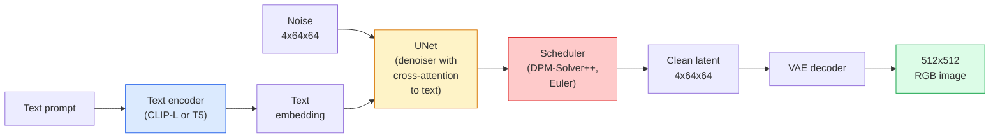

# Stable Diffusion — アーキテクチャと Fine-Tuning

> Stable Diffusion は、pretrained VAE の latent space で動く DDPM です。text による conditioning は cross-attention で行い、高速な deterministic ODE solver で sample し、classifier-free guidance で誘導します。

**種別:** 学習 + 活用
**言語:** Python
**前提条件:** Phase 4 Lesson 10 (Diffusion), Phase 7 Lesson 02 (Self-Attention)
**所要時間:** 約75分

## 学習目標

- Stable Diffusion pipeline の 5 つの部品、VAE、text encoder、U-Net、scheduler、safety checker を追跡し、それぞれが実際に何をするかを説明する
- latent diffusion を説明し、3x512x512 image ではなく 4x64x64 latent space で学習すると、品質を落とさず compute が 48x 減る理由を説明する
- `diffusers` を使って image generation、image-to-image、inpainting、ControlNet-guided generation を実行する
- 小さな custom dataset で Stable Diffusion を LoRA fine-tune し、inference で LoRA adapter を読み込む

## 問題

512x512 RGB images 上で DDPM を直接学習するのは高価です。各 training step は 3x512x512 = 786,432 input values を見る U-Net を backprop し、sampling は同じ U-Net を 50 回以上 forward します。Stable Diffusion 1.5（2022 年リリース）の品質水準では、pixel-space diffusion はおよそ 256 GPU-months の学習と、consumer GPU で 1 画像あたり 10-30 秒を必要とします。

open-weight text-to-image を実用化した工夫が **latent diffusion**（Rombach et al., CVPR 2022）です。3x512x512 image を 4x64x64 latent tensor に写像し戻す VAE を学習し、その latent space で diffusion を行います。compute は `(3*512*512)/(4*64*64) = 48x` 下がります。sampling は同じ GPU で数十秒から 2 秒未満になります。

ほぼすべての現代的 image-generation model、SDXL、SD3、FLUX、HunyuanDiT、Wan-Video は latent diffusion model であり、autoencoder、denoiser（U-Net または DiT）、text conditioning に variation があります。Stable Diffusion を学べば、その template を学んだことになります。

## コンセプト

### Pipeline



- **VAE** — frozen autoencoder。Encoder は image を latents に変換します（img2img と training で使用）。Decoder は latents を image に戻します。
- **Text encoder** — CLIP text encoder（SD 1.x/2.x）、CLIP-L + CLIP-G（SDXL）、または T5-XXL（SD3/FLUX）。token embeddings の sequence を生成します。
- **U-Net** — denoiser。各 resolution level に、latents から text embedding へ attend する cross-attention layers を持ちます。
- **Scheduler** — sampling algorithm（DDIM、Euler、DPM-Solver++）。sigmas を選び、predicted noise を latent に戻し混ぜます。
- **Safety checker** — output image に対する任意の NSFW / illegal-content filter。

### Classifier-free guidance (CFG)

通常の text conditioning は、すべての prompt `c` について `epsilon_theta(x_t, t, c)` を学びます。CFG は同じ network を、10% の確率で `c` を落とした状態（empty embedding に置換）でも学習します。これにより、単一 model が conditional と unconditional の noise を両方予測できます。inference では次の式を使います。

```
eps = eps_uncond + w * (eps_cond - eps_uncond)
```

`w` は guidance scale です。`w=0` は unconditional、`w=1` は plain conditional、`w>1` は diversity を犠牲にしつつ output を「より prompt に条件づけられた」方向へ押します。SD の default は `w=7.5` です。

CFG は text-to-image が production quality で動く理由です。これがないと prompt の影響は弱く、これがあると prompt が支配的になります。

### Latent space geometry

VAE の 4-channel latent は単なる compressed image ではありません。そこは arithmetic が意味的編集におおむね対応する manifold であり、prompt engineering と interpolation はどちらもここにあります。diffusion U-Net は model budget のすべてをここに使うよう学習されています。random な 4x64x64 latent を decode しても random-looking image にはなりません。valid images に decode されるのは latent の特定の submanifold だけなので、garbage になります。

2 つの帰結があります。

1. **Img2img** = image を latent に encode し、partial noise を加え、denoiser を走らせ、decode する。encoding がほぼ可逆なので image structure は残り、content は prompt に応じて変わる。
2. **Inpainting** = img2img と同じだが、denoiser は masked regions だけを更新する。unmasked regions は encoded latent のまま保持される。

### U-Net architecture

SD U-Net は Lesson 10 の TinyUNet を大きくしたものに、3 つの追加があります。

- 各 spatial resolution の **Transformer blocks**。self-attention + text embedding への cross-attention を含む。
- sinusoidal encoding 上の MLP による **Time embedding**。
- matching resolutions の encoder と decoder 間の **Skip connections**。

SD 1.5 の総 parameters は約 860M。SDXL は約 2.6B。FLUX は約 12B。parameters の増加は主に attention layers にあります。

### LoRA fine-tuning

Stable Diffusion の full fine-tuning は 20+ GB の VRAM を必要とし、860M parameters を更新します。LoRA（Low-Rank Adaptation）は base model を frozen のままにし、attention layers に小さな rank-decomposition matrices を注入します。SD 用 LoRA adapter は通常 10-50 MB で、single consumer GPU で 10-60 分で学習でき、inference time に drop-in modification として読み込めます。

```
Original: W_q : (d_in, d_out)   frozen
LoRA:     W_q + alpha * (A @ B)   where A : (d_in, r), B : (r, d_out)

r is typically 4-32.
```

LoRA はほぼすべての community fine-tune が配布される形式です。CivitAI と Hugging Face はそれらを大量に host しています。

### よく見る schedulers

- **DDIM** — deterministic、約 50 steps、simple。
- **Euler ancestral** — stochastic、30-50 steps、少し creative な samples。
- **DPM-Solver++ 2M Karras** — deterministic、20-30 steps、production default。
- **LCM / TCD / Turbo** — consistency models と distilled variants。品質を多少犠牲にして 1-4 steps。

`diffusers` では scheduler の差し替えは 1 行で、retraining なしに sample issues を直せることがあります。

## 実装

この lesson では Stable Diffusion を scratch から再構築せず、`diffusers` を end-to-end で使います。再構築に必要な部品（VAE、text encoder、U-Net、scheduler）はそれぞれ別 lesson の主題です。ここでの目標は production API に慣れることです。

### Step 1: Text-to-image

```python
import torch
from diffusers import StableDiffusionPipeline

pipe = StableDiffusionPipeline.from_pretrained(
    "runwayml/stable-diffusion-v1-5",
    torch_dtype=torch.float16,
).to("cuda")

image = pipe(
    prompt="a dog riding a skateboard in tokyo, studio ghibli style",
    guidance_scale=7.5,
    num_inference_steps=25,
    generator=torch.Generator("cuda").manual_seed(42),
).images[0]
image.save("dog.png")
```

`float16` は目に見える品質低下なしに VRAM を半分にします。default DPM-Solver++ の `num_inference_steps=25` は DDIM の `num_inference_steps=50` に匹敵します。

### Step 2: Scheduler を差し替える

```python
from diffusers import DPMSolverMultistepScheduler, EulerAncestralDiscreteScheduler

pipe.scheduler = DPMSolverMultistepScheduler.from_config(pipe.scheduler.config)
pipe.scheduler = EulerAncestralDiscreteScheduler.from_config(pipe.scheduler.config)
```

Scheduler state は U-Net weights から切り離されています。DDPM で学習し、任意の scheduler で sample できます。

### Step 3: Image-to-image

```python
from diffusers import StableDiffusionImg2ImgPipeline
from PIL import Image

img2img = StableDiffusionImg2ImgPipeline.from_pretrained(
    "runwayml/stable-diffusion-v1-5",
    torch_dtype=torch.float16,
).to("cuda")

init_image = Image.open("dog.png").convert("RGB").resize((512, 512))
out = img2img(
    prompt="a dog riding a skateboard, oil painting",
    image=init_image,
    strength=0.6,
    guidance_scale=7.5,
).images[0]
```

`strength` は denoising 前に加える noise の量です（0.0 = unchanged、1.0 = full regeneration）。style transfer では 0.5-0.7 が標準範囲です。

### Step 4: Inpainting

```python
from diffusers import StableDiffusionInpaintPipeline

inpaint = StableDiffusionInpaintPipeline.from_pretrained(
    "runwayml/stable-diffusion-inpainting",
    torch_dtype=torch.float16,
).to("cuda")

image = Image.open("dog.png").convert("RGB").resize((512, 512))
mask = Image.open("dog_mask.png").convert("L").resize((512, 512))

out = inpaint(
    prompt="a cat",
    image=image,
    mask_image=mask,
    guidance_scale=7.5,
).images[0]
```

mask の white pixels が regenerate する領域です。black pixels は保持されます。

### Step 5: LoRA loading

```python
pipe.load_lora_weights("sayakpaul/sd-lora-ghibli")
pipe.fuse_lora(lora_scale=0.8)

image = pipe(prompt="a village square in ghibli style").images[0]
```

`lora_scale` は強さを制御します。0.0 = no effect、1.0 = full effect。`fuse_lora` は速度のため adapter を weights に in-place で焼き込みますが、差し替えを防ぎます。別の adapter を読み込む前に `pipe.unfuse_lora()` を呼びます。

### Step 6: LoRA training (sketch)

実際の LoRA training は `peft` または `diffusers.training` にあります。概要は次の通りです。

```python
# Pseudocode
for step, batch in enumerate(dataloader):
    images, prompts = batch
    latents = vae.encode(images).latent_dist.sample() * 0.18215

    t = torch.randint(0, num_train_timesteps, (batch_size,))
    noise = torch.randn_like(latents)
    noisy_latents = scheduler.add_noise(latents, noise, t)

    text_emb = text_encoder(tokenizer(prompts))

    pred_noise = unet(noisy_latents, t, text_emb)  # LoRA weights injected here

    loss = F.mse_loss(pred_noise, noise)
    loss.backward()
    optimizer.step()
```

勾配を受け取るのは LoRA matrices だけです。base U-Net、VAE、text encoder は frozen です。batch size 1 と gradient checkpointing なら 8 GB の VRAM に収まります。

## 使う

production で実際に決めることは次の通りです。

- **Model family**: open-source community fine-tunes では SD 1.5、高 fidelity では SDXL、state of the art と厳密な licensing requirements では SD3 / FLUX。
- **Scheduler**: 20-30 steps の DPM-Solver++ 2M Karras、latency が 1s 未満なら LCM-LoRA。
- **Precision**: 4080/4090 では `float16`、A100 以降では `bfloat16`、VRAM が厳しいときは `int8`（`bitsandbytes` または `compel` 経由）。
- **Conditioning**: plain text は動く。より強い制御には base pipeline に ControlNet（canny、depth、pose）を追加する。

batch generation では `AUTO1111` / `ComfyUI` が community tools です。production APIs では `diffusers` + `accelerate`、または TensorRT compilation を伴う `optimum-nvidia` を使います。

## 成果物

この lesson は次を生成します。

- `outputs/prompt-sd-pipeline-planner.md` — latency budget、fidelity target、licensing constraint から SD 1.5 / SDXL / SD3 / FLUX と scheduler と precision を選ぶ prompt。
- `outputs/skill-lora-training-setup.md` — custom dataset 用に captions、rank、batch size、learning rate を含む完全な LoRA training config を書く skill。

## 演習

1. **(Easy)** 同じ prompt を `guidance_scale` in `[1, 3, 5, 7.5, 10, 15]` で生成してください。image がどう変わるか説明してください。どの guidance value で artefacts が現れますか？
2. **(Medium)** 任意の real photograph を `StableDiffusionImg2ImgPipeline` に通し、`strength` in `[0.2, 0.4, 0.6, 0.8, 1.0]` を試してください。どの strength が composition を保持しつつ style を変えますか？なぜ 1.0 は入力を完全に無視するのですか？
3. **(Hard)** 単一 subject（pet、logo、character）の 10-20 images で LoRA を学習し、その subject を含む新しい scenes を生成してください。input images に overfit せず identity preservation が最も良かった LoRA rank と training steps を報告してください。

## 重要用語

| Term | What people say | What it actually means |
|------|----------------|----------------------|
| Latent diffusion | 「latents で diffuse」 | pixel space（3x512x512）ではなく VAE latent space（4x64x64）で DDPM 全体を実行する。compute saving は 48x |
| VAE scale factor | 「0.18215」 | VAE の raw latent をおおむね unit variance に rescale する定数。すべての SD pipeline に hardcoded |
| Classifier-free guidance | 「CFG」 | conditional と unconditional の noise predictions を混ぜる。最も影響の大きい inference knob |
| Scheduler | 「Sampler」 | noise + model predictions を denoised latent trajectory に変換する algorithm |
| LoRA | 「Low-rank adapter」 | base weights に触れず attention layers を fine-tune する小さな rank-decomposition matrices |
| Cross-attention | 「Text-image attention」 | latent tokens から text tokens への attention。各 U-Net level に prompt information を注入する |
| ControlNet | 「Structure conditioning」 | 追加 input（canny、depth、pose、segmentation）で SD を誘導する separately-trained adapter |
| DPM-Solver++ | 「default scheduler」 | second-order deterministic ODE solver。2026 年時点で低 step counts（20-30）における最良品質 |

## 参考文献

- [High-Resolution Image Synthesis with Latent Diffusion (Rombach et al., 2022)](https://arxiv.org/abs/2112.10752) — Stable Diffusion paper。設計を正当化する ablation がすべて含まれる
- [Classifier-Free Diffusion Guidance (Ho & Salimans, 2022)](https://arxiv.org/abs/2207.12598) — CFG paper
- [LoRA: Low-Rank Adaptation of Large Language Models (Hu et al., 2021)](https://arxiv.org/abs/2106.09685) — LoRA は NLP-first で、ほぼ変更なしに SD へ移植された
- [diffusers documentation](https://huggingface.co/docs/diffusers) — すべての SD / SDXL / SD3 / FLUX pipeline の reference
