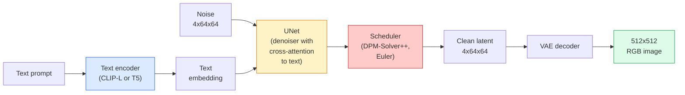

# Kararlı Difüzyon — Mimari ve Fine-Tuning

> Kararlı Difüzyon, önceden eğitilmiş bir VAE'nin gizli alanında çalışan, çapraz dikkat yoluyla metin üzerinde koşullandırılan, hızlı deterministik bir ODE çözücüyle örneklenen ve sınıflandırıcıdan bağımsız rehberlikle yönlendirilen bir DDPM'dir.

**Tür:** Öğren + Kullan
**Diller:** Python
**Önkoşullar:** Aşama 4 Ders 10 (Yayılma), Aşama 7 Ders 02 (Kişisel Dikkat)
**Süre:** ~75 dakika

## Öğrenme Hedefleri

- Kararlı Difüzyon hattının beş parçasını takip edin: VAE, metin kodlayıcı, U-Net, zamanlayıcı, güvenlik denetleyicisi — ve bunların her birinin gerçekte ne yaptığını öğrenin
- Gizli yayılımı ve 4x64x64 gizli alanda (3x512x512 görüntü yerine) eğitimin neden kalite kaybı olmadan bilgi işlemi 48 kat azalttığını açıklayın
- Görüntüler oluşturmak, görüntüden görüntüye, iç boyama ve ControlNet destekli oluşturma işlemlerini gerçekleştirmek için `diffusers`'yi kullanın
- Küçük ve özel bir dataset üzerinde LoRA ile Stabil Difüzyona ince ayar yapın ve LoRA adaptörünü inference'ye yükleyin

## Sorun

Bir DDPM'yi doğrudan 512x512 RGB görüntüler üzerinde eğitmek pahalıdır. Her eğitim adımı, 3x512x512 = 786.432 giriş değerini gören bir U-Net üzerinden geri destek sağlar ve örnekleme, aynı U-Net üzerinden 50'den fazla ileri geçiş alır. Stable Diffusion 1.5'in (2022'de piyasaya sürüldü) kalite düzeyinde, piksel alanı difüzyonu yaklaşık 256 GPU-aylık eğitime ve tüketici GPU'sunda görüntü başına 10-30 saniyeye ihtiyaç duyacaktır.

Açık ağırlıklı metinden resme dönüştürmeyi pratik hale getiren püf noktası **gizli yayılma** idi (Rombach ve diğerleri, CVPR 2022). 3x512x512 görüntüyü 4x64x64 gizli tensöre ve geriye eşleyen bir VAE eğitin, ardından bu gizli alanda difüzyonu yapın. Hesaplama `(3*512*512)/(4*64*64) = 48x` oranında düşer. Örnekleme aynı GPU'da onlarca saniyeden iki saniyenin altına düşüyor.

Hemen hemen her modern görüntü oluşturma modeli - SDXL, SD3, FLUX, HunyuanDiT, Wan-Video - otomatik kodlayıcı, gürültü giderici (U-Net veya DiT) ve metin koşullandırmadaki varyasyonlara sahip gizli bir yayılma modelidir. Kararlı Difüzyonu öğrenin ve şablonu öğrendiniz.

## Konsept

### Boru hattı



- **VAE** — dondurulmuş otomatik kodlayıcı. Kodlayıcı, görüntüyü gizli öğelere dönüştürür (img2img ve eğitim için kullanılır). Kod çözücü gizli olanları tekrar görüntüye dönüştürür.
- **Metin kodlayıcı** — CLIP metin kodlayıcı (SD 1.x/2.x), CLIP-L + CLIP-G (SDXL) veya T5-XXL (SD3/FLUX). Bir token embedding dizisi üretir.
- **U-Net** — gürültü giderici. Her çözünürlük düzeyinde gizli metinlerden embedding metnine katılan çapraz dikkat katmanlarına sahiptir.
- **Zamanlayıcı** — örnekleme algoritması (DDIM, Euler, DPM-Solver++). Sigmaları seçer, tahmin edilen gürültüyü tekrar gizli olana karıştırır.
- **Güvenlik denetleyicisi** — çıktı görüntüsünde isteğe bağlı NSFW / yasa dışı içerik filtresi.

### Sınıflandırıcısız rehberlik (CFG)

Düz metin koşullandırma, her prompt `c` için `epsilon_theta(x_t, t, c)`'yi öğrenir. CFG, aynı ağı `c` ile eğitir ve zamanın %10'unu düşürür (boş bir embedding ile değiştirilir), hem koşullu hem de koşulsuz gürültüyü tahmin eden tek bir model verir. inference'de:

```
eps = eps_uncond + w * (eps_cond - eps_uncond)
```

`w` kılavuz ölçeğidir. `w=0` koşulsuzdur, `w=1` düz koşulludur, `w>1`, çıktıyı çeşitlilik pahasına "prompt üzerinde daha koşullu" olmaya doğru iter. SD varsayılanı `w=7.5`'dir.

CFG, metinden resme çalışmanın üretim kalitesinde çalışmasının nedenidir. Bu olmadan, prompt'ler çıkışı zayıf bir şekilde saptırır; onunla prompt'ler hakimdir.

### Gizli uzay geometrisi

VAE'nin 4 kanallı gizli özelliği yalnızca sıkıştırılmış bir görüntü değildir. Aritmetiğin kabaca anlamsal düzenlemelere karşılık geldiği (prompt mühendislik + enterpolasyon her ikisi de burada yaşıyor) ve difüzyon U-Net'in tüm modelleme bütçesini harcamak üzere eğitildiği bir manifolddur. Rastgele bir 4x64x64 gizlisinin kodunun çözülmesi rastgele görünümlü bir görüntü üretmez; çöp üretir, çünkü yalnızca belirli bir gizli alt manifold geçerli görüntülerin kodunu çözer.

İki sonuç:

1. **Img2img** = görüntüyü gizli olarak kodlayın, kısmi gürültü ekleyin, gürültü gidericiyi çalıştırın, kodu çözün. Kodlama neredeyse tersine çevrilebilir olduğundan görüntü yapısı hayatta kalır; içerik prompt'ye göre değişir.
2. **İç boyama** = img2img ile aynıdır ancak gürültü giderici yalnızca maskelenen bölgeleri günceller; maskesiz bölgeler kodlanmış gizli bölgede tutulur.

### U-Net mimarisi

SD U-Net, Ders 10'daki TinyUNet'in üç eklemeyle büyük bir versiyonudur:

- **Transformer blokları** her uzamsal çözünürlükte, kişisel dikkat + embedding metnine çapraz dikkat içerir.
- **Sinüzoidal kodlamada MLP yoluyla embedding süresi**.
- Eşleşen çözünürlüklerde kodlayıcı ve kod çözücü arasındaki **bağlantıları atlayın**.

SD 1.5'teki toplam parametreler: ~860M. SDXL: ~2,6B. AKı: ~12B. Paramlardaki atlama çoğunlukla dikkat katmanlarındadır.

### LoRA fine-tuning

Tam fine-tuning Kararlı Difüzyon, 20+ GB VRAM gerektirir ve 860M parametreleri günceller. LoRA (Düşük Sıralı Uyarlama), temel modeli donmuş halde tutar ve dikkat katmanlarına küçük sıra ayrıştırma matrisleri enjekte eder. SD için bir LoRA adaptörü genellikle 10-50 MB boyutundadır, tek bir tüketici GPU'sunda 10-60 dakikada eğitilir ve hemen yapılan bir değişiklik olarak inference zamanında yüklenir.

```
Original: W_q : (d_in, d_out)   frozen
LoRA:     W_q + alpha * (A @ B)   where A : (d_in, r), B : (r, d_out)

r is typically 4-32.
```

LoRA, neredeyse her topluluğun ince ayarının nasıl dağıtıldığıdır. CivitAI ve Hugging Face bunlardan milyonlarcasına ev sahipliği yapıyor.

### Göreceğiniz zamanlayıcılar

- **DDIM** — deterministik, ~50 adım, basit.
- **Euler'in ataları** — stokastik, 30-50 adım, biraz daha yaratıcı örnekler.
- **DPM-Solver++ 2M Karras** — deterministik, 20-30 adım, üretim varsayılanı.
- **LCM / TCD / Turbo** — tutarlılık modelleri ve damıtılmış çeşitler; Biraz kalite pahasına 1-4 adım.

Zamanlayıcıların değiştirilmesi, `diffusers`'de tek satırlık bir değişikliktir ve bazen örnek sorunları herhangi bir yeniden eğitim gerektirmeden düzeltir.

## İnşa Et

Bu derste Kararlı Difüzyonu sıfırdan yeniden oluşturmak yerine `diffusers` uçtan uca kullanılır. Yeniden oluşturmanız gereken parçalar (VAE, metin kodlayıcı, U-Net, zamanlayıcı) kendi derslerinin konularıdır; burada amaç üretim API'sini akıcı bir şekilde kullanmaktır.

### Adım 1: Metinden resme

```python
import torch
from diffusers import StableDiffusionPipeline

pipe = StableDiffusionPipeline.from_pretrained(
    "runwayml/stable-diffusion-v1-5",
    torch_dtype=torch.float16,
).to("cuda")

image = pipe(
    prompt="a dog riding a skateboard in tokyo, studio ghibli style",
    guidance_scale=7.5,
    num_inference_steps=25,
    generator=torch.Generator("cuda").manual_seed(42),
).images[0]
image.save("dog.png")
```

`float16`, gözle görülür bir kalite kaybı olmadan VRAM'i yarıya indirir. Varsayılan DPM-Solver++ ile `num_inference_steps=25`, DDIM ile `num_inference_steps=50` ile eşleşir.

### 2. Adım: Zamanlayıcıyı değiştirin

```python
from diffusers import DPMSolverMultistepScheduler, EulerAncestralDiscreteScheduler

pipe.scheduler = DPMSolverMultistepScheduler.from_config(pipe.scheduler.config)
pipe.scheduler = EulerAncestralDiscreteScheduler.from_config(pipe.scheduler.config)
```

Zamanlayıcı durumu U-Net ağırlıklarından ayrılmıştır. DDPM üzerinde eğitim alabilir ve herhangi bir planlayıcıyla örnekleme yapabilirsiniz.

### 3. Adım: Görüntüden görüntüye

```python
from diffusers import StableDiffusionImg2ImgPipeline
from PIL import Image

img2img = StableDiffusionImg2ImgPipeline.from_pretrained(
    "runwayml/stable-diffusion-v1-5",
    torch_dtype=torch.float16,
).to("cuda")

init_image = Image.open("dog.png").convert("RGB").resize((512, 512))
out = img2img(
    prompt="a dog riding a skateboard, oil painting",
    image=init_image,
    strength=0.6,
    guidance_scale=7.5,
).images[0]
```

`strength`, gürültü gidermeden önce ne kadar gürültü ekleneceğidir (0,0 = değişmedi, 1,0 = tam yenilenme). 0,5-0,7 stil aktarımı için standart aralıktır.

### Adım 4: İç Boyama

```python
from diffusers import StableDiffusionInpaintPipeline

inpaint = StableDiffusionInpaintPipeline.from_pretrained(
    "runwayml/stable-diffusion-inpainting",
    torch_dtype=torch.float16,
).to("cuda")

image = Image.open("dog.png").convert("RGB").resize((512, 512))
mask = Image.open("dog_mask.png").convert("L").resize((512, 512))

out = inpaint(
    prompt="a cat",
    image=image,
    mask_image=mask,
    guidance_scale=7.5,
).images[0]
```

Maskedeki beyaz pikseller yenilenecek alandır. Siyah pikseller korunur.

### Adım 5: LoRA yükleniyor

```python
pipe.load_lora_weights("sayakpaul/sd-lora-ghibli")
pipe.fuse_lora(lora_scale=0.8)

image = pipe(prompt="a village square in ghibli style").images[0]
```

`lora_scale` gücü kontrol eder; 0,0 = etki yok, 1,0 = tam etki. `fuse_lora`, hız için adaptörü ağırlıkların yerine yerleştirir ancak değiştirilmesini önler. Farklı bir adaptör yüklemeden önce `pipe.unfuse_lora()`'yi arayın.

### Adım 6: LoRA eğitimi (taslak)

Gerçek LoRA eğitimi `peft` veya `diffusers.training`'de yaşar. Ana hat:

```python
# Pseudocode
for step, batch in enumerate(dataloader):
    images, prompts = batch
    latents = vae.encode(images).latent_dist.sample() * 0.18215

    t = torch.randint(0, num_train_timesteps, (batch_size,))
    noise = torch.randn_like(latents)
    noisy_latents = scheduler.add_noise(latents, noise, t)

    text_emb = text_encoder(tokenizer(prompts))

    pred_noise = unet(noisy_latents, t, text_emb)  # LoRA weights injected here

    loss = F.mse_loss(pred_noise, noise)
    loss.backward()
    optimizer.step()
```

Yalnızca LoRA matrisleri gradient'yi alır; temel U-Net, VAE ve metin kodlayıcı dondurulur. Toplu iş boyutu 1 ve gradient kontrol noktasıyla bu, 8 GB VRAM'e sığar.

## Kullan onu

Üretimde gerçekte aldığınız kararlar:

- **Model ailesi**: Açık kaynak topluluğu ince ayarları için SD 1.5, daha yüksek doğruluk için SDXL, son teknoloji ve sıkı lisanslama gereksinimleri için SD3 / FLUX.
- **Zamanlayıcı**: 20-30 adım için DPM-Solver++ 2M Karras, gecikme 1 saniyenin altında olduğunda LCM-LoRA.
- **Hassaslık**: 4080/4090'da `float16`, A100 ve daha yenisinde `bfloat16`, VRAM sıkı olduğunda `int8` (`bitsandbytes` veya `compel` aracılığıyla).
- **Koşullandırma**: düz metin çalışmaları; daha güçlü kontrol için temel boru hattının üstüne ControlNet'i (canny, derinlik, poz) ekleyin.

Toplu oluşturma için `AUTO1111` / `ComfyUI` topluluk araçlarıdır; üretim API'leri için `diffusers` + `accelerate` veya TensorRT derlemeli `optimum-nvidia`.

## Gönderin

Bu ders şunları üretir:

- `outputs/prompt-sd-pipeline-planner.md` — Gecikme bütçesi, aslına uygunluk hedefi ve lisanslama kısıtlaması göz önüne alındığında SD 1.5 / SDXL / SD3 / FLUX artı zamanlayıcı ve hassasiyeti seçen bir prompt.
- `outputs/skill-lora-training-setup.md` — altyazılar, sıralama, grup boyutu ve öğrenme oranı dahil olmak üzere özel bir dataset için tam bir LoRA eğitim yapılandırması yazan bir beceri.

## Egzersizler

1. **(Kolay)** `[1, 3, 5, 7.5, 10, 15]`'de `guidance_scale` ile aynı prompt'yi oluşturun. Görüntünün nasıl değiştiğini açıklayın. Artefaktlar hangi rehberlik değerinde ortaya çıkıyor?
2. **(Orta)** Herhangi bir gerçek fotoğraf çekin, `[0.2, 0.4, 0.6, 0.8, 1.0]`'deki `strength` adresindeki `StableDiffusionImg2ImgPipeline` aracılığıyla çalıştırın. Stili değiştirirken kompozisyonu koruyan güç hangisidir? 1.0 neden girişi tamamen görmezden geliyor?
3. **(Zor)** Tek bir konunun (bir evcil hayvan, bir logo, bir karakter) 10-20 görüntüsü üzerinde bir LoRA'yı eğitin ve o konunun içinde yer aldığı yeni sahneler oluşturun. Giriş görüntülerine aşırı uyum sağlamadan en iyi kimlik korumasını sağlayan LoRA sıralamasını ve eğitim adımlarını bildirin.

## Anahtar Terimler

| Dönem | İnsanlar ne diyor | Aslında ne anlama geliyor |
|------|----------------|----------------------|
| Gizli difüzyon | "Gizli olarak yayılma" | DDPM'nin tamamını piksel alanı (3x512x512) yerine VAE gizli alanında (4x64x64) çalıştırın; 48 kat bilgi işlem tasarrufu |
| VAE ölçek faktörü | "0.18215" | VAE'nin ham gizli değerini kabaca birim varyansa yeniden ölçeklendiren sabit; her SD hattına sabit kodlanmıştır |
| Sınıflandırıcısız rehberlik | "CFG" | Koşullu ve koşulsuz gürültü tahminlerini karıştırın; en etkili tek inference düğmesi |
| Zamanlayıcı | "Örnekleyici" | Gürültü + model tahminlerini gürültüden arındırılmış gizli bir yörüngeye dönüştüren algoritma |
| LoRA | "Düşük dereceli adaptör" | Temel ağırlıklara dokunmadan dikkat katmanlarına ince ayar yapan küçük sıralama ayrıştırma matrisleri |
| Çapraz dikkat | "Metin-resim dikkati" | Gizli token'lerden metin token'lere dikkat; prompt bilgilerini her U-Net seviyesine enjekte eder |
| ControlNet | "Yapı koşullandırma" | SD'yi ekstra bir girişle (canny, derinlik, poz, segmentasyon) yönlendiren, ayrı olarak eğitilmiş bir adaptör |
| DPM-Çözücü++ | "Varsayılan zamanlayıcı" | İkinci dereceden deterministik ODE çözücü; 2026'da düşük adım sayısında (20-30) en iyi kalite |

## Daha Fazla Okuma

- [Gizli Yayılma ile Yüksek Çözünürlüklü Görüntü Sentezi (Rombach ve diğerleri, 2022)](https://arxiv.org/abs/2112.10752) — Kararlı Yayılma belgesi; tasarımı haklı çıkaran her türlü ablasyonu içerir
- [Sınıflandırıcıdan Bağımsız Difüzyon Kılavuzu (Ho ve Salimans, 2022)](https://arxiv.org/abs/2207.12598) — CFG makalesi
- [LoRA: Büyük Dil Modellerinin Düşük Sıralı Uyarlanması (Hu ve diğerleri, 2021)](https://arxiv.org/abs/2106.09685) — LoRA, NLP'de ilk olandı; neredeyse hiçbir değişiklik yapılmadan SD'ye aktarıldı
- [difüzör belgeleri](https://huggingface.co/docs/diffusers) — her SD / SDXL / SD3 / FLUX boru hattı için referans
