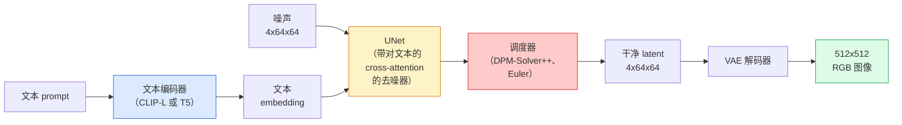

# Stable Diffusion — 架构与微调

> 译注：本文译自同目录 [`en.md`](./en.md)。术语遵循仓根 [TRANSLATION_GUIDE.md](../../../../TRANSLATION_GUIDE.md)。

> Stable Diffusion 是一种 DDPM：它跑在一个预训练 VAE 的 latent（潜在）空间里，通过 cross-attention 接受文本条件，用一个快速的确定性 ODE 求解器采样，并由 classifier-free guidance（无分类器引导）来掌舵。

**Type:** Learn + Use
**Languages:** Python
**Prerequisites:** Phase 4 Lesson 10 (Diffusion), Phase 7 Lesson 02 (Self-Attention)
**Time:** ~75 minutes

## 学习目标（Learning Objectives）

- 梳理 Stable Diffusion pipeline 的五个组件：VAE、text encoder、U-Net、scheduler、safety checker，以及它们各自到底在干什么
- 解释 latent diffusion（潜在扩散），以及为什么在 4x64x64 的 latent 空间（而不是 3x512x512 的图像）里训练能把算力压缩 48 倍且不损失质量
- 用 `diffusers` 做图像生成、image-to-image、inpainting，以及 ControlNet 引导的生成
- 在小型自定义数据集上用 LoRA 微调 Stable Diffusion，并在推理时加载 LoRA adapter

## 问题（The Problem）

直接在 512x512 RGB 图像上训练 DDPM 代价很大。每一步训练都要在一个看到 3x512x512 = 786,432 个输入值的 U-Net 上反向传播，而采样要在同一个 U-Net 上跑 50+ 次前向传播。要达到 Stable Diffusion 1.5（2022 年发布）的质量水平，像素空间的扩散大概需要 256 个 GPU·月的训练，并且在消费级 GPU 上每张图要跑 10-30 秒。

让开源权重 text-to-image 真正能落地的关键技巧，是 **latent diffusion（潜在扩散）**（Rombach 等，CVPR 2022）。先训一个 VAE，把 3x512x512 的图像映射到 4x64x64 的 latent 张量再映射回去，然后在那个 latent 空间里做扩散。算力下降 `(3*512*512)/(4*64*64) = 48 倍`。在同一块 GPU 上，采样从几十秒降到两秒以内。

几乎所有现代图像生成模型——SDXL、SD3、FLUX、HunyuanDiT、Wan-Video——都是 latent diffusion 模型，只在 autoencoder、denoiser（U-Net 或 DiT）和文本条件这几个地方做变化。学会 Stable Diffusion，你就掌握了这个模板。

## 概念（The Concept）

### pipeline 概览



- **VAE** —— 冻结的 autoencoder。Encoder 把图像变成 latent（用于 img2img 和训练）；Decoder 把 latent 还原成图像。
- **Text encoder** —— CLIP text encoder（SD 1.x/2.x）、CLIP-L + CLIP-G（SDXL），或 T5-XXL（SD3/FLUX）。输出一串 token embedding。
- **U-Net** —— denoiser。在每个分辨率层级都有 cross-attention 层，让 latent 关注 text embedding。
- **Scheduler** —— 采样算法（DDIM、Euler、DPM-Solver++）。它选 sigma，把预测出来的噪声混合回 latent。
- **Safety checker** —— 可选的 NSFW / 违法内容过滤器，作用在输出图像上。

### Classifier-free guidance（CFG，无分类器引导）

普通的文本条件训练学的是 `epsilon_theta(x_t, t, c)`：每个 prompt `c` 一份。CFG 在训练同一个网络时，有 10% 的概率把 `c` 丢掉（替换成空 embedding），从而得到一个同时能预测条件和无条件噪声的单一模型。推理时：

```
eps = eps_uncond + w * (eps_cond - eps_uncond)
```

`w` 是 guidance scale。`w=0` 是无条件，`w=1` 是普通条件，`w>1` 把输出推向「更服从 prompt」，代价是损失多样性。SD 默认 `w=7.5`。

CFG 是 text-to-image 能达到生产质量的关键。没有它，prompt 对输出的影响很弱；有了它，prompt 才能主导生成。

### latent 空间几何

VAE 的 4 通道 latent 不只是一个被压缩的图像。它是一个流形（manifold），上面的算术运算大致对应语义编辑（prompt 工程 + 插值都生活在这里），而扩散 U-Net 把全部建模预算都花在了这个空间里。随便解码一个 4x64x64 的 latent，并不会得到一张随机图像——你会得到一团乱码，因为只有 latent 空间里的某个特定子流形才会解码出有效图像。

两个推论：

1. **Img2img** = 把图像编码成 latent，加一部分噪声，跑 denoiser，再解码。图像结构能保留下来，因为编码近似可逆；内容则跟随 prompt 改变。
2. **Inpainting** = 跟 img2img 一样，只是 denoiser 只更新被 mask 的区域；未被 mask 的区域始终保持在编码出来的 latent 上。

### U-Net 架构

SD 的 U-Net 是 Lesson 10 那个 TinyUNet 的放大版，外加三处增量：

- 在每个空间分辨率上都有 **transformer block**，里面有 self-attention + 对 text embedding 的 cross-attention。
- **Time embedding**：sinusoidal 编码再过一个 MLP。
- encoder 与 decoder 在对应分辨率上的 **skip connection（跳跃连接）**。

SD 1.5 总参数量约 860M。SDXL 约 2.6B。FLUX 约 12B。参数量主要堆在 attention 层。

### LoRA 微调

完整 fine-tune Stable Diffusion 需要 20+ GB 显存，要更新 860M 个参数。LoRA（Low-Rank Adaptation，低秩自适应）让 base model 保持冻结，只往 attention 层里注入小的低秩分解矩阵。一个 SD 的 LoRA adapter 通常 10-50 MB，在单张消费级 GPU 上 10-60 分钟就能训完，推理时作为即插即用的修改加载进来。

```
Original: W_q : (d_in, d_out)   frozen
LoRA:     W_q + alpha * (A @ B)   where A : (d_in, r), B : (r, d_out)

r is typically 4-32.
```

社区里几乎所有的微调成果都是以 LoRA 的形式分发的。CivitAI 和 Hugging Face 上有数百万个。

### 你会遇到的 scheduler

- **DDIM** —— 确定性，约 50 步，简单。
- **Euler ancestral** —— 随机性，30-50 步，样本会稍微更有创意一点。
- **DPM-Solver++ 2M Karras** —— 确定性，20-30 步，生产环境默认。
- **LCM / TCD / Turbo** —— 一致性模型和蒸馏变体；1-4 步出图，代价是质量略降。

在 `diffusers` 里换 scheduler 只是一行代码的事，有时候不需要重新训练就能修复采样上的问题。

## 动手实现（Build It）

这一课从头到尾用 `diffusers`，不再从零搭 Stable Diffusion。需要从零搭的几块（VAE、text encoder、U-Net、scheduler）各自有自己的课程；这里目标是熟练掌握生产级 API。

### Step 1: Text-to-image

```python
import torch
from diffusers import StableDiffusionPipeline

pipe = StableDiffusionPipeline.from_pretrained(
    "runwayml/stable-diffusion-v1-5",
    torch_dtype=torch.float16,
).to("cuda")

image = pipe(
    prompt="a dog riding a skateboard in tokyo, studio ghibli style",
    guidance_scale=7.5,
    num_inference_steps=25,
    generator=torch.Generator("cuda").manual_seed(42),
).images[0]
image.save("dog.png")
```

`float16` 把显存砍一半，肉眼上看不到质量损失。用默认的 DPM-Solver++ 跑 `num_inference_steps=25` ，效果与 DDIM 跑 `num_inference_steps=50` 相当。

### Step 2: 换 scheduler

```python
from diffusers import DPMSolverMultistepScheduler, EulerAncestralDiscreteScheduler

pipe.scheduler = DPMSolverMultistepScheduler.from_config(pipe.scheduler.config)
pipe.scheduler = EulerAncestralDiscreteScheduler.from_config(pipe.scheduler.config)
```

scheduler 状态与 U-Net 权重是解耦的。你可以用 DDPM 训练，然后用任意 scheduler 采样。

### Step 3: Image-to-image

```python
from diffusers import StableDiffusionImg2ImgPipeline
from PIL import Image

img2img = StableDiffusionImg2ImgPipeline.from_pretrained(
    "runwayml/stable-diffusion-v1-5",
    torch_dtype=torch.float16,
).to("cuda")

init_image = Image.open("dog.png").convert("RGB").resize((512, 512))
out = img2img(
    prompt="a dog riding a skateboard, oil painting",
    image=init_image,
    strength=0.6,
    guidance_scale=7.5,
).images[0]
```

`strength` 表示去噪前要加多少噪声（0.0 = 完全不变，1.0 = 完全重生成）。0.5-0.7 是风格迁移的常用区间。

### Step 4: Inpainting

```python
from diffusers import StableDiffusionInpaintPipeline

inpaint = StableDiffusionInpaintPipeline.from_pretrained(
    "runwayml/stable-diffusion-inpainting",
    torch_dtype=torch.float16,
).to("cuda")

image = Image.open("dog.png").convert("RGB").resize((512, 512))
mask = Image.open("dog_mask.png").convert("L").resize((512, 512))

out = inpaint(
    prompt="a cat",
    image=image,
    mask_image=mask,
    guidance_scale=7.5,
).images[0]
```

mask 中的白色像素是要重新生成的区域，黑色像素被保留。

### Step 5: 加载 LoRA

```python
pipe.load_lora_weights("sayakpaul/sd-lora-ghibli")
pipe.fuse_lora(lora_scale=0.8)

image = pipe(prompt="a village square in ghibli style").images[0]
```

`lora_scale` 控制强度；0.0 = 无效果，1.0 = 全效果。`fuse_lora` 会把 adapter 就地烘焙进权重以提速，但会让你没法再切换。换 adapter 之前先调 `pipe.unfuse_lora()`。

### Step 6: LoRA 训练（草图）

真正的 LoRA 训练在 `peft` 或 `diffusers.training` 里。大致结构：

```python
# Pseudocode
for step, batch in enumerate(dataloader):
    images, prompts = batch
    latents = vae.encode(images).latent_dist.sample() * 0.18215

    t = torch.randint(0, num_train_timesteps, (batch_size,))
    noise = torch.randn_like(latents)
    noisy_latents = scheduler.add_noise(latents, noise, t)

    text_emb = text_encoder(tokenizer(prompts))

    pred_noise = unet(noisy_latents, t, text_emb)  # LoRA weights injected here

    loss = F.mse_loss(pred_noise, noise)
    loss.backward()
    optimizer.step()
```

只有 LoRA 矩阵能拿到梯度；base U-Net、VAE 和 text encoder 都是冻结的。batch size = 1 加上 gradient checkpointing，整个训练能塞进 8 GB 显存。

## 用起来（Use It）

在生产里，你真正要做的决策是：

- **模型家族**：SD 1.5 用于开源社区微调，SDXL 用于更高保真度，SD3 / FLUX 用于 SOTA 和有严格授权要求的场景。
- **Scheduler**：20-30 步用 DPM-Solver++ 2M Karras；延迟要求 1 秒以内时用 LCM-LoRA。
- **精度**：4080/4090 上用 `float16`，A100 及更新的卡上用 `bfloat16`，显存吃紧时用 `int8`（通过 `bitsandbytes` 或 `compel`）。
- **条件**：纯文本条件够用；要更强控制时，在 base pipeline 之上叠 ControlNet（canny、depth、pose）。

批量生成可以用社区工具 `AUTO1111` / `ComfyUI`；生产 API 用 `diffusers` + `accelerate`，或 `optimum-nvidia` 配合 TensorRT 编译。

## 上线部署（Ship It）

本课产出：

- `outputs/prompt-sd-pipeline-planner.md` —— 一个 prompt：在给定延迟预算、保真度目标和授权限制下，挑选 SD 1.5 / SDXL / SD3 / FLUX，并指定 scheduler 与精度。
- `outputs/skill-lora-training-setup.md` —— 一个 skill：为自定义数据集生成完整的 LoRA 训练配置，包括 caption、rank、batch size 和学习率。

## 练习（Exercises）

1. **（简单）** 同一个 prompt，用 `guidance_scale` 取 `[1, 3, 5, 7.5, 10, 15]` 各跑一次。描述图像如何变化。在哪个 guidance 值上开始出现伪影？
2. **（中等）** 任选一张真实照片，过 `StableDiffusionImg2ImgPipeline`，`strength` 取 `[0.2, 0.4, 0.6, 0.8, 1.0]`。哪个 strength 在改变风格的同时还能保住构图？为什么 1.0 会完全忽略输入？
3. **（困难）** 用同一主体（宠物、logo、角色）的 10-20 张图训一个 LoRA，然后生成包含这个主体的全新场景。报告你那次「身份保留最好且没有过拟合到输入图像」的 LoRA rank 和训练步数。

## 关键术语（Key Terms）

| 术语 | 大家口头怎么说 | 它实际是什么 |
|------|----------------|----------------------|
| Latent diffusion | 「在 latent 上扩散」 | 把整个 DDPM 跑在 VAE 的 latent 空间（4x64x64）里，而不是像素空间（3x512x512）；省 48 倍算力 |
| VAE scale factor | 「0.18215」 | 把 VAE 原始 latent 缩放到大致单位方差的常数；硬编码在每条 SD pipeline 里 |
| Classifier-free guidance | 「CFG」 | 把条件和无条件的噪声预测混合起来；推理时影响最大的单一旋钮 |
| Scheduler | 「sampler」 | 把噪声 + 模型预测变成一条去噪 latent 轨迹的算法 |
| LoRA | 「low-rank adapter」 | 一组小的低秩分解矩阵，在不动 base 权重的情况下微调 attention 层 |
| Cross-attention | 「文本-图像 attention」 | 从 latent token 到 text token 的 attention；在每个 U-Net 层级注入 prompt 信息 |
| ControlNet | 「结构化条件」 | 单独训练的一个 adapter，用额外输入（canny、depth、pose、segmentation）来掌舵 SD |
| DPM-Solver++ | 「默认 scheduler」 | 二阶确定性 ODE 求解器；2026 年低步数（20-30）下的最佳质量选择 |

## 延伸阅读（Further Reading）

- [High-Resolution Image Synthesis with Latent Diffusion (Rombach et al., 2022)](https://arxiv.org/abs/2112.10752) —— Stable Diffusion 论文；包含支持每一项设计的 ablation（消融实验）
- [Classifier-Free Diffusion Guidance (Ho & Salimans, 2022)](https://arxiv.org/abs/2207.12598) —— CFG 的论文
- [LoRA: Low-Rank Adaptation of Large Language Models (Hu et al., 2021)](https://arxiv.org/abs/2106.09685) —— LoRA 最早是为 NLP 做的；几乎不用改就迁移到了 SD
- [diffusers documentation](https://huggingface.co/docs/diffusers) —— 所有 SD / SDXL / SD3 / FLUX pipeline 的参考
