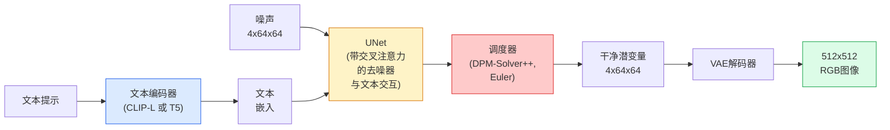

# Stable Diffusion — 架构与微调

> Stable Diffusion 是一种在预训练VAE的潜空间中运行的DDPM，通过交叉注意力机制以文本为条件，使用快速确定性ODE求解器采样，并由无分类器引导（Classifier-Free Guidance）控制。

**类型：** 学习 + 使用  
**语言：** Python  
**前置知识：** 第4阶段第10课（扩散模型），第7阶段第2课（自注意力机制）  
**时长：** 约75分钟

## 学习目标

- 梳理Stable Diffusion流程中的五个组件：VAE、文本编码器、U-Net、调度器（Scheduler）、安全检查器（Safety Checker）——以及它们各自的实际功能
- 解释潜扩散（Latent Diffusion）原理，以及为什么在4×64×64的潜空间（而非3×512×512的图像）中训练能让计算量降低48倍且不损失质量
- 使用`diffusers`进行图像生成、图生图（Image-to-Image）、修补（Inpainting）以及ControlNet引导生成
- 使用LoRA在小规模自定义数据集上微调Stable Diffusion，并在推理时加载LoRA适配器

## 问题背景

直接在512×512的RGB图像上训练DDPM代价高昂。每一步训练都要通过U-Net反向传播，该U-Net处理3×512×512=786,432个输入值，而采样则需要50次以上的前向传播。以Stable Diffusion 1.5（2022年发布）的质量水平为例，像素空间的扩散需要约256 GPU-月的训练时间，并且在消费级GPU上每张图像需要10-30秒。

使开源权重文本到图像模型变得实用的诀窍是**潜扩散**（Rombach等人，CVPR 2022）。训练一个VAE，将3×512×512的图像映射到4×64×64的潜张量再映射回来，然后在该潜空间中进行扩散。计算量下降为`(3*512*512)/(4*64*64) = 48倍`。同一GPU上采样时间从几十秒降至不到两秒。

几乎所有现代图像生成模型——SDXL、SD3、FLUX、HunyuanDiT、Wan-Video——都是潜扩散模型，仅在自编码器、去噪器（U-Net或DiT）以及文本条件处理上有所变化。学会Stable Diffusion，你就学会了该范式。

## 核心概念

### 流水线



- **VAE** – 冻结的自编码器。编码器将图像转换为潜变量（用于图生图和训练），解码器将潜变量转换回图像。
- **文本编码器** – CLIP文本编码器（SD 1.x/2.x）、CLIP-L + CLIP-G（SDXL）或T5-XXL（SD3/FLUX）。生成一系列词元嵌入（token embedding）。
- **U-Net** – 去噪器。包含交叉注意力层，在每个分辨率级别上，从潜变量对文本嵌入进行注意力计算。
- **调度器（Scheduler）** – 采样算法（DDIM、Euler、DPM-Solver++）。选取sigma值，将预测噪声混合回潜变量。
- **安全检查器（Safety Checker）** – 可选的输出图像NSFW/非法内容过滤器。

### 无分类器引导（CFG）

纯文本条件学习 `epsilon_theta(x_t, t, c)`（针对每个提示c）。CFG以10%的概率丢弃c（替换为空嵌入）来训练同一网络，从而得到一个既能预测条件噪声又能预测无条件噪声的单一模型。推理时：

```
eps = eps_uncond + w * (eps_cond - eps_uncond)
```

`w` 是引导尺度（Guidance Scale）。`w=0` 为无条件，`w=1` 为纯条件，`w>1`  将输出推向“更依赖提示”，但会降低多样性。SD的默认值为 `w=7.5`。

CFG是文本到图像能够达到生产质量的原因。没有它，提示对输出的影响较弱；有了它，提示起主导作用。

### 潜空间几何

VAE的4通道潜变量并不仅仅是压缩后的图像。它是一个流形，在这个流形上，算术运算大致对应语义编辑（提示工程和内插都在此进行），并且扩散U-Net已将其全部建模能力用于在此流形上训练。解码一个随机的4×64×64潜变量不会生成随机的图像——它会生成垃圾，因为只有特定的潜变量子流形才能解码出有效图像。

两个推论：

1. **图生图** = 将图像编码为潜变量，添加部分噪声，运行去噪器，解码。图像结构得以保留，因为编码近似可逆；内容根据提示变化。
2. **修补** = 与图生图类似，但去噪器仅更新掩码区域；未掩码区域保留编码后的潜变量。

### U-Net架构

SD U-Net是第10课中TinyUNet的大型版本，新增了三个部分：

- 每个空间分辨率上的**Transformer块**，包含自注意力 + 对文本嵌入的交叉注意力。
- 通过MLP对正弦编码进行**时间嵌入**。
- 编码器与解码器之间在匹配分辨率上的**跳跃连接**。

SD 1.5总参数量：约8.6亿。SDXL：约26亿。FLUX：约120亿。参数的跃升主要发生在注意力层。

### LoRA微调

对Stable Diffusion进行全量微调需要20+ GB显存，并更新8.6亿参数。LoRA（低秩适配）保持基础模型冻结，仅在注意力层中注入小型秩分解矩阵。SD的LoRA适配器通常为10-50 MB，在单个消费级GPU上训练10-60分钟，推理时可作为即插即用的修改载入。

```
原始： W_q : (d_in, d_out)   冻结
LoRA：  W_q + alpha * (A @ B)   其中 A : (d_in, r), B : (r, d_out)

r 通常为 4-32。
```

几乎所有社区微调模型都通过LoRA分发。CivitAI和Hugging Face托管了数百万个LoRA。

### 你会遇到的调度器

- **DDIM** – 确定性，约50步，简单。
- **Euler祖先采样（Euler ancestral）** – 随机，30-50步，样本稍具创造性。
- **DPM-Solver++ 2M Karras** – 确定性，20-30步，生产环境默认。
- **LCM / TCD / Turbo** – 一致性模型及蒸馏变体；1-4步，但以部分质量为代价。

在`diffusers`中切换调度器只需一行代码，有时无需重新训练即可修复采样问题。

## 动手实现

本节课全程使用`diffusers`，而非从头重建Stable Diffusion。你需要重建的组件（VAE、文本编码器、U-Net、调度器）将是后续独立课程的主题；这里的目标是熟悉生产API。

### 步骤1：文本到图像

```python
import torch
from diffusers import StableDiffusionPipeline

pipe = StableDiffusionPipeline.from_pretrained(
    "runwayml/stable-diffusion-v1-5",
    torch_dtype=torch.float16,
).to("cuda")

image = pipe(
    prompt="a dog riding a skateboard in tokyo, studio ghibli style",
    guidance_scale=7.5,
    num_inference_steps=25,
    generator=torch.Generator("cuda").manual_seed(42),
).images[0]
image.save("dog.png")
```

`float16` 可将显存减半，且无明显质量损失。`num_inference_steps=25` 配合默认的DPM-Solver++ 效果等同于 `num_inference_steps=50` 配合DDIM。

### 步骤2：切换调度器

```python
from diffusers import DPMSolverMultistepScheduler, EulerAncestralDiscreteScheduler

pipe.scheduler = DPMSolverMultistepScheduler.from_config(pipe.scheduler.config)
pipe.scheduler = EulerAncestralDiscreteScheduler.from_config(pipe.scheduler.config)
```

调度器状态与U-Net权重解耦。你可以使用DDPM训练，然后使用任意调度器采样。

### 步骤3：图生图

```python
from diffusers import StableDiffusionImg2ImgPipeline
from PIL import Image

img2img = StableDiffusionImg2ImgPipeline.from_pretrained(
    "runwayml/stable-diffusion-v1-5",
    torch_dtype=torch.float16,
).to("cuda")

init_image = Image.open("dog.png").convert("RGB").resize((512, 512))
out = img2img(
    prompt="a dog riding a skateboard, oil painting",
    image=init_image,
    strength=0.6,
    guidance_scale=7.5,
).images[0]
```

`strength` 控制去噪前添加多少噪声（0.0 = 不变，1.0 = 完全重建）。0.5-0.7 是风格迁移的标准范围。

### 步骤4：修补

```python
from diffusers import StableDiffusionInpaintPipeline

inpaint = StableDiffusionInpaintPipeline.from_pretrained(
    "runwayml/stable-diffusion-inpainting",
    torch_dtype=torch.float16,
).to("cuda")

image = Image.open("dog.png").convert("RGB").resize((512, 512))
mask = Image.open("dog_mask.png").convert("L").resize((512, 512))

out = inpaint(
    prompt="a cat",
    image=image,
    mask_image=mask,
    guidance_scale=7.5,
).images[0]
```

掩码中的白色像素是需要重建的区域，黑色像素保持不变。

### 步骤5：LoRA加载

```python
pipe.load_lora_weights("sayakpaul/sd-lora-ghibli")
pipe.fuse_lora(lora_scale=0.8)

image = pipe(prompt="a village square in ghibli style").images[0]
```

`lora_scale` 控制强度；0.0 = 无效果，1.0 = 完全效果。`fuse_lora` 将适配器融合进权重以提升速度，但会阻止切换。在加载不同适配器前调用 `pipe.unfuse_lora()`。

### 步骤6：LoRA训练（概览）

实际的LoRA训练在`peft`或`diffusers.training`中实现。概要如下：

```python
# 伪代码
for step, batch in enumerate(dataloader):
    images, prompts = batch
    latents = vae.encode(images).latent_dist.sample() * 0.18215

    t = torch.randint(0, num_train_timesteps, (batch_size,))
    noise = torch.randn_like(latents)
    noisy_latents = scheduler.add_noise(latents, noise, t)

    text_emb = text_encoder(tokenizer(prompts))

    pred_noise = unet(noisy_latents, t, text_emb)  # 此处注入LoRA权重

    loss = F.mse_loss(pred_noise, noise)
    loss.backward()
    optimizer.step()
```

只有LoRA矩阵接收梯度；基础U-Net、VAE和文本编码器冻结。使用批大小1和梯度检查点，这可以在8 GB显存下运行。

## 实际应用

在生产中，你实际需要做的决策包括：

- **模型家族**：开源社区微调用SD 1.5，更高保真度用SDXL，最先进且满足严格许可要求用SD3/FLUX。
- **调度器**：20-30步用DPM-Solver++ 2M Karras，延迟低于1秒用LCM-LoRA。
- **精度**：4080/4090使用`float16`，A100及更新型号使用`bfloat16`，显存紧张时使用`int8`（通过`bitsandbytes`或`compel`）。
- **条件控制**：纯文本已足够；若需更强控制，可在基础流水线上添加ControlNet（canny、深度、姿态）。

批量生成使用 `AUTO1111` / `ComfyUI` 等社区工具；生产API使用 `diffusers` + `accelerate` 或 `optimum-nvidia`（配合TensorRT编译）。

## 交付成果

本节课产出：

- `outputs/prompt-sd-pipeline-planner.md` — 一个提示模板，根据延迟预算、保真度目标和许可限制，选择SD 1.5 / SDXL / SD3 / FLUX以及调度器和精度。
- `outputs/skill-lora-training-setup.md` — 一个技能文档，为自定义数据集（包括描述文本、秩、批大小和学习率）编写完整的LoRA训练配置。

## 练习

1. **(简单)** 使用 `guidance_scale` 在 `[1, 3, 5, 7.5, 10, 15]` 范围内生成同一提示的图像。描述图像如何变化。在什么引导值下开始出现伪影？
2. **(中等)** 取任意真实照片，通过 `StableDiffusionImg2ImgPipeline` 以 `strength` 在 `[0.2, 0.4, 0.6, 0.8, 1.0]` 范围内处理。哪个强度值能在改变风格的同时保留构图？为什么1.0会完全忽略输入？
3. **(困难)** 对一个单一主题（宠物、标志、角色）的10-20张图像训练一个LoRA，并用该主题生成新场景。报告在最佳身份保留（不过拟合输入图像）的情况下使用的LoRA秩和训练步数。

## 关键术语

| 术语 | 常说的意思 | 实际含义 |
|------|----------------|----------------------|
| 潜扩散（Latent diffusion） | “在潜变量中扩散” | 将整个DDPM运行在VAE潜空间（4×64×64）而非像素空间（3×512×512）；节省48倍计算量 |
| VAE缩放因子（VAE scale factor） | “0.18215” | 用于将VAE的原始潜变量重新缩放至近似单位方差的常数；在所有SD流水线中硬编码 |
| 无分类器引导（Classifier-free guidance） | “CFG” | 混合条件噪声预测和无条件噪声预测；最重要的推理控制参数 |
| 调度器（Scheduler） | “采样器” | 将噪声和模型预测转化为去噪潜变量轨迹的算法 |
| LoRA | “低秩适配器” | 小型秩分解矩阵，用于微调注意力层，不改变基础权重 |
| 交叉注意力（Cross-attention） | “文本-图像注意力” | 从潜变量词元到文本词元的注意力；在每个U-Net层级注入提示信息 |
| ControlNet | “结构条件控制” | 一个单独训练的适配器，通过额外输入（canny、深度、姿态、分割）引导SD |
| DPM-Solver++ | “默认调度器” | 二阶确定性ODE求解器；在低步数（20-30）下达到2026年最佳质量 |

## 进一步阅读

- [High-Resolution Image Synthesis with Latent Diffusion (Rombach et al., 2022)](https://arxiv.org/abs/2112.10752) — Stable Diffusion论文；包含支持该设计的全部消融实验
- [Classifier-Free Diffusion Guidance (Ho & Salimans, 2022)](https://arxiv.org/abs/2207.12598) — CFG论文
- [LoRA: Low-Rank Adaptation of Large Language Models (Hu et al., 2021)](https://arxiv.org/abs/2106.09685) — LoRA最初用于NLP；几乎未经改动便迁移至SD
- [diffusers文档](https://huggingface.co/docs/diffusers) — 所有SD / SDXL / SD3 / FLUX流水线的参考文档