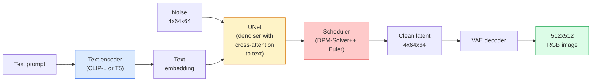

# 11 · Stable Diffusion——架构与微调

> Stable Diffusion 是一个运行在预训练 VAE 潜空间中的 DDPM，通过交叉注意力以文本为条件，使用快速的确定性 ODE 求解器采样，并由无分类器引导（classifier-free guidance）来掌舵。

**类型：** 学习 + 实践
**语言：** Python
**前置：** 第 4 阶段第 10 课（扩散模型），第 7 阶段第 02 课（自注意力）
**时长：** 约 75 分钟

## 学习目标

- 梳理 Stable Diffusion 流水线的五个组成部分：VAE、文本编码器、U-Net、调度器、安全检查器——以及它们各自的实际作用
- 解释「潜扩散（latent diffusion）」，以及为什么在 4x64x64 的潜空间（而非 3x512x512 的图像）中训练能将计算量降低 48 倍而不损失质量
- 使用 `diffusers` 生成图像，运行图生图（image-to-image）、图像修复（inpainting）以及 ControlNet 引导的生成
- 在一个小型自定义数据集上用 LoRA 微调 Stable Diffusion，并在推理时加载该 LoRA 适配器

## 问题所在

直接在 512x512 的 RGB 图像上训练 DDPM 代价高昂。每个训练步都要在一个看到 3x512x512 = 786,432 个输入值的 U-Net 中反向传播，而采样需要通过同一个 U-Net 进行 50 次以上的前向传播。在 Stable Diffusion 1.5（2022 年发布）的质量水平下，像素空间扩散大约需要 256 个 GPU-月的训练，并且在消费级 GPU 上每张图像要花 10-30 秒。

让开放权重的文生图变得可行的关键技巧，是「潜扩散（latent diffusion）」（Rombach 等人，CVPR 2022）。训练一个 VAE，把 3x512x512 的图像映射为 4x64x64 的潜张量并能还原回去，然后在那个潜空间中做扩散。计算量降为 `(3*512*512)/(4*64*64) = 48 倍`。在同一块 GPU 上，采样从几十秒降到两秒以内。

几乎所有现代图像生成模型——SDXL、SD3、FLUX、HunyuanDiT、Wan-Video——都是潜扩散模型，只是在自编码器、去噪器（U-Net 或 DiT）和文本条件化上各有变化。学会了 Stable Diffusion，你就掌握了这个模板。

## 核心概念

### 流水线



- **VAE** —— 冻结的自编码器。编码器把图像转成潜表示（用于图生图与训练），解码器把潜表示还原成图像。
- **文本编码器** —— CLIP 文本编码器（SD 1.x/2.x）、CLIP-L + CLIP-G（SDXL），或 T5-XXL（SD3/FLUX）。产出一段词元嵌入序列。
- **U-Net** —— 去噪器。它在每一个分辨率层级都有交叉注意力层，从潜表示出发关注文本嵌入。
- **调度器** —— 采样算法（DDIM、Euler、DPM-Solver++）。它选取 sigma 值，并把预测出的噪声混合回潜表示。
- **安全检查器** —— 对输出图像的可选 NSFW / 违规内容过滤器。

### 无分类器引导（Classifier-free guidance, CFG）

普通的文本条件化为每个提示词 `c` 学习一个 `epsilon_theta(x_t, t, c)`。CFG 用同一个网络训练，但有 10% 的时间会丢弃 `c`（用一个空嵌入替换），从而得到一个同时能预测条件噪声与无条件噪声的单一模型。推理时：

```
eps = eps_uncond + w * (eps_cond - eps_uncond)
```

`w` 是引导强度。`w=0` 是无条件，`w=1` 是普通条件，`w>1` 会把输出推向「更受提示词约束」，代价是多样性下降。SD 默认 `w=7.5`。

CFG 是文生图能达到生产级质量的原因。没有它，提示词对输出只有微弱的偏置；有了它，提示词占据主导。

### 潜空间几何

VAE 的 4 通道潜表示不只是一张压缩图像。它是一个流形，在其上做算术大致对应于语义编辑（提示词工程与插值都活在这里），并且扩散 U-Net 已被训练得把全部建模预算都花在这里。对一个随机的 4x64x64 潜表示进行解码并不会产出一张看起来随机的图像——而是产出垃圾，因为只有潜表示中某个特定的子流形才会解码为有效图像。

由此带来两个推论：

1. **图生图（Img2img）** = 把图像编码成潜表示，加入部分噪声，运行去噪器，再解码。图像结构得以保留，因为编码近乎可逆；内容则根据提示词发生变化。
2. **图像修复（Inpainting）** = 与图生图相同，但去噪器只更新被掩码的区域；未掩码的区域保持在编码后的潜表示上。

### U-Net 架构

SD 的 U-Net 是第 10 课那个 TinyUNet 的大型版本，外加三项扩充：

- 在每个空间分辨率上都有 **Transformer 块**，其中包含自注意力 + 对文本嵌入的交叉注意力。
- 通过对正弦编码做 MLP 得到的 **时间嵌入（time embedding）**。
- 编码器与解码器在匹配分辨率之间的 **跳跃连接（skip connections）**。

SD 1.5 的总参数量约 8.6 亿；SDXL 约 26 亿；FLUX 约 120 亿。参数量的跃升主要来自注意力层。

### LoRA 微调

对 Stable Diffusion 做全量微调需要 20+ GB 显存，并更新 8.6 亿个参数。LoRA（Low-Rank Adaptation，低秩适配）保持基础模型冻结，并向注意力层注入小的秩分解矩阵。一个 SD 的 LoRA 适配器通常只有 10-50 MB，在单块消费级 GPU 上训练 10-60 分钟即可完成，并且在推理时作为一种即插即用的修改加载进来。

```
Original: W_q : (d_in, d_out)   frozen
LoRA:     W_q + alpha * (A @ B)   where A : (d_in, r), B : (r, d_out)

r is typically 4-32.
```

LoRA 是几乎所有社区微调成果的分发方式。CivitAI 和 Hugging Face 上托管着数以百万计的 LoRA。

### 你将遇到的调度器

- **DDIM** —— 确定性，约 50 步，简单。
- **Euler ancestral** —— 随机性，30-50 步，采样稍微更有创意。
- **DPM-Solver++ 2M Karras** —— 确定性，20-30 步，生产默认。
- **LCM / TCD / Turbo** —— 一致性模型与蒸馏变体；1-4 步，代价是一定的质量损失。

在 `diffusers` 中切换调度器只需改一行代码，有时无需任何重训练就能修复采样问题。

## 动手构建

本课从头到尾使用 `diffusers`，而不是从零重建 Stable Diffusion。需要重建的那些部件（VAE、文本编码器、U-Net、调度器）各自都是独立课程的主题；这里的目标是熟练掌握生产级 API。

### 第 1 步：文生图

```python
import torch
from diffusers import StableDiffusionPipeline

pipe = StableDiffusionPipeline.from_pretrained(
    "runwayml/stable-diffusion-v1-5",
    torch_dtype=torch.float16,
).to("cuda")

image = pipe(
    prompt="a dog riding a skateboard in tokyo, studio ghibli style",
    guidance_scale=7.5,
    num_inference_steps=25,
    generator=torch.Generator("cuda").manual_seed(42),
).images[0]
image.save("dog.png")
```

`float16` 将显存减半，且没有可见的质量损失。在默认的 DPM-Solver++ 下，`num_inference_steps=25` 与 DDIM 的 `num_inference_steps=50` 效果相当。

### 第 2 步：切换调度器

```python
from diffusers import DPMSolverMultistepScheduler, EulerAncestralDiscreteScheduler

pipe.scheduler = DPMSolverMultistepScheduler.from_config(pipe.scheduler.config)
pipe.scheduler = EulerAncestralDiscreteScheduler.from_config(pipe.scheduler.config)
```

调度器的状态与 U-Net 权重是解耦的。你可以用 DDPM 训练，再用任何调度器采样。

### 第 3 步：图生图

```python
from diffusers import StableDiffusionImg2ImgPipeline
from PIL import Image

img2img = StableDiffusionImg2ImgPipeline.from_pretrained(
    "runwayml/stable-diffusion-v1-5",
    torch_dtype=torch.float16,
).to("cuda")

init_image = Image.open("dog.png").convert("RGB").resize((512, 512))
out = img2img(
    prompt="a dog riding a skateboard, oil painting",
    image=init_image,
    strength=0.6,
    guidance_scale=7.5,
).images[0]
```

`strength` 是去噪前要加入多少噪声（0.0 = 不变，1.0 = 完全重新生成）。0.5-0.7 是风格迁移的标准区间。

### 第 4 步：图像修复

```python
from diffusers import StableDiffusionInpaintPipeline

inpaint = StableDiffusionInpaintPipeline.from_pretrained(
    "runwayml/stable-diffusion-inpainting",
    torch_dtype=torch.float16,
).to("cuda")

image = Image.open("dog.png").convert("RGB").resize((512, 512))
mask = Image.open("dog_mask.png").convert("L").resize((512, 512))

out = inpaint(
    prompt="a cat",
    image=image,
    mask_image=mask,
    guidance_scale=7.5,
).images[0]
```

掩码中的白色像素是要重新生成的区域，黑色像素则被保留。

### 第 5 步：加载 LoRA

```python
pipe.load_lora_weights("sayakpaul/sd-lora-ghibli")
pipe.fuse_lora(lora_scale=0.8)

image = pipe(prompt="a village square in ghibli style").images[0]
```

`lora_scale` 控制强度；0.0 = 无效果，1.0 = 完全生效。`fuse_lora` 会就地把适配器烘焙进权重以提升速度，但这样就无法再切换。在加载另一个适配器之前要调用 `pipe.unfuse_lora()`。

### 第 6 步：LoRA 训练（概要）

真正的 LoRA 训练位于 `peft` 或 `diffusers.training` 中。其大致流程如下：

```python
# 伪代码
for step, batch in enumerate(dataloader):
    images, prompts = batch
    latents = vae.encode(images).latent_dist.sample() * 0.18215

    t = torch.randint(0, num_train_timesteps, (batch_size,))
    noise = torch.randn_like(latents)
    noisy_latents = scheduler.add_noise(latents, noise, t)

    text_emb = text_encoder(tokenizer(prompts))

    pred_noise = unet(noisy_latents, t, text_emb)  # 此处注入 LoRA 权重

    loss = F.mse_loss(pred_noise, noise)
    loss.backward()
    optimizer.step()
```

只有 LoRA 矩阵接收梯度；基础 U-Net、VAE 和文本编码器都被冻结。在 batch size 为 1 并启用梯度检查点（gradient checkpointing）的情况下，这能塞进 8 GB 显存。

## 实际运用

在生产中，你真正要做的决策有：

- **模型家族**：SD 1.5 用于开源社区微调，SDXL 用于更高保真度，SD3 / FLUX 用于最前沿水平及严格的许可要求。
- **调度器**：20-30 步用 DPM-Solver++ 2M Karras，延迟需控制在 1 秒以内时用 LCM-LoRA。
- **精度**：在 4080/4090 上用 `float16`，在 A100 及更新硬件上用 `bfloat16`，显存吃紧时用 `int8`（通过 `bitsandbytes` 或 `compel`）。
- **条件化**：纯文本即可工作；若需更强的控制，可在基础流水线之上叠加 ControlNet（canny、depth、pose）。

对于批量生成，社区工具是 `AUTO1111` / `ComfyUI`；对于生产 API，则用 `diffusers` + `accelerate`，或配合 TensorRT 编译的 `optimum-nvidia`。

## 交付成果

本课产出：

- `outputs/prompt-sd-pipeline-planner.md` —— 一个提示词，在给定延迟预算、保真度目标和许可约束的情况下，挑选 SD 1.5 / SDXL / SD3 / FLUX 以及调度器和精度。
- `outputs/skill-lora-training-setup.md` —— 一个技能，为自定义数据集编写完整的 LoRA 训练配置，包括标注（captions）、秩（rank）、batch size 和学习率。

## 练习

1. **（简单）** 用同一个提示词，分别以 `guidance_scale` 取 `[1, 3, 5, 7.5, 10, 15]` 进行生成。描述图像如何变化。在哪个引导值下开始出现伪影（artefacts）？
2. **（中等）** 取任意一张真实照片，用 `StableDiffusionImg2ImgPipeline` 以 `strength` 取 `[0.2, 0.4, 0.6, 0.8, 1.0]` 跑一遍。哪个 strength 既能在改变风格的同时保留构图？为什么 1.0 会完全忽略输入？
3. **（困难）** 在单一主体（一只宠物、一个 logo、一个角色）的 10-20 张图像上训练一个 LoRA，并生成包含该主体的全新场景。报告出在不过拟合于输入图像的前提下、能产生最佳身份保持效果的 LoRA 秩和训练步数。

## 关键术语

| 术语 | 人们怎么说 | 实际含义 |
|------|----------------|----------------------|
| 潜扩散（Latent diffusion） | 「在潜空间里扩散」 | 在 VAE 潜空间（4x64x64）而非像素空间（3x512x512）中运行整个 DDPM；节省 48 倍计算 |
| VAE 缩放因子 | 「0.18215」 | 把 VAE 的原始潜表示重新缩放到大致单位方差的常数；在每个 SD 流水线中都硬编码写死 |
| 无分类器引导 | 「CFG」 | 混合条件与无条件的噪声预测；影响最大的单个推理旋钮 |
| 调度器（Scheduler） | 「采样器（Sampler）」 | 把噪声 + 模型预测转化为去噪后潜表示轨迹的算法 |
| LoRA | 「低秩适配器」 | 在不触碰基础权重的情况下微调注意力层的小型秩分解矩阵 |
| 交叉注意力（Cross-attention） | 「文本-图像注意力」 | 从潜词元到文本词元的注意力；在每个 U-Net 层级注入提示词信息 |
| ControlNet | 「结构条件化」 | 一个单独训练的适配器，用额外输入（canny、depth、pose、segmentation）来引导 SD |
| DPM-Solver++ | 「默认调度器」 | 二阶确定性 ODE 求解器；在 2026 年，在低步数（20-30）下质量最佳 |

## 延伸阅读

- [High-Resolution Image Synthesis with Latent Diffusion (Rombach et al., 2022)](https://arxiv.org/abs/2112.10752) —— Stable Diffusion 论文；包含了为设计提供依据的每一项消融实验
- [Classifier-Free Diffusion Guidance (Ho & Salimans, 2022)](https://arxiv.org/abs/2207.12598) —— CFG 论文
- [LoRA: Low-Rank Adaptation of Large Language Models (Hu et al., 2021)](https://arxiv.org/abs/2106.09685) —— LoRA 最早面向 NLP；几乎不加改动就迁移到了 SD 上
- [diffusers documentation](https://huggingface.co/docs/diffusers) —— 每个 SD / SDXL / SD3 / FLUX 流水线的参考文档
