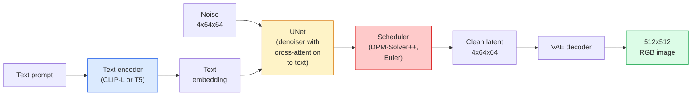

# Stable Diffusion — Architecture & Fine-Tuning

> Stable Dispatch是一个DDPM，它在预训练的VAE的潜在空间中运行，通过交叉注意以文本为条件，使用快速确定性ODE求解器进行采样，并通过无分类器引导。

** 类型：** 学习+使用
** 语言：** Python
** 先决条件：** 阶段4第10课（扩散），阶段7第02课（自我注意）
** 时间：** ~75分钟

## Learning Objectives

- 跟踪Stable Distance管道的五个部分：VAE、文本编码器、U-Net、调度器、安全检查器-以及它们每个部分的实际作用
- 解释潜在扩散以及为什么在4x 64 x64潜在空间（而不是3x 512 x512图像）中训练将计算减少48倍而不会损失质量
- 使用“扩散器”生成图像、运行图像到图像、修补和Control Net引导生成
- 在小型自定义数据集上使用LoRA微调Stable Distance，并在推理时加载LoRA适配器

## The Problem

直接在512 x512 RB图像上训练DDPM的成本很高。每个训练步骤都会通过U-Net反向推进，该U-Net会看到3x 512 x512 = 786，432个输入值，并且采样需要50+次向前通过同一U-Net。在Stable Distribution1.5（2022年发布）的质量水平下，像素空间扩散大约需要256个GPU月的训练，消费级图形处理器上的每张图像需要10-30秒。

使开重文本到图像实用的技巧是 ** 潜在扩散 **（Rombach等人，CVPR 2022）。训练VAE，将3x 512 x512图像映射到4x 64 x64潜在张量并返回，然后在该潜在空间中进行扩散。通过“（3*512*512）/（4*64*64）= 48 x”计算下降。在同一个图形处理器上，采样时间从数十秒下降到不到两秒。

几乎每个现代图像生成模型-- SDXL、SD 3、FLOX、HunyuanDiT、Wan-Video --都是一个潜在扩散模型，自动编码器、降噪器（U-Net或DiT）和文本条件处理有变化。学习稳定扩散，您已经学习了模板。

## The Concept

### The pipeline



- **VAE** -冻结的自动编码器。编码器将图像转换为潜在（用于IMG 2 IMG和训练）。解码器将潜伏变回图像。
- ** 文本编码器 ** - CLIP文本编码器（SD 1.x/2.x）、CLIP-L + CLIP-G（SDXL）或T5-XXL（SD 3/FLOX）。生成令牌嵌入序列。
- **U-Net** -降噪器。具有交叉注意力层，从潜在到每个分辨率级别的文本嵌入。
- * -采样算法（DDIM、欧拉、DPM-Solver++）。选择西格玛，将预测的噪音混合回潜在噪音中。
- ** 安全检查器 ** -输出图像上可选的NSFW /非法内容过滤器。

### Classifier-free guidance (CFG)

纯文本条件反射为每个提示“c”学习“_theta（x_t，t，c）”。CGM训练相同的网络，“c”有10%的时间下降（被空嵌入取代），从而给出一个预测条件和无条件噪音的模型。推断：

```
eps = eps_uncond + w * (eps_cond - eps_uncond)
```

' w '是指导范围。' w=0 '是无条件的，' w=1 '是简单的条件，' w>1 '会以多样性为代价推动输出“更多地取决于提示”。SD默认为“w=7.5”。

CFG是文本到图像工作在生产质量的原因。没有它，提示对输出的影响很小;有了它，提示占主导地位。

### Latent space geometry

VAE的4通道潜像不仅仅是压缩图像。这是一个多边形，其中算术大致对应于语义编辑（即时工程+插值都存在于此），并且扩散U-Net已被训练为花费其全部建模预算。解码随机的4x 64 x64潜伏不会产生看起来随机的图像-它会产生垃圾，因为只有特定的潜伏子模才会解码到有效图像。

两个后果：

1. ** Img 2 img ** =将图像编码为潜像，添加部分噪声，运行去噪器，解码。图像结构保留下来，因为编码几乎是可逆的;内容根据提示而变化。
2. ** 修补 ** =与IMG 2 IMG相同，但去噪器仅更新掩蔽区域;未掩蔽区域保留在编码的潜在区域。

### The U-Net architecture

SD U-Net是第10课TinyUNet的大版本，添加了三个内容：

- 每个空间分辨率下的 **Transformer块 **，包含对文本嵌入的自注意力+交叉注意力。
- ** 时间嵌入 ** 通过MLP进行Sino编码。
- ** 以匹配的分辨率跳过编码器和解码器之间的连接 **。

SD 1.5中的总参数：~ 860 M。SDXL：~2.6B。通量：~ 12 B。参数的跳跃主要发生在注意力层中。

### LoRA fine-tuning

Stable Distance的全面微调需要20+ GB的VRAM并更新860 M参数。LoRA（低等级适应）保持基本模型冻结，并将小型等级分解矩阵注入注意力层。用于SD的LoRA适配器通常为10-50 MB，在单个消费者图形处理器上训练时间为10-60分钟，并作为插入式修改在推理时加载。

```
Original: W_q : (d_in, d_out)   frozen
LoRA:     W_q + alpha * (A @ B)   where A : (d_in, r), B : (r, d_out)

r is typically 4-32.
```

LoRA几乎是每个社区微调的分发方式。CivitAI和Hugging Face托管了数百万个此类服务。

### Schedulers you will see

- **DDIM** -确定性，约50个步骤，简单。
- ** 欧拉祖先 ** -随机，30-50步，稍微更具创意的样本。
- **DPM-Solver++2 M Karras** -确定性，20-30个步骤，默认生产。
- ** RCM/TDS/ Turbo** -一致性模型和提炼变体; 1-4个步骤，以牺牲部分质量为代价。

交换分配器是“扩散器”的一行更改，有时无需任何重新培训即可修复示例问题。

## Build It

本课使用端到端的“扩散器”，而不是从头开始重建稳定扩散。您需要重建的部分（VAE、文本编码器、U-Net、调度器）是它们自己课程的主题;这里的目标是流利地使用生产API。

### Step 1: Text-to-image

```python
import torch
from diffusers import StableDiffusionPipeline

pipe = StableDiffusionPipeline.from_pretrained(
    "runwayml/stable-diffusion-v1-5",
    torch_dtype=torch.float16,
).to("cuda")

image = pipe(
    prompt="a dog riding a skateboard in tokyo, studio ghibli style",
    guidance_scale=7.5,
    num_inference_steps=25,
    generator=torch.Generator("cuda").manual_seed(42),
).images[0]
image.save("dog.png")
```

“float 16”将VRAM减半，没有明显的质量损失。默认DPM-Solver++匹配“num_instruction_steps=25”与DDIM匹配“num_instruction_steps=50”。

### Step 2: Swap the scheduler

```python
from diffusers import DPMSolverMultistepScheduler, EulerAncestralDiscreteScheduler

pipe.scheduler = DPMSolverMultistepScheduler.from_config(pipe.scheduler.config)
pipe.scheduler = EulerAncestralDiscreteScheduler.from_config(pipe.scheduler.config)
```

收件箱状态与U-Net权重脱钩。您可以使用DDPM进行训练并使用任何调度器进行示例。

### Step 3: Image-to-image

```python
from diffusers import StableDiffusionImg2ImgPipeline
from PIL import Image

img2img = StableDiffusionImg2ImgPipeline.from_pretrained(
    "runwayml/stable-diffusion-v1-5",
    torch_dtype=torch.float16,
).to("cuda")

init_image = Image.open("dog.png").convert("RGB").resize((512, 512))
out = img2img(
    prompt="a dog riding a skateboard, oil painting",
    image=init_image,
    strength=0.6,
    guidance_scale=7.5,
).images[0]
```

“强度”是在去噪之前添加多少噪声（0.0 =不变，1.0 =完全再生）。0.5-0.7是风格转换的标准范围。

### Step 4: Inpainting

```python
from diffusers import StableDiffusionInpaintPipeline

inpaint = StableDiffusionInpaintPipeline.from_pretrained(
    "runwayml/stable-diffusion-inpainting",
    torch_dtype=torch.float16,
).to("cuda")

image = Image.open("dog.png").convert("RGB").resize((512, 512))
mask = Image.open("dog_mask.png").convert("L").resize((512, 512))

out = inpaint(
    prompt="a cat",
    image=image,
    mask_image=mask,
    guidance_scale=7.5,
).images[0]
```

面罩中的白色像素是要重新生成的区域。黑色像素被保留。

### Step 5: LoRA loading

```python
pipe.load_lora_weights("sayakpaul/sd-lora-ghibli")
pipe.fuse_lora(lora_scale=0.8)

image = pipe(prompt="a village square in ghibli style").images[0]
```

“lora_scale”控制强度; 0.0 =无影响，1.0 =完全影响。' fuse_lora '将适配器烘烤到适当的重物中以提高速度，但阻止交换。在加载不同的适配器之前，调用“pipe.unfuse_lora（）”。

### Step 6: LoRA training (sketch)

真正的LoRA培训存在于“peft”或“diffusers.training”中。大纲：

```python
# Pseudocode
for step, batch in enumerate(dataloader):
    images, prompts = batch
    latents = vae.encode(images).latent_dist.sample() * 0.18215

    t = torch.randint(0, num_train_timesteps, (batch_size,))
    noise = torch.randn_like(latents)
    noisy_latents = scheduler.add_noise(latents, noise, t)

    text_emb = text_encoder(tokenizer(prompts))

    pred_noise = unet(noisy_latents, t, text_emb)  # LoRA weights injected here

    loss = F.mse_loss(pred_noise, noise)
    loss.backward()
    optimizer.step()
```

只有LoRA矩阵接收梯度;基本U-Net、VAE和文本编码器被冻结。批量大小为1，梯度检查点适合8 GB VRAM。

## Use It

在生产中，您实际做出的决策：

- ** 模特家族 **：SD 1.5用于开源社区微调，SDXL用于更高的保真度，SD 3/FLOX用于最先进的技术水平和严格的许可要求。
- ** 延迟 **：DPM-Solver ++2 M Karras，20-30步，LCM-LoRA，延迟小于1秒。
- ** 精度 **：在4080/4090上为`float 16`，在A100及更新版本上为`bfloat 16`，在VRAM较紧时为`int 8`（通过`bitsandbytes`或`compress`）。
- ** 调节 **：纯文本有效;为了更强的控制，请在基本管道顶部添加Control Net（精明、深度、姿势）。

对于批量生成，社区工具为“Auto 1111”/“ComfyUI”;对于生产API，使用“diffusers”+“加速”或“optimum-nvidia”进行TensorRT编译。

## Ship It

本课产生：

- ' outputes/prompt-sd-pipeline-planner.md '-一个提示，选择SD 1.5 / SDXL /SD 3/FLOX以及给定延迟预算、保真度目标和许可限制的调度器和精确度。
- ' outputes/skill-lora-training-setup.md '-一种为自定义数据集编写完整LoRA训练配置的技能，包括标题、排名、批量大小和学习率。

## Exercises

1. **（简单）** 在`[1，3，5，7.5，10，15]`中生成与`guidance_scale`相同的提示。描述图像如何变化。伪影出现在什么指导值？
2. * *（中等）** 拍摄任何真实照片，以“强度”在“[0.2，0.4，0.6，0.8，1.0]'中运行“StableDiffusion Img 2ImgPipeline”。在改变风格的同时，哪种强度可以保留构图？为什么1.0完全忽略输入？
3. **（困难）** 训练LoRA使用单个主题（宠物、徽标、角色）的10-20张图像，并生成包含该主题的新颖场景。报告LoRA排名和训练步骤，这些步骤可以产生最佳身份保存，而不会过度适应输入图像。

## Key Terms

| Term | 别人怎么说 | 它实际上意味着什么 |
|------|----------------|----------------------|
| 潜扩散 | “潜在的扩散” | 在VAE潜在空间（4x 64 x 64）而不是像素空间（3x 512 x 512）中运行整个DDPM; 48倍计算节省 |
| VAE比例因子 | “0.18215” | 将VAE的原始潜伏值重新缩放为大致单位方差的常数;在每个SD管道中硬编码 |
| 无分类指南 | “CGM” | 混合有条件和无条件噪音预测;单一最有影响力的推理旋钮 |
| 调度器 | “采样器” | 将噪音+模型预测转化为降噪潜在轨迹的算法 |
| Lora | “低级适配器” | 小型等级分解矩阵，可微调注意力层，而不涉及基本权重 |
| 交叉注意力 | “文本图像关注” | 注意力从潜在令牌转向文本令牌;在每个U-Net级别注入提示信息 |
| ControlNet | “结构条件反射” | 一个单独训练的适配器，通过额外的输入（精明、深度、姿势、分段）来引导SD |
| DPM-Solver++ | “默认调度程序” | 二阶确定性ODE解算器; 2026年在低步数（20-30）下获得最佳质量 |

## Further Reading

- [具有潜在扩散的高分辨率图像合成（Rombach等人，2022）]（https：//arxiv.org/ab/2112.10752）-稳定扩散论文;包括证明设计合理的每项消融
- [无分类扩散指南（Ho & Salimans，2022）]（https：//arxiv.org/ab/2207.12598）-CGM论文
- [LoRA：大型语言模型的低等级适应（Hu等人，2021）]（https：//arxiv.org/ab/2106.09685）- LoRA是NLP优先的;它转移到SD，几乎没有任何变化
- [diffusers文档]（https：//huggingface.co/docs/diffusers）-每个SD / SDXL /SD 3/FLOX管道的参考
