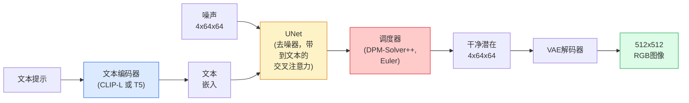

# Stable Diffusion — 架构与微调

> Stable Diffusion是一个在预训练VAE的潜在空间中运行的DDPM，通过交叉注意力以文本为条件，使用快速的确定性ODE解码器采样，并由无分类器引导驱动。

**类型：** 学习+使用
**语言：** Python
**前置条件：** 阶段4 第10课（扩散），阶段7 第02课（自注意力）
**时间：** ~75分钟

## 学习目标

- 追溯Stable Diffusion管道的五个部分：VAE、文本编码器、U-Net、调度器、安全检查器——以及每个部分实际做什么
- 解释潜在扩散，以及为什么在4x64x64潜在空间（而不是3x512x512图像）中训练将计算量减少了48倍而质量无损
- 使用`diffusers`生成图像、运行图到图、图像修补和ControlNet引导生成
- 使用LoRA在小型自定义数据集上微调Stable Diffusion，并在推理时加载LoRA适配器

## 问题

直接在512x512 RGB图像上训练DDPM很昂贵。每个训练步骤通过一个看到3x512x512 = 786,432个输入值的U-Net进行反向传播，而采样需要50多次通过同一个U-Net的前向传播。在Stable Diffusion 1.5（2022年发布）的质量水平上，像素空间扩散大约需要256 GPU-月的训练，并且在消费级GPU上每张图像需要10-30秒。

使开放权重文到图实用的技巧是**潜在扩散**（Rombach等人，CVPR 2022）。训练一个VAE，将3x512x512图像映射到4x64x64潜在张量再映射回去，然后在那个潜在空间中进行扩散。计算量下降了`(3*512*512)/(4*64*64) = 48倍`。采样从数十秒下降到同一GPU上不到两秒。

几乎每个现代图像生成模型——SDXL、SD3、FLUX、HunyuanDiT、Wan-Video——都是具有不同自编码器、去噪器（U-Net或DiT）和文本条件控制的潜在扩散模型。学会Stable Diffusion，你就学会了模板。

## 概念

### 管道


```mermaid
flowchart LR
    TXT["文本提示"] --> TE["文本编码器<br/>(CLIP-L 或 T5)"]
    TE --> CT["文本<br/>嵌入"]

    NOISE["噪声<br/>4x64x64"] --> UNET["UNet<br/>(去噪器，带<br/>到文本的<br/>交叉注意力)"]
    CT --> UNET

    UNET --> SCHED["调度器<br/>(DPM-Solver++,<br/>Euler)"]
    SCHED --> LATENT["干净潜在<br/>4x64x64"]
    LATENT --> VAE["VAE解码器"]
    VAE --> IMG["512x512<br/>RGB图像"]

    style TE fill:#dbeafe,stroke:#2563eb
    style UNET fill:#fef3c7,stroke:#d97706
    style SCHED fill:#fecaca,stroke:#dc2626
    style IMG fill:#dcfce7,stroke:#16a34a
```

- **VAE** — 冻结的自编码器。编码器将图像转换为潜在（用于img2img和训练）。解码器将潜在转换回图像。
- **文本编码器** — CLIP文本编码器（SD 1.x/2.x）、CLIP-L + CLIP-G（SDXL）或T5-XXL（SD3/FLUX）。生成一组token嵌入序列。
- **U-Net** — 去噪器。具有交叉注意力层，在每个分辨率级别从潜在关注到文本嵌入。
- **调度器** — 采样算法（DDIM、Euler、DPM-Solver++）。选择sigmas，将预测的噪声混合回潜在。
- **安全检查器** — 输出图像上的可选的NSFW/非法内容过滤器。

### 无分类器引导（CFG）

纯文本条件学习对每个提示`c`的`epsilon_theta(x_t, t, c)`。CFG训练相同的网络，10%的时间丢弃`c`（替换为空嵌入），得到一个同时预测条件和无条件噪声的单一模型。在推理时：

```
eps = eps_uncond + w * (eps_cond - eps_uncond)
```

`w`是引导比例。`w=0`是无条件，`w=1`是纯条件，`w>1`将输出推向"更加以提示为条件"，以多样性为代价。SD默认是`w=7.5`。

CFG是文到图能实现生产质量的原因。没有它，提示对输出的影响很弱；有了它，提示占主导地位。

### 潜在空间几何

VAE的4通道潜在不仅仅是一个压缩图像。它是一个流形，其中的算术大致对应于语义编辑（提示工程和插值都在这里），并且扩散U-Net已被训练将其整个建模预算花在这里。解码一个随机4x64x64潜在不会产生随机外观的图像——它会产生垃圾，因为只有特定子流形的潜在才能解码为有效图像。

两个后果：

1. **Img2img** = 将图像编码为潜在，添加部分噪声，运行去噪器，解码。图像结构得以保留，因为编码几乎是可逆的；内容根据提示改变。
2. **Inpainting** = 与img2img相同，但去噪器只更新被掩码区域；未掩码区域保持在编码后的潜在状态。

### U-Net架构

SD U-Net是第10课中TinyUNet的大版本，有三个新增部分：

- **Transformer块** 在每个空间分辨率，包含自注意力 + 到文本嵌入的交叉注意力。
- **时间嵌入** 通过正弦编码上的MLP实现。
- **跳跃连接** 在编码器和解码器之间在匹配分辨率上。

SD 1.5总参数：约8.6亿。SDXL：约26亿。FLUX：约120亿。参数的跳跃主要来自注意力层。

### LoRA微调

Stable Diffusion的完整微调需要20+ GB的VRAM，并更新8.6亿个参数。LoRA（Low-Rank Adaptation）保持基础模型冻结，并向注意力层注入小的秩分解矩阵。SD的LoRA适配器通常为10-50 MB，在单个消费级GPU上训练10-60分钟，并在推理时作为即插即用修改加载。

```
原始: W_q : (d_in, d_out)   冻结
LoRA:     W_q + alpha * (A @ B)   其中 A : (d_in, r), B : (r, d_out)

r 通常为 4-32。
```

LoRA几乎是每个社区微调版分发的方式。CivitAI和Hugging Face托管了数百万个。

### 你会见到的调度器

- **DDIM** — 确定性，约50步，简单。
- **Euler ancestral** — 随机，30-50步，样本稍具创意。
- **DPM-Solver++ 2M Karras** — 确定性，20-30步，生产默认。
- **LCM / TCD / Turbo** — consistency models和蒸馏变体；1-4步，以牺牲一些质量为代价。

在`diffusers`中交换调度器是一行代码的更改，有时无需任何重新训练就能修复样本问题。

## 构建

本课从头到尾使用`diffusers`，而不是从头重建Stable Diffusion。你需要重建的组件（VAE、文本编码器、U-Net、调度器）是各自专题课程的主题；这里的目标是熟练掌握生产级API。

### 第1步：文到图

```python
import torch
from diffusers import StableDiffusionPipeline

pipe = StableDiffusionPipeline.from_pretrained(
    "runwayml/stable-diffusion-v1-5",
    torch_dtype=torch.float16,
).to("cuda")

image = pipe(
    prompt="a dog riding a skateboard in tokyo, studio ghibli style",
    guidance_scale=7.5,
    num_inference_steps=25,
    generator=torch.Generator("cuda").manual_seed(42),
).images[0]
image.save("dog.png")
```

`float16`将VRAM减半，无明显质量损失。`num_inference_steps=25`配合默认的DPM-Solver++与`num_inference_steps=50`配合DDIM效果相当。

### 第2步：交换调度器

```python
from diffusers import DPMSolverMultistepScheduler, EulerAncestralDiscreteScheduler

pipe.scheduler = DPMSolverMultistepScheduler.from_config(pipe.scheduler.config)
pipe.scheduler = EulerAncestralDiscreteScheduler.from_config(pipe.scheduler.config)
```

调度器状态与U-Net权重解耦。你可以用DDPM训练，用任何调度器采样。

### 第3步：图到图

```python
from diffusers import StableDiffusionImg2ImgPipeline
from PIL import Image

img2img = StableDiffusionImg2ImgPipeline.from_pretrained(
    "runwayml/stable-diffusion-v1-5",
    torch_dtype=torch.float16,
).to("cuda")

init_image = Image.open("dog.png").convert("RGB").resize((512, 512))
out = img2img(
    prompt="a dog riding a skateboard, oil painting",
    image=init_image,
    strength=0.6,
    guidance_scale=7.5,
).images[0]
```

`strength`是在去噪前添加多少噪声（0.0 = 不变，1.0 = 完全重新生成）。0.5-0.7是风格迁移的标准范围。

### 第4步：图像修补

```python
from diffusers import StableDiffusionInpaintPipeline

inpaint = StableDiffusionInpaintPipeline.from_pretrained(
    "runwayml/stable-diffusion-inpainting",
    torch_dtype=torch.float16,
).to("cuda")

image = Image.open("dog.png").convert("RGB").resize((512, 512))
mask = Image.open("dog_mask.png").convert("L").resize((512, 512))

out = inpaint(
    prompt="a cat",
    image=image,
    mask_image=mask,
    guidance_scale=7.5,
).images[0]
```

掩码中的白色像素是要重新生成的区域。黑色像素被保留。

### 第5步：LoRA加载

```python
pipe.load_lora_weights("sayakpaul/sd-lora-ghibli")
pipe.fuse_lora(lora_scale=0.8)

image = pipe(prompt="a village square in ghibli style").images[0]
```

`lora_scale`控制强度；0.0 = 无效果，1.0 = 完全效果。`fuse_lora`将适配器烘焙到权重中以提高速度，但阻止了交换。在加载不同适配器前调用`pipe.unfuse_lora()`。

### 第6步：LoRA训练（概览）

真正的LoRA训练在`peft`或`diffusers.training`中。概要：

```python
# 伪代码
for step, batch in enumerate(dataloader):
    images, prompts = batch
    latents = vae.encode(images).latent_dist.sample() * 0.18215

    t = torch.randint(0, num_train_timesteps, (batch_size,))
    noise = torch.randn_like(latents)
    noisy_latents = scheduler.add_noise(latents, noise, t)

    text_emb = text_encoder(tokenizer(prompts))

    pred_noise = unet(noisy_latents, t, text_emb)  # LoRA权重在这里注入

    loss = F.mse_loss(pred_noise, noise)
    loss.backward()
    optimizer.step()
```

只有LoRA矩阵接收梯度；基础U-Net、VAE和文本编码器被冻结。使用batch size为1和梯度检查点在8 GB VRAM中可行。

## 使用

在生产中，你实际需要做的决策：

- **模型家族**：SD 1.5用于开源社区微调版，SDXL用于更高保真度，SD3 / FLUX用于最先进水平和严格的许可要求。
- **调度器**：DPM-Solver++ 2M Karras用于20-30步，LCM-LoRA在延迟低于1秒时使用。
- **精度**：在4080/4090上使用`float16`，在A100及更新上使用`bfloat16`，在VRAM紧张时使用`int8`（通过`bitsandbytes`或`compel`）。
- **条件控制**：纯文本有效；如需更强控制，在基础管道上添加ControlNet（canny、depth、pose）。

对于批量生成，`AUTO1111` / `ComfyUI`是社区工具；对于生产级API，使用`diffusers` + `accelerate`或`optimum-nvidia`配合TensorRT编译。

## 交付物

本课产出：

- `outputs/prompt-sd-pipeline-planner.md` — 一个prompt，根据延迟预算、保真度目标和许可约束选择SD 1.5 / SDXL / SD3 / FLUX以及调度器和精度。
- `outputs/skill-lora-training-setup.md` — 一个技能，为自定义数据集编写完整的LoRA训练配置，包括标题、rank、batch size和学习率。

## 练习

1. **(简单)** 使用`guidance_scale`在`[1, 3, 5, 7.5, 10, 15]`范围内生成相同的提示。描述图像如何变化。在什么guidance值下会出现伪影？
2. **(中等)** 取任何真实照片，通过`StableDiffusionImg2ImgPipeline`以`strength`在`[0.2, 0.4, 0.6, 0.8, 1.0]`范围内运行。哪个strength在改变风格的同时保留了构图？为什么1.0完全忽略输入？
3. **(困难)** 在10-20张单个主题（宠物、标志、角色）的图像上训练LoRA，并用该主题生成新的场景。报告产生最佳身份保留而不过拟合到输入图像的LoRA rank和训练步数。

## 关键术语

| 术语 | 人们的说法 | 实际含义 |
|------|----------------|----------------------|
| Latent diffusion | "在潜在中扩散" | 在VAE潜在空间（4x64x64）而不是像素空间（3x512x512）中运行整个DDPM；节省48倍计算量 |
| VAE scale factor | "0.18215" | 将VAE的原始潜在重新缩放到大致单位方差的常数；硬编码在每个SD管道中 |
| Classifier-free guidance | "CFG" | 混合条件和无条件噪声预测；最有影响力的单一推理旋钮 |
| Scheduler | "采样器" | 将噪声+模型预测转化为去噪潜在轨迹的算法 |
| LoRA | "低秩适配器" | 微调注意力层而不触碰基础权重的小型秩分解矩阵 |
| Cross-attention | "文本-图像注意力" | 从潜在token到文本token的注意力；在每个U-Net级别注入提示信息 |
| ControlNet | "结构条件控制" | 一个单独训练的适配器，用额外输入（canny、depth、pose、segmentation）引导SD |
| DPM-Solver++ | "默认调度器" | 二阶确定性ODE求解器；在低步数（20-30）下2026年最佳质量 |

## 延伸阅读

- [High-Resolution Image Synthesis with Latent Diffusion (Rombach et al., 2022)](https://arxiv.org/abs/2112.10752) — Stable Diffusion论文；包括证明设计合理性的每个消融实验
- [Classifier-Free Diffusion Guidance (Ho & Salimans, 2022)](https://arxiv.org/abs/2207.12598) — CFG论文
- [LoRA: Low-Rank Adaptation of Large Language Models (Hu et al., 2021)](https://arxiv.org/abs/2106.09685) — LoRA最初用于NLP；几乎无需改动就迁移到了SD
- [diffusers documentation](https://huggingface.co/docs/diffusers) — 每个SD / SDXL / SD3 / FLUX管道的参考
