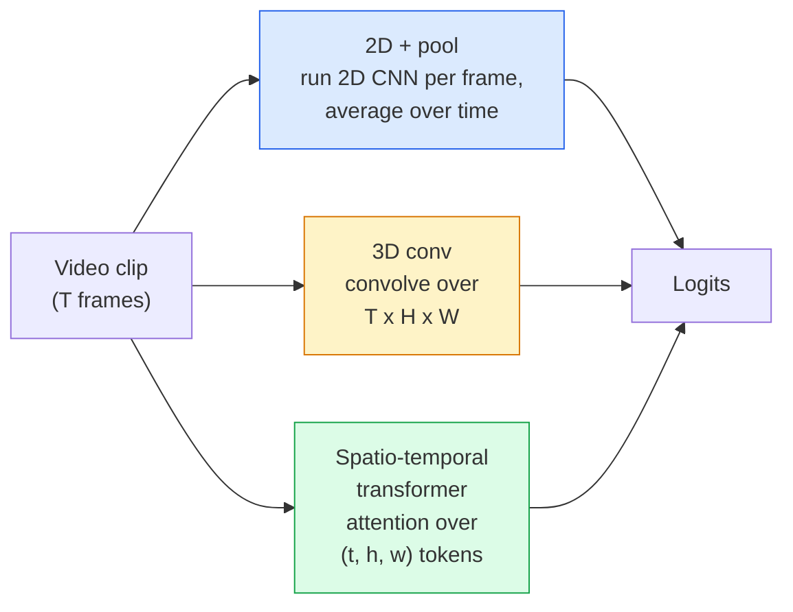

# Video Understanding — Temporal Modeling

> video は images の sequence と、それらをつなぐ physics です。すべての video model は、time を extra axis として扱う（3D conv）、attention する sequence として扱う（transformer）、または一度 feature を抽出して pool する（2D+pool）のいずれかです。

**種別:** 学習 + 構築
**言語:** Python
**前提条件:** Phase 4 Lesson 03 (CNNs), Phase 4 Lesson 04 (Image Classification)
**所要時間:** 約45分

## 学習目標

- 3 つの主要な video-modelling approaches（2D+pool、3D conv、spatio-temporal transformer）を区別し、それぞれの cost と accuracy trade-offs を予測する
- PyTorch で frame sampling、temporal pooling、2D+pool baseline classifier を実装する
- I3D の "inflated" 3D kernels が ImageNet weights からうまく transfer する理由と、factorised (2+1)D conv が何を違った形で行うかを説明する
- 標準的な action-recognition datasets と metrics を読む: Kinetics-400/600、UCF101、Something-Something V2、clip と video level の top-1 accuracy

## 問題

30 fps の 30 秒 video は 900 images です。単純には、video classification は image classification を 900 回実行し、何らかの aggregation を行うことです。action がほぼすべての frame に見えている場合（sports、cooking、exercise videos）はこれで動きます。しかし action が motion そのもので定義される場合、たとえば "pushing something from left to right" は、どの single frame でも 2 つの静止物体に見えるだけなので大きく失敗します。

すべての video architecture の中心的な問いは、temporal structure をいつ、どのように model 化するかです。その答えが、compute cost、pretraining strategy、ImageNet weights を再利用できるか、どの datasets で学習するかを決めます。

この lesson は static-image lessons より意図的に短くなっています。core image machinery はすでに揃っており、video understanding は主に temporal story、つまり sampling、modelling、aggregating の問題だからです。

## コンセプト

### 3 つの architectural families



### 2D + pool

2D CNN（ResNet、EfficientNet、ViT）を取り、sampled frame ごとに独立に実行します。per-frame embeddings を average（または max-pool、attention-pool）します。pooled vector を classifier に入力します。

Pros:
- ImageNet pretraining が直接 transfer する。
- 実装が最も簡単。
- 安価: T frames * single-image inference cost。

Cons:
- motion を model 化できない。Action = appearances の aggregate になる。
- temporal pooling は order-invariant なので、"open door" と "close door" が同じに見える。

使う場面: appearance-heavy tasks、小さな video datasets での transfer learning、初期 baseline。

### 3D convolutions

2D (H, W) kernels を 3D (T, H, W) kernels に置き換えます。network は space と time の両方に convolve します。初期 family は C3D、I3D、SlowFast です。

I3D trick: pretrained 2D ImageNet model を取り、各 2D kernel を新しい time axis に沿ってコピーして "inflate" します。3x3 の 2D conv は 3x3x3 の 3D conv になります。これにより、3D model は scratch からではなく強い pretrained weights から始められます。

Pros:
- motion を直接 model 化する。
- I3D inflation により transfer learning が無料で得られる。

Cons:
- 2D counterpart より T/8 多い FLOPs（temporal kernel 3 を 3 回積む場合）。
- temporal kernels は小さい。long-range motion には pyramid または dual-stream approach が必要。

使う場面: motion が signal である action recognition（Something-Something V2、motion-heavy classes を含む Kinetics）。

### Spatio-temporal transformers

video を space-time patches の grid に tokenise し、すべてに attention します。TimeSformer、ViViT、Video Swin、VideoMAE などです。

重要な attention patterns:
- **Joint** — (t, h, w) 全体に 1 つの大きな attention。`T*H*W` に対して quadratic で高価。
- **Divided** — block ごとに 2 つの attentions。time に 1 つ、space に 1 つ。おおむね linear に近く scaling する。
- **Factorised** — blocks の中で time attention と space attention を交互に行う。

Pros:
- 主要 benchmark で SOTA accuracy。
- patch inflation により image transformers（ViT）から transfer できる。
- sparse attention により long-context video を扱える。

Cons:
- compute-hungry。
- attention pattern choice を慎重に選ばないと runtime が膨らむ。

使う場面: 大規模 datasets、高 fidelity video understanding、multi-modal video+text tasks。

### Frame sampling

30 fps の 10 秒 clip は 300 frames です。300 frames すべてを model に入れるのは無駄です。標準的な strategies は次の通りです。

- **Uniform sampling** — clip 全体から T frames を等間隔に選ぶ。2D+pool のデフォルト。
- **Dense sampling** — random contiguous T-frame window。motion には隣接 frames が必要なので 3D convs で一般的。
- **Multi-clip** — 同じ video から複数の T-frame windows を sample し、test time に各 prediction を平均する。

T は通常 8、16、32、64 です。T が大きいほど temporal signal は増えますが compute も増えます。

### 評価

2 つの level があります。

- **Clip-level accuracy** — model が 1 つの T-frame clip を見て top-k を報告する。
- **Video-level accuracy** — video ごとに複数 clips の clip-level predictions を平均する。より高く安定する。

必ず両方を報告します。78% clip / 82% video の model は test-time averaging に強く依存しています。80% / 81% の model は per-clip でより robust です。

### 出会う datasets

- **Kinetics-400 / 600 / 700** — general-purpose action dataset。400k clips。YouTube URLs（現在は多くが dead）。
- **Something-Something V2** — motion-defined actions（"moving X from left to right"）。2D+pool では解けない。
- **UCF-101**, **HMDB-51** — 古く小さいが、今も報告される。
- **AVA** — space と time における action *localisation*。classification より難しい。

## 実装

### Step 1: Frame sampler

frames の list（または video tensor）で動く uniform と dense samplers です。

```python
import numpy as np

def sample_uniform(num_frames_total, T):
    if num_frames_total <= T:
        return list(range(num_frames_total)) + [num_frames_total - 1] * (T - num_frames_total)
    step = num_frames_total / T
    return [int(i * step) for i in range(T)]


def sample_dense(num_frames_total, T, rng=None):
    rng = rng or np.random.default_rng()
    if num_frames_total <= T:
        return list(range(num_frames_total)) + [num_frames_total - 1] * (T - num_frames_total)
    start = int(rng.integers(0, num_frames_total - T + 1))
    return list(range(start, start + T))
```

どちらも video tensor を slice するための `T` indices を返します。

### Step 2: 2D+pool baseline

各 frame に 2D ResNet-18 を走らせ、features を average-pool して classify します。

```python
import torch
import torch.nn as nn
from torchvision.models import resnet18, ResNet18_Weights

class FramePool(nn.Module):
    def __init__(self, num_classes=400, pretrained=True):
        super().__init__()
        weights = ResNet18_Weights.IMAGENET1K_V1 if pretrained else None
        backbone = resnet18(weights=weights)
        self.features = nn.Sequential(*(list(backbone.children())[:-1]))  # global avg pool kept
        self.head = nn.Linear(512, num_classes)

    def forward(self, x):
        # x: (N, T, 3, H, W)
        N, T = x.shape[:2]
        x = x.view(N * T, *x.shape[2:])
        feats = self.features(x).view(N, T, -1)
        pooled = feats.mean(dim=1)
        return self.head(pooled)

model = FramePool(num_classes=10)
x = torch.randn(2, 8, 3, 224, 224)
print(f"output: {model(x).shape}")
print(f"params: {sum(p.numel() for p in model.parameters()):,}")
```

11 million parameters、ImageNet pretrained、per-frame に実行して average し、classify します。この baseline は appearance-heavy tasks では proper 3D models の 5-10 points 以内に入ることが多く、より強い ImageNet backbone を再利用するため、ときには上回ります。

### Step 3: I3D-style inflated 3D conv

2D conv 1 つを、新しい time axis に沿って weights を繰り返すことで 3D conv に変換します。

```python
def inflate_2d_to_3d(conv2d, time_kernel=3):
    out_c, in_c, kh, kw = conv2d.weight.shape
    weight_3d = conv2d.weight.data.unsqueeze(2)  # (out, in, 1, kh, kw)
    weight_3d = weight_3d.repeat(1, 1, time_kernel, 1, 1) / time_kernel
    conv3d = nn.Conv3d(in_c, out_c, kernel_size=(time_kernel, kh, kw),
                        padding=(time_kernel // 2, conv2d.padding[0], conv2d.padding[1]),
                        stride=(1, conv2d.stride[0], conv2d.stride[1]),
                        bias=False)
    conv3d.weight.data = weight_3d
    return conv3d

conv2d = nn.Conv2d(3, 64, kernel_size=3, padding=1, bias=False)
conv3d = inflate_2d_to_3d(conv2d, time_kernel=3)
print(f"2D weight shape:  {tuple(conv2d.weight.shape)}")
print(f"3D weight shape:  {tuple(conv3d.weight.shape)}")
x = torch.randn(1, 3, 8, 56, 56)
print(f"3D output shape:  {tuple(conv3d(x).shape)}")
```

`time_kernel` で割ることで activation magnitudes をおおむね一定に保ちます。これは初回 pass で batch-norm statistics を壊さないために重要です。

### Step 4: Factorised (2+1)D conv

3D conv を 2D（spatial）conv と 1D（temporal）conv に分割します。同じ receptive field、より少ない parameters、いくつかの benchmarks ではより良い accuracy です。

```python
class Conv2Plus1D(nn.Module):
    def __init__(self, in_c, out_c, kernel_size=3):
        super().__init__()
        mid_c = (in_c * out_c * kernel_size * kernel_size * kernel_size) \
                // (in_c * kernel_size * kernel_size + out_c * kernel_size)
        self.spatial = nn.Conv3d(in_c, mid_c, kernel_size=(1, kernel_size, kernel_size),
                                 padding=(0, kernel_size // 2, kernel_size // 2), bias=False)
        self.bn = nn.BatchNorm3d(mid_c)
        self.act = nn.ReLU(inplace=True)
        self.temporal = nn.Conv3d(mid_c, out_c, kernel_size=(kernel_size, 1, 1),
                                  padding=(kernel_size // 2, 0, 0), bias=False)

    def forward(self, x):
        return self.temporal(self.act(self.bn(self.spatial(x))))

c = Conv2Plus1D(3, 64)
x = torch.randn(1, 3, 8, 56, 56)
print(f"(2+1)D output: {tuple(c(x).shape)}")
```

full R(2+1)D network は、ResNet-18 のすべての 3x3 conv を `Conv2Plus1D` に置き換えたものです。

## 使う

production video work をカバーする libraries は 2 つあります。

- `torchvision.models.video` — R(2+1)D、MViT、Swin3D と pretrained Kinetics weights。image models と同じ API。
- `pytorchvideo`（Meta）— model zoo、Kinetics / SSv2 / AVA 用 data loaders、standard transforms。

Vision-Language video models（video captioning、video QA）では `transformers`（`VideoMAE`、`VideoLLaMA`、`InternVideo`）を使います。

## 成果物

この lesson は次を生成します。

- `outputs/prompt-video-architecture-picker.md` — appearance-vs-motion、dataset size、compute budget に基づいて 2D+pool / I3D / (2+1)D / transformer を選ぶ prompt。
- `outputs/skill-frame-sampler-auditor.md` — video pipeline の sampler を検査し、off-by-one index、`num_frames < T` の uneven sampling、aspect-preserving crop の欠如などの common bugs を flag する skill。

## 演習

1. **(Easy)** T=8 の FramePool と T=8 の I3D-style 3D ResNet の FLOPs（概算）を計算してください。なぜ 2D+pool が 3-5x 安いのかを説明してください。
2. **(Medium)** synthetic video dataset を生成してください。random balls が random directions に動き、motion direction（"left-to-right"、"right-to-left"、"diagonal-up"）で label されます。FramePool を学習してください。appearance だけでは motion tasks に不十分であることを示すため、near-chance accuracy になることを示してください。
3. **(Hard)** ResNet-18 のすべての Conv2d を `Conv2Plus1D` に置き換えて R(2+1)D-18 を作ってください。ImageNet-pretrained ResNet-18 から first conv の weights を inflate します。exercise 2 の motion dataset で学習し、FramePool を上回ってください。

## 重要用語

| Term | What people say | What it actually means |
|------|----------------|----------------------|
| 2D + pool | 「Per-frame classifier」 | sampled frame ごとに 2D CNN を実行し、time 方向に features を average-pool して classify する |
| 3D convolution | 「Spatio-temporal kernel」 | (T, H, W) に convolve する kernel。motion を native に model 化できる |
| Inflation | 「2D weights を 3D に持ち上げる」 | 2D conv weights を新しい time axis に沿って繰り返し、kernel_T で割って activation scale を保つことで 3D conv weights を初期化する |
| (2+1)D | 「Factorised conv」 | 3D を 2D spatial + 1D temporal に分割する。parameters が少なく、間に追加 non-linearity が入る |
| Divided attention | 「Time then space」 | layer ごとに 2 つの attentions を持つ transformer block。同じ frame の tokens への attention と、同じ position の tokens への attention |
| Clip | 「T-frame window」 | T frames の sampled subsequence。video model が消費する単位 |
| Clip vs video accuracy | 「2 つの eval settings」 | Clip = video ごとに 1 sample、video = 複数 sampled clips の平均 |
| Kinetics | 「video の ImageNet」 | 400-700 action classes、300k+ YouTube clips、標準的な video pretraining corpus |

## 参考文献

- [I3D: Quo Vadis, Action Recognition (Carreira & Zisserman, 2017)](https://arxiv.org/abs/1705.07750) — inflation と Kinetics dataset を導入
- [R(2+1)D: A Closer Look at Spatiotemporal Convolutions (Tran et al., 2018)](https://arxiv.org/abs/1711.11248) — factorised conv。今でも強い baseline
- [TimeSformer: Is Space-Time Attention All You Need? (Bertasius et al., 2021)](https://arxiv.org/abs/2102.05095) — 最初の強力な video transformer
- [VideoMAE (Tong et al., 2022)](https://arxiv.org/abs/2203.12602) — video の masked autoencoder pretraining。現在主流の pretraining recipe
