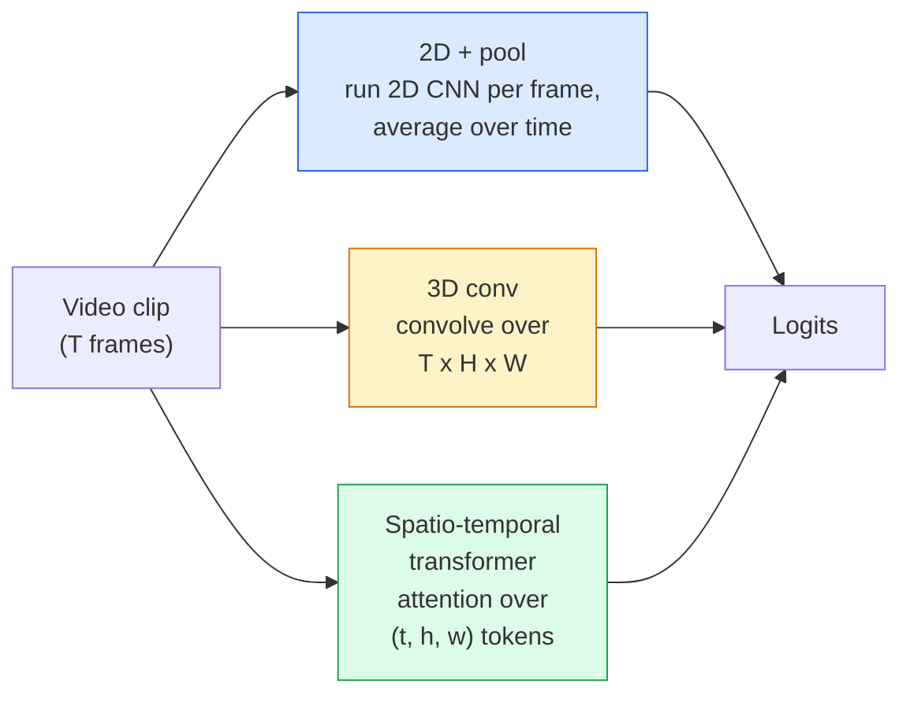

# Videoyu Anlama — Geçici Modelleme

> Video, bir dizi görüntü ve bunları birbirine bağlayan fizikten oluşur. Her video modeli, zamanı ya fazladan bir eksen (3B dönüşüm), ilgilenilecek bir dizi (transformer) ya da bir kez çıkarılıp havuzlanacak bir özellik (2B+havuz) olarak ele alır.

**Tür:** Öğren + Oluştur
**Diller:** Python
**Önkoşullar:** Aşama 4 Ders 03 (CNN'ler), Aşama 4 Ders 04 (Görüntü Sınıflandırması)
**Süre:** ~45 dakika

## Öğrenme Hedefleri

- Üç ana video modelleme yaklaşımını (2D+havuz, 3D dönüşüm, uzay-zamansal transformer) ayırt edin ve bunların maliyet ve doğruluk dengelerini tahmin edin
- PyTorch'ta çerçeve örnekleme, zamansal havuzlama ve 2D+havuz temel sınıflandırıcısını uygulayın
- I3D'nin "şişirilmiş" 3D çekirdeklerinin ImageNet ağırlıklarından neden iyi aktarıldığını ve çarpanlara ayrılmış (2+1)D dönüşümün neyi farklı yaptığını açıklayın
- Standart eylem tanıma dataset'leri ve ölçümlerini okuyun: Kinetics-400/600, UCF101, Something-Something V2; Klip ve video düzeyinde birinci sınıf doğruluk

## Sorun

30 fps'de 30 saniyelik bir video 900 görüntüdür. Safça, video sınıflandırması, görüntü sınıflandırmasının 900 kez çalıştırılması ve ardından bir tür toplama işlemidir. Bu, eylemin hemen hemen her karede (spor, yemek pişirme, egzersiz videoları) görünür olduğu durumlarda işe yarar ve eylemin kendisi tarafından tanımlandığında kötü bir şekilde başarısız olur: "bir şeyi soldan sağa itmek", her karede iki hareketsiz nesne gibi görünür.

Her video mimarisinin temel sorusu şudur: Zamansal yapı ne zaman ve nasıl modellenir? Cevap diğer her şeyi yönlendirir - hesaplama maliyeti, ön eğitim stratejisi, ImageNet ağırlıklarını yeniden kullanıp kullanamayacağınız, modelin hangi dataset üzerinde eğitim aldığı.

Bu ders kasıtlı olarak statik görüntü derslerinden daha kısadır. Temel görüntü mekanizması halihazırda mevcuttur ve videonun anlaşılması çoğunlukla zamansal hikayeyle ilgilidir: örnekleme, modelleme ve birleştirme.

## Konsept

### Üç mimari aile



### 2D + havuz

2D CNN'yi (ResNet, EfficientNet, ViT) alın. Örneklenen her karede bağımsız olarak çalıştırın. Kare başına embedding'lerin ortalamasını (veya maksimum havuzu veya dikkat havuzunu) alın. Havuza alınmış vektörü bir sınıflandırıcıya besleyin.

Artıları:
- ImageNet eğitim öncesi transferleri doğrudan.
- Uygulaması en basit.
- Ucuz: T çerçeveler * tek görüntü inference maliyeti.

Eksileri:
- Hareket modellenemiyor. Eylem = görünüşlerin toplamı.
- Geçici havuzlama sıra açısından değişmez; "kapıyı aç" ve "kapıyı kapat" aynı görünüyor.

Ne zaman kullanılır: görünüm ağırlıklı görevler, küçük video dataset'lerde öğrenim aktarımı, başlangıç temelleri.

### 3 boyutlu evrişimler

2B (H, W) çekirdekleri 3B (T, H, W) çekirdeklerle değiştirin. Ağ hem uzay hem de zaman üzerinde evrilir. Erken aile: C3D, I3D, SlowFast.

I3D numarası: önceden eğitilmiş bir 2D ImageNet modelini alın, her 2D çekirdeği yeni bir zaman ekseni boyunca kopyalayarak "şişirin". 3x3 2B dönüşüm, 3x3x3 3B dönüşüme dönüşür. Bu, 3D modele sıfırdan eğitim vermek yerine önceden eğitilmiş güçlü ağırlıklar sağlar.

Artıları:
- Doğrudan hareketi modeller.
- I3D enflasyonu ücretsiz transfer öğrenimi sağlar.

Eksileri:
- 2B emsalinden T/8 daha fazla FLOP (3 kez istiflenmiş 3'lük zamansal çekirdek için).
- Zamansal çekirdekler küçüktür; uzun menzilli hareket bir piramit veya çift akışlı yaklaşıma ihtiyaç duyar.

Ne zaman kullanılır: hareketin sinyal olduğu eylem tanıma (Bir Şey-Bir Şey V2, Hareket ağırlıklı sınıflarla Kinetik).

### Uzay-zamansal transformers

ZXQKEEP0QXVideoyu uzay-zaman yamalarından oluşan bir ızgaraya yerleştirin ve hepsine katılın. TimeSformer, ViViT, Video Swin, VideoMAE.

Önemli olan dikkat kalıpları:
- **Eklem** — (t, h, w) üzerine büyük bir dikkat. `T*H*W`'de ikinci dereceden; masraflı.
- **Bölünmüş** — blok başına iki dikkat: biri zaman içinde, biri uzayda. Doğrusal ölçeklendirme.
- **Faktörlere ayrılmış** — zaman dikkati, bloklar arasında uzay dikkatiyle dönüşümlü olarak çalışır.

Artıları:
- Her önemli benchmark'de SOTA doğruluğu.
- Yama enflasyonu yoluyla görüntü transformer'lerden (ViT) transferler.
- Seyrek dikkat yoluyla uzun bağlamlı videoyu destekler.

Eksileri:
- Bilgisayara aç.
- Desen seçimine veya çalışma zamanı balonlarına dikkat edilmesi gerekir.

Ne zaman kullanılır: büyük dataset'ler, yüksek kaliteli video anlayışı, çok modlu video+metin görevleri.

### Çerçeve örnekleme

30 fps'de 10 saniyelik bir klip 300 karedir; 300'ün tamamını herhangi bir modele beslemek israftır. Standart stratejiler:

- **Tek tip örnekleme** — T karelerini klip boyunca eşit şekilde seçin. 2D+havuz için varsayılan.
- **Yoğun örnekleme** — rastgele bitişik T-kare penceresi. Hareket komşu kareleri gerektirdiğinden 3B dönüşümler için yaygındır.
- **Çoklu klip** — aynı videodan birden fazla T kare penceresini örnekleyin, her birini sınıflandırın ve test sırasında tahminlerin ortalamasını alın.

T genellikle 8, 16, 32 veya 64'tür. Daha yüksek T = daha fazla hesaplamada daha fazla zamansal sinyal.

### Değerlendirme

İki seviye:
- **Klip düzeyinde doğruluk** — model bir T-kare klibi görür ve üst-k'yi bildirir.
- **Video düzeyinde doğruluk** — video başına birden fazla klipte ortalama klip düzeyinde tahminler; daha yüksek ve daha istikrarlı.

Her zaman ikisini de rapor edin. %78 klip / %82 video puanı alan bir model, büyük ölçüde test süresi ortalamasını temel alır; %80 / %81 puan alan klip başına daha sağlamdır.

### Dataset'lerle tanışacaksınız

- **Kinetics-400/600/700** — genel amaçlı eylem dataset. 400 bin klip; YouTube URL'leri (çoğu artık ölü).
- **Bir Şey-Bir Şey V2** — hareket tanımlı eylemler ("X'i soldan sağa taşıma"). 2D+havuz ile çözülemez.
- **UCF-101**, **HMDB-51** — daha eski, daha küçük, hâlâ rapor ediliyor.
- **AVA** — mekan ve zamanda eylem *yerelleştirme*; sınıflandırmaktan daha zordur.

## İnşa Et

### Adım 1: Çerçeve örnekleyici

Bir kare listesi (veya bir video tensörü) üzerinde çalışan tekdüze ve yoğun örnekleyiciler.

```python
import numpy as np

def sample_uniform(num_frames_total, T):
    if num_frames_total <= T:
        return list(range(num_frames_total)) + [num_frames_total - 1] * (T - num_frames_total)
    step = num_frames_total / T
    return [int(i * step) for i in range(T)]


def sample_dense(num_frames_total, T, rng=None):
    rng = rng or np.random.default_rng()
    if num_frames_total <= T:
        return list(range(num_frames_total)) + [num_frames_total - 1] * (T - num_frames_total)
    start = int(rng.integers(0, num_frames_total - T + 1))
    return list(range(start, start + T))
```

Her ikisi de video tensörünü dilimlemek için kullandığınız `T` endekslerini döndürür.

### Adım 2: 2B+havuz temel çizgisi

Her karede 2D ResNet-18 çalıştırın, ortalama havuz özelliklerini sınıflandırın.

```python
import torch
import torch.nn as nn
from torchvision.models import resnet18, ResNet18_Weights

class FramePool(nn.Module):
    def __init__(self, num_classes=400, pretrained=True):
        super().__init__()
        weights = ResNet18_Weights.IMAGENET1K_V1 if pretrained else None
        backbone = resnet18(weights=weights)
        self.features = nn.Sequential(*(list(backbone.children())[:-1]))  # global avg pool kept
        self.head = nn.Linear(512, num_classes)

    def forward(self, x):
        # x: (N, T, 3, H, W)
        N, T = x.shape[:2]
        x = x.view(N * T, *x.shape[2:])
        feats = self.features(x).view(N, T, -1)
        pooled = feats.mean(dim=1)
        return self.head(pooled)

model = FramePool(num_classes=10)
x = torch.randn(2, 8, 3, 224, 224)
print(f"output: {model(x).shape}")
print(f"params: {sum(p.numel() for p in model.parameters()):,}")
```

ImageNet tarafından önceden eğitilmiş on bir milyon parametre, kare başına çalıştırılır, ortalamaları alınır ve sınıflandırılır. Bu temel çizgi, görünümün ağır olduğu görevlerde genellikle uygun 3D modellerin 5-10 puanı dahilindedir; bazen daha iyidir, çünkü daha güçlü bir ImageNet omurgasını yeniden kullanır.

### 3. Adım: I3D tarzı şişirilmiş 3D dönüşüm

Ağırlıkları yeni bir zaman ekseni boyunca tekrarlayarak tek bir 2B dönüşümü 3B dönüşüme dönüştürün.

```python
def inflate_2d_to_3d(conv2d, time_kernel=3):
    out_c, in_c, kh, kw = conv2d.weight.shape
    weight_3d = conv2d.weight.data.unsqueeze(2)  # (out, in, 1, kh, kw)
    weight_3d = weight_3d.repeat(1, 1, time_kernel, 1, 1) / time_kernel
    conv3d = nn.Conv3d(in_c, out_c, kernel_size=(time_kernel, kh, kw),
                        padding=(time_kernel // 2, conv2d.padding[0], conv2d.padding[1]),
                        stride=(1, conv2d.stride[0], conv2d.stride[1]),
                        bias=False)
    conv3d.weight.data = weight_3d
    return conv3d

conv2d = nn.Conv2d(3, 64, kernel_size=3, padding=1, bias=False)
conv3d = inflate_2d_to_3d(conv2d, time_kernel=3)
print(f"2D weight shape:  {tuple(conv2d.weight.shape)}")
print(f"3D weight shape:  {tuple(conv3d.weight.shape)}")
x = torch.randn(1, 3, 8, 56, 56)
print(f"3D output shape:  {tuple(conv3d(x).shape)}")
```

`time_kernel` ile yapılan bölme, aktivasyon büyüklüklerini kabaca sabit tutar; bu, ilk geçişte toplu norm istatistiklerinin kırılmaması açısından önemlidir.

### Adım 4: Çarpanlara Ayrılmış (2+1)D dönüşümü

3B dönüşümü 2B (uzaysal) ve 1B (zamansal) dönüşüme ayırın. Aynı alıcı alan, daha az parametre, bazı benchmark'lerde daha iyi doğruluk.

```python
class Conv2Plus1D(nn.Module):
    def __init__(self, in_c, out_c, kernel_size=3):
        super().__init__()
        mid_c = (in_c * out_c * kernel_size * kernel_size * kernel_size) \
                // (in_c * kernel_size * kernel_size + out_c * kernel_size)
        self.spatial = nn.Conv3d(in_c, mid_c, kernel_size=(1, kernel_size, kernel_size),
                                 padding=(0, kernel_size // 2, kernel_size // 2), bias=False)
        self.bn = nn.BatchNorm3d(mid_c)
        self.act = nn.ReLU(inplace=True)
        self.temporal = nn.Conv3d(mid_c, out_c, kernel_size=(kernel_size, 1, 1),
                                  padding=(kernel_size // 2, 0, 0), bias=False)

    def forward(self, x):
        return self.temporal(self.act(self.bn(self.spatial(x))))

c = Conv2Plus1D(3, 64)
x = torch.randn(1, 3, 8, 56, 56)
print(f"(2+1)D output: {tuple(c(x).shape)}")
```

Tam bir R(2+1)D ağı, her 3x3 dönüşümün `Conv2Plus1D` ile değiştirildiği ResNet-18 ile aynıdır.

## Kullan onu

İki kitaplık prodüksiyon videosu çalışmalarını kapsar:

- `torchvision.models.video` — R(2+1)D, MViT, Swin3D, önceden eğitilmiş Kinetik ağırlıklarla. Resim modelleriyle aynı API.
- `pytorchvideo` (Meta) — model hayvanat bahçesi, Kinetics / SSv2 / AVA için veri yükleyiciler, standart dönüşümler.

Görüntü Dili video modelleri için (video altyazısı, video QA), `transformers` (`VideoMAE`, `VideoLLaMA`, `InternVideo`) kullanın.

## Gönderin

Bu ders şunları üretir:

- `outputs/prompt-video-architecture-picker.md` — görünüm-hareket, dataset boyutu ve işlem bütçesine göre 2D+havuz / I3D / (2+1)D / transformer'yi seçen bir prompt.
- `outputs/skill-frame-sampler-auditor.md` — bir video hattının örnekleyicisini denetleyen ve yaygın hataları işaretleyen bir beceri: tek tek dizin, `num_frames < T` olduğunda düzensiz örnekleme, görünüş koruyucu kırpma eksikliği vb.

## Egzersizler

1. **(Kolay)** T=8 ile FramePool için FLOP'ları (yaklaşık) ve T=8 ile I3D tarzı 3D ResNet'i hesaplayın. 2D+havuzun neden 3-5 kat daha ucuz olduğunu açıklayın.
2. **(Orta)** Sentetik bir video dataset oluşturun: rastgele yönlerde hareket eden rastgele toplar, hareket yönüne göre etiketlenir ("soldan sağa", "sağdan sola", "çapraz-yukarı"). FramePool'u üzerinde eğitin. Hareket görevleri için yalnızca görünümün yeterli olmadığını kanıtlayarak neredeyse şansa yakın doğruluk elde ettiğini gösterin.
3. **(Zor)** ResNet-18'deki her Conv2d'yi `Conv2Plus1D` ile değiştirerek bir R(2+1)D-18 oluşturun. ImageNet ile önceden eğitilmiş bir ResNet-18'den ilk dönüşümün ağırlıklarını şişirin. Egzersiz 2'deki dataset hareketini uygulayın ve FramePool'u yenin.

## Anahtar Terimler

| Dönem | İnsanlar ne diyor | Aslında ne anlama geliyor |
|------|----------------|----------------------|
| 2D + havuz | "Çerçeve başına sınıflandırıcı" | Örneklenen her karede 2D CNN çalıştırın, zaman içindeki ortalama havuz özelliklerini kullanın, sınıflandırın |
| 3D evrişim | "Uzaysal-zamansal çekirdek" | (T, H, W) üzerinde evrilen çekirdek; hareketi yerel olarak modelleyebilir |
| Enflasyon | "2D ağırlıklarını 3D'ye kaldırın" | 2B dönüşümün ağırlıklarını yeni zaman ekseni boyunca tekrarlayarak 3B dönüşüm ağırlıklarını başlatın, ardından etkinleştirme ölçeğini korumak için kernel_T'ye bölün |
| (2+1)D | "Faktörleştirilmiş dönüşüm" | 3B'yi 2B uzamsal + 1B zamansal olarak bölün; daha az parametre, |
| Bölünmüş dikkat | "Zaman sonra uzay" | Katman başına iki dikkat içeren Transformer bloğu: aynı karede token'ler üzerinde bir, aynı konumda token'ler üzerinde bir |
| Klip | "T-çerçeve penceresi" | T karelerinin örneklenmiş bir alt dizisi; video modelinin tükettiği birim |
| Klip ve video doğruluğu | "İki değerlendirme ayarı" | Klip = video başına bir örnek, video = birden fazla örneklenmiş klipin ortalaması |
| Kinetik | "Videonun ImageNet'i" | 400-700 aksiyon sınıfı, 300.000'den fazla YouTube klibi, standart video ön eğitim külliyatı |

## Daha Fazla Okuma

- [I3D: Quo Vadis, Eylem Tanıma (Carreira ve Zisserman, 2017)](https://arxiv.org/abs/1705.07750) — enflasyonu ve Kinetiği tanıtıyor dataset
- [R(2+1)D: Uzay-zamansal Kıvrımlara Daha Yakından Bir Bakış (Tran ve diğerleri, 2018)](https://arxiv.org/abs/1711.11248) — çarpanlara ayrılmış dönüşüm, hala güçlü bir temel
- [TimeSformer: Tek İhtiyacınız Olan Uzay-Zaman Dikkati mi? (Bertasius ve diğerleri, 2021)](https://arxiv.org/abs/2102.05095) — ilk güçlü video transformer
- [VideoMAE (Tong ve diğerleri, 2022)](https://arxiv.org/abs/2203.12602) — video için maskelenmiş otomatik kodlayıcı ön eğitimi; mevcut baskın ön eğitim tarifi
