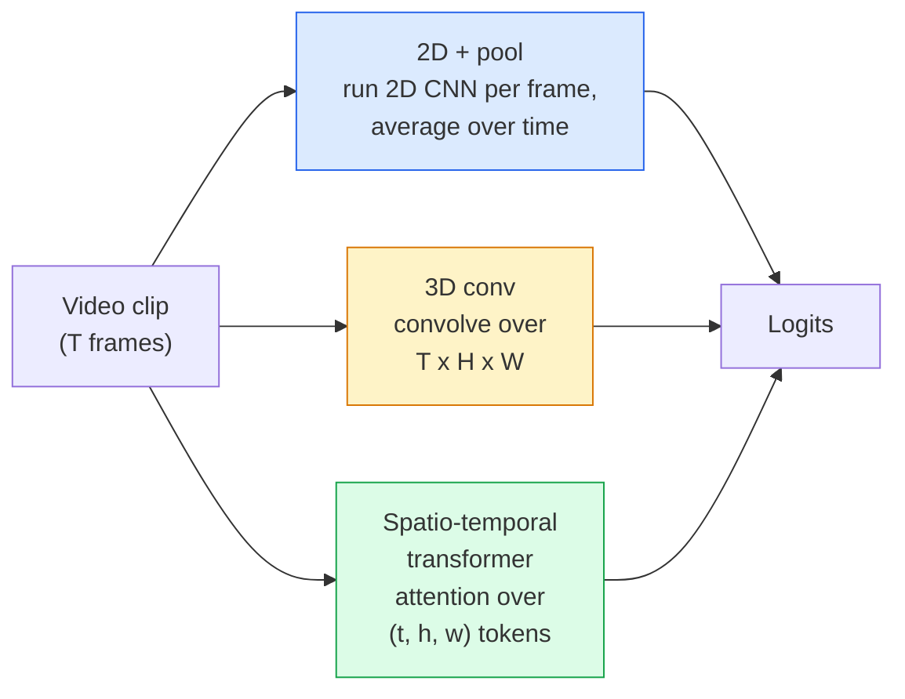

# Video Understanding — Temporal Modeling

> 视频是一系列图像以及连接它们的物理原理。每个视频模型要么将时间视为额外的轴（3D conv）、要关注的序列（Transformer），要么将时间视为一次提取并池的特征（2D+池）。

** 类型：** 学习+构建
** 语言：** Python
** 先决条件：** 第4阶段第03课（CNN）、第4阶段第04课（图像分类）
** 时间：** ~45分钟

## Learning Objectives

- 区分三种主要的视频建模方法（2D+池、3D卷积、时空Transformer）并预测其成本和准确性权衡
- 在PyTorch中实现帧采样、时间池和2D+池基线分类器
- 解释为什么I3 D的“膨胀”3D内核可以很好地从ImageNet权重转移，以及因式分解（2+1）D conv的不同之处
- 阅读标准动作识别数据集和指标：Kinetics-400/600、UCF 101、Something-Something V2;剪辑和视频级别的准确性前一名

## The Problem

30帧每秒的30秒视频包含900张图像。简单地说，视频分类是图像分类运行900次，然后进行某种聚合。当动作在几乎每个帧（运动、烹饪、锻炼视频）中都可见时，这种方法有效，而当动作由运动本身定义时，这种方法就会严重失败：“从左向右推动某物”看起来就像每个帧中的两个静止物体。

每个视频架构的核心问题是：时间结构何时建模以及如何建模？答案驱动着其他一切--计算成本、预训练策略、是否可以重复使用ImageNet权重、模型训练所依赖的数据集。

这堂课故意比静态图像课短。核心图像机制已经到位，视频理解主要是关于时间故事：采样、建模和聚合。

## The Concept

### The three architectural families



### 2D + pool

以2D CNN（ResNet、EfficientNet、ViT）为例。在每个采样帧上独立运行它。平均（或最大池或注意力池）每帧嵌入。将汇集的载体提供给分类器。

优点：
- ImageNet预训练直接传输。
- 最容易实现。
- 便宜：T帧 * 单图像推断成本。

缺点：
- 无法建模运动。动作=外观的总和。
- 临时池是顺序不变的;“开门”和“关门”看起来是一样的。

何时用途：外观繁重的任务，小视频数据集上的迁移学习，初始基线。

### 3D convolutions

用3D（T，H，W）内核替换2D（H，W）内核。网络在空间和时间上卷积。早期家族：C3 D、I3 D、SlowFast。

I3 D技巧：采用预先训练的2D ImageNet模型，通过沿着新的时间轴复制每个2D内核来“膨胀”它。3x 3 2D转换变成3x 3 3D转换。这为3D模型提供了强大的预训练权重，而不是从头开始训练。

优点：
- 直接建模运动。
- I3 D膨胀提供免费的迁移学习。

缺点：
- 比2D对应的FLOP多T/8（对于堆叠3次的3个时间核心）。
- 时间核很小;远程运动需要金字塔或双流方法。

何时用途：以运动为信号的动作识别（Something-Something V2，具有运动密集类别的动力学）。

### Spatio-temporal transformers

将视频标记为时空补丁网格，并参与所有这些补丁。TimeScformer、ViViT、Video Swin、VideoMAE。

重要的注意力模式：
- **Joint** -（t，h，w）上的一个大关注。“T*H*W”中的二次型;昂贵。
- ** 分割 ** -每个区块两个注意力：一个在时间上，一个在空间上。线性缩放。
- ** 因式分解 ** -时间注意力与空间注意力在块之间交替。

优点：
- SOTA对每个主要基准的准确性。
- 通过补丁膨胀从图像转换器（ViT）传输。
- 通过稀疏关注支持长上下文视频。

缺点：
- 渴望计算机。
- 需要仔细选择注意力模式或运行时气球。

何时用途：大型数据集、高保真视频理解、多模式视频+文本任务。

### Frame sampling

30帧/秒的10秒剪辑相当于300帧;将所有300帧提供给任何模型都是浪费的。标准策略：

- ** 均匀采样 ** -在整个剪辑中均匀地拾取T帧。默认为2D+池。
- ** 密集采样 ** -随机连续T帧窗口。常见于3D convs，因为运动需要邻近的帧。
- ** 多剪辑 ** -对同一视频的多个T帧窗口进行采样，对每个窗口进行分类，并在测试时平均预测。

T通常是8、16、32或64。T越高=计算越多时时间信号越多。

### Evaluation

两个级别：
- ** 剪辑级准确性 ** -模型看到一个T帧剪辑，报告top-k。
- ** 视频级准确度 ** -每个视频多个剪辑的平均剪辑级预测;更高，更稳定。

始终报告两者。剪辑评分为78%/视频82%的模型严重依赖于测试时间平均值;评分为80% / 81%的模型每个剪辑更稳健。

### Datasets you will meet

- ** 动力学-400 / 600 / 700** -通用动作数据集。40万个剪辑; YouTube URL（许多现已失效）。
- **Something-Something V2** -运动定义的动作（“从左向右移动X”）。无法通过2D+池解决。
- **UCF-101**、**HMDB-51** -更老、更小，仍有报告。
- **AVA** -行动 * 局部化 * 空间和时间;比分类更难。

## Build It

### Step 1: Frame sampler

处理帧列表（或视频张量）的均匀且密集的采样器。

```python
import numpy as np

def sample_uniform(num_frames_total, T):
    if num_frames_total <= T:
        return list(range(num_frames_total)) + [num_frames_total - 1] * (T - num_frames_total)
    step = num_frames_total / T
    return [int(i * step) for i in range(T)]


def sample_dense(num_frames_total, T, rng=None):
    rng = rng or np.random.default_rng()
    if num_frames_total <= T:
        return list(range(num_frames_total)) + [num_frames_total - 1] * (T - num_frames_total)
    start = int(rng.integers(0, num_frames_total - T + 1))
    return list(range(start, start + T))
```

两者都返回用于切片视频张量的“T”索引。

### Step 2: A 2D+pool baseline

对每一帧运行2D ResNet-18，平均池特征，分类。

```python
import torch
import torch.nn as nn
from torchvision.models import resnet18, ResNet18_Weights

class FramePool(nn.Module):
    def __init__(self, num_classes=400, pretrained=True):
        super().__init__()
        weights = ResNet18_Weights.IMAGENET1K_V1 if pretrained else None
        backbone = resnet18(weights=weights)
        self.features = nn.Sequential(*(list(backbone.children())[:-1]))  # global avg pool kept
        self.head = nn.Linear(512, num_classes)

    def forward(self, x):
        # x: (N, T, 3, H, W)
        N, T = x.shape[:2]
        x = x.view(N * T, *x.shape[2:])
        feats = self.features(x).view(N, T, -1)
        pooled = feats.mean(dim=1)
        return self.head(pooled)

model = FramePool(num_classes=10)
x = torch.randn(2, 8, 3, 224, 224)
print(f"output: {model(x).shape}")
print(f"params: {sum(p.numel() for p in model.parameters()):,}")
```

ImageNet预训练的1100万个参数，每帧运行、平均、分类。对于外观繁重的任务，该基线通常在适当的3D模型的5-10个点以内-有时更好，因为它重复使用了更强大的ImageNet主干。

### Step 3: An I3D-style inflated 3D conv

通过沿新的时间轴重复权重，将单个2D conv转换为3D conv。

```python
def inflate_2d_to_3d(conv2d, time_kernel=3):
    out_c, in_c, kh, kw = conv2d.weight.shape
    weight_3d = conv2d.weight.data.unsqueeze(2)  # (out, in, 1, kh, kw)
    weight_3d = weight_3d.repeat(1, 1, time_kernel, 1, 1) / time_kernel
    conv3d = nn.Conv3d(in_c, out_c, kernel_size=(time_kernel, kh, kw),
                        padding=(time_kernel // 2, conv2d.padding[0], conv2d.padding[1]),
                        stride=(1, conv2d.stride[0], conv2d.stride[1]),
                        bias=False)
    conv3d.weight.data = weight_3d
    return conv3d

conv2d = nn.Conv2d(3, 64, kernel_size=3, padding=1, bias=False)
conv3d = inflate_2d_to_3d(conv2d, time_kernel=3)
print(f"2D weight shape:  {tuple(conv2d.weight.shape)}")
print(f"3D weight shape:  {tuple(conv3d.weight.shape)}")
x = torch.randn(1, 3, 8, 56, 56)
print(f"3D output shape:  {tuple(conv3d(x).shape)}")
```

按“time_core”进行的划分使激活幅度大致恒定-对于在第一次通过时不打破批规范统计数据很重要。

### Step 4: Factorised (2+1)D conv

将3D conv拆分为2D（空间）和1D（时间）conv。相同的感受野，更少的参数，某些基准的准确性更好。

```python
class Conv2Plus1D(nn.Module):
    def __init__(self, in_c, out_c, kernel_size=3):
        super().__init__()
        mid_c = (in_c * out_c * kernel_size * kernel_size * kernel_size) \
                // (in_c * kernel_size * kernel_size + out_c * kernel_size)
        self.spatial = nn.Conv3d(in_c, mid_c, kernel_size=(1, kernel_size, kernel_size),
                                 padding=(0, kernel_size // 2, kernel_size // 2), bias=False)
        self.bn = nn.BatchNorm3d(mid_c)
        self.act = nn.ReLU(inplace=True)
        self.temporal = nn.Conv3d(mid_c, out_c, kernel_size=(kernel_size, 1, 1),
                                  padding=(kernel_size // 2, 0, 0), bias=False)

    def forward(self, x):
        return self.temporal(self.act(self.bn(self.spatial(x))))

c = Conv2Plus1D(3, 64)
x = torch.randn(1, 3, 8, 56, 56)
print(f"(2+1)D output: {tuple(c(x).shape)}")
```

完整的R（2+1）D网络与ResNet-18相同，每个3x 3 conv都被“Conv 2 Plus 1D”替换。

## Use It

两个库涵盖制作视频工作：

- `torchvision.models.video` - R（2+1）D、MViT、Swin 3D和预先训练的Kinetics权重。与图像模型相同的API。
- `pytorchvideo`（Meta）- model zoo，用于Kinetics /SSv 2/ AVA的数据加载器，标准转换。

对于视觉语言视频模型（视频字幕，视频QA），使用`transformers`（`VideoMAE`，`VideoLLaMA`，`InternVideo`）。

## Ship It

本课产生：

- ' outputes/prompt-video-architecture-picker.md '-一个提示，根据外观与运动、数据集大小和计算预算选择2D+pool /I3 D/（2+1）D / Transformer。
- “oututs/skill-frame-sampler-auditor.md”--一种检查视频管道采样器并标记常见错误的技能：偏离一的索引、当“num_frames < T”时采样不均匀、缺乏方面保留作物等。

## Exercises

1. **（简单）** 计算T=8的Frame Pool与T =8的I3 D风格3D ResNet的FLOP（大约）。解释为什么2D+池便宜3- 5倍。
2. **（中）** 生成合成视频数据集：在随机方向上移动的随机球，按运动方向标记（“从左到右”、“从右到左”、“对角线上”）。在上面训练框架池。证明它实现了近乎偶然的准确性，证明仅靠外观不足以完成运动任务。
3. **（硬）** 通过用“Conv 2 Plus 1D”替换ResNet-18中的每个Conv 2d来构建R（2+1）D-18。从ImageNet预训练的ResNet-18中膨胀第一个conv的权重。在练习2中的运动数据集上训练并击败Frame Pool。

## Key Terms

| Term | 别人怎么说 | 它实际上意味着什么 |
|------|----------------|----------------------|
| 2D +泳池 | “每帧分类器” | 对每个采样帧运行2D CNN，平均池随时间变化的特征，分类 |
| 3D卷积 | “时空核心” | 卷积（T、H、W）的核;可以本地建模运动 |
| 通胀 | “将2D权重提升到3D” | 通过沿着新时间轴重复2D conv的权重来初始化3D conv权重，然后除以core_T以保留激活规模 |
| （2+1）D | “工厂化转换” | 将3D分割为2D空间+ 1D时间;参数更少， |
| 分开注意力 | “时间然后空间” | 每层有两个注意力的Transformer块：一个注意力在同一帧的令牌上，一个注意力在同一位置的令牌上 |
| 夹 | “T形框窗” | T帧的采样子序列;视频模型消耗的单位 |
| 剪辑与视频准确性 | “两种评估设置” | 剪辑=每个视频一个样本，视频=多个采样剪辑的平均值 |
| 动力学 | “视频的ImageNet” | 400-700个动作类，300 k + YouTube剪辑，标准视频预训练语料库 |

## Further Reading

- [I3D：Quo Vadis，动作识别（Carreira & Zisserman，2017）]（https：//arxiv.org/ab/1705.07750）-介绍通货膨胀和动力学数据集
- [R(2+1）D：近距离观察时空卷积（Tran等人，2018）]（https：//arxiv.org/ab/1711.11248）-因子分解conv，仍然是一个强大的基线
- [时间转换器：你只需要注意时空吗？]（Bertasius等人，2021）]（https：//arxiv.org/abs/2102.05095）-第一个强大的视频Transformer
- [VideoMAE（Tong等人，2022）]（https：//arxiv.org/ab/2203.12602）-视频的掩蔽自动编码器预训练;当前主要的预训练食谱
