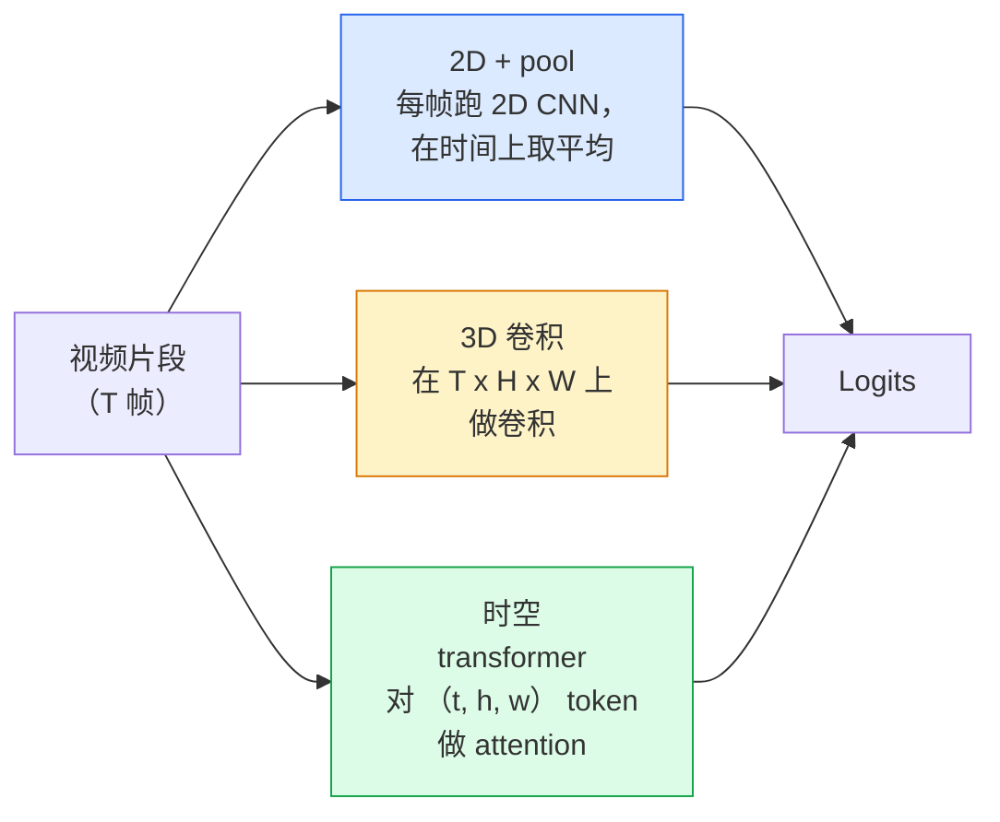

# 视频理解 — 时序建模（Video Understanding — Temporal Modeling）

> 译注：本文译自同目录 [`en.md`](./en.md)。术语遵循仓根 [TRANSLATION_GUIDE.md](../../../../TRANSLATION_GUIDE.md)。

> 一段视频就是一串图像，加上把它们串起来的物理规律。任何视频模型，要么把时间当作多出来的一根轴（3D conv），要么把它当作可以 attend（注意力关注）的序列（transformer），要么把它当作只需提取一次再 pool（池化）的特征（2D+pool）。

**Type:** Learn + Build
**Languages:** Python
**Prerequisites:** Phase 4 Lesson 03 (CNNs), Phase 4 Lesson 04 (Image Classification)
**Time:** ~45 minutes

## 学习目标（Learning Objectives）

- 区分三种主流视频建模思路（2D+pool、3D conv、时空 transformer），并能预判它们的成本与精度取舍
- 用 PyTorch 实现帧采样、时间维 pooling，以及一个 2D+pool 基线分类器
- 解释为什么 I3D 的「inflated」3D kernel 能很好地从 ImageNet 权重迁移，以及 factorised (2+1)D conv 在做法上有何不同
- 读懂主流动作识别数据集与指标：Kinetics-400/600、UCF101、Something-Something V2；clip 级与 video 级的 top-1 accuracy

## 问题（The Problem）

一段 30 秒、30 fps 的视频就是 900 张图。最朴素的做法是把视频分类当成「跑 900 次图像分类，再做某种聚合」。当动作几乎在每一帧里都看得见时（体育、烹饪、健身视频），这套办法管用；可一旦动作本身是由「运动」定义的，它就会惨败：「把某物从左推到右」在每一帧里看上去都只是两个静止的物体。

每一种视频架构要回答的核心问题都是：时序结构在何处建模、又如何建模？这个回答会牵动其余一切——算力开销、预训练策略、能否复用 ImageNet 权重、模型在哪些 dataset（数据集）上训练。

本课刻意比静态图像那几课要短。图像端的核心机制已经就位，视频理解多半是在讲时序这条线：采样、建模、聚合。

## 概念（The Concept）

### 三大架构家族（The three architectural families）



### 2D + pool

挑一个 2D CNN（ResNet、EfficientNet、ViT）。在每一个采样帧上独立跑一遍。把逐帧 embedding 做平均（或 max-pool、attention-pool）。把 pool 后的向量喂给分类器。

优点：
- ImageNet 预训练权重可以直接迁移。
- 实现最简单。
- 便宜：T 帧 × 单图 inference（推理）的成本。

缺点：
- 无法建模运动。动作 = 外观的聚合。
- 时间维 pooling 与顺序无关；「开门」和「关门」看起来一模一样。

适用场景：以外观为主的任务、小规模视频数据集上的迁移学习、初版基线。

### 3D 卷积（3D convolutions）

把 2D 的 (H, W) kernel 换成 3D 的 (T, H, W) kernel。网络在空间和时间两个方向上同时卷积。早期家族：C3D、I3D、SlowFast。

I3D 的小技巧：拿一个预训练好的 2D ImageNet 模型，把每个 2D kernel 沿着新加的时间轴复制一份，「inflate（充气）」成 3D。一个 3x3 的 2D conv 就变成 3x3x3 的 3D conv。这样 3D 模型一上来就有强的预训练权重，不必从零开始训练。

优点：
- 直接对运动建模。
- I3D inflation 提供了「免费」的迁移学习。

缺点：
- FLOPs 比对应的 2D 版本多 T/8 倍（时间维 kernel 大小为 3，叠 3 层时）。
- 时间维 kernel 偏小；长程运动需要金字塔结构或 dual-stream 双流方案。

适用场景：以运动为信号的动作识别（Something-Something V2、Kinetics 中以运动为主的类别）。

### 时空 transformer（Spatio-temporal transformers）

把视频切成时空 patch 网格，让 attention 在所有 patch 上互相关注。代表：TimeSformer、ViViT、Video Swin、VideoMAE。

值得关注的 attention 模式：
- **Joint** — 在 (t, h, w) 上做一次大 attention。复杂度对 `T*H*W` 平方级；昂贵。
- **Divided** — 每个 block 里做两次 attention：一次在时间上，一次在空间上。近似线性复杂度。
- **Factorised** — 时间 attention 与空间 attention 在 block 之间交替。

优点：
- 在每个主流 benchmark 上都是 SOTA。
- 通过 patch inflation 可以从图像 transformer（ViT）迁移过来。
- 借助稀疏 attention 支持长上下文视频。

缺点：
- 算力消耗大。
- 必须仔细挑选 attention 模式，否则运行时间爆炸。

适用场景：大数据集、高保真视频理解、视频+文本的多模态任务。

### 帧采样（Frame sampling）

10 秒、30 fps 的片段就是 300 帧；把这 300 帧全喂给任何模型都浪费。常见策略：

- **Uniform sampling** — 在整个 clip 上均匀挑 T 帧。2D+pool 的默认做法。
- **Dense sampling** — 随机选一段连续的 T 帧窗口。3D conv 常用，因为运动需要邻近帧。
- **Multi-clip** — 在同一段视频里采样多个 T 帧窗口，分别分类，测试时把预测平均。

T 通常取 8、16、32 或 64。T 越大 = 时序信号越多，但算力也越多。

### 评估（Evaluation）

两个层级：
- **Clip 级 accuracy** — 模型看一个 T 帧 clip，报告 top-k。
- **Video 级 accuracy** — 把同一段视频上多个 clip 的预测平均；数值更高、也更稳定。

两者都要报。如果模型 clip 78% / video 82%，说明它高度依赖测试时的平均；80% / 81% 的模型则单 clip 更鲁棒。

### 你会遇到的数据集（Datasets you will meet）

- **Kinetics-400 / 600 / 700** — 通用动作 dataset。40 万段 clip；YouTube 链接（很多已经失效）。
- **Something-Something V2** — 由运动定义的动作（"moving X from left to right"）。2D+pool 解不了。
- **UCF-101**、**HMDB-51** — 更老、更小，但仍在被引用。
- **AVA** — 在空间和时间上做动作 *localisation*（定位）；比分类更难。

## 动手实现（Build It）

### 第 1 步：帧采样器（Step 1: Frame sampler）

针对一串帧（或一个视频张量）的 uniform 与 dense 采样器。

```python
import numpy as np

def sample_uniform(num_frames_total, T):
    if num_frames_total <= T:
        return list(range(num_frames_total)) + [num_frames_total - 1] * (T - num_frames_total)
    step = num_frames_total / T
    return [int(i * step) for i in range(T)]


def sample_dense(num_frames_total, T, rng=None):
    rng = rng or np.random.default_rng()
    if num_frames_total <= T:
        return list(range(num_frames_total)) + [num_frames_total - 1] * (T - num_frames_total)
    start = int(rng.integers(0, num_frames_total - T + 1))
    return list(range(start, start + T))
```

两者都返回 `T` 个索引，用来从视频张量里切片。

### 第 2 步：2D+pool 基线（Step 2: A 2D+pool baseline）

在每一帧上跑一个 2D ResNet-18，对特征做平均 pooling，再分类。

```python
import torch
import torch.nn as nn
from torchvision.models import resnet18, ResNet18_Weights

class FramePool(nn.Module):
    def __init__(self, num_classes=400, pretrained=True):
        super().__init__()
        weights = ResNet18_Weights.IMAGENET1K_V1 if pretrained else None
        backbone = resnet18(weights=weights)
        self.features = nn.Sequential(*(list(backbone.children())[:-1]))  # global avg pool kept
        self.head = nn.Linear(512, num_classes)

    def forward(self, x):
        # x: (N, T, 3, H, W)
        N, T = x.shape[:2]
        x = x.view(N * T, *x.shape[2:])
        feats = self.features(x).view(N, T, -1)
        pooled = feats.mean(dim=1)
        return self.head(pooled)

model = FramePool(num_classes=10)
x = torch.randn(2, 8, 3, 224, 224)
print(f"output: {model(x).shape}")
print(f"params: {sum(p.numel() for p in model.parameters()):,}")
```

一千一百万参数，ImageNet 预训练，逐帧跑、平均、分类。在以外观为主的任务上，这条基线常常和正经的 3D 模型相差只有 5–10 个点——有时甚至更好，因为它复用了一个更强的 ImageNet backbone。

### 第 3 步：I3D 风格的 inflated 3D conv（Step 3: An I3D-style inflated 3D conv）

把单个 2D conv 变成 3D conv：在新加的时间轴上复制权重。

```python
def inflate_2d_to_3d(conv2d, time_kernel=3):
    out_c, in_c, kh, kw = conv2d.weight.shape
    weight_3d = conv2d.weight.data.unsqueeze(2)  # (out, in, 1, kh, kw)
    weight_3d = weight_3d.repeat(1, 1, time_kernel, 1, 1) / time_kernel
    conv3d = nn.Conv3d(in_c, out_c, kernel_size=(time_kernel, kh, kw),
                        padding=(time_kernel // 2, conv2d.padding[0], conv2d.padding[1]),
                        stride=(1, conv2d.stride[0], conv2d.stride[1]),
                        bias=False)
    conv3d.weight.data = weight_3d
    return conv3d

conv2d = nn.Conv2d(3, 64, kernel_size=3, padding=1, bias=False)
conv3d = inflate_2d_to_3d(conv2d, time_kernel=3)
print(f"2D weight shape:  {tuple(conv2d.weight.shape)}")
print(f"3D weight shape:  {tuple(conv3d.weight.shape)}")
x = torch.randn(1, 3, 8, 56, 56)
print(f"3D output shape:  {tuple(conv3d(x).shape)}")
```

除以 `time_kernel` 是为了让激活幅度大致保持不变——这一点对第一次前向传播时不破坏 batch-norm 的统计量很重要。

### 第 4 步：Factorised (2+1)D conv（Step 4: Factorised (2+1)D conv）

把一个 3D conv 拆成一个 2D（空间）conv 加一个 1D（时间）conv。感受野相同，参数更少，在某些 benchmark 上精度还更高。

```python
class Conv2Plus1D(nn.Module):
    def __init__(self, in_c, out_c, kernel_size=3):
        super().__init__()
        mid_c = (in_c * out_c * kernel_size * kernel_size * kernel_size) \
                // (in_c * kernel_size * kernel_size + out_c * kernel_size)
        self.spatial = nn.Conv3d(in_c, mid_c, kernel_size=(1, kernel_size, kernel_size),
                                 padding=(0, kernel_size // 2, kernel_size // 2), bias=False)
        self.bn = nn.BatchNorm3d(mid_c)
        self.act = nn.ReLU(inplace=True)
        self.temporal = nn.Conv3d(mid_c, out_c, kernel_size=(kernel_size, 1, 1),
                                  padding=(kernel_size // 2, 0, 0), bias=False)

    def forward(self, x):
        return self.temporal(self.act(self.bn(self.spatial(x))))

c = Conv2Plus1D(3, 64)
x = torch.randn(1, 3, 8, 56, 56)
print(f"(2+1)D output: {tuple(c(x).shape)}")
```

完整的 R(2+1)D 网络，就是把 ResNet-18 里每一个 3x3 conv 都换成 `Conv2Plus1D`。

## 用起来（Use It）

两个库可以覆盖生产级视频工作：

- `torchvision.models.video` — R(2+1)D、MViT、Swin3D，以及 Kinetics 上的预训练权重。API 与图像模型一致。
- `pytorchvideo`（Meta） — model zoo、Kinetics / SSv2 / AVA 的 data loader、标准 transform。

视觉-语言视频模型（视频字幕、video QA），用 `transformers`（`VideoMAE`、`VideoLLaMA`、`InternVideo`）。

## 上线部署（Ship It）

本课产出：

- `outputs/prompt-video-architecture-picker.md` — 一个 prompt，根据「外观 vs 运动」、数据集规模、算力预算来挑选 2D+pool / I3D / (2+1)D / transformer。
- `outputs/skill-frame-sampler-auditor.md` — 一个 skill，用来检查视频流水线里的采样器，标记常见 bug：off-by-one 索引、`num_frames < T` 时采样不均、缺少保持长宽比的 crop，等等。

## 练习（Exercises）

1. **（Easy）** 估算 FramePool（T=8）和 I3D 风格 3D ResNet（T=8）的 FLOPs。论证为什么 2D+pool 便宜 3–5 倍。
2. **（Medium）** 生成一个合成视频 dataset：随机方向运动的随机小球，按运动方向打 label（"left-to-right"、"right-to-left"、"diagonal-up"）。在它上面训练 FramePool。证明它的 accuracy 接近随机猜测，从而证明仅靠外观无法解决运动任务。
3. **（Hard）** 把 ResNet-18 里每一个 Conv2d 都换成 `Conv2Plus1D`，搭一个 R(2+1)D-18。从 ImageNet 预训练的 ResNet-18 中 inflate 第一层 conv 的权重。在练习 2 的运动 dataset 上训练，并击败 FramePool。

## 关键术语（Key Terms）

| 术语 | 大家怎么说 | 实际意思 |
|------|----------------|----------------------|
| 2D + pool | "Per-frame classifier" | 在每个采样帧上跑 2D CNN，对时间维做平均 pooling，再分类 |
| 3D convolution | "Spatio-temporal kernel" | 在 (T, H, W) 上卷积的 kernel；天然能建模运动 |
| Inflation | "Lift 2D weights to 3D" | 把 2D conv 的权重沿新加的时间轴复制，再除以 kernel_T 以保持激活尺度，作为 3D conv 的初始化 |
| (2+1)D | "Factorised conv" | 把 3D 拆成 2D 空间 + 1D 时间；参数更少，中间还多一道非线性 |
| Divided attention | "Time then space" | Transformer block 每层做两次 attention：一次关注同一帧内的 token，一次关注同一空间位置的 token |
| Clip | "T-frame window" | 采样得到的 T 帧子序列；视频模型消费的基本单位 |
| Clip vs video accuracy | "Two eval settings" | Clip = 每段视频一个样本，video = 把每段视频上多个 clip 的预测平均 |
| Kinetics | "The ImageNet of video" | 400–700 个动作类、30 万+ YouTube clip，视频预训练的标准 corpus |

## 延伸阅读（Further Reading）

- [I3D: Quo Vadis, Action Recognition (Carreira & Zisserman, 2017)](https://arxiv.org/abs/1705.07750) — 提出 inflation 与 Kinetics 数据集
- [R(2+1)D: A Closer Look at Spatiotemporal Convolutions (Tran et al., 2018)](https://arxiv.org/abs/1711.11248) — factorised conv，至今仍是强基线
- [TimeSformer: Is Space-Time Attention All You Need? (Bertasius et al., 2021)](https://arxiv.org/abs/2102.05095) — 第一个真正强的视频 transformer
- [VideoMAE (Tong et al., 2022)](https://arxiv.org/abs/2203.12602) — 面向视频的 masked autoencoder 预训练；当下主流的预训练 recipe
