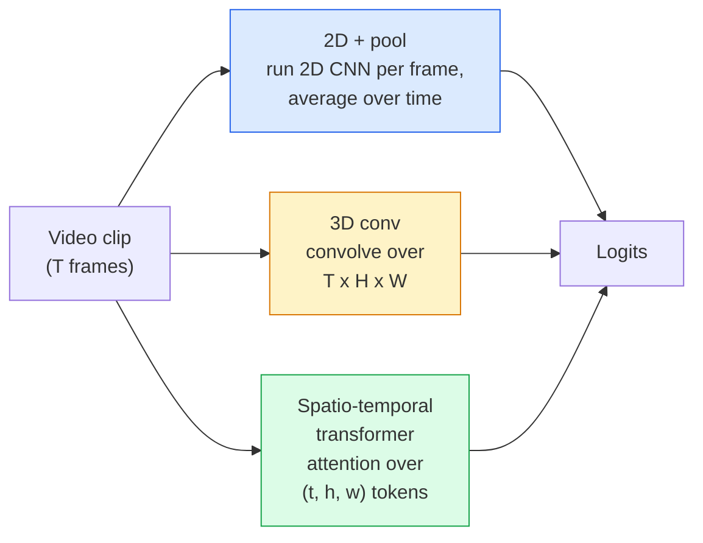

# 12 · 视频理解——时序建模

> 视频是一系列图像，加上把它们连接起来的物理规律。每个视频模型要么把时间当作一个额外的维度轴（3D 卷积），要么当作一个供注意力机制处理的序列（Transformer），要么当作一种只需提取一次再做池化的特征（2D+池化）。

**类型：** 学习 + 构建
**语言：** Python
**前置：** 阶段 4 第 03 课（CNN）、阶段 4 第 04 课（图像分类）
**时长：** 约 45 分钟

## 学习目标

- 区分三大视频建模方法（2D+池化、3D 卷积、时空 Transformer），并预测它们在成本与精度上的权衡
- 在 PyTorch 中实现帧采样、时序池化，以及一个 2D+池化的基线分类器
- 解释为什么 I3D 的「膨胀（inflated）」3D 卷积核能很好地从 ImageNet 权重迁移，以及因式分解的 (2+1)D 卷积有何不同
- 读懂标准的动作识别数据集与指标：Kinetics-400/600、UCF101、Something-Something V2；以及片段（clip）级和视频（video）级的 top-1 精度

## 问题所在

一段 30 秒、30 fps 的视频就是 900 张图像。最朴素的做法是：视频分类就是把图像分类跑 900 次，然后做某种聚合。当动作在几乎每一帧里都可见时（体育、烹饪、健身视频），这种做法奏效；但当动作本身是由运动定义的时候，它就会严重失败：「把某物从左推到右」在每一帧里看上去都只是两个静止的物体。

每种视频架构的核心问题是：时序结构在何时被建模，又是如何被建模的？这个答案决定了其余一切——计算成本、预训练策略、能否复用 ImageNet 权重、模型在哪些数据集上训练。

本课刻意比静态图像各课更短。图像处理的核心机制已经就位，视频理解主要讲的是「时序」这条线索：采样、建模与聚合。

## 核心概念

### 三大架构家族



### 2D + 池化

取一个 2D CNN（ResNet、EfficientNet、ViT），在每一个采样帧上独立运行。对逐帧的嵌入做平均池化（或最大池化，或注意力池化）。把池化后的向量送入分类器。

优点：
- ImageNet 预训练可直接迁移。
- 实现最简单。
- 成本低：T 帧 × 单图推理成本。

缺点：
- 无法建模运动。动作 = 多帧外观的聚合。
- 时序池化对顺序不变；「开门」和「关门」看起来是一样的。

适用场景：以外观为主的任务、在小型视频数据集上做迁移学习、搭建初始基线。

### 3D 卷积

把 2D 的 (H, W) 卷积核替换成 3D 的 (T, H, W) 卷积核。网络同时在空间和时间上做卷积。早期家族：C3D、I3D、SlowFast。

I3D 技巧：取一个预训练好的 2D ImageNet 模型，沿一个新的时间轴复制，把每个 2D 卷积核「膨胀（inflate）」。一个 3x3 的 2D 卷积变成一个 3x3x3 的 3D 卷积。这样 3D 模型就拿到了强力的预训练权重，而不必从零训练。

优点：
- 直接建模运动。
- I3D 膨胀带来免费的迁移学习。

缺点：
- 比对应的 2D 版本多 T/8 的 FLOPs（对于堆叠 3 次、长度为 3 的时序卷积核而言）。
- 时序卷积核很小；长程运动需要金字塔结构或双流（dual-stream）方法。

适用场景：以运动为信号的动作识别（Something-Something V2、Kinetics 中运动占主导的类别）。

### 时空 Transformer

把视频切分成时空块（space-time patch）组成的网格，并在所有块之间做注意力。代表模型：TimeSformer、ViViT、Video Swin、VideoMAE。

值得关注的注意力模式：
- **联合（Joint）** —— 在 (t, h, w) 上做一次大的注意力。复杂度对 `T*H*W` 是二次方；开销大。
- **分离（Divided）** —— 每个块做两次注意力：一次在时间上，一次在空间上。近似线性扩展。
- **因式分解（Factorised）** —— 时间注意力与空间注意力在不同块之间交替进行。

优点：
- 在每个主流基准上都达到最先进（SOTA）精度。
- 通过块膨胀（patch inflation）从图像 Transformer（ViT）迁移。
- 借助稀疏注意力支持长上下文视频。

缺点：
- 计算开销大。
- 需要谨慎选择注意力模式，否则运行时开销会爆炸式增长。

适用场景：大型数据集、高保真视频理解、视频+文本的多模态任务。

### 帧采样

一段 10 秒、30 fps 的片段有 300 帧；把全部 300 帧喂给任何模型都是浪费。标准策略：

- **均匀采样（Uniform sampling）** —— 在片段中均匀地取 T 帧。是 2D+池化的默认做法。
- **密集采样（Dense sampling）** —— 随机选取一个连续的 T 帧窗口。常用于 3D 卷积，因为运动需要相邻的帧。
- **多片段（Multi-clip）** —— 从同一视频中采样多个 T 帧窗口，分别分类，在测试时对预测取平均。

T 通常取 8、16、32 或 64。T 越大 = 时序信号越多，但计算量也越大。

### 评估

两个层级：
- **片段级精度（Clip-level accuracy）** —— 模型看到一个 T 帧片段，报告 top-k。
- **视频级精度（Video-level accuracy）** —— 对每个视频的多个片段级预测取平均；数值更高也更稳定。

始终同时报告两者。一个片段级 78%、视频级 82% 的模型严重依赖测试时的平均；而一个 80% / 81% 的模型在单片段层面更稳健。

### 你会遇到的数据集

- **Kinetics-400 / 600 / 700** —— 通用型动作数据集。40 万个片段；来自 YouTube URL（如今许多已失效）。
- **Something-Something V2** —— 由运动定义的动作（「把 X 从左移到右」）。无法用 2D+池化解决。
- **UCF-101**、**HMDB-51** —— 更老、更小，但仍被用于报告结果。
- **AVA** —— 在空间和时间上的动作*定位（localisation）*；比分类更难。

## 动手构建

### 第 1 步：帧采样器

可作用于帧列表（或视频张量）的均匀采样器与密集采样器。

```python
import numpy as np

def sample_uniform(num_frames_total, T):
    if num_frames_total <= T:
        return list(range(num_frames_total)) + [num_frames_total - 1] * (T - num_frames_total)
    step = num_frames_total / T
    return [int(i * step) for i in range(T)]


def sample_dense(num_frames_total, T, rng=None):
    rng = rng or np.random.default_rng()
    if num_frames_total <= T:
        return list(range(num_frames_total)) + [num_frames_total - 1] * (T - num_frames_total)
    start = int(rng.integers(0, num_frames_total - T + 1))
    return list(range(start, start + T))
```

两者都返回 `T` 个索引，你用它们来切片视频张量。

### 第 2 步：2D+池化基线

在每一帧上运行一个 2D ResNet-18，对特征做平均池化，然后分类。

```python
import torch
import torch.nn as nn
from torchvision.models import resnet18, ResNet18_Weights

class FramePool(nn.Module):
    def __init__(self, num_classes=400, pretrained=True):
        super().__init__()
        weights = ResNet18_Weights.IMAGENET1K_V1 if pretrained else None
        backbone = resnet18(weights=weights)
        self.features = nn.Sequential(*(list(backbone.children())[:-1]))  # 保留全局平均池化
        self.head = nn.Linear(512, num_classes)

    def forward(self, x):
        # x: (N, T, 3, H, W)
        N, T = x.shape[:2]
        x = x.view(N * T, *x.shape[2:])
        feats = self.features(x).view(N, T, -1)
        pooled = feats.mean(dim=1)
        return self.head(pooled)

model = FramePool(num_classes=10)
x = torch.randn(2, 8, 3, 224, 224)
print(f"output: {model(x).shape}")
print(f"params: {sum(p.numel() for p in model.parameters()):,}")
```

一千一百万参数，ImageNet 预训练，逐帧运行，求平均，再分类。在以外观为主的任务上，这个基线常常与正经的 3D 模型只差 5-10 个百分点——有时甚至更好，因为它复用了更强的 ImageNet 主干网络。

### 第 3 步：I3D 风格的膨胀 3D 卷积

通过沿一个新的时间轴重复权重，把单个 2D 卷积变成 3D 卷积。

```python
def inflate_2d_to_3d(conv2d, time_kernel=3):
    out_c, in_c, kh, kw = conv2d.weight.shape
    weight_3d = conv2d.weight.data.unsqueeze(2)  # (out, in, 1, kh, kw)
    weight_3d = weight_3d.repeat(1, 1, time_kernel, 1, 1) / time_kernel
    conv3d = nn.Conv3d(in_c, out_c, kernel_size=(time_kernel, kh, kw),
                        padding=(time_kernel // 2, conv2d.padding[0], conv2d.padding[1]),
                        stride=(1, conv2d.stride[0], conv2d.stride[1]),
                        bias=False)
    conv3d.weight.data = weight_3d
    return conv3d

conv2d = nn.Conv2d(3, 64, kernel_size=3, padding=1, bias=False)
conv3d = inflate_2d_to_3d(conv2d, time_kernel=3)
print(f"2D weight shape:  {tuple(conv2d.weight.shape)}")
print(f"3D weight shape:  {tuple(conv3d.weight.shape)}")
x = torch.randn(1, 3, 8, 56, 56)
print(f"3D output shape:  {tuple(conv3d(x).shape)}")
```

除以 `time_kernel` 能让激活值的幅度大致保持不变——这对于在第一次前向传播时不破坏批归一化（batch-norm）统计量很重要。

### 第 4 步：因式分解的 (2+1)D 卷积

把一个 3D 卷积拆分成一个 2D（空间）卷积和一个 1D（时间）卷积。感受野相同，参数更少，并且在某些基准上精度更好。

```python
class Conv2Plus1D(nn.Module):
    def __init__(self, in_c, out_c, kernel_size=3):
        super().__init__()
        mid_c = (in_c * out_c * kernel_size * kernel_size * kernel_size) \
                // (in_c * kernel_size * kernel_size + out_c * kernel_size)
        self.spatial = nn.Conv3d(in_c, mid_c, kernel_size=(1, kernel_size, kernel_size),
                                 padding=(0, kernel_size // 2, kernel_size // 2), bias=False)
        self.bn = nn.BatchNorm3d(mid_c)
        self.act = nn.ReLU(inplace=True)
        self.temporal = nn.Conv3d(mid_c, out_c, kernel_size=(kernel_size, 1, 1),
                                  padding=(kernel_size // 2, 0, 0), bias=False)

    def forward(self, x):
        return self.temporal(self.act(self.bn(self.spatial(x))))

c = Conv2Plus1D(3, 64)
x = torch.randn(1, 3, 8, 56, 56)
print(f"(2+1)D output: {tuple(c(x).shape)}")
```

一个完整的 R(2+1)D 网络，等价于把 ResNet-18 中每个 3x3 卷积替换为 `Conv2Plus1D`。

## 实战运用

两个库覆盖了生产环境下的视频工作：

- `torchvision.models.video` —— R(2+1)D、MViT、Swin3D，附带预训练的 Kinetics 权重。与图像模型的 API 相同。
- `pytorchvideo`（Meta） —— 模型库，针对 Kinetics / SSv2 / AVA 的数据加载器，以及标准变换（transforms）。

对于视觉-语言视频模型（视频描述、视频问答），使用 `transformers`（`VideoMAE`、`VideoLLaMA`、`InternVideo`）。

## 交付成果

本课产出：

- `outputs/prompt-video-architecture-picker.md` —— 一个提示词，根据「外观 vs 运动」、数据集规模和计算预算，在 2D+池化 / I3D / (2+1)D / Transformer 之间做选择。
- `outputs/skill-frame-sampler-auditor.md` —— 一个技能，检查视频流水线的采样器并标记常见 bug：差一索引错误（off-by-one）、当 `num_frames < T` 时采样不均、缺少保持宽高比的裁剪等。

## 练习

1. **（简单）** 估算 FramePool（T=8）与 I3D 风格的 3D ResNet（T=8）的 FLOPs（近似值）。论证为什么 2D+池化便宜 3-5 倍。
2. **（中等）** 生成一个合成视频数据集：随机的小球沿随机方向运动，按运动方向打标签（「从左到右」「从右到左」「斜向上」）。在其上训练 FramePool。证明它只能达到接近随机猜测的精度，从而说明仅凭外观不足以完成运动任务。
3. **（困难）** 把 ResNet-18 中每个 Conv2d 替换为 `Conv2Plus1D`，构建一个 R(2+1)D-18。用一个 ImageNet 预训练的 ResNet-18 来膨胀第一个卷积的权重。在练习 2 的运动数据集上训练，并超越 FramePool。

## 关键术语

| 术语 | 人们怎么说 | 它实际指什么 |
|------|----------------|----------------------|
| 2D + 池化 | 「逐帧分类器」 | 在每个采样帧上运行一个 2D CNN，沿时间对特征做平均池化，再分类 |
| 3D 卷积 | 「时空卷积核」 | 在 (T, H, W) 上做卷积的卷积核；可原生建模运动 |
| 膨胀（Inflation） | 「把 2D 权重提升到 3D」 | 通过沿新的时间轴重复一个 2D 卷积的权重来初始化 3D 卷积权重，然后除以 kernel_T 以保持激活值的尺度 |
| (2+1)D | 「因式分解卷积」 | 把 3D 拆分为 2D 空间 + 1D 时间；参数更少，且两者之间多了一层非线性 |
| 分离注意力（Divided attention） | 「先时间后空间」 | 每层有两次注意力的 Transformer 块：一次作用于同一帧上的 token，一次作用于同一位置上的 token |
| 片段（Clip） | 「T 帧窗口」 | 由 T 帧组成的采样子序列；是视频模型处理的基本单元 |
| 片段精度 vs 视频精度 | 「两种评估设定」 | 片段 = 每个视频取一个样本，视频 = 对每个视频的多个采样片段取平均 |
| Kinetics | 「视频界的 ImageNet」 | 400-700 个动作类别，30 万+ 个 YouTube 片段，标准的视频预训练语料 |

## 延伸阅读

- [I3D: Quo Vadis, Action Recognition (Carreira & Zisserman, 2017)](https://arxiv.org/abs/1705.07750) —— 提出膨胀方法与 Kinetics 数据集
- [R(2+1)D: A Closer Look at Spatiotemporal Convolutions (Tran et al., 2018)](https://arxiv.org/abs/1711.11248) —— 因式分解卷积，至今仍是一个强基线
- [TimeSformer: Is Space-Time Attention All You Need? (Bertasius et al., 2021)](https://arxiv.org/abs/2102.05095) —— 第一个强大的视频 Transformer
- [VideoMAE (Tong et al., 2022)](https://arxiv.org/abs/2203.12602) —— 面向视频的掩码自编码器（masked autoencoder）预训练；当前主流的预训练方案
