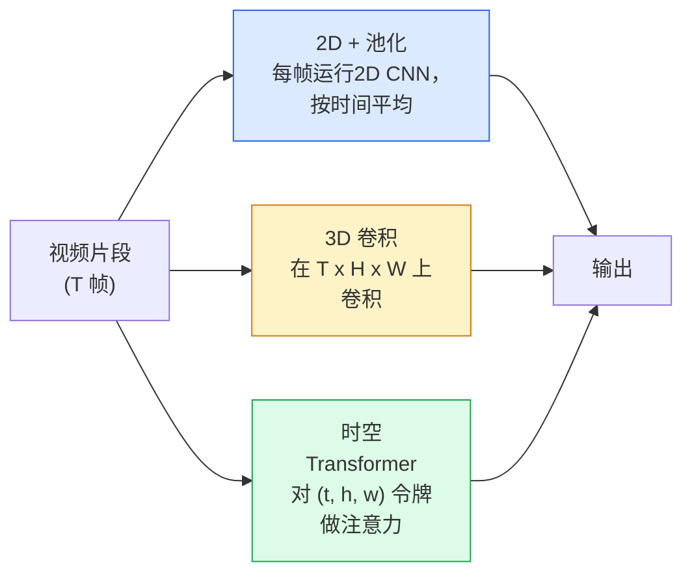

# 视频理解——时间建模

> 视频是一系列图像，加上连接它们的物理规律。每种视频模型要么将时间视为一个额外的轴（3D 卷积），要么视为一个需要关注的序列（Transformer），要么视为一个一次性提取然后池化的特征（2D + 池化）。

**类型：** 学习 + 动手构建  
**语言：** Python  
**前置知识：** 第4阶段第3课（CNN），第4阶段第4课（图像分类）  
**时间：** 约45分钟

## 学习目标

- 区分三种主要的视频建模方法（2D + 池化、3D 卷积、时空 Transformer），并预测它们在成本和精度上的权衡
- 在 PyTorch 中实现帧采样、时间池化以及一个 2D + 池化的基准分类器
- 解释为什么 I3D 的“膨胀”3D 核能够很好地从 ImageNet 权重迁移，以及分解式 (2+1)D 卷积的不同之处
- 了解标准的动作识别数据集和评估指标：Kinetics-400/600、UCF101、Something-Something V2；在片段级别和视频级别的 Top-1 准确率

## 问题

一段 30 秒、30 fps 的视频有 900 帧。直观上，视频分类就是把图像分类运行 900 次，然后进行某种聚合。当动作在几乎每一帧中都可见时（体育、烹饪、锻炼视频），这种方法有效；但当动作本身由运动定义时，它就会严重失效：“把某物从左推到右”在每一帧中都看起来像是两个静止的物体。

每个视频架构的核心问题是：时间结构何时被建模，以及如何建模？答案决定了其他一切——计算成本、预训练策略、能否复用 ImageNet 权重、模型在哪些数据集上训练。

本课特意比静态图像课程更短。核心图像机制已经就位，视频理解主要围绕时间故事展开：采样、建模和聚合。

## 概念

### 三种架构家族



### 2D + 池化

采用一个 2D CNN（ResNet、EfficientNet、ViT）。对每一帧独立运行它。对逐帧嵌入进行平均（或最大池化、注意力池化）。将池化后的向量送入分类器。

优势：
- ImageNet 预训练直接迁移。
- 实现最简单。
- 成本低：T 帧 × 单图推理成本。

劣势：
- 无法建模运动。动作 = 外观的聚合。
- 时间池化与顺序无关；“开门”和“关门”看起来一样。

何时使用：外观密集型任务、在小型视频数据集上进行迁移学习、初始基准。

### 3D 卷积

将 2D (H, W) 核替换为 3D (T, H, W) 核。网络同时在空间和时间上卷积。早期家族：C3D、I3D、SlowFast。

I3D 技巧：取一个预训练的 2D ImageNet 模型，通过沿新时间轴复制每个 2D 核来“膨胀”它。一个 3×3 的 2D 卷积变成 3×3×3 的 3D 卷积。这为 3D 模型提供了强大的预训练权重，而不必从头训练。

优势：
- 直接建模运动。
- I3D 膨胀提供了免费的迁移学习。

劣势：
- FLOPs 是 2D 对应版本的 T/8 倍（对于时间内核大小为 3、堆叠 3 次的情况）。
- 时间内核小；长程运动需要金字塔或双流方法。

何时使用：动作识别中运动是信号的任务（Something-Something V2、包含运动密集型类别的 Kinetics）。

### 时空 Transformer

将视频令牌化为时空网格，并在所有令牌上进行注意力。TimeSformer、ViViT、Video Swin、VideoMAE。

重要的注意力模式：
- **联合（Joint）** — 对 (t, h, w) 进行一次大的注意力。复杂度为 T*H*W 的平方；昂贵。
- **分开（Divided）** — 每个块内两次注意力：一次在时间维度，一次在空间维度。近似线性缩放。
- **分解（Factorised）** — 时间注意力和空间注意力在块之间交替。

优势：
- 在每个主要基准上都达到 SOTA 精度。
- 通过补丁膨胀从图像 Transformer（ViT）迁移。
- 通过稀疏注意力支持长上下文视频。

劣势：
- 计算量大。
- 需要仔细选择注意力模式，否则运行时开销会膨胀。

何时使用：大型数据集、高保真视频理解、多模态视频+文本任务。

### 帧采样

一段 10 秒、30 fps 的片段有 300 帧；把全部 300 帧都送入任何模型都是浪费。标准策略：

- **均匀采样** — 在片段内均匀选取 T 帧。2D + 池化的默认方式。
- **密集采样** — 随机选取连续 T 帧窗口。3D 卷积常用，因为运动需要相邻帧。
- **多片段采样** — 从同一视频中采样多个 T 帧窗口，分别分类，测试时平均预测结果。

T 通常为 8、16、32 或 64。T 越大，时间信号越多，计算量也越大。

### 评估

两个级别：
- **片段级别准确率** — 模型看到一个 T 帧片段，报告 top-k 结果。
- **视频级别准确率** — 对每个视频的多个片段，平均片段级别的预测结果；更高、更稳定。

总是报告两者。一个模型如果得到 78% 片段 / 82% 视频，说明它严重依赖测试时平均；而 80% / 81% 的模型则每个片段更稳健。

### 你会遇到的数据集

- **Kinetics-400 / 600 / 700** — 通用动作数据集。40 万个片段；YouTube 链接（很多现已失效）。
- **Something-Something V2** — 由运动定义的动作（“把 X 从左移到右”）。2D + 池化无法解决。
- **UCF-101**、**HMDB-51** — 较老、较小，但仍被使用。
- **AVA** — 在空间和时间上的动作*定位*；比分类更难。

## 动手构建

### 第一步：帧采样器

均匀采样器和密集采样器，作用于帧列表（或视频张量）。

```python
import numpy as np

def sample_uniform(num_frames_total, T):
    if num_frames_total <= T:
        return list(range(num_frames_total)) + [num_frames_total - 1] * (T - num_frames_total)
    step = num_frames_total / T
    return [int(i * step) for i in range(T)]


def sample_dense(num_frames_total, T, rng=None):
    rng = rng or np.random.default_rng()
    if num_frames_total <= T:
        return list(range(num_frames_total)) + [num_frames_total - 1] * (T - num_frames_total)
    start = int(rng.integers(0, num_frames_total - T + 1))
    return list(range(start, start + T))
```

两者都返回 `T` 个索引，用于切片视频张量。

### 第二步：2D + 池化基准

对每一帧运行 2D ResNet-18，平均池化特征并分类。

```python
import torch
import torch.nn as nn
from torchvision.models import resnet18, ResNet18_Weights

class FramePool(nn.Module):
    def __init__(self, num_classes=400, pretrained=True):
        super().__init__()
        weights = ResNet18_Weights.IMAGENET1K_V1 if pretrained else None
        backbone = resnet18(weights=weights)
        self.features = nn.Sequential(*(list(backbone.children())[:-1]))  # 保留全局平均池化
        self.head = nn.Linear(512, num_classes)

    def forward(self, x):
        # x: (N, T, 3, H, W)
        N, T = x.shape[:2]
        x = x.view(N * T, *x.shape[2:])
        feats = self.features(x).view(N, T, -1)
        pooled = feats.mean(dim=1)
        return self.head(pooled)

model = FramePool(num_classes=10)
x = torch.randn(2, 8, 3, 224, 224)
print(f"output: {model(x).shape}")
print(f"params: {sum(p.numel() for p in model.parameters()):,}")
```

1100 万参数，ImageNet 预训练，逐帧运行，平均，分类。在外观密集型任务上，这个基准通常仅比真正的 3D 模型差 5-10 个点——有时更好，因为它复用了更强的 ImageNet 骨干网络。

### 第三步：I3D 风格的膨胀 3D 卷积

通过沿新时间轴重复权重，将单个 2D 卷积变成 3D 卷积。

```python
def inflate_2d_to_3d(conv2d, time_kernel=3):
    out_c, in_c, kh, kw = conv2d.weight.shape
    weight_3d = conv2d.weight.data.unsqueeze(2)  # (out, in, 1, kh, kw)
    weight_3d = weight_3d.repeat(1, 1, time_kernel, 1, 1) / time_kernel
    conv3d = nn.Conv3d(in_c, out_c, kernel_size=(time_kernel, kh, kw),
                        padding=(time_kernel // 2, conv2d.padding[0], conv2d.padding[1]),
                        stride=(1, conv2d.stride[0], conv2d.stride[1]),
                        bias=False)
    conv3d.weight.data = weight_3d
    return conv3d

conv2d = nn.Conv2d(3, 64, kernel_size=3, padding=1, bias=False)
conv3d = inflate_2d_to_3d(conv2d, time_kernel=3)
print(f"2D 权重形状:  {tuple(conv2d.weight.shape)}")
print(f"3D 权重形状:  {tuple(conv3d.weight.shape)}")
x = torch.randn(1, 3, 8, 56, 56)
print(f"3D 输出形状:  {tuple(conv3d(x).shape)}")
```

除以 `time_kernel` 可以保持激活值的量级大致不变——这对在第一次前向传播时不破坏批归一化统计量很重要。

### 第四步：分解式 (2+1)D 卷积

将 3D 卷积拆分为 2D（空间）卷积和 1D（时间）卷积。相同的感受野，更少的参数，在某些基准上精度更高。

```python
class Conv2Plus1D(nn.Module):
    def __init__(self, in_c, out_c, kernel_size=3):
        super().__init__()
        mid_c = (in_c * out_c * kernel_size * kernel_size * kernel_size) \
                // (in_c * kernel_size * kernel_size + out_c * kernel_size)
        self.spatial = nn.Conv3d(in_c, mid_c, kernel_size=(1, kernel_size, kernel_size),
                                 padding=(0, kernel_size // 2, kernel_size // 2), bias=False)
        self.bn = nn.BatchNorm3d(mid_c)
        self.act = nn.ReLU(inplace=True)
        self.temporal = nn.Conv3d(mid_c, out_c, kernel_size=(kernel_size, 1, 1),
                                  padding=(kernel_size // 2, 0, 0), bias=False)

    def forward(self, x):
        return self.temporal(self.act(self.bn(self.spatial(x))))

c = Conv2Plus1D(3, 64)
x = torch.randn(1, 3, 8, 56, 56)
print(f"(2+1)D 输出: {tuple(c(x).shape)}")
```

完整的 R(2+1)D 网络与 ResNet-18 相同，只是每个 3×3 卷积被替换为 `Conv2Plus1D`。

## 使用它

两个库涵盖了生产级视频工作：

- `torchvision.models.video` — 带有 Kinetics 预训练权重的 R(2+1)D、MViT、Swin3D。API 与图像模型相同。
- `pytorchvideo`（Meta） — 模型动物园、Kinetics / SSv2 / AVA 的数据加载器、标准变换。

对于视觉-语言视频模型（视频字幕、视频问答），使用 `transformers`（`VideoMAE`、`VideoLLaMA`、`InternVideo`）。

## 交付物

本课产出：

- `outputs/prompt-video-architecture-picker.md` — 一个提示，根据外观 vs 运动、数据集大小和计算预算来选择 2D + 池化 / I3D / (2+1)D / Transformer。
- `outputs/skill-frame-sampler-auditor.md` — 一种技能，用于检查视频管道的采样器并标记常见错误：索引差一、当 `num_frames < T` 时不均匀采样、缺少保持宽高比的裁剪等。

## 练习

1. **(简单)** 估算 FramePool (T=8) 与 I3D 风格的 3D ResNet (T=8) 的 FLOPs（近似值）。说明为什么 2D + 池化便宜 3-5 倍。
2. **(中等)** 生成一个合成视频数据集：随机方向运动的随机球体，按运动方向标记（“从左到右”、“从右到左”、“对角线向上