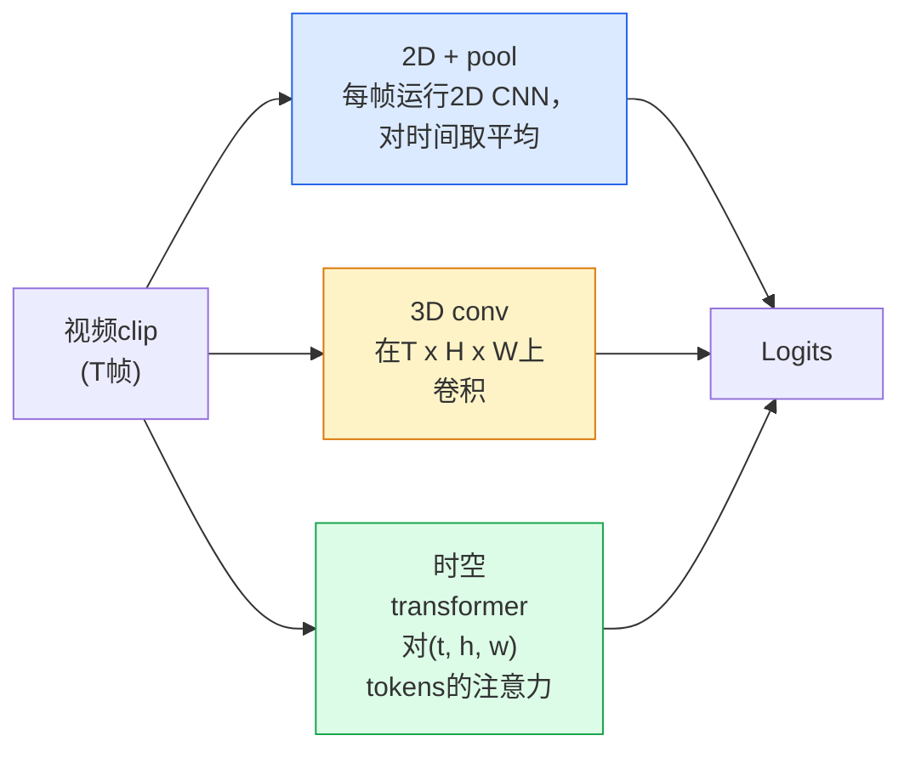

# 视频理解 — 时间建模

> 视频是一个图像序列加上连接它们的物理规律。每个视频模型要么将时间视为额外轴（3D conv），要么视为要关注的序列（transformer），要么视为提取一次然后池化的特征（2D+pool）。

**类型：** 学习+构建
**语言：** Python
**前置条件：** 阶段4 第03课（CNN），阶段4 第04课（图像分类）
**时间：** ~45分钟

## 学习目标

- 区分三种主要的视频建模方法（2D+pool、3D conv、时空transformer），并预测它们的成本和精度权衡
- 在PyTorch中实现帧采样、时间池化和2D+pool基线分类器
- 解释为什么I3D的"膨胀"3D kernel能从ImageNet权重很好地迁移，以及因子化(2+1)D conv做了哪些不同的事情
- 阅读标准动作识别数据集和指标：Kinetics-400/600、UCF101、Something-Something V2；clip级别和视频级别的top-1准确率

## 问题

一个30秒、30 fps的视频是900张图像。天真地看，视频分类是对900张图像分别运行图像分类，然后进行某种聚合。当动作在几乎每一帧中都可见时（体育、烹饪、健身视频），这样做有效；但当动作由运动本身定义时则完全失败："从左边推到右边"在每一帧中看起来都是两个静止的物体。

每个视频架构的核心问题是：时间结构何时被建模，以及如何建模？答案驱动其他一切——计算成本、预训练策略、是否可以使用ImageNet权重、模型在哪些数据集上训练。

本课特意比静态图像课程更短。核心图像机制已经就位，视频理解主要是关于时间的故事：采样、建模和聚合。

## 概念

### 三个架构家族


```mermaid
flowchart LR
    V["视频clip<br/>(T帧)"] --> A1["2D + pool<br/>每帧运行2D CNN，<br/>对时间取平均"]
    V --> A2["3D conv<br/>在T x H x W上<br/>卷积"]
    V --> A3["时空<br/>transformer<br/>对(t, h, w)<br/>tokens的注意力"]

    A1 --> C["Logits"]
    A2 --> C
    A3 --> C

    style A1 fill:#dbeafe,stroke:#2563eb
    style A2 fill:#fef3c7,stroke:#d97706
    style A3 fill:#dcfce7,stroke:#16a34a
```

### 2D + pool

取一个2D CNN（ResNet、EfficientNet、ViT）。在每个采样帧上独立运行。对每帧嵌入取平均（或max-pool、或attention-pool）。将池化后的向量馈送到分类器。

优点：
- ImageNet预训练直接迁移。
- 最容易实现。
- 便宜：T帧 * 单张图像推理成本。

缺点：
- 无法建模运动。动作 = 外观的聚合。
- 时间池化是顺序无关的；"开门"和"关门"看起来一样。

何时使用：外观密集型任务、小视频数据集上的迁移学习、初始基线。

### 3D卷积

将2D (H, W) kernel替换为3D (T, H, W) kernel。网络同时在空间和时间上卷积。早期家族：C3D、I3D、SlowFast。

I3D技巧：取一个预训练的2D ImageNet模型，通过沿新时间轴复制每个2D kernel来"膨胀"它。一个3x3 2D conv变成一个3x3x3 3D conv。这为3D模型提供了强大的预训练权重，而不是从头训练。

优点：
- 直接建模运动。
- I3D膨胀免费提供迁移学习。

缺点：
- 比2D对应模型多T/8的FLOPs（对于3个堆叠的时间kernel 3）。
- 时间kernel很小；长程运动需要金字塔或双流方法。

何时使用：运动是信号的动作识别（Something-Something V2、包含运动密集型类别的Kinetics）。

### 时空transformers

将视频tokens化为时空补丁网格，并关注所有补丁。TimeSformer、ViViT、Video Swin、VideoMAE。

重要的注意力模式：
- **Joint** — 对(t, h, w)的一次大注意力。在`T*H*W`中为二次方；昂贵。
- **Divided** — 每个块两次注意力：一次在时间上，一次在空间上。近似线性缩放。
- **Factorised** — 时间注意力与空间注意力在块间交替。

优点：
- 在每个主要基准上都是SOTA准确率。
- 通过补丁膨胀从图像transformer（ViT）迁移。
- 通过稀疏注意力支持长上下文视频。

缺点：
- 计算密集。
- 需要仔细选择注意力模式，否则运行时会暴增。

何时使用：大数据集、高保真视频理解、多模态视频+文本任务。

### 帧采样

一个10秒、30 fps的片段是300帧；将所有300帧馈送给任何模型都是浪费。标准策略：

- **均匀采样** — 在片段中均匀选取T帧。2D+pool的默认选择。
- **密集采样** — 随机连续的T帧窗口。3D conv的常见选择，因为运动需要相邻帧。
- **多clip** — 从同一视频采样多个T帧窗口，分别分类，测试时平均预测。

T通常为8、16、32或64。T越大 = 更多时间信号，更多计算。

### 评估

两个级别：
- **Clip级别准确率** — 模型看到一个T帧clip，报告top-k。
- **视频级别准确率** — 跨每个视频的多个clip平均clip级别预测；更高且更稳定。

始终报告两者。一个得分为78% clip / 82% video的模型严重依赖测试时平均；一个得分为80% / 81%的模型每个clip更鲁棒。

### 你会遇到的数据集

- **Kinetics-400 / 600 / 700** — 通用动作数据集。40万个clip；YouTube URL（许多现已失效）。
- **Something-Something V2** — 运动定义的动作（"将X从左边移动到右边"）。无法由2D+pool解决。
- **UCF-101**、**HMDB-51** — 更老、更小、仍被报告。
- **AVA** — 空间和时间中的动作*定位*；比分类更难。

## 构建

### 第1步：帧采样器

在帧列表（或视频张量）上工作的均匀和密集采样器。

```python
import numpy as np

def sample_uniform(num_frames_total, T):
    if num_frames_total <= T:
        return list(range(num_frames_total)) + [num_frames_total - 1] * (T - num_frames_total)
    step = num_frames_total / T
    return [int(i * step) for i in range(T)]


def sample_dense(num_frames_total, T, rng=None):
    rng = rng or np.random.default_rng()
    if num_frames_total <= T:
        return list(range(num_frames_total)) + [num_frames_total - 1] * (T - num_frames_total)
    start = int(rng.integers(0, num_frames_total - T + 1))
    return list(range(start, start + T))
```

两者返回`T`个索引，用于切片视频张量。

### 第2步：2D+pool基线

在每帧上运行2D ResNet-18，平均池化特征，分类。

```python
import torch
import torch.nn as nn
from torchvision.models import resnet18, ResNet18_Weights

class FramePool(nn.Module):
    def __init__(self, num_classes=400, pretrained=True):
        super().__init__()
        weights = ResNet18_Weights.IMAGENET1K_V1 if pretrained else None
        backbone = resnet18(weights=weights)
        self.features = nn.Sequential(*(list(backbone.children())[:-1]))  # 保留全局平均池化
        self.head = nn.Linear(512, num_classes)

    def forward(self, x):
        # x: (N, T, 3, H, W)
        N, T = x.shape[:2]
        x = x.view(N * T, *x.shape[2:])
        feats = self.features(x).view(N, T, -1)
        pooled = feats.mean(dim=1)
        return self.head(pooled)

model = FramePool(num_classes=10)
x = torch.randn(2, 8, 3, 224, 224)
print(f"output: {model(x).shape}")
print(f"params: {sum(p.numel() for p in model.parameters()):,}")
```

一千一百万个参数，ImageNet预训练，逐帧运行，平均，分类。这个基线在外观密集型任务上通常与正确3D模型相差5-10个点——有时更好，因为它复用了更强的ImageNet backbone。

### 第3步：I3D风格的膨胀3D conv

通过沿新时间轴重复权重，将单个2D conv转换为3D conv。

```python
def inflate_2d_to_3d(conv2d, time_kernel=3):
    out_c, in_c, kh, kw = conv2d.weight.shape
    weight_3d = conv2d.weight.data.unsqueeze(2)  # (out, in, 1, kh, kw)
    weight_3d = weight_3d.repeat(1, 1, time_kernel, 1, 1) / time_kernel
    conv3d = nn.Conv3d(in_c, out_c, kernel_size=(time_kernel, kh, kw),
                        padding=(time_kernel // 2, conv2d.padding[0], conv2d.padding[1]),
                        stride=(1, conv2d.stride[0], conv2d.stride[1]),
                        bias=False)
    conv3d.weight.data = weight_3d
    return conv3d

conv2d = nn.Conv2d(3, 64, kernel_size=3, padding=1, bias=False)
conv3d = inflate_2d_to_3d(conv2d, time_kernel=3)
print(f"2D weight shape:  {tuple(conv2d.weight.shape)}")
print(f"3D weight shape:  {tuple(conv3d.weight.shape)}")
x = torch.randn(1, 3, 8, 56, 56)
print(f"3D output shape:  {tuple(conv3d(x).shape)}")
```

除以`time_kernel`保持激活幅度大致恒定——对于不在第一次前向传播中破坏batch-norm统计量很重要。

### 第4步：因子化(2+1)D conv

将3D conv拆分为2D（空间）和1D（时间）conv。相同的感受野，更少的参数，在某些基准上更好的准确率。

```python
class Conv2Plus1D(nn.Module):
    def __init__(self, in_c, out_c, kernel_size=3):
        super().__init__()
        mid_c = (in_c * out_c * kernel_size * kernel_size * kernel_size) \
                // (in_c * kernel_size * kernel_size + out_c * kernel_size)
        self.spatial = nn.Conv3d(in_c, mid_c, kernel_size=(1, kernel_size, kernel_size),
                                 padding=(0, kernel_size // 2, kernel_size // 2), bias=False)
        self.bn = nn.BatchNorm3d(mid_c)
        self.act = nn.ReLU(inplace=True)
        self.temporal = nn.Conv3d(mid_c, out_c, kernel_size=(kernel_size, 1, 1),
                                  padding=(kernel_size // 2, 0, 0), bias=False)

    def forward(self, x):
        return self.temporal(self.act(self.bn(self.spatial(x))))

c = Conv2Plus1D(3, 64)
x = torch.randn(1, 3, 8, 56, 56)
print(f"(2+1)D output: {tuple(c(x).shape)}")
```

完整的R(2+1)D网络与将每个3x3 conv替换为`Conv2Plus1D`的ResNet-18相同。

## 使用

两个库覆盖生产级视频工作：

- `torchvision.models.video` — R(2+1)D、MViT、Swin3D，带有Kinetics预训练权重。与图像模型相同的API。
- `pytorchvideo`（Meta） — 模型动物园、Kinetics / SSv2 / AVA的数据加载器、标准变换。

对于视觉-语言视频模型（视频字幕、视频问答），使用`transformers`（`VideoMAE`、`VideoLLaMA`、`InternVideo`）。

## 交付物

本课产出：

- `outputs/prompt-video-architecture-picker.md` — 一个prompt，根据外观vs运动、数据集大小和计算预算选择2D+pool / I3D / (2+1)D / transformer。
- `outputs/skill-frame-sampler-auditor.md` — 一个技能，检查视频pipeline的采样器并标记常见bug：索引差一、`num_frames < T`时的不均匀采样、缺乏保持宽高比的裁剪等。

## 练习

1. **(简单)** 计算FramePool（T=8）与I3D风格3D ResNet（T=8）的近似FLOPs。证明为什么2D+pool便宜3-5倍。
2. **(中等)** 生成合成视频数据集：随机方向移动的随机球，按运动方向标记（"从左到右"、"从右到左"、"对角线向上"）。在其上训练FramePool。展示它达到接近随机的准确率，证明仅外观对运动任务不够。
3. **(困难)** 通过将ResNet-18中的每个Conv2d替换为`Conv2Plus1D`构建R(2+1)D-18。从ImageNet预训练的ResNet-18膨胀第一个conv的权重。在练习2的运动数据集上训练并击败FramePool。

## 关键术语

| 术语 | 人们的说法 | 实际含义 |
|------|----------------|----------------------|
| 2D + pool | "逐帧分类器" | 在每个采样帧上运行2D CNN，跨时间平均池化特征，分类 |
| 3D convolution | "时空kernel" | 在(T, H, W)上卷积的kernel；可以原生建模运动 |
| Inflation | "将2D权重提升到3D" | 通过沿新时间轴重复2D conv的权重来初始化3D conv权重，然后除以kernel_T以保持激活尺度 |
| (2+1)D | "因子化conv" | 将3D拆分为2D空间 + 1D时间；参数更少，之间有额外非线性 |
| Divided attention | "时间然后空间" | 每层有两个注意力的transformer块：一个关注同帧的tokens，一个关注同位置的tokens |
| Clip | "T帧窗口" | T帧的采样子序列；视频模型消费的单元 |
| Clip vs video accuracy | "两种评估设置" | Clip = 每个视频一个样本，video = 跨多个采样clip的平均 |
| Kinetics | "视频的ImageNet" | 400-700个动作类别，30万+个YouTube clip，标准视频预训练语料库 |

## 延伸阅读

- [I3D: Quo Vadis, Action Recognition (Carreira & Zisserman, 2017)](https://arxiv.org/abs/1705.07750) — 引入膨胀和Kinetics数据集
- [R(2+1)D: A Closer Look at Spatiotemporal Convolutions (Tran et al., 2018)](https://arxiv.org/abs/1711.11248) — 因子化conv，仍然是强基线
- [TimeSformer: Is Space-Time Attention All You Need? (Bertasius et al., 2021)](https://arxiv.org/abs/2102.05095) — 第一个强大的视频transformer
- [VideoMAE (Tong et al., 2022)](https://arxiv.org/abs/2203.12602) — 视频的掩码自编码器预训练；当前主导的预训练方法
